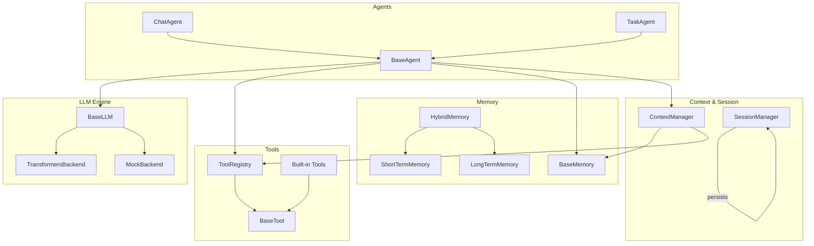
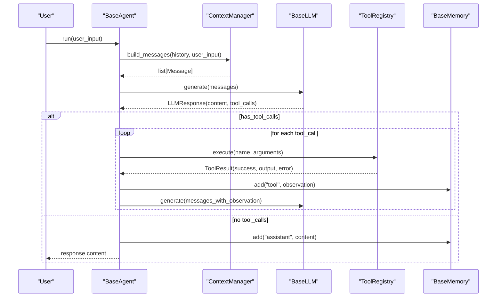
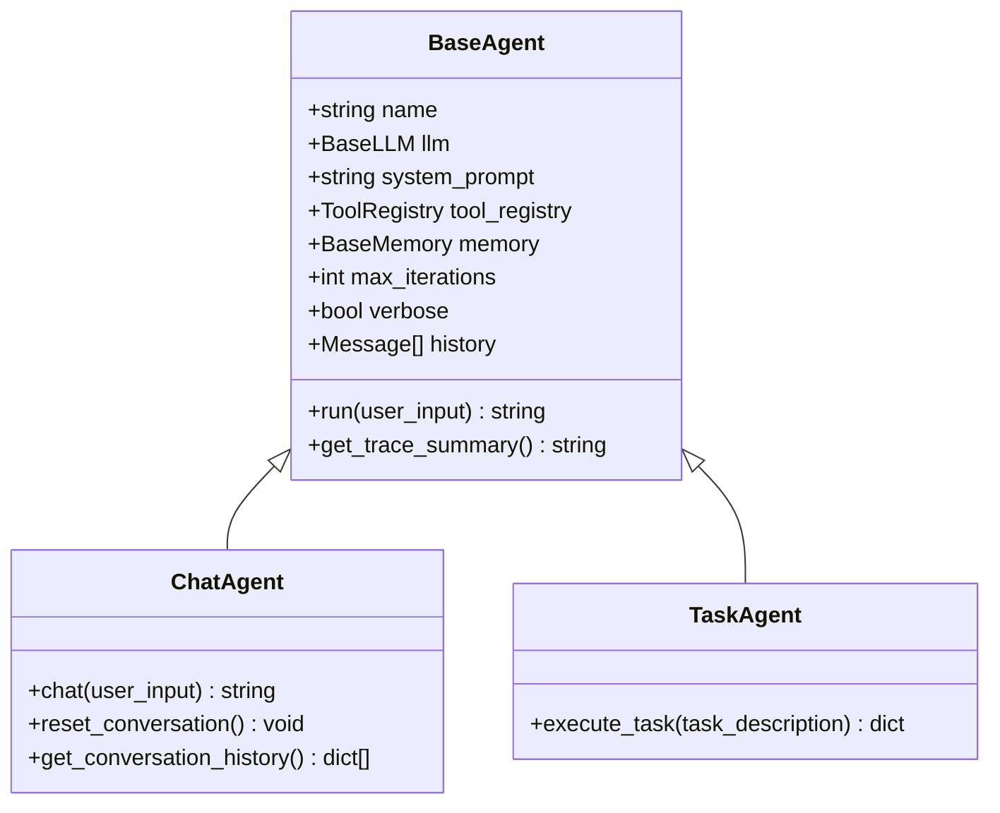
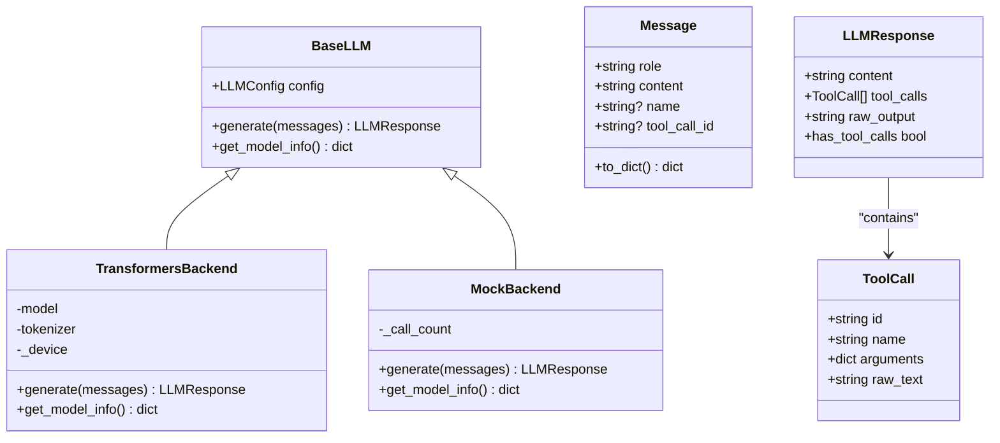
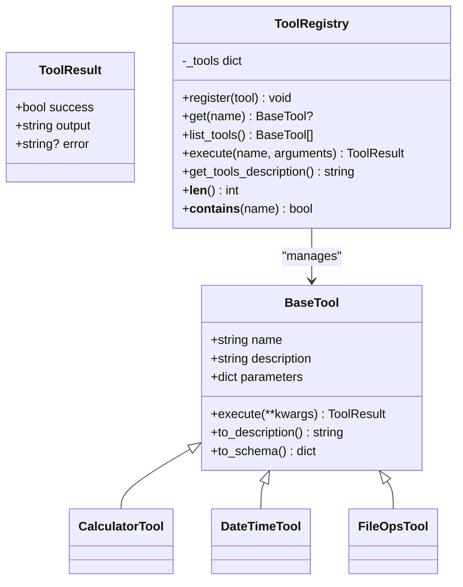
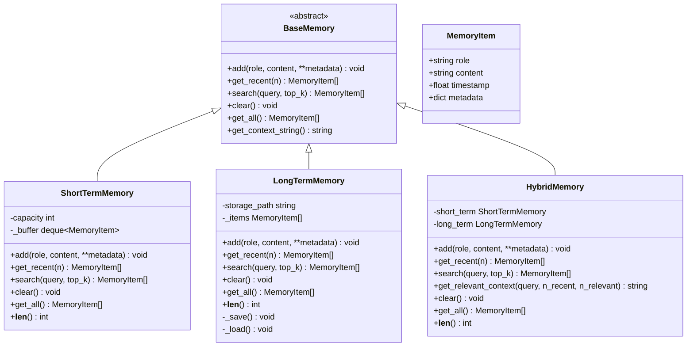
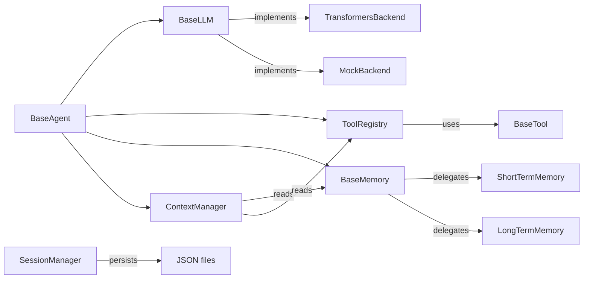

# API Reference

<cite>
**Referenced Files in This Document**
- [harness/__init__.py](file://harness/__init__.py)
- [harness/config.py](file://harness/config.py)
- [harness/llm/engine.py](file://harness/llm/engine.py)
- [harness/context/manager.py](file://harness/context/manager.py)
- [harness/memory/base.py](file://harness/memory/base.py)
- [harness/memory/hybrid.py](file://harness/memory/hybrid.py)
- [harness/memory/short_term.py](file://harness/memory/short_term.py)
- [harness/memory/long_term.py](file://harness/memory/long_term.py)
- [harness/tools/base.py](file://harness/tools/base.py)
- [harness/tools/registry.py](file://harness/tools/registry.py)
- [harness/tools/builtin.py](file://harness/tools/builtin.py)
- [harness/session/manager.py](file://harness/session/manager.py)
- [harness/agent/base.py](file://harness/agent/base.py)
- [harness/agent/chat.py](file://harness/agent/chat.py)
- [harness/agent/task.py](file://harness/agent/task.py)
</cite>

## Table of Contents
1. Introduction
2. Project Structure
3. Core Components
4. Architecture Overview
5. Detailed Component Analysis
6. Dependency Analysis
7. Performance Considerations
8. Troubleshooting Guide
9. Conclusion

## Introduction
This document provides a comprehensive API reference for the HarnessAIDemo framework, focusing on public interfaces and extension points. It covers agent base classes, LLM engine interfaces, tool base classes, memory interfaces, context manager APIs, session management methods, configuration objects, data models, and utility functions. For each class, it specifies constructor parameters, method signatures, return types, usage patterns, inheritance hierarchies, abstract methods, and implementation guidelines to extend the framework.

## Project Structure
The framework is organized into modular components:
- Agent layer: BaseAgent, ChatAgent, TaskAgent
- LLM engine: BaseLLM with TransformersBackend and MockBackend
- Tools: BaseTool, ToolRegistry, built-in tools
- Memory: BaseMemory with ShortTermMemory, LongTermMemory, HybridMemory
- Context: ContextManager for assembling prompts
- Session: SessionManager for multi-session state
- Configuration: LLMConfig, MemoryConfig, AgentConfig, HarnessConfig

**Diagram sources**
- [harness/agent/base.py:63-165](file://harness/agent/base.py#L63-L165)
- [harness/agent/chat.py:25-60](file://harness/agent/chat.py#L25-L60)
- [harness/agent/task.py:32-73](file://harness/agent/task.py#L32-L73)
- [harness/llm/engine.py:127-421](file://harness/llm/engine.py#L127-L421)
- [harness/tools/base.py:30-67](file://harness/tools/base.py#L30-L67)
- [harness/tools/registry.py:17-74](file://harness/tools/registry.py#L17-L74)
- [harness/memory/base.py:27-64](file://harness/memory/base.py#L27-L64)
- [harness/memory/short_term.py:16-50](file://harness/memory/short_term.py#L16-L50)
- [harness/memory/long_term.py:24-109](file://harness/memory/long_term.py#L24-L109)
- [harness/memory/hybrid.py:22-84](file://harness/memory/hybrid.py#L22-L84)
- [harness/context/manager.py:41-118](file://harness/context/manager.py#L41-L118)
- [harness/session/manager.py:71-146](file://harness/session/manager.py#L71-L146)

**Section sources**
- [harness/__init__.py:1-16](file://harness/__init__.py#L1-L16)

## Core Components
This section summarizes the core public APIs and their roles:
- Agents: orchestrate the execution loop, manage history, and interact with LLMs and tools
- LLM Engine: abstract interface for model backends; factory to create backends from config
- Tools: define capabilities via BaseTool; registry manages availability and execution
- Memory: stores conversation context and persistent knowledge; hybrid combines short-term and long-term
- Context Manager: assembles system prompt, tool descriptions, memory context, and messages
- Session Manager: persists and switches between independent conversations

Key configuration objects:
- LLMConfig: backend selection, model name, generation parameters, device
- MemoryConfig: capacity flags, persistence path, retrieval thresholds
- AgentConfig: agent persona, iteration limits, verbosity
- HarnessConfig: top-level aggregation with defaults

**Section sources**
- [harness/config.py:8-70](file://harness/config.py#L8-L70)
- [harness/llm/engine.py:23-57](file://harness/llm/engine.py#L23-L57)
- [harness/agent/base.py:63-165](file://harness/agent/base.py#L63-L165)
- [harness/tools/base.py:16-67](file://harness/tools/base.py#L16-L67)
- [harness/memory/base.py:18-64](file://harness/memory/base.py#L18-L64)
- [harness/context/manager.py:41-118](file://harness/context/manager.py#L41-L118)
- [harness/session/manager.py:32-146](file://harness/session/manager.py#L32-L146)

## Architecture Overview
The harness orchestrates an agent loop that builds context, calls the LLM, executes tool calls when requested, and returns final answers. The ContextManager composes prompts using system instructions, tool descriptions, memory context, and conversation history. Sessions isolate state across multiple conversations.

**Diagram sources**
- [harness/agent/base.py:97-165](file://harness/agent/base.py#L97-L165)
- [harness/context/manager.py:61-109](file://harness/context/manager.py#L61-L109)
- [harness/llm/engine.py:127-147](file://harness/llm/engine.py#L127-L147)
- [harness/tools/registry.py:43-67](file://harness/tools/registry.py#L43-L67)
- [harness/memory/base.py:30-53](file://harness/memory/base.py#L30-L53)

## Detailed Component Analysis

### Agent Base Classes
- BaseAgent
  - Constructor parameters:
    - name: str (default "Agent")
    - llm: Optional[BaseLLM]
    - system_prompt: str (default helpful assistant instruction)
    - tool_registry: Optional[ToolRegistry]
    - memory: Optional[BaseMemory]
    - max_iterations: int (default 10)
    - verbose: bool (default True)
  - Key methods:
    - run(user_input: str) -> str: Executes the agent loop, building context, calling LLM, handling tool calls, storing results, and returning final answer or fallback after max iterations
    - get_trace_summary() -> str: Returns trace summary string
  - Inheritance: Base class for ChatAgent and TaskAgent
  - Usage pattern: Instantiate with LLM, optional tools and memory; call run for each turn
  - Error handling: Logs raw outputs; handles tool errors by appending observations; returns fallback message if max iterations reached

- ChatAgent
  - Extends BaseAgent with conversational focus
  - Constructor parameters:
    - llm: BaseLLM
    - system_prompt: str (default friendly assistant prompt)
    - tool_registry: Optional[ToolRegistry]
    - memory: Optional[BaseMemory]
    - name: str (default "ChatBot")
  - Methods:
    - chat(user_input: str) -> str: Convenience wrapper around run
    - reset_conversation() -> None: Clears short-term history while preserving long-term memory
    - get_conversation_history() -> list[dict]: Returns history as role/content dicts
  - Usage pattern: Ideal for interactive multi-turn dialogue

- TaskAgent
  - Extends BaseAgent for task completion workflows
  - Constructor parameters:
    - llm: BaseLLM
    - name: str (default "TaskAgent")
    - tool_registry: Optional[ToolRegistry]
    - memory: Optional[BaseMemory]
    - max_iterations: int (default 15)
    - verbose: bool (default True)
  - Methods:
    - execute_task(task_description: str) -> dict: Runs the agent and returns structured result with success, result, and task fields
  - Usage pattern: Use when tasks require multi-step tool usage and structured outputs

**Diagram sources**
- [harness/agent/base.py:63-165](file://harness/agent/base.py#L63-L165)
- [harness/agent/chat.py:25-60](file://harness/agent/chat.py#L25-L60)
- [harness/agent/task.py:32-73](file://harness/agent/task.py#L32-L73)

**Section sources**
- [harness/agent/base.py:63-165](file://harness/agent/base.py#L63-L165)
- [harness/agent/chat.py:25-60](file://harness/agent/chat.py#L25-L60)
- [harness/agent/task.py:32-73](file://harness/agent/task.py#L32-L73)

### LLM Engine Interfaces
- Data Models
  - Message(role: str, content: str, name: Optional[str], tool_call_id: Optional[str])
    - to_dict() -> dict: Converts to dictionary suitable for tokenization
  - ToolCall(id: str, name: str, arguments: dict, raw_text: str = "")
  - LLMResponse(content: str = "", tool_calls: list[ToolCall] = [], raw_output: str = "")
    - has_tool_calls: bool property indicating presence of tool calls

- Abstract Interface
  - BaseLLM(config: LLMConfig)
    - generate(messages: list[Message]) -> LLMResponse: Abstract method to produce responses
    - get_model_info() -> dict: Abstract method to return backend info

- Implementations
  - TransformersBackend(config: LLMConfig)
    - Loads model/tokenizer from HuggingFace, applies chat template, generates tokens, parses tool calls
    - generate(messages) -> LLMResponse: Applies tokenizer, runs model.generate, decodes new tokens, parses tool calls, returns structured response
    - get_model_info() -> dict: Returns backend type, model name, device, max tokens
  - MockBackend(config: LLMConfig)
    - Deterministic mock for demos/testing without GPU
    - generate(messages) -> LLMResponse: Pattern-matches user input to simulate tool calls or direct answers
    - get_model_info() -> dict: Returns mock backend info

- Factory
  - create_llm(config: Optional[LLMConfig] = None) -> BaseLLM: Chooses backend based on config.backend ("mock" or "transformers"); raises ValueError for unknown backend

**Diagram sources**
- [harness/llm/engine.py:23-57](file://harness/llm/engine.py#L23-L57)
- [harness/llm/engine.py:127-147](file://harness/llm/engine.py#L127-L147)
- [harness/llm/engine.py:151-249](file://harness/llm/engine.py#L151-L249)
- [harness/llm/engine.py:254-400](file://harness/llm/engine.py#L254-L400)
- [harness/llm/engine.py:404-421](file://harness/llm/engine.py#L404-L421)

**Section sources**
- [harness/llm/engine.py:23-57](file://harness/llm/engine.py#L23-L57)
- [harness/llm/engine.py:127-147](file://harness/llm/engine.py#L127-L147)
- [harness/llm/engine.py:151-249](file://harness/llm/engine.py#L151-L249)
- [harness/llm/engine.py:254-400](file://harness/llm/engine.py#L254-L400)
- [harness/llm/engine.py:404-421](file://harness/llm/engine.py#L404-L421)

### Tool Base Classes and Registry
- BaseTool
  - Class attributes:
    - name: str
    - description: str
    - parameters: dict
  - Abstract method:
    - execute(**kwargs) -> ToolResult: Implement tool logic
  - Utility methods:
    - to_description() -> str: Generates human-readable description for system prompt
    - to_schema() -> dict: Produces JSON schema-like dict for tool metadata

- ToolResult
  - Attributes:
    - success: bool
    - output: str
    - error: Optional[str]

- ToolRegistry
  - Methods:
    - register(tool: BaseTool) -> None: Adds tool to registry
    - get(name: str) -> Optional[BaseTool]: Retrieves tool by name
    - list_tools() -> list[BaseTool]: Lists all registered tools
    - execute(name: str, arguments: dict) -> ToolResult: Executes tool with error handling
    - get_tools_description() -> str: Combines tool descriptions for system prompt
    - __len__(), __contains__()

- Built-in Tools
  - CalculatorTool: Evaluates safe math expressions
  - DateTimeTool: Provides current date/time information
  - FileOpsTool: Read-only file operations (list directory, read file)
  - register_default_tools(registry) -> None: Registers built-in tools

**Diagram sources**
- [harness/tools/base.py:16-67](file://harness/tools/base.py#L16-L67)
- [harness/tools/registry.py:17-74](file://harness/tools/registry.py#L17-L74)
- [harness/tools/builtin.py:13-83](file://harness/tools/builtin.py#L13-L83)

**Section sources**
- [harness/tools/base.py:16-67](file://harness/tools/base.py#L16-L67)
- [harness/tools/registry.py:17-74](file://harness/tools/registry.py#L17-L74)
- [harness/tools/builtin.py:13-83](file://harness/tools/builtin.py#L13-L83)

### Memory Interfaces and Implementations
- BaseMemory
  - Abstract methods:
    - add(role: str, content: str, **metadata) -> None
    - get_recent(n: int) -> list[MemoryItem]
    - search(query: str, top_k: int = 5) -> list[MemoryItem]
    - clear() -> None
    - get_all() -> list[MemoryItem]
  - Utility:
    - get_context_string() -> str: Formats recent memory for prompts

- MemoryItem
  - Attributes:
    - role: str
    - content: str
    - timestamp: float
    - metadata: dict

- ShortTermMemory
  - Bounded buffer with FIFO eviction
  - Methods:
    - add(), get_recent(), search(query, top_k), clear(), get_all(), __len__()

- LongTermMemory
  - Persistent storage with TF-IDF retrieval
  - Methods:
    - add(), get_recent(), search(query, top_k), clear(), get_all(), __len__()
  - Persistence:
    - _save(), _load(): JSON-based storage

- HybridMemory
  - Combines ShortTermMemory and LongTermMemory
  - Methods:
    - add(), get_recent(), search(), get_relevant_context(query, n_recent, n_relevant), clear(), get_all(), __len__()

**Diagram sources**
- [harness/memory/base.py:18-64](file://harness/memory/base.py#L18-L64)
- [harness/memory/short_term.py:16-50](file://harness/memory/short_term.py#L16-L50)
- [harness/memory/long_term.py:24-109](file://harness/memory/long_term.py#L24-L109)
- [harness/memory/hybrid.py:22-84](file://harness/memory/hybrid.py#L22-L84)

**Section sources**
- [harness/memory/base.py:18-64](file://harness/memory/base.py#L18-L64)
- [harness/memory/short_term.py:16-50](file://harness/memory/short_term.py#L16-L50)
- [harness/memory/long_term.py:24-109](file://harness/memory/long_term.py#L24-L109)
- [harness/memory/hybrid.py:22-84](file://harness/memory/hybrid.py#L22-L84)

### Context Manager APIs
- ContextManager
  - Constructor parameters:
    - system_prompt: str (base instructions)
    - memory: Optional[BaseMemory]
    - tool_registry: Optional[ToolRegistry]
    - max_context_tokens: int (default 4096)
  - Methods:
    - build_messages(history: list[Message], current_input: str) -> list[Message]: Assembles system message, relevant memory context, conversation history, and current user input; stores user input in memory
    - store_assistant_response(content: str) -> None: Persists assistant responses to memory
    - estimate_tokens(messages: list[Message]) -> int: Rough token estimation for context window management

Usage pattern:
- Initialize with system prompt, memory, and tool registry
- Call build_messages before each LLM call to compose full prompt
- Store assistant responses to maintain continuity

**Section sources**
- [harness/context/manager.py:41-118](file://harness/context/manager.py#L41-L118)

### Session Management Methods
- Session
  - Attributes:
    - id: str
    - title: str
    - created_at: float
    - messages: list[dict]
    - metadata: dict
  - Methods:
    - add_message(role: str, content: str) -> None
    - get_history(n: int = 20) -> list[dict]
    - to_dict() -> dict
    - from_dict(data: dict) -> Session

- SessionManager
  - Constructor parameter:
    - storage_dir: str (default ".sessions")
  - Methods:
    - create_session(title: str = "New Session") -> Session: Creates and activates a new session
    - switch_session(session_id: str) -> Session: Switches active session
    - get_active() -> Optional[Session]: Returns currently active session
    - list_sessions() -> list[Session]: Lists all sessions sorted by creation time
    - delete_session(session_id: str) -> None: Deletes session and its stored data
    - rename_session(session_id: str, new_title: str) -> None: Updates session title and persists
  - Persistence:
    - Saves sessions as JSON files in storage_dir
    - Loads existing sessions on initialization

Usage pattern:
- Create sessions per topic or user
- Switch between sessions to isolate context
- Persist and restore sessions across runs

**Section sources**
- [harness/session/manager.py:32-146](file://harness/session/manager.py#L32-L146)

### Configuration Objects
- LLMConfig
  - Attributes:
    - backend: str ("transformers" or "mock")
    - model_name: str (HuggingFace model identifier)
    - max_new_tokens: int
    - temperature: float
    - device: str ("cpu", "cuda", "mps", "auto")
  - Method:
    - from_env() -> LLMConfig: Reads environment variables to configure

- MemoryConfig
  - Attributes:
    - short_term_capacity: int
    - long_term_enabled: bool
    - memory_file: str
    - similarity_threshold: float

- AgentConfig
  - Attributes:
    - name: str
    - system_prompt: str
    - max_iterations: int
    - verbose: bool

- HarnessConfig
  - Attributes:
    - llm: LLMConfig
    - memory: MemoryConfig
    - agent: AgentConfig
  - Method:
    - default() -> HarnessConfig: Aggregates defaults including LLMConfig.from_env()

Usage pattern:
- Configure LLM backend and parameters via environment or code
- Adjust memory behavior and agent settings
- Use HarnessConfig.default() for quick setup

**Section sources**
- [harness/config.py:8-70](file://harness/config.py#L8-L70)

### Utility Functions
- ToolCallParser.parse(text: str) -> list[ToolCall]: Extracts tool calls from LLM text output supporting multiple formats (triple-backtick blocks, Action/Action Input patterns, bare JSON objects)
- create_llm(config: Optional[LLMConfig] = None) -> BaseLLM: Factory to instantiate appropriate backend based on config

Usage pattern:
- Use ToolCallParser to parse free-form model outputs into structured tool calls
- Use create_llm to obtain a configured backend instance

**Section sources**
- [harness/llm/engine.py:61-123](file://harness/llm/engine.py#L61-L123)
- [harness/llm/engine.py:404-421](file://harness/llm/engine.py#L404-L421)

## Dependency Analysis
The framework exhibits clear separation of concerns:
- Agents depend on LLM, Tools, Memory, and Context
- LLM backends are interchangeable via BaseLLM
- Tools are registered centrally and executed safely
- Memory implementations provide pluggable storage strategies
- ContextManager composes inputs deterministically
- SessionManager isolates state and persists independently

**Diagram sources**
- [harness/agent/base.py:63-165](file://harness/agent/base.py#L63-L165)
- [harness/llm/engine.py:127-421](file://harness/llm/engine.py#L127-L421)
- [harness/tools/base.py:30-67](file://harness/tools/base.py#L30-L67)
- [harness/tools/registry.py:17-74](file://harness/tools/registry.py#L17-L74)
- [harness/memory/base.py:27-64](file://harness/memory/base.py#L27-L64)
- [harness/memory/short_term.py:16-50](file://harness/memory/short_term.py#L16-L50)
- [harness/memory/long_term.py:24-109](file://harness/memory/long_term.py#L24-L109)
- [harness/context/manager.py:41-118](file://harness/context/manager.py#L41-L118)
- [harness/session/manager.py:71-146](file://harness/session/manager.py#L71-L146)

**Section sources**
- [harness/agent/base.py:63-165](file://harness/agent/base.py#L63-L165)
- [harness/llm/engine.py:127-421](file://harness/llm/engine.py#L127-L421)
- [harness/tools/registry.py:17-74](file://harness/tools/registry.py#L17-L74)
- [harness/memory/base.py:27-64](file://harness/memory/base.py#L27-L64)
- [harness/context/manager.py:41-118](file://harness/context/manager.py#L41-L118)
- [harness/session/manager.py:71-146](file://harness/session/manager.py#L71-L146)

## Performance Considerations
- Context window management: Use ContextManager.estimate_tokens to approximate token usage and avoid exceeding model limits
- Memory capacity: Tune ShortTermMemory.capacity and HybridMemory.get_relevant_context parameters to balance relevance and cost
- Tool execution: Ensure tools validate inputs and handle exceptions gracefully to prevent agent loops from stalling
- LLM backend selection: Use MockBackend for fast iteration; use TransformersBackend for real inference with appropriate device settings
- Session persistence: Limit message history size and prune old entries to reduce I/O overhead

[No sources needed since this section provides general guidance]

## Troubleshooting Guide
Common issues and strategies:
- Unknown LLM backend: create_llm raises ValueError; verify config.backend value
- Missing dependencies: TransformersBackend requires transformers and torch; install required packages
- Tool not found: ToolRegistry.execute returns ToolResult with success=False; check available tools via list_tools
- Infinite loops: BaseAgent.run enforces max_iterations; adjust limit or improve tool reliability
- Memory load/save failures: LongTermMemory logs errors during JSON I/O; ensure write permissions and valid paths
- Session not found: SessionManager.switch_session raises ValueError; confirm session_id exists

Error handling patterns:
- Tools wrap exceptions and return ToolResult(success=False, error=str(e))
- Agent loop appends tool observations and continues until final answer or max iterations
- ContextManager stores user and assistant messages to maintain continuity

**Section sources**
- [harness/llm/engine.py:404-421](file://harness/llm/engine.py#L404-L421)
- [harness/llm/engine.py:171-179](file://harness/llm/engine.py#L171-L179)
- [harness/tools/registry.py:43-67](file://harness/tools/registry.py#L43-L67)
- [harness/agent/base.py:157-165](file://harness/agent/base.py#L157-L165)
- [harness/memory/long_term.py:77-105](file://harness/memory/long_term.py#L77-L105)
- [harness/session/manager.py:91-96](file://harness/session/manager.py#L91-L96)

## Conclusion
HarnessAIDemo provides a modular, extensible framework for building AI agents with robust tool integration, memory systems, and session management. By adhering to the documented interfaces and following the extension guidelines, developers can implement custom tools, memory backends, and agent behaviors while maintaining consistent execution flows and error handling.

[No sources needed since this section summarizes without analyzing specific files]