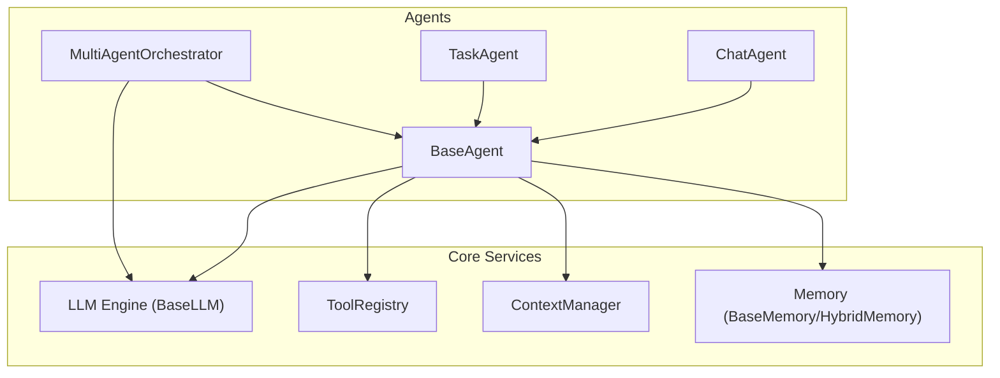
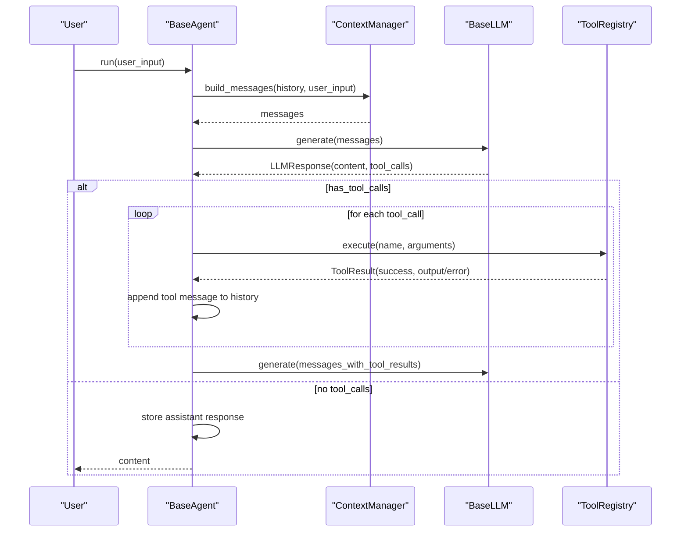
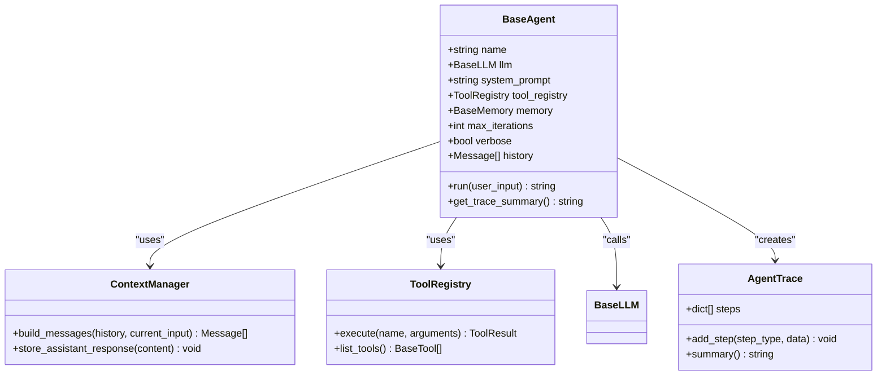
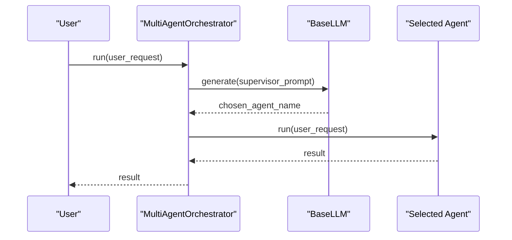
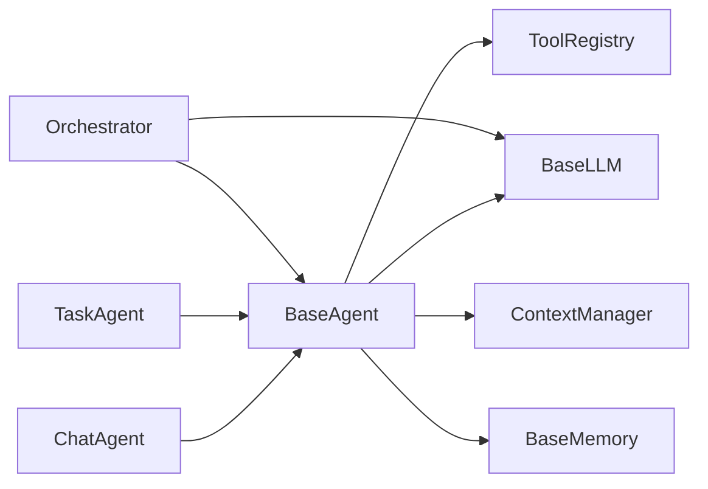

# Agent APIs

<cite>
**Referenced Files in This Document**
- [base.py](file://harness/agent/base.py)
- [chat.py](file://harness/agent/chat.py)
- [task.py](file://harness/agent/task.py)
- [orchestrator.py](file://harness/agent/orchestrator.py)
- [engine.py](file://harness/llm/engine.py)
- [registry.py](file://harness/tools/registry.py)
- [builtin.py](file://harness/tools/builtin.py)
- [manager.py](file://harness/context/manager.py)
- [base_memory.py](file://harness/memory/base.py)
- [demo_agent.py](file://demos/demo_agent.py)
- [demo_chat.py](file://demos/demo_chat.py)
- [demo_multi_agent.py](file://demos/demo_multi_agent.py)
</cite>

## Table of Contents
1. Introduction
2. Project Structure
3. Core Components
4. Architecture Overview
5. Detailed Component Analysis
6. Dependency Analysis
7. Performance Considerations
8. Troubleshooting Guide
9. Conclusion
10. Appendices

## Introduction
This document provides comprehensive API documentation for the Agent system classes in HarnessAIDemo. It covers:
- BaseAgent and its agent loop, including constructor parameters and execution flow
- AgentTrace for debugging agent executions
- Specialized agents ChatAgent and TaskAgent with their configurations and usage patterns
- MultiAgentOrchestrator for multi-agent coordination, registration, delegation, and result aggregation
- Integration points with LLM engine, tool registry, memory, and context manager
- Complete code examples demonstrating instantiation, configuration, execution, and error handling

## Project Structure
The Agent system is implemented under harness/agent with supporting components in harness/llm, harness/tools, harness/memory, and harness/context. Demos illustrate typical usage patterns.

**Diagram sources**
- [base.py:63-165](file://harness/agent/base.py#L63-L165)
- [chat.py:25-60](file://harness/agent/chat.py#L25-L60)
- [task.py:32-73](file://harness/agent/task.py#L32-L73)
- [orchestrator.py:31-152](file://harness/agent/orchestrator.py#L31-L152)
- [engine.py:127-146](file://harness/llm/engine.py#L127-L146)
- [registry.py:17-74](file://harness/tools/registry.py#L17-L74)
- [manager.py:41-118](file://harness/context/manager.py#L41-L118)
- [base_memory.py:27-64](file://harness/memory/base.py#L27-L64)

**Section sources**
- [base.py:1-165](file://harness/agent/base.py#L1-L165)
- [chat.py:1-60](file://harness/agent/chat.py#L1-L60)
- [task.py:1-73](file://harness/agent/task.py#L1-L73)
- [orchestrator.py:1-152](file://harness/agent/orchestrator.py#L1-L152)

## Core Components
- BaseAgent: Implements the core agent loop that builds context, calls the LLM, executes tools if requested, and returns a final answer or fallback after max iterations.
- AgentTrace: Records step-by-step execution details for debugging.
- ChatAgent: A conversational agent optimized for multi-turn dialogue with conversation helpers.
- TaskAgent: A task-oriented agent configured for more aggressive tool usage and structured results.
- MultiAgentOrchestrator: Coordinates multiple agents by selecting the best specialist per request and aggregating results.

Key integration points:
- LLM Engine: Abstract interface and backends for generating responses and parsing tool calls.
- Tool Registry: Central catalog to register, list, and execute tools with error handling.
- Context Manager: Assembles system prompt, tool descriptions, memory context, history, and current input into messages for the LLM.
- Memory: Provides short-term and long-term storage to maintain continuity across turns.

**Section sources**
- [base.py:63-165](file://harness/agent/base.py#L63-L165)
- [engine.py:127-146](file://harness/llm/engine.py#L127-L146)
- [registry.py:17-74](file://harness/tools/registry.py#L17-L74)
- [manager.py:41-118](file://harness/context/manager.py#L41-L118)
- [base_memory.py:27-64](file://harness/memory/base.py#L27-L64)

## Architecture Overview
The agent loop drives the interaction between the user, the agent, the LLM, and tools. The orchestrator coordinates multiple agents to handle complex tasks by delegating to specialists.

**Diagram sources**
- [base.py:97-160](file://harness/agent/base.py#L97-L160)
- [manager.py:61-104](file://harness/context/manager.py#L61-L104)
- [engine.py:127-146](file://harness/llm/engine.py#L127-L146)
- [registry.py:43-60](file://harness/tools/registry.py#L43-L60)

## Detailed Component Analysis

### BaseAgent
Responsibilities:
- Constructor parameters: name, llm, system_prompt, tool_registry, memory, max_iterations, verbose
- Agent loop:
  - Build context via ContextManager
  - Call LLM.generate
  - If tool calls present, execute them via ToolRegistry and feed results back
  - Store assistant responses in memory and history
  - Return final answer or fallback after max iterations
- AgentTrace: records steps like llm_call, tool_call, tool_result, final_answer

Usage pattern:
- Instantiate with an LLM backend and optional tool registry and memory
- Call run(user_input) to execute one turn
- Use verbose logging to inspect intermediate steps

Error handling:
- Tool execution errors are captured and returned as part of tool results; the agent continues the loop unless the LLM decides to stop
- After reaching max_iterations, a fallback message is returned

Code example paths:
- Instantiation and execution: [demo_agent.py:21-35](file://demos/demo_agent.py#L21-L35)
- Agent loop implementation: [base.py:97-160](file://harness/agent/base.py#L97-L160)

**Section sources**
- [base.py:38-165](file://harness/agent/base.py#L38-L165)
- [demo_agent.py:15-35](file://demos/demo_agent.py#L15-L35)

#### BaseAgent Class Diagram

**Diagram sources**
- [base.py:63-165](file://harness/agent/base.py#L63-L165)
- [manager.py:41-118](file://harness/context/manager.py#L41-L118)
- [registry.py:17-74](file://harness/tools/registry.py#L17-L74)
- [engine.py:127-146](file://harness/llm/engine.py#L127-L146)

### ChatAgent
Specializations:
- Inherits from BaseAgent with default chat system prompt and reduced max_iterations
- Provides convenience methods:
  - chat(user_input): alias for run
  - reset_conversation(): clears short-term history while preserving long-term memory
  - get_conversation_history(): returns history as list of dicts

Usage pattern:
- Create with an LLM, optional tool registry and memory
- Interact in a loop, calling chat(user_input)
- Clear history when needed to start fresh conversations

Code example paths:
- Interactive chat loop: [demo_chat.py:23-43](file://demos/demo_chat.py#L23-L43)
- ChatAgent definition: [chat.py:25-60](file://harness/agent/chat.py#L25-L60)

**Section sources**
- [chat.py:1-60](file://harness/agent/chat.py#L1-L60)
- [demo_chat.py:17-43](file://demos/demo_chat.py#L17-L43)

### TaskAgent
Specializations:
- Inherits from BaseAgent with a task-focused system prompt and higher max_iterations by default
- Provides execute_task(task_description):
  - Prints progress markers
  - Calls run(task_description)
  - Returns a structured dict with success, result, and task fields

Usage pattern:
- Create with an LLM, optional tool registry and memory
- Call execute_task(task_description) to complete a specific objective using tools

Code example paths:
- Task execution loop: [demo_agent.py:21-35](file://demos/demo_agent.py#L21-L35)
- TaskAgent definition: [task.py:32-73](file://harness/agent/task.py#L32-L73)

**Section sources**
- [task.py:1-73](file://harness/agent/task.py#L1-L73)
- [demo_agent.py:15-35](file://demos/demo_agent.py#L15-L35)

### MultiAgentOrchestrator
Responsibilities:
- Register specialist agents with names and descriptions
- Route incoming requests to the best agent using LLM-based selection with keyword fallback
- Execute delegated tasks and aggregate results
- Provide utilities to list registered agents and run all agents on a request

Key methods:
- register_agent(name, agent, description): registers an agent with metadata
- run(user_request): selects and delegates to one agent
- run_with_all(user_request): runs through all agents and collects results
- _select_agent(request): uses LLM to choose agent, with keyword-based fallback
- list_agents(): returns list of agent metadata

Usage pattern:
- Create orchestrator with an LLM and optional verbosity
- Register specialized agents (e.g., MathAgent, TimeAgent, ChatAgent)
- Call run(user_request) to delegate intelligently

Code example paths:
- Orchestrator setup and usage: [demo_multi_agent.py:22-43](file://demos/demo_multi_agent.py#L22-L43)
- Orchestrator implementation: [orchestrator.py:31-152](file://harness/agent/orchestrator.py#L31-L152)

**Section sources**
- [orchestrator.py:1-152](file://harness/agent/orchestrator.py#L1-L152)
- [demo_multi_agent.py:17-43](file://demos/demo_multi_agent.py#L17-L43)

#### Orchestrator Sequence Diagram

**Diagram sources**
- [orchestrator.py:61-91](file://harness/agent/orchestrator.py#L61-L91)
- [orchestrator.py:105-145](file://harness/agent/orchestrator.py#L105-L145)
- [engine.py:127-146](file://harness/llm/engine.py#L127-L146)

## Dependency Analysis
Agent components depend on shared services:
- BaseAgent depends on LLM engine, tool registry, memory, and context manager
- ChatAgent and TaskAgent extend BaseAgent with different defaults and helper methods
- Orchestrator depends on BaseAgent and LLM engine for routing and execution
- ToolRegistry encapsulates tool execution and error handling
- ContextManager composes system prompts, tool descriptions, memory context, and history

**Diagram sources**
- [base.py:63-165](file://harness/agent/base.py#L63-L165)
- [chat.py:25-60](file://harness/agent/chat.py#L25-L60)
- [task.py:32-73](file://harness/agent/task.py#L32-L73)
- [orchestrator.py:31-152](file://harness/agent/orchestrator.py#L31-L152)
- [engine.py:127-146](file://harness/llm/engine.py#L127-L146)
- [registry.py:17-74](file://harness/tools/registry.py#L17-L74)
- [manager.py:41-118](file://harness/context/manager.py#L41-L118)
- [base_memory.py:27-64](file://harness/memory/base.py#L27-L64)

**Section sources**
- [base.py:63-165](file://harness/agent/base.py#L63-L165)
- [orchestrator.py:31-152](file://harness/agent/orchestrator.py#L31-L152)

## Performance Considerations
- max_iterations controls the maximum number of tool-call loops to prevent infinite cycles; tune based on task complexity
- Context window management: ContextManager estimates tokens and can be extended to truncate or prioritize context
- Tool execution overhead: Each tool call incurs I/O and processing costs; minimize unnecessary calls by refining prompts and tool design
- Memory retrieval: HybridMemory can retrieve relevant past context; ensure efficient indexing and query strategies for large histories
- Orchestrator routing: LLM-based routing adds latency; consider caching or deterministic rules for high-throughput scenarios

[No sources needed since this section provides general guidance]

## Troubleshooting Guide
Common issues and resolutions:
- No agents registered: Orchestrator.run returns a message indicating no agents; ensure register_agent is called before use
- Unknown tool name: ToolRegistry.execute returns ToolResult with success=False and error listing available tools; verify tool registration and correct naming
- Tool execution exceptions: ToolRegistry catches exceptions and returns failure results; inspect logs and tool implementations for root causes
- Max iterations reached: BaseAgent returns a fallback message; increase max_iterations or refine prompts to reduce tool-call loops
- Empty user input: Mock LLM responds with a greeting; ensure user_input is provided in real deployments

Relevant code paths:
- Orchestrator empty agents check: [orchestrator.py:69-70](file://harness/agent/orchestrator.py#L69-L70)
- ToolRegistry execute error handling: [registry.py:43-60](file://harness/tools/registry.py#L43-L60)
- BaseAgent fallback after max iterations: [base.py:157-160](file://harness/agent/base.py#L157-L160)

**Section sources**
- [orchestrator.py:61-91](file://harness/agent/orchestrator.py#L61-L91)
- [registry.py:43-60](file://harness/tools/registry.py#L43-L60)
- [base.py:157-160](file://harness/agent/base.py#L157-L160)

## Conclusion
HarnessAIDemo’s Agent system provides a modular and extensible framework for building AI agents with tool-calling capabilities. BaseAgent implements the core loop, while ChatAgent and TaskAgent offer specialized behaviors for conversational and task-oriented workflows. MultiAgentOrchestrator enables sophisticated multi-agent coordination by delegating tasks to specialists and aggregating results. Integration with LLM engine, tool registry, memory, and context manager ensures robust, debuggable, and scalable agent operations.

[No sources needed since this section summarizes without analyzing specific files]

## Appendices

### API Reference Summary

- BaseAgent
  - Constructor parameters: name, llm, system_prompt, tool_registry, memory, max_iterations, verbose
  - Methods: run(user_input), get_trace_summary()
  - Behavior: Builds context, calls LLM, executes tools, stores responses, returns final answer or fallback

- AgentTrace
  - Purpose: Records execution steps for debugging
  - Methods: add_step(step_type, data), summary()

- ChatAgent
  - Constructor parameters: llm, system_prompt, tool_registry, memory, name
  - Methods: chat(user_input), reset_conversation(), get_conversation_history()

- TaskAgent
  - Constructor parameters: llm, name, tool_registry, memory, max_iterations, verbose
  - Methods: execute_task(task_description)

- MultiAgentOrchestrator
  - Constructor parameters: llm, verbose
  - Methods: register_agent(name, agent, description), run(user_request), run_with_all(user_request), _select_agent(request), list_agents()

**Section sources**
- [base.py:63-165](file://harness/agent/base.py#L63-L165)
- [chat.py:25-60](file://harness/agent/chat.py#L25-L60)
- [task.py:32-73](file://harness/agent/task.py#L32-L73)
- [orchestrator.py:31-152](file://harness/agent/orchestrator.py#L31-L152)

### Code Examples

- Single agent with tool-calling:
  - Setup LLM, register tools, instantiate TaskAgent, execute tasks
  - Paths: [demo_agent.py:15-35](file://demos/demo_agent.py#L15-L35)

- Interactive chat with tool support:
  - Setup LLM, memory, register tools, instantiate ChatAgent, loop user input
  - Paths: [demo_chat.py:17-43](file://demos/demo_chat.py#L17-L43)

- Multi-agent orchestration:
  - Setup orchestrator, register specialized agents, route requests
  - Paths: [demo_multi_agent.py:17-43](file://demos/demo_multi_agent.py#L17-L43)

**Section sources**
- [demo_agent.py:15-35](file://demos/demo_agent.py#L15-L35)
- [demo_chat.py:17-43](file://demos/demo_chat.py#L17-L43)
- [demo_multi_agent.py:17-43](file://demos/demo_multi_agent.py#L17-L43)