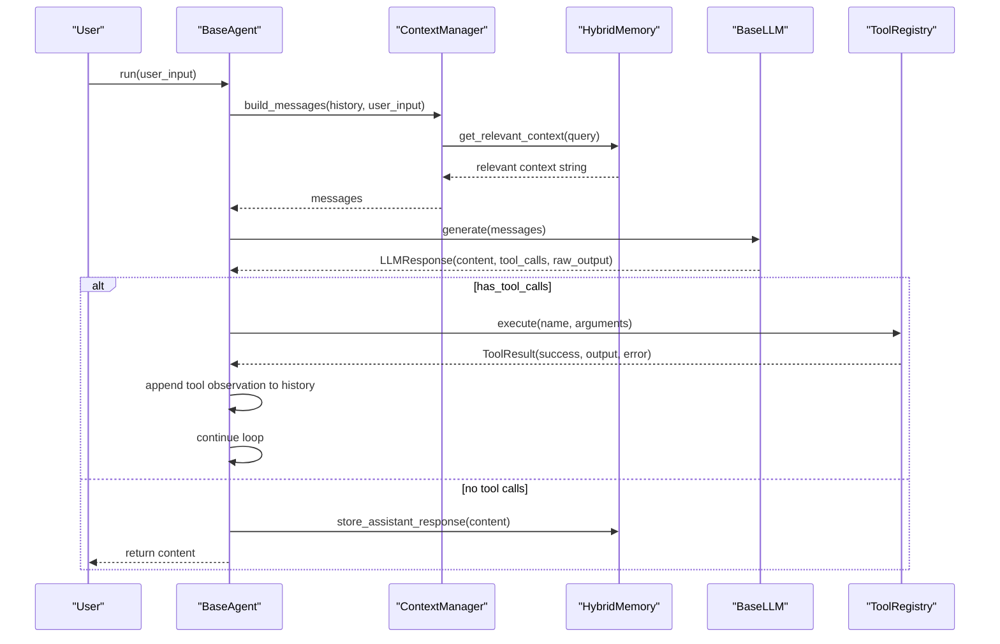
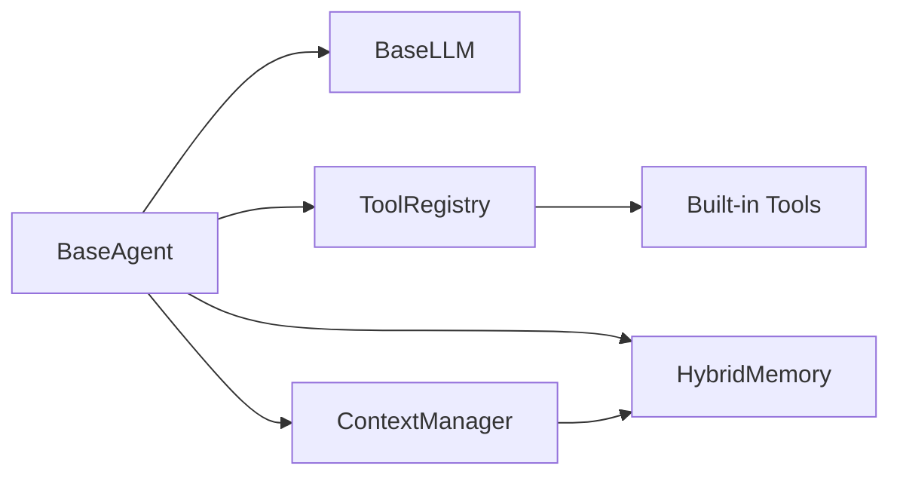

# BaseAgent

<cite>
**Referenced Files in This Document**
- [base.py](file://harness/agent/base.py)
- [task.py](file://harness/agent/task.py)
- [engine.py](file://harness/llm/engine.py)
- [registry.py](file://harness/tools/registry.py)
- [builtin.py](file://harness/tools/builtin.py)
- [manager.py](file://harness/context/manager.py)
- [hybrid.py](file://harness/memory/hybrid.py)
- [base_memory.py](file://harness/memory/base.py)
- [demo_agent.py](file://demos/demo_agent.py)
- [README.md](file://README.md)
</cite>

## Table of Contents
1. [Introduction](#introduction)
2. [Project Structure](#project-structure)
3. [Core Components](#core-components)
4. [Architecture Overview](#architecture-overview)
5. [Detailed Component Analysis](#detailed-component-analysis)
6. [Dependency Analysis](#dependency-analysis)
7. [Performance Considerations](#performance-considerations)
8. [Troubleshooting Guide](#troubleshooting-guide)
9. [Conclusion](#conclusion)
10. [Appendices](#appendices)

## Introduction
This document provides detailed API documentation for the BaseAgent class, the core agent implementation in HarnessAIDemo. It explains the constructor parameters, the run() method that implements the complete agent loop (context building, LLM calls, tool execution, and response handling), and the AgentTrace debugging helper. It also covers integration with memory systems and tool registries, message flow between components, lifecycle, error handling, and usage patterns via demos.

## Project Structure
HarnessAIDemo organizes the agent system into focused modules:
- Agent loop and traces live in harness/agent/base.py
- Specialized agents extend BaseAgent (e.g., TaskAgent in harness/agent/task.py)
- LLM abstraction and backends are in harness/llm/engine.py
- Tool registration and execution are in harness/tools/registry.py and harness/tools/builtin.py
- Context assembly is handled by harness/context/manager.py
- Memory abstractions and hybrid storage are in harness/memory/base.py and harness/memory/hybrid.py
- Demos show how to instantiate and run agents using these components

```mermaid
graph TB
subgraph "Agent"
BA["BaseAgent"]
TA["TaskAgent"]
end
subgraph "LLM"
LLM["BaseLLM / Backends"]
end
subgraph "Tools"
TR["ToolRegistry"]
BT["Built-in Tools"]
end
subgraph "Context"
CM["ContextManager"]
end
subgraph "Memory"
HM["HybridMemory"]
BM["BaseMemory"]
end
BA --> LLM
BA --> TR
BA --> CM
BA --> HM
TA --> BA
CM --> HM
TR --> BT
```

**Diagram sources**
- [base.py:63-165](file://harness/agent/base.py#L63-L165)
- [task.py:32-73](file://harness/agent/task.py#L32-L73)
- [engine.py:127-147](file://harness/llm/engine.py#L127-L147)
- [registry.py:17-74](file://harness/tools/registry.py#L17-L74)
- [builtin.py:13-83](file://harness/tools/builtin.py#L13-L83)
- [manager.py:41-118](file://harness/context/manager.py#L41-L118)
- [hybrid.py:22-84](file://harness/memory/hybrid.py#L22-L84)
- [base_memory.py:27-64](file://harness/memory/base.py#L27-L64)

**Section sources**
- [README.md:73-131](file://README.md#L73-L131)

## Core Components
- BaseAgent: Implements the agent loop, orchestrating context building, LLM inference, tool execution, and final answer handling.
- AgentTrace: Records step-by-step execution details for debugging.
- ContextManager: Assembles messages including system prompt, tool descriptions, relevant memory, conversation history, and current input.
- ToolRegistry: Central catalog for registering, listing, and executing tools with robust error handling.
- HybridMemory: Combines short-term buffer and long-term retrieval to provide rich context.
- LLM Engine: Abstract interface and concrete backends (TransformersBackend, MockBackend) providing generate() returning structured responses with optional tool calls.

Key responsibilities:
- BaseAgent.run(): Iterative loop up to max_iterations; builds context, calls LLM, executes tool calls if any, stores assistant responses, and returns final content or fallback.
- AgentTrace.add_step(): Logs iteration, tool calls, results, and final answers for post-run inspection.
- ContextManager.build_messages(): Creates a Message list for each LLM call, injecting tool instructions and relevant memory.
- ToolRegistry.execute(): Executes tools by name with arguments, returning success/failure and output/error.

**Section sources**
- [base.py:38-165](file://harness/agent/base.py#L38-L165)
- [manager.py:41-118](file://harness/context/manager.py#L41-L118)
- [registry.py:17-74](file://harness/tools/registry.py#L17-L74)
- [hybrid.py:22-84](file://harness/memory/hybrid.py#L22-L84)
- [engine.py:23-57](file://harness/llm/engine.py#L23-L57)

## Architecture Overview
The agent loop coordinates multiple subsystems to turn user input into actionable outcomes:



**Diagram sources**
- [base.py:97-160](file://harness/agent/base.py#L97-L160)
- [manager.py:61-104](file://harness/context/manager.py#L61-L104)
- [hybrid.py:46-73](file://harness/memory/hybrid.py#L46-L73)
- [engine.py:127-147](file://harness/llm/engine.py#L127-L147)
- [registry.py:43-60](file://harness/tools/registry.py#L43-L60)

## Detailed Component Analysis

### BaseAgent API
- Constructor parameters:
  - name: str — Agent identifier used in logs and trace outputs.
  - llm: Optional[BaseLLM] — Language model backend implementing generate().
  - system_prompt: str — Instructions defining agent behavior and persona.
  - tool_registry: Optional[ToolRegistry] — Catalog of available tools; defaults to an empty registry.
  - memory: Optional[BaseMemory] — Context storage; defaults to HybridMemory.
  - max_iterations: int — Maximum number of tool-call loops allowed per run.
  - verbose: bool — Enables debug logging and console prints during execution.
- Key attributes:
  - history: list[Message] — Conversation history maintained across iterations.
  - context_manager: ContextManager — Builds messages for each LLM call.
- Methods:
  - run(user_input: str) -> str — Executes the full agent loop and returns the final answer or a fallback after reaching max_iterations.
  - get_trace_summary() -> str — Returns a summary indicating trace availability.

Behavioral highlights:
- Each iteration builds messages via ContextManager, calls LLM.generate(), and checks for tool calls.
- If tool calls exist, they are executed via ToolRegistry and observations are appended to history; the loop continues.
- If no tool calls, the assistant response is stored in memory and returned.
- A fallback message is returned when max_iterations is reached without a final answer.

Error handling:
- Tool execution errors are captured by ToolRegistry and surfaced as ToolResult with success=False and error details; BaseAgent appends them as tool observations.
- Verbose mode logs raw LLM output and tool call/results for debugging.

Usage example paths:
- Instantiation and execution pattern: [demo_agent.py:15-39](file://demos/demo_agent.py#L15-L39)
- Agent loop entry point: [base.py:97-160](file://harness/agent/base.py#L97-L160)

**Section sources**
- [base.py:63-165](file://harness/agent/base.py#L63-L165)
- [demo_agent.py:15-39](file://demos/demo_agent.py#L15-L39)

### AgentTrace API
- Purpose: Record execution steps for debugging agent runs.
- Methods:
  - add_step(step_type: str, data: dict) -> None — Appends a step with type and associated data.
  - summary() -> str — Produces a human-readable summary of recorded steps.
- Step types:
  - llm_call: Indicates an LLM invocation with iteration number.
  - tool_call: Captures tool name and arguments.
  - tool_result: Captures tool output snippet.
  - final_answer: Captures the final assistant content snippet.

Integration:
- BaseAgent.run() records steps at key points: before LLM calls, on tool calls, on tool results, and on final answers.

Usage example paths:
- Trace recording within run(): [base.py:103-155](file://harness/agent/base.py#L103-L155)

**Section sources**
- [base.py:38-61](file://harness/agent/base.py#L38-L61)
- [base.py:103-155](file://harness/agent/base.py#L103-L155)

### ContextManager Integration
- Responsibilities:
  - Build messages for each LLM call by combining system prompt, tool descriptions, relevant memory, conversation history, and current input.
  - Store assistant responses into memory for future context.
- Key methods:
  - build_messages(history, current_input) -> list[Message]
  - store_assistant_response(content) -> None
  - estimate_tokens(messages) -> int (approximate token count)

Interaction with memory:
- Uses HybridMemory.get_relevant_context(query) to inject relevant past memories into the prompt.

**Section sources**
- [manager.py:41-118](file://harness/context/manager.py#L41-L118)
- [hybrid.py:46-73](file://harness/memory/hybrid.py#L46-L73)

### ToolRegistry Integration
- Responsibilities:
  - Register tools, list available tools, and execute tools by name with arguments.
  - Provide combined tool descriptions for system prompts.
- Key methods:
  - register(tool) -> None
  - get(name) -> Optional[BaseTool]
  - list_tools() -> list[BaseTool]
  - execute(name, arguments) -> ToolResult
  - get_tools_description() -> str

Error handling:
- Missing tools return ToolResult with success=False and an error listing available tools.
- Exceptions during tool execution are caught and returned as ToolResult with error details.

Built-in tools:
- CalculatorTool, DateTimeTool, FileOpsTool demonstrate safe and practical tool implementations.

**Section sources**
- [registry.py:17-74](file://harness/tools/registry.py#L17-L74)
- [builtin.py:13-83](file://harness/tools/builtin.py#L13-L83)

### Memory System Integration
- BaseMemory abstracts memory operations: add, get_recent, search, clear, get_all, and get_context_string.
- HybridMemory combines ShortTermMemory and LongTermMemory:
  - Adds user/assistant messages to both short-term and long-term.
  - Provides get_relevant_context(query) to merge recent and relevant memories for prompts.

**Section sources**
- [base_memory.py:27-64](file://harness/memory/base.py#L27-L64)
- [hybrid.py:22-84](file://harness/memory/hybrid.py#L22-L84)

### LLM Engine Integration
- BaseLLM defines generate(messages) -> LLMResponse and get_model_info() -> dict.
- LLMResponse includes content, tool_calls, and raw_output; has_tool_calls property indicates whether tool calls were requested.
- Backends:
  - TransformersBackend: Loads models from HuggingFace, applies chat templates, generates tokens, parses tool calls.
  - MockBackend: Pattern-based simulation for demos without GPU.

**Section sources**
- [engine.py:23-57](file://harness/llm/engine.py#L23-L57)
- [engine.py:127-147](file://harness/llm/engine.py#L127-L147)
- [engine.py:151-249](file://harness/llm/engine.py#L151-L249)
- [engine.py:254-399](file://harness/llm/engine.py#L254-L399)

## Dependency Analysis
BaseAgent depends on:
- LLM engine for generation
- ToolRegistry for tool execution
- ContextManager for assembling messages
- Memory for storing and retrieving context



**Diagram sources**
- [base.py:63-165](file://harness/agent/base.py#L63-L165)
- [manager.py:41-118](file://harness/context/manager.py#L41-L118)
- [registry.py:17-74](file://harness/tools/registry.py#L17-L74)
- [hybrid.py:22-84](file://harness/memory/hybrid.py#L22-L84)
- [builtin.py:13-83](file://harness/tools/builtin.py#L13-L83)

**Section sources**
- [base.py:63-165](file://harness/agent/base.py#L63-L165)
- [registry.py:17-74](file://harness/tools/registry.py#L17-L74)
- [manager.py:41-118](file://harness/context/manager.py#L41-L118)
- [hybrid.py:22-84](file://harness/memory/hybrid.py#L22-L84)

## Performance Considerations
- max_iterations controls loop length to prevent infinite cycles; tune based on task complexity.
- Context size management: ContextManager estimates tokens; ensure system prompt, tool descriptions, and memory fit within model limits.
- Memory retrieval: HybridMemory merges recent and relevant memories; adjust n_recent and top_k to balance relevance and context window.
- Tool execution overhead: Prefer efficient tools and minimize large outputs; consider truncation strategies for tool results.
- LLM backend selection: Use MockBackend for fast iteration; switch to TransformersBackend for real model performance.

[No sources needed since this section provides general guidance]

## Troubleshooting Guide
Common issues and resolutions:
- No tool calls detected:
  - Verify tool descriptions are included in system prompt via ContextManager.
  - Ensure ToolRegistry contains registered tools and descriptions are generated.
- Tool execution errors:
  - Check ToolRegistry.execute() error handling; inspect ToolResult.error for details.
  - Validate tool parameter names and argument formats.
- Excessive iterations:
  - Increase max_iterations cautiously; analyze AgentTrace.summary() to identify repeated tool calls or loops.
- Memory not updating:
  - Confirm ContextManager.store_assistant_response() is called after final answers.
  - Verify HybridMemory.add() receives correct roles and content.

Debugging aids:
- Enable verbose mode in BaseAgent to log LLM raw output and tool call/results.
- Use AgentTrace to record and summarize execution steps.

**Section sources**
- [base.py:116-155](file://harness/agent/base.py#L116-L155)
- [registry.py:43-60](file://harness/tools/registry.py#L43-L60)
- [manager.py:77-104](file://harness/context/manager.py#L77-L104)

## Conclusion
BaseAgent provides a robust, extensible foundation for building AI agents that can reason, use tools, and maintain context across interactions. By integrating LLM backends, tool registries, and memory systems through well-defined interfaces, it enables flexible agent behaviors suitable for both simple tasks and complex workflows. The AgentTrace and verbose modes support effective debugging and optimization.

[No sources needed since this section summarizes without analyzing specific files]

## Appendices

### API Reference Summary
- BaseAgent.__init__(name, llm, system_prompt, tool_registry, memory, max_iterations, verbose)
- BaseAgent.run(user_input) -> str
- BaseAgent.get_trace_summary() -> str
- AgentTrace.add_step(step_type, data) -> None
- AgentTrace.summary() -> str
- ContextManager.build_messages(history, current_input) -> list[Message]
- ContextManager.store_assistant_response(content) -> None
- ToolRegistry.register(tool) -> None
- ToolRegistry.execute(name, arguments) -> ToolResult
- ToolRegistry.get_tools_description() -> str
- HybridMemory.add(role, content, **metadata) -> None
- HybridMemory.get_relevant_context(query, n_recent, n_relevant) -> str
- BaseLLM.generate(messages) -> LLMResponse

**Section sources**
- [base.py:63-165](file://harness/agent/base.py#L63-L165)
- [manager.py:41-118](file://harness/context/manager.py#L41-L118)
- [registry.py:17-74](file://harness/tools/registry.py#L17-L74)
- [hybrid.py:22-84](file://harness/memory/hybrid.py#L22-L84)
- [engine.py:127-147](file://harness/llm/engine.py#L127-L147)

### Usage Patterns and Examples
- Instantiate an agent with a mock backend and built-in tools:
  - See demo setup and execution: [demo_agent.py:15-39](file://demos/demo_agent.py#L15-L39)
- Configure agent options:
  - Adjust max_iterations and verbose for different tasks: [base.py:73-95](file://harness/agent/base.py#L73-L95)
- Execute tasks and handle results:
  - TaskAgent wrapper demonstrates structured output: [task.py:54-73](file://harness/agent/task.py#L54-L73)

**Section sources**
- [demo_agent.py:15-39](file://demos/demo_agent.py#L15-L39)
- [base.py:73-95](file://harness/agent/base.py#L73-L95)
- [task.py:54-73](file://harness/agent/task.py#L54-L73)