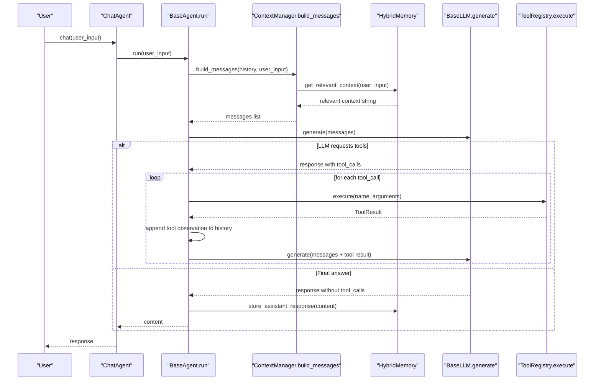
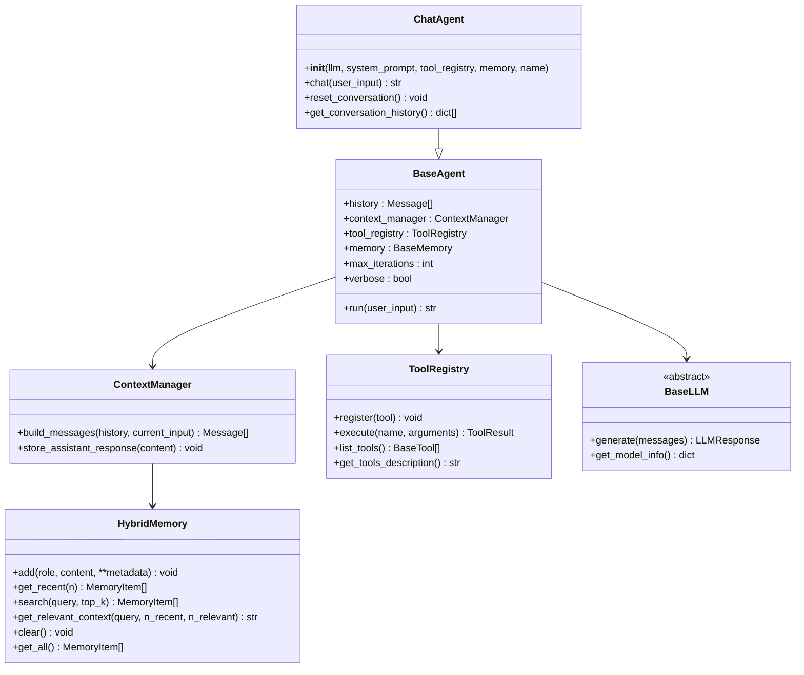

# ChatAgent

<cite>
**Referenced Files in This Document**
- [chat.py](file://harness/agent/chat.py)
- [base.py](file://harness/agent/base.py)
- [engine.py](file://harness/llm/engine.py)
- [manager.py](file://harness/context/manager.py)
- [hybrid.py](file://harness/memory/hybrid.py)
- [registry.py](file://harness/tools/registry.py)
- [demo_chat.py](file://demos/demo_chat.py)
</cite>

## Table of Contents
1. [Introduction](#introduction)
2. [Project Structure](#project-structure)
3. [Core Components](#core-components)
4. [Architecture Overview](#architecture-overview)
5. [Detailed Component Analysis](#detailed-component-analysis)
6. [Dependency Analysis](#dependency-analysis)
7. [Performance Considerations](#performance-considerations)
8. [Troubleshooting Guide](#troubleshooting-guide)
9. [Conclusion](#conclusion)
10. [Appendices](#appendices)

## Introduction
This document provides comprehensive API documentation for the ChatAgent class, a specialized agent designed for conversational interactions. It explains how ChatAgent extends BaseAgent to add chat-specific features such as conversation history management, memory-aware responses, and multi-turn dialogue support. You will learn how to initialize ChatAgent, manage conversations across turns, persist state via memory systems, control conversation flow, and integrate tools and LLM backends effectively. Practical examples reference the demo script to show setup, multi-turn usage, and session-like behavior.

## Project Structure
The ChatAgent lives within an agent framework that composes several subsystems:
- Agent loop and orchestration (BaseAgent)
- Context assembly (ContextManager)
- Memory system (HybridMemory with short-term and long-term storage)
- Tool registry and execution
- LLM engine abstraction and backends

```mermaid
graph TB
subgraph "Agent Layer"
CA["ChatAgent"]
BA["BaseAgent"]
end
subgraph "Context & Memory"
CM["ContextManager"]
HM["HybridMemory"]
end
subgraph "Tools"
TR["ToolRegistry"]
end
subgraph "LLM"
LLM["BaseLLM / Backends"]
end
CA --> BA
BA --> CM
BA --> TR
BA --> LLM
CM --> HM
```

**Diagram sources**
- [chat.py:25-59](file://harness/agent/chat.py#L25-L59)
- [base.py:63-160](file://harness/agent/base.py#L63-L160)
- [manager.py:41-108](file://harness/context/manager.py#L41-L108)
- [hybrid.py:22-84](file://harness/memory/hybrid.py#L22-L84)
- [registry.py:17-74](file://harness/tools/registry.py#L17-L74)
- [engine.py:127-146](file://harness/llm/engine.py#L127-L146)

**Section sources**
- [chat.py:1-59](file://harness/agent/chat.py#L1-L59)
- [base.py:1-165](file://harness/agent/base.py#L1-L165)
- [manager.py:1-118](file://harness/context/manager.py#L1-L118)
- [hybrid.py:1-84](file://harness/memory/hybrid.py#L1-L84)
- [registry.py:1-74](file://harness/tools/registry.py#L1-L74)
- [engine.py:1-421](file://harness/llm/engine.py#L1-L421)

## Core Components
- ChatAgent: A conversational agent optimized for multi-turn dialogue. It sets sensible defaults for iteration limits and verbosity, and exposes a simple chat method.
- BaseAgent: Implements the core agent loop that builds context, calls the LLM, executes tool calls if needed, stores assistant responses, and returns final answers or fallback messages.
- ContextManager: Assembles the full prompt for each LLM call by combining system instructions, tool descriptions, relevant memories, conversation history, and current input.
- HybridMemory: Combines short-term (recent messages) and long-term (persistent knowledge) memory to provide continuity across turns and sessions.
- ToolRegistry: Central catalog for available tools; used to describe tools in prompts and execute tool calls returned by the LLM.
- LLM Engine: Abstract interface and concrete backends (e.g., mock, transformers) that generate responses and parse tool calls.

Key responsibilities:
- ChatAgent focuses on user-facing chat convenience methods and conversation utilities.
- BaseAgent handles the iterative loop, tool execution, and message history updates.
- ContextManager ensures efficient use of the model’s context window by including only what is necessary.
- HybridMemory maintains both immediate and persistent context for richer responses.

**Section sources**
- [chat.py:25-59](file://harness/agent/chat.py#L25-L59)
- [base.py:63-160](file://harness/agent/base.py#L63-L160)
- [manager.py:41-108](file://harness/context/manager.py#L41-L108)
- [hybrid.py:22-84](file://harness/memory/hybrid.py#L22-L84)
- [registry.py:17-74](file://harness/tools/registry.py#L17-L74)
- [engine.py:127-146](file://harness/llm/engine.py#L127-L146)

## Architecture Overview
The ChatAgent integrates with the broader harness to deliver interactive, memory-aware conversations with tool-calling capabilities.



**Diagram sources**
- [chat.py:46-59](file://harness/agent/chat.py#L46-L59)
- [base.py:97-160](file://harness/agent/base.py#L97-L160)
- [manager.py:61-108](file://harness/context/manager.py#L61-L108)
- [hybrid.py:33-44](file://harness/memory/hybrid.py#L33-L44)
- [registry.py:43-67](file://harness/tools/registry.py#L43-L67)
- [engine.py:138-141](file://harness/llm/engine.py#L138-L141)

## Detailed Component Analysis

### ChatAgent API
- Purpose: Provide a convenient entry point for interactive chat sessions with built-in defaults for iteration limits and verbosity.
- Constructor parameters:
  - llm: An instance implementing BaseLLM to handle text generation and tool-call parsing.
  - system_prompt: Optional custom persona/instructions for the agent. Defaults to a friendly, concise assistant prompt.
  - tool_registry: Optional registry of tools the agent can call. Defaults to a new empty registry.
  - memory: Optional memory implementation. If not provided, BaseAgent uses a default hybrid memory.
  - name: Optional display name for logs and traces.
- Initialization process:
  - Calls BaseAgent.__init__ with name, llm, system_prompt, tool_registry, memory, max_iterations=5, verbose=False.
  - Inherits history, context manager, and agent loop from BaseAgent.
- Conversation methods:
  - chat(user_input): Convenience wrapper around BaseAgent.run for interactive use.
  - reset_conversation(): Clears short-term conversation history while preserving long-term memory.
  - get_conversation_history(): Returns a list of dicts representing recent messages with role and content.

Best practices:
- Provide a meaningful system_prompt to tailor persona and behavior.
- Register tools you want the agent to use so it can call them during conversation.
- Use a HybridMemory-backed persistence path to retain useful facts across sessions.

**Section sources**
- [chat.py:25-59](file://harness/agent/chat.py#L25-L59)
- [base.py:73-95](file://harness/agent/base.py#L73-L95)

### BaseAgent Loop and Message Handling
- Core loop:
  - Builds messages via ContextManager using history and current input.
  - Calls LLM.generate to obtain a response.
  - If no tool calls are requested, appends assistant message to history, stores response in memory, and returns the final answer.
  - If tool calls are requested, executes each tool, appends tool observations to history, and continues the loop until a final answer is produced or max_iterations is reached.
- History management:
  - Maintains a list of Message objects representing the conversation turn-by-turn.
  - Appends assistant responses and tool observations to ensure continuity.
- Fallback behavior:
  - If max_iterations is exceeded, returns a polite fallback message indicating inability to complete the task within allowed steps.

Error handling:
- Tool execution errors are captured and returned as error strings in tool observations, allowing the LLM to self-correct or respond appropriately.

**Section sources**
- [base.py:97-160](file://harness/agent/base.py#L97-L160)

### Context Management and Memory Integration
- ContextManager.build_messages:
  - Creates a system message with base instructions and tool descriptions when tools are registered.
  - For HybridMemory, injects relevant past context based on the current input.
  - Appends conversation history and the current user message.
  - Stores the user input in memory for future retrieval.
- HybridMemory.get_relevant_context:
  - Combines recent short-term messages with relevant long-term memories retrieved by search.
  - Filters out duplicates already present in recent context to avoid redundancy.
- Assistant response storage:
  - ContextManager.store_assistant_response persists assistant outputs into memory for continuity.

Practical implications:
- The agent can reference prior topics even after resetting short-term history, enabling long-term continuity.
- Context size is managed by including only recent and relevant information, helping stay within token limits.

**Section sources**
- [manager.py:61-108](file://harness/context/manager.py#L61-L108)
- [hybrid.py:33-84](file://harness/memory/hybrid.py#L33-L84)

### Tool Integration and Execution
- ToolRegistry:
  - Provides tool descriptions for the system prompt so the LLM knows available capabilities.
  - Executes tools by name with arguments and returns structured results, including error handling.
- BaseAgent integration:
  - Parses tool calls from LLM responses and feeds results back into the conversation loop.
  - Appends tool observations to history to inform subsequent LLM decisions.

Best practices:
- Register only necessary tools to keep system prompts concise.
- Ensure tools return informative outputs to help the LLM produce accurate final answers.

**Section sources**
- [registry.py:17-74](file://harness/tools/registry.py#L17-L74)
- [base.py:119-155](file://harness/agent/base.py#L119-L155)

### LLM Engine and Backends
- BaseLLM interface:
  - Defines generate and get_model_info contracts for all backends.
- MockBackend:
  - Simulates tool calling and conversation for demos without requiring GPU resources.
  - Demonstrates typical flows like date/time queries, calculations, and file operations.
- TransformersBackend:
  - Loads real models via HuggingFace, applies chat templates, generates tokens, and parses tool calls.

Usage guidance:
- Use create_llm() to instantiate the appropriate backend based on configuration.
- For development and testing, prefer the mock backend; for production, configure the transformers backend with suitable model settings.

**Section sources**
- [engine.py:127-146](file://harness/llm/engine.py#L127-L146)
- [engine.py:254-399](file://harness/llm/engine.py#L254-L399)
- [engine.py:404-421](file://harness/llm/engine.py#L404-L421)

### Practical Examples and Usage Patterns
- Setup and initialization:
  - Create an LLM via create_llm().
  - Initialize HybridMemory with a storage path for persistence.
  - Register default tools via register_default_tools on a ToolRegistry.
  - Instantiate ChatAgent with llm, tool_registry, and memory.
- Multi-turn conversation:
  - Repeatedly call agent.chat(user_input) in a loop until the user exits.
  - Each call builds context, invokes the LLM, executes tools if needed, and returns a final answer.
- State persistence:
  - HybridMemory persists user and assistant messages to disk, enabling continuity across runs.
  - Resetting conversation clears short-term history but retains long-term memory.
- Conversation flow control:
  - Adjust max_iterations in BaseAgent to limit tool-call loops.
  - Use reset_conversation to start fresh while keeping long-term knowledge.

Example references:
- See the interactive demo script for a complete example of setup, tool registration, and multi-turn interaction.

**Section sources**
- [demo_chat.py:17-46](file://demos/demo_chat.py#L17-L46)
- [chat.py:46-59](file://harness/agent/chat.py#L46-L59)
- [hybrid.py:22-84](file://harness/memory/hybrid.py#L22-L84)

## Dependency Analysis
ChatAgent depends on several components to function:
- BaseAgent provides the agent loop and message history management.
- ContextManager orchestrates prompt assembly and memory integration.
- HybridMemory supplies short-term and long-term context.
- ToolRegistry enables tool discovery and execution.
- LLM Engine abstracts model inference and tool-call parsing.



**Diagram sources**
- [chat.py:25-59](file://harness/agent/chat.py#L25-L59)
- [base.py:63-160](file://harness/agent/base.py#L63-L160)
- [manager.py:41-108](file://harness/context/manager.py#L41-L108)
- [hybrid.py:22-84](file://harness/memory/hybrid.py#L22-L84)
- [registry.py:17-74](file://harness/tools/registry.py#L17-L74)
- [engine.py:127-146](file://harness/llm/engine.py#L127-L146)

**Section sources**
- [chat.py:25-59](file://harness/agent/chat.py#L25-L59)
- [base.py:63-160](file://harness/agent/base.py#L63-L160)
- [manager.py:41-108](file://harness/context/manager.py#L41-L108)
- [hybrid.py:22-84](file://harness/memory/hybrid.py#L22-L84)
- [registry.py:17-74](file://harness/tools/registry.py#L17-L74)
- [engine.py:127-146](file://harness/llm/engine.py#L127-L146)

## Performance Considerations
- Context window management:
  - ContextManager includes only recent and relevant memories to reduce token usage.
  - Estimate token counts roughly by character length divided by four for planning purposes.
- Iteration limits:
  - Set max_iterations conservatively to prevent excessive tool loops and high latency.
- Memory capacity:
  - Tune short_term_capacity in HybridMemory to balance recency vs. memory footprint.
- Tool efficiency:
  - Keep tool descriptions concise and only register necessary tools to minimize prompt size.
- Backend selection:
  - Use mock backend for rapid iteration; switch to transformers backend for production with appropriate device and dtype settings.

[No sources needed since this section provides general guidance]

## Troubleshooting Guide
Common issues and resolutions:
- No tool calls detected:
  - Verify tools are registered and their descriptions are included in the system prompt.
  - Check that the LLM backend supports tool-call parsing and formatting.
- Excessive iterations:
  - Reduce max_iterations or refine tool prompts to guide the model toward faster resolution.
- Missing context:
  - Ensure HybridMemory is configured with a valid storage path and that relevant past memories exist.
- Errors during tool execution:
  - Inspect ToolResult.error messages and adjust tool implementations or arguments accordingly.
- Session resets:
  - Use reset_conversation to clear short-term history when starting a new topic while retaining long-term knowledge.

**Section sources**
- [base.py:119-160](file://harness/agent/base.py#L119-L160)
- [registry.py:43-67](file://harness/tools/registry.py#L43-L67)
- [manager.py:61-108](file://harness/context/manager.py#L61-L108)

## Conclusion
ChatAgent provides a streamlined interface for building conversational agents with robust multi-turn support, memory-aware responses, and tool integration. By leveraging BaseAgent’s loop, ContextManager’s efficient prompt assembly, HybridMemory’s dual-layer storage, and ToolRegistry’s tool orchestration, developers can create responsive, context-rich chat experiences. Follow best practices for persona customization, tool registration, and memory configuration to optimize performance and reliability.

[No sources needed since this section summarizes without analyzing specific files]

## Appendices

### API Reference Summary
- ChatAgent
  - Constructor: llm, system_prompt, tool_registry, memory, name
  - Methods: chat, reset_conversation, get_conversation_history
- BaseAgent
  - Method: run
  - Attributes: history, context_manager, tool_registry, memory, max_iterations, verbose
- ContextManager
  - Method: build_messages, store_assistant_response
- HybridMemory
  - Methods: add, get_recent, search, get_relevant_context, clear, get_all
- ToolRegistry
  - Methods: register, execute, list_tools, get_tools_description
- LLM Engine
  - Interface: BaseLLM.generate, BaseLLM.get_model_info
  - Backends: MockBackend, TransformersBackend

**Section sources**
- [chat.py:25-59](file://harness/agent/chat.py#L25-L59)
- [base.py:63-160](file://harness/agent/base.py#L63-L160)
- [manager.py:41-108](file://harness/context/manager.py#L41-L108)
- [hybrid.py:22-84](file://harness/memory/hybrid.py#L22-L84)
- [registry.py:17-74](file://harness/tools/registry.py#L17-L74)
- [engine.py:127-146](file://harness/llm/engine.py#L127-L146)