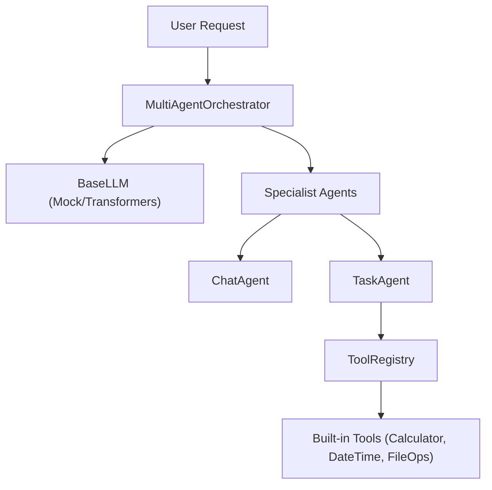
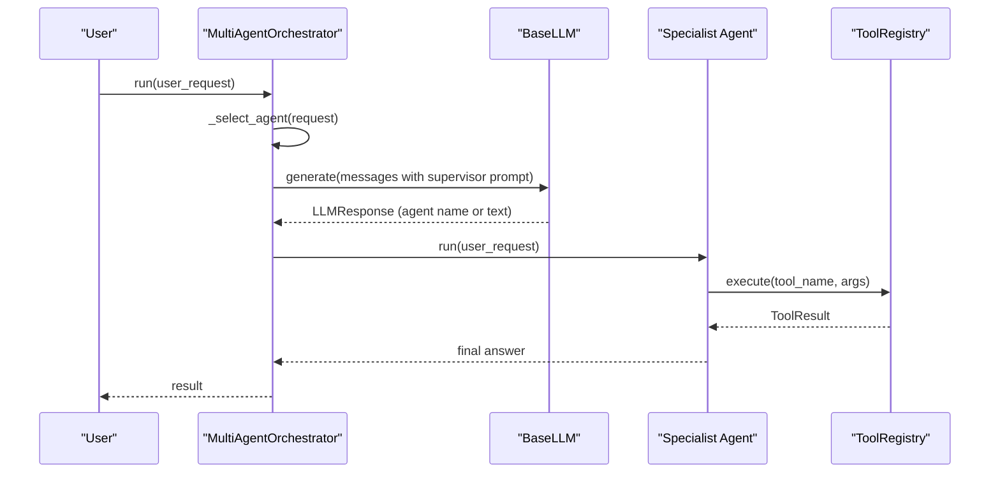
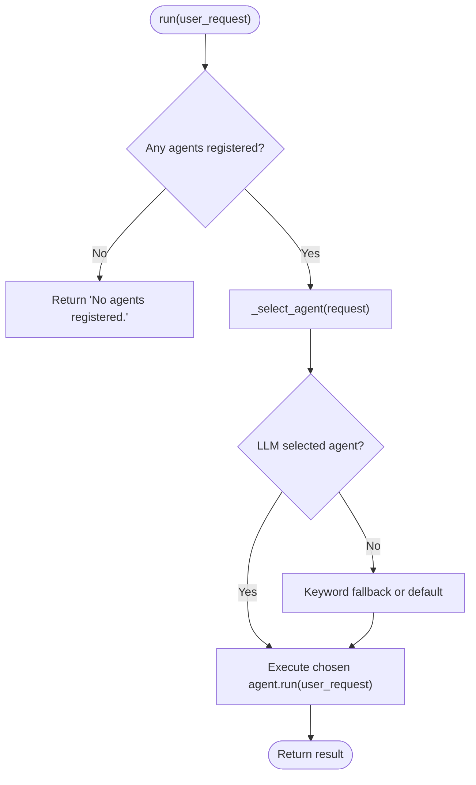
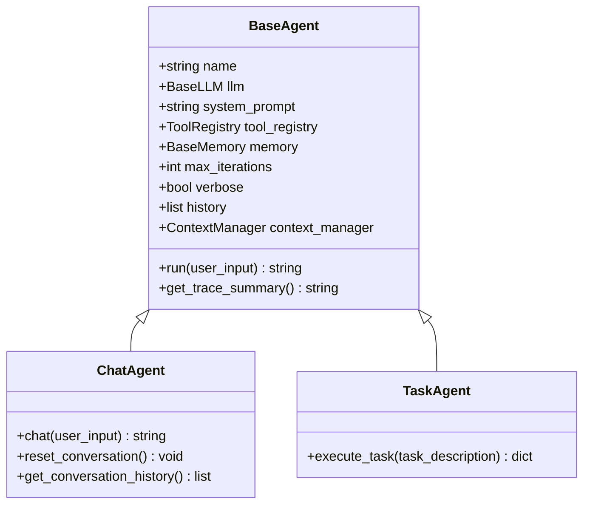
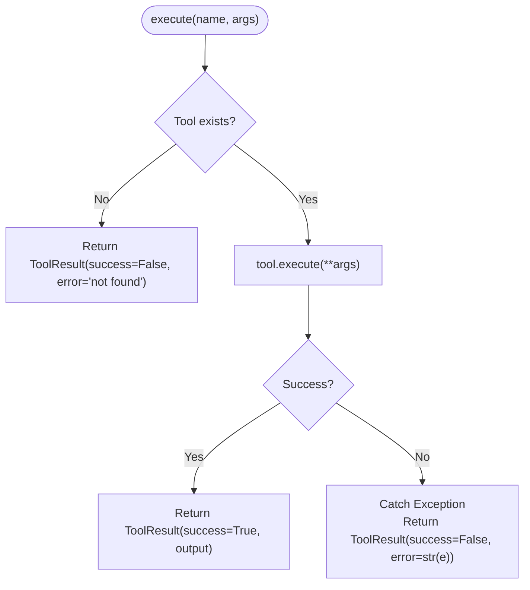
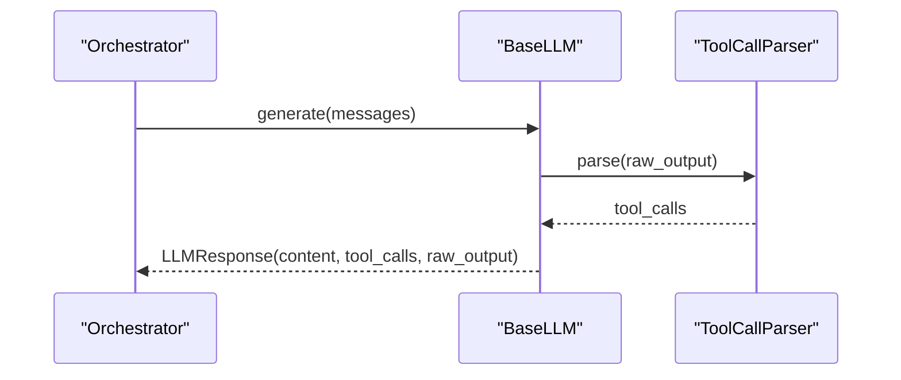
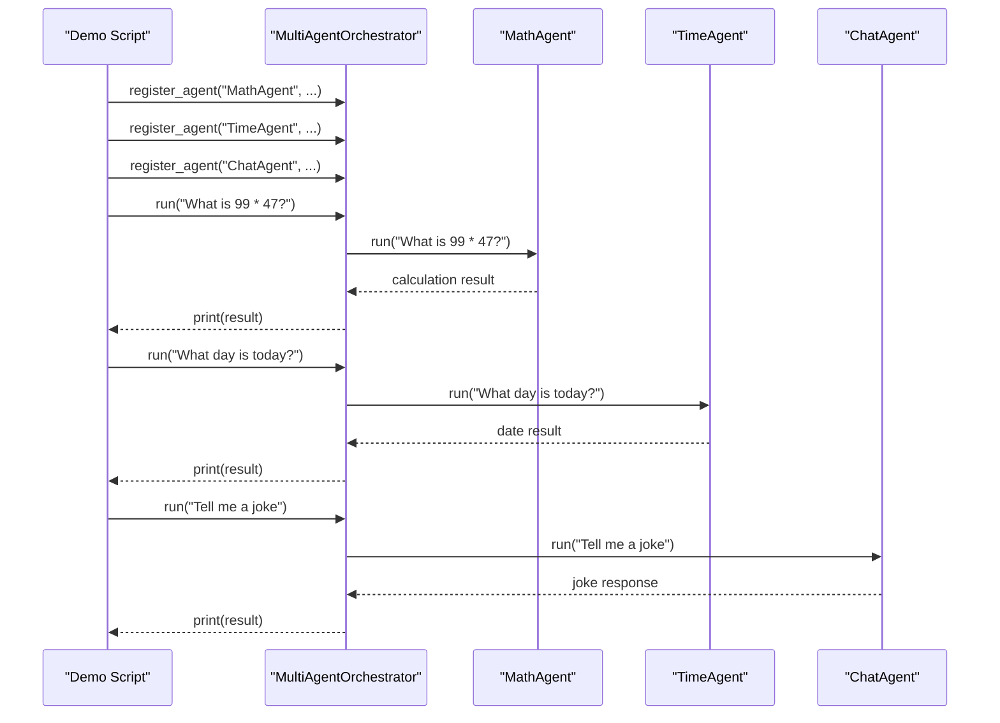
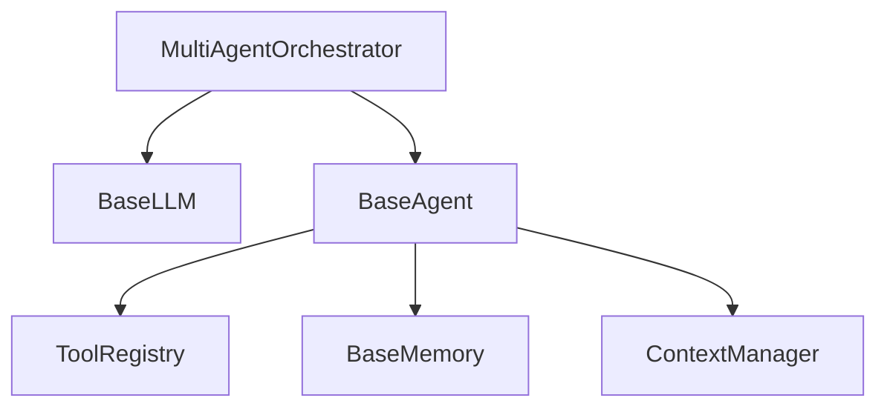

# Orchestrator

<cite>
**Referenced Files in This Document**
- [orchestrator.py](file://harness/agent/orchestrator.py)
- [base.py](file://harness/agent/base.py)
- [chat.py](file://harness/agent/chat.py)
- [task.py](file://harness/agent/task.py)
- [engine.py](file://harness/llm/engine.py)
- [registry.py](file://harness/tools/registry.py)
- [demo_multi_agent.py](file://demos/demo_multi_agent.py)
- [README.md](file://README.md)
</cite>

## Table of Contents
1. [Introduction](#introduction)
2. [Project Structure](#project-structure)
3. [Core Components](#core-components)
4. [Architecture Overview](#architecture-overview)
5. [Detailed Component Analysis](#detailed-component-analysis)
6. [Dependency Analysis](#dependency-analysis)
7. [Performance Considerations](#performance-considerations)
8. [Troubleshooting Guide](#troubleshooting-guide)
9. [Conclusion](#conclusion)
10. [Appendices](#appendices)

## Introduction
This document provides comprehensive API documentation for the Orchestrator class that enables multi-agent coordination and collaboration. It covers constructor parameters, agent registration, task delegation mechanisms, orchestration patterns (supervisor-subagent relationships, routing strategies, result aggregation), examples for registering specialized agents and defining workflows, error handling in distributed scenarios, load balancing considerations, performance optimization techniques, lifecycle management, agent state management, and monitoring capabilities.

The orchestrator implements a supervisor pattern: it receives user requests, decides which specialist agent(s) to delegate to, executes sub-tasks, and aggregates results into a final answer.

**Section sources**
- [orchestrator.py:1-20](file://harness/agent/orchestrator.py#L1-L20)
- [README.md:269-284](file://README.md#L269-L284)

## Project Structure
The orchestrator is part of the harness framework’s agent subsystem and integrates with LLM engines, tool registries, and concrete agent implementations (ChatAgent, TaskAgent). The demo shows how to wire everything together.

**Diagram sources**
- [orchestrator.py:31-151](file://harness/agent/orchestrator.py#L31-L151)
- [engine.py:127-146](file://harness/llm/engine.py#L127-L146)
- [registry.py:17-74](file://harness/tools/registry.py#L17-L74)
- [chat.py:25-60](file://harness/agent/chat.py#L25-L60)
- [task.py:32-73](file://harness/agent/task.py#L32-L73)

**Section sources**
- [README.md:73-131](file://README.md#L73-L131)
- [demo_multi_agent.py:17-47](file://demos/demo_multi_agent.py#L17-L47)

## Core Components
- MultiAgentOrchestrator: Coordinates multiple agents, routes tasks, and aggregates results.
- BaseAgent: Core agent loop with context building, LLM calls, tool execution, and memory integration.
- ChatAgent: Conversational agent optimized for multi-turn dialogue.
- TaskAgent: Task-oriented agent with higher iteration limits and structured output handling.
- ToolRegistry: Central catalog for tool registration, lookup, and execution with error handling.
- BaseLLM and backends: Abstract interface and implementations (MockBackend, TransformersBackend) used by agents and orchestrator.

Key responsibilities:
- Orchestrator: Supervisor role, routing decisions, optional parallel execution across all agents.
- Agents: Execute tasks using tools and memory; return final answers or structured results.
- ToolRegistry: Safe execution of tools with robust error handling.
- LLM Engine: Provides generate() responses including tool call intents.

**Section sources**
- [orchestrator.py:31-151](file://harness/agent/orchestrator.py#L31-L151)
- [base.py:63-165](file://harness/agent/base.py#L63-L165)
- [chat.py:25-60](file://harness/agent/chat.py#L25-L60)
- [task.py:32-73](file://harness/agent/task.py#L32-L73)
- [registry.py:17-74](file://harness/tools/registry.py#L17-L74)
- [engine.py:127-146](file://harness/llm/engine.py#L127-L146)

## Architecture Overview
The orchestrator uses a supervisor-subagent pattern:
- Supervisor (Orchestrator) receives user input and selects an appropriate specialist agent via LLM-based routing with keyword fallback.
- Specialist agents (ChatAgent, TaskAgent) execute their tasks using tools and memory.
- Results are returned directly (single-agent route) or aggregated across all agents (run_with_all).

**Diagram sources**
- [orchestrator.py:61-145](file://harness/agent/orchestrator.py#L61-L145)
- [base.py:97-160](file://harness/agent/base.py#L97-L160)
- [registry.py:43-60](file://harness/tools/registry.py#L43-L60)
- [engine.py:138-141](file://harness/llm/engine.py#L138-L141)

## Detailed Component Analysis

### MultiAgentOrchestrator API
- Constructor
  - Parameters:
    - llm: BaseLLM instance used for routing decisions.
    - verbose: bool flag to enable console logging during orchestration.
  - Internal state:
    - _agents: dict mapping agent names to BaseAgent instances.
    - _supervisor_prompt: system prompt template for selecting the best agent.

- Agent Registration
  - register_agent(name, agent, description=""): Registers a specialist agent with a human-readable description used for routing.

- Task Delegation
  - run(user_request): Routes to the best agent and returns its result.
  - run_with_all(user_request): Executes request through all registered agents and returns a dict of results keyed by agent name.

- Routing Strategy
  - _select_agent(request):
    - Primary: LLM-based selection using supervisor prompt and available agent descriptions.
    - Fallback: Keyword matching against agent descriptions for math/time/general categories.
    - Default: First registered agent if no match.

- Listing Agents
  - list_agents(): Returns list of dicts with name and description for each registered agent.

**Diagram sources**
- [orchestrator.py:61-145](file://harness/agent/orchestrator.py#L61-L145)

**Section sources**
- [orchestrator.py:31-151](file://harness/agent/orchestrator.py#L31-L151)

### BaseAgent and Agent Loop
- Constructor
  - Parameters:
    - name: Identifier for the agent.
    - llm: BaseLLM instance for generating responses.
    - system_prompt: Instructions guiding the agent’s behavior.
    - tool_registry: ToolRegistry instance providing available tools.
    - memory: BaseMemory instance for short/long-term memory.
    - max_iterations: Upper bound on tool-call loops to prevent infinite cycles.
    - verbose: Logging verbosity.

- Execution Flow
  - run(user_input): Builds context, calls LLM, handles tool calls, stores assistant responses, and returns final answer or fallback message after max iterations.

- Monitoring and Tracing
  - AgentTrace records steps (LLM calls, tool calls, tool results, final answer) and can be summarized for debugging.

**Diagram sources**
- [base.py:63-165](file://harness/agent/base.py#L63-L165)
- [chat.py:25-60](file://harness/agent/chat.py#L25-L60)
- [task.py:32-73](file://harness/agent/task.py#L32-L73)

**Section sources**
- [base.py:63-165](file://harness/agent/base.py#L63-L165)
- [chat.py:25-60](file://harness/agent/chat.py#L25-L60)
- [task.py:32-73](file://harness/agent/task.py#L32-L73)

### ToolRegistry and Error Handling
- Responsibilities
  - Register tools, list them, and execute by name with arguments.
  - Provide combined tool descriptions for system prompts.

- Error Handling
  - If a tool is not found, returns ToolResult with success=False and descriptive error.
  - Catches exceptions during tool execution and returns failure results with error messages.

**Diagram sources**
- [registry.py:43-60](file://harness/tools/registry.py#L43-L60)

**Section sources**
- [registry.py:17-74](file://harness/tools/registry.py#L17-L74)

### LLM Engine Integration
- BaseLLM Interface
  - generate(messages): Produces LLMResponse with content and optional tool_calls.
  - get_model_info(): Returns backend-specific model metadata.

- Backends
  - MockBackend: Pattern-matching based simulation for demos without GPU.
  - TransformersBackend: Real model inference via HuggingFace transformers with chat templates and token generation.

- Tool Call Parsing
  - ToolCallParser extracts tool calls from free-form text using multiple formats.

**Diagram sources**
- [engine.py:127-146](file://harness/llm/engine.py#L127-L146)
- [engine.py:61-123](file://harness/llm/engine.py#L61-L123)
- [engine.py:206-241](file://harness/llm/engine.py#L206-L241)
- [engine.py:254-399](file://harness/llm/engine.py#L254-L399)

**Section sources**
- [engine.py:127-146](file://harness/llm/engine.py#L127-L146)
- [engine.py:61-123](file://harness/llm/engine.py#L61-L123)
- [engine.py:206-241](file://harness/llm/engine.py#L206-L241)
- [engine.py:254-399](file://harness/llm/engine.py#L254-L399)

### Example: Multi-Agent Orchestration Workflow
The demo wires up an orchestrator with specialized agents:
- MathAgent: Uses CalculatorTool via ToolRegistry.
- TimeAgent: Uses DateTimeTool via ToolRegistry.
- ChatAgent: General conversation.

Workflow:
- Create LLM backend (mock or transformers).
- Instantiate orchestrator with llm and verbose mode.
- Register agents with descriptions to aid routing.
- For each user request, orchestrator delegates to the best agent and prints results.

**Diagram sources**
- [demo_multi_agent.py:17-47](file://demos/demo_multi_agent.py#L17-L47)
- [orchestrator.py:61-145](file://harness/agent/orchestrator.py#L61-L145)

**Section sources**
- [demo_multi_agent.py:17-47](file://demos/demo_multi_agent.py#L17-L47)

## Dependency Analysis
The orchestrator depends on:
- BaseLLM for routing decisions.
- BaseAgent subclasses for executing tasks.
- ToolRegistry for safe tool execution.
- ContextManager and Memory for agent context and history.

Coupling and cohesion:
- Orchestrator has low coupling to specific agents (uses BaseAgent interface).
- High cohesion within orchestrator for routing and delegation logic.
- ToolRegistry encapsulates tool execution details, improving modularity.

Potential circular dependencies:
- None observed between orchestrator and agents; agents depend on orchestrator only indirectly via usage patterns.

External integrations:
- LLM backends (Mock/Transformers) provide inference capabilities.
- Built-in tools (Calculator, DateTime, FileOps) extend agent capabilities.

**Diagram sources**
- [orchestrator.py:31-151](file://harness/agent/orchestrator.py#L31-L151)
- [base.py:63-165](file://harness/agent/base.py#L63-L165)
- [registry.py:17-74](file://harness/tools/registry.py#L17-L74)

**Section sources**
- [orchestrator.py:31-151](file://harness/agent/orchestrator.py#L31-L151)
- [base.py:63-165](file://harness/agent/base.py#L63-L165)
- [registry.py:17-74](file://harness/tools/registry.py#L17-L74)

## Performance Considerations
- Routing Efficiency
  - LLM-based routing incurs one additional generate() call per request; consider caching agent selections for similar requests.
  - Keyword fallback reduces LLM calls when routing fails.

- Parallel Execution
  - run_with_all executes all agents sequentially in current implementation; for high-throughput scenarios, consider asynchronous execution to parallelize agent runs.

- Iteration Limits
  - max_iterations prevents infinite loops; tune per agent type (TaskAgent uses higher limit than ChatAgent).

- Tool Execution Overhead
  - ToolRegistry.execute wraps execution with error handling; ensure tools are efficient and avoid heavy I/O in hot paths.

- Memory and Context Size
  - ContextManager builds messages with history and memory; monitor token usage to avoid exceeding model limits.

[No sources needed since this section provides general guidance]

## Troubleshooting Guide
Common issues and resolutions:
- No agents registered
  - Symptom: Orchestrator returns "No agents registered."
  - Resolution: Ensure at least one agent is registered before calling run().

- Routing failures
  - Symptom: Incorrect agent selected or fallback triggered.
  - Resolution: Improve agent descriptions and keywords; verify LLM backend behavior; inspect verbose logs.

- Tool execution errors
  - Symptom: ToolResult indicates failure or exception occurred.
  - Resolution: Check ToolRegistry logs; validate tool inputs; handle errors gracefully in tool implementations.

- Infinite loops prevented
  - Symptom: Agent stops after reaching max_iterations.
  - Resolution: Increase max_iterations if necessary; refine system prompt to reduce tool-call cycles.

Monitoring capabilities:
- Verbose mode prints orchestration steps and agent outputs.
- AgentTrace captures detailed execution steps for debugging.

**Section sources**
- [orchestrator.py:61-91](file://harness/agent/orchestrator.py#L61-L91)
- [base.py:97-160](file://harness/agent/base.py#L97-L160)
- [registry.py:43-60](file://harness/tools/registry.py#L43-L60)

## Conclusion
The Orchestrator class provides a robust supervisor pattern for multi-agent coordination. It supports flexible routing via LLM and keyword matching, integrates seamlessly with specialized agents and tools, and offers basic monitoring and tracing. By tuning routing strategies, iteration limits, and tool efficiency, teams can build scalable multi-agent systems capable of complex task delegation and result aggregation.

[No sources needed since this section summarizes without analyzing specific files]

## Appendices

### API Reference Summary
- MultiAgentOrchestrator
  - __init__(llm, verbose)
  - register_agent(name, agent, description)
  - run(user_request) -> str
  - run_with_all(user_request) -> dict[str, str]
  - _select_agent(request) -> str
  - list_agents() -> list[dict]

- BaseAgent
  - __init__(name, llm, system_prompt, tool_registry, memory, max_iterations, verbose)
  - run(user_input) -> str
  - get_trace_summary() -> str

- ChatAgent
  - __init__(llm, system_prompt, tool_registry, memory, name)
  - chat(user_input) -> str
  - reset_conversation() -> None
  - get_conversation_history() -> list[dict]

- TaskAgent
  - __init__(llm, name, tool_registry, memory, max_iterations, verbose)
  - execute_task(task_description) -> dict

- ToolRegistry
  - register(tool)
  - execute(name, arguments) -> ToolResult
  - list_tools() -> list[BaseTool]
  - get_tools_description() -> str

**Section sources**
- [orchestrator.py:31-151](file://harness/agent/orchestrator.py#L31-L151)
- [base.py:63-165](file://harness/agent/base.py#L63-L165)
- [chat.py:25-60](file://harness/agent/chat.py#L25-L60)
- [task.py:32-73](file://harness/agent/task.py#L32-L73)
- [registry.py:17-74](file://harness/tools/registry.py#L17-L74)