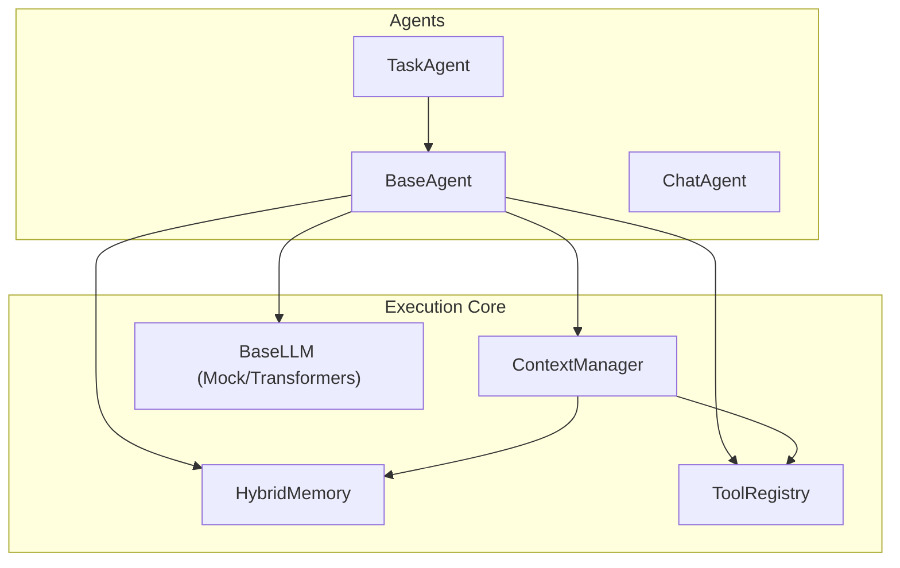
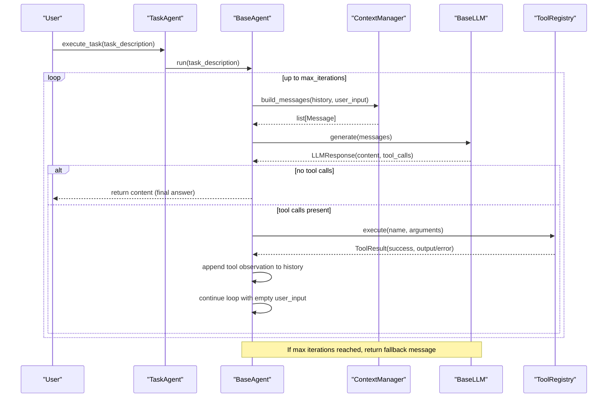
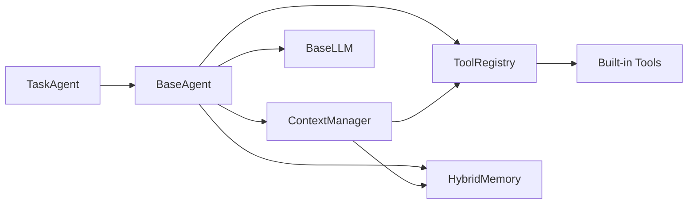
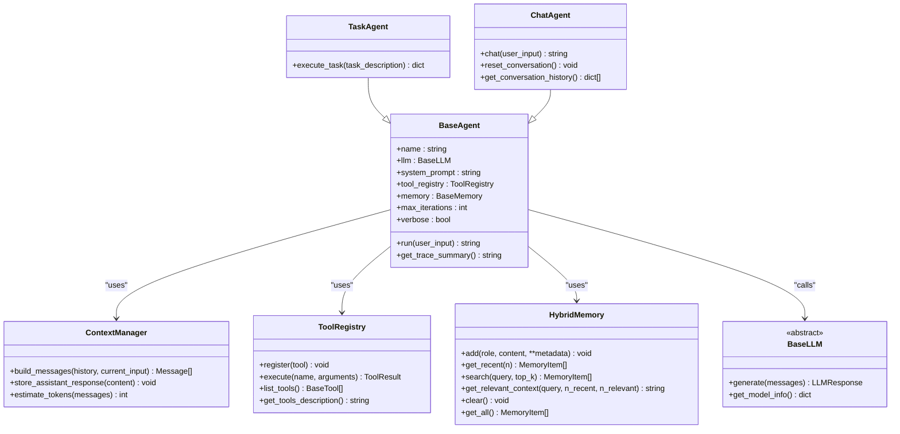

# TaskAgent

<cite>
**Referenced Files in This Document**
- [task.py](file://harness/agent/task.py)
- [base.py](file://harness/agent/base.py)
- [chat.py](file://harness/agent/chat.py)
- [registry.py](file://harness/tools/registry.py)
- [builtin.py](file://harness/tools/builtin.py)
- [manager.py](file://harness/context/manager.py)
- [engine.py](file://harness/llm/engine.py)
- [hybrid.py](file://harness/memory/hybrid.py)
- [demo_agent.py](file://demos/demo_agent.py)
</cite>

## Table of Contents
1. [Introduction](#introduction)
2. [Project Structure](#project-structure)
3. [Core Components](#core-components)
4. [Architecture Overview](#architecture-overview)
5. [Detailed Component Analysis](#detailed-component-analysis)
6. [Dependency Analysis](#dependency-analysis)
7. [Performance Considerations](#performance-considerations)
8. [Troubleshooting Guide](#troubleshooting-guide)
9. [Conclusion](#conclusion)
10. [Appendices](#appendices)

## Introduction
TaskAgent is a goal-oriented agent specialized for completing specific tasks rather than open-ended conversation. It extends the base agent loop with task-focused system prompts, higher iteration budgets for complex tool use, structured output handling, and progress feedback via logging and traces. It is designed to orchestrate multi-step workflows by repeatedly calling tools until a final answer is produced or a maximum iteration limit is reached.

## Project Structure
The TaskAgent lives within the agent subsystem and integrates with LLM backends, tool registries, memory, and context management to execute tasks end-to-end.

**Diagram sources**
- [task.py:32-52](file://harness/agent/task.py#L32-L52)
- [base.py:63-95](file://harness/agent/base.py#L63-L95)
- [manager.py:41-104](file://harness/context/manager.py#L41-L104)
- [registry.py:17-67](file://harness/tools/registry.py#L17-L67)
- [engine.py:127-141](file://harness/llm/engine.py#L127-L141)
- [hybrid.py:22-37](file://harness/memory/hybrid.py#L22-L37)

**Section sources**
- [task.py:1-73](file://harness/agent/task.py#L1-L73)
- [base.py:1-165](file://harness/agent/base.py#L1-L165)
- [manager.py:1-118](file://harness/context/manager.py#L1-L118)
- [registry.py:1-74](file://harness/tools/registry.py#L1-L74)
- [engine.py:1-421](file://harness/llm/engine.py#L1-L421)
- [hybrid.py:1-84](file://harness/memory/hybrid.py#L1-L84)

## Core Components
- TaskAgent: A subclass of BaseAgent that sets a task-oriented system prompt and exposes a simple execute_task interface returning structured results.
- BaseAgent: Implements the core agent loop that builds context, calls the LLM, executes tool calls, and returns a final answer or fallback after max iterations.
- ContextManager: Assembles messages including system prompt, tool descriptions, memory context, history, and current input.
- ToolRegistry: Central catalog for registering, listing, and executing tools with error handling.
- Memory (HybridMemory): Combines short-term buffer and long-term retrieval to provide relevant context across turns.
- LLM Engine: Abstract interface with mock and transformers backends; parses tool calls from model outputs.

Key differences from ChatAgent:
- TaskAgent uses a task-focused system prompt and higher default max_iterations to support complex tool chains.
- ChatAgent is optimized for conversational flow with lower iteration limits and less verbose execution.

**Section sources**
- [task.py:22-52](file://harness/agent/task.py#L22-L52)
- [chat.py:25-44](file://harness/agent/chat.py#L25-L44)
- [base.py:63-165](file://harness/agent/base.py#L63-L165)

## Architecture Overview
TaskAgent orchestrates a closed-loop process: build context -> call LLM -> parse tool calls -> execute tools -> feed results back -> repeat until final answer or max iterations.

**Diagram sources**
- [base.py:97-160](file://harness/agent/base.py#L97-L160)
- [manager.py:61-104](file://harness/context/manager.py#L61-L104)
- [registry.py:43-67](file://harness/tools/registry.py#L43-L67)
- [engine.py:127-141](file://harness/llm/engine.py#L127-L141)

## Detailed Component Analysis

### TaskAgent API
- Constructor parameters:
  - llm: BaseLLM instance providing language model inference.
  - name: Agent identifier used in logs and trace summaries.
  - tool_registry: Optional ToolRegistry; defaults to an empty registry if not provided.
  - memory: Optional BaseMemory; defaults to HybridMemory when not provided.
  - max_iterations: Int controlling how many tool-call loops are allowed; TaskAgent defaults to a higher value than ChatAgent to support complex tasks.
  - verbose: Boolean enabling detailed logs and prints during execution.
- System prompt:
  - Uses a task-oriented system prompt instructing the agent to break tasks into steps, use tools, think before acting, and provide a clear final answer.
- Task execution workflow:
  - execute_task(task_description) prints status, delegates to BaseAgent.run, then returns a structured dict with success, result, and task fields.

Progress tracking and completion criteria:
- Progress feedback:
  - Verbose mode prints each tool call and result.
  - BaseAgent records an AgentTrace with step types: llm_call, tool_call, tool_result, final_answer.
- Completion criteria:
  - The loop completes when the LLM response has no tool calls (final answer), or when max_iterations is reached (fallback message).

Error handling and retries:
- Tool failures:
  - ToolRegistry.execute wraps tool execution in try/except and returns ToolResult with success=False and error details.
  - BaseAgent appends tool observations even on errors so the LLM can self-correct in subsequent iterations.
- Max iterations:
  - If the agent cannot finish within max_iterations, it returns a fallback message indicating inability to complete the task.

Integration points:
- LLM backend selection via create_llm() supports mock or transformers backends.
- Tools are registered via ToolRegistry and described in the system prompt through get_tools_description().

Usage example references:
- See demo setup and execution in demos/demo_agent.py for creating an LLM, registering built-in tools, instantiating TaskAgent, and running multiple tasks.

**Section sources**
- [task.py:32-73](file://harness/agent/task.py#L32-L73)
- [base.py:38-60](file://harness/agent/base.py#L38-L60)
- [base.py:97-160](file://harness/agent/base.py#L97-L160)
- [registry.py:43-67](file://harness/tools/registry.py#L43-L67)
- [engine.py:404-421](file://harness/llm/engine.py#L404-L421)
- [demo_agent.py:15-37](file://demos/demo_agent.py#L15-L37)

### BaseAgent Loop and Tracing
- AgentTrace:
  - Records each iteration’s LLM calls, tool calls, tool results, and final answers. Provides a summary method for debugging.
- run(user_input):
  - Builds messages via ContextManager.
  - Calls LLM.generate.
  - If no tool calls: stores assistant response in memory and returns content.
  - If tool calls: executes each via ToolRegistry, appends tool observations to history, and continues the loop.
  - On reaching max_iterations: appends a fallback assistant message and returns it.

Complexity considerations:
- Time complexity per iteration is dominated by LLM generation and tool execution.
- Space complexity grows with conversation history and memory size; ContextManager manages token budget estimates.

**Section sources**
- [base.py:38-60](file://harness/agent/base.py#L38-L60)
- [base.py:97-160](file://harness/agent/base.py#L97-L160)

### ContextManager
- Responsibilities:
  - Assemble system prompt with tool instructions and descriptions.
  - Include relevant long-term memory context when using HybridMemory.
  - Append conversation history and current user input.
  - Store user inputs in memory for future retrieval.
- Token estimation:
  - Provides a rough estimate based on character count to help manage context windows.

**Section sources**
- [manager.py:41-118](file://harness/context/manager.py#L41-L118)

### ToolRegistry and Built-in Tools
- ToolRegistry:
  - register(tool): Adds tools to the catalog.
  - execute(name, arguments): Executes tools safely with error handling and returns ToolResult.
  - get_tools_description(): Generates tool descriptions injected into the system prompt.
- Built-in tools:
  - CalculatorTool: Evaluates safe mathematical expressions.
  - DateTimeTool: Returns date/time information.
  - FileOpsTool: Lists directories or reads files (read-only for safety).
  - register_default_tools(registry): Convenience function to register all built-ins.

Error recovery:
- Invalid tool names or exceptions during execution produce ToolResult with success=False and descriptive errors, allowing the agent to adapt in subsequent iterations.

**Section sources**
- [registry.py:17-74](file://harness/tools/registry.py#L17-L74)
- [builtin.py:13-83](file://harness/tools/builtin.py#L13-L83)

### Memory (HybridMemory)
- Combines short-term buffer and long-term persistent storage.
- add(role, content, **metadata): Persists user and assistant messages to long-term and recent items to short-term.
- get_relevant_context(query, n_recent, n_relevant): Merges recent conversation and relevant past memories for richer context.
- clear(): Resets both short-term and long-term memory stores.

**Section sources**
- [hybrid.py:22-84](file://harness/memory/hybrid.py#L22-L84)

### LLM Engine
- BaseLLM:
  - Abstract interface defining generate(messages) and get_model_info().
- Backends:
  - MockBackend: Pattern-based simulation for demos without GPU; detects intent and emits tool calls accordingly.
  - TransformersBackend: Loads models via HuggingFace, applies chat templates, generates tokens, and parses tool calls from raw output.
- ToolCallParser:
  - Extracts tool calls from various formats (backtick blocks, Action/Action Input patterns, bare JSON objects).

**Section sources**
- [engine.py:23-57](file://harness/llm/engine.py#L23-L57)
- [engine.py:61-123](file://harness/llm/engine.py#L61-L123)
- [engine.py:127-249](file://harness/llm/engine.py#L127-L249)
- [engine.py:254-421](file://harness/llm/engine.py#L254-L421)

## Dependency Analysis
TaskAgent depends on several subsystems to operate effectively:

**Diagram sources**
- [task.py:32-52](file://harness/agent/task.py#L32-L52)
- [base.py:63-95](file://harness/agent/base.py#L63-L95)
- [manager.py:41-104](file://harness/context/manager.py#L41-L104)
- [registry.py:17-67](file://harness/tools/registry.py#L17-L67)
- [builtin.py:77-83](file://harness/tools/builtin.py#L77-L83)

**Section sources**
- [task.py:32-52](file://harness/agent/task.py#L32-L52)
- [base.py:63-95](file://harness/agent/base.py#L63-L95)
- [manager.py:41-104](file://harness/context/manager.py#L41-L104)
- [registry.py:17-67](file://harness/tools/registry.py#L17-L67)
- [builtin.py:77-83](file://harness/tools/builtin.py#L77-L83)

## Performance Considerations
- Iteration budget:
  - Increase max_iterations only as needed; excessive values can lead to high LLM costs and latency.
- Context window management:
  - Use HybridMemory.get_relevant_context to limit token usage by combining recent and relevant memories.
- Tool efficiency:
  - Prefer concise tool outputs; large responses increase context size and may exceed token limits.
- Backend choice:
  - MockBackend is fast for testing; TransformersBackend provides real model capabilities but requires hardware resources.

[No sources needed since this section provides general guidance]

## Troubleshooting Guide
Common issues and resolutions:
- Tool not found:
  - Ensure tools are registered via ToolRegistry.register or register_default_tools before execution.
  - Check ToolRegistry.get_tools_description to verify available tools.
- Tool execution errors:
  - Inspect ToolResult.error returned by ToolRegistry.execute; adjust tool parameters or logic accordingly.
- Infinite loops or high cost:
  - Reduce max_iterations or refine system prompt/tool descriptions to guide the LLM toward efficient tool usage.
- Context overflow:
  - Limit memory retention via HybridMemory configuration and rely on get_relevant_context to include only necessary past context.
- Debugging execution:
  - Enable verbose mode to print tool calls and results.
  - Review AgentTrace steps to understand the sequence of LLM calls and tool interactions.

**Section sources**
- [registry.py:43-67](file://harness/tools/registry.py#L43-L67)
- [base.py:97-160](file://harness/agent/base.py#L97-L160)
- [manager.py:61-104](file://harness/context/manager.py#L61-L104)

## Conclusion
TaskAgent provides a robust, goal-oriented framework for completing complex tasks through iterative tool use. Its design emphasizes structured execution, progress tracking, and error recovery, making it suitable for multi-step workflows where precise outcomes are required. By leveraging ContextManager, ToolRegistry, and HybridMemory, TaskAgent balances performance and effectiveness while remaining extensible for custom tools and domains.

[No sources needed since this section summarizes without analyzing specific files]

## Appendices

### Example Workflow References
- Setup and execution:
  - Create an LLM backend via create_llm().
  - Register built-in tools using register_default_tools.
  - Instantiate TaskAgent with the LLM and tool registry.
  - Call execute_task for each task and handle the returned structured result.

**Section sources**
- [demo_agent.py:15-37](file://demos/demo_agent.py#L15-L37)

### Class Relationships Diagram

**Diagram sources**
- [base.py:63-165](file://harness/agent/base.py#L63-L165)
- [task.py:32-73](file://harness/agent/task.py#L32-L73)
- [chat.py:25-60](file://harness/agent/chat.py#L25-L60)
- [manager.py:41-118](file://harness/context/manager.py#L41-L118)
- [registry.py:17-74](file://harness/tools/registry.py#L17-L74)
- [hybrid.py:22-84](file://harness/memory/hybrid.py#L22-L84)
- [engine.py:127-141](file://harness/llm/engine.py#L127-L141)