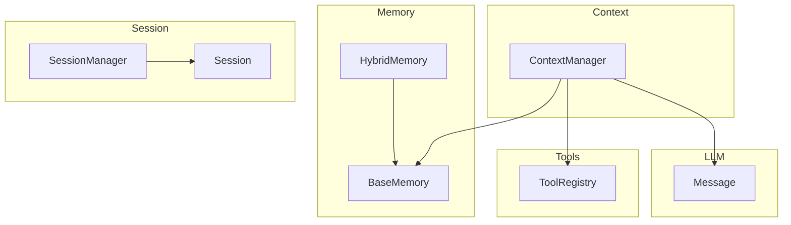
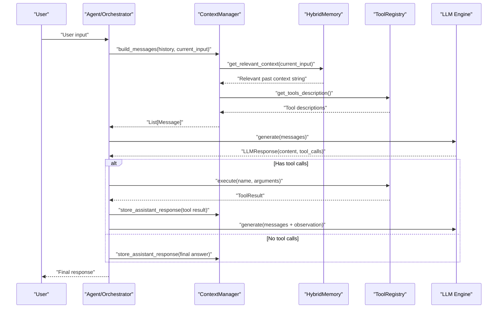
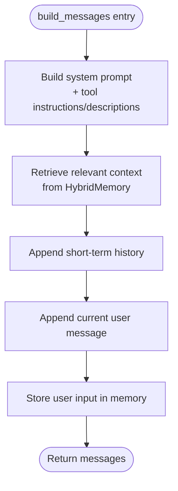
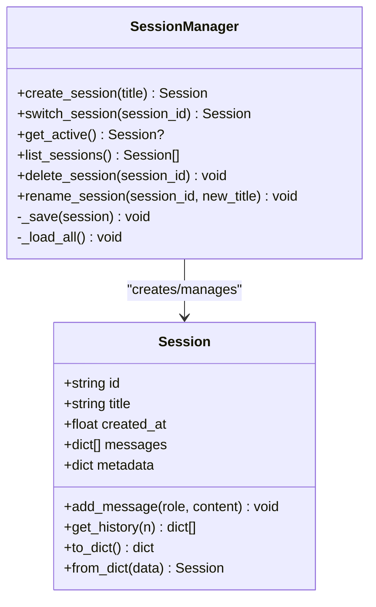
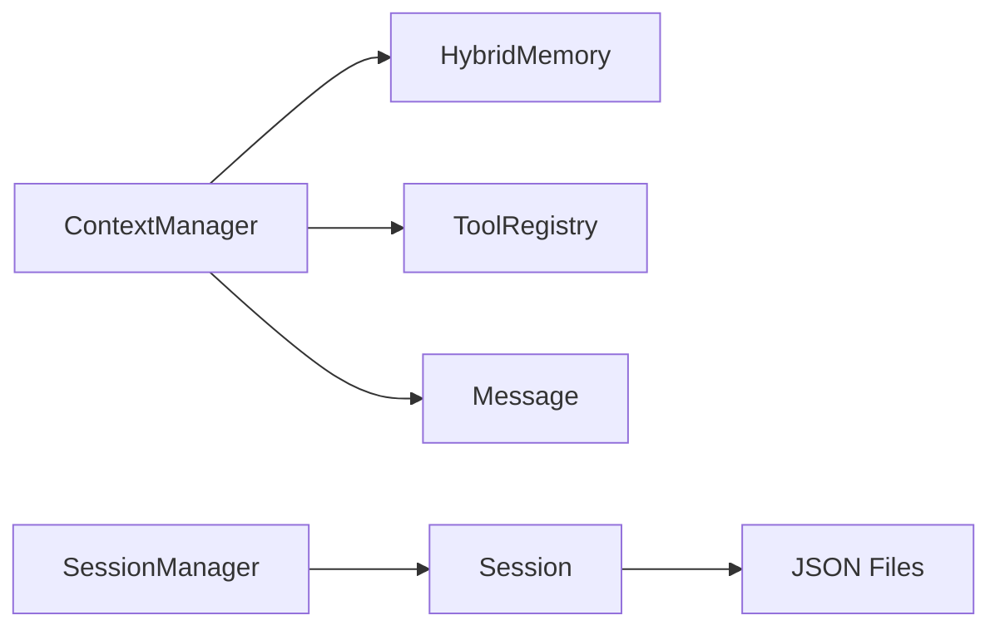

# Context & Session APIs

<cite>
**Referenced Files in This Document**
- [manager.py](file://harness/context/manager.py)
- [manager.py](file://harness/session/manager.py)
- [base.py](file://harness/memory/base.py)
- [hybrid.py](file://harness/memory/hybrid.py)
- [registry.py](file://harness/tools/registry.py)
- [engine.py](file://harness/llm/engine.py)
- [demo_session.py](file://demos/demo_session.py)
- [README.md](file://README.md)
</cite>

## Table of Contents
1. Introduction
2. Project Structure
3. Core Components
4. Architecture Overview
5. Detailed Component Analysis
6. Dependency Analysis
7. Performance Considerations
8. Troubleshooting Guide
9. Conclusion
10. Appendices

## Introduction
This document provides comprehensive API documentation for Context and Session management in HarnessAIDemo. It focuses on:
- ContextManager.build_messages(): assembling conversation context from system prompts, memory, tools, and history
- Token optimization strategies and context window management
- SessionManager for multi-conversation support including creation, isolation, persistence, and switching
- Integration with agents and memory systems to provide coherent multi-turn interactions
- Practical examples and best practices for managing conversation state

The goal is to help you build reliable, efficient, and scalable conversational experiences using the harness framework.

## Project Structure
HarnessAIDemo organizes context and session capabilities into focused modules:
- Context assembly lives under harness/context
- Memory abstractions and implementations live under harness/memory
- Tool registration and descriptions live under harness/tools
- LLM engine and message types live under harness/llm
- Session management lives under harness/session
- Demos illustrate usage patterns

**Diagram sources**
- [manager.py:41-118](file://harness/context/manager.py#L41-L118)
- [base.py:27-64](file://harness/memory/base.py#L27-L64)
- [hybrid.py:22-84](file://harness/memory/hybrid.py#L22-L84)
- [registry.py:17-74](file://harness/tools/registry.py#L17-L74)
- [engine.py:23-57](file://harness/llm/engine.py#L23-L57)
- [manager.py:32-146](file://harness/session/manager.py#L32-L146)

**Section sources**
- [README.md:73-131](file://README.md#L73-L131)

## Core Components
- ContextManager: Assembles messages for each LLM call by combining system prompt, tool instructions, relevant long-term memory, short-term history, and current input. Also stores assistant responses back into memory and estimates token counts.
- HybridMemory: Combines short-term buffer (recent messages) and long-term storage (persistent knowledge). Provides get_relevant_context() to merge recent and relevant memories for context building.
- ToolRegistry: Central catalog of available tools; generates tool descriptions injected into the system prompt and executes tools safely.
- Message: Canonical message type used across the system for role-based conversations.
- SessionManager and Session: Manage multiple independent conversations with isolated histories, metadata, and JSON-based persistence.

Key responsibilities:
- ContextManager: Build messages, integrate memory and tools, estimate tokens
- HybridMemory: Provide recent and relevant context strings
- ToolRegistry: Describe and execute tools
- SessionManager: Create, switch, list, delete sessions; persist state

**Section sources**
- [manager.py:41-118](file://harness/context/manager.py#L41-L118)
- [hybrid.py:22-84](file://harness/memory/hybrid.py#L22-L84)
- [registry.py:17-74](file://harness/tools/registry.py#L17-L74)
- [engine.py:23-57](file://harness/llm/engine.py#L23-L57)
- [manager.py:32-146](file://harness/session/manager.py#L32-L146)

## Architecture Overview
The context and session architecture integrates memory, tools, and LLM calls to produce coherent multi-turn interactions.

**Diagram sources**
- [manager.py:61-118](file://harness/context/manager.py#L61-L118)
- [hybrid.py:46-73](file://harness/memory/hybrid.py#L46-L73)
- [registry.py:43-67](file://harness/tools/registry.py#L43-L67)
- [engine.py:138-141](file://harness/llm/engine.py#L138-L141)

## Detailed Component Analysis

### ContextManager
Responsibilities:
- Assemble a complete list of messages for each LLM call
- Inject system prompt, tool instructions, and tool descriptions
- Retrieve relevant long-term memory via HybridMemory
- Append short-term history and current user input
- Persist assistant responses back into memory
- Estimate token usage for context window management

Key methods:
- __init__(system_prompt, memory, tool_registry, max_context_tokens): Configure base prompt, memory backend, tool registry, and token budget
- build_messages(history, current_input): Build messages list with system, memory, history, and current input; store user input in memory
- store_assistant_response(content): Store assistant output in memory for future retrieval
- estimate_tokens(messages): Rough token estimation based on character count

Token optimization strategies:
- Use HybridMemory.get_relevant_context() to include only recent and relevant memories
- Limit history length at the agent layer before passing to ContextManager
- Adjust max_context_tokens to enforce budgets and truncate or prioritize content as needed
- Prefer concise tool descriptions and avoid redundant history entries

Integration points:
- Uses BaseMemory/HybridMemory for context retrieval and persistence
- Uses ToolRegistry to describe available tools in system prompt
- Produces Message objects consumed by LLM engine

**Diagram sources**
- [manager.py:61-118](file://harness/context/manager.py#L61-L118)
- [hybrid.py:46-73](file://harness/memory/hybrid.py#L46-L73)

**Section sources**
- [manager.py:41-118](file://harness/context/manager.py#L41-L118)

### HybridMemory
Responsibilities:
- Maintain short-term buffer of recent messages
- Persist long-term knowledge and retrieve relevant items based on queries
- Combine recent and relevant memories into a single context string

Key methods:
- add(role, content, **metadata): Add to short-term and conditionally to long-term
- get_recent(n): Return most recent items
- search(query, top_k): Search long-term memory for relevance
- get_relevant_context(query, n_recent, n_relevant): Merge recent and relevant memories into a formatted string

Best practices:
- Tune n_recent and n_relevant to balance context richness vs. token budget
- Ensure long-term storage path is writable and backed up for persistence
- Filter duplicates between recent and relevant to avoid redundancy

**Section sources**
- [hybrid.py:22-84](file://harness/memory/hybrid.py#L22-L84)
- [base.py:27-64](file://harness/memory/base.py#L27-L64)

### ToolRegistry
Responsibilities:
- Register and manage tools
- Generate human-readable tool descriptions for system prompts
- Execute tools safely with error handling

Key methods:
- register(tool): Add tool to registry
- get(name): Lookup tool by name
- list_tools(): List all registered tools
- execute(name, arguments): Run tool with robust error handling
- get_tools_description(): Produce combined description text for system prompt

Integration:
- Used by ContextManager to inject tool capabilities into system prompt
- Consumed by agent loops to execute model-requested tool calls

**Section sources**
- [registry.py:17-74](file://harness/tools/registry.py#L17-L74)

### SessionManager and Session
Responsibilities:
- Create and manage multiple independent conversation sessions
- Switch active session, list sessions, delete sessions, rename sessions
- Persist session state to JSON files for durability
- Isolate histories and metadata per session

Key methods:
- create_session(title): Create new session and set as active
- switch_session(session_id): Change active session
- get_active(): Get currently active session
- list_sessions(): List all sessions sorted by creation time
- delete_session(session_id): Remove session and its file
- rename_session(session_id, new_title): Update session title and persist

Session data:
- id, title, created_at, messages, metadata
- add_message(role, content): Append message with timestamp
- get_history(n): Return recent messages
- to_dict()/from_dict(): Serialization helpers

Concurrency considerations:
- In-process dictionary and file-based persistence are not thread-safe by default
- For concurrent access, wrap operations with locks or use an external store

**Diagram sources**
- [manager.py:32-146](file://harness/session/manager.py#L32-L146)

**Section sources**
- [manager.py:32-146](file://harness/session/manager.py#L32-L146)

### LLM Engine and Message Types
Responsibilities:
- Define canonical Message, ToolCall, LLMResponse types
- Provide abstract BaseLLM interface and concrete backends (TransformersBackend, MockBackend)
- Parse tool calls from raw model output

Key elements:
- Message: role, content, optional name/tool_call_id
- ToolCall: id, name, arguments, raw_text
- LLMResponse: content, tool_calls, raw_output
- BaseLLM.generate(messages): Interface for generating responses
- ToolCallParser.parse(text): Extract tool calls from free-form text

Integration:
- ContextManager produces Message lists consumed by LLM engines
- Agent loops interpret LLMResponse to decide next steps (tool execution or final answer)

**Section sources**
- [engine.py:23-57](file://harness/llm/engine.py#L23-L57)
- [engine.py:138-141](file://harness/llm/engine.py#L138-L141)
- [engine.py:61-123](file://harness/llm/engine.py#L61-L123)

## Dependency Analysis
ContextManager depends on:
- BaseMemory/HybridMemory for retrieving and storing context
- ToolRegistry for tool descriptions and execution
- Message type from LLM engine

SessionManager depends on:
- Session dataclass for state representation
- File system for JSON persistence

**Diagram sources**
- [manager.py:41-118](file://harness/context/manager.py#L41-L118)
- [hybrid.py:22-84](file://harness/memory/hybrid.py#L22-L84)
- [registry.py:17-74](file://harness/tools/registry.py#L17-L74)
- [engine.py:23-57](file://harness/llm/engine.py#L23-L57)
- [manager.py:32-146](file://harness/session/manager.py#L32-L146)

**Section sources**
- [manager.py:41-118](file://harness/context/manager.py#L41-L118)
- [manager.py:32-146](file://harness/session/manager.py#L32-L146)

## Performance Considerations
- Token budgeting: Use ContextManager.estimate_tokens() to approximate token usage and enforce max_context_tokens at the agent layer
- Memory pruning: Limit history length passed to ContextManager; rely on HybridMemory.get_relevant_context() to include only necessary long-term context
- Tool description size: Keep tool descriptions concise; prefer structured schemas to reduce prompt bloat
- I/O efficiency: Batch writes when possible; ensure session persistence uses atomic writes to avoid corruption
- Concurrency: If running multiple threads/processes, synchronize access to SessionManager and consider locking around file operations

[No sources needed since this section provides general guidance]

## Troubleshooting Guide
Common issues and resolutions:
- Missing tool descriptions: Ensure ToolRegistry has registered tools; verify get_tools_description() returns non-empty content
- Excessive context size: Reduce history length, tune HybridMemory parameters (n_recent, n_relevant), and enforce max_context_tokens
- Session not found: Validate session_id before switching; check storage directory exists and contains valid JSON files
- Persistence errors: Verify write permissions to storage_dir; handle exceptions during load/save gracefully
- Tool execution failures: Inspect ToolResult.error; ensure tool.execute() handles invalid inputs and raises informative errors

**Section sources**
- [registry.py:43-67](file://harness/tools/registry.py#L43-L67)
- [manager.py:91-96](file://harness/session/manager.py#L91-L96)
- [manager.py:124-143](file://harness/session/manager.py#L124-L143)

## Conclusion
HarnessAIDemo’s Context and Session APIs provide a robust foundation for multi-turn, tool-augmented conversations:
- ContextManager builds precise prompts by integrating system instructions, tools, memory, and history
- HybridMemory balances recency and relevance to optimize context quality within token limits
- SessionManager isolates conversation state, supports persistence, and enables multi-conversation workflows
- Together, these components enable coherent, scalable agent interactions that can be tuned for performance and reliability

[No sources needed since this section summarizes without analyzing specific files]

## Appendices

### Example: Context Assembly
- Initialize ContextManager with a system prompt, HybridMemory, and ToolRegistry
- Call build_messages(history, current_input) to assemble messages
- Optionally call store_assistant_response() after receiving LLM output
- Use estimate_tokens() to monitor context size

Reference paths:
- [ContextManager.build_messages:61-104](file://harness/context/manager.py#L61-L104)
- [ContextManager.store_assistant_response:106-108](file://harness/context/manager.py#L106-L108)
- [ContextManager.estimate_tokens:110-118](file://harness/context/manager.py#L110-L118)
- [HybridMemory.get_relevant_context:46-73](file://harness/memory/hybrid.py#L46-L73)
- [ToolRegistry.get_tools_description:62-67](file://harness/tools/registry.py#L62-L67)

### Example: Session Lifecycle Management
- Create sessions with titles and add messages
- Switch between sessions and inspect active history
- List, rename, and delete sessions as needed

Reference paths:
- [SessionManager.create_session:81-89](file://harness/session/manager.py#L81-L89)
- [Session.add_message:41-46](file://harness/session/manager.py#L41-L46)
- [SessionManager.switch_session:91-96](file://harness/session/manager.py#L91-L96)
- [SessionManager.list_sessions:104-106](file://harness/session/manager.py#L104-L106)
- [SessionManager.delete_session:108-116](file://harness/session/manager.py#L108-L116)
- [Demo usage:16-39](file://demos/demo_session.py#L16-L39)

### Best Practices for Managing Conversation State
- Keep system prompts modular and tool descriptions minimal
- Use HybridMemory to blend recent and relevant context rather than dumping full history
- Enforce token budgets at the agent layer to prevent overflow
- Persist sessions regularly and validate stored JSON integrity
- Avoid cross-session context leakage by strictly scoping history per session

[No sources needed since this section provides general guidance]