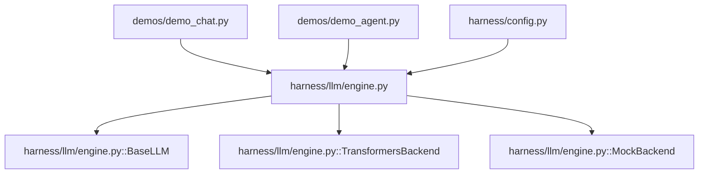
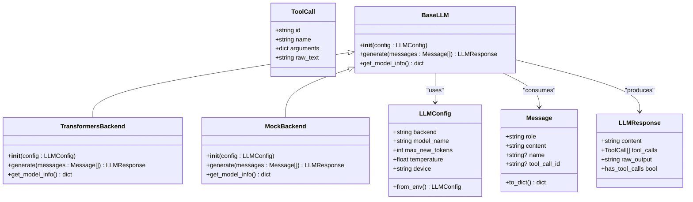
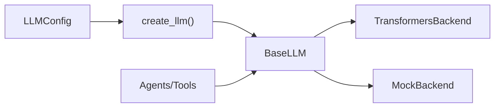

# Base LLM Interface

<cite>
**Referenced Files in This Document**
- [engine.py](file://harness/llm/engine.py)
- [config.py](file://harness/config.py)
- [demo_chat.py](file://demos/demo_chat.py)
- [demo_agent.py](file://demos/demo_agent.py)
</cite>

## Table of Contents
1. [Introduction](#introduction)
2. [Project Structure](#project-structure)
3. [Core Components](#core-components)
4. [Architecture Overview](#architecture-overview)
5. [Detailed Component Analysis](#detailed-component-analysis)
6. [Dependency Analysis](#dependency-analysis)
7. [Performance Considerations](#performance-considerations)
8. [Troubleshooting Guide](#troubleshooting-guide)
9. [Conclusion](#conclusion)
10. [Appendices](#appendices)

## Introduction
This document explains the BaseLLM abstract class that defines the common interface for all language model backends in HarnessAIDemo. It focuses on the required methods generate() and get_model_info(), their parameters, return values, and how they integrate with LLMConfig. It also shows how to implement a custom backend by extending BaseLLM, including proper method signatures and error handling patterns, and explains the design rationale behind the abstract interface that enables a pluggable architecture.

## Project Structure
HarnessAIDemo organizes LLM-related code under harness/llm, with configuration under harness/config. The BaseLLM interface and concrete backends live in engine.py, while demos demonstrate usage via create_llm().

**Diagram sources**
- [engine.py:127-146](file://harness/llm/engine.py#L127-L146)
- [engine.py:151-249](file://harness/llm/engine.py#L151-L249)
- [engine.py:254-399](file://harness/llm/engine.py#L254-L399)
- [config.py:9-34](file://harness/config.py#L9-L34)
- [demo_chat.py:17-43](file://demos/demo_chat.py#L17-L43)
- [demo_agent.py:15-35](file://demos/demo_agent.py#L15-L35)

**Section sources**
- [engine.py:1-18](file://harness/llm/engine.py#L1-L18)
- [config.py:1-34](file://harness/config.py#L1-L34)
- [demo_chat.py:1-47](file://demos/demo_chat.py#L1-L47)
- [demo_agent.py:1-40](file://demos/demo_agent.py#L1-L40)

## Core Components
- BaseLLM: Abstract base class defining the contract for all LLM backends.
- Message, ToolCall, LLMResponse: Data structures used to pass conversation context and responses through the system.
- TransformersBackend: Concrete backend using HuggingFace transformers.
- MockBackend: Deterministic mock backend for demos and tests without GPU.
- create_llm(): Factory that selects a backend based on LLMConfig.

Key responsibilities:
- BaseLLM enforces a uniform interface (generate and get_model_info).
- Backends encapsulate inference details and expose standardized outputs.
- LLMConfig centralizes runtime settings such as backend selection, model name, token limits, temperature, and device.

**Section sources**
- [engine.py:23-57](file://harness/llm/engine.py#L23-L57)
- [engine.py:127-146](file://harness/llm/engine.py#L127-L146)
- [engine.py:151-249](file://harness/llm/engine.py#L151-L249)
- [engine.py:254-399](file://harness/llm/engine.py#L254-L399)
- [engine.py:404-420](file://harness/llm/engine.py#L404-L420)
- [config.py:9-34](file://harness/config.py#L9-L34)

## Architecture Overview
The BaseLLM interface decouples higher-level components (agents, tools, memory) from specific model implementations. Backends are selected at runtime via create_llm() based on LLMConfig.

**Diagram sources**
- [engine.py:23-57](file://harness/llm/engine.py#L23-L57)
- [engine.py:127-146](file://harness/llm/engine.py#L127-L146)
- [engine.py:151-249](file://harness/llm/engine.py#L151-L249)
- [engine.py:254-399](file://harness/llm/engine.py#L254-L399)
- [config.py:9-34](file://harness/config.py#L9-L34)

## Detailed Component Analysis

### BaseLLM Abstract Interface
Purpose:
- Define a stable contract for all LLM backends so agents and tools can operate independently of implementation details.
- Enforce consistent input/output types across backends.

Required methods:
- generate(messages: list[Message]) -> LLMResponse
  - Purpose: Produce a response given the full conversation context.
  - Parameters:
    - messages: Ordered list of Message objects representing the conversation history.
  - Returns:
    - LLMResponse containing:
      - content: Human-readable text response.
      - tool_calls: List of ToolCall objects if the model requests tool usage.
      - raw_output: Raw model output before parsing.
  - Error handling:
    - Raise appropriate exceptions for invalid inputs or backend failures (e.g., missing dependencies, network errors).
    - Ensure tool calls are parsed safely; malformed outputs should not crash the caller.

- get_model_info() -> dict
  - Purpose: Provide metadata about the loaded model/backend for diagnostics and UI display.
  - Returns:
    - A dictionary with keys like backend, model, device, and max_tokens (values vary by backend).
  - Error handling:
    - Should not fail; return safe defaults if some fields are unavailable.

Design rationale:
- Abstraction enables swapping backends without changing agent/tool code.
- Centralized configuration via LLMConfig allows runtime selection and environment-driven setup.
- Standardized data structures simplify integration with parsers, tools, and memory systems.

**Section sources**
- [engine.py:127-146](file://harness/llm/engine.py#L127-L146)
- [engine.py:23-57](file://harness/llm/engine.py#L23-L57)

### LLMConfig Integration
- LLMConfig holds backend selection and model parameters.
- from_env() reads environment variables to configure the LLM at runtime.
- create_llm() uses config.backend to instantiate the correct backend.

Usage pattern:
- Configure via environment or programmatically.
- Pass LLMConfig to create_llm() or directly to backend constructors.

**Section sources**
- [config.py:9-34](file://harness/config.py#L9-L34)
- [engine.py:404-420](file://harness/llm/engine.py#L404-L420)

### Concrete Backends

#### TransformersBackend
- Loads a HuggingFace model and tokenizer.
- Applies chat templates, generates tokens, parses tool calls, and returns LLMResponse.
- get_model_info() reports backend type, model name, device, and max tokens.

Error handling highlights:
- Imports transformers/torch lazily; raises ImportError with installation guidance if missing.
- Uses device auto-detection and falls back to CPU when needed.

**Section sources**
- [engine.py:151-249](file://harness/llm/engine.py#L151-L249)

#### MockBackend
- Pattern-matching-based backend for deterministic behavior without GPU.
- Simulates tool calls for date/time, calculations, and file operations.
- get_model_info() returns mock-specific metadata.

Error handling highlights:
- Gracefully handles empty user input and tool observations.
- Sanitizes extracted expressions to avoid unsafe operations.

**Section sources**
- [engine.py:254-399](file://harness/llm/engine.py#L254-L399)

### Usage in Demos
- Demos obtain an LLM instance via create_llm() and interact with agents/tools.
- They call llm.get_model_info() to display model information.

**Section sources**
- [demo_chat.py:17-43](file://demos/demo_chat.py#L17-L43)
- [demo_agent.py:15-35](file://demos/demo_agent.py#L15-L35)

## Dependency Analysis
Backends depend on LLMConfig for runtime settings and produce/consume standardized data types. Higher-level components depend only on BaseLLM, not on concrete backends.

**Diagram sources**
- [engine.py:404-420](file://harness/llm/engine.py#L404-L420)
- [config.py:9-34](file://harness/config.py#L9-L34)

**Section sources**
- [engine.py:404-420](file://harness/llm/engine.py#L404-L420)
- [config.py:9-34](file://harness/config.py#L9-L34)

## Performance Considerations
- Device selection: TransformersBackend auto-selects CUDA/MPS/CPU; ensure drivers are installed for optimal performance.
- Token limits: Adjust max_new_tokens to balance latency and response length.
- Temperature: Controls randomness; lower values yield more deterministic outputs.
- Parsing overhead: ToolCallParser runs on raw output; keep prompts concise to reduce parsing cost.
- MockBackend is lightweight and suitable for rapid iteration and testing.

[No sources needed since this section provides general guidance]

## Troubleshooting Guide
Common issues and resolutions:
- Missing dependencies for TransformersBackend:
  - Symptom: ImportError mentioning transformers or torch.
  - Resolution: Install required packages as indicated in the exception message.
- Unknown backend:
  - Symptom: ValueError raised by create_llm().
  - Resolution: Set HARNESS_LLM_BACKEND to a supported value ("mock" or "transformers").
- Empty or malformed tool calls:
  - Symptom: No tool calls detected despite model output.
  - Resolution: Check prompt formatting and ensure tool call blocks match expected patterns.
- Device mismatch:
  - Symptom: Slow performance or out-of-memory errors.
  - Resolution: Verify device setting and available hardware; use "auto" to let the backend choose.

**Section sources**
- [engine.py:171-179](file://harness/llm/engine.py#L171-L179)
- [engine.py:413-420](file://harness/llm/engine.py#L413-L420)

## Conclusion
BaseLLM provides a clean, extensible interface that isolates inference details from the rest of the system. By implementing generate() and get_model_info(), any backend can plug into HarnessAIDemo seamlessly. LLMConfig centralizes runtime settings, and create_llm() enables dynamic backend selection. This design supports experimentation, testing, and production deployments with minimal coupling.

[No sources needed since this section summarizes without analyzing specific files]

## Appendices

### Implementing a Custom Backend: Step-by-Step
1. Create a new class that extends BaseLLM.
2. Implement __init__(self, config: LLMConfig) and call super().__init__(config).
3. Implement generate(self, messages: list[Message]) -> LLMResponse:
   - Accept a list of Message objects.
   - Return an LLMResponse with content, tool_calls, and raw_output.
   - Handle errors gracefully and raise meaningful exceptions when necessary.
4. Implement get_model_info(self) -> dict:
   - Return a dictionary describing your backend (e.g., backend, model, device, max_tokens).
5. Register your backend in create_llm() or use it directly by instantiating your class with LLMConfig.

Example references:
- See TransformersBackend and MockBackend for complete implementations and error handling patterns.

**Section sources**
- [engine.py:127-146](file://harness/llm/engine.py#L127-L146)
- [engine.py:151-249](file://harness/llm/engine.py#L151-L249)
- [engine.py:254-399](file://harness/llm/engine.py#L254-L399)
- [engine.py:404-420](file://harness/llm/engine.py#L404-L420)

### API Reference Summary
- BaseLLM.generate(messages: list[Message]) -> LLMResponse
  - Input: Conversation history as Message objects.
  - Output: Structured response with optional tool calls.
- BaseLLM.get_model_info() -> dict
  - Output: Metadata about the backend/model.
- LLMConfig
  - Fields: backend, model_name, max_new_tokens, temperature, device.
  - Method: from_env() to load from environment variables.

**Section sources**
- [engine.py:127-146](file://harness/llm/engine.py#L127-L146)
- [config.py:9-34](file://harness/config.py#L9-L34)