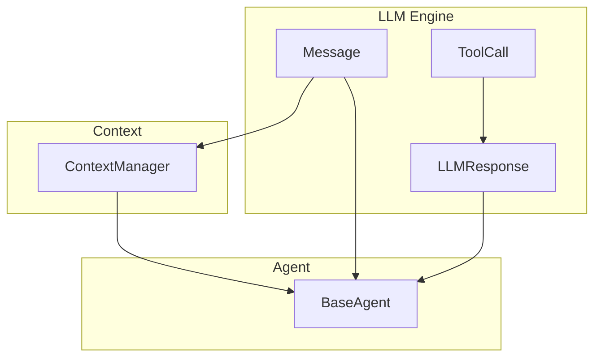
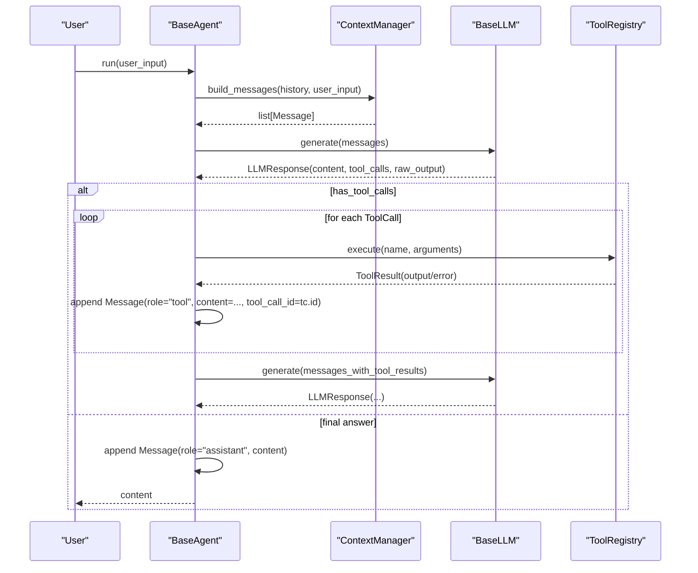
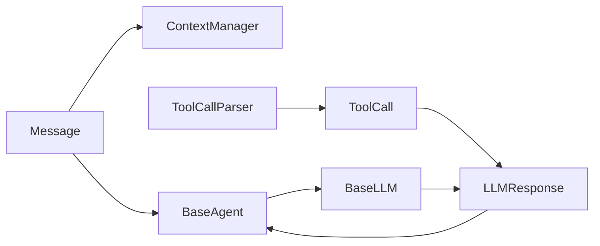

# Data Structures

<cite>
**Referenced Files in This Document**
- [engine.py](file://harness/llm/engine.py)
- [base.py](file://harness/agent/base.py)
- [manager.py](file://harness/context/manager.py)
- [chat.py](file://harness/agent/chat.py)
</cite>

## Table of Contents
1. [Introduction](#introduction)
2. [Project Structure](#project-structure)
3. [Core Components](#core-components)
4. [Architecture Overview](#architecture-overview)
5. [Detailed Component Analysis](#detailed-component-analysis)
6. [Dependency Analysis](#dependency-analysis)
7. [Performance Considerations](#performance-considerations)
8. [Troubleshooting Guide](#troubleshooting-guide)
9. [Conclusion](#conclusion)
10. [Appendices](#appendices)

## Introduction
This document explains the core data structures that power the LLM engine: Message, ToolCall, and LLMResponse. It details their fields, roles, relationships, and how they coordinate communication between agents, tools, and LLM backends. You will also learn how these structures are used to build conversation context, parse tool calls from model output, and orchestrate multi-step agent loops.

## Project Structure
The data structures live in the LLM engine module and are consumed by the agent loop and context manager to assemble prompts, execute tools, and maintain conversation history.

**Diagram sources**
- [engine.py:23-56](file://harness/llm/engine.py#L23-L56)
- [manager.py:41-104](file://harness/context/manager.py#L41-L104)
- [base.py:63-160](file://harness/agent/base.py#L63-L160)

**Section sources**
- [engine.py:1-16](file://harness/llm/engine.py#L1-L16)
- [manager.py:1-18](file://harness/context/manager.py#L1-L18)
- [base.py:1-35](file://harness/agent/base.py#L1-L35)

## Core Components
- Message: Represents a single turn in the conversation with a role (system, user, assistant, tool), content text, optional name, and optional tool_call_id for linking tool results to tool calls.
- ToolCall: Encapsulates a request to call a tool, including a unique id, tool name, arguments dict, and raw_text for tracing.
- LLMResponse: The structured response from an LLM backend containing textual content, zero or more tool_calls, and the raw_output string for debugging.

These types form the contract between the agent loop, the LLM backends, and the tool registry.

**Section sources**
- [engine.py:23-56](file://harness/llm/engine.py#L23-L56)

## Architecture Overview
The agent loop orchestrates a cycle:
- Build messages using ContextManager (system prompt, memory, history, current input).
- Call LLM.generate(messages) to get an LLMResponse.
- If no tool_calls, return content as final answer; otherwise execute each ToolCall and feed results back as tool messages.
- Repeat until the LLM returns a final answer or max iterations is reached.

**Diagram sources**
- [base.py:97-160](file://harness/agent/base.py#L97-L160)
- [manager.py:61-104](file://harness/context/manager.py#L61-L104)
- [engine.py:206-241](file://harness/llm/engine.py#L206-L241)

## Detailed Component Analysis

### Message
Purpose:
- Models a single message in the conversation with a clear role-based semantics:
  - system: instructions and tool descriptions injected into the prompt.
  - user: the latest user input or empty placeholder during tool-result feedback.
  - assistant: the LLM’s textual reply or intermediate reasoning.
  - tool: observation returned after executing a tool, linked via tool_call_id.

Key fields:
- role: str — one of system/user/assistant/tool.
- content: str — the message body.
- name: Optional[str] — optional identifier (e.g., tool name when posting tool observations).
- tool_call_id: Optional[str] — links a tool result to the original ToolCall.id.

Serialization:
- to_dict() returns a minimal dict with role and content, plus name if present. This format is used by backends to apply chat templates.

Usage patterns:
- ContextManager builds the initial system message and appends user messages.
- Agent appends assistant messages and tool messages after execution.
- Chat helpers can serialize history to dicts for UI or logging.

**Section sources**
- [engine.py:23-35](file://harness/llm/engine.py#L23-L35)
- [manager.py:77-99](file://harness/context/manager.py#L77-L99)
- [base.py:122-152](file://harness/agent/base.py#L122-L152)
- [chat.py:54-59](file://harness/agent/chat.py#L54-L59)

### ToolCall
Purpose:
- Represents a structured request to invoke a tool extracted from the LLM’s output.

Key fields:
- id: str — unique identifier generated at parse time (or mock generation) to correlate tool results with calls.
- name: str — tool name to look up in the registry.
- arguments: dict — parameters passed to the tool.
- raw_text: str — the original snippet from which this ToolCall was parsed (useful for debugging and stripping from content).

Id generation:
- When parsing free-form text, ids are generated as short UUID fragments.
- In mock backends, ids follow a deterministic pattern for reproducibility.

Name validation and arguments format:
- Parsing accepts multiple JSON shapes for flexibility (name/tool, arguments/args/parameters).
- Arguments may be provided as a dict or a JSON string; parser normalizes to dict.
- Name must be non-empty and arguments must be a dict to produce a valid ToolCall.

Parsing behavior:
- Supports triple-backtick blocks, Action/Action Input patterns, and bare JSON objects containing name and arguments.
- Deduplicates identical calls based on name+arguments.

**Section sources**
- [engine.py:38-44](file://harness/llm/engine.py#L38-L44)
- [engine.py:61-122](file://harness/llm/engine.py#L61-L122)
- [engine.py:300-357](file://harness/llm/engine.py#L300-L357)

### LLMResponse
Purpose:
- Encapsulates the complete output from an LLM backend, separating human-readable content from structured tool calls and preserving raw output for inspection.

Key fields:
- content: str — cleaned text without embedded tool-call blocks.
- tool_calls: list[ToolCall] — zero or more tool invocations requested by the model.
- raw_output: str — unmodified model output before cleaning.

Utility:
- has_tool_calls property indicates whether any tool calls were detected.

Composition:
- Backends populate content and tool_calls; tool_calls are derived from raw_output via parsing.
- Agents branch on has_tool_calls to decide whether to continue the loop or return a final answer.

**Section sources**
- [engine.py:47-56](file://harness/llm/engine.py#L47-L56)
- [engine.py:206-241](file://harness/llm/engine.py#L206-L241)
- [base.py:119-125](file://harness/agent/base.py#L119-L125)

### Conversation Flow and Role System
- system: Provides instructions and tool descriptions; constructed by ContextManager.
- user: Current input; appended by ContextManager.
- assistant: LLM’s textual reply; appended by Agent after each LLM call.
- tool: Observation after executing a ToolCall; appended by Agent with tool_call_id matching the original ToolCall.id.

This role sequence ensures the LLM sees a coherent narrative: instructions, history, current input, tool intents, tool results, and final answers.

**Section sources**
- [manager.py:77-99](file://harness/context/manager.py#L77-L99)
- [base.py:122-152](file://harness/agent/base.py#L122-L152)

### Serialization and Interop
- Message.to_dict(): Produces a compact representation suitable for tokenization and chat templates.
- LLMResponse.raw_output: Preserves the exact model output for diagnostics.
- ToolCall.raw_text: Enables removal of tool-call blocks from content to keep responses clean.

These methods facilitate interoperability between agents, tool registries, and LLM backends.

**Section sources**
- [engine.py:31-35](file://harness/llm/engine.py#L31-L35)
- [engine.py:225-241](file://harness/llm/engine.py#L225-L241)

## Dependency Analysis
- BaseAgent depends on Message, LLMResponse, and ToolCall to drive the loop and manage history.
- ContextManager depends on Message to assemble prompts.
- LLM backends depend on Message and produce LLMResponse; they use ToolCallParser to extract ToolCall instances from raw_output.

**Diagram sources**
- [engine.py:23-56](file://harness/llm/engine.py#L23-L56)
- [engine.py:61-122](file://harness/llm/engine.py#L61-L122)
- [base.py:97-160](file://harness/agent/base.py#L97-L160)
- [manager.py:61-104](file://harness/context/manager.py#L61-L104)

**Section sources**
- [engine.py:127-146](file://harness/llm/engine.py#L127-L146)
- [base.py:97-160](file://harness/agent/base.py#L97-L160)
- [manager.py:61-104](file://harness/context/manager.py#L61-L104)

## Performance Considerations
- Token budgeting: ContextManager estimates tokens to stay within limits; ensure tool descriptions and history fit the model’s context window.
- Parsing overhead: ToolCallParser uses regex and JSON parsing; minimize redundant tool-call blocks in raw_output to reduce processing.
- Content cleaning: Stripping tool-call blocks from content avoids bloating assistant messages.

[No sources needed since this section provides general guidance]

## Troubleshooting Guide
Common issues and remedies:
- Missing tool_call_id linkage: Ensure tool messages include tool_call_id equal to the ToolCall.id so the LLM can correlate results.
- Empty or invalid arguments: ToolCallParser requires a dict for arguments; if you supply a string, it will be parsed as JSON automatically.
- Duplicate tool calls: Parser deduplicates by name+arguments; verify your intent to avoid accidental suppression.
- Excessive context: Use ContextManager’s token estimation and trim history or tool descriptions if near limits.

**Section sources**
- [base.py:146-152](file://harness/agent/base.py#L146-L152)
- [engine.py:105-122](file://harness/llm/engine.py#L105-L122)
- [manager.py:110-117](file://harness/context/manager.py#L110-L117)

## Conclusion
Message, ToolCall, and LLMResponse form a clean, composable contract that enables robust agent loops with tool calling. Roles structure the conversation, ToolCall captures structured actions, and LLMResponse separates text from actions while preserving raw output for debugging. Together, they allow agents to plan, act, observe, and respond effectively across diverse LLM backends.

## Appendices

### Practical Usage Examples

- Creating a system message and building context:
  - Use ContextManager.build_messages to prepend a system message, add history, and append the current user input. See usage in the agent loop.

- Executing tool calls and feeding results:
  - After receiving LLMResponse.tool_calls, execute each via ToolRegistry and append a tool message with tool_call_id set to the corresponding ToolCall.id.

- Serializing history for display or storage:
  - Convert Message objects to dicts using Message.to_dict() or helper methods that map role and content.

- Inspecting raw model output:
  - Access LLMResponse.raw_output for full fidelity; access LLMResponse.content for cleaned text.

- Understanding id generation:
  - Parsed ToolCalls receive auto-generated ids; mock backends use deterministic ids for testing.

**Section sources**
- [manager.py:61-104](file://harness/context/manager.py#L61-L104)
- [base.py:127-152](file://harness/agent/base.py#L127-L152)
- [engine.py:31-35](file://harness/llm/engine.py#L31-L35)
- [engine.py:105-122](file://harness/llm/engine.py#L105-L122)
- [engine.py:300-357](file://harness/llm/engine.py#L300-L357)