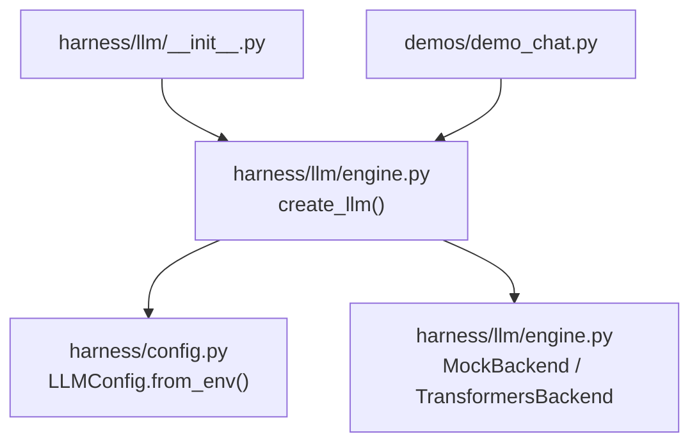
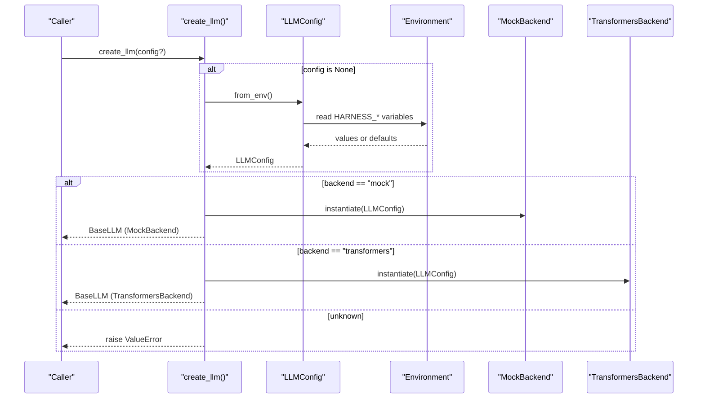
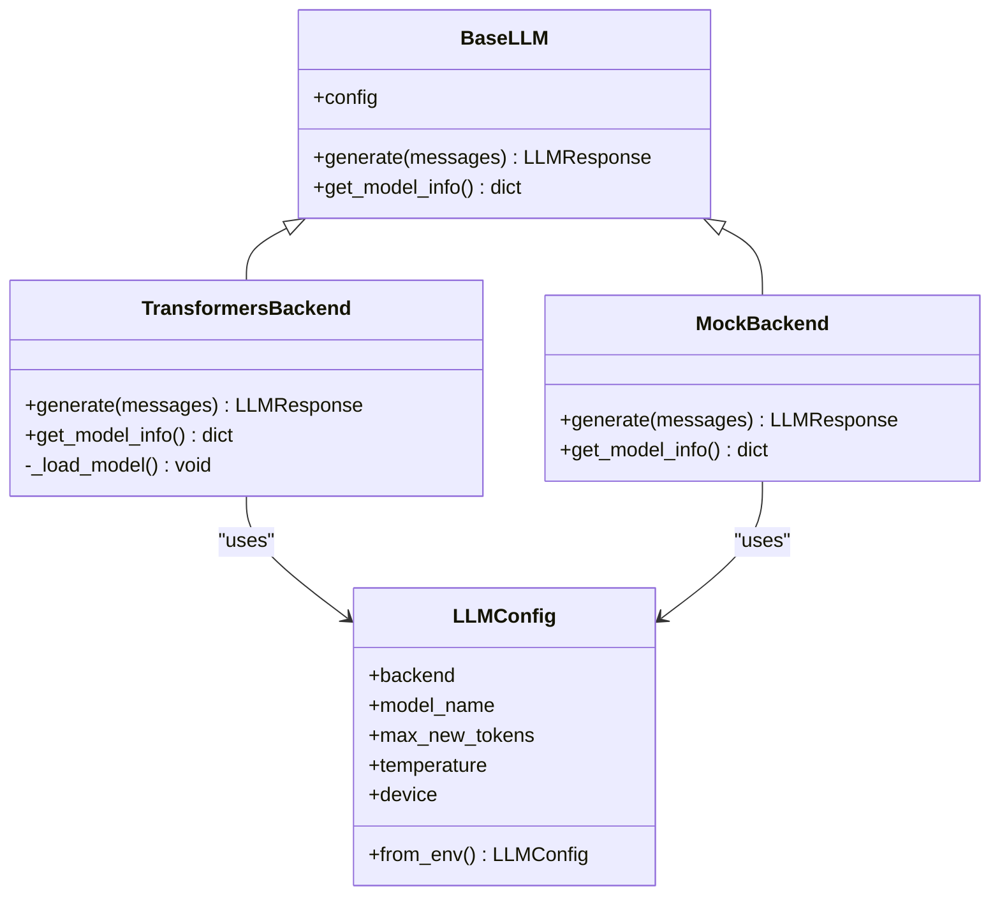
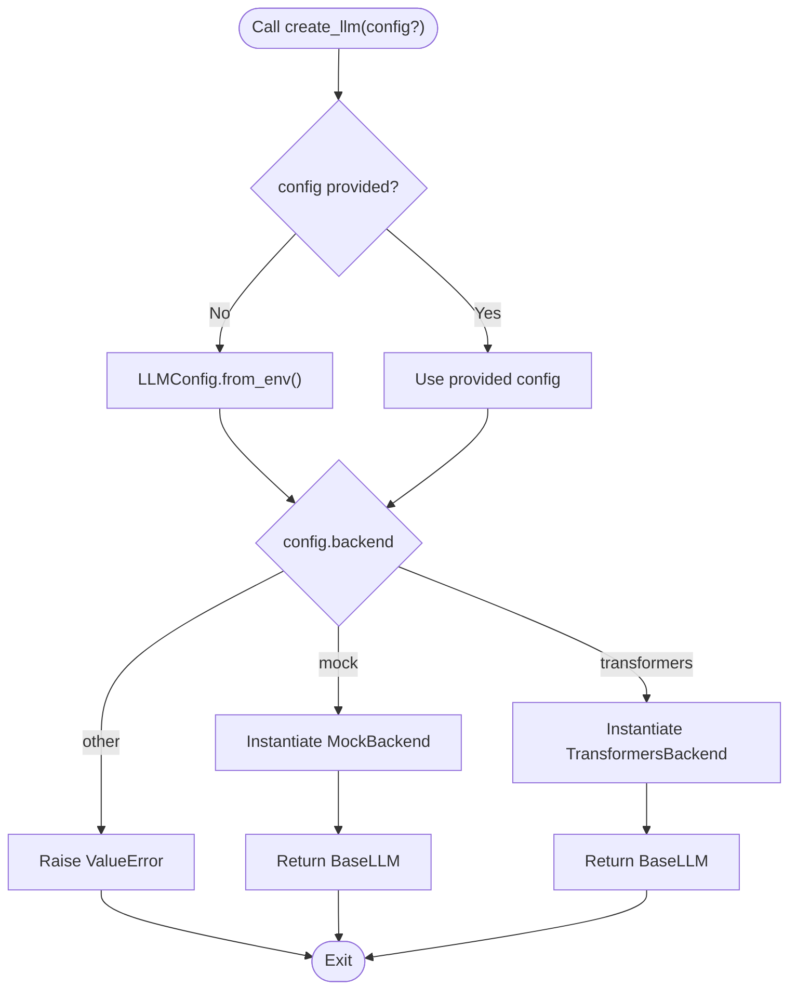
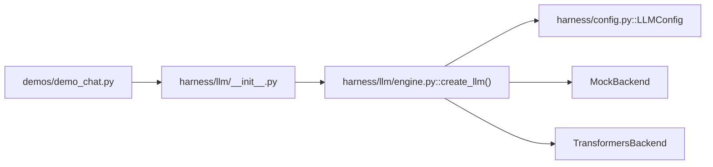

# Factory Function

<cite>
**Referenced Files in This Document**
- [engine.py](file://harness/llm/engine.py)
- [config.py](file://harness/config.py)
- [__init__.py](file://harness/llm/__init__.py)
- [demo_chat.py](file://demos/demo_chat.py)
- [README.md](file://README.md)
</cite>

## Table of Contents
1. [Introduction](#introduction)
2. [Project Structure](#project-structure)
3. [Core Components](#core-components)
4. [Architecture Overview](#architecture-overview)
5. [Detailed Component Analysis](#detailed-component-analysis)
6. [Dependency Analysis](#dependency-analysis)
7. [Performance Considerations](#performance-considerations)
8. [Troubleshooting Guide](#troubleshooting-guide)
9. [Conclusion](#conclusion)
10. [Appendices](#appendices)

## Introduction
This document explains the create_llm() factory function, which is the main entry point for creating LLM engine instances in the HarnessAIDemo project. It details how configuration is read from LLMConfig to select a backend implementation (mock vs transformers), how environment variables are integrated via LLMConfig.from_env(), and what happens when an unknown backend type is provided. It also covers logging behavior during initialization and provides examples and integration patterns with the broader framework.

## Project Structure
The LLM subsystem is implemented under harness/llm and depends on the central configuration module harness/config. The create_llm() function is exposed through the package’s public interface and used by demos and other components.

**Diagram sources**
- [__init__.py:1-6](file://harness/llm/__init__.py#L1-L6)
- [engine.py:404-421](file://harness/llm/engine.py#L404-L421)
- [config.py:8-34](file://harness/config.py#L8-L34)
- [demo_chat.py:1-47](file://demos/demo_chat.py#L1-L47)

**Section sources**
- [engine.py:1-18](file://harness/llm/engine.py#L1-L18)
- [config.py:1-34](file://harness/config.py#L1-L34)
- [__init__.py:1-6](file://harness/llm/__init__.py#L1-L6)
- [demo_chat.py:1-47](file://demos/demo_chat.py#L1-L47)

## Core Components
- create_llm(config=None): Factory that returns a BaseLLM subclass instance based on LLMConfig.backend. If no config is provided, it loads defaults from environment variables.
- LLMConfig: Dataclass holding backend selection and model parameters; supports creation from environment variables.
- MockBackend: Deterministic, pattern-based backend suitable for demos and testing without GPU.
- TransformersBackend: Real inference backend using HuggingFace transformers and PyTorch.

Key responsibilities:
- Backend selection driven by configuration
- Environment-driven configuration loading
- Logging of selected backend and model info
- Error handling for unsupported backends

**Section sources**
- [engine.py:127-146](file://harness/llm/engine.py#L127-L146)
- [engine.py:151-249](file://harness/llm/engine.py#L151-L249)
- [engine.py:254-399](file://harness/llm/engine.py#L254-L399)
- [config.py:8-34](file://harness/config.py#L8-L34)

## Architecture Overview
The factory function centralizes backend instantiation. It reads configuration, logs the chosen backend, and returns a concrete implementation that adheres to the BaseLLM interface.

**Diagram sources**
- [engine.py:404-421](file://harness/llm/engine.py#L404-L421)
- [config.py:25-34](file://harness/config.py#L25-L34)

## Detailed Component Analysis

### create_llm(): Configuration-driven Backend Selection
Behavior:
- If called without arguments, it constructs LLMConfig from environment variables via LLMConfig.from_env().
- Selects backend based on config.backend:
  - "mock": instantiates MockBackend and logs that no model download is needed.
  - "transformers": instantiates TransformersBackend and logs the model name being used.
- Raises ValueError if config.backend is neither "mock" nor "transformers".

Configuration options influencing selection:
- backend: selects mock or transformers.
- model_name: used by transformers backend to load the model.
- max_new_tokens, temperature, device: influence generation behavior in transformers backend.

Error handling:
- Unknown backend types result in a clear ValueError indicating the invalid value.

Logging:
- Logs which backend is selected and, for transformers, the model name.

Integration points:
- Used throughout demos and higher-level components via harness.llm.__init__.py exports.

Example usage patterns:
- Programmatic creation with explicit config.
- Environment-driven creation by setting HARNESS_LLM_BACKEND and related variables.
- Integration with agents and tools by passing the returned BaseLLM instance.

**Section sources**
- [engine.py:404-421](file://harness/llm/engine.py#L404-L421)
- [config.py:8-34](file://harness/config.py#L8-L34)
- [__init__.py:1-6](file://harness/llm/__init__.py#L1-L6)
- [demo_chat.py:1-47](file://demos/demo_chat.py#L1-L47)

### LLMConfig and Environment Integration
- Default values:
  - backend: "transformers"
  - model_name: "Qwen/Qwen2.5-0.5B-Instruct"
  - max_new_tokens: 512
  - temperature: 0.7
  - device: "auto"
- Environment variables mapped by LLMConfig.from_env():
  - HARNESS_LLM_BACKEND -> backend
  - HARNESS_MODEL_NAME -> model_name
  - HARNESS_MAX_TOKENS -> max_new_tokens
  - HARNESS_TEMPERATURE -> temperature
  - HARNESS_DEVICE -> device

Default configuration behavior:
- When no config is passed to create_llm(), defaults are loaded from environment variables, falling back to built-in defaults if not set.

**Section sources**
- [config.py:8-34](file://harness/config.py#L8-L34)
- [engine.py:404-421](file://harness/llm/engine.py#L404-L421)

### Backends: Mock vs Transformers

#### MockBackend
- Purpose: deterministic, pattern-based responses for demos and tests without requiring GPU or model downloads.
- Behavior: inspects conversation messages to decide whether to call simulated tools (datetime, calculator, file_ops) or return simple text.
- Model info: reports backend as "mock" and indicates N/A for device and max tokens.

Use cases:
- Quick iteration and testing
- Demonstrating agent loops and tool orchestration without heavy dependencies

**Section sources**
- [engine.py:254-399](file://harness/llm/engine.py#L254-L399)

#### TransformersBackend
- Purpose: real inference using HuggingFace transformers and PyTorch.
- Initialization:
  - Imports transformers and torch lazily to avoid unnecessary dependencies when not using this backend.
  - Loads tokenizer and model from model_name with trust_remote_code enabled.
  - Device selection logic:
    - "auto" chooses cuda if available, mps if available, otherwise cpu.
    - dtype is float16 for non-cpu devices, float32 for cpu.
- Generation:
  - Applies chat template via tokenizer.apply_chat_template.
  - Generates new tokens with configurable max_new_tokens and temperature.
  - Parses tool calls from raw output and strips tool call blocks from content.
- Model info: reports backend, model name, device, and max tokens.

Dependencies:
- Requires transformers and torch packages; ImportError is raised with installation guidance if missing.

**Section sources**
- [engine.py:151-249](file://harness/llm/engine.py#L151-L249)

### Class Relationships

**Diagram sources**
- [engine.py:127-146](file://harness/llm/engine.py#L127-L146)
- [engine.py:151-249](file://harness/llm/engine.py#L151-L249)
- [engine.py:254-399](file://harness/llm/engine.py#L254-L399)
- [config.py:8-34](file://harness/config.py#L8-L34)

### Sequence: create_llm() Flow

**Diagram sources**
- [engine.py:404-421](file://harness/llm/engine.py#L404-L421)
- [config.py:25-34](file://harness/config.py#L25-L34)

## Dependency Analysis
- create_llm() depends on:
  - LLMConfig for configuration and environment mapping
  - MockBackend and TransformersBackend implementations
  - Python logging for diagnostic output
- Public exposure:
  - harness/llm/__init__.py re-exports create_llm() and related classes for convenient imports.
- Demo integration:
  - demos/demo_chat.py sets environment to use mock backend by default and creates an LLM via create_llm().

**Diagram sources**
- [demo_chat.py:1-47](file://demos/demo_chat.py#L1-L47)
- [__init__.py:1-6](file://harness/llm/__init__.py#L1-L6)
- [engine.py:404-421](file://harness/llm/engine.py#L404-L421)
- [config.py:8-34](file://harness/config.py#L8-L34)

**Section sources**
- [__init__.py:1-6](file://harness/llm/__init__.py#L1-L6)
- [demo_chat.py:1-47](file://demos/demo_chat.py#L1-L47)
- [engine.py:404-421](file://harness/llm/engine.py#L404-L421)
- [config.py:8-34](file://harness/config.py#L8-L34)

## Performance Considerations
- MockBackend:
  - No model download or GPU required; fast startup and low resource usage.
  - Suitable for rapid iteration and testing.
- TransformersBackend:
  - First run downloads and caches models; subsequent runs reuse cached artifacts.
  - Device auto-detection optimizes performance by selecting CUDA/MPS when available.
  - Dtype selection (float16 vs float32) balances speed and memory usage.
  - Generation respects max_new_tokens and temperature settings.

[No sources needed since this section provides general guidance]

## Troubleshooting Guide
Common issues and resolutions:
- Unknown backend error:
  - Symptom: ValueError indicating an unknown LLM backend.
  - Cause: config.backend is not "mock" or "transformers".
  - Resolution: Set HARNESS_LLM_BACKEND to one of the supported values or pass a valid LLMConfig.
- Missing dependencies for transformers backend:
  - Symptom: ImportError mentioning transformers and torch.
  - Cause: Required packages not installed.
  - Resolution: Install transformers, torch, and accelerate as indicated by the error message.
- Unexpected model/device behavior:
  - Symptom: Slow inference or out-of-memory errors.
  - Cause: Incorrect device selection or too large model/dtype.
  - Resolution: Adjust HARNESS_DEVICE and HARNESS_MODEL_NAME; consider CPU fallback or smaller models.

Logging and debugging tips:
- Inspect log messages printed during backend selection and model loading to verify configuration.
- Use get_model_info() on the returned BaseLLM instance to confirm backend, model name, device, and token limits.

**Section sources**
- [engine.py:171-179](file://harness/llm/engine.py#L171-L179)
- [engine.py:181-204](file://harness/llm/engine.py#L181-L204)
- [engine.py:404-421](file://harness/llm/engine.py#L404-L421)

## Conclusion
The create_llm() factory function provides a clean, configuration-driven way to obtain an LLM engine instance. By leveraging LLMConfig and environment variables, it supports both lightweight mock execution and full transformer-based inference. Clear logging and explicit error handling make it straightforward to diagnose configuration issues and integrate the LLM into agents, tools, and demos within the HarnessAIDemo framework.

[No sources needed since this section summarizes without analyzing specific files]

## Appendices

### Configuration Options Reference
- backend: "mock" | "transformers"
- model_name: HuggingFace model identifier (used by transformers backend)
- max_new_tokens: maximum tokens per response
- temperature: sampling temperature
- device: "cpu" | "cuda" | "mps" | "auto"

Environment variables:
- HARNESS_LLM_BACKEND
- HARNESS_MODEL_NAME
- HARNESS_MAX_TOKENS
- HARNESS_TEMPERATURE
- HARNESS_DEVICE

**Section sources**
- [config.py:8-34](file://harness/config.py#L8-L34)
- [README.md:287-298](file://README.md#L287-L298)

### Example Usage Patterns
- Programmatic creation with explicit config:
  - Import LLMConfig and create_llm(), then pass a configured LLMConfig instance to select backend and model parameters.
- Environment-driven creation:
  - Set HARNESS_LLM_BACKEND and related variables before calling create_llm() without arguments.
- Integration with agents:
  - Create an LLM via create_llm() and pass it to agent constructors along with tool registries and memory stores.

References:
- See demo_chat.py for a complete example of environment setup and LLM creation.

**Section sources**
- [demo_chat.py:1-47](file://demos/demo_chat.py#L1-L47)
- [engine.py:404-421](file://harness/llm/engine.py#L404-L421)
- [config.py:8-34](file://harness/config.py#L8-L34)