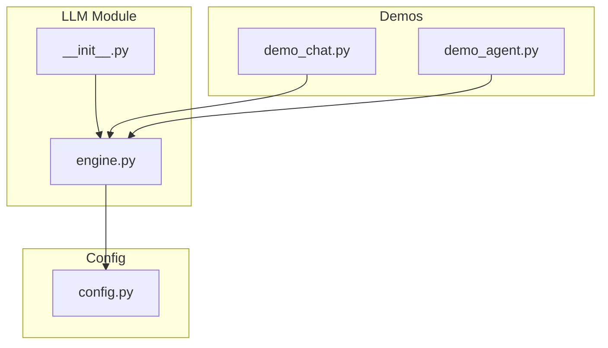
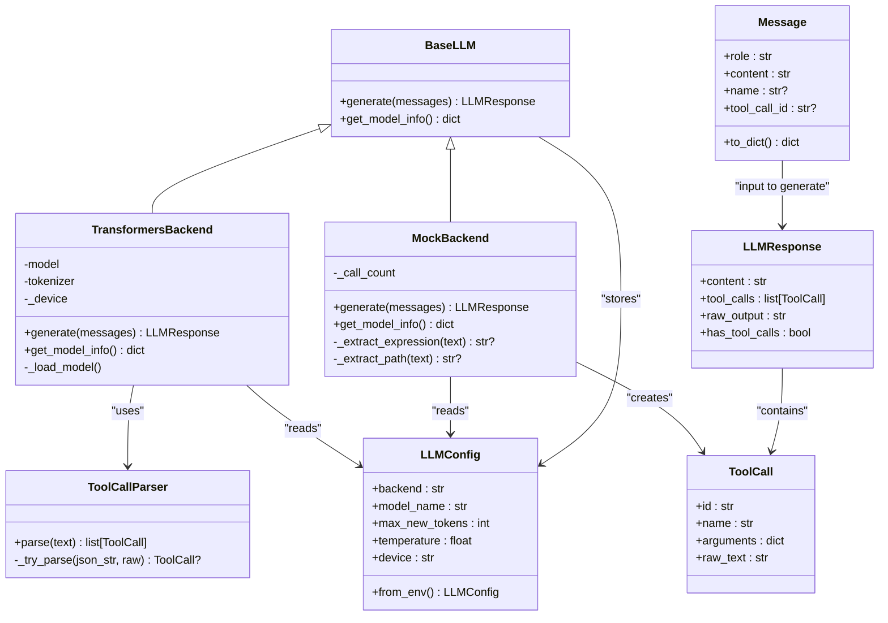
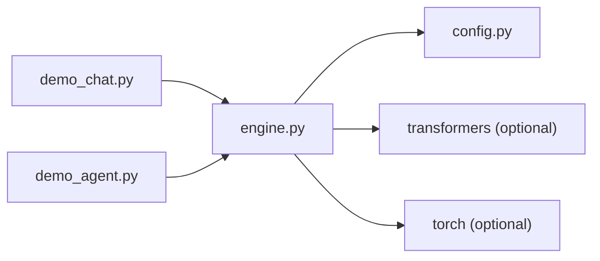

# LLM Engine APIs

<cite>
**Referenced Files in This Document**
- [engine.py](file://harness/llm/engine.py)
- [config.py](file://harness/config.py)
- [__init__.py](file://harness/llm/__init__.py)
- [demo_chat.py](file://demos/demo_chat.py)
- [demo_agent.py](file://demos/demo_agent.py)
</cite>

## Table of Contents
1. [Introduction](#introduction)
2. [Project Structure](#project-structure)
3. [Core Components](#core-components)
4. [Architecture Overview](#architecture-overview)
5. [Detailed Component Analysis](#detailed-component-analysis)
6. [Dependency Analysis](#dependency-analysis)
7. [Performance Considerations](#performance-considerations)
8. [Troubleshooting Guide](#troubleshooting-guide)
9. [Conclusion](#conclusion)
10. [Appendices](#appendices)

## Introduction
This document provides detailed API documentation for the LLM engine interface and implementations in HarnessAIDemo. It covers:
- The BaseLLM abstract class that defines the common interface for all language model backends
- TransformersBackend for real model inference with model loading, configuration options, and performance tuning
- MockBackend for deterministic testing without GPU requirements
- Data structures: Message, ToolCall, and LLMResponse
- Examples of backend initialization, text generation, tool call parsing, and error handling
- The pluggable architecture enabling custom backend implementations and guidelines for extending the engine

## Project Structure
The LLM engine is implemented under harness/llm and integrates with configuration from harness/config. Demos demonstrate usage patterns.

**Diagram sources**
- [engine.py:1-421](file://harness/llm/engine.py#L1-L421)
- [__init__.py:1-6](file://harness/llm/__init__.py#L1-L6)
- [config.py:1-70](file://harness/config.py#L1-L70)
- [demo_chat.py:1-47](file://demos/demo_chat.py#L1-L47)
- [demo_agent.py:1-40](file://demos/demo_agent.py#L1-L40)

**Section sources**
- [engine.py:1-421](file://harness/llm/engine.py#L1-L421)
- [config.py:1-70](file://harness/config.py#L1-L70)
- [__init__.py:1-6](file://harness/llm/__init__.py#L1-L6)
- [demo_chat.py:1-47](file://demos/demo_chat.py#L1-L47)
- [demo_agent.py:1-40](file://demos/demo_agent.py#L1-L40)

## Core Components
- BaseLLM: Abstract base defining generate(messages) -> LLMResponse and get_model_info() -> dict
- TransformersBackend: Real model inference via HuggingFace transformers with device auto-detection and chat template formatting
- MockBackend: Deterministic pattern-based responses for testing without GPU
- ToolCallParser: Extracts structured tool calls from free-form model output using multiple formats
- Data types: Message, ToolCall, LLMResponse
- Factory: create_llm(config) selects backend based on config.backend

Key responsibilities:
- Standardized interface for any LLM backend
- Unified data flow through Message and LLMResponse
- Robust tool call extraction from varied model outputs
- Easy switching between mock and real backends via configuration

**Section sources**
- [engine.py:21-147](file://harness/llm/engine.py#L21-L147)
- [engine.py:151-249](file://harness/llm/engine.py#L151-L249)
- [engine.py:254-400](file://harness/llm/engine.py#L254-L400)
- [engine.py:404-421](file://harness/llm/engine.py#L404-L421)
- [config.py:8-34](file://harness/config.py#L8-L34)

## Architecture Overview
The LLM engine exposes a clean abstraction over different backends. Consumers interact with BaseLLM via generate() and receive LLMResponse objects containing content and optional tool_calls. A factory function creates the appropriate backend based on configuration.

**Diagram sources**
- [engine.py:21-147](file://harness/llm/engine.py#L21-L147)
- [engine.py:151-249](file://harness/llm/engine.py#L151-L249)
- [engine.py:254-400](file://harness/llm/engine.py#L254-L400)
- [config.py:8-34](file://harness/config.py#L8-L34)

## Detailed Component Analysis

### BaseLLM (Abstract Interface)
- Purpose: Define the contract for all LLM backends
- Methods:
  - generate(messages: list[Message]) -> LLMResponse: produce a response given conversation context
  - get_model_info() -> dict: return backend-specific metadata
- Design: Uses ABC to enforce implementation; stores LLMConfig for runtime parameters

Usage notes:
- All backends must implement both methods
- Consumers should only depend on BaseLLM to remain backend-agnostic

**Section sources**
- [engine.py:127-147](file://harness/llm/engine.py#L127-L147)

### TransformersBackend (Real Model Inference)
- Loads model and tokenizer from HuggingFace Hub
- Applies model-specific chat templates via tokenizer.apply_chat_template
- Generates tokens autoregressively with configurable max_new_tokens and temperature
- Parses tool calls from generated text and strips them from content
- Device auto-detection supports CUDA, MPS, or CPU

Key behaviors:
- Imports transformers and torch lazily to avoid hard dependencies when not needed
- Uses torch.no_grad() during generation
- Decodes only newly generated tokens to extract raw text
- Integrates ToolCallParser to extract structured tool calls

Configuration options used:
- model_name: HuggingFace model identifier
- max_new_tokens: maximum new tokens per generation
- temperature: sampling temperature (controls randomness)
- device: 'cpu', 'cuda', 'mps', or 'auto'

Error handling:
- Raises ImportError if transformers/torch are missing
- Logs model loading status and device selection

**Section sources**
- [engine.py:151-249](file://harness/llm/engine.py#L151-L249)

### MockBackend (Testing Without GPU)
- Provides deterministic, pattern-matching responses for demos and tests
- Recognizes intents like date/time queries, calculations, and file operations
- Returns tool_calls for recognized intents and plain content otherwise
- Tracks call count for debugging/testing

Behavior highlights:
- Handles tool observation messages by synthesizing answers
- Supports multiple input patterns for calculator expressions and file paths
- Always returns LLMResponse with content and tool_calls populated as appropriate

Use cases:
- Quick iteration without downloading models
- Unit tests for agent loops and tool systems
- Demonstrations on machines without GPU

**Section sources**
- [engine.py:254-400](file://harness/llm/engine.py#L254-L400)

### ToolCallParser (Structured Extraction)
- Parses tool calls from free-form model text using multiple formats:
  - Triple-backtick blocks labeled tool_call
  - Action: name / Action Input: json format
  - Bare JSON objects containing name and arguments fields
- Normalizes argument keys (arguments, args, parameters) and stringified JSON
- Deduplicates tool calls by name+arguments key
- Assigns short unique IDs to each parsed tool call

Robustness:
- Gracefully handles malformed JSON or missing fields
- Returns empty list when no valid tool calls found

**Section sources**
- [engine.py:61-123](file://harness/llm/engine.py#L61-L123)

### Data Structures
- Message: Represents a single conversation turn with role, content, optional name, and tool_call_id
  - to_dict(): serializes message for tokenization/chat templates
- ToolCall: Represents a requested tool invocation with id, name, arguments, and raw_text
- LLMResponse: Encapsulates model output including content, tool_calls, raw_output, and has_tool_calls property

These structures standardize data flow across backends and consumers.

**Section sources**
- [engine.py:21-57](file://harness/llm/engine.py#L21-L57)

### Configuration (LLMConfig)
- Controls backend selection, model identity, generation parameters, and device
- Environment variable overrides supported via from_env()
- Defaults enable quick start with a small instruct model

Environment variables:
- HARNESS_LLM_BACKEND: backend type ('transformers' or 'mock')
- HARNESS_MODEL_NAME: HuggingFace model identifier
- HARNESS_MAX_TOKENS: max new tokens
- HARNESS_TEMPERATURE: sampling temperature
- HARNESS_DEVICE: device selection ('auto', 'cpu', 'cuda', 'mps')

**Section sources**
- [config.py:8-34](file://harness/config.py#L8-L34)

### Factory (create_llm)
- Entry point for creating an LLM instance
- Reads config.backend to select MockBackend or TransformersBackend
- Falls back to environment-based configuration if none provided
- Raises ValueError for unknown backend values

Usage example path:
- See demo scripts initializing LLM via create_llm()

**Section sources**
- [engine.py:404-421](file://harness/llm/engine.py#L404-L421)
- [demo_chat.py:1-47](file://demos/demo_chat.py#L1-L47)
- [demo_agent.py:1-40](file://demos/demo_agent.py#L1-L40)

## Dependency Analysis
The LLM module depends on configuration and optionally on external libraries for real model inference.

**Diagram sources**
- [engine.py:1-421](file://harness/llm/engine.py#L1-L421)
- [config.py:1-70](file://harness/config.py#L1-L70)
- [demo_chat.py:1-47](file://demos/demo_chat.py#L1-L47)
- [demo_agent.py:1-40](file://demos/demo_agent.py#L1-L40)

**Section sources**
- [engine.py:1-421](file://harness/llm/engine.py#L1-L421)
- [config.py:1-70](file://harness/config.py#L1-L70)

## Performance Considerations
- Device selection: Use 'auto' to leverage CUDA/MPS when available; fall back to CPU otherwise
- Precision: Float16 on non-CPU devices reduces memory usage; float32 on CPU for stability
- Generation limits: Tune max_new_tokens to balance quality and latency
- Sampling: Adjust temperature to control creativity vs determinism
- Tokenization: Chat templates ensure efficient prompt formatting per model
- Parsing overhead: ToolCallParser deduplicates and normalizes outputs; keep prompts concise to reduce parsing cost

[No sources needed since this section provides general guidance]

## Troubleshooting Guide
Common issues and resolutions:
- Missing dependencies for TransformersBackend:
  - Symptom: ImportError mentioning transformers/torch
  - Resolution: Install required packages as indicated in error message
- Unknown backend value:
  - Symptom: ValueError raised by create_llm
  - Resolution: Set HARNESS_LLM_BACKEND to 'mock' or 'transformers'
- No tool calls detected:
  - Symptom: LLMResponse contains no tool_calls
  - Resolution: Ensure model output includes one of the recognized formats; adjust prompts to encourage structured tool call blocks
- Empty or unexpected content:
  - Symptom: LLMResponse.content is empty or generic
  - Resolution: Check last user message and tool observations; verify message roles and content

**Section sources**
- [engine.py:171-179](file://harness/llm/engine.py#L171-L179)
- [engine.py:413-421](file://harness/llm/engine.py#L413-L421)
- [engine.py:61-123](file://harness/llm/engine.py#L61-L123)

## Conclusion
The HarnessAIDemo LLM engine provides a clean, extensible interface for language model backends with robust tool call parsing and flexible configuration. BaseLLM ensures consistent behavior across TransformersBackend and MockBackend, while create_llm simplifies instantiation. Developers can extend the system by implementing new backends conforming to BaseLLM and integrating them via configuration.

[No sources needed since this section summarizes without analyzing specific files]

## Appendices

### API Usage Examples

- Backend initialization:
  - Use create_llm() with default or custom LLMConfig
  - Switch backends via environment variables or config object
  - Reference: [engine.py:404-421](file://harness/llm/engine.py#L404-L421), [config.py:25-34](file://harness/config.py#L25-L34)

- Text generation:
  - Build a list of Message objects representing conversation history
  - Call backend.generate(messages) to obtain LLMResponse
  - Reference: [engine.py:206-241](file://harness/llm/engine.py#L206-L241)

- Tool call parsing:
  - Use ToolCallParser.parse(raw_text) to extract structured tool calls
  - Handle multiple formats and normalize arguments
  - Reference: [engine.py:61-123](file://harness/llm/engine.py#L61-L123)

- Error handling:
  - Catch ImportError for missing dependencies in TransformersBackend
  - Handle ValueError for unknown backend in create_llm
  - Reference: [engine.py:171-179](file://harness/llm/engine.py#L171-L179), [engine.py:413-421](file://harness/llm/engine.py#L413-L421)

### Extending the Engine

To add a custom backend:
- Implement BaseLLM with generate() and get_model_info()
- Follow the same data contracts: Message input, LLMResponse output
- Integrate via create_llm by adding a new backend branch or registering dynamically
- Test with MockBackend patterns to validate integration

Guidelines:
- Keep imports lazy to avoid hard dependencies
- Respect configuration options (device, temperature, max_new_tokens)
- Ensure tool call parsing compatibility with ToolCallParser expectations
- Provide meaningful model info for diagnostics

[No sources needed since this section provides general guidance]