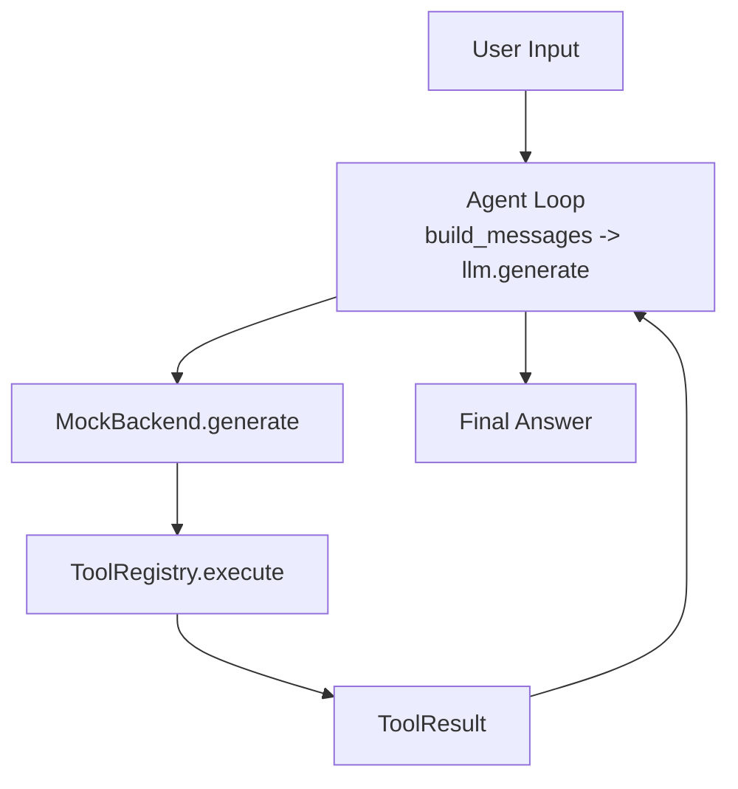
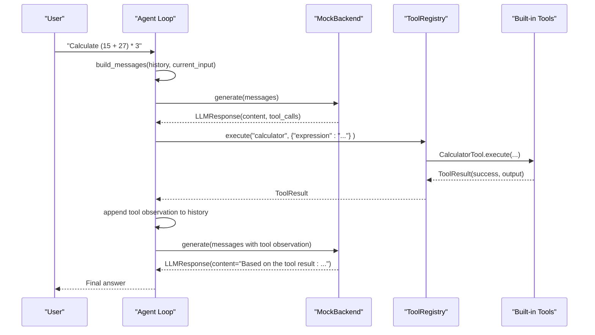
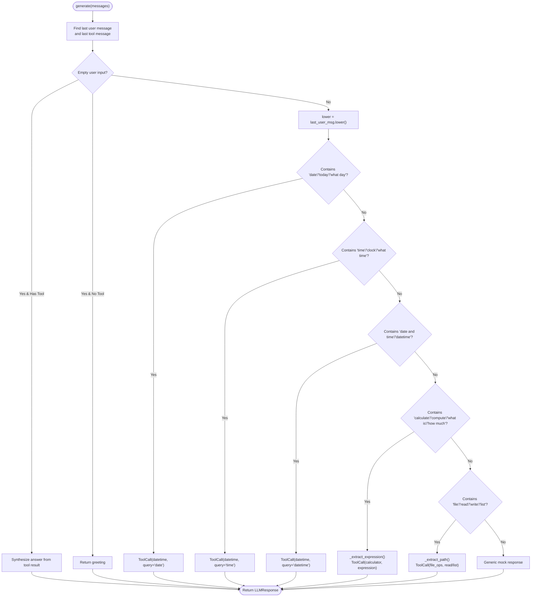
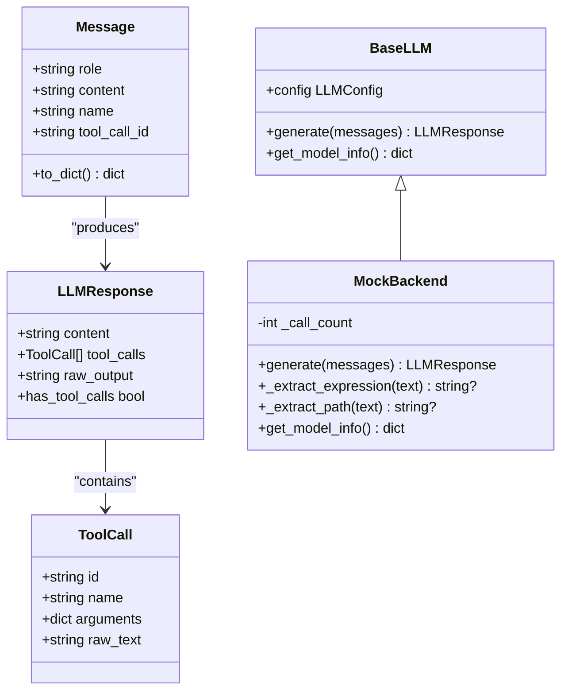
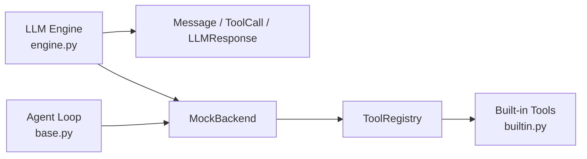

# Mock Backend

<cite>
**Referenced Files in This Document**
- [engine.py](file://harness/llm/engine.py)
- [base.py](file://harness/agent/base.py)
- [builtin.py](file://harness/tools/builtin.py)
- [demo_agent.py](file://demos/demo_agent.py)
- [README.md](file://README.md)
</cite>

## Table of Contents
1. [Introduction](#introduction)
2. [Project Structure](#project-structure)
3. [Core Components](#core-components)
4. [Architecture Overview](#architecture-overview)
5. [Detailed Component Analysis](#detailed-component-analysis)
6. [Dependency Analysis](#dependency-analysis)
7. [Performance Considerations](#performance-considerations)
8. [Troubleshooting Guide](#troubleshooting-guide)
9. [Conclusion](#conclusion)

## Introduction
This document explains the MockBackend implementation used for testing and demos without requiring GPU resources. It focuses on how the backend simulates tool calling behavior through deterministic pattern matching, processes conversation messages to detect user intent, and generates appropriate tool calls or responses. It also documents helper methods for parsing user input, provides usage examples from the demo scripts, and clarifies deterministic behavior and limitations compared to real model backends.

## Project Structure
The MockBackend is part of the LLM engine layer and integrates with the agent loop and tool system:
- LLM Engine defines data types (Message, ToolCall, LLMResponse), a base interface (BaseLLM), and two backends: TransformersBackend and MockBackend.
- The Agent Loop orchestrates context building, LLM calls, tool execution, and iteration until a final answer is produced.
- Built-in tools provide calculator, datetime, and file operations that the MockBackend can simulate invoking via tool calls.
- Demo scripts demonstrate running the agent with the MockBackend to exercise the full flow without downloading models.

**Diagram sources**
- [base.py:97-160](file://harness/agent/base.py#L97-L160)
- [engine.py:254-359](file://harness/llm/engine.py#L254-L359)
- [builtin.py:13-83](file://harness/tools/builtin.py#L13-L83)

**Section sources**
- [engine.py:21-57](file://harness/llm/engine.py#L21-L57)
- [base.py:97-160](file://harness/agent/base.py#L97-L160)
- [builtin.py:13-83](file://harness/tools/builtin.py#L13-L83)
- [demo_agent.py:1-39](file://demos/demo_agent.py#L1-L39)
- [README.md:34-47](file://README.md#L34-L47)

## Core Components
- Message: Represents a single message in a conversation with role, content, optional name, and tool_call_id.
- ToolCall: Represents a request to call a tool with id, name, arguments, and raw_text.
- LLMResponse: Encapsulates content, tool_calls list, and raw_output; includes has_tool_calls property.
- BaseLLM: Abstract interface defining generate() and get_model_info().
- MockBackend: Deterministic backend using keyword-based intent detection to produce tool calls or text responses.
- Built-in Tools: CalculatorTool, DateTimeTool, FileOpsTool registered via register_default_tools().

Key responsibilities:
- MockBackend.parse user intent via keywords and extract parameters using helper methods.
- Generate tool calls for date/time queries, calculations, and file operations.
- Return synthesized answers when receiving tool results as observations.

**Section sources**
- [engine.py:21-57](file://harness/llm/engine.py#L21-L57)
- [engine.py:127-146](file://harness/llm/engine.py#L127-L146)
- [engine.py:254-399](file://harness/llm/engine.py#L254-L399)
- [builtin.py:13-83](file://harness/tools/builtin.py#L13-L83)

## Architecture Overview
The MockBackend fits into the harness as a drop-in replacement for real model inference. It receives a list of Message objects, inspects the last user message and any recent tool observation, then decides whether to:
- Respond directly with text (e.g., greeting or synthesis based on tool result).
- Emit one or more ToolCall objects to invoke built-in tools.
- Provide a fallback response if no recognized intent is detected.

**Diagram sources**
- [base.py:97-160](file://harness/agent/base.py#L97-L160)
- [engine.py:254-359](file://harness/llm/engine.py#L254-L359)
- [builtin.py:13-83](file://harness/tools/builtin.py#L13-L83)

## Detailed Component Analysis

### MockBackend Intent Detection Flow
The generate method implements a deterministic decision tree:
- Extracts the last user message and any recent tool observation.
- Handles empty inputs by returning a greeting or synthesizing an answer from tool results.
- Detects intents via keyword matching:
  - Date/time queries trigger datetime tool calls.
  - Calculation queries trigger calculator tool calls with extracted expressions.
  - File operation queries trigger file_ops tool calls with read/list operations and paths.
- Falls back to a generic response if no intent matches.

**Diagram sources**
- [engine.py:268-359](file://harness/llm/engine.py#L268-L359)

**Section sources**
- [engine.py:268-359](file://harness/llm/engine.py#L268-L359)

### Helper Methods: _extract_expression() and _extract_path()
- _extract_expression(text):
  - Uses regex patterns to find math expressions after phrases like "calculate", "compute", "what is", "how much".
  - Sanitizes the expression to allow only safe numeric and operator characters.
  - If no match, returns a default safe expression ("2+2").
- _extract_path(text):
  - Uses regex to locate file or path references in the text.
  - Falls back to None if not found, allowing callers to supply defaults.

These helpers enable robust parameter extraction for calculator and file_ops tool calls.

**Section sources**
- [engine.py:361-391](file://harness/llm/engine.py#L361-L391)

### Integration with Agent Loop
The Agent Loop drives the end-to-end flow:
- Builds messages via ContextManager.
- Calls llm.generate() to obtain LLMResponse.
- If tool_calls are present, executes them via ToolRegistry and appends tool observations to history.
- Repeats until no tool calls remain, then returns the final answer.

With MockBackend, this loop runs deterministically and quickly, enabling rapid iteration and debugging.

**Section sources**
- [base.py:97-160](file://harness/agent/base.py#L97-L160)

### Usage Examples in Demos
- Single-agent demo sets HARNESS_LLM_BACKEND=mock and exercises tasks like calculation and date/time queries.
- Demonstrates how the agent loop invokes tools and prints results.

Example tasks include:
- "Calculate (15 + 27) * 3"
- "What is today's date?"
- "What time is it now?"

These tasks map to MockBackend’s keyword detection and produce corresponding tool calls.

**Section sources**
- [demo_agent.py:1-39](file://demos/demo_agent.py#L1-L39)
- [README.md:34-47](file://README.md#L34-L47)

### Data Models and Relationships

**Diagram sources**
- [engine.py:21-57](file://harness/llm/engine.py#L21-L57)
- [engine.py:127-146](file://harness/llm/engine.py#L127-L146)
- [engine.py:254-399](file://harness/llm/engine.py#L254-L399)

## Dependency Analysis
MockBackend depends on:
- Data types defined in the LLM engine (Message, ToolCall, LLMResponse).
- Tool registry and built-in tools for executing simulated tool calls.
- Agent loop to orchestrate multi-step interactions.

**Diagram sources**
- [engine.py:21-57](file://harness/llm/engine.py#L21-L57)
- [engine.py:254-399](file://harness/llm/engine.py#L254-L399)
- [base.py:97-160](file://harness/agent/base.py#L97-L160)
- [builtin.py:13-83](file://harness/tools/builtin.py#L13-L83)

**Section sources**
- [engine.py:21-57](file://harness/llm/engine.py#L21-L57)
- [engine.py:254-399](file://harness/llm/engine.py#L254-L399)
- [base.py:97-160](file://harness/agent/base.py#L97-L160)
- [builtin.py:13-83](file://harness/tools/builtin.py#L13-L83)

## Performance Considerations
- Deterministic and fast: No model loading or inference overhead; ideal for quick iterations and CI tests.
- Low resource usage: Runs entirely on CPU with minimal memory footprint.
- Predictable behavior: Keyword matching yields consistent outputs for the same inputs, simplifying debugging and test stability.

[No sources needed since this section provides general guidance]

## Troubleshooting Guide
Common issues and resolutions:
- No tool calls triggered:
  - Ensure user input contains recognized keywords (e.g., "calculate", "date", "time", "file", "read", "list").
  - Verify that expressions are sanitized and contain only allowed characters; otherwise, _extract_expression falls back to a default.
- Unexpected file path:
  - Use explicit file/path references in the prompt so _extract_path can capture them; otherwise, defaults may be used.
- Agent loop stuck:
  - Check max_iterations and ensure tool results are properly appended as observations; verify tool_registry.execute returns success and output.

Debugging tips:
- Enable verbose logging in the agent loop to see LLM raw output and tool call sequences.
- Inspect LLMResponse.tool_calls and LLMResponse.content to confirm intent detection.
- Review ToolResult.success and ToolResult.output for tool execution errors.

**Section sources**
- [base.py:97-160](file://harness/agent/base.py#L97-L160)
- [engine.py:268-359](file://harness/llm/engine.py#L268-L359)
- [builtin.py:13-83](file://harness/tools/builtin.py#L13-L83)

## Conclusion
MockBackend provides a lightweight, deterministic alternative to real model backends for testing and demos. It uses keyword-based intent detection to simulate tool calling for common scenarios such as date/time queries, calculations, and file operations. Its helper methods parse user input reliably, and its integration with the agent loop enables end-to-end workflows without GPU resources. While limited compared to real models in flexibility and nuance, MockBackend excels at stable, repeatable behavior for development, testing, and demonstration purposes.

[No sources needed since this section summarizes without analyzing specific files]