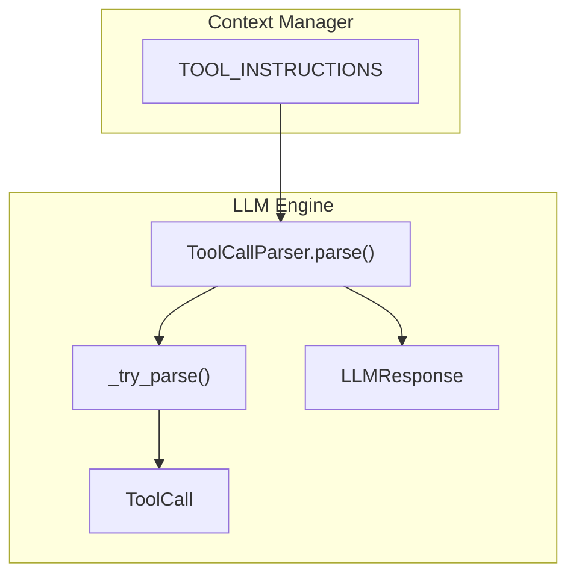
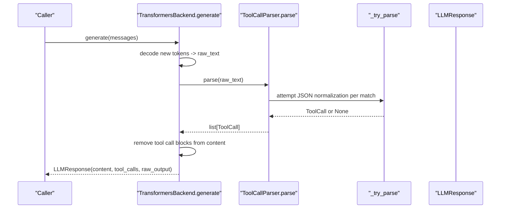
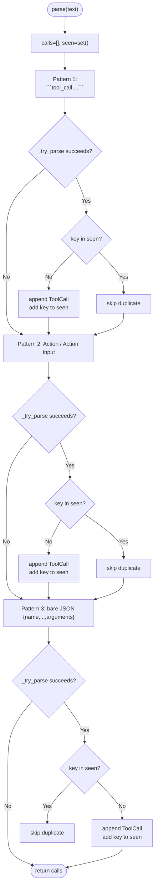
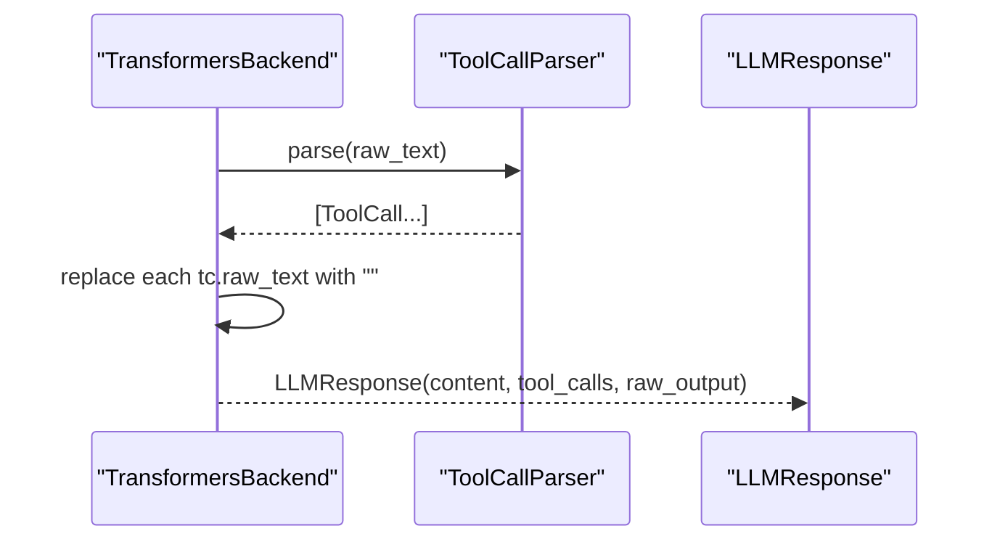
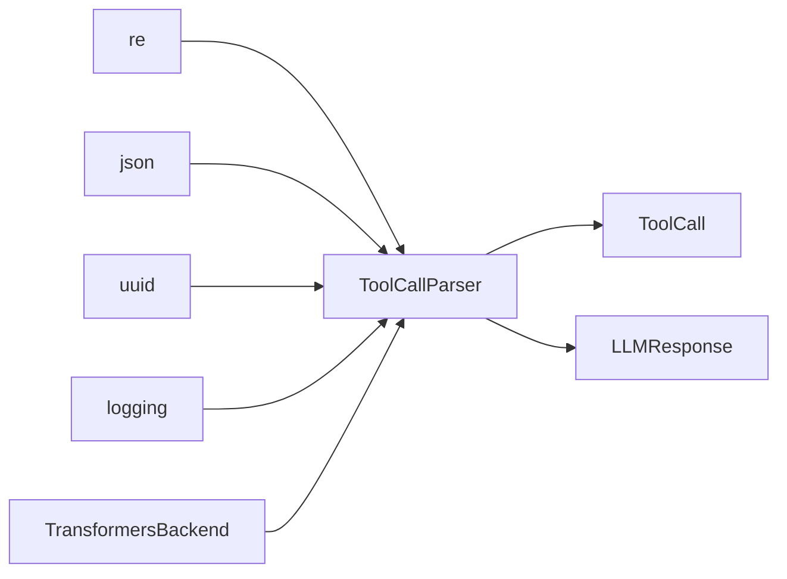

# Tool Call Parser

<cite>
**Referenced Files in This Document**
- [engine.py](file://harness/llm/engine.py)
- [manager.py](file://harness/context/manager.py)
</cite>

## Table of Contents
1. [Introduction](#introduction)
2. [Project Structure](#project-structure)
3. [Core Components](#core-components)
4. [Architecture Overview](#architecture-overview)
5. [Detailed Component Analysis](#detailed-component-analysis)
6. [Dependency Analysis](#dependency-analysis)
7. [Performance Considerations](#performance-considerations)
8. [Troubleshooting Guide](#troubleshooting-guide)
9. [Conclusion](#conclusion)

## Introduction
This document explains the ToolCallParser class that extracts structured tool calls from free-form text produced by large language models. It supports three parsing patterns:
- Triple-backtick code blocks labeled as tool_call
- Action/Action Input format
- Bare JSON objects containing name and arguments

The parser uses robust regex matching, a deduplication mechanism via seen sets, and resilient JSON parsing with fallback strategies to handle variations in LLM output styles. It preserves raw_text for debugging and constructs ToolCall objects with unique identifiers, names, and normalized argument dictionaries.

## Project Structure
The ToolCallParser is implemented within the LLM engine module alongside core data types (Message, ToolCall, LLMResponse). The context manager provides example system instructions that guide models to emit triple-backtick tool_call blocks.



**Diagram sources**
- [engine.py:38-56](file://harness/llm/engine.py#L38-L56)
- [engine.py:61-122](file://harness/llm/engine.py#L61-L122)
- [manager.py:27-38](file://harness/context/manager.py#L27-L38)

**Section sources**
- [engine.py:38-56](file://harness/llm/engine.py#L38-L56)
- [engine.py:61-122](file://harness/llm/engine.py#L61-L122)
- [manager.py:27-38](file://harness/context/manager.py#L27-L38)

## Core Components
- ToolCall: Dataclass representing a parsed tool invocation with id, name, arguments, and raw_text.
- ToolCallParser: Static methods parse() and _try_parse() to extract and normalize tool calls from raw text.
- LLMResponse: Holds content, tool_calls list, and raw_output; includes has_tool_calls property.

Key responsibilities:
- parse(text): Scans input text using three regex patterns, normalizes matches into ToolCall objects, deduplicates them, and returns a list.
- _try_parse(json_str, raw): Attempts to parse JSON, normalize field names, coerce arguments to dict, and construct a ToolCall if valid.

**Section sources**
- [engine.py:38-56](file://harness/llm/engine.py#L38-L56)
- [engine.py:61-122](file://harness/llm/engine.py#L61-L122)

## Architecture Overview
The parser integrates into the LLM generation pipeline:
- TransformersBackend.generate decodes model output into raw_text and invokes ToolCallParser.parse(raw_text).
- Parsed ToolCall objects are attached to LLMResponse.tool_calls; raw tool call blocks are removed from content for clean responses.



**Diagram sources**
- [engine.py:206-241](file://harness/llm/engine.py#L206-L241)
- [engine.py:61-122](file://harness/llm/engine.py#L61-L122)

## Detailed Component Analysis

### Parsing Patterns and Regex Behavior
The parser applies three patterns sequentially to maximize compatibility with different LLM output styles. Each pattern captures candidate text, attempts normalization via _try_parse, and deduplicates results.

1) Triple-backtick tool_call blocks
- Pattern intent: Match fenced code blocks explicitly marked as tool_call.
- Regex behavior: Captures the block content between backticks, strips whitespace, and passes it to _try_parse.
- Variations handled: Optional newline after opening fence, flexible indentation before closing fence.

2) Action/Action Input format
- Pattern intent: Match lines starting with "Action:" followed by a tool name, then "Action Input:" followed by a JSON object.
- Regex behavior: Captures tool name and JSON string; constructs a temporary JSON with name and arguments fields before calling _try_parse.
- Variations handled: Flexible whitespace around labels; DOTALL mode allows multi-line JSON payloads.

3) Bare JSON objects with name and arguments
- Pattern intent: Capture standalone JSON objects that contain both "name" and "arguments".
- Regex behavior: Matches minimal JSON-like substrings that include both keys; relies on _try_parse to validate structure.
- Variations handled: Allows nested structures inside arguments; ensures only top-level braces are matched.

Deduplication mechanism
- A seen set tracks duplicates based on a composite key formed by concatenating the tool name and stringified arguments.
- This prevents adding multiple identical tool calls when patterns overlap or when the same call appears multiple times.

Robust JSON parsing and normalization
- _try_parse attempts json.loads on the candidate string.
- Field name flexibility: Accepts "name" or "tool" for the tool identifier; accepts "arguments", "args", or "parameters" for parameters.
- Argument coercion: If arguments is a string, it is parsed as JSON to ensure a dict.
- Validation: Requires a non-empty name and a dict for arguments; otherwise returns None.
- Error handling: Catches JSON decoding errors, type errors, and missing keys, returning None to allow other patterns to succeed.

Raw text preservation
- Each successful parse stores the original matched substring in raw_text.
- This enables downstream components to locate and remove tool call blocks from content and aids debugging.

ToolCall creation process
- Generates a short unique id using uuid4 truncated to eight characters.
- Populates name and arguments from normalized fields.
- Attaches raw_text for traceability.



**Diagram sources**
- [engine.py:61-122](file://harness/llm/engine.py#L61-L122)

**Section sources**
- [engine.py:61-122](file://harness/llm/engine.py#L61-L122)

### Usage in LLM Pipeline
- After decoding model output, the backend parses tool calls and removes matched raw_text segments from content to produce clean user-facing text.
- The LLMResponse includes both content and tool_calls, enabling agents to execute tools and continue the conversation.



**Diagram sources**
- [engine.py:206-241](file://harness/llm/engine.py#L206-L241)
- [engine.py:61-122](file://harness/llm/engine.py#L61-L122)

**Section sources**
- [engine.py:206-241](file://harness/llm/engine.py#L206-L241)

### Examples and Edge Cases
Supported formats (conceptual examples):
- Triple-backtick block:
  - ```tool_call
    {"name": "calculator", "arguments": {"expression": "2+2"}}
    ```
- Action/Action Input:
  - Action: datetime
    Action Input: {"query": "date"}
- Bare JSON:
  - {"name": "file_ops", "arguments": {"operation": "read", "path": "example.txt"}}

Edge cases handled:
- Extra whitespace/newlines around fences or labels.
- Arguments provided as a JSON string instead of an object; coerced to dict.
- Alternate field names for tool identity and parameters.
- Multiple occurrences of the same call; deduplicated by name + arguments.
- Malformed JSON or missing keys; gracefully ignored without raising exceptions.

Note: These examples illustrate supported formats conceptually; actual outputs may vary while still being accepted by the parser due to its flexible matching and normalization.

**Section sources**
- [engine.py:61-122](file://harness/llm/engine.py#L61-L122)

## Dependency Analysis
- ToolCallParser depends on standard library modules: re, json, uuid, logging.
- It consumes Message, ToolCall, and LLMResponse dataclasses defined in the same module.
- Integration point: TransformersBackend.generate calls ToolCallParser.parse on decoded output.



**Diagram sources**
- [engine.py:12-18](file://harness/llm/engine.py#L12-L18)
- [engine.py:38-56](file://harness/llm/engine.py#L38-L56)
- [engine.py:61-122](file://harness/llm/engine.py#L61-L122)
- [engine.py:206-241](file://harness/llm/engine.py#L206-L241)

**Section sources**
- [engine.py:12-18](file://harness/llm/engine.py#L12-L18)
- [engine.py:38-56](file://harness/llm/engine.py#L38-L56)
- [engine.py:61-122](file://harness/llm/engine.py#L61-L122)
- [engine.py:206-241](file://harness/llm/engine.py#L206-L241)

## Performance Considerations
- Regex scanning runs three passes over the input text; complexity is linear in text length with small constant factors.
- Deduplication uses a set keyed by name + stringified arguments; hashing is O(1) average per insertion/check.
- JSON parsing occurs only for candidates; malformed inputs fail fast and do not block subsequent patterns.
- For very long outputs, consider pre-filtering or chunking if needed; however, typical LLM responses remain manageable.

[No sources needed since this section provides general guidance]

## Troubleshooting Guide
Common issues and resolutions:
- No tool calls detected:
  - Ensure the LLM output contains one of the supported patterns.
  - Verify that JSON is well-formed and includes required keys ("name"/"tool" and "arguments"/"args"/"parameters").
- Duplicate tool calls:
  - Deduplication is by name + arguments; identical calls will be collapsed. If you need separate instances, modify the key strategy accordingly.
- Unexpected empty arguments:
  - If arguments is a string, it must be valid JSON; otherwise parsing fails and the candidate is skipped.
- Content still contains tool call blocks:
  - Confirm that raw_text matches exactly what was emitted; removal replaces exact substrings.

Debugging tips:
- Inspect raw_output to see the full model response.
- Use raw_text from each ToolCall to locate and visualize the matched segment.
- Log intermediate matches if extending the parser to add diagnostics.

**Section sources**
- [engine.py:61-122](file://harness/llm/engine.py#L61-L122)
- [engine.py:206-241](file://harness/llm/engine.py#L206-L241)

## Conclusion
The ToolCallParser provides a flexible, robust mechanism to extract structured tool calls from varied LLM outputs. By supporting multiple formats, normalizing field names, coercing argument types, and deduplicating results, it reliably converts free-form text into actionable ToolCall objects. Its integration with the LLM pipeline ensures clean content and precise tool execution, while preserved raw_text aids debugging and transparency.

[No sources needed since this section summarizes without analyzing specific files]