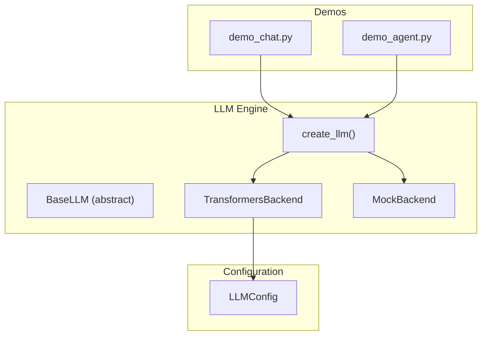
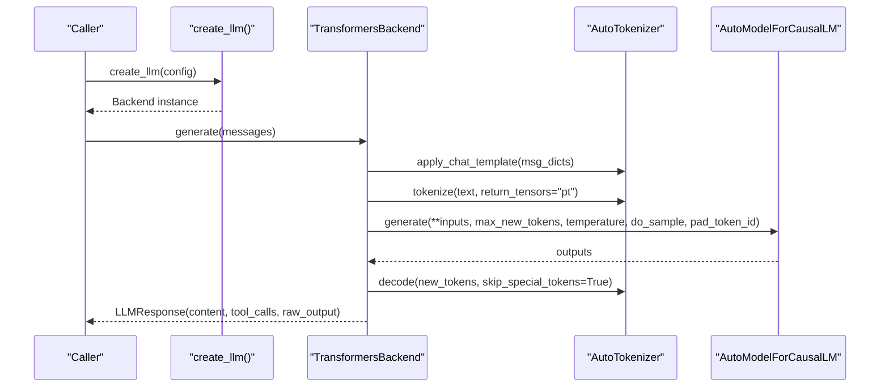
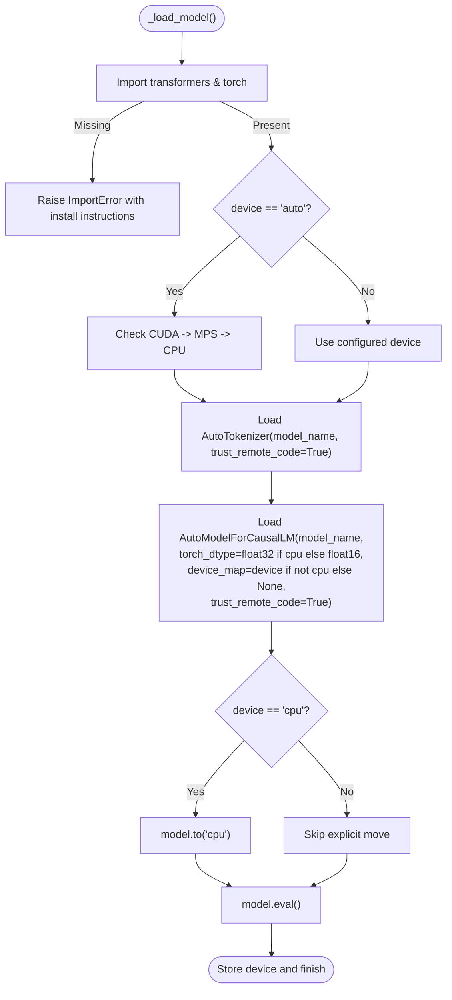
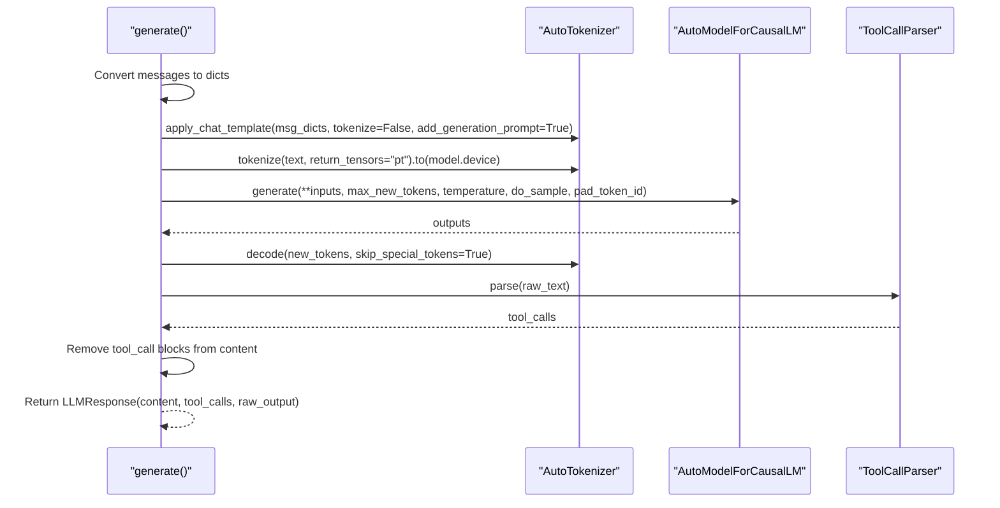
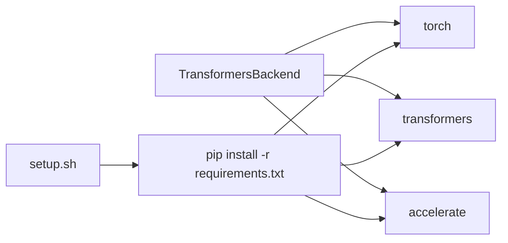

# Transformers Backend

<cite>
**Referenced Files in This Document**
- [engine.py](file://harness/llm/engine.py)
- [config.py](file://harness/config.py)
- [requirements.txt](file://requirements.txt)
- [setup.sh](file://setup.sh)
- [demo_chat.py](file://demos/demo_chat.py)
- [demo_agent.py](file://demos/demo_agent.py)
</cite>

## Table of Contents
1. [Introduction](#introduction)
2. [Project Structure](#project-structure)
3. [Core Components](#core-components)
4. [Architecture Overview](#architecture-overview)
5. [Detailed Component Analysis](#detailed-component-analysis)
6. [Dependency Analysis](#dependency-analysis)
7. [Performance Considerations](#performance-considerations)
8. [Troubleshooting Guide](#troubleshooting-guide)
9. [Conclusion](#conclusion)
10. [Appendices](#appendices)

## Introduction
This document explains the TransformersBackend implementation that loads real language models from HuggingFace via the transformers library. It covers model loading, device detection (CUDA, MPS, CPU), automatic mixed precision behavior, tokenizer configuration, and the generate() method including chat template application, token generation with configurable parameters, and output processing. It also details error handling for missing dependencies, model loading failures, and GPU availability issues, along with performance optimization tips, memory management considerations, and troubleshooting guidance. Examples of different model configurations and usage patterns are included.

## Project Structure
The TransformersBackend is part of the LLM engine module and integrates with a configuration system to control backend selection, model identity, generation parameters, and device selection. Demos show how to instantiate and use the engine through a factory function.

**Diagram sources**
- [engine.py:127-147](file://harness/llm/engine.py#L127-L147)
- [engine.py:151-249](file://harness/llm/engine.py#L151-L249)
- [engine.py:404-420](file://harness/llm/engine.py#L404-L420)
- [config.py:8-34](file://harness/config.py#L8-L34)
- [demo_chat.py:17-31](file://demos/demo_chat.py#L17-L31)
- [demo_agent.py:15-24](file://demos/demo_agent.py#L15-L24)

**Section sources**
- [engine.py:1-18](file://harness/llm/engine.py#L1-L18)
- [config.py:8-34](file://harness/config.py#L8-L34)
- [demo_chat.py:1-31](file://demos/demo_chat.py#L1-L31)
- [demo_agent.py:1-24](file://demos/demo_agent.py#L1-L24)

## Core Components
- BaseLLM: Abstract interface defining generate() and get_model_info().
- TransformersBackend: Loads a HuggingFace causal LM and tokenizer, applies chat templates, generates tokens, parses tool calls, and returns structured responses.
- LLMConfig: Holds backend selection, model identifier, max_new_tokens, temperature, and device mode.
- create_llm(): Factory that instantiates the appropriate backend based on config.

Key responsibilities:
- Device detection and placement for CUDA/MPS/CPU.
- Automatic dtype selection (float32 on CPU; float16 on GPU).
- Chat template application via tokenizer.
- Token generation with configurable sampling parameters.
- Output decoding and tool call extraction.

**Section sources**
- [engine.py:127-147](file://harness/llm/engine.py#L127-L147)
- [engine.py:151-249](file://harness/llm/engine.py#L151-L249)
- [config.py:8-34](file://harness/config.py#L8-L34)
- [engine.py:404-420](file://harness/llm/engine.py#L404-L420)

## Architecture Overview
The TransformersBackend composes several steps:
- Initialization: Load tokenizer and model with device-aware settings.
- Generation: Apply chat template, encode inputs, run model.generate(), decode new tokens.
- Post-processing: Parse tool calls from raw text and return structured response.

**Diagram sources**
- [engine.py:151-249](file://harness/llm/engine.py#L151-L249)
- [engine.py:404-420](file://harness/llm/engine.py#L404-L420)

## Detailed Component Analysis

### TransformersBackend: Model Loading and Device Detection
- Imports transformers and torch lazily inside _load_model() to raise a clear ImportError if missing.
- Device detection when device == "auto":
  - Prefers CUDA if available.
  - Falls back to MPS if available.
  - Otherwise uses CPU.
- Tokenizer loaded with trust_remote_code enabled.
- Model loaded with:
  - torch_dtype set to float32 on CPU or float16 on GPU.
  - device_map used for non-CPU devices; otherwise moved to CPU explicitly.
- Model placed in eval() mode and device tracked.

**Diagram sources**
- [engine.py:171-204](file://harness/llm/engine.py#L171-L204)

**Section sources**
- [engine.py:171-204](file://harness/llm/engine.py#L171-L204)

### TransformersBackend: generate() Method
- Converts messages to dictionaries and applies the model’s chat template using tokenizer.apply_chat_template with add_generation_prompt=True.
- Encodes the formatted prompt into tensors and moves them to the model’s device.
- Generates tokens under torch.no_grad() with:
  - max_new_tokens from config.
  - temperature from config.
  - do_sample derived from temperature > 0.
  - pad_token_id set to tokenizer.eos_token_id.
- Decodes only newly generated tokens by slicing outputs beyond input length.
- Parses tool calls from raw text and removes tool call blocks from content.
- Returns LLMResponse with cleaned content, parsed tool calls, and raw output.

**Diagram sources**
- [engine.py:206-241](file://harness/llm/engine.py#L206-L241)

**Section sources**
- [engine.py:206-241](file://harness/llm/engine.py#L206-L241)

### Configuration and Environment
- LLMConfig supports:
  - backend: "transformers" or "mock".
  - model_name: HuggingFace model identifier.
  - max_new_tokens: maximum tokens per response.
  - temperature: sampling temperature.
  - device: "auto", "cuda", "mps", or "cpu".
- Environment variables override defaults: HARNESS_LLM_BACKEND, HARNESS_MODEL_NAME, HARNESS_MAX_TOKENS, HARNESS_TEMPERATURE, HARNESS_DEVICE.

Usage patterns:
- Demos import create_llm() and rely on environment to select backend and model.
- The factory creates the appropriate backend based on config.backend.

**Section sources**
- [config.py:8-34](file://harness/config.py#L8-L34)
- [engine.py:404-420](file://harness/llm/engine.py#L404-L420)
- [demo_chat.py:17-31](file://demos/demo_chat.py#L17-L31)
- [demo_agent.py:15-24](file://demos/demo_agent.py#L15-L24)

### Error Handling
- Missing dependencies: If transformers or torch are not installed, _load_model() raises an ImportError with installation guidance.
- Model loading failures: Exceptions during from_pretrained will propagate; ensure network access and correct model identifiers.
- GPU availability: Device auto-detection falls back gracefully to MPS or CPU if CUDA is unavailable.

Best practices:
- Wrap instantiation in try/except around create_llm() to catch ImportError early.
- Validate model_name exists on HuggingFace Hub before first run.
- Log device selection and model info via get_model_info() for diagnostics.

**Section sources**
- [engine.py:171-179](file://harness/llm/engine.py#L171-L179)
- [engine.py:181-204](file://harness/llm/engine.py#L181-L204)

## Dependency Analysis
External dependencies required for TransformersBackend:
- torch >= 2.1.0
- transformers >= 4.40.0
- accelerate >= 0.27.0

These are declared in requirements.txt and installed via setup.sh.

**Diagram sources**
- [requirements.txt:1-14](file://requirements.txt#L1-L14)
- [setup.sh:48-53](file://setup.sh#L48-L53)

**Section sources**
- [requirements.txt:1-14](file://requirements.txt#L1-L14)
- [setup.sh:48-53](file://setup.sh#L48-L53)

## Performance Considerations
- Mixed precision:
  - On GPU, model is loaded with float16 to reduce memory and improve throughput.
  - On CPU, float32 is used for numerical stability.
- Device placement:
  - device_map is used for non-CPU devices to leverage hardware acceleration.
  - For CPU, explicit .to("cpu") ensures consistent placement.
- Generation parameters:
  - max_new_tokens controls output length; tune to balance latency and verbosity.
  - temperature controls randomness; set to 0 for deterministic outputs.
  - do_sample is automatically derived from temperature.
- Memory management:
  - Use smaller models (e.g., 0.5B variants) for constrained environments.
  - Limit context length by controlling input message history.
  - Avoid unnecessary tensor copies; inputs are moved once to model.device.
- Throughput tips:
  - Batch multiple requests if your application allows it at a higher level.
  - Prefer GPUs with sufficient VRAM for larger models.
  - Keep model warm after first load to avoid repeated downloads and initialization overhead.

[No sources needed since this section provides general guidance]

## Troubleshooting Guide
Common issues and resolutions:
- ImportError for transformers/torch:
  - Ensure dependencies are installed via requirements.txt.
  - Re-run setup.sh to create a virtual environment and install packages.
- No GPU detected:
  - Verify CUDA drivers and torch.cuda.is_available().
  - On Apple Silicon, ensure torch.backends.mps.is_available() and use device="mps".
  - Fall back to CPU if neither is available.
- Model download fails:
  - Check internet connectivity and HuggingFace Hub status.
  - Confirm model_name is correct and accessible.
  - Clear cache if necessary and retry.
- Out-of-memory errors:
  - Reduce max_new_tokens or switch to a smaller model.
  - Use float16 on GPU (already default in this backend).
  - Reduce conversation history to minimize input size.
- Unexpected output format:
  - Ensure the model supports chat templates and has EOS token configured.
  - Inspect raw_output to debug parsing logic.

Operational checks:
- After creating the backend, call get_model_info() to verify backend, model, device, and max_tokens.
- In demos, switch HARNESS_LLM_BACKEND=mock to test without downloading models.

**Section sources**
- [engine.py:171-204](file://harness/llm/engine.py#L171-L204)
- [engine.py:243-249](file://harness/llm/engine.py#L243-L249)
- [setup.sh:48-77](file://setup.sh#L48-L77)

## Conclusion
TransformersBackend provides a robust, device-aware pipeline for loading HuggingFace models, applying chat templates, generating tokens with configurable parameters, and parsing tool calls from outputs. It includes sensible defaults for mixed precision and device selection, while offering clear error handling for dependency and runtime issues. By tuning configuration and following the performance and troubleshooting guidance, you can deploy efficient and reliable inference across CPU, MPS, and CUDA environments.

[No sources needed since this section summarizes without analyzing specific files]

## Appendices

### Example Configurations and Usage Patterns
- Default Transformers backend with auto device:
  - Set HARNESS_LLM_BACKEND=transformers and let device detection choose CUDA/MPS/CPU.
- Force CPU-only execution:
  - Set HARNESS_DEVICE=cpu to disable GPU usage.
- Control creativity and length:
  - Adjust HARNESS_TEMPERATURE and HARNESS_MAX_TOKENS to influence sampling and output length.
- Switch to mock backend for quick testing:
  - Set HARNESS_LLM_BACKEND=mock to avoid model downloads and GPU requirements.

Integration points:
- Demos demonstrate creating the LLM via create_llm() and interacting with agents and tools.

**Section sources**
- [config.py:8-34](file://harness/config.py#L8-L34)
- [engine.py:404-420](file://harness/llm/engine.py#L404-L420)
- [demo_chat.py:17-31](file://demos/demo_chat.py#L17-L31)
- [demo_agent.py:15-24](file://demos/demo_agent.py#L15-L24)