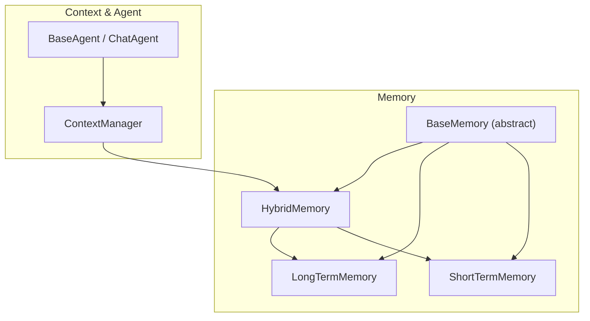
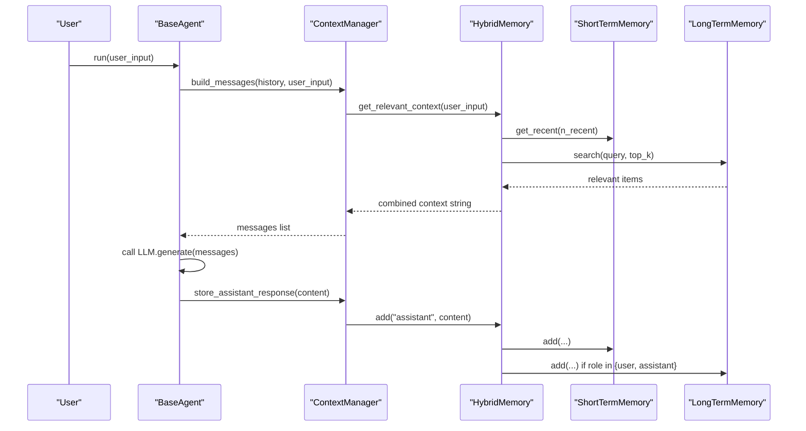
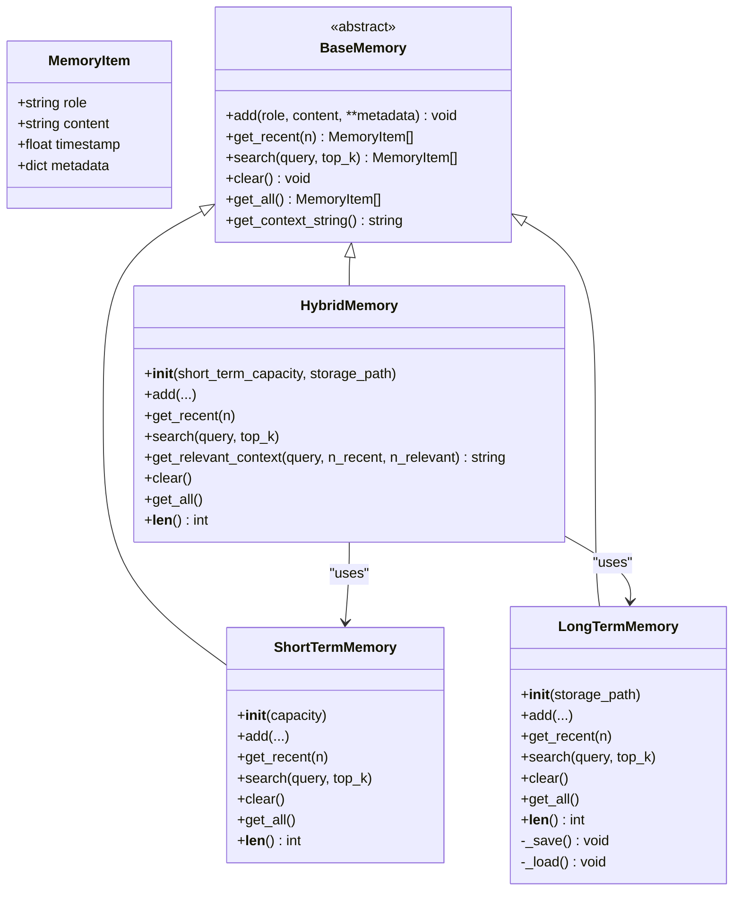
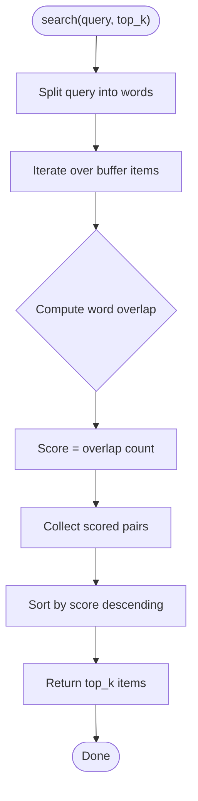
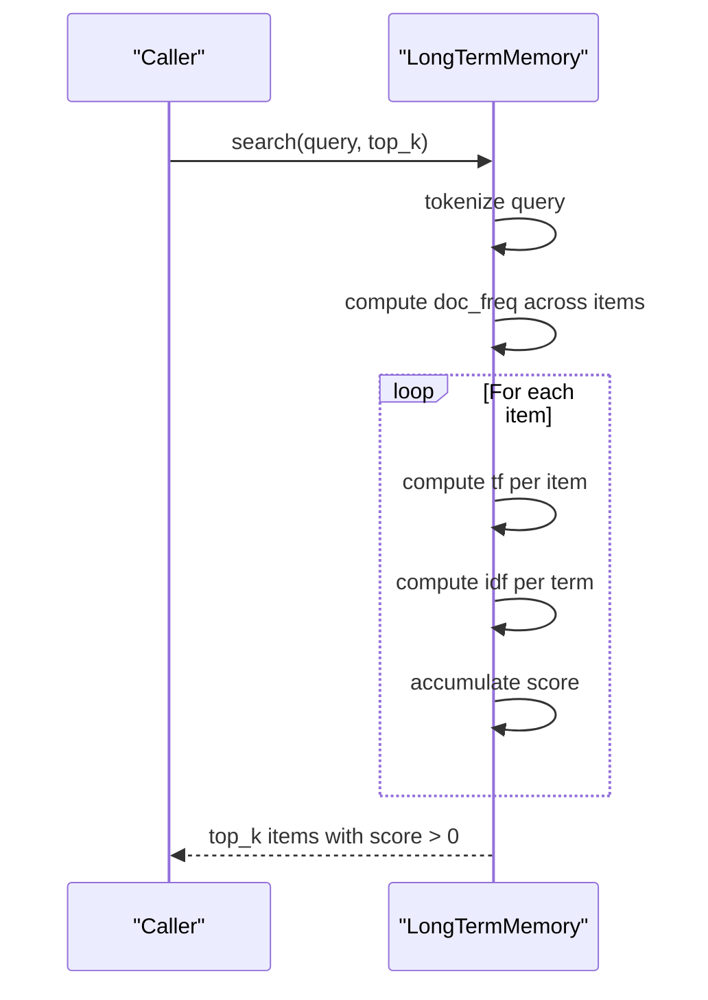
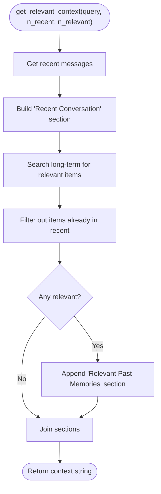
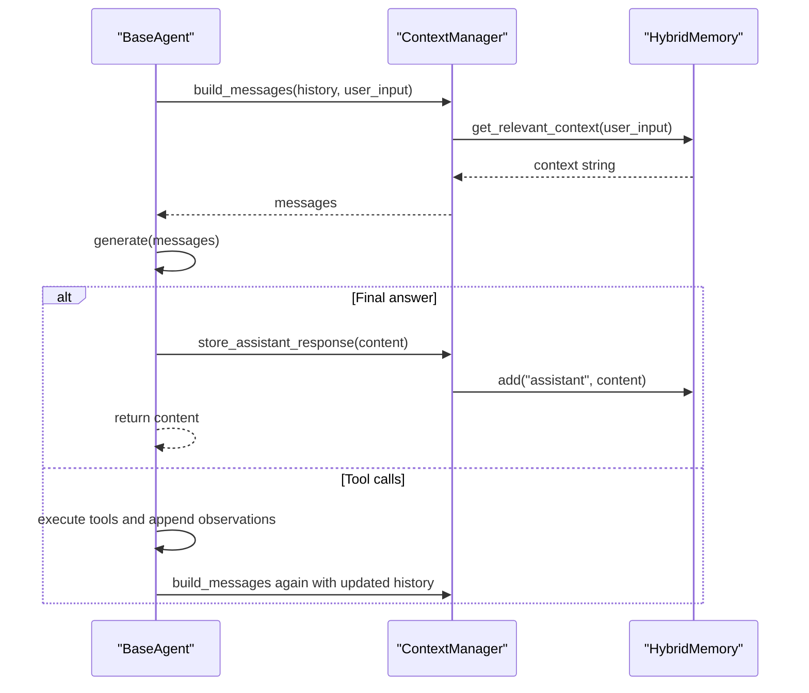
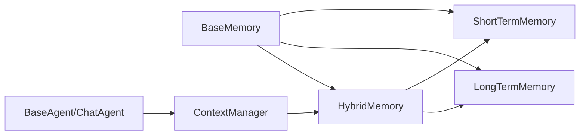

# Memory System APIs

<cite>
**Referenced Files in This Document**
- [base.py](file://harness/memory/base.py)
- [short_term.py](file://harness/memory/short_term.py)
- [long_term.py](file://harness/memory/long_term.py)
- [hybrid.py](file://harness/memory/hybrid.py)
- [manager.py](file://harness/context/manager.py)
- [base.py](file://harness/agent/base.py)
- [chat.py](file://harness/agent/chat.py)
- [demo_chat.py](file://demos/demo_chat.py)
</cite>

## Table of Contents
1. [Introduction](#introduction)
2. [Project Structure](#project-structure)
3. [Core Components](#core-components)
4. [Architecture Overview](#architecture-overview)
5. [Detailed Component Analysis](#detailed-component-analysis)
6. [Dependency Analysis](#dependency-analysis)
7. [Performance Considerations](#performance-considerations)
8. [Troubleshooting Guide](#troubleshooting-guide)
9. [Conclusion](#conclusion)
10. [Appendices](#appendices)

## Introduction
This document provides detailed API documentation for the Memory system in HarnessAIDemo. It covers:
- BaseMemory abstract class defining the common interface for all memory implementations
- ShortTermMemory with a bounded buffer, capacity management, and automatic pruning
- LongTermMemory using TF-IDF retrieval for semantic search and persistence
- HybridMemory combining short-term and long-term storage with intelligent routing
- Methods for storing messages, retrieving relevant context, similarity search, and cleanup
- Examples of configuration, custom implementations, and performance optimization
- Integration with the ContextManager and Agent loop

## Project Structure
The memory subsystem resides under harness/memory and integrates with the context manager and agent loop to provide continuity across turns and sessions.

**Diagram sources**
- [base.py:27-64](file://harness/memory/base.py#L27-L64)
- [short_term.py:16-50](file://harness/memory/short_term.py#L16-L50)
- [long_term.py:24-109](file://harness/memory/long_term.py#L24-L109)
- [hybrid.py:22-84](file://harness/memory/hybrid.py#L22-L84)
- [manager.py:41-118](file://harness/context/manager.py#L41-L118)
- [base.py:63-165](file://harness/agent/base.py#L63-L165)

**Section sources**
- [base.py:1-64](file://harness/memory/base.py#L1-L64)
- [short_term.py:1-50](file://harness/memory/short_term.py#L1-L50)
- [long_term.py:1-109](file://harness/memory/long_term.py#L1-L109)
- [hybrid.py:1-84](file://harness/memory/hybrid.py#L1-L84)
- [manager.py:1-118](file://harness/context/manager.py#L1-L118)
- [base.py:1-165](file://harness/agent/base.py#L1-L165)

## Core Components
- BaseMemory: Abstract base defining add, get_recent, search, clear, get_all, and a default get_context_string helper.
- MemoryItem: Dataclass representing a stored message with role, content, timestamp, and metadata.
- ShortTermMemory: Bounded FIFO buffer for recent conversation context with keyword-based search.
- LongTermMemory: Persistent JSON-backed store with TF-IDF retrieval for relevant past memories.
- HybridMemory: Combines ShortTermMemory and LongTermMemory; routes writes and builds composite contexts.

Key responsibilities:
- Store user and assistant messages
- Retrieve recent history for immediate context
- Search long-term memory for relevant past knowledge
- Provide clean-up and export capabilities

**Section sources**
- [base.py:18-64](file://harness/memory/base.py#L18-L64)
- [short_term.py:16-50](file://harness/memory/short_term.py#L16-L50)
- [long_term.py:24-109](file://harness/memory/long_term.py#L24-L109)
- [hybrid.py:22-84](file://harness/memory/hybrid.py#L22-L84)

## Architecture Overview
The memory system is designed as a layered architecture:
- Short-term memory holds the most recent messages within a fixed capacity, evicting oldest entries when full.
- Long-term memory persists messages and supports retrieval via TF-IDF scoring against queries.
- Hybrid memory orchestrates both layers, ensuring recent context is always available while augmenting it with relevant historical facts.

Integration points:
- ContextManager uses HybridMemory to assemble prompts by merging recent conversation and retrieved past memories.
- Agent loop stores user inputs and assistant responses into memory during execution.

**Diagram sources**
- [manager.py:61-108](file://harness/context/manager.py#L61-L108)
- [hybrid.py:33-73](file://harness/memory/hybrid.py#L33-L73)
- [base.py:97-160](file://harness/agent/base.py#L97-L160)

## Detailed Component Analysis

### BaseMemory and MemoryItem
- MemoryItem: Stores role, content, timestamp, and arbitrary metadata.
- BaseMemory abstract methods:
  - add(role, content, **metadata): Persist a new item
  - get_recent(n): Return n most recent items
  - search(query, top_k=5): Retrieve items relevant to query
  - clear(): Clear all items
  - get_all(): Export all items
  - get_context_string(): Default formatting of recent items for prompt use

Design notes:
- Provides a consistent contract for all memory backends
- Default context formatter aids quick integration

**Section sources**
- [base.py:18-64](file://harness/memory/base.py#L18-L64)

#### Class Diagram

**Diagram sources**
- [base.py:18-64](file://harness/memory/base.py#L18-L64)
- [short_term.py:16-50](file://harness/memory/short_term.py#L16-L50)
- [long_term.py:24-109](file://harness/memory/long_term.py#L24-L109)
- [hybrid.py:22-84](file://harness/memory/hybrid.py#L22-L84)

### ShortTermMemory
- Bounded buffer using a deque with maxlen set to capacity
- Automatic pruning: oldest items are dropped when capacity is exceeded (FIFO)
- Keyword-based search: counts word overlap between query and content
- Supports get_recent, clear, get_all, and length inspection

Capacity management:
- Capacity is set at initialization and enforced by the underlying deque
- No explicit resize method; adjust capacity by creating a new instance

Pruning strategy:
- Implicit via deque maxlen; no manual eviction logic required

Search behavior:
- Simple token overlap scoring; returns top-k matches sorted by overlap count

Use cases:
- Maintaining recent conversation context within token limits
- Fast, lightweight retrieval for immediate turn-to-turn coherence

**Section sources**
- [short_term.py:16-50](file://harness/memory/short_term.py#L16-L50)

#### Flowchart: Short-Term Search

**Diagram sources**
- [short_term.py:30-40](file://harness/memory/short_term.py#L30-L40)

### LongTermMemory
- Persistent storage backed by a JSON file
- Adds items with role, content, and metadata; persists on each write
- Retrieval via TF-IDF:
  - Computes term frequency per item
  - Computes inverse document frequency across all items
  - Scores items based on query terms presence and weighting
- Supports get_recent, clear, get_all, and length inspection

Persistence:
- _save serializes items to JSON; _load restores them on init
- Robust error handling logs failures without crashing

Retrieval algorithm:
- Tokenizes query and items
- Aggregates document frequency per term
- Calculates TF-IDF scores and returns top-k positive-scoring items

Use cases:
- Cross-session knowledge retention
- Semantic-like retrieval without vector embeddings

**Section sources**
- [long_term.py:24-109](file://harness/memory/long_term.py#L24-L109)

#### Sequence Diagram: TF-IDF Retrieval

**Diagram sources**
- [long_term.py:40-68](file://harness/memory/long_term.py#L40-L68)

### HybridMemory
- Composes ShortTermMemory and LongTermMemory
- Routing policy:
  - All adds go to short-term
  - Only user and assistant roles are persisted to long-term
- Context building:
  - get_relevant_context merges recent conversation and relevant past memories
  - Filters out duplicates already present in recent context
- Exposes standard BaseMemory methods plus get_relevant_context

Intelligent routing:
- Prevents noise from tool/system messages in long-term
- Ensures conversational continuity with short-term buffer

Composite context:
- Recent section includes last N messages
- Relevant past section includes top-K retrieved items excluding recent duplicates

**Section sources**
- [hybrid.py:22-84](file://harness/memory/hybrid.py#L22-L84)

#### Flowchart: Hybrid Context Assembly

**Diagram sources**
- [hybrid.py:46-73](file://harness/memory/hybrid.py#L46-L73)

### Integration with ContextManager and Agent Loop
- ContextManager.build_messages:
  - Creates system message with optional tool instructions
  - If memory is HybridMemory, injects relevant past context derived from current input
  - Appends conversation history and current user input
  - Stores user input in memory for future reference
- Agent.run:
  - Builds messages via ContextManager
  - Calls LLM.generate
  - On final answer, appends assistant response to history and stores it in memory
  - During tool calls, records observations and continues until final answer or max iterations

**Diagram sources**
- [manager.py:61-108](file://harness/context/manager.py#L61-L108)
- [base.py:97-160](file://harness/agent/base.py#L97-L160)

**Section sources**
- [manager.py:41-118](file://harness/context/manager.py#L41-L118)
- [base.py:63-165](file://harness/agent/base.py#L63-L165)

## Dependency Analysis
- BaseMemory defines the contract; ShortTermMemory, LongTermMemory, and HybridMemory implement it
- HybridMemory depends on both ShortTermMemory and LongTermMemory
- ContextManager depends on BaseMemory but defaults to HybridMemory
- Agent classes depend on ContextManager and optionally BaseMemory

**Diagram sources**
- [base.py:27-64](file://harness/memory/base.py#L27-L64)
- [short_term.py:16-50](file://harness/memory/short_term.py#L16-L50)
- [long_term.py:24-109](file://harness/memory/long_term.py#L24-L109)
- [hybrid.py:22-84](file://harness/memory/hybrid.py#L22-L84)
- [manager.py:41-118](file://harness/context/manager.py#L41-L118)
- [base.py:63-165](file://harness/agent/base.py#L63-L165)

**Section sources**
- [base.py:27-64](file://harness/memory/base.py#L27-L64)
- [hybrid.py:22-84](file://harness/memory/hybrid.py#L22-L84)
- [manager.py:41-118](file://harness/context/manager.py#L41-L118)
- [base.py:63-165](file://harness/agent/base.py#L63-L165)

## Performance Considerations
- ShortTermMemory:
  - O(1) append with bounded capacity; retrieval is O(n) for slicing
  - Keyword search is O(n*w) where w is average word count per item
- LongTermMemory:
  - Persistence on every add; consider batching writes for high-throughput scenarios
  - TF-IDF search is O(n*t) where t is number of query terms; scales linearly with number of stored items
  - JSON I/O can be a bottleneck; ensure adequate disk performance and consider compression for large datasets
- HybridMemory:
  - get_relevant_context performs both recent retrieval and long-term search; tune n_recent and top_k to balance relevance vs. latency
  - Filtering duplicates is O(r) where r is number of relevant items
- Context window management:
  - Use ContextManager.estimate_tokens to approximate token usage and avoid exceeding model limits
  - Adjust short-term capacity and long-term top_k to fit target context size

[No sources needed since this section provides general guidance]

## Troubleshooting Guide
Common issues and resolutions:
- Long-term memory not loading:
  - Check storage path existence and permissions; errors are logged during load
- Search returns no results:
  - Ensure long-term store has items and query terms match content tokens
  - Verify that only user and assistant roles are persisted in hybrid mode
- Context too large:
  - Reduce short-term capacity or top_k for long-term retrieval
  - Use ContextManager.estimate_tokens to monitor token usage
- Unexpected pruning:
  - ShortTermMemory evicts oldest items automatically; increase capacity if recent context is being lost

Operational tips:
- Monitor logs for save/load errors in LongTermMemory
- Validate storage_path accessibility and disk space
- Periodically review memory_store.json for correctness

**Section sources**
- [long_term.py:77-105](file://harness/memory/long_term.py#L77-L105)
- [manager.py:110-118](file://harness/context/manager.py#L110-L118)

## Conclusion
The Memory system provides a robust, extensible foundation for maintaining conversational continuity and persistent knowledge:
- BaseMemory standardizes operations across implementations
- ShortTermMemory ensures efficient, bounded recent context
- LongTermMemory enables cross-session retrieval via TF-IDF
- HybridMemory offers production-ready composition with intelligent routing
- Integration with ContextManager and Agent loop ensures seamless context assembly and lifecycle management

[No sources needed since this section summarizes without analyzing specific files]

## Appendices

### Configuration Examples
- Create a HybridMemory with custom storage path and short-term capacity
- Wire it into a ChatAgent for interactive sessions
- See demo usage for end-to-end setup

**Section sources**
- [demo_chat.py:17-28](file://demos/demo_chat.py#L17-L28)

### Custom Memory Implementation
To implement a custom memory backend:
- Subclass BaseMemory
- Implement add, get_recent, search, clear, get_all
- Optionally override get_context_string for custom formatting
- Integrate with ContextManager and Agent as needed

**Section sources**
- [base.py:27-64](file://harness/memory/base.py#L27-L64)

### Optimization Techniques
- Tune ShortTermMemory.capacity to match typical conversation bursts
- Adjust LongTermMemory.top_k to balance recall and cost
- Batch writes or reduce persistence frequency if necessary
- Use HybridMemory.get_relevant_context parameters to control context size and relevance

**Section sources**
- [short_term.py:19-22](file://harness/memory/short_term.py#L19-L22)
- [long_term.py:40-68](file://harness/memory/long_term.py#L40-L68)
- [hybrid.py:46-73](file://harness/memory/hybrid.py#L46-L73)