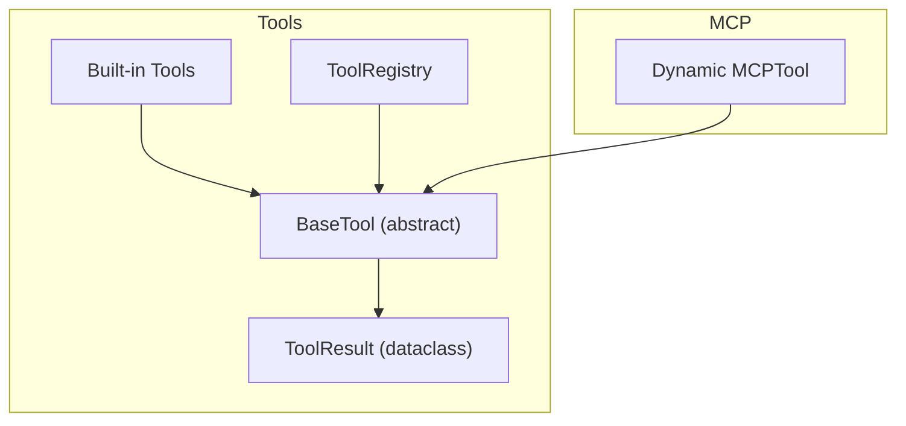
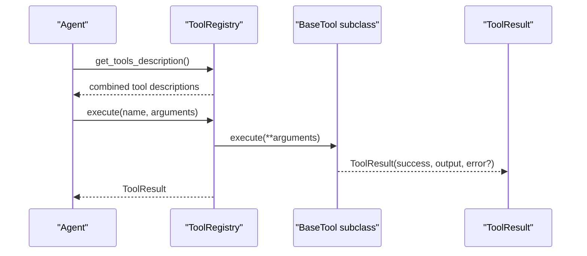
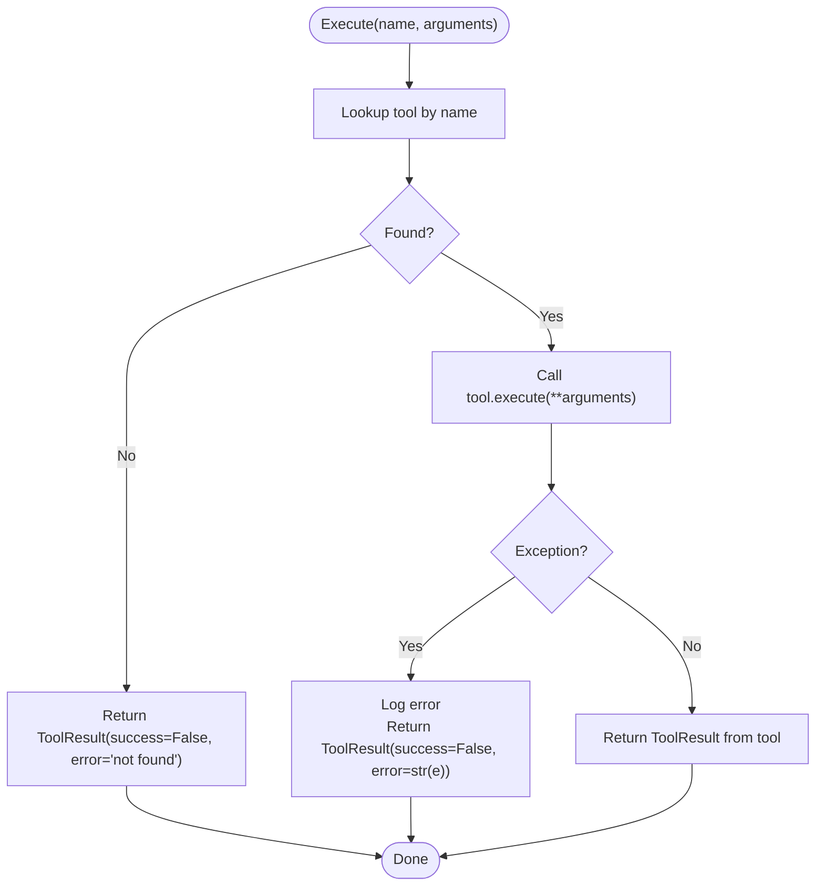
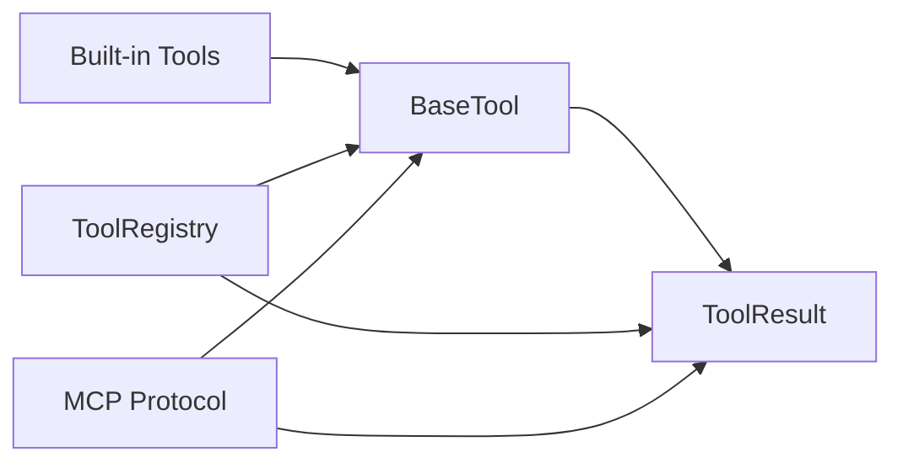

# BaseTool Class and ToolResult

<cite>
**Referenced Files in This Document**
- [base.py](file://harness/tools/base.py)
- [builtin.py](file://harness/tools/builtin.py)
- [registry.py](file://harness/tools/registry.py)
- [protocol.py](file://harness/mcp/protocol.py)
- [README.md](file://README.md)
</cite>

## Table of Contents
1. [Introduction](#introduction)
2. [Project Structure](#project-structure)
3. [Core Components](#core-components)
4. [Architecture Overview](#architecture-overview)
5. [Detailed Component Analysis](#detailed-component-analysis)
6. [Dependency Analysis](#dependency-analysis)
7. [Performance Considerations](#performance-considerations)
8. [Troubleshooting Guide](#troubleshooting-guide)
9. [Conclusion](#conclusion)
10. [Appendices](#appendices)

## Introduction
This document explains the BaseTool abstract class and the ToolResult dataclass that form the foundation of the tool system. It covers required attributes, the execute contract, utility methods for descriptions and schemas, and how to implement custom tools with robust validation and error handling. It also provides best practices and common pitfalls based on built-in examples and the registry’s execution flow.

## Project Structure
The tool system is implemented under harness/tools with a clear separation:
- base.py defines the abstract BaseTool and ToolResult
- builtin.py provides concrete tool implementations demonstrating patterns
- registry.py centralizes registration, lookup, and safe execution
- protocol.py shows dynamic tool creation via MCP integration

**Diagram sources**
- [base.py:16-66](file://harness/tools/base.py#L16-L66)
- [builtin.py:13-83](file://harness/tools/builtin.py#L13-L83)
- [registry.py:17-67](file://harness/tools/registry.py#L17-L67)
- [protocol.py:193-209](file://harness/mcp/protocol.py#L193-L209)

**Section sources**
- [base.py:1-66](file://harness/tools/base.py#L1-L66)
- [builtin.py:1-83](file://harness/tools/builtin.py#L1-L83)
- [registry.py:1-74](file://harness/tools/registry.py#L1-L74)
- [protocol.py:190-210](file://harness/mcp/protocol.py#L190-L210)

## Core Components
- BaseTool: Abstract base defining the tool contract and utilities
  - Required class attributes: name, description, parameters
  - Abstract method: execute(**kwargs) -> ToolResult
  - Utility methods: to_description(), to_schema()
- ToolResult: Dataclass representing execution outcomes
  - Fields: success (bool), output (str), error (Optional[str])

Key responsibilities:
- BaseTool standardizes how tools describe themselves and how they are executed
- ToolResult unifies success/failure semantics across all tools
- Registry orchestrates safe execution and error wrapping

**Section sources**
- [base.py:16-66](file://harness/tools/base.py#L16-L66)
- [registry.py:43-67](file://harness/tools/registry.py#L43-L67)

## Architecture Overview
The tool system integrates with agents and registries as follows:
- Agents request tool descriptions from the registry to build prompts
- The registry executes tools by name, catching exceptions and returning ToolResult
- Built-in tools demonstrate parameter validation and error handling
- MCP dynamically creates BaseTool subclasses to wrap remote tools

**Diagram sources**
- [registry.py:62-67](file://harness/tools/registry.py#L62-L67)
- [registry.py:43-60](file://harness/tools/registry.py#L43-L60)
- [base.py:47-66](file://harness/tools/base.py#L47-L66)

## Detailed Component Analysis

### BaseTool
- Purpose: Define the interface and shared behavior for all tools
- Attributes:
  - name: str — identifier used by LLM and registry
  - description: str — human-readable explanation shown to the model
  - parameters: dict — schema-like descriptions of accepted arguments
- Methods:
  - execute(**kwargs) -> ToolResult — must be implemented by subclasses
  - to_description() -> str — builds a prompt-friendly description string
  - to_schema() -> dict — returns a JSON-schema-like representation

Implementation notes:
- to_description concatenates parameters into a readable list
- to_schema exposes name, description, and parameters for introspection

**Section sources**
- [base.py:30-66](file://harness/tools/base.py#L30-L66)

### ToolResult
- Purpose: Standardize return values for tool execution
- Fields:
  - success: bool — indicates whether execution succeeded
  - output: str — result content shown to the model
  - error: Optional[str] — error message when success is False

Usage guidance:
- Always return ToolResult from execute; never raise unhandled exceptions
- On failure, set success=False and populate error; keep output empty or minimal

**Section sources**
- [base.py:16-27](file://harness/tools/base.py#L16-L27)

### Built-in Tool Implementations (Examples)
These classes demonstrate proper parameter validation, error handling, and return formatting:

- CalculatorTool
  - Validates input characters to prevent unsafe expressions
  - Normalizes operators and evaluates safely
  - Returns ToolResult with success=True and numeric result as string, or success=False with descriptive error

- DateTimeTool
  - Accepts query parameter to format current date/time
  - Returns formatted strings with success=True

- FileOpsTool
  - Supports read-only operations: list directory entries and read file contents
  - Validates paths and operations
  - Returns appropriate ToolResult for success or specific errors

Best practices illustrated:
- Validate inputs early and return ToolResult(False, "", error_message) on invalid input
- Wrap external calls in try/except and map exceptions to ToolResult(False, "", str(e))
- Keep output concise and informative for the model

**Section sources**
- [builtin.py:13-30](file://harness/tools/builtin.py#L13-L30)
- [builtin.py:33-46](file://harness/tools/builtin.py#L33-L46)
- [builtin.py:49-74](file://harness/tools/builtin.py#L49-L74)

### Dynamic Tool Creation via MCP
- The MCP layer dynamically constructs a BaseTool subclass per remote tool
- Sets name, description, and parameters from tool metadata
- Wraps remote calls and maps responses/errors to ToolResult

This pattern enables integrating third-party tools without modifying core code.

**Section sources**
- [protocol.py:193-209](file://harness/mcp/protocol.py#L193-L209)

### Registry Execution Flow
- Executes tools by name with argument unpacking
- Handles missing tools and exceptions uniformly by returning ToolResult(success=False, ...)
- Provides tool listing and combined descriptions for prompts

**Diagram sources**
- [registry.py:43-60](file://harness/tools/registry.py#L43-L60)

**Section sources**
- [registry.py:17-74](file://harness/tools/registry.py#L17-L74)

## Dependency Analysis
- BaseTool depends only on standard library types and ABC/dataclasses
- Built-in tools depend on BaseTool and ToolResult
- Registry depends on BaseTool and ToolResult to orchestrate execution
- MCP protocol dynamically instantiates BaseTool subclasses and uses ToolResult

**Diagram sources**
- [base.py:16-66](file://harness/tools/base.py#L16-L66)
- [builtin.py:1-83](file://harness/tools/builtin.py#L1-L83)
- [registry.py:1-74](file://harness/tools/registry.py#L1-L74)
- [protocol.py:193-209](file://harness/mcp/protocol.py#L193-L209)

**Section sources**
- [base.py:1-66](file://harness/tools/base.py#L1-L66)
- [builtin.py:1-83](file://harness/tools/builtin.py#L1-L83)
- [registry.py:1-74](file://harness/tools/registry.py#L1-L74)
- [protocol.py:190-210](file://harness/mcp/protocol.py#L190-L210)

## Performance Considerations
- Input validation should be efficient and fail fast to avoid expensive operations
- Avoid heavy computations inside execute unless necessary; consider caching results if repeated calls occur
- Keep ToolResult.output reasonably sized to fit within context windows
- Use registry.execute to centralize exception handling and logging, reducing overhead in individual tools

[No sources needed since this section provides general guidance]

## Troubleshooting Guide
Common issues and resolutions:
- Missing tool: Registry returns ToolResult with success=False and lists available tools; verify registration
- Invalid parameters: Validate inputs in execute and return ToolResult(False, "", error_message)
- Unexpected exceptions: Wrap external calls in try/except and return ToolResult(False, "", str(e))
- Overwritten registrations: Registry logs warnings when registering duplicate names; ensure unique tool names

Patterns to follow:
- Always return ToolResult from execute
- Provide meaningful error messages in ToolResult.error
- Log detailed diagnostics at the registry level for failures

**Section sources**
- [registry.py:28-33](file://harness/tools/registry.py#L28-L33)
- [registry.py:43-60](file://harness/tools/registry.py#L43-L60)
- [builtin.py:19-30](file://harness/tools/builtin.py#L19-L30)
- [builtin.py:58-74](file://harness/tools/builtin.py#L58-L74)

## Conclusion
BaseTool and ToolResult provide a clean, consistent contract for building reliable tools. By implementing execute with strict validation and returning ToolResult consistently, you enable robust agent-driven workflows. The registry ensures safe execution and centralized error handling, while built-in tools and MCP integration offer practical patterns for real-world usage.

[No sources needed since this section summarizes without analyzing specific files]

## Appendices

### How to Subclass BaseTool: Step-by-Step
- Define class attributes:
  - name: a stable identifier
  - description: clear, concise explanation for the model
  - parameters: dict describing accepted arguments
- Implement execute(**kwargs):
  - Validate inputs and return ToolResult(False, "", error) on failure
  - Perform logic and return ToolResult(True, output_string) on success
  - Catch exceptions and convert them to ToolResult(False, "", str(e))
- Register your tool with ToolRegistry and use it in agents

Reference examples:
- CalculatorTool demonstrates input validation and safe evaluation
- DateTimeTool shows simple parameterized behavior
- FileOpsTool illustrates I/O safety and error mapping

**Section sources**
- [builtin.py:13-30](file://harness/tools/builtin.py#L13-L30)
- [builtin.py:33-46](file://harness/tools/builtin.py#L33-L46)
- [builtin.py:49-74](file://harness/tools/builtin.py#L49-L74)
- [README.md:303-320](file://README.md#L303-L320)

### Best Practices Summary
- Always validate parameters before processing
- Return ToolResult consistently from execute
- Keep outputs concise and model-friendly
- Centralize logging and error handling via registry where possible
- Avoid dangerous operations; prefer read-only or sandboxed actions when feasible

[No sources needed since this section provides general guidance]

### Common Pitfalls to Avoid
- Forgetting to implement execute leads to runtime errors
- Returning raw exceptions instead of ToolResult breaks agent loops
- Using overly verbose outputs can exceed context limits
- Not validating inputs can cause crashes or security risks

**Section sources**
- [registry.py:43-60](file://harness/tools/registry.py#L43-L60)
- [builtin.py:19-30](file://harness/tools/builtin.py#L19-L30)
- [builtin.py:58-74](file://harness/tools/builtin.py#L58-L74)