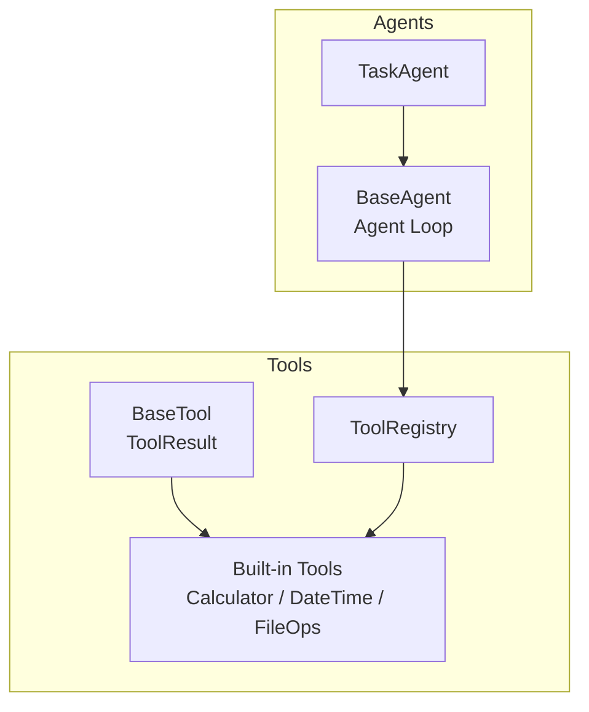
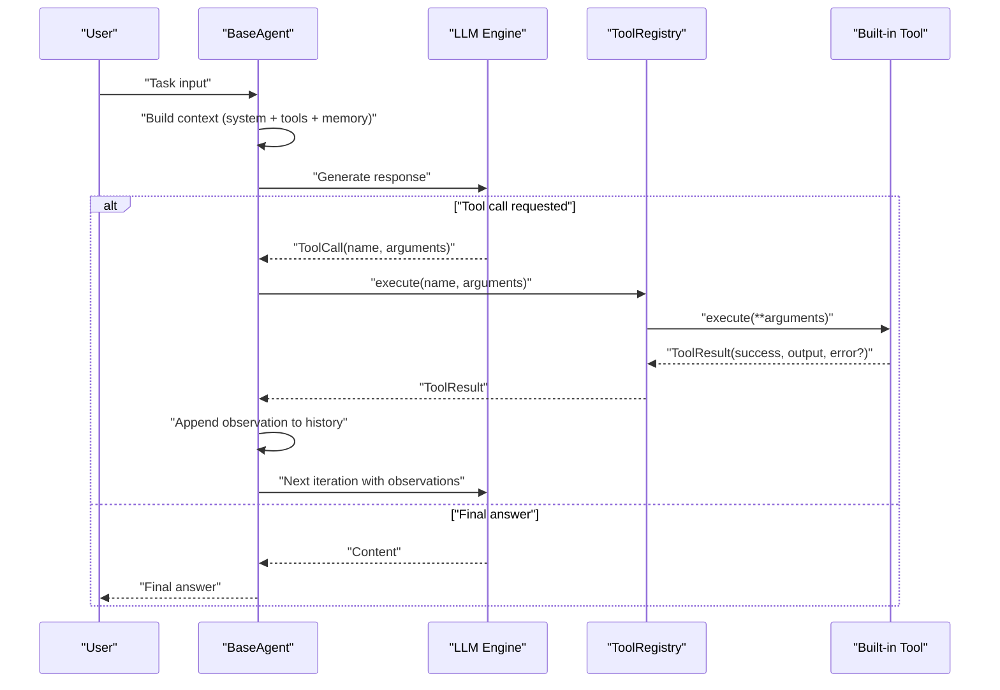
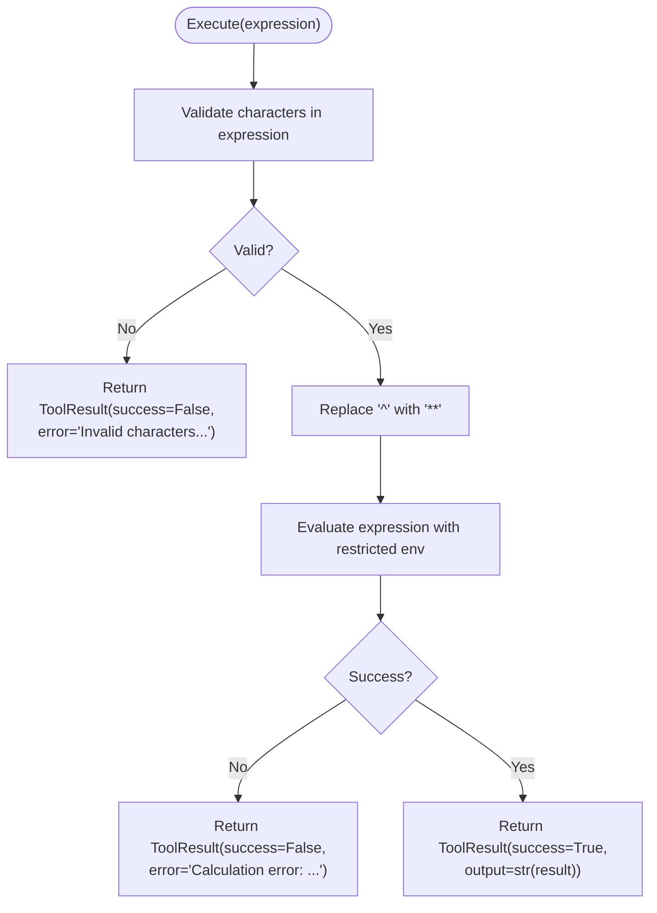
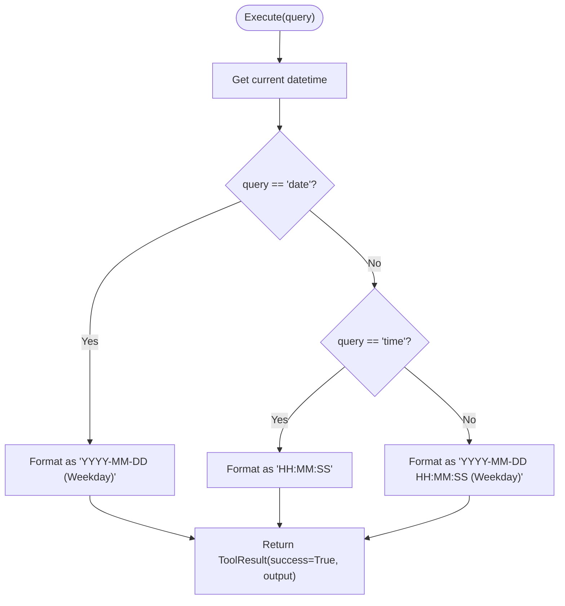
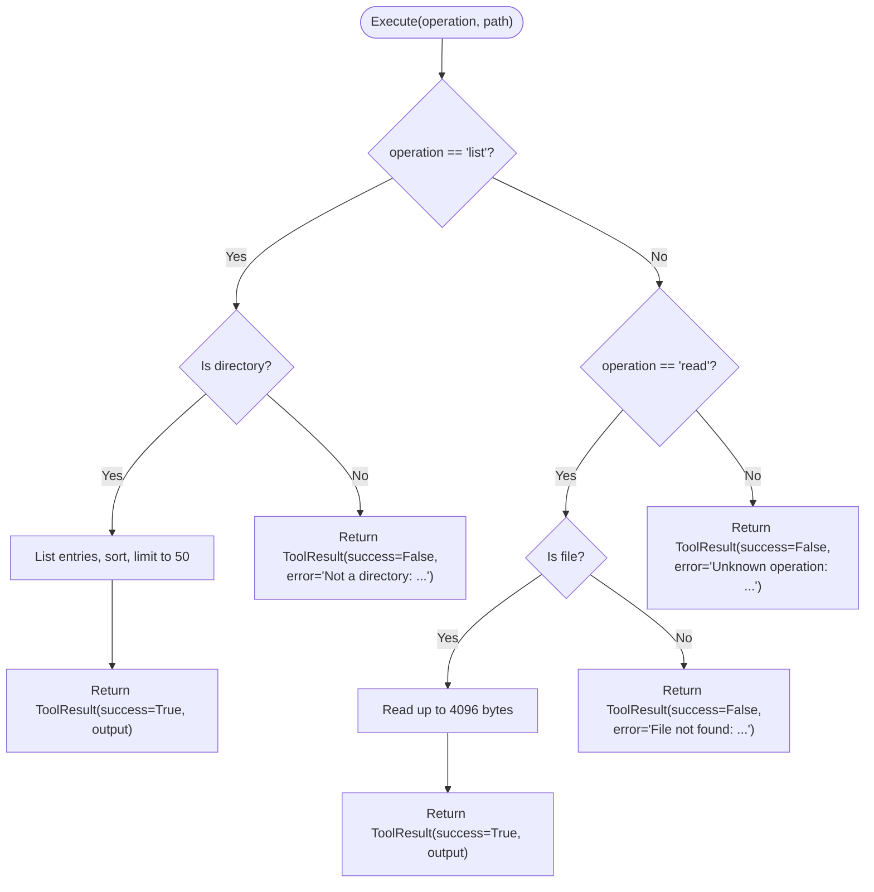
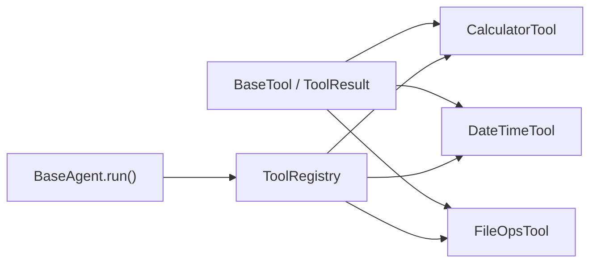

# Built-in Tools

<cite>
**Referenced Files in This Document**
- [builtin.py](file://harness/tools/builtin.py)
- [base.py](file://harness/tools/base.py)
- [registry.py](file://harness/tools/registry.py)
- [__init__.py](file://harness/tools/__init__.py)
- [base.py](file://harness/agent/base.py)
- [task.py](file://harness/agent/task.py)
- [demo_agent.py](file://demos/demo_agent.py)
- [README.md](file://README.md)
</cite>

## Table of Contents
1. [Introduction](#introduction)
2. [Project Structure](#project-structure)
3. [Core Components](#core-components)
4. [Architecture Overview](#architecture-overview)
5. [Detailed Component Analysis](#detailed-component-analysis)
6. [Dependency Analysis](#dependency-analysis)
7. [Performance Considerations](#performance-considerations)
8. [Troubleshooting Guide](#troubleshooting-guide)
9. [Conclusion](#conclusion)
10. [Appendices](#appendices)

## Introduction
This document provides comprehensive documentation for the built-in tools available in HarnessAIDemo: Calculator, DateTime, and FileOps. It explains their purpose, parameters, return formats, error handling, usage examples within agent workflows, configuration options, performance considerations, security implications, and guidance on when to use built-in tools versus creating custom ones. The tools integrate with the agent ecosystem through a registry and are executed by the agent loop during tool-calling cycles.

## Project Structure
The tool system is organized under harness/tools with a clear separation of concerns:
- Base classes define the interface and result structure for all tools
- A registry manages tool registration, lookup, execution, and description generation
- Built-in tools implement concrete functionality for math evaluation, date/time retrieval, and file operations
- Agents consume tools via the registry as part of the agent loop

**Diagram sources**
- [base.py:1-67](file://harness/tools/base.py#L1-L67)
- [registry.py:1-74](file://harness/tools/registry.py#L1-L74)
- [builtin.py:1-83](file://harness/tools/builtin.py#L1-L83)
- [base.py:63-165](file://harness/agent/base.py#L63-L165)
- [task.py:1-73](file://harness/agent/task.py#L1-L73)

**Section sources**
- [README.md:89-131](file://README.md#L89-L131)

## Core Components
- BaseTool and ToolResult define the contract for all tools and their outputs.
- ToolRegistry centralizes tool lifecycle: registration, listing, execution, and prompt integration.
- Built-in tools provide safe, focused capabilities:
  - Calculator: evaluate mathematical expressions safely
  - DateTime: retrieve current date/time information
  - FileOps: read-only file system operations (list directory, read file)

Key behaviors:
- Tools declare name, description, and parameters to guide the LLM
- Tools return ToolResult with success flag, output string, and optional error message
- Registry executes tools by name with arguments and handles exceptions gracefully
- Agent loop integrates tool calls into its iterative process

**Section sources**
- [base.py:1-67](file://harness/tools/base.py#L1-L67)
- [registry.py:1-74](file://harness/tools/registry.py#L1-L74)
- [builtin.py:1-83](file://harness/tools/builtin.py#L1-L83)

## Architecture Overview
The agent loop orchestrates tool usage:
1. Build context including tool descriptions
2. Call LLM; if tool calls are requested, execute them via registry
3. Feed results back to LLM and continue until final answer or max iterations

**Diagram sources**
- [base.py:97-160](file://harness/agent/base.py#L97-L160)
- [registry.py:43-67](file://harness/tools/registry.py#L43-L67)
- [builtin.py:13-74](file://harness/tools/builtin.py#L13-L74)

## Detailed Component Analysis

### Calculator Tool
Purpose:
- Safely evaluate mathematical expressions provided by the user or generated by the LLM.

Parameters:
- expression: string representing a math expression using supported operators (+, -, *, /, **, %, parentheses). Caret (^) is converted to power operator (**).

Return value format:
- On success: ToolResult(success=True, output=str(result))
- On invalid characters: ToolResult(success=False, output="", error="Invalid characters in expression")
- On calculation errors: ToolResult(success=False, output="", error="Calculation error: <exception message>")

Security considerations:
- Input validation restricts allowed characters to digits, whitespace, and specific operators
- Execution uses eval with an empty globals and restricted builtins to minimize risk

Usage example in agent workflow:
- In demos, tasks like “Calculate (15 + 27) * 3” trigger the agent to request calculator tool calls
- The agent loop executes the tool and feeds results back to the LLM for further reasoning

Configuration options:
- No explicit configuration beyond environment variables controlling LLM behavior

Performance considerations:
- Expression parsing and evaluation are lightweight; ensure expressions remain short to avoid overhead

Error handling:
- Invalid inputs and exceptions are caught and returned as ToolResult with success=False and descriptive error messages

Practical code example references:
- See demo tasks that invoke calculator via the agent loop

**Section sources**
- [builtin.py:13-30](file://harness/tools/builtin.py#L13-L30)
- [demo_agent.py:26-35](file://demos/demo_agent.py#L26-L35)

#### Calculator Flowchart

**Diagram sources**
- [builtin.py:19-30](file://harness/tools/builtin.py#L19-L30)

### DateTime Tool
Purpose:
- Retrieve current date, time, or combined datetime information.

Parameters:
- query: string indicating desired output type; accepted values include 'date', 'time', or 'datetime' (default)

Return value format:
- Always returns ToolResult(success=True, output=formatted datetime string)
- Formats:
  - date: "YYYY-MM-DD (Weekday)"
  - time: "HH:MM:SS"
  - datetime: "YYYY-MM-DD HH:MM:SS (Weekday)"

Usage example in agent workflow:
- Tasks such as “What is today's date?” or “What time is it now?” cause the agent to call the datetime tool
- Results are fed back to the LLM to compose natural language answers

Configuration options:
- None beyond standard environment settings

Performance considerations:
- Minimal overhead; simply reads current time and formats it

Error handling:
- No error path in implementation; always succeeds with formatted output

Practical code example references:
- Demo tasks demonstrate calling datetime tool via the agent loop

**Section sources**
- [builtin.py:33-46](file://harness/tools/builtin.py#L33-L46)
- [demo_agent.py:26-35](file://demos/demo_agent.py#L26-L35)

#### DateTime Flowchart

**Diagram sources**
- [builtin.py:39-46](file://harness/tools/builtin.py#L39-L46)

### FileOps Tool
Purpose:
- Perform read-only file system operations for safety: list directory contents and read file content.

Parameters:
- operation: string specifying action; supported values are 'list' and 'read'
- path: string indicating target directory or file path

Return value format:
- For 'list':
  - If path is a directory: ToolResult(success=True, output=sorted entries limited to first 50 items joined by newline)
  - Otherwise: ToolResult(success=False, output="", error="Not a directory: <path>")
- For 'read':
  - If path is a file: ToolResult(success=True, output=file content up to 4096 bytes)
  - Otherwise: ToolResult(success=False, output="", error="File not found: <path>")
- Unknown operation: ToolResult(success=False, output="", error="Unknown operation: <operation>")
- Any exception: ToolResult(success=False, output="", error=str(exception))

Security considerations:
- Read-only access prevents modifications
- Limits directory listing size and file read size to mitigate resource exhaustion

Usage example in agent workflow:
- Tasks requiring inspection of files or directories trigger file_ops tool calls
- Results are appended as observations for the LLM to reason over

Configuration options:
- None beyond standard environment settings

Performance considerations:
- Directory listing capped at 50 entries; file reads capped at 4096 bytes to control memory usage

Error handling:
- Validates paths and operations; catches and reports exceptions via ToolResult

Practical code example references:
- While not explicitly shown in demo tasks, the tool is registered and available for agent use

**Section sources**
- [builtin.py:49-74](file://harness/tools/builtin.py#L49-L74)

#### FileOps Flowchart

**Diagram sources**
- [builtin.py:58-74](file://harness/tools/builtin.py#L58-L74)

## Dependency Analysis
- Tools depend on BaseTool and ToolResult for consistent interfaces and outputs
- ToolRegistry depends on BaseTool to manage lifecycle and execute tools
- Agents depend on ToolRegistry to discover and run tools during the agent loop
- Built-in tools register themselves via a helper function to populate the registry

**Diagram sources**
- [base.py:1-67](file://harness/tools/base.py#L1-L67)
- [registry.py:1-74](file://harness/tools/registry.py#L1-L74)
- [builtin.py:1-83](file://harness/tools/builtin.py#L1-L83)
- [base.py:97-160](file://harness/agent/base.py#L97-L160)

**Section sources**
- [registry.py:17-74](file://harness/tools/registry.py#L17-L74)
- [base.py:30-67](file://harness/tools/base.py#L30-L67)
- [builtin.py:77-83](file://harness/tools/builtin.py#L77-L83)

## Performance Considerations
- Calculator: Keep expressions concise; avoid excessively large or nested expressions to reduce evaluation time
- DateTime: Negligible cost; suitable for frequent calls
- FileOps: Directory listings are truncated to 50 entries; file reads are capped at 4096 bytes to prevent large memory allocations
- Agent loop: Use appropriate max_iterations to balance thoroughness and responsiveness; excessive iterations can increase latency

[No sources needed since this section provides general guidance]

## Troubleshooting Guide
Common issues and resolutions:
- Invalid calculator expression: Ensure only allowed characters are used; remove unsupported symbols
- File not found or not a directory: Verify path correctness and permissions; confirm whether you intend to list or read
- Unknown operation: Check spelling of operation parameter ('list' or 'read')
- Tool not found: Confirm tool registration via registry and that default tools are registered before agent initialization

Integration tips:
- Ensure ToolRegistry is initialized and default tools are registered prior to creating agents
- Inspect ToolResult fields (success, output, error) to handle failures appropriately in your application logic

**Section sources**
- [registry.py:43-67](file://harness/tools/registry.py#L43-L67)
- [builtin.py:19-30](file://harness/tools/builtin.py#L19-L30)
- [builtin.py:58-74](file://harness/tools/builtin.py#L58-L74)

## Conclusion
HarnessAIDemo’s built-in tools provide safe, focused capabilities for mathematical calculations, date/time retrieval, and read-only file operations. They integrate seamlessly with the agent ecosystem through a standardized interface and registry, enabling robust multi-step workflows. Use these tools for common tasks where simplicity and safety are priorities. Create custom tools when you need domain-specific functionality, additional integrations, or more complex business logic.

[No sources needed since this section summarizes without analyzing specific files]

## Appendices

### How to Use Built-in Tools in Agent Workflows
- Initialize a ToolRegistry and register default tools
- Create an agent (e.g., TaskAgent) with the registry
- Provide tasks that naturally trigger tool calls (math, date/time, file inspection)
- The agent loop will automatically call tools and incorporate results into subsequent reasoning steps

Example references:
- Demonstrations show tasks invoking calculator and datetime tools via the agent loop

**Section sources**
- [demo_agent.py:15-35](file://demos/demo_agent.py#L15-L35)
- [task.py:32-73](file://harness/agent/task.py#L32-L73)

### When to Use Built-in Tools vs Custom Tools
- Use built-in tools for:
  - Standard math operations, date/time queries, and basic file inspections
- Create custom tools for:
  - Domain-specific computations, external API integrations, database interactions, or complex workflows not covered by built-ins

Guidance:
- Follow the BaseTool interface to implement custom tools
- Register custom tools with ToolRegistry to make them available to agents

**Section sources**
- [base.py:30-67](file://harness/tools/base.py#L30-L67)
- [registry.py:28-33](file://harness/tools/registry.py#L28-L33)