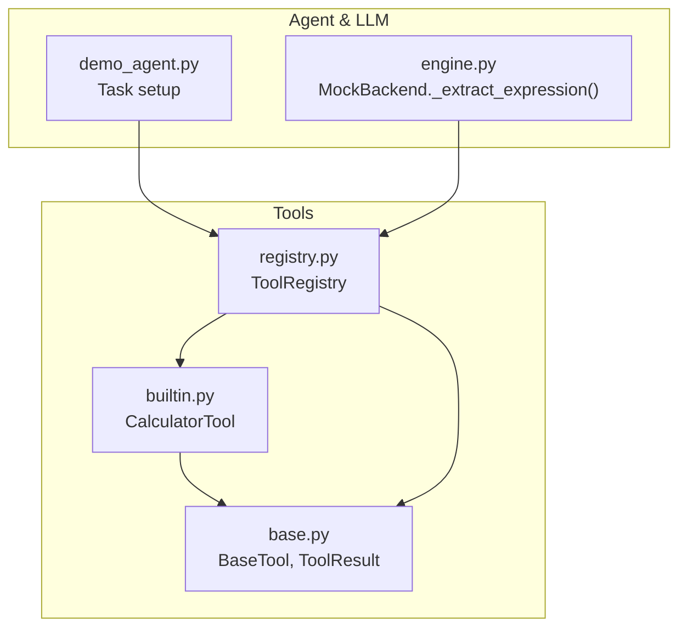
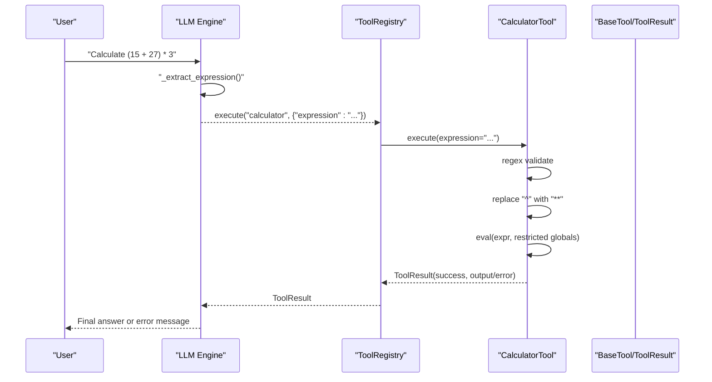
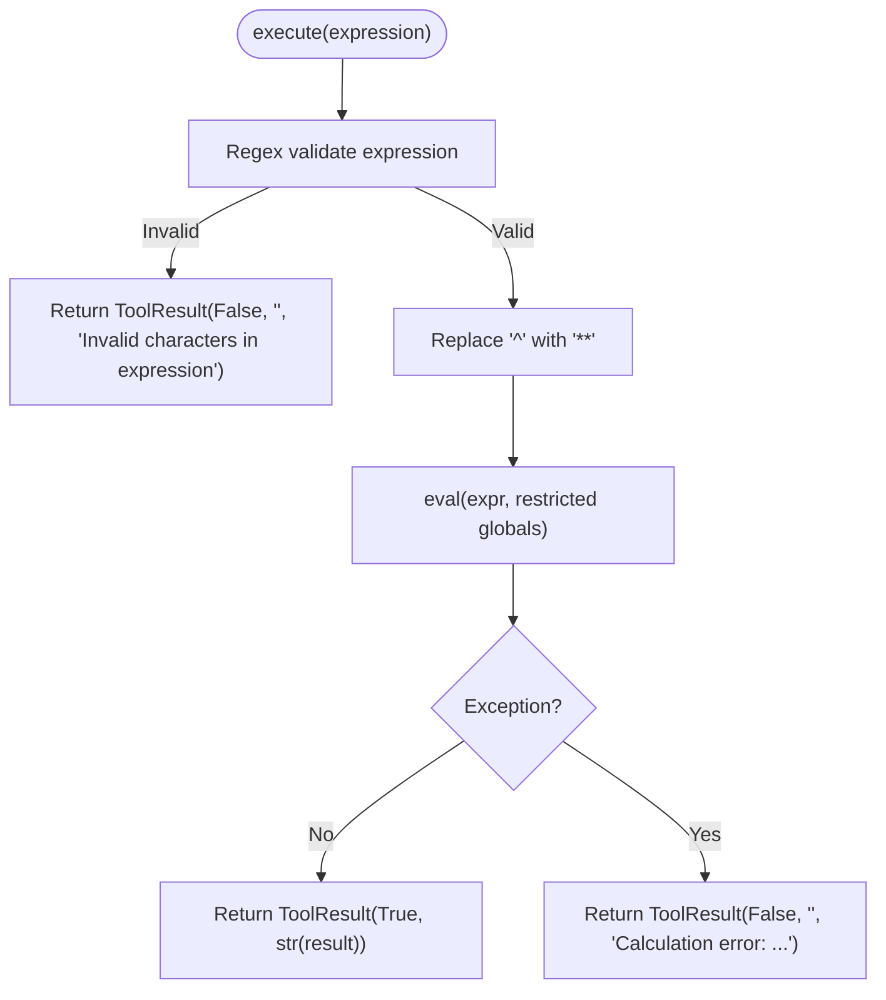
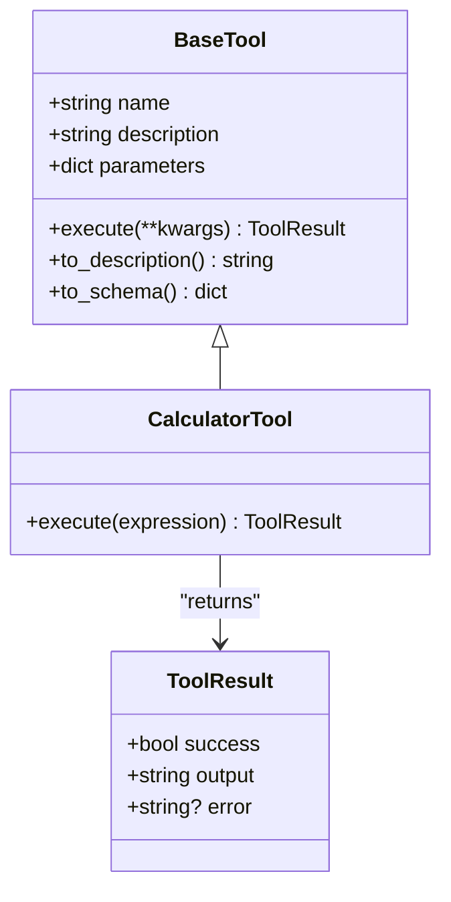
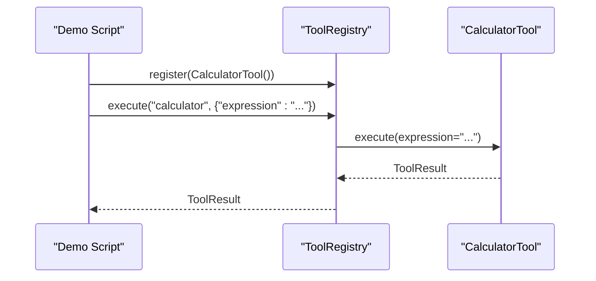
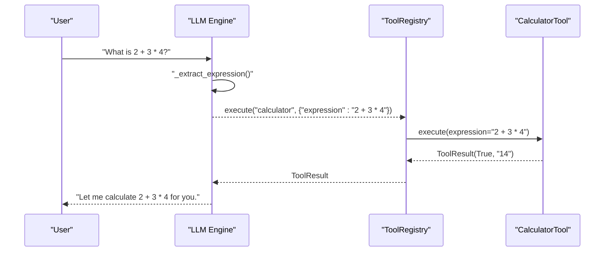
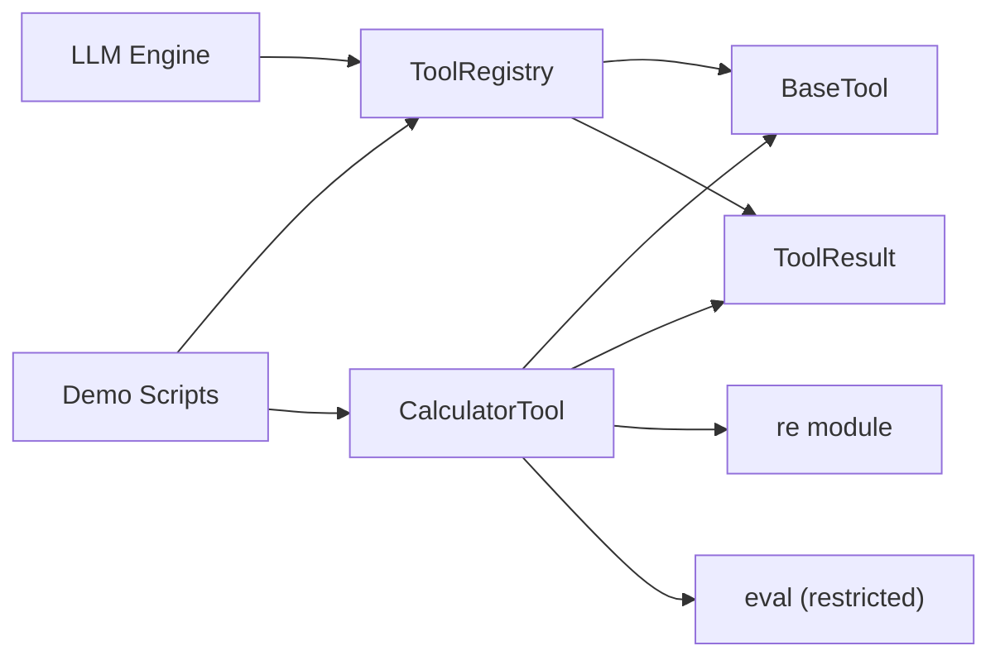

# Calculator Tool

<cite>
**Referenced Files in This Document**
- [builtin.py](file://harness/tools/builtin.py)
- [base.py](file://harness/tools/base.py)
- [registry.py](file://harness/tools/registry.py)
- [engine.py](file://harness/llm/engine.py)
- [demo_agent.py](file://demos/demo_agent.py)
</cite>

## Table of Contents
1. [Introduction](#introduction)
2. [Project Structure](#project-structure)
3. [Core Components](#core-components)
4. [Architecture Overview](#architecture-overview)
5. [Detailed Component Analysis](#detailed-component-analysis)
6. [Dependency Analysis](#dependency-analysis)
7. [Performance Considerations](#performance-considerations)
8. [Troubleshooting Guide](#troubleshooting-guide)
9. [Conclusion](#conclusion)
10. [Appendices](#appendices)

## Introduction
This document explains the CalculatorTool class, which safely evaluates mathematical expressions within an agent tool system. It covers how input is validated using regex, how evaluation is performed in a restricted context to prevent unsafe operations, and how errors are handled and reported. It also documents supported operators, parameter expectations, security considerations, and provides practical examples and integration guidance with the tool registry and agent workflows.

## Project Structure
The CalculatorTool is part of the built-in tools and integrates with the tool registry and agent loop:
- The tool implementation resides in the built-in tools module.
- Tools inherit from a base class that defines the common interface and result structure.
- A central registry manages tool registration, lookup, and execution.
- An LLM engine (mock for demos) detects calculator usage and invokes the tool via the registry.
- Demo scripts show how to set up the registry, register tools, and run tasks that trigger calculator usage.

**Diagram sources**
- [builtin.py:13-30](file://harness/tools/builtin.py#L13-L30)
- [base.py:16-67](file://harness/tools/base.py#L16-L67)
- [registry.py:17-67](file://harness/tools/registry.py#L17-L67)
- [engine.py:325-333](file://harness/llm/engine.py#L325-L333)
- [demo_agent.py:21-34](file://demos/demo_agent.py#L21-L34)

**Section sources**
- [builtin.py:13-30](file://harness/tools/builtin.py#L13-L30)
- [base.py:16-67](file://harness/tools/base.py#L16-L67)
- [registry.py:17-67](file://harness/tools/registry.py#L17-L67)
- [engine.py:325-333](file://harness/llm/engine.py#L325-L333)
- [demo_agent.py:21-34](file://demos/demo_agent.py#L21-L34)

## Core Components
- CalculatorTool: Implements safe math expression evaluation with regex validation and restricted eval context.
- BaseTool and ToolResult: Define the tool interface and standardized return values.
- ToolRegistry: Central catalog for registering, listing, and executing tools by name.
- LLM Engine (Mock): Detects calculator intent and constructs tool calls with extracted expressions.
- Demo Agent: Demonstrates setting up the registry, registering default tools, and running tasks that invoke the calculator.

Key responsibilities:
- Input validation: Only allow characters used in arithmetic and parentheses.
- Safe evaluation: Use a restricted globals dict with builtins disabled.
- Error handling: Return structured results indicating success or failure with messages.
- Integration: Expose tool metadata and execute via the registry.

**Section sources**
- [builtin.py:13-30](file://harness/tools/builtin.py#L13-L30)
- [base.py:16-67](file://harness/tools/base.py#L16-L67)
- [registry.py:17-67](file://harness/tools/registry.py#L17-L67)
- [engine.py:325-333](file://harness/llm/engine.py#L325-L333)
- [demo_agent.py:21-34](file://demos/demo_agent.py#L21-L34)

## Architecture Overview
The calculator workflow involves multiple components:
- The LLM engine identifies calculator-related prompts and extracts a candidate expression.
- The engine creates a tool call for the calculator with the extracted expression.
- The tool registry resolves the calculator tool and executes it with provided arguments.
- The calculator validates the expression, performs safe evaluation, and returns a ToolResult.
- The agent loop consumes the tool result and continues processing.

**Diagram sources**
- [engine.py:325-333](file://harness/llm/engine.py#L325-L333)
- [registry.py:43-60](file://harness/tools/registry.py#L43-L60)
- [builtin.py:19-30](file://harness/tools/builtin.py#L19-L30)
- [base.py:16-27](file://harness/tools/base.py#L16-L27)

## Detailed Component Analysis

### CalculatorTool Implementation
- Purpose: Safely evaluate mathematical expressions provided as a string.
- Parameter:
  - expression: A string representing a math expression. Examples include simple arithmetic and nested parentheses.
- Supported operators:
  - Addition (+), subtraction (-), multiplication (*), division (/), exponentiation (**), modulo (%), parentheses (()).
  - Caret (^) is accepted in input but is converted to ** before evaluation.
- Validation:
  - Regex ensures only digits, whitespace, allowed operators, parentheses, decimal points, percent signs, caret, and commas are present. Any other character triggers a validation error.
- Evaluation:
  - The caret symbol is replaced with double asterisks to match Python’s exponentiation operator.
  - Expression is evaluated using a restricted eval context where builtins are disabled to prevent arbitrary code execution.
- Error Handling:
  - If validation fails or evaluation raises an exception, a ToolResult with success=False and an error message is returned.
  - On success, ToolResult contains success=True and the stringified result.

**Diagram sources**
- [builtin.py:19-30](file://harness/tools/builtin.py#L19-L30)

**Section sources**
- [builtin.py:13-30](file://harness/tools/builtin.py#L13-L30)

### BaseTool and ToolResult
- BaseTool:
  - Defines abstract execute method and common attributes (name, description, parameters).
  - Provides methods to generate descriptions and schemas for tool discovery and prompting.
- ToolResult:
  - Standardized dataclass for tool execution outcomes: success flag, output string, and optional error message.

**Diagram sources**
- [base.py:16-67](file://harness/tools/base.py#L16-L67)
- [builtin.py:13-30](file://harness/tools/builtin.py#L13-L30)

**Section sources**
- [base.py:16-67](file://harness/tools/base.py#L16-L67)

### ToolRegistry Integration
- Registration:
  - Default tools (including CalculatorTool) are registered via a helper function that adds them to the registry.
- Execution:
  - Registry.execute looks up the tool by name and calls its execute method with provided arguments.
  - Errors during tool execution are caught and wrapped into a ToolResult with success=False and an error message.
- Discovery:
  - list_tools and get_tools_description support generating tool metadata for system prompts.

**Diagram sources**
- [registry.py:28-60](file://harness/tools/registry.py#L28-L60)
- [builtin.py:77-82](file://harness/tools/builtin.py#L77-L82)
- [demo_agent.py:21-34](file://demos/demo_agent.py#L21-L34)

**Section sources**
- [registry.py:17-67](file://harness/tools/registry.py#L17-L67)
- [builtin.py:77-82](file://harness/tools/builtin.py#L77-L82)
- [demo_agent.py:21-34](file://demos/demo_agent.py#L21-L34)

### LLM Engine Interaction
- Expression Extraction:
  - The mock LLM engine uses pattern matching to detect calculator-related prompts and extract a candidate expression.
  - It applies basic sanitization to ensure only safe characters are passed to the calculator tool.
- Tool Call Construction:
  - When a calculator intent is detected, the engine constructs a tool call with the name "calculator" and passes the extracted expression as the argument.

**Diagram sources**
- [engine.py:325-333](file://harness/llm/engine.py#L325-L333)
- [engine.py:361-381](file://harness/llm/engine.py#L361-L381)
- [registry.py:43-60](file://harness/tools/registry.py#L43-L60)
- [builtin.py:19-30](file://harness/tools/builtin.py#L19-L30)

**Section sources**
- [engine.py:325-333](file://harness/llm/engine.py#L325-L333)
- [engine.py:361-381](file://harness/llm/engine.py#L361-L381)

## Dependency Analysis
- CalculatorTool depends on:
  - BaseTool for interface compliance.
  - ToolResult for standardized outputs.
  - Python’s re module for input validation.
  - Python’s eval with restricted globals for evaluation.
- ToolRegistry depends on:
  - BaseTool and ToolResult for tool abstraction and results.
  - Logging for diagnostics.
- LLM Engine depends on:
  - ToolRegistry to execute tools by name.
  - Pattern matching to extract expressions from user prompts.
- Demo scripts depend on:
  - ToolRegistry and built-in tool registration to enable calculator usage.

**Diagram sources**
- [builtin.py:13-30](file://harness/tools/builtin.py#L13-L30)
- [base.py:16-67](file://harness/tools/base.py#L16-L67)
- [registry.py:17-67](file://harness/tools/registry.py#L17-L67)
- [engine.py:325-333](file://harness/llm/engine.py#L325-L333)
- [demo_agent.py:21-34](file://demos/demo_agent.py#L21-L34)

**Section sources**
- [builtin.py:13-30](file://harness/tools/builtin.py#L13-L30)
- [base.py:16-67](file://harness/tools/base.py#L16-L67)
- [registry.py:17-67](file://harness/tools/registry.py#L17-L67)
- [engine.py:325-333](file://harness/llm/engine.py#L325-L333)
- [demo_agent.py:21-34](file://demos/demo_agent.py#L21-L34)

## Performance Considerations
- Regex validation is fast and prevents expensive or unsafe evaluations by rejecting invalid inputs early.
- Using a restricted eval context avoids overhead of importing modules or accessing dangerous functions.
- For high-throughput scenarios, consider caching repeated expressions if appropriate, though typical usage is low-frequency and interactive.

[No sources needed since this section provides general guidance]

## Troubleshooting Guide
Common issues and behaviors:
- Invalid characters:
  - If the expression contains disallowed characters (e.g., letters, function names), the tool returns a validation error.
  - Example scenario: Passing "sin(3)" will be rejected due to non-numeric characters.
- Syntax errors:
  - Malformed expressions (e.g., mismatched parentheses) cause evaluation exceptions; these are caught and returned as calculation errors.
- Division by zero:
  - Arithmetic errors like division by zero raise exceptions and are reported as calculation errors.
- Security considerations:
  - Builtins are disabled in the eval context to prevent access to Python standard library functions and modules.
  - Character filtering via regex restricts input to safe arithmetic tokens.
  - Caret (^) is normalized to ** to align with Python’s exponentiation semantics while maintaining user-friendly input.

Operational tips:
- Ensure expressions use only allowed operators and numbers.
- Use parentheses to control precedence when necessary.
- Prefer explicit multiplication symbols (*) rather than implicit concatenation.

**Section sources**
- [builtin.py:19-30](file://harness/tools/builtin.py#L19-L30)
- [registry.py:43-60](file://harness/tools/registry.py#L43-L60)

## Conclusion
CalculatorTool provides a secure and straightforward way to evaluate mathematical expressions within an agent tool ecosystem. It combines strict input validation with a restricted evaluation context to minimize risk while supporting common arithmetic operations. Integration with the tool registry and LLM engine enables seamless invocation from natural language prompts, making it suitable for interactive agents and automated workflows.

[No sources needed since this section summarizes without analyzing specific files]

## Appendices

### Supported Operators and Behavior
- Addition (+), subtraction (-), multiplication (*), division (/), exponentiation (**), modulo (%), parentheses (()).
- Caret (^) is accepted and converted to ** prior to evaluation.
- Decimal points and commas are allowed by the validator; behavior depends on Python’s numeric parsing rules.

**Section sources**
- [builtin.py:13-30](file://harness/tools/builtin.py#L13-L30)

### Practical Examples
- Valid expressions:
  - "2 + 3 * 4" -> expected numeric result based on standard precedence.
  - "(15 + 27) * 3" -> grouped operations yield a different result than without parentheses.
  - "10 % 3" -> remainder operation.
  - "2 ^ 3" -> treated as "2 ** 3".
- Expected outputs:
  - Successful evaluations return a ToolResult with success=True and a stringified number.
- Common errors:
  - "abc + 1" -> invalid characters error.
  - "1 / 0" -> calculation error due to division by zero.
  - "func(2)" -> invalid characters error.

**Section sources**
- [builtin.py:19-30](file://harness/tools/builtin.py#L19-L30)
- [engine.py:325-333](file://harness/llm/engine.py#L325-L333)

### Integration Within Agent Workflows
- Setup:
  - Create a ToolRegistry and register default tools to include the calculator.
  - Initialize an agent (TaskAgent or ChatAgent) with the registry and LLM engine.
- Invocation:
  - Provide user prompts containing calculator keywords; the LLM engine extracts expressions and calls the calculator tool via the registry.
- Results:
  - The agent loop receives ToolResult objects and incorporates them into conversation flow or task completion.

Usage references:
- Demo script demonstrates creating the registry, registering tools, and executing tasks that trigger calculator usage.
- LLM engine shows how calculator tool calls are constructed from user input.

**Section sources**
- [demo_agent.py:21-34](file://demos/demo_agent.py#L21-L34)
- [engine.py:325-333](file://harness/llm/engine.py#L325-L333)
- [registry.py:28-60](file://harness/tools/registry.py#L28-L60)