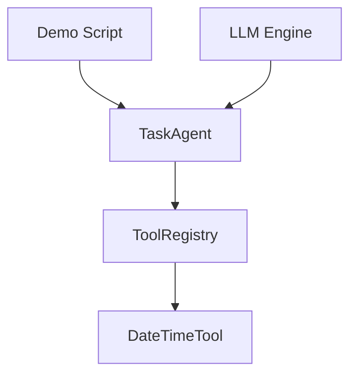
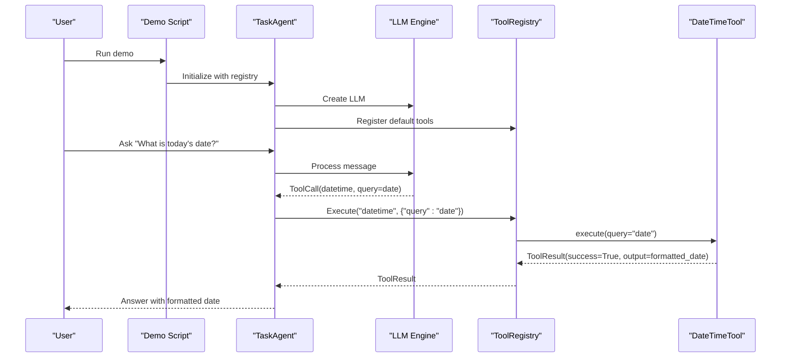
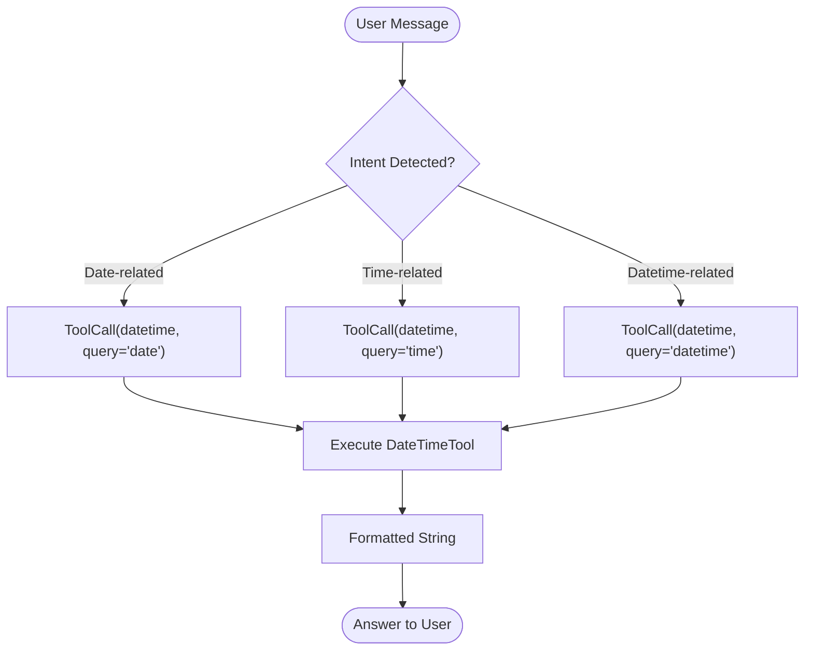
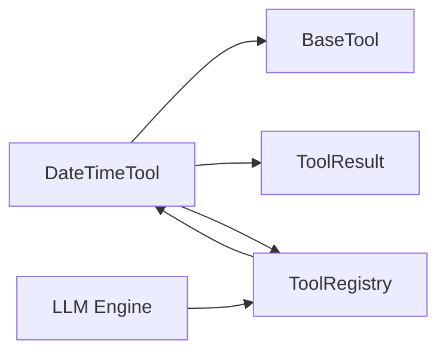

# DateTime Tool

<cite>
**Referenced Files in This Document**
- [builtin.py](file://harness/tools/builtin.py)
- [base.py](file://harness/tools/base.py)
- [registry.py](file://harness/tools/registry.py)
- [engine.py](file://harness/llm/engine.py)
- [demo_agent.py](file://demos/demo_agent.py)
</cite>

## Table of Contents
1. [Introduction](#introduction)
2. [Project Structure](#project-structure)
3. [Core Components](#core-components)
4. [Architecture Overview](#architecture-overview)
5. [Detailed Component Analysis](#detailed-component-analysis)
6. [Dependency Analysis](#dependency-analysis)
7. [Performance Considerations](#performance-considerations)
8. [Troubleshooting Guide](#troubleshooting-guide)
9. [Conclusion](#conclusion)
10. [Appendices](#appendices)

## Introduction
This document explains the DateTimeTool class used by the agent system to retrieve current date and time information. It covers how the tool is invoked, supported query modes, output formats, integration with agents, timezone behavior, and formatting options via strftime. It also clarifies when to use this tool versus Python’s datetime module directly.

## Project Structure
The DateTimeTool is part of the built-in tools provided by the framework and is registered into a central registry that the agent uses during conversations. The LLM engine can detect user intent (date/time queries) and automatically call the tool with the appropriate mode.



**Diagram sources**
- [demo_agent.py:15-35](file://demos/demo_agent.py#L15-L35)
- [registry.py:17-67](file://harness/tools/registry.py#L17-L67)
- [builtin.py:33-46](file://harness/tools/builtin.py#L33-L46)
- [engine.py:300-324](file://harness/llm/engine.py#L300-L324)

**Section sources**
- [demo_agent.py:15-35](file://demos/demo_agent.py#L15-L35)
- [registry.py:17-67](file://harness/tools/registry.py#L17-L67)
- [builtin.py:33-46](file://harness/tools/builtin.py#L33-L46)
- [engine.py:300-324](file://harness/llm/engine.py#L300-L324)

## Core Components
- DateTimeTool: A tool that returns formatted current date/time based on a query parameter.
- BaseTool and ToolResult: Provide the interface and result structure for all tools.
- ToolRegistry: Central catalog that registers and executes tools by name.
- LLM Engine: Detects user intent and triggers the appropriate tool calls.

Key responsibilities:
- DateTimeTool.execute(query): Returns formatted strings for date, time, or combined datetime.
- ToolRegistry.execute(name, arguments): Invokes the correct tool and handles errors.
- LLM Engine: Maps natural language cues to tool calls with specific query values.

**Section sources**
- [builtin.py:33-46](file://harness/tools/builtin.py#L33-L46)
- [base.py:16-67](file://harness/tools/base.py#L16-L67)
- [registry.py:17-67](file://harness/tools/registry.py#L17-L67)
- [engine.py:300-324](file://harness/llm/engine.py#L300-L324)

## Architecture Overview
The agent workflow integrates DateTimeTool through the registry and LLM engine:



**Diagram sources**
- [demo_agent.py:15-35](file://demos/demo_agent.py#L15-L35)
- [engine.py:300-324](file://harness/llm/engine.py#L300-L324)
- [registry.py:43-60](file://harness/tools/registry.py#L43-L60)
- [builtin.py:33-46](file://harness/tools/builtin.py#L33-L46)

## Detailed Component Analysis

### DateTimeTool Class
Purpose:
- Retrieve current date and/or time and return it in a human-readable format.

Parameters:
- query: string; one of "date", "time", or "datetime". Default is "datetime".

Behavior:
- Gets the current local date and time.
- Formats output using strftime patterns:
  - "date": returns a formatted date including day-of-week.
  - "time": returns a formatted time.
  - "datetime": returns both date and time with day-of-week.

Output:
- Always returns a ToolResult with success=True and a formatted string in output.

Examples of expected outputs (illustrative):
- query="date": "2024-05-20 (Monday)"
- query="time": "14:35:07"
- query="datetime": "2024-05-20 14:35:07 (Monday)"

Note: These are examples of the format; actual values depend on the current moment and locale.

Integration points:
- Registered by default via register_default_tools.
- Invoked by the LLM engine when detecting date/time-related intents.

```mermaid
classDiagram
class BaseTool {
+string name
+string description
+dict parameters
+execute(**kwargs) ToolResult
+to_description() str
+to_schema() dict
}
class ToolResult {
+bool success
+string output
+string error
}
class DateTimeTool {
+name = "datetime"
+description = "Get current date and time information."
+parameters = {"query" : "string - 'date', 'time', or 'datetime'"}
+execute(query="datetime", **kw) ToolResult
}
BaseTool <|-- DateTimeTool
DateTimeTool --> ToolResult : "returns"
```

**Diagram sources**
- [base.py:16-67](file://harness/tools/base.py#L16-L67)
- [builtin.py:33-46](file://harness/tools/builtin.py#L33-L46)

**Section sources**
- [builtin.py:33-46](file://harness/tools/builtin.py#L33-L46)
- [base.py:16-67](file://harness/tools/base.py#L16-L67)

### Query Modes and Output Formats
Supported query values and their behaviors:
- "date": Returns current date with day-of-week.
- "time": Returns current time.
- "datetime": Returns current date and time with day-of-week.

Formatting details:
- Uses strftime patterns to produce consistent, readable strings.
- Day-of-week is included in date and datetime outputs.

When to use each:
- Use "date" when only the calendar date is needed.
- Use "time" when only the clock time is needed.
- Use "datetime" for a combined view.

**Section sources**
- [builtin.py:39-46](file://harness/tools/builtin.py#L39-L46)

### Integration Patterns Within Agent Conversations
How the tool is triggered:
- The LLM engine detects keywords like "date", "today", "what day", "time", "clock", "what time", "date and time", or "datetime" and generates a tool call to "datetime" with the corresponding query value.
- The TaskAgent coordinates execution via the ToolRegistry, which invokes DateTimeTool.execute.

Example flows:
- Natural language request: "What is today's date?" -> Engine selects query="date".
- Natural language request: "What time is it now?" -> Engine selects query="time".
- Natural language request: "What is the date and time?" -> Engine selects query="datetime".



**Diagram sources**
- [engine.py:300-324](file://harness/llm/engine.py#L300-L324)
- [registry.py:43-60](file://harness/tools/registry.py#L43-L60)
- [builtin.py:39-46](file://harness/tools/builtin.py#L39-L46)

**Section sources**
- [engine.py:300-324](file://harness/llm/engine.py#L300-L324)
- [demo_agent.py:26-35](file://demos/demo_agent.py#L26-L35)

### When to Use DateTimeTool vs Python’s datetime Module Directly
Use DateTimeTool when:
- You are building an agent conversation and want the LLM to decide whether to call the tool based on user intent.
- You need a standardized, tool-based interface that integrates with the registry and error handling.
- You want consistent formatting across your application without reimplementing logic.

Use Python’s datetime module directly when:
- You are writing non-agent code that needs precise control over formatting, timezones, or arithmetic.
- You require advanced features not exposed by the tool (e.g., timezone-aware datetimes, custom formatting beyond the tool’s defaults).
- You do not need tool invocation overhead or registry integration.

**Section sources**
- [builtin.py:33-46](file://harness/tools/builtin.py#L33-L46)
- [registry.py:17-67](file://harness/tools/registry.py#L17-L67)

### Timezone Considerations
Current behavior:
- The tool uses the system’s local time via the standard datetime library.
- No explicit timezone conversion is performed; results reflect the host machine’s timezone.

Implications:
- If your application runs across multiple timezones, ensure the host environment is configured correctly or consider extending the tool to accept a timezone parameter.
- For timezone-aware operations, prefer Python’s datetime module directly with timezone libraries.

**Section sources**
- [builtin.py:39-46](file://harness/tools/builtin.py#L39-L46)

### Formatting Options via strftime
The tool uses strftime patterns to format outputs:
- Date includes year-month-day and day-of-week.
- Time includes hours, minutes, seconds.
- Datetime combines both with day-of-week.

If you need different formats:
- Extend DateTimeTool to accept a format parameter or provide additional query modes.
- Alternatively, use Python’s datetime module directly for custom formatting.

**Section sources**
- [builtin.py:39-46](file://harness/tools/builtin.py#L39-L46)

## Dependency Analysis
The DateTimeTool depends on:
- BaseTool and ToolResult for interface and result structure.
- ToolRegistry for registration and execution.
- LLM Engine for intent detection and tool call generation.



**Diagram sources**
- [builtin.py:33-46](file://harness/tools/builtin.py#L33-L46)
- [base.py:16-67](file://harness/tools/base.py#L16-L67)
- [registry.py:17-67](file://harness/tools/registry.py#L17-L67)
- [engine.py:300-324](file://harness/llm/engine.py#L300-L324)

**Section sources**
- [builtin.py:33-46](file://harness/tools/builtin.py#L33-L46)
- [base.py:16-67](file://harness/tools/base.py#L16-L67)
- [registry.py:17-67](file://harness/tools/registry.py#L17-L67)
- [engine.py:300-324](file://harness/llm/engine.py#L300-L324)

## Performance Considerations
- DateTimeTool.execute is lightweight: it retrieves the current time once and formats it.
- Overhead comes from tool invocation via the registry and LLM engine routing.
- For high-frequency calls within tight loops, consider caching or calling datetime directly if tool overhead is undesirable.

[No sources needed since this section provides general guidance]

## Troubleshooting Guide
Common issues and resolutions:
- Tool not found: Ensure DateTimeTool is registered via register_default_tools before executing tasks.
- Unexpected format: Verify the query parameter matches one of the supported values ("date", "time", "datetime").
- Incorrect timezone: Confirm the host system timezone settings; extend the tool if timezone parameters are required.

Error handling:
- ToolRegistry.execute wraps tool execution in try/except and returns ToolResult with success=False and an error message if exceptions occur.

**Section sources**
- [registry.py:43-60](file://harness/tools/registry.py#L43-L60)
- [builtin.py:33-46](file://harness/tools/builtin.py#L33-L46)

## Conclusion
DateTimeTool provides a simple, integrated way for agents to retrieve current date and time information with consistent formatting. It supports three query modes and integrates seamlessly with the LLM engine and tool registry. For advanced formatting or timezone-aware operations, use Python’s datetime module directly.

[No sources needed since this section summarizes without analyzing specific files]

## Appendices

### Example Usage in Demos
The demo script initializes the agent with the registry and demonstrates tasks that trigger date/time queries.

**Section sources**
- [demo_agent.py:15-35](file://demos/demo_agent.py#L15-L35)