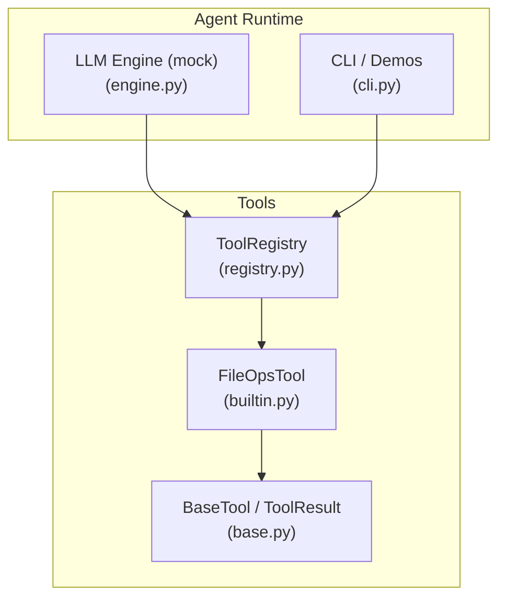
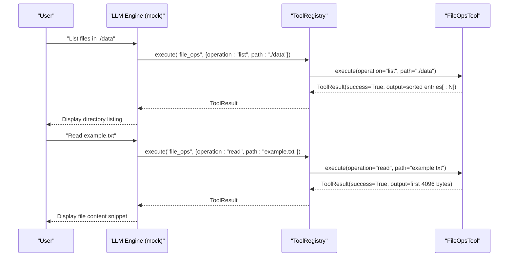
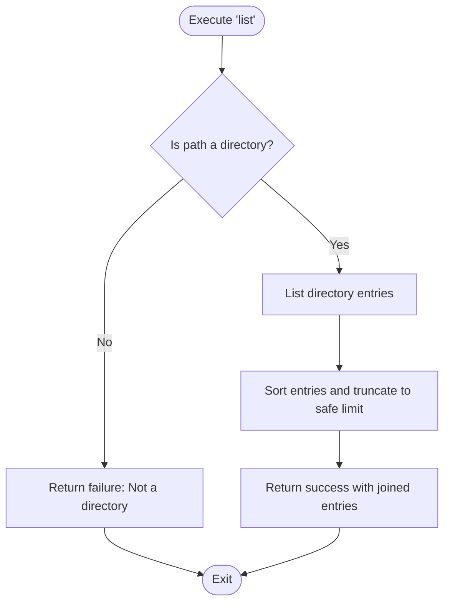
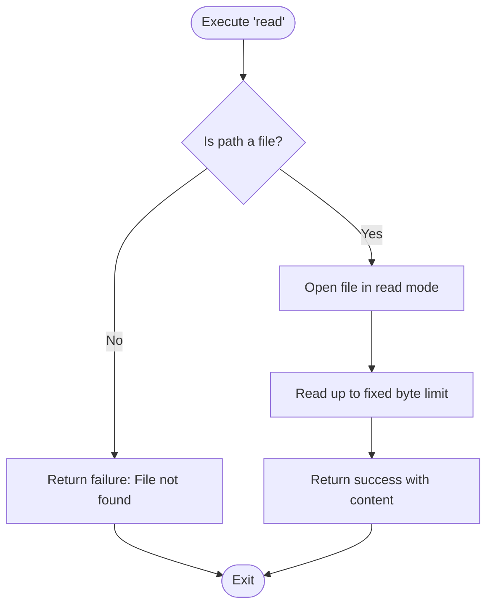
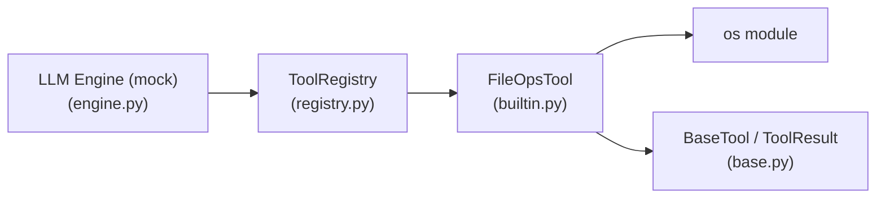

# File Operations Tool

<cite>
**Referenced Files in This Document**
- [builtin.py](file://harness/tools/builtin.py)
- [base.py](file://harness/tools/base.py)
- [registry.py](file://harness/tools/registry.py)
- [engine.py](file://harness/llm/engine.py)
- [cli.py](file://harness/cli.py)
</cite>

## Table of Contents
1. [Introduction](#introduction)
2. [Project Structure](#project-structure)
3. [Core Components](#core-components)
4. [Architecture Overview](#architecture-overview)
5. [Detailed Component Analysis](#detailed-component-analysis)
6. [Dependency Analysis](#dependency-analysis)
7. [Performance Considerations](#performance-considerations)
8. [Troubleshooting Guide](#troubleshooting-guide)
9. [Conclusion](#conclusion)
10. [Appendices](#appendices)

## Introduction
This document provides detailed documentation for the FileOpsTool class, a read-only file system tool used by agents to list directory contents and read files safely. It explains supported operations, parameters, safety restrictions (read-only access, path traversal protection, content size limits), error handling, security considerations, and proper usage patterns within agent workflows. It also clarifies limitations compared to full file system access.

## Project Structure
The FileOpsTool is implemented as part of the built-in tools and integrated into the tool registry used by agents. The relevant components are:
- FileOpsTool implementation and registration
- Base tool interface and result model
- Tool registry that executes tools by name
- LLM engine mock that demonstrates how agents call the tool

**Diagram sources**
- [builtin.py:49-82](file://harness/tools/builtin.py#L49-L82)
- [base.py:16-67](file://harness/tools/base.py#L16-L67)
- [registry.py:17-74](file://harness/tools/registry.py#L17-L74)
- [engine.py:335-353](file://harness/llm/engine.py#L335-L353)
- [cli.py:123-176](file://harness/cli.py#L123-L176)

**Section sources**
- [builtin.py:49-82](file://harness/tools/builtin.py#L49-L82)
- [base.py:16-67](file://harness/tools/base.py#L16-L67)
- [registry.py:17-74](file://harness/tools/registry.py#L17-L74)
- [engine.py:335-353](file://harness/llm/engine.py#L335-L353)
- [cli.py:123-176](file://harness/cli.py#L123-L176)

## Core Components
- FileOpsTool: Provides read-only file system operations with two modes:
  - operation=list: Lists entries in a directory (limited output).
  - operation=read: Reads a file up to a fixed byte limit.
- BaseTool and ToolResult: Define the common interface and standardized return structure for all tools.
- ToolRegistry: Central catalog that registers tools and executes them with error handling.
- LLM Engine (mock): Demonstrates how an agent can request file_ops via tool calls.

Key behaviors:
- Read-only access: Only lists directories and reads files; no write or delete operations.
- Path validation: Uses OS checks to ensure the target exists and is the expected type before operating.
- Output limits: Directory listing is truncated to a safe number of entries; file reads are limited to a fixed byte count.
- Error handling: All exceptions are caught and returned as ToolResult with success=False and an error message.

**Section sources**
- [builtin.py:49-82](file://harness/tools/builtin.py#L49-L82)
- [base.py:16-67](file://harness/tools/base.py#L16-L67)
- [registry.py:43-60](file://harness/tools/registry.py#L43-L60)
- [engine.py:335-353](file://harness/llm/engine.py#L335-L353)

## Architecture Overview
The agent workflow typically follows this sequence:
1. The LLM engine detects user intent related to files and constructs a tool call to file_ops with operation and path.
2. The ToolRegistry looks up the FileOpsTool and invokes execute with the provided arguments.
3. FileOpsTool performs the requested operation safely and returns a ToolResult.
4. The registry wraps any exceptions into a ToolResult and returns it to the caller.

**Diagram sources**
- [engine.py:335-353](file://harness/llm/engine.py#L335-L353)
- [registry.py:43-60](file://harness/tools/registry.py#L43-L60)
- [builtin.py:58-74](file://harness/tools/builtin.py#L58-L74)

## Detailed Component Analysis

### FileOpsTool Class
Responsibilities:
- Provide read-only file system operations: list directories and read files.
- Enforce safety constraints: validate paths, limit outputs, and catch errors.

Parameters:
- operation: string — must be one of:
  - "list": List directory entries.
  - "read": Read file content.
- path: string — file or directory path. For "list", must point to a directory; for "read", must point to a file.

Behavior:
- operation=list:
  - Validates that path is a directory.
  - Returns sorted entries, truncated to a safe maximum to avoid overwhelming responses.
- operation=read:
  - Validates that path is a file.
  - Opens the file in text mode and reads up to a fixed byte limit.
  - Returns the content as a string.

Safety and Limits:
- Read-only: No write, create, rename, or delete operations are performed.
- Path checks: Uses existence/type checks before accessing the file system.
- Output limits:
  - Directory listing is truncated to a bounded number of entries.
  - File reads are limited to a fixed byte count to prevent large payloads.
- Error handling: Any exception during execution is caught and returned as a failure ToolResult with an error message.

Security Considerations:
- Path traversal protection:
  - The implementation relies on OS-level path resolution when checking types and opening files. However, there is no explicit normalization or canonicalization step to resolve symbolic links or relative path tricks. In environments where absolute control over allowed roots is required, consider adding explicit allow-listing or canonical path checks before executing operations.
- Content size limits:
  - File reads are capped at a fixed byte limit to mitigate memory and response size risks.
- Read-only design:
  - Prevents accidental data modification through this tool.

Usage Patterns in Agent Workflows:
- The LLM engine can automatically generate tool calls based on user prompts mentioning files, reading, or listing.
- Agents should pass clear, absolute or well-resolved relative paths to minimize ambiguity.
- When listing large directories, expect truncated results; use pagination strategies at the application layer if needed.

Limitations Compared to Full File System Access:
- No write/create/rename/delete capabilities.
- No recursive traversal beyond a single directory level.
- No streaming or chunked reads beyond the fixed limit.
- No metadata retrieval (e.g., permissions, timestamps) beyond names.

**Section sources**
- [builtin.py:49-82](file://harness/tools/builtin.py#L49-L82)
- [base.py:16-67](file://harness/tools/base.py#L16-L67)
- [registry.py:43-60](file://harness/tools/registry.py#L43-L60)
- [engine.py:335-353](file://harness/llm/engine.py#L335-L353)

#### Operation Flowcharts

##### List Operation

**Diagram sources**
- [builtin.py:60-64](file://harness/tools/builtin.py#L60-L64)

##### Read Operation

**Diagram sources**
- [builtin.py:65-70](file://harness/tools/builtin.py#L65-L70)

### Integration Points
- Registration: FileOpsTool is registered alongside other built-in tools so agents can discover and invoke it.
- Execution: The ToolRegistry handles lookup and invocation, wrapping exceptions into ToolResult.
- Mock LLM: Demonstrates automatic generation of file_ops tool calls from natural language prompts.

**Section sources**
- [builtin.py:77-82](file://harness/tools/builtin.py#L77-L82)
- [registry.py:17-74](file://harness/tools/registry.py#L17-L74)
- [engine.py:335-353](file://harness/llm/engine.py#L335-L353)

## Dependency Analysis
FileOpsTool depends on:
- Python standard library os module for path and file system checks.
- BaseTool and ToolResult for consistent tool interface and results.
- ToolRegistry for discovery and execution orchestration.
- LLM engine mock for demonstrating tool call generation.

**Diagram sources**
- [builtin.py:49-82](file://harness/tools/builtin.py#L49-L82)
- [base.py:16-67](file://harness/tools/base.py#L16-L67)
- [registry.py:17-74](file://harness/tools/registry.py#L17-L74)
- [engine.py:335-353](file://harness/llm/engine.py#L335-L353)

**Section sources**
- [builtin.py:49-82](file://harness/tools/builtin.py#L49-L82)
- [base.py:16-67](file://harness/tools/base.py#L16-L67)
- [registry.py:17-74](file://harness/tools/registry.py#L17-L74)
- [engine.py:335-353](file://harness/llm/engine.py#L335-L353)

## Performance Considerations
- Directory listing truncation prevents excessive output and reduces payload sizes.
- Fixed-size file reads limit memory usage and response length.
- Avoid listing very large directories repeatedly; prefer targeted paths.
- If more advanced navigation is needed, implement higher-level logic outside the tool (e.g., application-layer recursion with controlled depth).

[No sources needed since this section provides general guidance]

## Troubleshooting Guide
Common issues and resolutions:
- Unknown operation:
  - Ensure operation is exactly "list" or "read".
  - The tool returns a failure with an error message indicating the unknown value.
- Not a directory (for list):
  - Verify the path points to a directory.
  - Use absolute paths or ensure working directory context is correct.
- File not found (for read):
  - Confirm the file exists at the specified path.
  - Check case sensitivity and path separators depending on the OS.
- Permission or I/O errors:
  - These are caught and returned as failures with error messages.
  - Resolve underlying OS-level permissions or file availability.

Error handling flow:
- All exceptions are caught and converted into ToolResult(success=False, output="", error=str(e)).
- The ToolRegistry also catches exceptions during tool execution and returns a failure ToolResult.

**Section sources**
- [builtin.py:58-74](file://harness/tools/builtin.py#L58-L74)
- [registry.py:43-60](file://harness/tools/registry.py#L43-L60)

## Conclusion
FileOpsTool provides a safe, read-only interface for basic file system interactions suitable for agent workflows. It supports listing directories and reading files with built-in safeguards such as path validation, output limits, and robust error handling. While it does not offer full file system capabilities, its design prioritizes safety and predictability, making it appropriate for scenarios where controlled read access is sufficient. For advanced needs like writing, recursive traversal, or metadata access, extend the tooling layer with additional specialized tools while maintaining strict safety policies.

[No sources needed since this section summarizes without analyzing specific files]

## Appendices

### API Reference Summary
- Tool name: file_ops
- Parameters:
  - operation: string — "list" or "read"
  - path: string — directory path for "list"; file path for "read"
- Behavior:
  - list: Returns sorted directory entries, truncated to a safe limit.
  - read: Returns file content up to a fixed byte limit.
- Safety:
  - Read-only access enforced.
  - Path type validated before operation.
  - Exceptions captured and returned as failures.

**Section sources**
- [builtin.py:49-82](file://harness/tools/builtin.py#L49-L82)
- [base.py:16-67](file://harness/tools/base.py#L16-L67)

### Example Usage Scenarios
- List files in a directory:
  - Call file_ops with operation="list" and path set to the target directory.
  - Expect a truncated, sorted list of entries.
- Read a file:
  - Call file_ops with operation="read" and path set to the target file.
  - Expect the first portion of the file content up to the fixed byte limit.

These scenarios are demonstrated by the LLM engine’s mock behavior that generates tool calls based on user prompts.

**Section sources**
- [engine.py:335-353](file://harness/llm/engine.py#L335-L353)