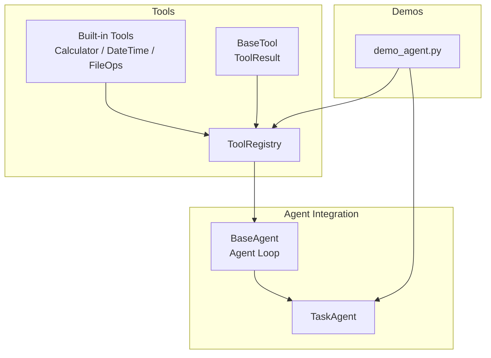
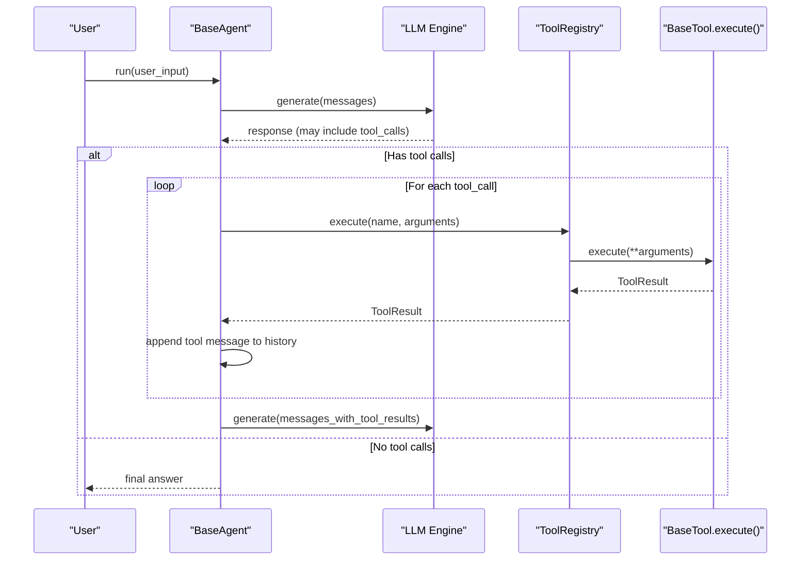
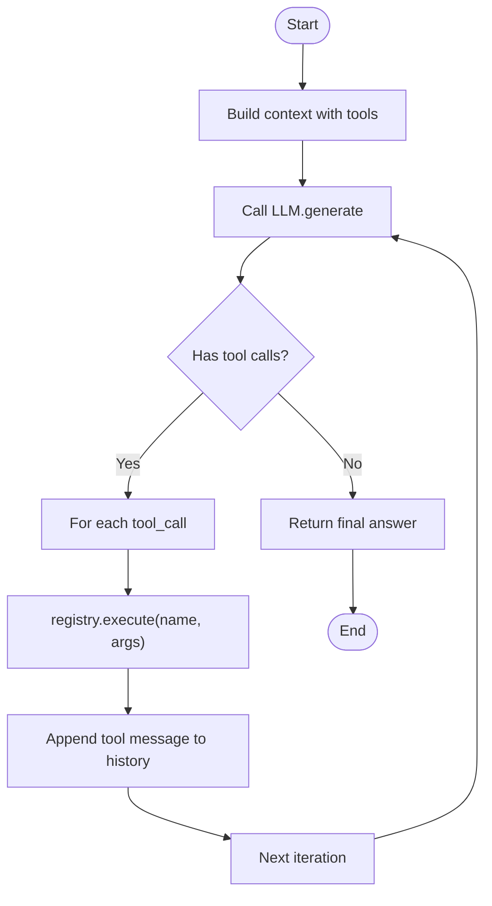
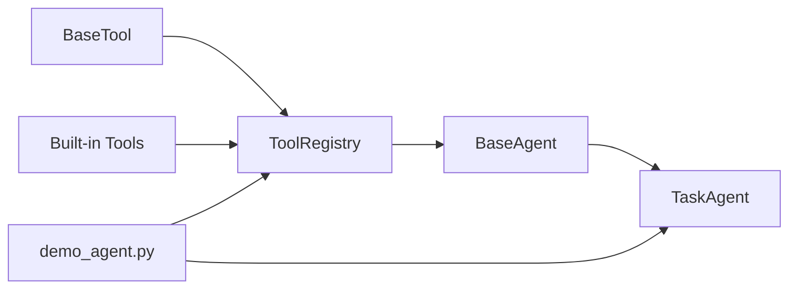

# Tool System APIs

<cite>
**Referenced Files in This Document**
- [base.py](file://harness/tools/base.py)
- [registry.py](file://harness/tools/registry.py)
- [builtin.py](file://harness/tools/builtin.py)
- [__init__.py](file://harness/tools/__init__.py)
- [base.py](file://harness/agent/base.py)
- [task.py](file://harness/agent/task.py)
- [demo_agent.py](file://demos/demo_agent.py)
</cite>

## Table of Contents
1. [Introduction](#introduction)
2. [Project Structure](#project-structure)
3. [Core Components](#core-components)
4. [Architecture Overview](#architecture-overview)
5. [Detailed Component Analysis](#detailed-component-analysis)
6. [Dependency Analysis](#dependency-analysis)
7. [Performance Considerations](#performance-considerations)
8. [Troubleshooting Guide](#troubleshooting-guide)
9. [Conclusion](#conclusion)
10. [Appendices](#appendices)

## Introduction
This document provides comprehensive API documentation for the Tool system in HarnessAIDemo. It covers:
- The BaseTool abstract class and its execute() contract, parameter validation patterns, and return value formats via ToolResult
- The ToolRegistry for tool discovery, registration, listing, and execution management
- Built-in tools: Calculator, DateTime, and FileOps with their parameters and usage examples
- Guidance for creating custom tools, including error handling, input validation, and documentation generation
- Examples of tool registration, execution, and integration with agents
- The tool calling mechanism and how tools integrate with the agent loop

## Project Structure
The Tool system is implemented under harness/tools with supporting integration in harness/agent and demos.

**Diagram sources**
- [base.py:16-67](file://harness/tools/base.py#L16-L67)
- [registry.py:17-74](file://harness/tools/registry.py#L17-L74)
- [builtin.py:13-83](file://harness/tools/builtin.py#L13-L83)
- [base.py:63-165](file://harness/agent/base.py#L63-L165)
- [task.py:32-73](file://harness/agent/task.py#L32-L73)
- [demo_agent.py:15-39](file://demos/demo_agent.py#L15-L39)

**Section sources**
- [base.py:16-67](file://harness/tools/base.py#L16-L67)
- [registry.py:17-74](file://harness/tools/registry.py#L17-L74)
- [builtin.py:13-83](file://harness/tools/builtin.py#L13-L83)
- [base.py:63-165](file://harness/agent/base.py#L63-L165)
- [task.py:32-73](file://harness/agent/task.py#L32-L73)
- [demo_agent.py:15-39](file://demos/demo_agent.py#L15-L39)

## Core Components
- BaseTool and ToolResult define the tool contract and standardized result format
- ToolRegistry manages tool lifecycle and execution
- Built-in tools demonstrate safe implementations and parameter schemas
- Agent loop integrates tools by executing them based on LLM tool calls

Key responsibilities:
- BaseTool: declare name, description, parameters; implement execute(); provide schema/description helpers
- ToolRegistry: register tools, list them, execute by name with error handling, generate combined descriptions
- Built-in tools: Calculator (safe math), DateTime (date/time queries), FileOps (read-only file operations)
- Agent loop: build context, call LLM, detect tool calls, execute via registry, feed results back

**Section sources**
- [base.py:16-67](file://harness/tools/base.py#L16-L67)
- [registry.py:17-74](file://harness/tools/registry.py#L17-L74)
- [builtin.py:13-83](file://harness/tools/builtin.py#L13-L83)
- [base.py:63-165](file://harness/agent/base.py#L63-L165)

## Architecture Overview
The tool system integrates tightly with the agent loop. The LLM may request tool calls; the agent executes them through the registry and feeds results back to continue reasoning.

**Diagram sources**
- [base.py:97-160](file://harness/agent/base.py#L97-L160)
- [registry.py:43-67](file://harness/tools/registry.py#L43-L67)
- [base.py:42-45](file://harness/tools/base.py#L42-L45)

## Detailed Component Analysis

### BaseTool and ToolResult
- BaseTool defines:
  - Class attributes: name, description, parameters (schema-like dict)
  - Abstract method: execute(**kwargs) -> ToolResult
  - Helpers: to_description(), to_schema()
- ToolResult fields:
  - success: bool
  - output: str (user-facing or model-facing text)
  - error: Optional[str] (populated when success is False)

Implementation notes:
- Parameter validation should be performed inside execute() and reflected in ToolResult
- Return values must always be ToolResult to ensure consistent handling across the registry and agent loop

**Section sources**
- [base.py:16-67](file://harness/tools/base.py#L16-L67)

### ToolRegistry
Responsibilities:
- register(tool): add or overwrite a tool by name
- get(name): retrieve a tool instance
- list_tools(): list all registered tools
- execute(name, arguments): find tool and call execute(**arguments); catch exceptions and return failure ToolResult
- get_tools_description(): combine tool descriptions for system prompts
- Supports len() and membership checks

Error handling:
- Unknown tool names produce a ToolResult with success=False and an informative error listing available tools
- Exceptions during tool execution are caught and returned as ToolResult(success=False, error=str(e))

**Section sources**
- [registry.py:17-74](file://harness/tools/registry.py#L17-L74)

### Built-in Tools

#### CalculatorTool
- Purpose: Evaluate mathematical expressions safely
- Parameters:
  - expression: string representing a math expression
- Behavior:
  - Validates characters allowed in the expression
  - Normalizes power operator
  - Evaluates within a restricted environment
  - Returns ToolResult with numeric result or error message

Usage example:
- Query: "Calculate (15 + 27) * 3"
- Expected behavior: returns a numeric result string

**Section sources**
- [builtin.py:13-31](file://harness/tools/builtin.py#L13-L31)

#### DateTimeTool
- Purpose: Get current date and/or time
- Parameters:
  - query: string; one of "date", "time", or "datetime"
- Behavior:
  - Formats current datetime according to query
  - Always returns success=True with formatted string

Usage example:
- Query: "What is today's date?"
- Query: "What time is it now?"

**Section sources**
- [builtin.py:33-47](file://harness/tools/builtin.py#L33-L47)

#### FileOpsTool
- Purpose: Read-only file system operations
- Parameters:
  - operation: string; "list" or "read"
  - path: string; directory or file path
- Behavior:
  - list: lists entries in a directory (limited to first 50)
  - read: reads up to a fixed number of bytes from a file
  - Returns appropriate ToolResult with success/failure and messages

Usage example:
- Operation "list" with a directory path
- Operation "read" with a file path

**Section sources**
- [builtin.py:49-75](file://harness/tools/builtin.py#L49-L75)

### Creating Custom Tools
Guidelines:
- Subclass BaseTool and set name, description, parameters
- Implement execute(**kwargs) returning ToolResult
- Validate inputs explicitly and return ToolResult(success=False, error=...) for invalid inputs
- Keep side effects minimal and safe; prefer read-only operations where possible
- Use descriptive parameters so the LLM can infer correct usage

Example pattern:
- Define a new tool class inheriting from BaseTool
- In execute(), validate kwargs against parameters
- On success, return ToolResult(success=True, output=...)
- On failure, return ToolResult(success=False, output="", error="...")

Documentation generation:
- to_description() produces a human-readable line for system prompts using name, parameters, and description
- to_schema() produces a JSON-like dict suitable for tool introspection

**Section sources**
- [base.py:30-67](file://harness/tools/base.py#L30-L67)
- [builtin.py:13-83](file://harness/tools/builtin.py#L13-L83)

### Tool Registration, Execution, and Agent Integration

Registration:
- Create a ToolRegistry instance
- Register built-in tools via register_default_tools(registry) or manually register instances
- Optionally register custom tools

Execution:
- The agent loop detects tool calls from the LLM response
- For each tool call, the agent invokes registry.execute(name, arguments)
- Results are appended to conversation history as tool messages

Integration points:
- BaseAgent.run orchestrates the loop and uses ToolRegistry.execute
- TaskAgent extends BaseAgent with task-oriented behavior and higher max_iterations
- Demos show typical setup and usage

**Diagram sources**
- [base.py:97-160](file://harness/agent/base.py#L97-L160)
- [registry.py:43-67](file://harness/tools/registry.py#L43-L67)

**Section sources**
- [registry.py:25-67](file://harness/tools/registry.py#L25-L67)
- [base.py:97-160](file://harness/agent/base.py#L97-L160)
- [task.py:32-73](file://harness/agent/task.py#L32-L73)
- [demo_agent.py:15-39](file://demos/demo_agent.py#L15-L39)

## Dependency Analysis
The tool system has clear boundaries and low coupling:
- BaseTool depends only on standard library types
- ToolRegistry depends on BaseTool and ToolResult
- Built-in tools depend on BaseTool and standard libraries
- Agent components depend on ToolRegistry to execute tools

**Diagram sources**
- [base.py:16-67](file://harness/tools/base.py#L16-L67)
- [registry.py:17-74](file://harness/tools/registry.py#L17-L74)
- [builtin.py:13-83](file://harness/tools/builtin.py#L13-L83)
- [base.py:63-165](file://harness/agent/base.py#L63-L165)
- [task.py:32-73](file://harness/agent/task.py#L32-L73)
- [demo_agent.py:15-39](file://demos/demo_agent.py#L15-L39)

**Section sources**
- [base.py:16-67](file://harness/tools/base.py#L16-L67)
- [registry.py:17-74](file://harness/tools/registry.py#L17-L74)
- [builtin.py:13-83](file://harness/tools/builtin.py#L13-L83)
- [base.py:63-165](file://harness/agent/base.py#L63-L165)
- [task.py:32-73](file://harness/agent/task.py#L32-L73)
- [demo_agent.py:15-39](file://demos/demo_agent.py#L15-L39)

## Performance Considerations
- Tool execution is synchronous per call; keep operations lightweight
- Avoid large I/O in tight loops; consider caching or pagination for large outputs (e.g., FileOps limits output size)
- Limit iterations in agent loops to prevent excessive tool calls
- Prefer deterministic, fast tools to reduce latency in multi-step tasks

[No sources needed since this section provides general guidance]

## Troubleshooting Guide
Common issues and resolutions:
- Tool not found: Ensure the tool is registered before execution; registry.execute returns a ToolResult with success=False and lists available tools
- Invalid parameters: Validate inputs in execute() and return ToolResult(success=False, error=...) with clear messages
- Unexpected exceptions: Wrap risky operations in try/except and return ToolResult(success=False, error=str(e))
- Agent stuck in loops: Reduce max_iterations or refine tool descriptions and parameters to guide the LLM better

Relevant behaviors:
- Registry catches exceptions and converts them into ToolResult failures
- Agent appends tool results as messages to continue reasoning

**Section sources**
- [registry.py:43-67](file://harness/tools/registry.py#L43-L67)
- [base.py:97-160](file://harness/agent/base.py#L97-L160)

## Conclusion
The Tool system in HarnessAIDemo provides a clean, extensible interface for equipping agents with capabilities. BaseTool defines a simple contract, ToolRegistry centralizes management and execution, and built-in tools demonstrate safe, practical implementations. Agents integrate seamlessly by detecting tool calls from the LLM, executing them via the registry, and feeding results back into the loop. Custom tools follow the same pattern, enabling rapid extension of agent capabilities with robust error handling and clear documentation.

[No sources needed since this section summarizes without analyzing specific files]

## Appendices

### API Reference Summary

- BaseTool
  - Attributes: name (str), description (str), parameters (dict)
  - Methods: execute(**kwargs) -> ToolResult, to_description() -> str, to_schema() -> dict

- ToolResult
  - Fields: success (bool), output (str), error (Optional[str])

- ToolRegistry
  - Methods: register(tool), get(name), list_tools(), execute(name, arguments), get_tools_description()

- Built-in Tools
  - CalculatorTool: parameters {expression: string}
  - DateTimeTool: parameters {query: string ("date"|"time"|"datetime")}
  - FileOpsTool: parameters {operation: string ("list"|"read"), path: string}

- Agent Integration
  - BaseAgent.run orchestrates tool calls detected from LLM responses
  - TaskAgent extends BaseAgent for task-focused workflows
  - demo_agent.py shows typical setup and usage

**Section sources**
- [base.py:16-67](file://harness/tools/base.py#L16-L67)
- [registry.py:17-74](file://harness/tools/registry.py#L17-L74)
- [builtin.py:13-83](file://harness/tools/builtin.py#L13-L83)
- [base.py:63-165](file://harness/agent/base.py#L63-L165)
- [task.py:32-73](file://harness/agent/task.py#L32-L73)
- [demo_agent.py:15-39](file://demos/demo_agent.py#L15-L39)