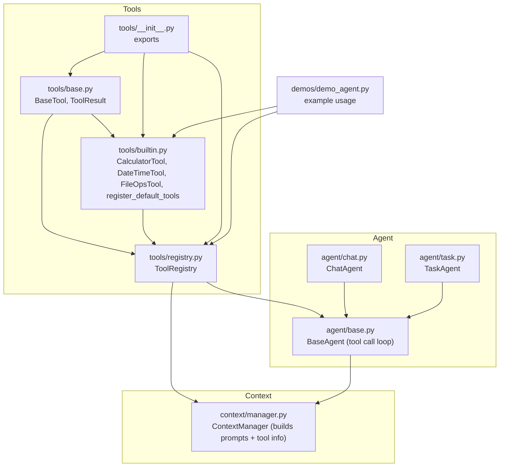
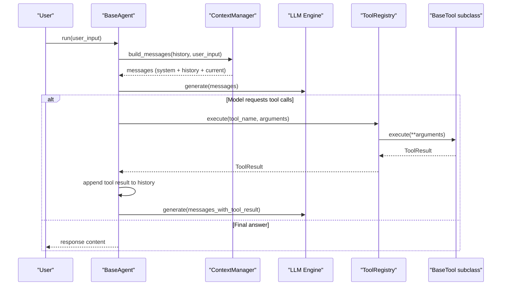
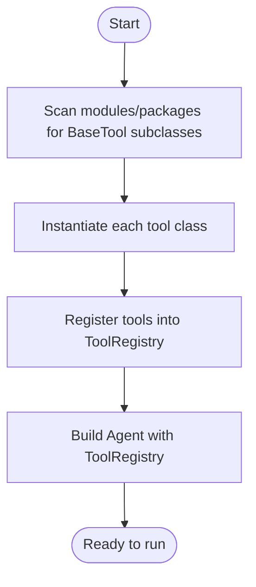
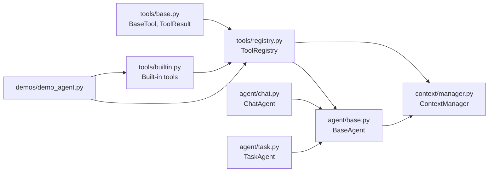

# ToolRegistry System

<cite>
**Referenced Files in This Document**
- [registry.py](file://harness/tools/registry.py)
- [base.py](file://harness/tools/base.py)
- [builtin.py](file://harness/tools/builtin.py)
- [__init__.py](file://harness/tools/__init__.py)
- [manager.py](file://harness/context/manager.py)
- [base.py](file://harness/agent/base.py)
- [chat.py](file://harness/agent/chat.py)
- [task.py](file://harness/agent/task.py)
- [demo_agent.py](file://demos/demo_agent.py)
</cite>

## Table of Contents
1. [Introduction](#introduction)
2. [Project Structure](#project-structure)
3. [Core Components](#core-components)
4. [Architecture Overview](#architecture-overview)
5. [Detailed Component Analysis](#detailed-component-analysis)
6. [Dependency Analysis](#dependency-analysis)
7. [Performance Considerations](#performance-considerations)
8. [Troubleshooting Guide](#troubleshooting-guide)
9. [Conclusion](#conclusion)
10. [Appendices](#appendices)

## Introduction
This document explains the ToolRegistry system that provides tool discovery, registration, schema generation, and execution management for agents in the HarnessAIDemo project. It covers how tools are registered, how schemas and descriptions are generated, how agents discover and execute tools, and how errors are handled. It also includes examples of programmatic registration, dynamic loading patterns, integration with the agent framework, lifecycle considerations, and best practices for organizing tools in large applications.

## Project Structure
The ToolRegistry lives under harness/tools and integrates with the agent loop via harness/agent and harness/context. Built-in tools demonstrate the BaseTool interface and a convenience function to register defaults.

**Diagram sources**
- [registry.py:17-74](file://harness/tools/registry.py#L17-L74)
- [base.py:16-67](file://harness/tools/base.py#L16-L67)
- [builtin.py:13-83](file://harness/tools/builtin.py#L13-L83)
- [manager.py:41-104](file://harness/context/manager.py#L41-L104)
- [base.py:63-165](file://harness/agent/base.py#L63-L165)
- [chat.py:25-60](file://harness/agent/chat.py#L25-L60)
- [task.py:32-73](file://harness/agent/task.py#L32-L73)
- [demo_agent.py:15-39](file://demos/demo_agent.py#L15-L39)

**Section sources**
- [registry.py:1-74](file://harness/tools/registry.py#L1-L74)
- [base.py:1-67](file://harness/tools/base.py#L1-L67)
- [builtin.py:1-83](file://harness/tools/builtin.py#L1-L83)
- [manager.py:1-118](file://harness/context/manager.py#L1-L118)
- [base.py:1-165](file://harness/agent/base.py#L1-L165)
- [chat.py:1-60](file://harness/agent/chat.py#L1-L60)
- [task.py:1-73](file://harness/agent/task.py#L1-L73)
- [demo_agent.py:1-40](file://demos/demo_agent.py#L1-L40)

## Core Components
- BaseTool and ToolResult define the contract for all tools and their outcomes.
- ToolRegistry is the central catalog for tool discovery, listing, description generation, and execution with error handling.
- Built-in tools implement BaseTool and provide a helper to register them into a registry.
- ContextManager injects tool descriptions into the system prompt so the LLM knows what tools are available.
- Agents orchestrate the loop: build context, call LLM, execute tool calls via ToolRegistry, and feed results back.

Key responsibilities:
- Registration: add or overwrite tools by name.
- Discovery: list tools and generate descriptions/schemas.
- Execution: run tools by name with arguments and return standardized results.
- Integration: expose tool availability to agents through context building.

**Section sources**
- [base.py:16-67](file://harness/tools/base.py#L16-L67)
- [registry.py:17-74](file://harness/tools/registry.py#L17-L74)
- [builtin.py:13-83](file://harness/tools/builtin.py#L13-L83)
- [manager.py:41-104](file://harness/context/manager.py#L41-L104)
- [base.py:63-165](file://harness/agent/base.py#L63-L165)

## Architecture Overview
The ToolRegistry sits at the center of tooling for agents. Agents construct messages with tool descriptions from the registry, then delegate tool execution back to the registry when the model requests tool calls.

**Diagram sources**
- [base.py:97-160](file://harness/agent/base.py#L97-L160)
- [manager.py:61-104](file://harness/context/manager.py#L61-L104)
- [registry.py:43-67](file://harness/tools/registry.py#L43-L67)
- [base.py:42-67](file://harness/tools/base.py#L42-L67)

## Detailed Component Analysis

### ToolRegistry API
- register(tool): Adds a tool to the registry; overwrites if same name exists and logs a warning.
- get(name): Retrieves a tool by name or returns None.
- list_tools(): Returns all registered tools.
- execute(name, arguments): Executes a tool by name with keyword arguments; returns ToolResult. Handles missing tools and exceptions.
- get_tools_description(): Generates a combined description string for the system prompt.
- __len__(), __contains__(): Support length checks and membership tests.

Error handling highlights:
- Missing tool: returns ToolResult(success=False, error listing available tools).
- Tool exception: catches and returns ToolResult(success=False, error=exception message).

Schema and description:
- Tools expose to_schema() and to_description() for structured and human-readable metadata used by the agent’s context builder.

**Section sources**
- [registry.py:17-74](file://harness/tools/registry.py#L17-L74)
- [base.py:47-67](file://harness/tools/base.py#L47-L67)

### BaseTool and ToolResult
- BaseTool defines the interface: name, description, parameters, execute(**kwargs), to_description(), to_schema().
- ToolResult standardizes execution outcomes with success, output, and optional error fields.

Best practice:
- Implement execute to always return ToolResult, even on failure, to keep agent flow consistent.

**Section sources**
- [base.py:16-67](file://harness/tools/base.py#L16-L67)

### Built-in Tools and Default Registration
- CalculatorTool: safe math expression evaluation with input validation.
- DateTimeTool: returns date/time based on query.
- FileOpsTool: read-only file operations (list directory, read file).
- register_default_tools(registry): convenience to register built-ins.

Usage example path:
- See demo setup where a registry is created and default tools are registered before constructing an agent.

**Section sources**
- [builtin.py:13-83](file://harness/tools/builtin.py#L13-L83)
- [demo_agent.py:21-24](file://demos/demo_agent.py#L21-L24)

### Agent Integration
- BaseAgent constructs a ContextManager with the provided ToolRegistry.
- ContextManager builds the system prompt including tool instructions and tool descriptions from the registry.
- When the LLM requests tool calls, BaseAgent delegates execution to ToolRegistry.execute and feeds results back into the conversation.

Lifecycle:
- On each iteration, the agent rebuilds context using the current registry state.
- The agent enforces max_iterations to prevent infinite loops.

**Section sources**
- [base.py:63-165](file://harness/agent/base.py#L63-L165)
- [manager.py:41-104](file://harness/context/manager.py#L41-L104)

### ChatAgent and TaskAgent
- ChatAgent: conversational agent with shorter iteration limits and convenience methods.
- TaskAgent: task-oriented agent with higher iteration limits and structured output wrapper.

Both inherit the tool integration behavior from BaseAgent.

**Section sources**
- [chat.py:25-60](file://harness/agent/chat.py#L25-L60)
- [task.py:32-73](file://harness/agent/task.py#L32-L73)

### Programmatic Registration Examples
- Create a ToolRegistry instance.
- Register built-in tools via register_default_tools or instantiate custom BaseTool subclasses and register them.
- Pass the registry to an agent constructor.

Reference paths:
- Registry creation and default registration: [demo_agent.py:21-24](file://demos/demo_agent.py#L21-L24)
- Built-in registration helper: [builtin.py:77-83](file://harness/tools/builtin.py#L77-L83)

### Dynamic Tool Loading Patterns
While not implemented in this codebase, you can extend the pattern by:
- Scanning modules or directories for classes that subclass BaseTool.
- Instantiating and registering discovered tools into the registry before creating agents.
- Using a configuration-driven approach to enable/disable tool sets per environment.

Conceptual flow:

[No sources needed since this diagram shows conceptual workflow, not actual code structure]

### Error Cases and Handling
- Unknown tool name: ToolRegistry.execute returns a ToolResult indicating failure and lists available tools.
- Tool execution exceptions: Caught and returned as ToolResult with error details.
- Agent loop continues after tool failures by feeding observation messages back to the LLM, enabling self-correction.

**Section sources**
- [registry.py:43-60](file://harness/tools/registry.py#L43-L60)
- [base.py:127-152](file://harness/agent/base.py#L127-L152)

## Dependency Analysis
The following diagram shows key dependencies between components involved in tooling and agent execution.

**Diagram sources**
- [base.py:16-67](file://harness/tools/base.py#L16-L67)
- [registry.py:17-74](file://harness/tools/registry.py#L17-L74)
- [builtin.py:13-83](file://harness/tools/builtin.py#L13-L83)
- [base.py:63-165](file://harness/agent/base.py#L63-L165)
- [manager.py:41-104](file://harness/context/manager.py#L41-L104)
- [chat.py:25-60](file://harness/agent/chat.py#L25-L60)
- [task.py:32-73](file://harness/agent/task.py#L32-L73)
- [demo_agent.py:21-24](file://demos/demo_agent.py#L21-L24)

**Section sources**
- [registry.py:17-74](file://harness/tools/registry.py#L17-L74)
- [base.py:63-165](file://harness/agent/base.py#L63-L165)
- [manager.py:41-104](file://harness/context/manager.py#L41-L104)

## Performance Considerations
- Tool description generation: get_tools_description iterates over all tools; avoid excessive tool counts in a single registry to keep prompt size manageable.
- Token budget: ContextManager estimates tokens roughly; consider pruning tool descriptions or splitting registries per domain to fit context windows.
- Execution overhead: Each tool.execute should be efficient; cache expensive computations inside tools when appropriate.
- Iteration limits: Agents enforce max_iterations to bound total tool calls; tune per use case to balance thoroughness and latency.

[No sources needed since this section provides general guidance]

## Troubleshooting Guide
Common issues and resolutions:
- Tool not found: Ensure the tool was registered before running the agent; check registry contents via list_tools or len(registry).
- Tool execution errors: Inspect ToolResult.error; validate arguments passed to execute; ensure tool handles edge cases gracefully.
- Prompt too long: Reduce number of tools or shorten descriptions; split into multiple registries and pass only relevant ones to specific agents.
- Infinite loops: Increase or decrease max_iterations depending on complexity; verify tool outputs help the LLM progress toward resolution.

Relevant implementation references:
- Registry error handling for missing tools and exceptions: [registry.py:43-60](file://harness/tools/registry.py#L43-L60)
- Agent loop and tool result feedback: [base.py:127-152](file://harness/agent/base.py#L127-L152)

**Section sources**
- [registry.py:43-60](file://harness/tools/registry.py#L43-L60)
- [base.py:127-152](file://harness/agent/base.py#L127-L152)

## Conclusion
The ToolRegistry provides a clean, centralized mechanism for managing tools across agents. It supports registration, discovery, schema/description generation, and robust execution with standardized results. Agents integrate seamlessly by injecting tool information into prompts and delegating execution to the registry. For large applications, organize tools by domain, use default registration helpers, and apply dynamic loading strategies to maintain clarity and performance.

[No sources needed since this section summarizes without analyzing specific files]

## Appendices

### API Quick Reference
- ToolRegistry.register(tool)
- ToolRegistry.get(name)
- ToolRegistry.list_tools()
- ToolRegistry.execute(name, arguments) -> ToolResult
- ToolRegistry.get_tools_description() -> str
- BaseTool.execute(**kwargs) -> ToolResult
- BaseTool.to_description() -> str
- BaseTool.to_schema() -> dict

**Section sources**
- [registry.py:28-67](file://harness/tools/registry.py#L28-L67)
- [base.py:42-67](file://harness/tools/base.py#L42-L67)

### Example Usage Paths
- Creating a registry and registering default tools: [demo_agent.py:21-24](file://demos/demo_agent.py#L21-L24)
- Built-in tool definitions and registration helper: [builtin.py:13-83](file://harness/tools/builtin.py#L13-L83)

**Section sources**
- [demo_agent.py:21-24](file://demos/demo_agent.py#L21-L24)
- [builtin.py:13-83](file://harness/tools/builtin.py#L13-L83)