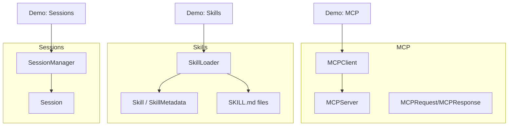
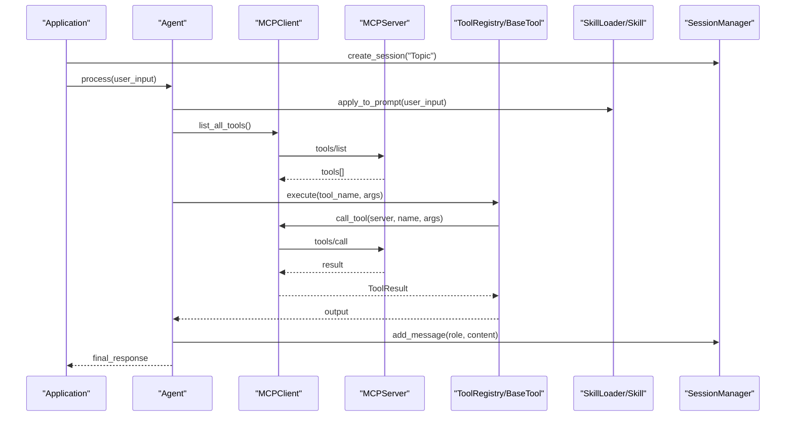
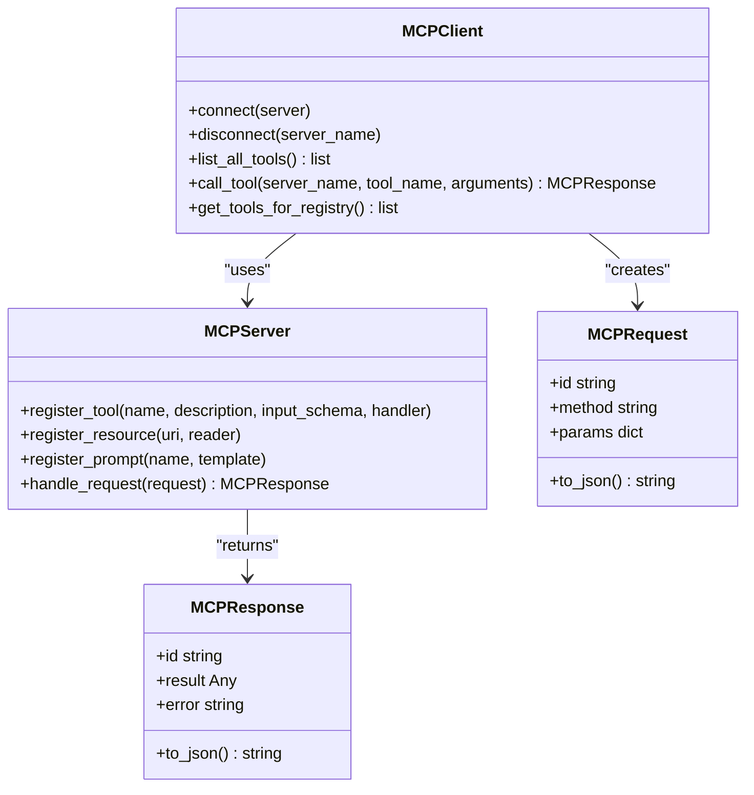
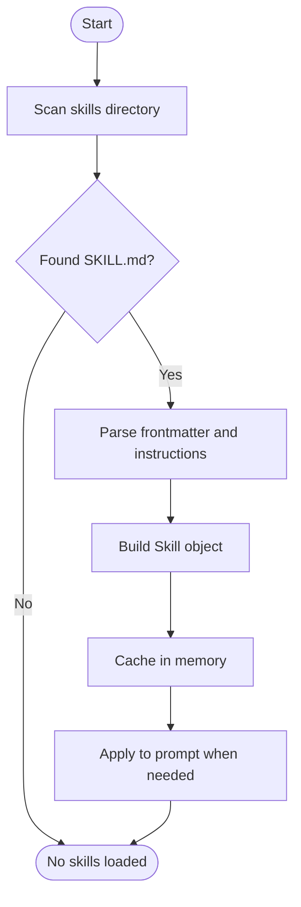
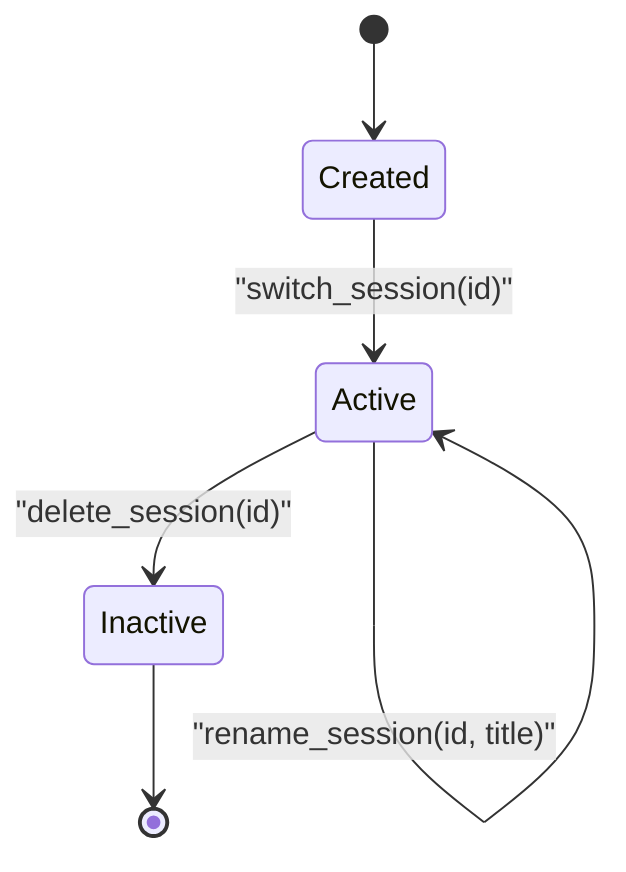
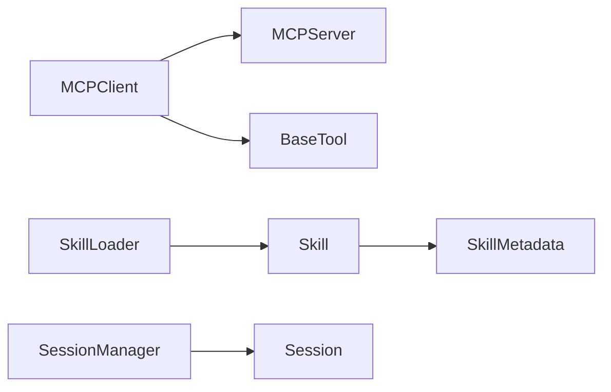

# Advanced Features

<cite>
**Referenced Files in This Document**
- [protocol.py](file://harness/mcp/protocol.py)
- [loader.py](file://harness/skill/loader.py)
- [base.py](file://harness/skill/base.py)
- [manager.py](file://harness/session/manager.py)
- [demo_mcp.py](file://demos/demo_mcp.py)
- [demo_skills.py](file://demos/demo_skills.py)
- [demo_session.py](file://demos/demo_session.py)
- [SKILL.md (summarizer)](file://demos/skills/summarizer/SKILL.md)
- [SKILL.md (translator)](file://demos/skills/translator/SKILL.md)
- [base.py (tools)](file://harness/tools/base.py)
- [README.md](file://README.md)
</cite>

## Table of Contents
1. Introduction
2. Project Structure
3. Core Components
4. Architecture Overview
5. Detailed Component Analysis
6. Dependency Analysis
7. Performance Considerations
8. Troubleshooting Guide
9. Conclusion
10. Appendices

## Introduction
This document explains the advanced features that enable standardized tool interoperability, reusable agent capabilities, and multi-session isolation:
- Model Context Protocol (MCP): a JSON-RPC 2.0-based protocol for discovering and invoking tools, reading resources, and retrieving prompt templates from MCP servers.
- Skills System: Markdown-defined, reusable capabilities that inject specialized instructions into prompts to guide agent behavior.
- Session Management: isolated conversation sessions with persistence, enabling concurrent conversations without context pollution.

These features are demonstrated via runnable demos and integrated into the harness framework.

## Project Structure
The advanced features span three modules and their demos:
- MCP: server/client implementation and demo
- Skills: loader and base definitions with example SKILL.md files
- Sessions: manager with persistence and demo

**Diagram sources**
- [protocol.py:68-210](file://harness/mcp/protocol.py#L68-L210)
- [loader.py:26-80](file://harness/skill/loader.py#L26-L80)
- [base.py:25-70](file://harness/skill/base.py#L25-L70)
- [manager.py:32-146](file://harness/session/manager.py#L32-L146)
- [demo_mcp.py:11-39](file://demos/demo_mcp.py#L11-L39)
- [demo_skills.py:11-34](file://demos/demo_skills.py#L11-L34)
- [demo_session.py:11-42](file://demos/demo_session.py#L11-L42)

**Section sources**
- [README.md:103-128](file://README.md#L103-L128)

## Core Components
- MCP Server exposes tools, resources, and prompts; Client discovers and invokes them using JSON-RPC 2.0 messages.
- Skill Loader parses SKILL.md files into structured skills and applies instructions to prompts.
- Session Manager creates, switches, lists, and persists independent conversation sessions.

Key responsibilities:
- MCP: standardize tool discovery and invocation across providers.
- Skills: modularize agent behavior via markdown instructions.
- Sessions: isolate state per conversation and persist it.

**Section sources**
- [protocol.py:1-22](file://harness/mcp/protocol.py#L1-L22)
- [loader.py:1-17](file://harness/skill/loader.py#L1-L17)
- [manager.py:1-23](file://harness/session/manager.py#L1-L23)

## Architecture Overview
The advanced features integrate at different layers:
- MCP sits between agents and external tool providers, abstracting tool calls behind a protocol.
- Skills layer injects domain-specific guidance into prompts before LLM calls.
- Sessions provide per-conversation isolation and persistence.

**Diagram sources**
- [protocol.py:162-210](file://harness/mcp/protocol.py#L162-L210)
- [base.py:55-65](file://harness/skill/base.py#L55-L65)
- [manager.py:81-127](file://harness/session/manager.py#L81-L127)
- [demo_mcp.py:20-36](file://demos/demo_mcp.py#L20-L36)

## Detailed Component Analysis

### Model Context Protocol (MCP)
Purpose:
- Standardizes how AI models interact with external tools and data sources through a JSON-RPC 2.0 interface.
- Supports tool discovery, invocation, resource reading, and prompt template retrieval.

Key elements:
- MCPServer: registers tools, resources, prompts; routes requests to handlers.
- MCPClient: connects to servers, lists tools, calls tools, and adapts MCP tools into harness BaseTool instances.
- MCPRequest/MCPResponse: JSON-RPC message envelopes.

Protocol methods implemented:
- tools/list: returns available tools with schemas.
- tools/call: executes a named tool with arguments.
- resources/read: reads a resource by URI.
- prompts/get: retrieves a prompt template by name.

Integration pattern:
- MCP tools can be converted to harness BaseTool objects for unified execution within the agent loop.

**Diagram sources**
- [protocol.py:31-66](file://harness/mcp/protocol.py#L31-L66)
- [protocol.py:68-139](file://harness/mcp/protocol.py#L68-L139)
- [protocol.py:141-210](file://harness/mcp/protocol.py#L141-L210)

Practical examples:
- Discover and call tools via client and server in demo.
- Use raw JSON-RPC request/response for low-level control.

**Section sources**
- [protocol.py:100-139](file://harness/mcp/protocol.py#L100-L139)
- [protocol.py:162-210](file://harness/mcp/protocol.py#L162-L210)
- [demo_mcp.py:16-36](file://demos/demo_mcp.py#L16-L36)

### Skills System
Purpose:
- Define reusable agent capabilities as Markdown files with metadata and instructions.
- Load and apply skill instructions to user prompts to shape agent behavior.

Components:
- SkillMetadata: name, description, tags, version.
- Skill: holds metadata and instructions; applies instructions to prompts.
- SkillLoader: discovers SKILL.md files, parses frontmatter, loads skills.

Skill file format:
- YAML-like frontmatter block with name, description, tags, version.
- Markdown body containing detailed instructions and rules.

**Diagram sources**
- [loader.py:33-76](file://harness/skill/loader.py#L33-L76)
- [base.py:25-70](file://harness/skill/base.py#L25-L70)

Practical examples:
- Discover and load all skills; apply skill instructions to user input.
- Example skills: summarizer and translator demonstrate instruction formats.

**Section sources**
- [loader.py:81-122](file://harness/skill/loader.py#L81-L122)
- [base.py:55-65](file://harness/skill/base.py#L55-L65)
- [demo_skills.py:16-31](file://demos/demo_skills.py#L16-L31)
- [SKILL.md (summarizer):1-29](file://demos/skills/summarizer/SKILL.md#L1-L29)
- [SKILL.md (translator):1-30](file://demos/skills/translator/SKILL.md#L1-L30)

### Session Management
Purpose:
- Provide isolated conversation sessions with independent histories and metadata.
- Persist sessions to disk and support switching between active sessions.

Core concepts:
- Session: unique id, title, creation time, message history, metadata.
- SessionManager: create, switch, list, delete sessions; persistent storage via JSON files.

Lifecycle:
- Create session -> Add messages -> Switch sessions -> List sessions -> Delete session.
- Persistence on create/rename; auto-load on initialization.

**Diagram sources**
- [manager.py:32-127](file://harness/session/manager.py#L32-L127)

Practical examples:
- Create multiple sessions, add messages, switch active session, list all sessions.

**Section sources**
- [manager.py:81-127](file://harness/session/manager.py#L81-L127)
- [demo_session.py:16-39](file://demos/demo_session.py#L16-L39)

## Dependency Analysis
Inter-component relationships:
- MCPClient depends on MCPServer and uses JSON-RPC messages to communicate.
- MCP tools can be adapted to harness BaseTool for unified execution.
- SkillLoader depends on Skill and SkillMetadata; applies instructions to prompts.
- SessionManager manages Session instances and persists to JSON files.

**Diagram sources**
- [protocol.py:185-210](file://harness/mcp/protocol.py#L185-L210)
- [base.py:30-67](file://harness/tools/base.py#L30-L67)
- [loader.py:26-80](file://harness/skill/loader.py#L26-L80)
- [manager.py:71-146](file://harness/session/manager.py#L71-L146)

**Section sources**
- [protocol.py:185-210](file://harness/mcp/protocol.py#L185-L210)
- [base.py:30-67](file://harness/tools/base.py#L30-L67)
- [loader.py:26-80](file://harness/skill/loader.py#L26-L80)
- [manager.py:71-146](file://harness/session/manager.py#L71-L146)

## Performance Considerations
- MCP tool discovery and invocation:
  - Listing tools involves iterating connected servers and sending requests; batch or cache tool lists to reduce overhead.
  - Tool calls are synchronous per server; consider concurrency if integrating multiple remote servers.
- Skills application:
  - Parsing SKILL.md is lightweight; caching parsed skills avoids repeated IO.
  - Applying instructions adds text to prompts; monitor token usage to avoid exceeding context limits.
- Session management:
  - Each session stores messages in memory; limit history length to control memory usage.
  - Persistence writes JSON on changes; consider batching updates for high-frequency operations.

[No sources needed since this section provides general guidance]

## Troubleshooting Guide
Common issues and resolutions:
- MCP tool not found:
  - Ensure the tool is registered on the server and the correct server name is used when calling.
  - Check error responses from MCPResponse for details.
- Resource or prompt not found:
  - Verify URIs and names match those registered on the server.
- Skill loading errors:
  - Confirm SKILL.md exists under the expected directory structure and contains valid frontmatter.
  - Review logs for parsing failures and ensure tags are properly formatted.
- Session not found:
  - Validate session IDs when switching or deleting sessions.
  - Check storage directory permissions and integrity of JSON files.

**Section sources**
- [protocol.py:112-139](file://harness/mcp/protocol.py#L112-L139)
- [loader.py:45-71](file://harness/skill/loader.py#L45-L71)
- [manager.py:91-115](file://harness/session/manager.py#L91-L115)

## Conclusion
The advanced features provide a robust foundation for building scalable AI applications:
- MCP standardizes tool interoperability, enabling modular tool ecosystems.
- Skills system allows flexible, maintainable agent behaviors defined in Markdown.
- Session management ensures isolation and persistence for concurrent conversations.

Together, these components support secure, performant, and extensible agent architectures.

[No sources needed since this section summarizes without analyzing specific files]

## Appendices

### MCP Protocol Specification Summary
- Transport: JSON-RPC 2.0 messages with id, method, params.
- Methods:
  - tools/list: returns array of tool descriptors with name, description, inputSchema.
  - tools/call: invokes tool by name with arguments; returns content or error.
  - resources/read: reads resource by URI; returns content or error.
  - prompts/get: retrieves prompt template by name; returns template or error.

**Section sources**
- [protocol.py:41-66](file://harness/mcp/protocol.py#L41-L66)
- [protocol.py:100-139](file://harness/mcp/protocol.py#L100-L139)

### Skill File Format Reference
- Frontmatter fields:
  - name: string
  - description: string
  - tags: list of strings
  - version: string
- Body: Markdown instructions detailing behavior, rules, and output format.

**Section sources**
- [loader.py:81-122](file://harness/skill/loader.py#L81-L122)
- [SKILL.md (summarizer):1-29](file://demos/skills/summarizer/SKILL.md#L1-L29)
- [SKILL.md (translator):1-30](file://demos/skills/translator/SKILL.md#L1-L30)

### Session Lifecycle Reference
- Create: generates unique id, initializes empty history, persists to JSON.
- Switch: sets active session; validates existence.
- List: returns sorted sessions by creation time.
- Delete: removes in-memory session and corresponding JSON file.

**Section sources**
- [manager.py:81-127](file://harness/session/manager.py#L81-L127)