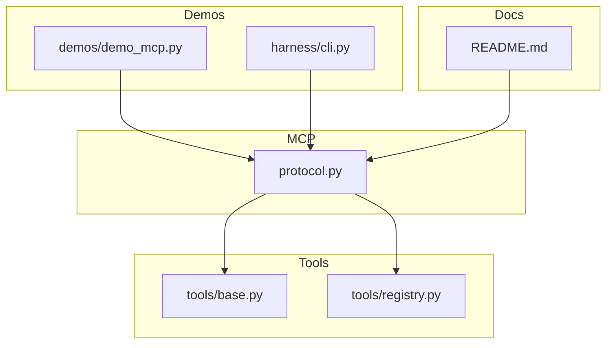
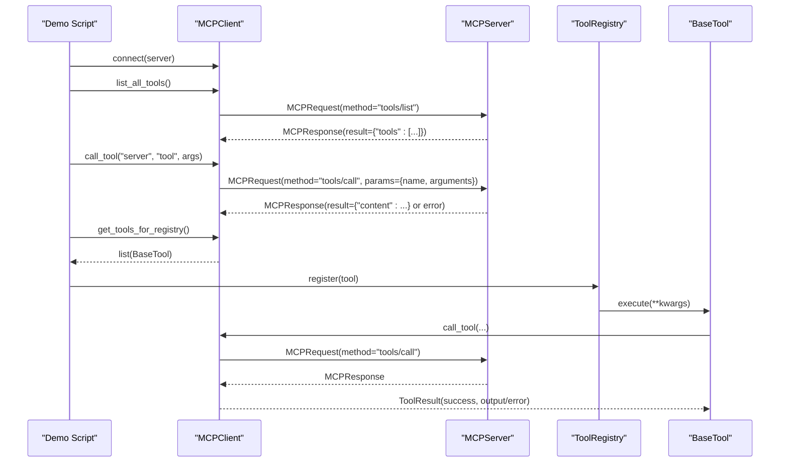
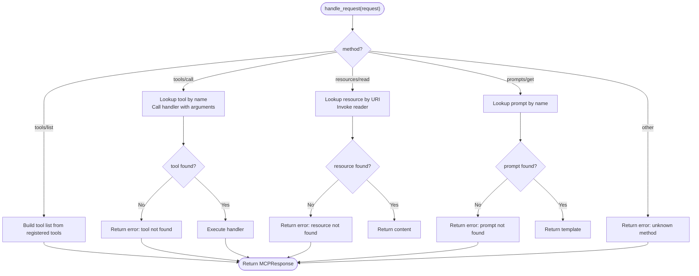
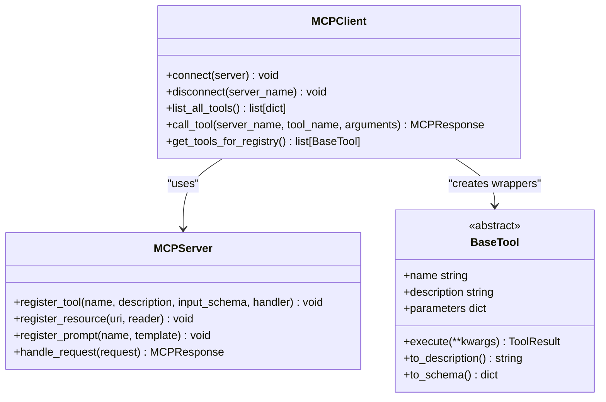
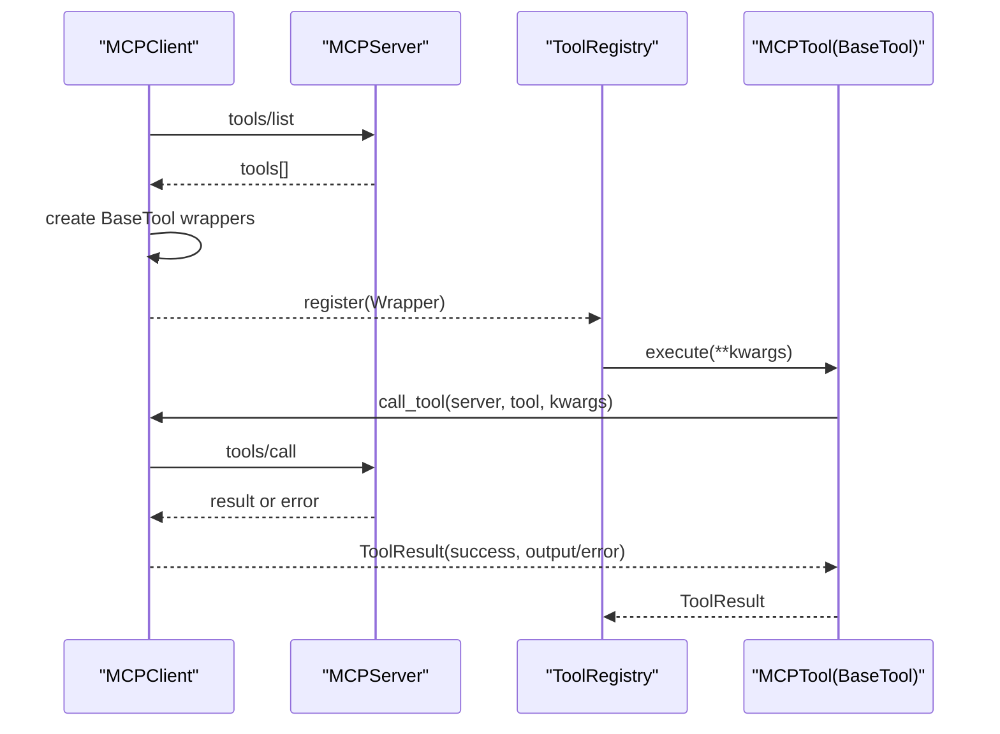
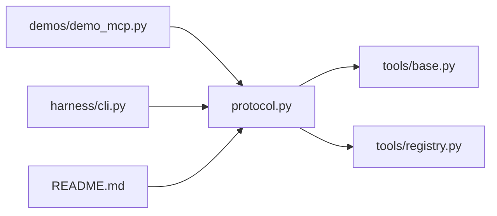

# MCP Protocol

<cite>
**Referenced Files in This Document**
- [protocol.py](file://harness/mcp/protocol.py)
- [registry.py](file://harness/tools/registry.py)
- [base.py](file://harness/tools/base.py)
- [demo_mcp.py](file://demos/demo_mcp.py)
- [cli.py](file://harness/cli.py)
- [README.md](file://README.md)
</cite>

## Table of Contents
1. [Introduction](#introduction)
2. [Project Structure](#project-structure)
3. [Core Components](#core-components)
4. [Architecture Overview](#architecture-overview)
5. [Detailed Component Analysis](#detailed-component-analysis)
6. [Dependency Analysis](#dependency-analysis)
7. [Performance Considerations](#performance-considerations)
8. [Troubleshooting Guide](#troubleshooting-guide)
9. [Conclusion](#conclusion)
10. [Appendices](#appendices)

## Introduction
This document explains the Model Context Protocol (MCP) implementation in this project, focusing on standardized tool interoperability via JSON-RPC 2.0. It covers client-server communication patterns, tool discovery mechanisms, and how MCP tools integrate into the harness ToolRegistry. It also documents the MCPServer class for exposing tools, resources, and prompts, and the MCPClient class for connecting to external tool providers. Practical examples are provided through demo scripts and CLI integration. Security considerations and performance implications of cross-process communication are discussed to guide productionization.

## Project Structure
The MCP implementation is centered in the harness/mcp module, with supporting tool system components in harness/tools. A demo script demonstrates usage, and the CLI exposes an MCP demo entry point.

**Diagram sources**
- [protocol.py:1-251](file://harness/mcp/protocol.py#L1-L251)
- [base.py:1-67](file://harness/tools/base.py#L1-L67)
- [registry.py:1-74](file://harness/tools/registry.py#L1-L74)
- [demo_mcp.py:1-40](file://demos/demo_mcp.py#L1-L40)
- [cli.py:179-211](file://harness/cli.py#L179-L211)
- [README.md:214-235](file://README.md#L214-L235)

**Section sources**
- [README.md:73-131](file://README.md#L73-L131)
- [README.md:214-235](file://README.md#L214-L235)

## Core Components
- JSON-RPC 2.0 message types: request and response structures that carry method names and parameters or results/errors.
- MCPServer: registers tools, resources, and prompts; routes incoming requests to handlers.
- MCPClient: connects to servers, discovers tools, calls tools, and adapts MCP tools to harness BaseTool instances for ToolRegistry integration.
- ToolRegistry: central catalog used by the agent to list, look up, and execute tools.
- BaseTool and ToolResult: abstraction and result type for all tools, including MCP-wrapped tools.

Key responsibilities:
- MCPServer handles methods: tools/list, tools/call, resources/read, prompts/get.
- MCPClient aggregates multiple servers, enumerates tools, and forwards calls.
- get_tools_for_registry dynamically creates BaseTool subclasses that delegate execution to MCP servers.

**Section sources**
- [protocol.py:31-66](file://harness/mcp/protocol.py#L31-L66)
- [protocol.py:68-139](file://harness/mcp/protocol.py#L68-L139)
- [protocol.py:141-210](file://harness/mcp/protocol.py#L141-L210)
- [registry.py:17-74](file://harness/tools/registry.py#L17-L74)
- [base.py:16-67](file://harness/tools/base.py#L16-L67)

## Architecture Overview
The MCP architecture follows a client-server model using JSON-RPC 2.0 messages. The client discovers available tools across one or more servers and invokes them by name. Tools can be wrapped as harness BaseTool instances so they participate in the existing tool registry and agent loop.

**Diagram sources**
- [protocol.py:100-139](file://harness/mcp/protocol.py#L100-L139)
- [protocol.py:162-210](file://harness/mcp/protocol.py#L162-L210)
- [registry.py:43-67](file://harness/tools/registry.py#L43-L67)
- [base.py:30-67](file://harness/tools/base.py#L30-L67)

## Detailed Component Analysis

### JSON-RPC 2.0 Message Types
- Request: carries id, method, and params. Serializes to JSON-RPC 2.0 format.
- Response: carries id, either result or error with message. Serializes to JSON-RPC 2.0 format.

These types enable consistent serialization and routing between clients and servers.

**Section sources**
- [protocol.py:40-66](file://harness/mcp/protocol.py#L40-L66)

### MCPServer: Exposing Tools, Resources, Prompts
- Registration APIs:
  - register_tool(name, description, input_schema, handler)
  - register_resource(uri, reader)
  - register_prompt(name, template)
- Request routing:
  - tools/list returns discovered tools with schemas
  - tools/call executes a named tool with arguments
  - resources/read reads a resource by URI
  - prompts/get retrieves a prompt template by name
- Error handling:
  - Unknown methods return errors
  - Missing tools/resources/prompts return descriptive errors
  - Exceptions during handler execution are caught and returned as errors

**Diagram sources**
- [protocol.py:100-139](file://harness/mcp/protocol.py#L100-L139)

**Section sources**
- [protocol.py:68-139](file://harness/mcp/protocol.py#L68-L139)

### MCPClient: Connecting and Invoking Servers
- Connect/disconnect to servers by name
- Discover tools across all connected servers via tools/list
- Invoke tools via tools/call with server and tool name
- Adapt MCP tools to harness BaseTool instances for ToolRegistry integration

**Diagram sources**
- [protocol.py:141-210](file://harness/mcp/protocol.py#L141-L210)
- [protocol.py:68-139](file://harness/mcp/protocol.py#L68-L139)
- [base.py:30-67](file://harness/tools/base.py#L30-L67)

**Section sources**
- [protocol.py:141-210](file://harness/mcp/protocol.py#L141-L210)

### Integration with ToolRegistry
- get_tools_for_registry converts discovered MCP tools into BaseTool instances
- Each wrapper stores references to the client, server name, and tool name
- execute delegates to MCPClient.call_tool and maps responses to ToolResult
- ToolRegistry.register accepts these wrappers, enabling unified tool execution

**Diagram sources**
- [protocol.py:185-210](file://harness/mcp/protocol.py#L185-L210)
- [registry.py:28-67](file://harness/tools/registry.py#L28-L67)
- [base.py:30-67](file://harness/tools/base.py#L30-L67)

**Section sources**
- [protocol.py:185-210](file://harness/mcp/protocol.py#L185-L210)
- [registry.py:28-67](file://harness/tools/registry.py#L28-L67)
- [base.py:30-67](file://harness/tools/base.py#L30-L67)

### Practical Examples
- Demo script shows creating a server, connecting a client, discovering tools, calling tools, and printing JSON-RPC messages.
- CLI provides a runnable MCP demo that exercises the same flow.

Usage highlights:
- Create a demo server with sample tools and resources
- Connect client and discover tools
- Call tools with arguments and print results
- Show raw JSON-RPC request/response payloads

**Section sources**
- [demo_mcp.py:11-39](file://demos/demo_mcp.py#L11-L39)
- [cli.py:179-211](file://harness/cli.py#L179-L211)

## Dependency Analysis
- protocol.py depends on Python standard library (json, logging, uuid) and dataclasses
- protocol.py imports BaseTool and ToolResult when adapting MCP tools for ToolRegistry
- demo_mcp.py imports from protocol to demonstrate usage
- cli.py imports protocol components to run the MCP demo
- README documents MCP concepts and methods

**Diagram sources**
- [protocol.py:185-210](file://harness/mcp/protocol.py#L185-L210)
- [demo_mcp.py:9-39](file://demos/demo_mcp.py#L9-L39)
- [cli.py:179-211](file://harness/cli.py#L179-L211)
- [README.md:214-235](file://README.md#L214-L235)

**Section sources**
- [protocol.py:185-210](file://harness/mcp/protocol.py#L185-L210)
- [demo_mcp.py:9-39](file://demos/demo_mcp.py#L9-L39)
- [cli.py:179-211](file://harness/cli.py#L179-L211)
- [README.md:214-235](file://README.md#L214-L235)

## Performance Considerations
- In-process vs. cross-process: The current implementation is in-process for simplicity. Production deployments should run MCP servers as separate processes communicating over stdio or HTTP using JSON-RPC 2.0, introducing network latency and serialization overhead.
- Discovery cost: list_all_tools performs a tools/list per connected server. Cache discovered tool metadata to avoid repeated discovery.
- Call overhead: Each tool call involves request construction, serialization, transport, deserialization, and handler invocation. Batch operations or connection pooling may reduce overhead where applicable.
- Error propagation: Errors are serialized in responses; ensure efficient error handling on both client and server sides to minimize retries.
- Resource access: Reading resources incurs I/O costs; consider caching or streaming large resources.

[No sources needed since this section provides general guidance]

## Troubleshooting Guide
Common issues and strategies:
- Unknown method: Ensure the requested method matches supported methods (tools/list, tools/call, resources/read, prompts/get).
- Tool not found: Verify tool registration and correct tool name. Check server tool list before calling.
- Resource not found: Confirm resource URI exists and is correctly registered.
- Prompt not found: Ensure prompt name matches exactly.
- Execution exceptions: Handlers may raise exceptions; these are caught and returned as errors in responses. Inspect error messages for diagnostics.
- Client-server mismatch: Ensure the client targets the correct server name when calling tools.

Operational tips:
- Log at debug/info levels for registration and connection events.
- Validate input schemas on the client side before sending requests.
- Use unique request IDs to correlate requests and responses.

**Section sources**
- [protocol.py:100-139](file://harness/mcp/protocol.py#L100-L139)
- [protocol.py:174-183](file://harness/mcp/protocol.py#L174-L183)

## Conclusion
The MCP implementation provides a clear, standardized way to expose tools, resources, and prompts via JSON-RPC 2.0. MCPServer centralizes routing and error handling, while MCPClient enables discovery and invocation across multiple servers. Integration with the harness ToolRegistry allows seamless use of MCP tools within the agent loop. For production, adopt process isolation, robust transport layers, and performance optimizations such as caching and batching.

[No sources needed since this section summarizes without analyzing specific files]

## Appendices

### Protocol Specifications Summary
- Methods:
  - tools/list: Returns available tools with names, descriptions, and input schemas
  - tools/call: Executes a named tool with arguments; returns content or error
  - resources/read: Reads a resource by URI; returns content or error
  - prompts/get: Retrieves a prompt template by name; returns template or error
- Messages:
  - Requests include jsonrpc version, id, method, params
  - Responses include jsonrpc version, id, and either result or error object

**Section sources**
- [protocol.py:40-66](file://harness/mcp/protocol.py#L40-L66)
- [protocol.py:100-139](file://harness/mcp/protocol.py#L100-L139)
- [README.md:225-235](file://README.md#L225-L235)

### Security Considerations
- Input validation: Validate arguments against input schemas before invoking handlers.
- Access control: Restrict which tools/resources/prompts are exposed per server or per client.
- Isolation: Run MCP servers in isolated processes to limit blast radius.
- Transport security: Use secure channels (e.g., TLS) for HTTP-based transports.
- Error exposure: Avoid leaking sensitive information in error messages.

[No sources needed since this section provides general guidance]