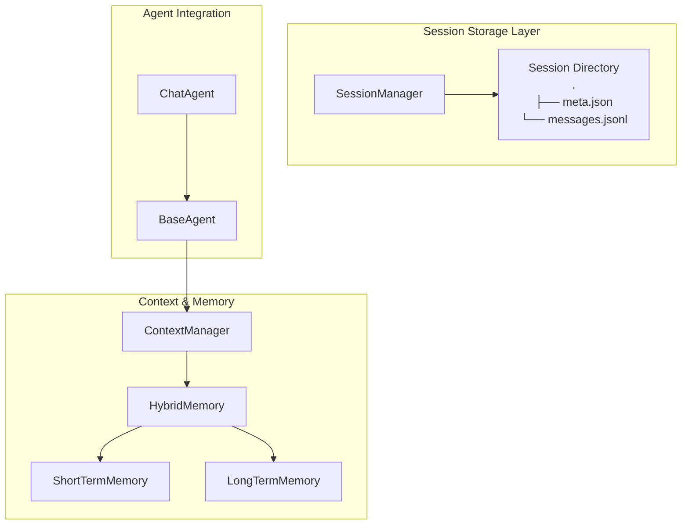
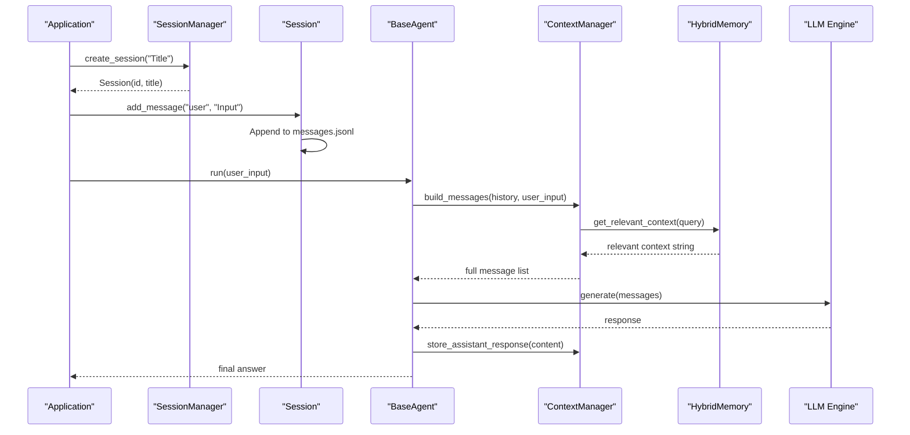
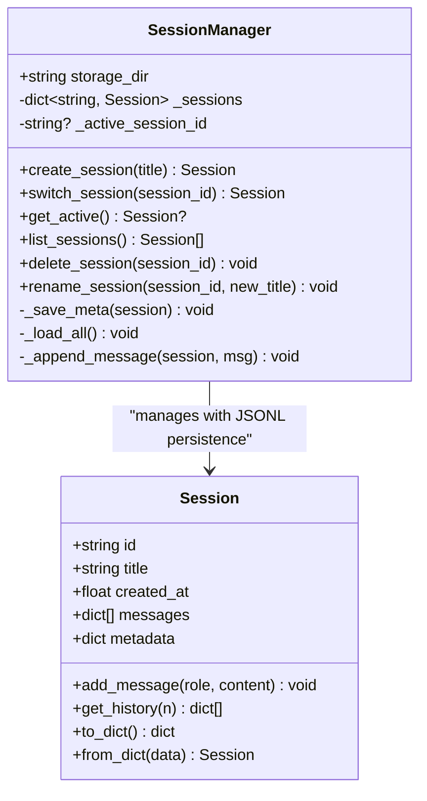
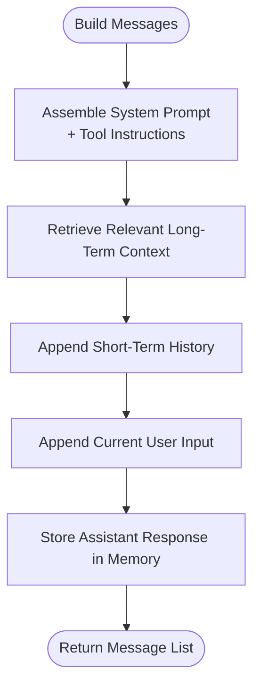
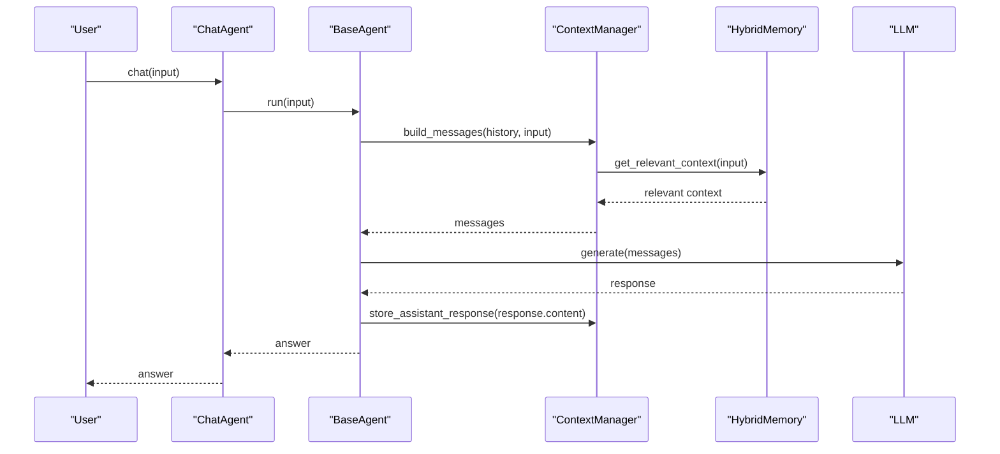
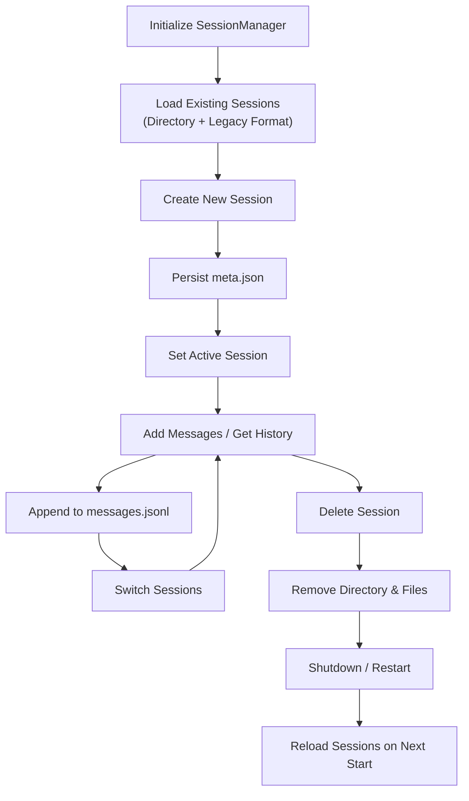
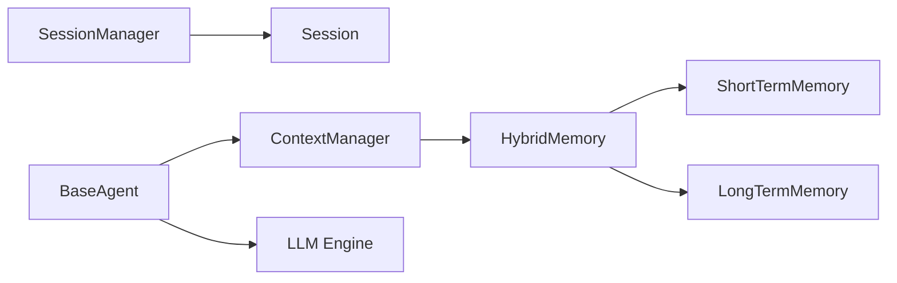

# Session Management

<cite>
**Referenced Files in This Document**
- [manager.py](file://harness/session/manager.py)
- [demo_session.py](file://demos/demo_session.py)
- [manager.py](file://harness/context/manager.py)
- [base.py](file://harness/memory/base.py)
- [hybrid.py](file://harness/memory/hybrid.py)
- [short_term.py](file://harness/memory/short_term.py)
- [long_term.py](file://harness/memory/long_term.py)
- [base.py](file://harness/agent/base.py)
- [chat.py](file://harness/agent/chat.py)
- [config.py](file://harness/config.py)
- [README.md](file://README.md)
</cite>

## Update Summary
**Changes Made**
- Updated session architecture to support multi-conversation isolation with directory-based storage
- Enhanced persistence system with append-only JSONL format for optimal performance
- Added backward compatibility for legacy single-file session formats
- Improved CRUD operations with better error handling and session lifecycle management
- Updated examples and diagrams to reflect new storage structure and capabilities

## Table of Contents
1. [Introduction](#introduction)
2. [Project Structure](#project-structure)
3. [Core Components](#core-components)
4. [Architecture Overview](#architecture-overview)
5. [Detailed Component Analysis](#detailed-component-analysis)
6. [Dependency Analysis](#dependency-analysis)
7. [Performance Considerations](#performance-considerations)
8. [Troubleshooting Guide](#troubleshooting-guide)
9. [Conclusion](#conclusion)
10. [Appendices](#appendices)

## Introduction
This document explains the enhanced session management system designed for multi-conversation support with independent state isolation. The system now uses a sophisticated directory-based storage approach where each conversation maintains its own isolated environment with append-only JSONL persistence for optimal performance. It covers the complete lifecycle of sessions, advanced state persistence mechanisms, and concurrent conversation handling across multiple independent contexts. The SessionManager class provides comprehensive CRUD operations for creating, managing, and persisting sessions, including configuration options and robust storage backends. Practical examples demonstrate starting new conversations, maintaining context across turns, and implementing seamless session recovery after application restarts. Security considerations, memory optimization strategies, and scaling approaches for high-concurrency scenarios are thoroughly addressed.

## Project Structure
The session management system has been completely redesigned around a directory-based architecture where each session is stored as an isolated unit with dedicated metadata and message history files. The new structure supports concurrent multi-conversation workflows while maintaining complete state isolation between different sessions.

**Diagram sources**
- [manager.py:80-96](file://harness/session/manager.py#L80-L96)
- [manager.py:164-174](file://harness/session/manager.py#L164-L174)
- [manager.py:41-108](file://harness/context/manager.py#L41-L108)
- [hybrid.py:22-84](file://harness/memory/hybrid.py#L22-L84)
- [short_term.py:16-50](file://harness/memory/short_term.py#L16-L50)
- [long_term.py:24-109](file://harness/memory/long_term.py#L24-L109)
- [base.py:63-96](file://harness/agent/base.py#L63-L96)
- [chat.py:25-59](file://harness/agent/chat.py#L25-L59)

**Section sources**
- [README.md:73-131](file://README.md#L73-L131)

## Core Components
- **Session**: Represents an isolated conversation with its own history, metadata, timestamps, and persistent storage. Supports append-only message logging and efficient history retrieval.
- **SessionManager**: Manages multiple independent sessions with directory-based storage, providing comprehensive CRUD operations (create, switch, list, delete, rename) and automatic session recovery.
- **ContextManager**: Assembles prompts from system instructions, tool descriptions, relevant long-term memory, short-term history, and current input with intelligent context filtering.
- **Memory System**: HybridMemory composes ShortTermMemory (bounded buffer) and LongTermMemory (persistent TF-IDF retrieval) with duplicate filtering and relevance scoring.
- **Agent Integration**: BaseAgent and ChatAgent use ContextManager and Memory to run multi-turn conversations with full session isolation at the application level.

Key responsibilities:
- **Isolation**: Each session maintains completely independent message history and metadata in separate directories.
- **Persistence**: Sessions use append-only JSONL format for O(1) writes with metadata stored in compact JSON files.
- **Concurrency**: In-memory session registry with active session pointer; safe for single-process usage with thread-safe file operations.
- **Recovery**: Automatic loading of all existing sessions from directory structure on startup with backward compatibility for legacy formats.

**Section sources**
- [manager.py:37-77](file://harness/session/manager.py#L37-L77)
- [manager.py:80-157](file://harness/session/manager.py#L80-L157)
- [manager.py:41-108](file://harness/context/manager.py#L41-L108)
- [hybrid.py:22-84](file://harness/memory/hybrid.py#L22-L84)
- [short_term.py:16-50](file://harness/memory/short_term.py#L16-L50)
- [long_term.py:24-109](file://harness/memory/long_term.py#L24-L109)
- [base.py:63-96](file://harness/agent/base.py#L63-L96)
- [chat.py:25-59](file://harness/agent/chat.py#L25-L59)

## Architecture Overview
The enhanced architecture separates concerns with improved scalability:
- **Session layer**: Provides complete isolation for multiple conversations with directory-based persistence and append-only message logging.
- **Context layer**: Builds intelligent prompts combining system instructions, tools, memory retrieval, and conversation history with token-aware filtering.
- **Memory layer**: Offers hybrid short-term and long-term storage with sophisticated retrieval strategies and duplicate content filtering.
- **Agent layer**: Orchestrates interactions using the layered architecture with full session isolation and context management.

**Diagram sources**
- [manager.py:100-109](file://harness/session/manager.py#L100-L109)
- [manager.py:47-56](file://harness/session/manager.py#L47-L56)
- [base.py:97-160](file://harness/agent/base.py#L97-L160)
- [manager.py:61-108](file://harness/context/manager.py#L61-L108)
- [hybrid.py:46-73](file://harness/memory/hybrid.py#L46-L73)

## Detailed Component Analysis

### Session and SessionManager with Enhanced Persistence
- **Session**:
  - Holds id, title, created_at timestamp, messages list, and metadata with append-only JSONL persistence.
  - Adds messages with role, content, timestamp, and automatically persists to JSONL file via callback mechanism.
  - Provides recent history retrieval with configurable window size and serialization helpers for metadata only.
- **SessionManager**:
  - Initializes storage directory structure and loads existing sessions from both new directory format and legacy single-file format.
  - Creates sessions with unique IDs, sets active session, and immediately persists metadata to disk.
  - Switches active session safely with validation; raises descriptive errors if session not found.
  - Lists sessions sorted by creation time; deletes sessions and their entire directory structure.
  - Renames sessions and updates metadata files atomically.
  - Implements robust session recovery with error handling and logging for corrupted or incomplete data.

**Diagram sources**
- [manager.py:37-77](file://harness/session/manager.py#L37-L77)
- [manager.py:80-157](file://harness/session/manager.py#L80-L157)

**Section sources**
- [manager.py:37-77](file://harness/session/manager.py#L37-L77)
- [manager.py:80-157](file://harness/session/manager.py#L80-L157)

### Context Assembly and Memory Retrieval with Multi-Session Support
- **ContextManager.build_messages**:
  - Prepends system prompt and optional tool instructions with dynamic tool discovery.
  - Retrieves relevant long-term context via HybridMemory with intelligent filtering.
  - Appends short-term history and current user input with token-aware truncation.
  - Stores assistant responses back into memory for future retrieval with role-based categorization.
- **HybridMemory.get_relevant_context**:
  - Combines recent short-term messages with top-K relevant long-term memories.
  - Filters duplicates between recent and relevant sets to avoid redundancy.
  - Formats context with clear section headers for better LLM comprehension.

**Diagram sources**
- [manager.py:61-108](file://harness/context/manager.py#L61-L108)
- [hybrid.py:46-73](file://harness/memory/hybrid.py#L46-L73)

**Section sources**
- [manager.py:41-108](file://harness/context/manager.py#L41-L108)
- [hybrid.py:22-84](file://harness/memory/hybrid.py#L22-L84)

### Agent Loop and Multi-Turn Conversations with Session Isolation
- **BaseAgent.run**:
  - Builds context via ContextManager with full session isolation.
  - Calls LLM and handles tool calls iteratively until a final answer is reached.
  - Maintains conversation history within session boundaries and stores assistant responses in memory.
  - Provides detailed execution tracing for debugging and monitoring.
- **ChatAgent.chat**:
  - Convenience wrapper around run for interactive chat with session-aware context management.

**Diagram sources**
- [chat.py:46-59](file://harness/agent/chat.py#L46-L59)
- [base.py:97-160](file://harness/agent/base.py#L97-L160)
- [manager.py:61-108](file://harness/context/manager.py#L61-L108)
- [hybrid.py:46-73](file://harness/memory/hybrid.py#L46-L73)

**Section sources**
- [chat.py:25-59](file://harness/agent/chat.py#L25-L59)
- [base.py:63-160](file://harness/agent/base.py#L63-L160)

### Enhanced Session Lifecycle and Append-Only Persistence
- **Creation**:
  - New session gets a unique ID, initial empty history, and immediate metadata persistence to disk.
  - Directory structure is created automatically with proper permissions.
- **Activation**:
  - Active session pointer ensures which session receives messages when accessed via manager methods.
  - Session switching is validated and atomic to prevent race conditions.
- **Message Persistence**:
  - Messages are appended to JSONL files with O(1) write operations for optimal performance.
  - Each message includes timestamp, role, and content with UTF-8 encoding support.
- **Switching**:
  - Validate existence before switching; update active pointer with error handling.
- **Deletion**:
  - Remove from in-memory map and delete entire session directory including both meta.json and messages.jsonl.
  - Reset active pointer if deleted session was active.
- **Recovery**:
  - On startup, load all directory-based sessions and legacy single-file sessions with comprehensive error handling.
  - Replay JSONL message logs to reconstruct complete session state in memory.

**Diagram sources**
- [manager.py:91-96](file://harness/session/manager.py#L91-L96)
- [manager.py:100-109](file://harness/session/manager.py#L100-L109)
- [manager.py:176-186](file://harness/session/manager.py#L176-L186)
- [manager.py:188-227](file://harness/session/manager.py#L188-L227)

**Section sources**
- [manager.py:80-157](file://harness/session/manager.py#L80-L157)
- [manager.py:160-227](file://harness/session/manager.py#L160-L227)

### Practical Examples with Multi-Session Support
- **Starting a new conversation**:
  - Create sessions via SessionManager with descriptive titles and add messages to maintain context.
  - Each session operates independently with complete state isolation.
- **Maintaining context across turns**:
  - Use the agent's run method within the active session; ContextManager and HybridMemory ensure relevant past context is included.
  - Session switching preserves conversation state while allowing topic separation.
- **Recovering after restart**:
  - SessionManager automatically loads existing sessions from directory structure on initialization.
  - Both new directory format and legacy single-file formats are supported for seamless migration.

Reference paths:
- Creating sessions and adding messages: [demo_session.py:16-39](file://demos/demo_session.py#L16-L39)
- Building context and storing responses: [manager.py:61-108](file://harness/context/manager.py#L61-L108), [hybrid.py:46-73](file://harness/memory/hybrid.py#L46-L73)
- Loading sessions on startup: [manager.py:188-227](file://harness/session/manager.py#L188-L227)

**Section sources**
- [demo_session.py:11-42](file://demos/demo_session.py#L11-L42)
- [manager.py:61-108](file://harness/context/manager.py#L61-L108)
- [hybrid.py:46-73](file://harness/memory/hybrid.py#L46-L73)
- [manager.py:188-227](file://harness/session/manager.py#L188-L227)

## Dependency Analysis
- **SessionManager depends on**:
  - Python standard library for filesystem operations, JSON I/O, UUID generation, and logging.
  - Session dataclass for structured data representation and serialization.
- **ContextManager depends on**:
  - BaseMemory implementations (HybridMemory, ShortTermMemory, LongTermMemory).
  - ToolRegistry for dynamic tool instruction injection and execution.
- **Agents depend on**:
  - ContextManager and Memory to assemble prompts and manage conversation history.
  - LLM engine for text generation with tool call support.

**Diagram sources**
- [manager.py:80-157](file://harness/session/manager.py#L80-L157)
- [manager.py:37-77](file://harness/session/manager.py#L37-L77)
- [manager.py:41-108](file://harness/context/manager.py#L41-L108)
- [hybrid.py:22-84](file://harness/memory/hybrid.py#L22-L84)
- [short_term.py:16-50](file://harness/memory/short_term.py#L16-L50)
- [long_term.py:24-109](file://harness/memory/long_term.py#L24-L109)
- [base.py:63-96](file://harness/agent/base.py#L63-L96)

**Section sources**
- [manager.py:80-157](file://harness/session/manager.py#L80-L157)
- [manager.py:41-108](file://harness/context/manager.py#L41-L108)
- [hybrid.py:22-84](file://harness/memory/hybrid.py#L22-L84)
- [short_term.py:16-50](file://harness/memory/short_term.py#L16-L50)
- [long_term.py:24-109](file://harness/memory/long_term.py#L24-L109)
- [base.py:63-96](file://harness/agent/base.py#L63-L96)

## Performance Considerations
- **Memory Optimization**:
  - ShortTermMemory uses a bounded deque to enforce FIFO eviction, preventing unbounded growth.
  - HybridMemory filters duplicate content between recent and relevant contexts to reduce prompt size.
  - ContextManager estimates token counts to help manage context window constraints efficiently.
- **Storage Efficiency**:
  - SessionManager uses append-only JSONL format for O(1) write operations with minimal overhead.
  - Metadata is stored in compact JSON files with indentation for readability.
  - LongTermMemory persists only user and assistant messages to avoid noise and optimize storage.
- **Concurrency**:
  - The current design is single-process; in-memory dict and active session pointer are not thread-safe. For high concurrency, consider:
    - Adding locks around session access and persistence operations.
    - Using a database-backed session store for robustness under concurrent writes.
    - Implementing background flushers to batch writes and reduce I/O overhead.
    - Using async I/O for file operations to prevent blocking during high-throughput scenarios.

## Troubleshooting Guide
- **Session not found when switching**:
  - Ensure the session ID exists; otherwise, a descriptive ValueError is raised with the missing session ID.
- **Failed to load session on startup**:
  - Errors during loading are logged with specific details; check logs for malformed JSON or permission issues.
  - Legacy format conversion failures are handled gracefully without affecting other sessions.
- **Memory not persisting**:
  - Verify storage paths exist and are writable; JSONL append operations log errors on failure.
  - Check disk space and file permissions for the session directories.
- **Context too large**:
  - Adjust max_context_tokens in ContextManager or tune HybridMemory parameters (n_recent, n_relevant).
  - Consider increasing short-term capacity or adjusting similarity thresholds for better relevance.
- **Directory corruption**:
  - Missing meta.json files cause sessions to be skipped during loading.
  - Corrupted JSONL files result in partial session reconstruction with error logging.

**Section sources**
- [manager.py:111-116](file://harness/session/manager.py#L111-L116)
- [manager.py:188-227](file://harness/session/manager.py#L188-L227)
- [long_term.py:77-105](file://harness/memory/long_term.py#L77-L105)
- [manager.py:49-59](file://harness/context/manager.py#L49-L59)

## Conclusion
The enhanced session management system provides robust isolation for multiple conversations with sophisticated append-only persistence and comprehensive recovery capabilities. The directory-based architecture with JSONL message logging offers optimal performance for high-throughput scenarios while maintaining complete state isolation between sessions. Combined with intelligent context assembly and hybrid memory systems, it supports complex multi-turn dialogues that retain relevant knowledge across sessions and topics. For production deployments, the system is ready for scaling with additional concurrency safeguards, database-backed storage backends, and advanced retrieval mechanisms to handle enterprise-level high-concurrency scenarios efficiently.

## Appendices

### Configuration Options
- **LLMConfig**: Backend selection, model name, token limits, temperature control, device specification.
- **MemoryConfig**: Short-term capacity, long-term persistence toggle, storage file path, similarity threshold tuning.
- **HarnessConfig**: Aggregates LLM, memory, and agent configurations with sensible defaults and environment variable support.

**Section sources**
- [config.py:8-34](file://harness/config.py#L8-L34)
- [config.py:37-44](file://harness/config.py#L37-L44)
- [config.py:55-70](file://harness/config.py#L55-L70)

### Security Considerations
- **Input Validation**:
  - Validate session IDs and titles to prevent injection attacks or path traversal attempts.
  - Sanitize user inputs before storage to prevent malicious content persistence.
- **Filesystem Permissions**:
  - Restrict write access to session storage directories with appropriate OS-level permissions.
  - Implement proper file ownership and access controls for multi-user environments.
- **Tool Safety**:
  - Ensure tool execution is sandboxed and audited; validate arguments before execution.
  - Implement rate limiting and resource quotas for tool usage per session.
- **Logging Sensitivity**:
  - Avoid logging sensitive content in session messages or memory items.
  - Implement log rotation and retention policies for compliance requirements.

### Scaling Considerations
- **Storage Backend Migration**:
  - Replace JSON file storage with databases (SQLite, PostgreSQL, MongoDB) for concurrent writes and complex queries.
  - Implement sharding strategies for large-scale session management across multiple nodes.
- **Caching Layers**:
  - Introduce Redis or in-memory caching for frequently accessed sessions and memory items.
  - Implement read replicas for session metadata to reduce database load.
- **Asynchronous Operations**:
  - Use async I/O for persistence operations to reduce blocking during high-throughput scenarios.
  - Implement background workers for session cleanup and maintenance tasks.
- **Partitioning Strategies**:
  - Partition sessions by user, tenant, or application namespace to limit scope and improve performance.
  - Implement session lifecycle policies with automatic cleanup of inactive sessions.
- **Monitoring and Metrics**:
  - Track session creation rates, message throughput, and storage utilization metrics.
  - Implement health checks and alerting for storage capacity and performance degradation.