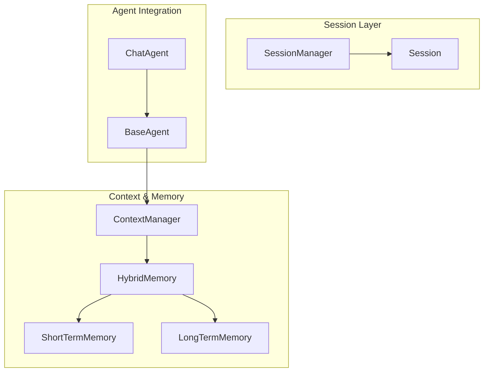
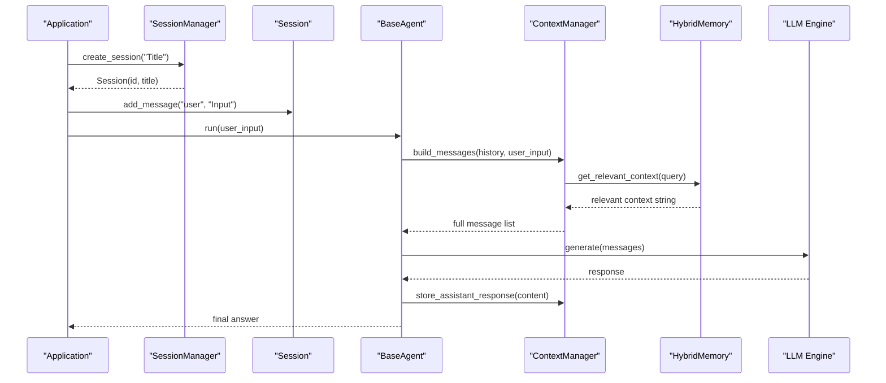
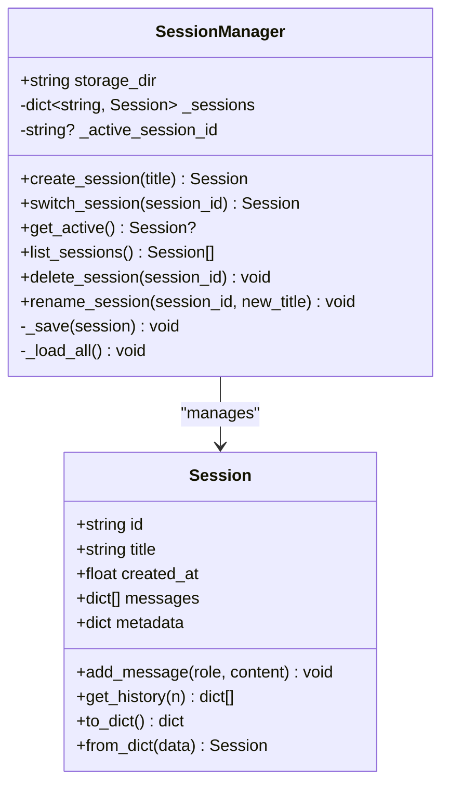
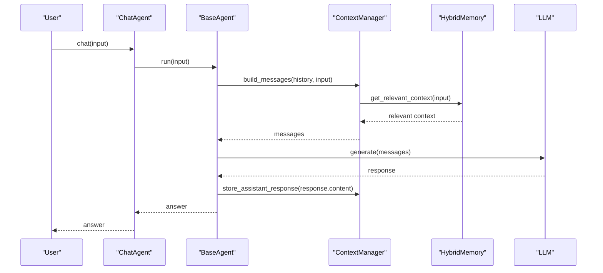
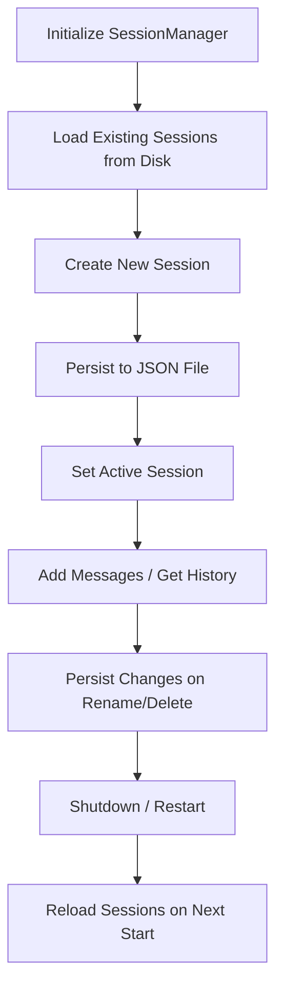
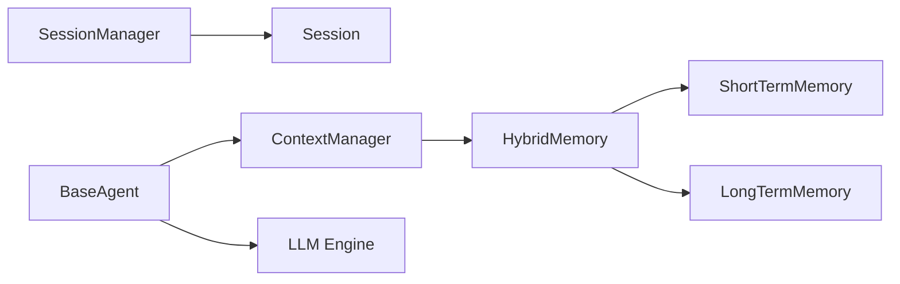

# Session Management

<cite>
**Referenced Files in This Document**
- [manager.py](file://harness/session/manager.py)
- [demo_session.py](file://demos/demo_session.py)
- [manager.py](file://harness/context/manager.py)
- [base.py](file://harness/memory/base.py)
- [hybrid.py](file://harness/memory/hybrid.py)
- [short_term.py](file://harness/memory/short_term.py)
- [long_term.py](file://harness/memory/long_term.py)
- [base.py](file://harness/agent/base.py)
- [chat.py](file://harness/agent/chat.py)
- [config.py](file://harness/config.py)
- [README.md](file://README.md)
</cite>

## Table of Contents
1. [Introduction](#introduction)
2. [Project Structure](#project-structure)
3. [Core Components](#core-components)
4. [Architecture Overview](#architecture-overview)
5. [Detailed Component Analysis](#detailed-component-analysis)
6. [Dependency Analysis](#dependency-analysis)
7. [Performance Considerations](#performance-considerations)
8. [Troubleshooting Guide](#troubleshooting-guide)
9. [Conclusion](#conclusion)
10. [Appendices](#appendices)

## Introduction
This document explains session management for multi-conversation support with independent state isolation. It covers the lifecycle of sessions, how state is persisted, and how multiple conversations are handled concurrently. It focuses on the SessionManager class for creating, managing, and persisting sessions, including configuration options and storage backends. Practical examples show how to start new conversations, maintain context across turns, and recover sessions after restarts. Security, memory optimization, and scaling considerations for high concurrency are also addressed.

## Project Structure
The session management system is centered around a lightweight manager that persists each conversation as an isolated JSON file. Context assembly and memory retrieval are provided by separate components that can be attached to agents or used directly.

**Diagram sources**
- [manager.py:71-146](file://harness/session/manager.py#L71-L146)
- [manager.py:32-68](file://harness/session/manager.py#L32-L68)
- [manager.py:41-108](file://harness/context/manager.py#L41-L108)
- [hybrid.py:22-84](file://harness/memory/hybrid.py#L22-L84)
- [short_term.py:16-50](file://harness/memory/short_term.py#L16-L50)
- [long_term.py:24-109](file://harness/memory/long_term.py#L24-L109)
- [base.py:63-96](file://harness/agent/base.py#L63-L96)
- [chat.py:25-59](file://harness/agent/chat.py#L25-L59)

**Section sources**
- [README.md:73-131](file://README.md#L73-L131)

## Core Components
- Session: Represents a single conversation with its own history, metadata, and timestamps. Supports adding messages, retrieving recent history, and serialization/deserialization.
- SessionManager: Manages multiple sessions, tracks the active session, persists sessions to disk, and provides CRUD operations (create, switch, list, delete, rename).
- ContextManager: Assembles prompts from system instructions, tool descriptions, relevant long-term memory, short-term history, and current input.
- Memory System: HybridMemory composes ShortTermMemory (bounded buffer) and LongTermMemory (persistent TF-IDF retrieval). BaseMemory defines the interface.
- Agent Integration: BaseAgent and ChatAgent use ContextManager and Memory to run multi-turn conversations; sessions provide isolation at the application level.

Key responsibilities:
- Isolation: Each session has independent message history and metadata.
- Persistence: Sessions are saved as JSON files per session ID.
- Concurrency: In-memory dict of sessions with a single active session pointer; safe for single-process usage.
- Recovery: On initialization, all existing session files are loaded into memory.

**Section sources**
- [manager.py:32-68](file://harness/session/manager.py#L32-L68)
- [manager.py:71-146](file://harness/session/manager.py#L71-L146)
- [manager.py:41-108](file://harness/context/manager.py#L41-L108)
- [hybrid.py:22-84](file://harness/memory/hybrid.py#L22-L84)
- [short_term.py:16-50](file://harness/memory/short_term.py#L16-L50)
- [long_term.py:24-109](file://harness/memory/long_term.py#L24-L109)
- [base.py:63-96](file://harness/agent/base.py#L63-L96)
- [chat.py:25-59](file://harness/agent/chat.py#L25-L59)

## Architecture Overview
The architecture separates concerns:
- Session layer isolates conversations and persists them.
- Context layer builds prompts combining system, tools, memory, and history.
- Memory layer provides short-term and long-term storage with retrieval strategies.
- Agent layer orchestrates interactions using the above layers.

**Diagram sources**
- [manager.py:81-89](file://harness/session/manager.py#L81-L89)
- [manager.py:41-49](file://harness/session/manager.py#L41-L49)
- [base.py:97-160](file://harness/agent/base.py#L97-L160)
- [manager.py:61-108](file://harness/context/manager.py#L61-L108)
- [hybrid.py:46-73](file://harness/memory/hybrid.py#L46-L73)

## Detailed Component Analysis

### Session and SessionManager
- Session:
  - Holds id, title, created_at timestamp, messages list, and metadata.
  - Adds messages with role, content, and timestamp.
  - Provides recent history retrieval and serialization helpers.
- SessionManager:
  - Initializes storage directory and loads existing sessions from JSON files.
  - Creates sessions with unique IDs, sets active session, and persists immediately.
  - Switches active session safely; raises error if not found.
  - Lists sessions sorted by creation time; deletes sessions and their files.
  - Renames sessions and persists changes.
  - Loads all sessions on startup for recovery.

**Diagram sources**
- [manager.py:32-68](file://harness/session/manager.py#L32-L68)
- [manager.py:71-146](file://harness/session/manager.py#L71-L146)

**Section sources**
- [manager.py:32-68](file://harness/session/manager.py#L32-L68)
- [manager.py:71-146](file://harness/session/manager.py#L71-L146)

### Context Assembly and Memory Retrieval
- ContextManager.build_messages:
  - Prepends system prompt and optional tool instructions.
  - Retrieves relevant long-term context via HybridMemory.
  - Appends short-term history and current user input.
  - Stores assistant responses back into memory for future retrieval.
- HybridMemory.get_relevant_context:
  - Combines recent short-term messages with top-K relevant long-term memories.
  - Filters duplicates between recent and relevant sets.

**Diagram sources**
- [manager.py:61-108](file://harness/context/manager.py#L61-L108)
- [hybrid.py:46-73](file://harness/memory/hybrid.py#L46-L73)

**Section sources**
- [manager.py:41-108](file://harness/context/manager.py#L41-L108)
- [hybrid.py:22-84](file://harness/memory/hybrid.py#L22-L84)

### Agent Loop and Multi-Turn Conversations
- BaseAgent.run:
  - Builds context via ContextManager.
  - Calls LLM and handles tool calls iteratively until a final answer.
  - Maintains conversation history and stores assistant responses in memory.
- ChatAgent.chat:
  - Convenience wrapper around run for interactive chat.

**Diagram sources**
- [chat.py:46-59](file://harness/agent/chat.py#L46-L59)
- [base.py:97-160](file://harness/agent/base.py#L97-L160)
- [manager.py:61-108](file://harness/context/manager.py#L61-L108)
- [hybrid.py:46-73](file://harness/memory/hybrid.py#L46-L73)

**Section sources**
- [chat.py:25-59](file://harness/agent/chat.py#L25-L59)
- [base.py:63-160](file://harness/agent/base.py#L63-L160)

### Session Lifecycle and Persistence
- Creation:
  - New session gets a unique ID, initial empty history, and is persisted immediately.
- Activation:
  - Active session pointer ensures which session receives messages when accessed via manager methods.
- Switching:
  - Validate existence before switching; update active pointer.
- Deletion:
  - Remove from in-memory map and delete corresponding JSON file; reset active pointer if needed.
- Recovery:
  - On startup, load all JSON files into memory; errors during load are logged without halting.

**Diagram sources**
- [manager.py:74-79](file://harness/session/manager.py#L74-L79)
- [manager.py:81-89](file://harness/session/manager.py#L81-L89)
- [manager.py:108-127](file://harness/session/manager.py#L108-L127)
- [manager.py:129-143](file://harness/session/manager.py#L129-L143)

**Section sources**
- [manager.py:71-146](file://harness/session/manager.py#L71-L146)

### Practical Examples
- Starting a new conversation:
  - Create a session via SessionManager and add messages to it. See demo usage for reference.
- Maintaining context across turns:
  - Use the agent’s run method within the active session; ContextManager and HybridMemory ensure relevant past context is included.
- Recovering after restart:
  - SessionManager automatically loads existing sessions from the storage directory on initialization.

Reference paths:
- Creating sessions and adding messages: [demo_session.py:16-39](file://demos/demo_session.py#L16-L39)
- Building context and storing responses: [manager.py:61-108](file://harness/context/manager.py#L61-L108), [hybrid.py:46-73](file://harness/memory/hybrid.py#L46-L73)
- Loading sessions on startup: [manager.py:129-143](file://harness/session/manager.py#L129-L143)

**Section sources**
- [demo_session.py:11-42](file://demos/demo_session.py#L11-L42)
- [manager.py:61-108](file://harness/context/manager.py#L61-L108)
- [hybrid.py:46-73](file://harness/memory/hybrid.py#L46-L73)
- [manager.py:129-143](file://harness/session/manager.py#L129-L143)

## Dependency Analysis
- SessionManager depends on:
  - Python standard library for filesystem and JSON I/O.
  - Session dataclass for structure and serialization.
- ContextManager depends on:
  - BaseMemory implementations (HybridMemory, ShortTermMemory, LongTermMemory).
  - ToolRegistry for dynamic tool instruction injection.
- Agents depend on:
  - ContextManager and Memory to assemble prompts and manage history.
  - LLM engine for generation.

**Diagram sources**
- [manager.py:71-146](file://harness/session/manager.py#L71-L146)
- [manager.py:32-68](file://harness/session/manager.py#L32-L68)
- [manager.py:41-108](file://harness/context/manager.py#L41-L108)
- [hybrid.py:22-84](file://harness/memory/hybrid.py#L22-L84)
- [short_term.py:16-50](file://harness/memory/short_term.py#L16-L50)
- [long_term.py:24-109](file://harness/memory/long_term.py#L24-L109)
- [base.py:63-96](file://harness/agent/base.py#L63-L96)

**Section sources**
- [manager.py:71-146](file://harness/session/manager.py#L71-L146)
- [manager.py:41-108](file://harness/context/manager.py#L41-L108)
- [hybrid.py:22-84](file://harness/memory/hybrid.py#L22-L84)
- [short_term.py:16-50](file://harness/memory/short_term.py#L16-L50)
- [long_term.py:24-109](file://harness/memory/long_term.py#L24-L109)
- [base.py:63-96](file://harness/agent/base.py#L63-L96)

## Performance Considerations
- Memory Optimization:
  - ShortTermMemory uses a bounded deque to enforce FIFO eviction, preventing unbounded growth.
  - HybridMemory filters duplicate content between recent and relevant contexts to reduce prompt size.
  - ContextManager estimates token counts to help manage context window constraints.
- Storage Efficiency:
  - SessionManager persists only necessary fields; JSON format is compact and human-readable.
  - LongTermMemory persists only user and assistant messages to avoid noise.
- Concurrency:
  - The current design is single-process; in-memory dict and active session pointer are not thread-safe. For high concurrency, consider:
    - Adding locks around session access and persistence.
    - Using a database-backed session store for robustness under concurrent writes.
    - Implementing background flushers to batch writes and reduce I/O overhead.

[No sources needed since this section provides general guidance]

## Troubleshooting Guide
- Session not found when switching:
  - Ensure the session ID exists; otherwise, a validation error is raised.
- Failed to load session on startup:
  - Errors during loading are logged; check logs for malformed JSON or permission issues.
- Memory not persisting:
  - Verify storage paths exist and are writable; LongTermMemory logs errors on save/load failures.
- Context too large:
  - Adjust max_context_tokens in ContextManager or tune HybridMemory parameters (n_recent, n_relevant).

**Section sources**
- [manager.py:91-96](file://harness/session/manager.py#L91-L96)
- [manager.py:129-143](file://harness/session/manager.py#L129-L143)
- [long_term.py:77-105](file://harness/memory/long_term.py#L77-L105)
- [manager.py:49-59](file://harness/context/manager.py#L49-L59)

## Conclusion
The session management system provides clear isolation for multiple conversations with persistent state and straightforward recovery. Combined with context assembly and hybrid memory, it supports multi-turn dialogues that retain relevant knowledge across turns and sessions. For production deployments, consider adding concurrency safeguards, scalable storage backends, and advanced retrieval mechanisms to handle high-concurrency scenarios efficiently.

[No sources needed since this section summarizes without analyzing specific files]

## Appendices

### Configuration Options
- LLMConfig: Backend, model name, token limits, temperature, device.
- MemoryConfig: Short-term capacity, long-term persistence toggle, storage file path, similarity threshold.
- HarnessConfig: Aggregates LLM, memory, and agent configurations; default factory creates sensible defaults.

**Section sources**
- [config.py:8-34](file://harness/config.py#L8-L34)
- [config.py:37-44](file://harness/config.py#L37-L44)
- [config.py:55-70](file://harness/config.py#L55-L70)

### Security Considerations
- Input Validation:
  - Validate session IDs and titles to prevent injection or path traversal.
- Filesystem Permissions:
  - Restrict write access to session storage directories.
- Tool Safety:
  - Ensure tool execution is sandboxed and audited; validate arguments before execution.
- Logging Sensitivity:
  - Avoid logging sensitive content in session messages or memory items.

[No sources needed since this section provides general guidance]

### Scaling Considerations
- Replace JSON file storage with a database (e.g., SQLite, PostgreSQL) for concurrent writes and queries.
- Introduce caching layers for frequently accessed sessions and memory items.
- Use asynchronous I/O for persistence to reduce blocking.
- Partition sessions by user or tenant to limit scope and improve performance.

[No sources needed since this section provides general guidance]