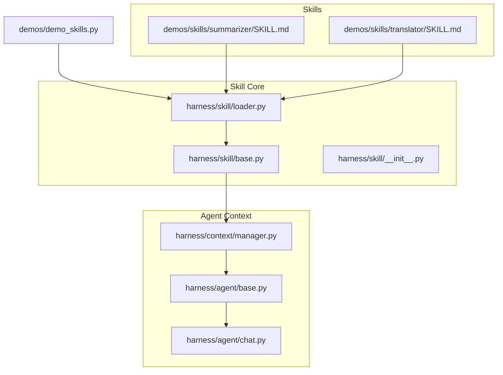
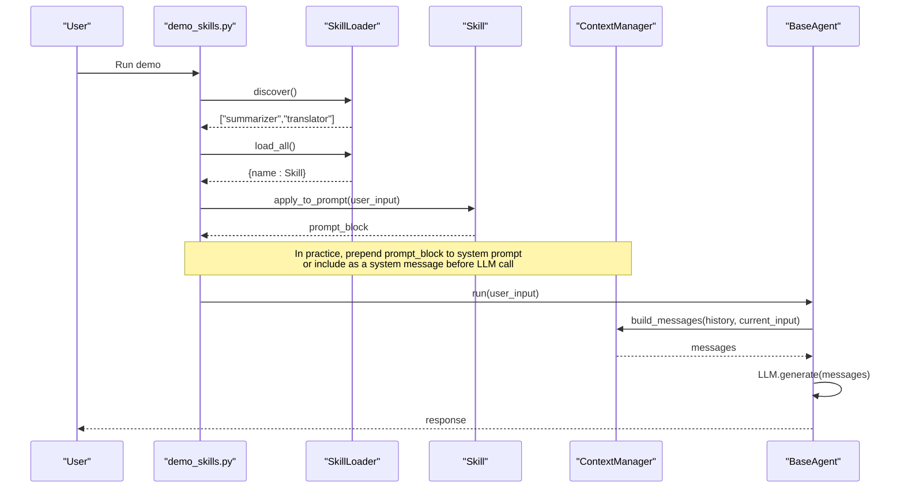
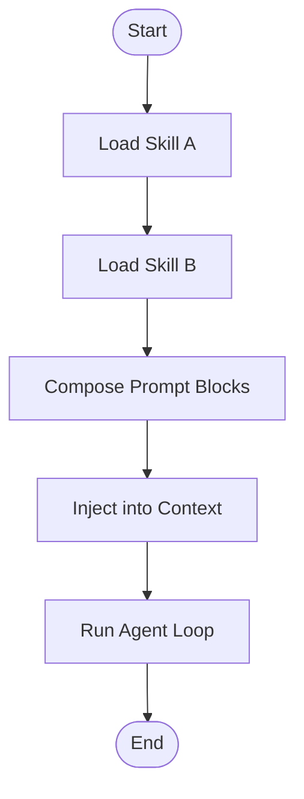
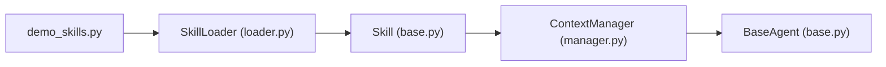

# Skills System

<cite>
**Referenced Files in This Document**
- [base.py](file://harness/skill/base.py)
- [loader.py](file://harness/skill/loader.py)
- [__init__.py](file://harness/skill/__init__.py)
- [SKILL.md (summarizer)](file://demos/skills/summarizer/SKILL.md)
- [SKILL.md (translator)](file://demos/skills/translator/SKILL.md)
- [demo_skills.py](file://demos/demo_skills.py)
- [manager.py](file://harness/context/manager.py)
- [base.py](file://harness/agent/base.py)
- [chat.py](file://harness/agent/chat.py)
- [README.md](file://README.md)
</cite>

## Table of Contents
1. [Introduction](#introduction)
2. [Project Structure](#project-structure)
3. [Core Components](#core-components)
4. [Architecture Overview](#architecture-overview)
5. [Detailed Component Analysis](#detailed-component-analysis)
6. [Dependency Analysis](#dependency-analysis)
7. [Performance Considerations](#performance-considerations)
8. [Troubleshooting Guide](#troubleshooting-guide)
9. [Conclusion](#conclusion)
10. [Appendices](#appendices)

## Introduction
This document explains the Skills System for creating Markdown-based, reusable agent capabilities. It covers:
- The SKILL.md file format specification and parsing
- Skill discovery and loading mechanisms
- Prompt injection techniques via skills
- The Skill abstract interface and SkillLoader for automatic registration
- Integration with the agent context system
- Practical examples for building custom skills (summarization, translation), defining parameters, and composing multiple skills
- Guidance on skill versioning, dependency management, and best practices for development and distribution

The goal is to enable developers to author, discover, load, and apply skills that shape how an agent behaves for specific tasks by injecting structured instructions into prompts.

## Project Structure
The Skills System lives under harness/skill and is demonstrated via demos/skills. Example skills are provided as Markdown files with YAML frontmatter describing metadata and instructions.

**Diagram sources**
- [loader.py:26-79](file://harness/skill/loader.py#L26-L79)
- [base.py:25-69](file://harness/skill/base.py#L25-L69)
- [manager.py:41-104](file://harness/context/manager.py#L41-L104)
- [base.py:63-165](file://harness/agent/base.py#L63-L165)
- [chat.py:25-60](file://harness/agent/chat.py#L25-L60)

**Section sources**
- [README.md:106-128](file://README.md#L106-L128)

## Core Components
- SkillMetadata: Holds name, description, tags, and version extracted from a SKILL.md file.
- Skill: Encapsulates loaded metadata and instructions; provides prompt composition via apply_to_prompt and a human-readable description.
- SkillLoader: Discovers SKILL.md files under a directory, parses frontmatter and instructions, caches loaded skills, and exposes convenience methods to list or retrieve them.

Key behaviors:
- Discovery scans for directories containing a SKILL.md file.
- Parsing extracts YAML-like frontmatter fields and separates instructions from metadata.
- Prompt composition appends user input after skill instructions to form a complete prompt segment.

**Section sources**
- [base.py:25-69](file://harness/skill/base.py#L25-L69)
- [loader.py:26-79](file://harness/skill/loader.py#L26-L79)
- [loader.py:81-121](file://harness/skill/loader.py#L81-L121)

## Architecture Overview
The Skills System integrates with the agent loop through prompt construction. While the current implementation does not automatically inject skills into the ContextManager, it provides a clear extension point: use Skill.apply_to_prompt to generate a specialized instruction block that can be prepended to the system prompt or included as part of the conversation context.

**Diagram sources**
- [demo_skills.py:11-33](file://demos/demo_skills.py#L11-L33)
- [loader.py:33-79](file://harness/skill/loader.py#L33-L79)
- [base.py:55-65](file://harness/skill/base.py#L55-L65)
- [manager.py:61-104](file://harness/context/manager.py#L61-L104)
- [base.py:97-160](file://harness/agent/base.py#L97-L160)

## Detailed Component Analysis

### SKILL.md File Format Specification
- Location: Each skill resides in its own directory under a configured skills directory (default: demos/skills).
- Required file: SKILL.md at the root of the skill directory.
- Frontmatter: Optional YAML-like block delimited by lines starting with ---. Supported keys:
  - name: Human-readable skill name
  - description: Short description of capability
  - tags: Space-separated tokens used for categorization
  - version: Semantic version string (e.g., 1.0)
- Instructions: Markdown content following the frontmatter defines the behavior and rules for the skill. This becomes the injected instruction set for the agent when the skill is applied.

Parsing behavior:
- The loader uses regex to extract frontmatter and separate instructions.
- If no frontmatter exists, it falls back to using the first H1 heading as the skill name.

Examples:
- Summarizer skill demonstrates metadata and structured instructions for summarization.
- Translator skill demonstrates metadata and output formatting guidance for translation tasks.

**Section sources**
- [loader.py:81-121](file://harness/skill/loader.py#L81-L121)
- [SKILL.md (summarizer):1-29](file://demos/skills/summarizer/SKILL.md#L1-L29)
- [SKILL.md (translator):1-30](file://demos/skills/translator/SKILL.md#L1-L30)

### Skill Discovery and Loading Mechanisms
- Discovery: Scans the configured skills directory for entries that contain a SKILL.md file. Returns a list of skill names.
- Loading: Reads SKILL.md, parses metadata and instructions, constructs a Skill object, and caches it internally.
- Retrieval: Provides get(name) to lazily load a skill by name, and list_skills() to enumerate currently loaded skills.
- Error handling: Logs warnings if the skills directory is missing; logs errors per skill during bulk load_all().

Best practices:
- Ensure each skill has a unique directory name and a valid SKILL.md.
- Use descriptive names and tags to aid discovery and filtering.

**Section sources**
- [loader.py:26-79](file://harness/skill/loader.py#L26-L79)

### Prompt Injection Techniques
- Skill.apply_to_prompt combines the skill’s instructions with the user request, producing a prompt block that acts like a specialized system prompt.
- Integration patterns:
  - Prepend the skill’s prompt block to the base system prompt before calling the LLM.
  - Insert as a system message prior to conversation history to ensure the model prioritizes skill instructions.
  - Combine multiple skills by concatenating their prompt blocks in a deterministic order.

Note: The current ContextManager builds messages from a base system prompt, tool descriptions, memory context, history, and current input. To integrate skills, extend the system prompt assembly to include one or more skill-generated blocks.

**Section sources**
- [base.py:55-65](file://harness/skill/base.py#L55-L65)
- [manager.py:61-104](file://harness/context/manager.py#L61-L104)

### BaseSkill Abstract Interface and Skill Class
- SkillMetadata dataclass: Stores parsed metadata fields with defaults.
- Skill class:
  - Constructor accepts metadata, instructions, and optional source path.
  - Properties expose name and description derived from metadata.
  - apply_to_prompt generates a combined prompt string with instructions and user input.
  - to_description returns a concise summary including tags.

Design notes:
- The current implementation is concrete rather than abstract; it serves as the canonical Skill interface for this codebase.
- Extensibility: Subclassing or wrapping Skill allows adding advanced behaviors such as parameter validation, dynamic instruction generation, or multi-step workflows.

**Section sources**
- [base.py:25-69](file://harness/skill/base.py#L25-L69)

### SkillLoader for Automatic Registration
- Auto-registration pattern:
  - On initialization, optionally scan and cache all skills.
  - Provide get(name) to lazily load and register skills on demand.
  - Expose list_skills() to query registered skills.
- Robustness:
  - Gracefully handles missing directories and malformed SKILL.md files.
  - Uses logging to report issues without failing the entire application.

Usage example:
- The demo script discovers skills, loads them, prints descriptions, and applies them to sample inputs.

**Section sources**
- [loader.py:26-79](file://harness/skill/loader.py#L26-L79)
- [demo_skills.py:11-33](file://demos/demo_skills.py#L11-L33)

### Integration with the Agent Context System
- ContextManager builds messages for each LLM call, including system prompt, tool descriptions, memory context, history, and current input.
- To integrate skills:
  - Generate skill prompt blocks via Skill.apply_to_prompt.
  - Prepend these blocks to the base system prompt or insert as early system messages.
  - Optionally, maintain a registry of active skills per session or per task to control which skills influence the agent.

Agent loop integration:
- BaseAgent.run orchestrates context building, LLM calls, tool execution, and final answer return.
- ChatAgent extends BaseAgent for conversational flows and provides convenience methods for chat sessions.

**Section sources**
- [manager.py:41-104](file://harness/context/manager.py#L41-L104)
- [base.py:63-165](file://harness/agent/base.py#L63-L165)
- [chat.py:25-60](file://harness/agent/chat.py#L25-L60)

### Practical Examples

#### Creating a Custom Summarization Skill
- Create a directory under the skills folder and add SKILL.md with frontmatter and detailed instructions.
- Use tags to categorize the skill (e.g., nlp, summarization).
- Apply the skill by loading it via SkillLoader and generating a prompt block to inject into the agent context.

Reference:
- See the existing summarizer skill for structure and instruction style.

**Section sources**
- [SKILL.md (summarizer):1-29](file://demos/skills/summarizer/SKILL.md#L1-L29)
- [loader.py:33-79](file://harness/skill/loader.py#L33-L79)
- [base.py:55-65](file://harness/skill/base.py#L55-L65)

#### Creating a Custom Translation Skill
- Define language support and output formatting in SKILL.md instructions.
- Include rules for preserving tone, context, and cultural nuances.
- Compose prompts by applying the skill to user input and integrating into the agent context.

Reference:
- See the translator skill for metadata and instruction patterns.

**Section sources**
- [SKILL.md (translator):1-30](file://demos/skills/translator/SKILL.md#L1-L30)
- [loader.py:81-121](file://harness/skill/loader.py#L81-L121)

#### Defining Skill Parameters
- While SKILL.md supports metadata fields, you can encode parameter expectations within the instructions (e.g., required fields like target_language, source_text).
- For stricter validation, wrap Skill with a subclass that validates inputs before applying to prompt.
- Alternatively, combine skills with tools that enforce typed parameters and return structured results.

**Section sources**
- [base.py:55-65](file://harness/skill/base.py#L55-L65)
- [tools/base.py:30-67](file://harness/tools/base.py#L30-L67)

#### Composing Multiple Skills for Complex Workflows
- Load multiple skills and concatenate their prompt blocks in a defined order (e.g., summarize then translate).
- Maintain a workflow state to pass intermediate outputs between skills.
- Integrate the composed prompt into the agent context to guide multi-step reasoning.

[No diagram sources since this diagram shows conceptual workflow, not actual code structure]

### Skill Versioning and Dependency Management
- Versioning:
  - Use the version field in SKILL.md frontmatter to track changes.
  - When upgrading, maintain backward compatibility in instructions or provide migration notes.
- Dependencies:
  - Keep skills self-contained; avoid hard dependencies on external files unless explicitly documented.
  - If assets are needed, place them alongside SKILL.md and reference them in instructions.
- Distribution:
  - Package skills as directories with SKILL.md and any assets.
  - Provide a README explaining purpose, usage, and version compatibility.
  - Tag skills appropriately to facilitate discovery and selection.

**Section sources**
- [loader.py:81-121](file://harness/skill/loader.py#L81-L121)
- [SKILL.md (summarizer):1-29](file://demos/skills/summarizer/SKILL.md#L1-L29)
- [SKILL.md (translator):1-30](file://demos/skills/translator/SKILL.md#L1-L30)

### Best Practices for Skill Development and Distribution
- Clarity: Write precise, unambiguous instructions; define expected inputs and outputs.
- Modularity: Keep each skill focused on a single capability.
- Testing: Validate skills with diverse inputs; ensure robustness against edge cases.
- Documentation: Include comments in SKILL.md explaining rationale and constraints.
- Reusability: Avoid hardcoding environment-specific details; parameterize where possible.
- Security: Do not embed secrets or sensitive data in SKILL.md; keep credentials out of prompts.

[No sources needed since this section provides general guidance]

## Dependency Analysis
The Skills System components have minimal coupling:
- Skill depends only on metadata and instructions.
- SkillLoader depends on filesystem access and regex parsing; it composes Skill objects.
- Integration with the agent context is achieved by composing prompts; there is no direct import of ContextManager in the skill module, keeping concerns separated.

**Diagram sources**
- [base.py:25-69](file://harness/skill/base.py#L25-L69)
- [loader.py:26-79](file://harness/skill/loader.py#L26-L79)
- [manager.py:41-104](file://harness/context/manager.py#L41-L104)
- [base.py:63-165](file://harness/agent/base.py#L63-L165)

**Section sources**
- [__init__.py:1-4](file://harness/skill/__init__.py#L1-L4)

## Performance Considerations
- Prompt size: Skills add to the system prompt; monitor token usage to avoid exceeding context limits.
- Caching: SkillLoader caches loaded skills; reuse instances to avoid repeated parsing.
- Composition: Limit the number of concatenated skill blocks to control prompt length.
- Memory: Prefer lightweight instructions; avoid embedding large datasets in SKILL.md.

[No sources needed since this section provides general guidance]

## Troubleshooting Guide
Common issues and resolutions:
- Missing skills directory:
  - Symptom: Discover returns empty list and logs a warning.
  - Resolution: Ensure the configured skills_dir exists and contains SKILL.md files.
- Malformed SKILL.md:
  - Symptom: Parsing fails or metadata is incomplete.
  - Resolution: Verify frontmatter delimiters and keys; ensure at least a name or heading exists.
- Skill not found:
  - Symptom: Loading raises FileNotFoundError.
  - Resolution: Confirm the skill directory name matches the requested name and contains SKILL.md.
- Prompt too long:
  - Symptom: LLM truncation or errors due to context window limits.
  - Resolution: Reduce skill instruction verbosity; split complex skills into smaller ones; prioritize essential instructions.

**Section sources**
- [loader.py:33-79](file://harness/skill/loader.py#L33-L79)
- [loader.py:81-121](file://harness/skill/loader.py#L81-L121)

## Conclusion
The Skills System enables modular, reusable agent capabilities defined via Markdown. With clear metadata, structured instructions, and a straightforward loader, developers can create, discover, and apply skills to shape agent behavior. By integrating skill-generated prompts into the agent context, teams can compose sophisticated workflows while maintaining clarity and reusability. Adhering to best practices around versioning, dependency management, and performance ensures scalable and maintainable skill ecosystems.

[No sources needed since this section summarizes without analyzing specific files]

## Appendices

### Quick Start: Running the Skills Demo
- Execute the demo script to discover, load, and apply skills.
- Observe how skill descriptions and prompt blocks are generated.

**Section sources**
- [demo_skills.py:11-33](file://demos/demo_skills.py#L11-L33)

### Reference: Example SKILL.md Files
- Summarizer: Demonstrates metadata and step-by-step instructions for summarization.
- Translator: Demonstrates metadata and output formatting for translation tasks.

**Section sources**
- [SKILL.md (summarizer):1-29](file://demos/skills/summarizer/SKILL.md#L1-L29)
- [SKILL.md (translator):1-30](file://demos/skills/translator/SKILL.md#L1-L30)