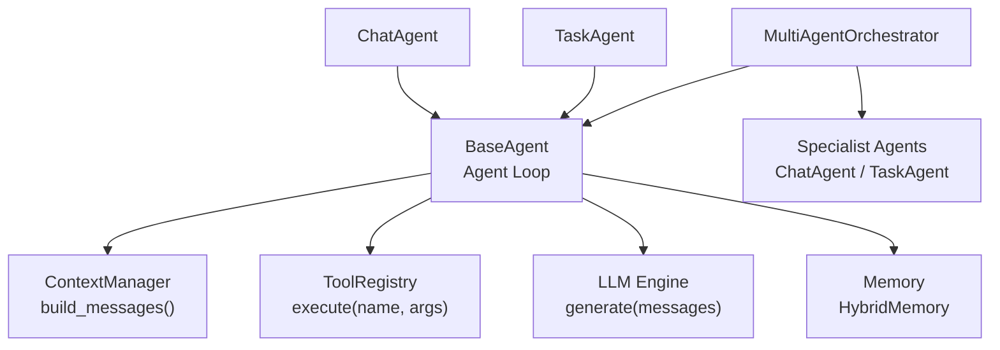
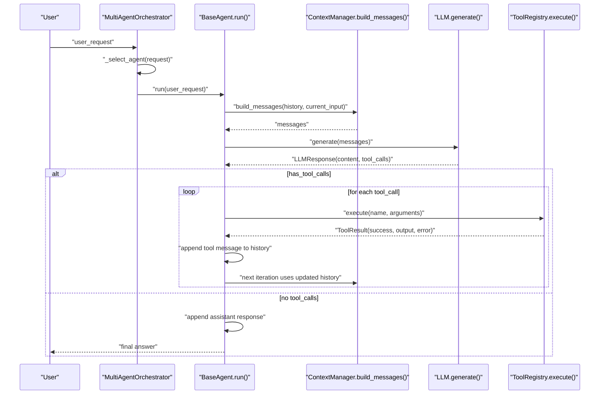
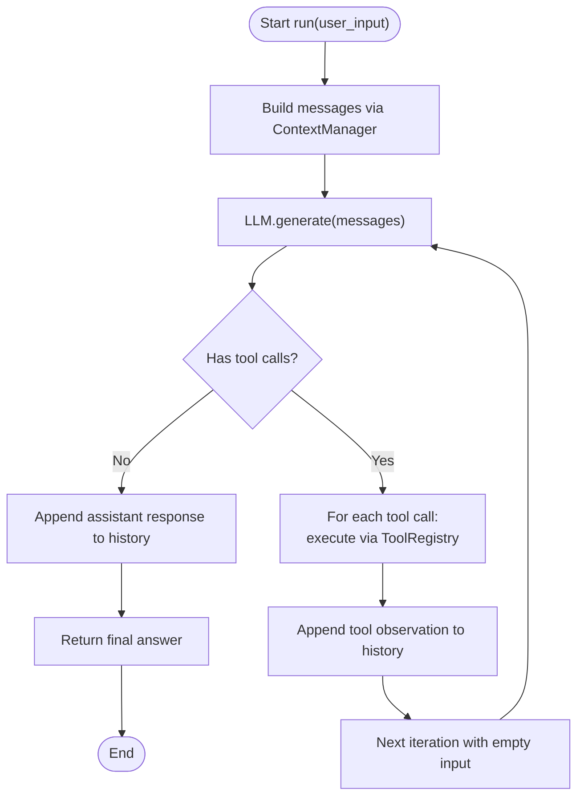
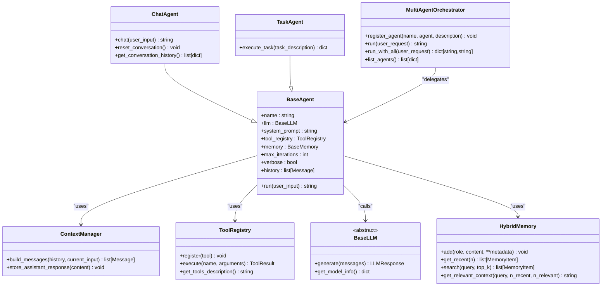

# Agent System

<cite>
**Referenced Files in This Document**
- [base.py](file://harness/agent/base.py)
- [chat.py](file://harness/agent/chat.py)
- [task.py](file://harness/agent/task.py)
- [orchestrator.py](file://harness/agent/orchestrator.py)
- [manager.py](file://harness/context/manager.py)
- [engine.py](file://harness/llm/engine.py)
- [registry.py](file://harness/tools/registry.py)
- [base.py](file://harness/tools/base.py)
- [builtin.py](file://harness/tools/builtin.py)
- [hybrid.py](file://harness/memory/hybrid.py)
- [demo_multi_agent.py](file://demos/demo_multi_agent.py)
- [demo_agent.py](file://demos/demo_agent.py)
</cite>

## Table of Contents
1. Introduction
2. Project Structure
3. Core Components
4. Architecture Overview
5. Detailed Component Analysis
6. Dependency Analysis
7. Performance Considerations
8. Troubleshooting Guide
9. Conclusion

## Introduction
This document focuses on the Agent System sub-component: how agents are implemented, how they orchestrate tool use and memory, and how multiple agents coordinate to solve complex tasks. It explains the BaseAgent’s Agent Loop pattern, ChatAgent for conversational interfaces, TaskAgent for goal-oriented tasks, and MultiAgentOrchestrator for routing requests to specialized agents. It also documents configuration options, parameters, return values, relationships with memory systems, tool registries, and context managers, and addresses common issues such as infinite loops, tool call parsing errors, and performance optimization strategies.

## Project Structure
The Agent System lives under harness/agent and integrates tightly with:
- LLM engine (message types, tool call parsing, backends)
- Context manager (assembles system prompt, tools, memory, history)
- Memory system (short-term and long-term retrieval)
- Tool registry (tool registration, execution, error handling)
- Demos that wire everything together

**Diagram sources**
- [base.py:63-160](file://harness/agent/base.py#L63-L160)
- [manager.py:41-108](file://harness/context/manager.py#L41-L108)
- [registry.py:17-67](file://harness/tools/registry.py#L17-L67)
- [engine.py:23-56](file://harness/llm/engine.py#L23-L56)
- [hybrid.py:22-84](file://harness/memory/hybrid.py#L22-L84)

**Section sources**
- [base.py:1-25](file://harness/agent/base.py#L1-L25)
- [README.md:137-177](file://README.md#L137-L177)

## Core Components
- BaseAgent: Implements the core Agent Loop that repeatedly builds context, calls the LLM, executes tool calls, and returns a final answer or fallback after max iterations.
- ChatAgent: A conversational agent subclassing BaseAgent with defaults tuned for multi-turn dialogue and conversation utilities.
- TaskAgent: A task-focused agent subclassing BaseAgent with higher iteration limits and structured result wrapping.
- MultiAgentOrchestrator: Routes user requests to specialist agents using an LLM-based selector with keyword fallbacks, and aggregates results.

Key integration points:
- ContextManager composes system prompts, tool descriptions, memory context, and conversation history into messages for each LLM call.
- ToolRegistry provides safe tool lookup and execution with error encapsulation via ToolResult.
- HybridMemory merges short-term recent messages with relevant long-term memories for richer context.
- LLM Engine defines Message, ToolCall, LLMResponse and parses tool calls from model output.

**Section sources**
- [base.py:63-160](file://harness/agent/base.py#L63-L160)
- [chat.py:25-59](file://harness/agent/chat.py#L25-L59)
- [task.py:32-73](file://harness/agent/task.py#L32-L73)
- [orchestrator.py:31-152](file://harness/agent/orchestrator.py#L31-L152)
- [manager.py:41-108](file://harness/context/manager.py#L41-L108)
- [registry.py:17-67](file://harness/tools/registry.py#L17-L67)
- [hybrid.py:22-84](file://harness/memory/hybrid.py#L22-L84)
- [engine.py:23-56](file://harness/llm/engine.py#L23-L56)

## Architecture Overview
The Agent System follows a layered architecture:
- Orchestrator layer decides which agent handles a request.
- Agent layer runs the loop: build context -> LLM -> tool calls -> repeat -> final answer.
- Context layer assembles prompts with tools, memory, and history.
- Tools layer exposes capabilities via a registry.
- Memory layer provides recent and relevant past context.
- LLM layer abstracts inference and tool call parsing.

**Diagram sources**
- [orchestrator.py:61-91](file://harness/agent/orchestrator.py#L61-L91)
- [base.py:97-160](file://harness/agent/base.py#L97-L160)
- [manager.py:61-108](file://harness/context/manager.py#L61-L108)
- [engine.py:206-241](file://harness/llm/engine.py#L206-L241)
- [registry.py:43-60](file://harness/tools/registry.py#L43-L60)

## Detailed Component Analysis

### BaseAgent: Agent Loop Pattern
Responsibilities:
- Maintain name, LLM, system prompt, tool registry, memory, max iterations, verbosity, and conversation history.
- Build context via ContextManager, call LLM, handle tool calls, append observations, and return final answers or fallback.
- Provide tracing via AgentTrace for debugging.

Key behaviors:
- Iterative loop up to max_iterations prevents infinite loops.
- If LLM responds without tool calls, it is treated as the final answer; stored in memory and returned.
- For tool calls, each result is appended as a tool message so the LLM can decide next steps.

Configuration and parameters:
- name: string identifier for logging/tracing.
- llm: BaseLLM instance providing generate().
- system_prompt: instructions injected into context.
- tool_registry: ToolRegistry instance for available tools.
- memory: BaseMemory implementation (default HybridMemory).
- max_iterations: upper bound on tool-call cycles.
- verbose: controls console logging during execution.

Return values:
- run(user_input) returns a string (final answer or fallback when max iterations reached).

Lifecycle management:
- History accumulates assistant and tool messages across iterations.
- ContextManager stores assistant responses into memory for future relevance.

Error handling:
- Tool execution failures are wrapped in ToolResult and surfaced as observation strings to the LLM.
- After max iterations, a polite fallback message is returned.

Performance considerations:
- Limit max_iterations to avoid excessive LLM/tool usage.
- Keep history concise; rely on memory retrieval for long-term context.

Common pitfalls:
- Infinite loops if LLM keeps requesting tools; mitigated by max_iterations.
- Mis-parsed tool calls due to malformed model output; handled by ToolCallParser.

**Section sources**
- [base.py:38-60](file://harness/agent/base.py#L38-L60)
- [base.py:63-160](file://harness/agent/base.py#L63-L160)
- [engine.py:61-122](file://harness/llm/engine.py#L61-L122)

#### BaseAgent Flowchart

**Diagram sources**
- [base.py:97-160](file://harness/agent/base.py#L97-L160)

### ChatAgent: Conversational Interface
Responsibilities:
- Provide a friendly conversational persona with default system prompt.
- Offer convenience methods like chat(), reset_conversation(), and get_conversation_history().

Configuration and parameters:
- Inherits BaseAgent configuration but sets sensible defaults for chat:
  - max_iterations=5
  - verbose=False
  - system_prompt tailored for natural dialogue.

Return values:
- chat(user_input) delegates to BaseAgent.run() and returns a string.

Relationships:
- Uses BaseAgent’s loop and context/memory/tool infrastructure unchanged.

Use cases:
- Interactive sessions where the agent should be concise and conversational.

**Section sources**
- [chat.py:19-59](file://harness/agent/chat.py#L19-L59)

### TaskAgent: Goal-Oriented Tasks
Responsibilities:
- Specialize in completing specific tasks with more aggressive tool usage.
- Wrap execution in execute_task(task_description) returning a structured dict.

Configuration and parameters:
- Inherits BaseAgent with:
  - max_iterations=15 (higher than chat)
  - verbose=True by default
  - system_prompt focused on step-by-step planning and tool usage.

Return values:
- execute_task(task_description) returns a dict with keys: success, result, task.

Behavior:
- Calls BaseAgent.run() internally and formats the result for structured consumption.

Use cases:
- Multi-step workflows requiring sequential tool calls and reasoning.

**Section sources**
- [task.py:22-73](file://harness/agent/task.py#L22-L73)

### MultiAgentOrchestrator: Coordinating Specialists
Responsibilities:
- Register specialist agents with descriptions.
- Route user requests to the best agent using LLM-based selection with keyword fallbacks.
- Provide run(user_request) for single-agent delegation and run_with_all(user_request) for parallel perspectives.

Configuration and parameters:
- llm: BaseLLM used for routing decisions.
- verbose: prints orchestration logs.

Methods:
- register_agent(name, agent, description): adds an agent to the pool.
- run(user_request): selects one agent and returns its result.
- run_with_all(user_request): runs through all agents and returns a map of results.
- list_agents(): lists registered agents and their descriptions.

Routing logic:
- Builds a supervisor prompt listing available agents and asks the LLM to choose.
- Falls back to keyword matching against agent descriptions if LLM selection fails.
- Defaults to the first agent if no match is found.

Use cases:
- Routing math queries to a calculator-enabled agent, time/date queries to a datetime-enabled agent, and general chat to a conversational agent.

**Section sources**
- [orchestrator.py:31-152](file://harness/agent/orchestrator.py#L31-L152)
- [demo_multi_agent.py:17-46](file://demos/demo_multi_agent.py#L17-L46)

### Context Manager: Prompt Assembly
Responsibilities:
- Assemble system prompt, tool descriptions, relevant memory context, conversation history, and current user input into a list of messages for each LLM call.
- Store assistant responses into memory for future retrieval.

Key behaviors:
- Injects tool instructions and tool descriptions into the system prompt when tools are available.
- Retrieves relevant long-term context via HybridMemory.get_relevant_context().
- Appends short-term history and current user message.

Configuration:
- system_prompt: base instructions.
- memory: BaseMemory implementation.
- tool_registry: ToolRegistry for tool descriptions.
- max_context_tokens: rough token budget for context window management.

**Section sources**
- [manager.py:26-118](file://harness/context/manager.py#L26-L118)

### Tool Registry: Central Catalog and Execution
Responsibilities:
- Register tools, list them, and execute them safely with error handling.
- Generate combined tool descriptions for system prompts.

Key behaviors:
- execute(name, arguments) returns ToolResult indicating success/failure and output/error.
- get_tools_description() produces text describing available tools for the LLM.

Integration:
- Used by BaseAgent to execute tool calls and by ContextManager to inject tool info into prompts.

**Section sources**
- [registry.py:17-67](file://harness/tools/registry.py#L17-L67)
- [base.py:132-152](file://harness/agent/base.py#L132-L152)

### Memory System: Hybrid Memory
Responsibilities:
- Combine short-term buffer (recent messages) with long-term storage (persistent knowledge).
- Provide get_relevant_context(query) to assemble recent and relevant past memories for context.

Key behaviors:
- add(role, content) persists user/assistant messages to long-term and recent to short-term.
- search(query, top_k) retrieves relevant long-term items.
- get_relevant_context merges recent and relevant memories into a prompt-friendly string.

**Section sources**
- [hybrid.py:22-84](file://harness/memory/hybrid.py#L22-L84)

### LLM Engine: Messages, Tool Calls, Backends
Responsibilities:
- Define data structures: Message, ToolCall, LLMResponse.
- Parse tool calls from raw model output using ToolCallParser.
- Provide BaseLLM interface and concrete backends (TransformersBackend, MockBackend).

Key behaviors:
- generate(messages) returns LLMResponse with content and tool_calls.
- ToolCallParser supports multiple formats (triple-backtick blocks, Action/Action Input patterns, bare JSON objects).

**Section sources**
- [engine.py:23-56](file://harness/llm/engine.py#L23-L56)
- [engine.py:61-122](file://harness/llm/engine.py#L61-L122)
- [engine.py:206-241](file://harness/llm/engine.py#L206-L241)

### Built-in Tools: Calculator, DateTime, FileOps
Responsibilities:
- Demonstrate BaseTool implementations with safe execution and descriptive schemas.
- Provide register_default_tools(registry) to quickly set up common tools.

Examples:
- CalculatorTool evaluates mathematical expressions safely.
- DateTimeTool returns date/time information based on query.
- FileOpsTool performs read-only file operations for safety.

**Section sources**
- [builtin.py:13-83](file://harness/tools/builtin.py#L13-L83)
- [demo_agent.py:21-36](file://demos/demo_agent.py#L21-L36)

## Dependency Analysis
Agent components depend on shared abstractions and services:
- BaseAgent depends on LLM engine, ToolRegistry, BaseMemory, and ContextManager.
- ChatAgent and TaskAgent extend BaseAgent and inherit its dependencies.
- MultiAgentOrchestrator coordinates multiple agents and uses LLM for routing.
- ContextManager depends on BaseMemory and ToolRegistry to build prompts.
- ToolRegistry depends on BaseTool implementations and ToolResult.

**Diagram sources**
- [base.py:63-160](file://harness/agent/base.py#L63-L160)
- [chat.py:25-59](file://harness/agent/chat.py#L25-L59)
- [task.py:32-73](file://harness/agent/task.py#L32-L73)
- [orchestrator.py:31-152](file://harness/agent/orchestrator.py#L31-L152)
- [manager.py:41-108](file://harness/context/manager.py#L41-L108)
- [registry.py:17-67](file://harness/tools/registry.py#L17-L67)
- [hybrid.py:22-84](file://harness/memory/hybrid.py#L22-L84)
- [engine.py:127-146](file://harness/llm/engine.py#L127-L146)

**Section sources**
- [base.py:63-160](file://harness/agent/base.py#L63-L160)
- [orchestrator.py:31-152](file://harness/agent/orchestrator.py#L31-L152)

## Performance Considerations
- Limit tool-call loops: tune max_iterations per agent type (e.g., 5 for ChatAgent, 15 for TaskAgent) to balance thoroughness and cost.
- Context size: use ContextManager’s token estimation and keep history concise; rely on HybridMemory retrieval for long-term context.
- Tool execution overhead: prefer targeted ToolRegistry instances per agent to reduce tool description size and parsing complexity.
- LLM backend choice: use MockBackend for fast iteration and TransformersBackend for real model behavior; adjust temperature and max_new_tokens appropriately.
- Parallel perspectives: use orchestrator.run_with_all() to gather diverse outputs when needed, but be mindful of increased LLM calls.

[No sources needed since this section provides general guidance]

## Troubleshooting Guide
Common issues and resolutions:
- Infinite loops:
  - Symptom: Agent keeps calling tools without finalizing.
  - Resolution: Ensure max_iterations is set appropriately; verify tool outputs are informative enough for the LLM to stop.
  - Reference: BaseAgent loop enforces max iterations and returns a fallback message.
  - Section sources
    - [base.py:97-160](file://harness/agent/base.py#L97-L160)

- Tool call parsing errors:
  - Symptom: Model output does not contain valid tool call blocks.
  - Resolution: Check model prompt formatting and ensure tool instructions are included; ToolCallParser supports multiple formats and deduplicates calls.
  - Section sources
    - [engine.py:61-122](file://harness/llm/engine.py#L61-L122)
    - [manager.py:26-38](file://harness/context/manager.py#L26-L38)

- Tool execution failures:
  - Symptom: Tool returns error; agent may retry or fail to proceed.
  - Resolution: Inspect ToolResult.error; improve tool validation and provide clearer error messages; consider adding retries or alternative tools.
  - Section sources
    - [registry.py:43-60](file://harness/tools/registry.py#L43-L60)
    - [base.py:132-152](file://harness/agent/base.py#L132-L152)

- Orchestration misrouting:
  - Symptom: Request sent to wrong specialist agent.
  - Resolution: Improve agent descriptions and keywords; verify LLM routing prompt; fall back to keyword matching if needed.
  - Section sources
    - [orchestrator.py:105-145](file://harness/agent/orchestrator.py#L105-L145)

- Memory context bloat:
  - Symptom: Prompts exceed context window or degrade quality.
  - Resolution: Tune HybridMemory.get_relevant_context parameters (n_recent, n_relevant); prune history; rely on long-term retrieval.
  - Section sources
    - [hybrid.py:46-73](file://harness/memory/hybrid.py#L46-L73)
    - [manager.py:85-103](file://harness/context/manager.py#L85-L103)

## Conclusion
The Agent System implements a robust, extensible framework for building AI agents that can reason, plan, and act via tools. BaseAgent provides the foundational loop, while ChatAgent and TaskAgent offer specialized configurations for different use cases. MultiAgentOrchestrator enables scalable coordination among specialists, improving modularity and performance. Integration with ContextManager, HybridMemory, ToolRegistry, and the LLM Engine ensures flexible, efficient, and maintainable agent architectures. By tuning iteration limits, context composition, and tool design, teams can build reliable agents that scale from simple demos to production-grade applications.