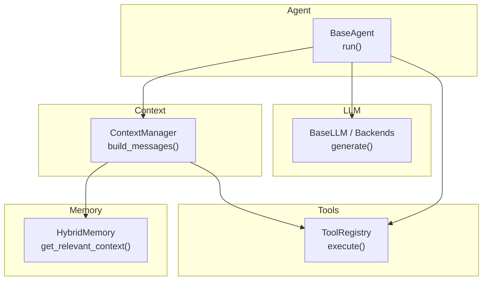
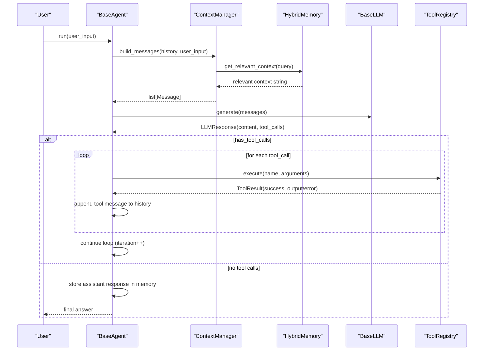
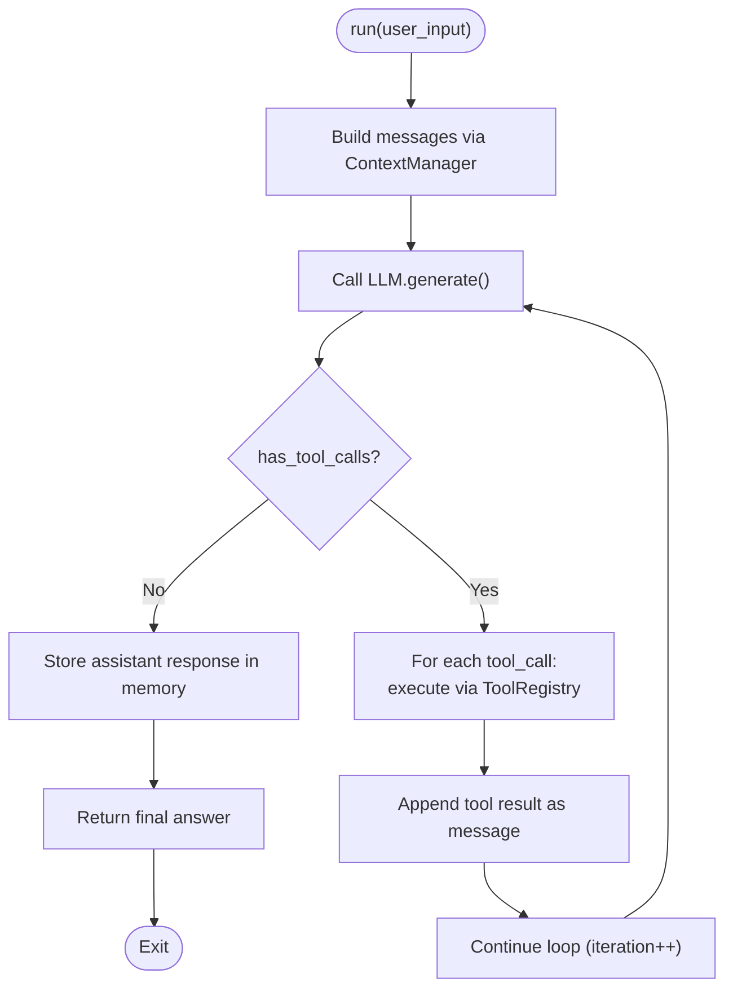
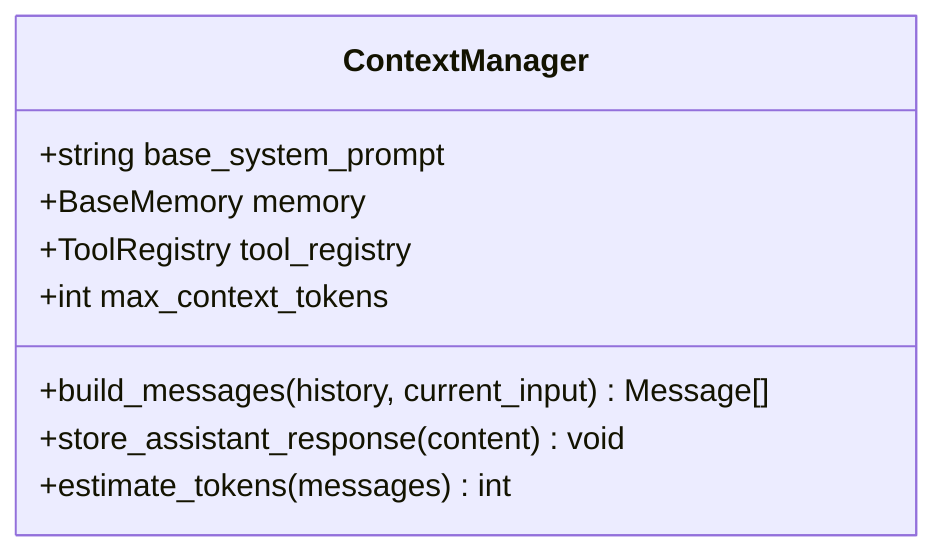
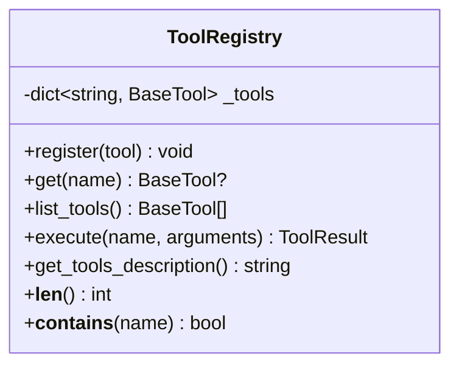
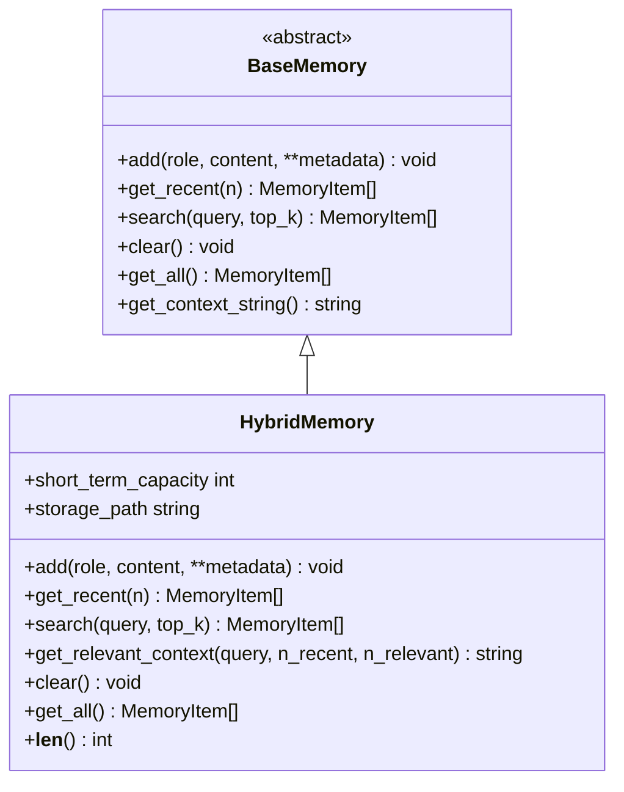
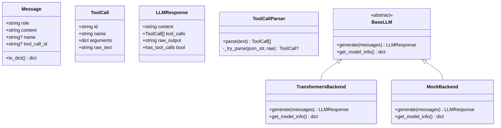
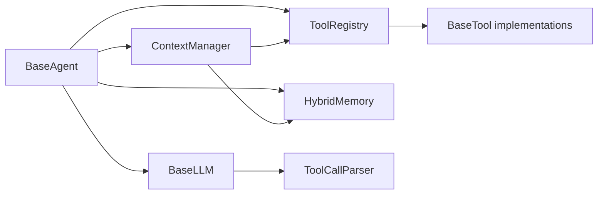

# Base Agent

<cite>
**Referenced Files in This Document**
- [base.py](file://harness/agent/base.py)
- [manager.py](file://harness/context/manager.py)
- [registry.py](file://harness/tools/registry.py)
- [engine.py](file://harness/llm/engine.py)
- [base.py](file://harness/memory/base.py)
- [hybrid.py](file://harness/memory/hybrid.py)
- [builtin.py](file://harness/tools/builtin.py)
- [config.py](file://harness/config.py)
- [demo_agent.py](file://demos/demo_agent.py)
</cite>

## Table of Contents
1. [Introduction](#introduction)
2. [Project Structure](#project-structure)
3. [Core Components](#core-components)
4. [Architecture Overview](#architecture-overview)
5. [Detailed Component Analysis](#detailed-component-analysis)
6. [Dependency Analysis](#dependency-analysis)
7. [Performance Considerations](#performance-considerations)
8. [Troubleshooting Guide](#troubleshooting-guide)
9. [Conclusion](#conclusion)
10. [Appendices](#appendices)

## Introduction
This document explains the BaseAgent class and the Agent Loop pattern that transforms a language model into an autonomous agent. It details the iterative execution cycle: building context, calling the LLM, executing tool calls, and returning final answers. It also documents the AgentTrace class for debugging and monitoring, enumerates configuration parameters (name, llm backend, system_prompt, tool_registry, memory, max_iterations, verbose), and shows how to instantiate and configure agents with different components. Finally, it clarifies relationships with ContextManager, ToolRegistry, and Memory systems, and addresses common issues such as infinite loops, tool call parsing errors, and performance optimization strategies.

## Project Structure
The harness is organized by capability:
- Agent loop and orchestration live under harness/agent
- Context assembly lives under harness/context
- Tool registration and execution live under harness/tools
- Memory abstractions and implementations live under harness/memory
- LLM abstraction and backends live under harness/llm
- Configuration lives under harness/config
- Demos show usage patterns under demos

**Diagram sources**
- [base.py:63-165](file://harness/agent/base.py#L63-L165)
- [manager.py:41-118](file://harness/context/manager.py#L41-L118)
- [engine.py:127-241](file://harness/llm/engine.py#L127-L241)
- [registry.py:17-74](file://harness/tools/registry.py#L17-L74)
- [hybrid.py:22-84](file://harness/memory/hybrid.py#L22-L84)

**Section sources**
- [base.py:1-165](file://harness/agent/base.py#L1-L165)
- [manager.py:1-118](file://harness/context/manager.py#L1-L118)
- [engine.py:1-421](file://harness/llm/engine.py#L1-L421)
- [registry.py:1-74](file://harness/tools/registry.py#L1-L74)
- [base.py:1-64](file://harness/memory/base.py#L1-L64)
- [hybrid.py:1-84](file://harness/memory/hybrid.py#L1-L84)
- [config.py:1-70](file://harness/config.py#L1-L70)
- [demo_agent.py:1-40](file://demos/demo_agent.py#L1-L40)

## Core Components
- BaseAgent: Implements the core Agent Loop that orchestrates context building, LLM calls, tool execution, and answer return. Provides AgentTrace for step-by-step debugging.
- ContextManager: Assembles messages for each LLM call, including system prompt, tool descriptions, relevant memory, conversation history, and current input.
- ToolRegistry: Central catalog for tools; supports registration, listing, description generation, and safe execution with error handling.
- Memory (BaseMemory, HybridMemory): Abstraction for short-term and long-term memory; HybridMemory merges recent conversation and relevant past memories into context.
- LLM Engine (BaseLLM and backends): Abstract interface for LLMs with concrete TransformersBackend and MockBackend; includes ToolCallParser to extract structured tool calls from raw text.

Key responsibilities:
- BaseAgent.run(): Iterative loop up to max_iterations; builds context via ContextManager; calls LLM.generate(); executes tool calls via ToolRegistry; appends results to history; returns final answer or fallback when max iterations reached.
- ContextManager.build_messages(): Creates system message (with tool instructions and descriptions), retrieves relevant long-term context via HybridMemory.get_relevant_context(), appends conversation history, adds current user input, and stores inputs in memory.
- ToolRegistry.execute(): Safely executes tools by name with arguments; returns ToolResult indicating success/failure and output/error.
- Memory: HybridMemory.add() persists user/assistant messages to long-term and recent to short-term; get_relevant_context() composes a string combining recent and relevant memories for context.
- LLM: BaseLLM.generate() returns LLMResponse with content and tool_calls; ToolCallParser parses multiple formats to produce ToolCall objects.

Configuration parameters:
- name: Agent identifier used in logs and traces.
- llm: Backend implementing BaseLLM (e.g., MockBackend or TransformersBackend).
- system_prompt: Base instructions injected into the system message.
- tool_registry: ToolRegistry instance providing available tools and their descriptions.
- memory: BaseMemory implementation (default HybridMemory) for storing and retrieving context.
- max_iterations: Upper bound on tool-call loops per turn to prevent infinite loops.
- verbose: Enables logging/printing of intermediate steps during execution.

**Section sources**
- [base.py:63-165](file://harness/agent/base.py#L63-L165)
- [manager.py:41-118](file://harness/context/manager.py#L41-L118)
- [registry.py:17-74](file://harness/tools/registry.py#L17-L74)
- [hybrid.py:22-84](file://harness/memory/hybrid.py#L22-L84)
- [engine.py:23-57](file://harness/llm/engine.py#L23-L57)
- [engine.py:61-123](file://harness/llm/engine.py#L61-L123)
- [engine.py:127-241](file://harness/llm/engine.py#L127-L241)
- [config.py:8-70](file://harness/config.py#L8-L70)

## Architecture Overview
The Agent Loop is the central control flow that turns an LLM into an agent capable of multi-step reasoning and tool use.

**Diagram sources**
- [base.py:97-160](file://harness/agent/base.py#L97-L160)
- [manager.py:61-104](file://harness/context/manager.py#L61-L104)
- [hybrid.py:46-73](file://harness/memory/hybrid.py#L46-L73)
- [engine.py:206-241](file://harness/llm/engine.py#L206-L241)
- [registry.py:43-67](file://harness/tools/registry.py#L43-L67)

## Detailed Component Analysis

### BaseAgent and Agent Trace
- BaseAgent.run() implements the Agent Loop:
  - Builds messages via ContextManager.build_messages()
  - Calls LLM.generate()
  - If LLMResponse.has_tool_calls is true, executes each tool via ToolRegistry.execute(), records tool results in history, and continues the loop
  - Otherwise, stores assistant response in memory and returns the final answer
  - Enforces max_iterations to avoid infinite loops; returns a fallback message if exceeded
- AgentTrace records steps:
  - llm_call: iteration number
  - tool_call: name and arguments
  - tool_result: truncated output
  - final_answer: truncated content
  - summary() produces a human-readable trace

**Diagram sources**
- [base.py:97-160](file://harness/agent/base.py#L97-L160)

**Section sources**
- [base.py:38-61](file://harness/agent/base.py#L38-L61)
- [base.py:63-165](file://harness/agent/base.py#L63-L165)

### ContextManager
- build_messages():
  - Creates system message with base_system_prompt and tool instructions/descriptions if tools are registered
  - Retrieves relevant long-term context via HybridMemory.get_relevant_context()
  - Appends conversation history and current user input
  - Stores user input in memory
- estimate_tokens(): Rough token estimation based on character count divided by four

**Diagram sources**
- [manager.py:41-118](file://harness/context/manager.py#L41-L118)

**Section sources**
- [manager.py:41-118](file://harness/context/manager.py#L41-L118)

### ToolRegistry
- register(): Adds tools by name; warns on overwrite
- get(): Retrieves tool by name
- list_tools(): Lists all registered tools
- execute(): Executes tool by name with arguments; returns ToolResult with success flag and output/error; handles exceptions safely
- get_tools_description(): Generates combined tool descriptions for system prompt

**Diagram sources**
- [registry.py:17-74](file://harness/tools/registry.py#L17-L74)

**Section sources**
- [registry.py:17-74](file://harness/tools/registry.py#L17-L74)

### Memory Systems
- BaseMemory: Abstract interface defining add(), get_recent(), search(), clear(), get_all(), and get_context_string()
- HybridMemory: Combines ShortTermMemory and LongTermMemory; add() persists user/assistant to long-term; get_relevant_context() merges recent and relevant memories into a single string for context

**Diagram sources**
- [base.py:17-64](file://harness/memory/base.py#L17-L64)
- [hybrid.py:22-84](file://harness/memory/hybrid.py#L22-L84)

**Section sources**
- [base.py:17-64](file://harness/memory/base.py#L17-L64)
- [hybrid.py:22-84](file://harness/memory/hybrid.py#L22-L84)

### LLM Engine and Tool Call Parsing
- Message, ToolCall, LLMResponse: Data structures for conversation and responses
- ToolCallParser.parse(): Extracts tool calls from raw text using multiple patterns (triple-backtick blocks, Action/Action Input format, bare JSON objects)
- BaseLLM.generate(): Abstract method every backend must implement
- TransformersBackend: Loads model/tokenizer, applies chat template, generates tokens, parses tool calls, strips tool call blocks from content
- MockBackend: Deterministic mock for demos without GPU; synthesizes tool calls based on simple heuristics

**Diagram sources**
- [engine.py:23-57](file://harness/llm/engine.py#L23-L57)
- [engine.py:61-123](file://harness/llm/engine.py#L61-L123)
- [engine.py:127-241](file://harness/llm/engine.py#L127-L241)
- [engine.py:254-399](file://harness/llm/engine.py#L254-L399)

**Section sources**
- [engine.py:23-57](file://harness/llm/engine.py#L23-L57)
- [engine.py:61-123](file://harness/llm/engine.py#L61-L123)
- [engine.py:127-241](file://harness/llm/engine.py#L127-L241)
- [engine.py:254-399](file://harness/llm/engine.py#L254-L399)

### Built-in Tools and Registration
- CalculatorTool: Evaluates mathematical expressions safely with restricted characters
- DateTimeTool: Returns current date/time information based on query
- FileOpsTool: Read-only file operations (list directory contents, read file)
- register_default_tools(): Registers calculator, datetime, and file_ops tools into a ToolRegistry

Usage example reference:
- demos/demo_agent.py demonstrates creating an LLM via create_llm(), registering default tools, instantiating TaskAgent (which inherits from BaseAgent), and executing tasks

**Section sources**
- [builtin.py:13-83](file://harness/tools/builtin.py#L13-L83)
- [demo_agent.py:15-36](file://demos/demo_agent.py#L15-L36)

## Dependency Analysis
- BaseAgent depends on:
  - LLM engine (BaseLLM) for generating responses
  - ContextManager for assembling messages
  - ToolRegistry for executing tools
  - Memory (BaseMemory/HybridMemory) for storing and retrieving context
- ContextManager depends on:
  - Memory (HybridMemory) for relevant context retrieval
  - ToolRegistry for tool descriptions
- ToolRegistry depends on:
  - BaseTool implementations (e.g., CalculatorTool, DateTimeTool, FileOpsTool)
- LLM backends depend on:
  - ToolCallParser for extracting tool calls
  - Configuration (LLMConfig) for model selection and parameters

**Diagram sources**
- [base.py:63-165](file://harness/agent/base.py#L63-L165)
- [manager.py:41-118](file://harness/context/manager.py#L41-L118)
- [registry.py:17-74](file://harness/tools/registry.py#L17-L74)
- [engine.py:61-123](file://harness/llm/engine.py#L61-L123)

**Section sources**
- [base.py:63-165](file://harness/agent/base.py#L63-L165)
- [manager.py:41-118](file://harness/context/manager.py#L41-L118)
- [registry.py:17-74](file://harness/tools/registry.py#L17-L74)
- [engine.py:61-123](file://harness/llm/engine.py#L61-L123)

## Performance Considerations
- Token budget management:
  - ContextManager.estimate_tokens() provides rough token estimation; in production, use actual tokenizer counts to manage context window limits
  - Limit history length and relevant memory size to stay within model constraints
- Max iterations:
  - Tune max_iterations to balance thoroughness vs. latency; too high risks slow responses and potential loops
- Tool call parsing efficiency:
  - ToolCallParser uses regex patterns; ensure prompts encourage consistent formatting to reduce parsing overhead
- Memory retrieval:
  - HybridMemory.get_relevant_context() combines recent and relevant memories; tune n_recent and n_relevant to optimize relevance and token usage
- Backend selection:
  - Use MockBackend for fast local testing; switch to TransformersBackend for real inference; consider device selection ("auto", "cuda", "mps", "cpu") for performance
- Verbose logging:
  - Disable verbose in production to reduce I/O overhead

[No sources needed since this section provides general guidance]

## Troubleshooting Guide
Common issues and resolutions:
- Infinite loops:
  - Symptom: Agent runs many iterations without returning an answer
  - Cause: LLM keeps requesting tool calls without producing a final answer
  - Resolution: Reduce max_iterations; improve system_prompt/tool descriptions; ensure tool outputs are informative enough for the LLM to finalize
- Tool call parsing errors:
  - Symptom: Tool calls not detected or malformed
  - Cause: LLM output does not match expected patterns (triple-backtick blocks, Action/Action Input, or JSON)
  - Resolution: Adjust prompting to enforce consistent tool call format; inspect raw_output via LLMResponse.raw_output; verify ToolCallParser behavior
- Tool execution failures:
  - Symptom: Tool returns success=False with error message
  - Cause: Invalid arguments, missing files, or runtime exceptions
  - Resolution: Validate arguments before calling tools; handle errors gracefully in tool implementations; log ToolResult.error for diagnostics
- Memory context overflow:
  - Symptom: Context exceeds model limits or becomes noisy
  - Cause: Too much history or irrelevant long-term memories included
  - Resolution: Reduce short_term_capacity; tune n_recent/n_relevant in HybridMemory.get_relevant_context(); prune history periodically
- Performance bottlenecks:
  - Symptom: Slow responses or high resource usage
  - Resolution: Use appropriate backend/device; disable verbose; limit max_new_tokens; cache repeated computations where possible

**Section sources**
- [base.py:97-160](file://harness/agent/base.py#L97-L160)
- [engine.py:61-123](file://harness/llm/engine.py#L61-L123)
- [registry.py:43-67](file://harness/tools/registry.py#L43-L67)
- [hybrid.py:46-73](file://harness/memory/hybrid.py#L46-L73)

## Conclusion
BaseAgent encapsulates the Agent Loop that transforms an LLM into an autonomous agent by iteratively building context, invoking the LLM, executing tool calls, and returning final answers. The design cleanly separates concerns: ContextManager assembles prompts, ToolRegistry manages tool availability and execution, Memory provides continuity across turns, and the LLM engine abstracts inference backends. With configurable parameters like name, llm backend, system_prompt, tool_registry, memory, max_iterations, and verbose, agents can be tailored for diverse tasks. Proper tuning of these components mitigates common issues such as infinite loops and parsing errors while optimizing performance.

[No sources needed since this section summarizes without analyzing specific files]

## Appendices

### Configuration Parameters Reference
- name: Agent identifier used in logs/traces
- llm: Backend implementing BaseLLM (MockBackend or TransformersBackend)
- system_prompt: Base instructions injected into the system message
- tool_registry: ToolRegistry instance providing available tools and descriptions
- memory: BaseMemory implementation (default HybridMemory)
- max_iterations: Upper bound on tool-call loops per turn
- verbose: Enables logging/printing of intermediate steps

**Section sources**
- [base.py:73-95](file://harness/agent/base.py#L73-L95)
- [config.py:8-70](file://harness/config.py#L8-L70)

### Concrete Usage Examples
- Instantiate an agent with built-in tools and mock backend:
  - Create LLM via create_llm()
  - Register default tools via register_default_tools(registry)
  - Instantiate TaskAgent (inherits from BaseAgent) with llm and registry
  - Execute tasks and clear history between runs
- Configure different components:
  - Swap llm backend by changing environment variables or LLMConfig
  - Provide custom system_prompt and memory settings
  - Adjust max_iterations and verbose for performance/debugging

Reference paths:
- [demo_agent.py:15-36](file://demos/demo_agent.py#L15-L36)
- [config.py:25-34](file://harness/config.py#L25-L34)
- [engine.py:404-421](file://harness/llm/engine.py#L404-L421)

**Section sources**
- [demo_agent.py:15-36](file://demos/demo_agent.py#L15-L36)
- [config.py:25-34](file://harness/config.py#L25-L34)
- [engine.py:404-421](file://harness/llm/engine.py#L404-L421)