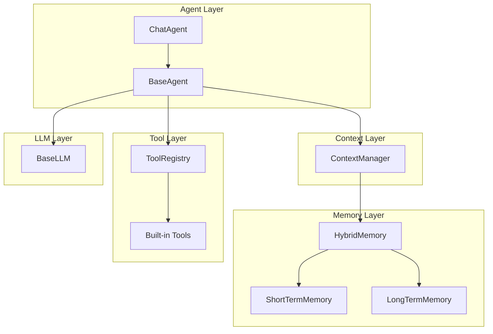
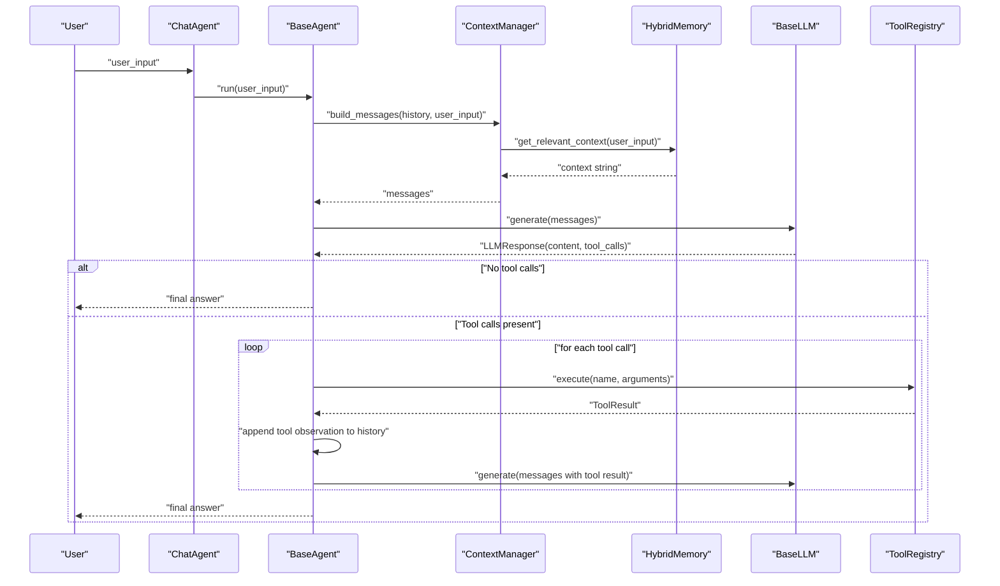
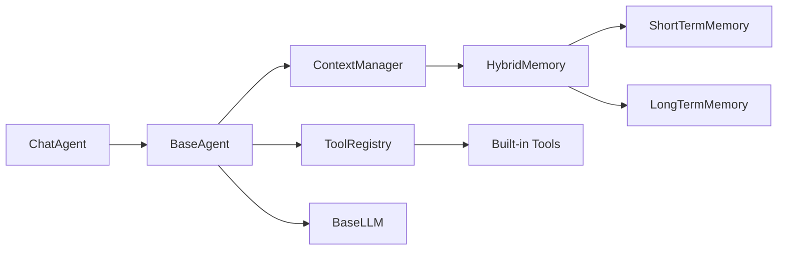

# Chat Agent

<cite>
**Referenced Files in This Document**
- [chat.py](file://harness/agent/chat.py)
- [base.py](file://harness/agent/base.py)
- [manager.py](file://harness/context/manager.py)
- [engine.py](file://harness/llm/engine.py)
- [hybrid.py](file://harness/memory/hybrid.py)
- [short_term.py](file://harness/memory/short_term.py)
- [long_term.py](file://harness/memory/long_term.py)
- [builtin.py](file://harness/tools/builtin.py)
- [registry.py](file://harness/tools/registry.py)
- [demo_chat.py](file://demos/demo_chat.py)
- [README.md](file://README.md)
</cite>

## Table of Contents
1. [Introduction](#introduction)
2. [Project Structure](#project-structure)
3. [Core Components](#core-components)
4. [Architecture Overview](#architecture-overview)
5. [Detailed Component Analysis](#detailed-component-analysis)
6. [Dependency Analysis](#dependency-analysis)
7. [Performance Considerations](#performance-considerations)
8. [Troubleshooting Guide](#troubleshooting-guide)
9. [Conclusion](#conclusion)
10. [Appendices](#appendices)

## Introduction
This document explains the ChatAgent class designed for conversational interfaces. It shows how ChatAgent extends BaseAgent to provide specialized functionality for multi-turn conversations, including conversation history management, contextual awareness via memory retrieval, and natural dialogue flow through tool-assisted reasoning. It also documents configuration options for chat behavior, message formatting, and conversation state management, along with practical examples demonstrating interactive sessions, context preservation across turns, and integration with memory systems for long-term conversation context. Finally, it provides best practices for maintaining coherent conversations and optimizing response quality.

## Project Structure
The chat capability is implemented as a layered system:
- Agent layer: BaseAgent implements the core agent loop; ChatAgent specializes it for conversational use.
- Context layer: ContextManager assembles prompts from system instructions, tools, memory, and history.
- Memory layer: HybridMemory composes ShortTermMemory (recent messages) and LongTermMemory (persistent, retrievable knowledge).
- Tool layer: ToolRegistry and built-in tools enable the agent to call external functions during reasoning.
- LLM layer: BaseLLM abstraction with backends that generate responses and parse tool calls.
- Demo layer: Interactive demo script demonstrates end-to-end usage.

**Diagram sources**
- [base.py:63-165](file://harness/agent/base.py#L63-L165)
- [chat.py:25-60](file://harness/agent/chat.py#L25-L60)
- [manager.py:41-118](file://harness/context/manager.py#L41-L118)
- [hybrid.py:22-84](file://harness/memory/hybrid.py#L22-L84)
- [short_term.py:16-50](file://harness/memory/short_term.py#L16-L50)
- [long_term.py:24-109](file://harness/memory/long_term.py#L24-L109)
- [registry.py:17-74](file://harness/tools/registry.py#L17-L74)
- [builtin.py:13-83](file://harness/tools/builtin.py#L13-L83)
- [engine.py:127-421](file://harness/llm/engine.py#L127-L421)

**Section sources**
- [README.md:73-131](file://README.md#L73-L131)

## Core Components
- ChatAgent: A conversational specialization of BaseAgent with convenience methods for chat, conversation reset, and history retrieval. It sets sensible defaults for max iterations and verbosity suited to interactive chat.
- BaseAgent: Implements the agent loop that builds context, calls the LLM, executes tool calls when requested, and stores assistant responses. It maintains conversation history and integrates with memory and tools.
- ContextManager: Assembles the full prompt for each LLM call by combining system instructions, tool descriptions, relevant long-term memories, recent short-term history, and current user input.
- HybridMemory: Combines ShortTermMemory (bounded buffer of recent messages) and LongTermMemory (persistent storage with TF-IDF retrieval) to provide both immediate context and relevant past knowledge.
- ToolSystem: ToolRegistry manages available tools; built-in tools demonstrate calculator, datetime, and file operations. The agent can call these tools during reasoning to gather information or perform actions.
- LLM Engine: Abstract interface for model backends. Backends generate text and parse tool calls from output. Mock backend enables demos without GPU; Transformers backend loads real models.

Key behaviors enabled by these components:
- Multi-turn conversation: History is maintained and passed to the LLM each turn.
- Contextual awareness: Relevant past memories are retrieved and injected into the prompt.
- Natural dialogue flow: Tool calls allow the agent to reason step-by-step and produce grounded answers.

**Section sources**
- [chat.py:25-60](file://harness/agent/chat.py#L25-L60)
- [base.py:63-165](file://harness/agent/base.py#L63-L165)
- [manager.py:41-118](file://harness/context/manager.py#L41-L118)
- [hybrid.py:22-84](file://harness/memory/hybrid.py#L22-L84)
- [short_term.py:16-50](file://harness/memory/short_term.py#L16-L50)
- [long_term.py:24-109](file://harness/memory/long_term.py#L24-L109)
- [registry.py:17-74](file://harness/tools/registry.py#L17-L74)
- [builtin.py:13-83](file://harness/tools/builtin.py#L13-L83)
- [engine.py:127-421](file://harness/llm/engine.py#L127-L421)

## Architecture Overview
The ChatAgent orchestrates a multi-turn conversation using the following flow:
- User input is processed by ChatAgent.chat, which delegates to BaseAgent.run.
- BaseAgent.run builds messages via ContextManager, calls the LLM, handles tool calls, updates history, and returns the final answer.
- ContextManager injects system instructions, tool descriptions, relevant long-term memories, recent short-term history, and the current user message.
- HybridMemory ensures the most recent messages are always included and retrieves relevant past memories based on the query.
- ToolRegistry executes any tool calls requested by the LLM and feeds results back into the conversation until a final answer is produced.

**Diagram sources**
- [base.py:97-160](file://harness/agent/base.py#L97-L160)
- [manager.py:61-104](file://harness/context/manager.py#L61-L104)
- [hybrid.py:46-73](file://harness/memory/hybrid.py#L46-L73)
- [engine.py:138-241](file://harness/llm/engine.py#L138-L241)
- [registry.py:43-67](file://harness/tools/registry.py#L43-L67)

## Detailed Component Analysis

### ChatAgent
- Purpose: Specialized agent for interactive multi-turn conversations.
- Key features:
  - Inherits BaseAgent’s loop and adds chat-specific defaults (max_iterations=5, verbose=False).
  - Provides a simple chat method that delegates to run.
  - Offers reset_conversation to clear conversation history while preserving long-term memory.
  - Exposes get_conversation_history to retrieve structured history for UI or logging.

Configuration options:
- llm: BaseLLM instance used for generation.
- system_prompt: Defaults to a friendly assistant persona; can be customized to change tone and behavior.
- tool_registry: Optional registry; defaults to an empty registry if not provided.
- memory: Optional memory store; defaults to HybridMemory if not provided.
- name: Display name for logs and traces.

Best practices:
- Use a tailored system_prompt to define persona and constraints.
- Keep max_iterations low for responsive chat; increase only if complex tool chains are expected.
- Use reset_conversation to start fresh while retaining long-term knowledge.

**Section sources**
- [chat.py:25-60](file://harness/agent/chat.py#L25-L60)

### BaseAgent (Agent Loop)
- Purpose: Core execution cycle enabling tool use and iterative reasoning.
- Behavior:
  - Builds context via ContextManager.
  - Calls LLM.generate with assembled messages.
  - If no tool calls, appends assistant response to history, stores in memory, and returns answer.
  - If tool calls exist, executes them via ToolRegistry, appends observations to history, and loops until final answer or max_iterations reached.
- Safety:
  - Fallback message after max_iterations prevents infinite loops.
  - Verbose mode logs raw outputs and tool calls for debugging.

Optimization opportunities:
- Tune max_iterations based on expected complexity.
- Use memory strategies to keep context concise and relevant.
- Limit tool descriptions to reduce prompt size.

**Section sources**
- [base.py:63-165](file://harness/agent/base.py#L63-L165)

### ContextManager
- Purpose: Assembles the complete prompt for each LLM call.
- Inputs:
  - System prompt (base + tool instructions + tool descriptions).
  - Relevant long-term memories (via HybridMemory.get_relevant_context).
  - Conversation history (short-term messages).
  - Current user input.
- Outputs:
  - List of Message objects representing the full prompt.
- Token management:
  - Provides estimate_tokens for rough token counting to help manage context window.

Message formatting:
- System message includes base instructions and tool guidance.
- Relevant past context is injected as a separate system message block.
- History messages preserve roles and content for continuity.
- Final user message carries the current input.

**Section sources**
- [manager.py:41-118](file://harness/context/manager.py#L41-L118)

### Memory System
- HybridMemory:
  - Maintains ShortTermMemory (recent messages) and LongTermMemory (persistent, searchable).
  - Adds user and assistant messages to both short-term and long-term stores.
  - Provides get_relevant_context to combine recent and relevant memories into a single context string.
- ShortTermMemory:
  - Bounded deque with FIFO eviction to fit within context windows.
  - Simple keyword overlap search for quick relevance.
- LongTermMemory:
  - Persistent JSON-backed storage with TF-IDF retrieval.
  - Returns top-K relevant items based on query terms.

Data structures:
- MemoryItem: role, content, timestamp, metadata.
- Deque-based buffer for short-term; list-based storage for long-term.

Complexity considerations:
- Short-term retrieval is O(n) over recent buffer.
- Long-term retrieval computes TF-IDF scores across stored items; consider scaling with larger corpora.

**Section sources**
- [hybrid.py:22-84](file://harness/memory/hybrid.py#L22-L84)
- [short_term.py:16-50](file://harness/memory/short_term.py#L16-L50)
- [long_term.py:24-109](file://harness/memory/long_term.py#L24-L109)
- [base.py:18-64](file://harness/memory/base.py#L18-L64)

### Tool System
- ToolRegistry:
  - Central catalog for tools; supports registration, listing, description generation, and execution with error handling.
- Built-in Tools:
  - CalculatorTool: Safe evaluation of mathematical expressions.
  - DateTimeTool: Retrieves current date/time information.
  - FileOpsTool: Read-only file operations (list directory, read file).
- Integration:
  - ContextManager injects tool instructions and descriptions into the system prompt.
  - BaseAgent executes tool calls and feeds results back into the conversation.

Extensibility:
- Implement BaseTool subclasses with name, description, parameters, and execute method.
- Register tools via ToolRegistry.register or use register_default_tools helper.

**Section sources**
- [registry.py:17-74](file://harness/tools/registry.py#L17-L74)
- [builtin.py:13-83](file://harness/tools/builtin.py#L13-L83)
- [base.py:127-152](file://harness/agent/base.py#L127-L152)

### LLM Engine
- BaseLLM:
  - Abstract interface defining generate and get_model_info.
- TransformersBackend:
  - Loads model and tokenizer from HuggingFace, applies chat template, generates tokens, parses tool calls, and returns structured response.
- MockBackend:
  - Pattern-matching backend for demos without GPU; simulates tool calling and conversation flow.
- ToolCallParser:
  - Extracts tool calls from free-form text using multiple patterns.

Usage:
- create_llm factory selects backend based on configuration.
- Messages are converted to dicts and formatted via model-specific chat templates.

**Section sources**
- [engine.py:127-421](file://harness/llm/engine.py#L127-L421)

## Dependency Analysis
ChatAgent depends on BaseAgent for the core loop, which in turn depends on ContextManager, ToolRegistry, and BaseLLM. ContextManager relies on HybridMemory for context assembly. HybridMemory composes ShortTermMemory and LongTermMemory. Built-in tools are registered via ToolRegistry and executed during the agent loop.

**Diagram sources**
- [chat.py:25-60](file://harness/agent/chat.py#L25-L60)
- [base.py:63-165](file://harness/agent/base.py#L63-L165)
- [manager.py:41-118](file://harness/context/manager.py#L41-L118)
- [hybrid.py:22-84](file://harness/memory/hybrid.py#L22-L84)
- [short_term.py:16-50](file://harness/memory/short_term.py#L16-L50)
- [long_term.py:24-109](file://harness/memory/long_term.py#L24-L109)
- [registry.py:17-74](file://harness/tools/registry.py#L17-L74)
- [builtin.py:13-83](file://harness/tools/builtin.py#L13-L83)
- [engine.py:127-421](file://harness/llm/engine.py#L127-L421)

**Section sources**
- [base.py:63-165](file://harness/agent/base.py#L63-L165)
- [manager.py:41-118](file://harness/context/manager.py#L41-L118)
- [hybrid.py:22-84](file://harness/memory/hybrid.py#L22-L84)
- [registry.py:17-74](file://harness/tools/registry.py#L17-L74)
- [engine.py:127-421](file://harness/llm/engine.py#L127-L421)

## Performance Considerations
- Context window management:
  - Use HybridMemory.get_relevant_context to limit injected context to recent and relevant items.
  - Adjust ShortTermMemory capacity to balance coherence and token limits.
- Tool call overhead:
  - Each tool call incurs additional LLM calls; minimize unnecessary tool usage.
  - Prefer concise tool descriptions to reduce prompt size.
- Memory retrieval cost:
  - LongTermMemory uses TF-IDF scoring; consider caching or precomputing indices for large datasets.
- Iteration limits:
  - Tune max_iterations to prevent excessive loops while allowing sufficient reasoning steps.
- Backend selection:
  - Use MockBackend for fast iteration; switch to TransformersBackend for production-quality responses.

[No sources needed since this section provides general guidance]

## Troubleshooting Guide
Common issues and resolutions:
- No tool calls detected:
  - Ensure tools are registered and described in the system prompt.
  - Verify LLM backend supports tool call parsing; check ToolCallParser patterns.
- Infinite loops:
  - Increase max_iterations cautiously; ensure tool results are properly appended to history.
- Missing context:
  - Confirm HybridMemory is configured and storing user/assistant messages.
  - Check LongTermMemory persistence path and load/save errors.
- Prompt too large:
  - Reduce ShortTermMemory capacity or limit n_recent/n_relevant in HybridMemory.get_relevant_context.
- Model loading failures:
  - For TransformersBackend, verify dependencies and device settings; ensure model name is correct.

Debugging tips:
- Enable verbose mode in BaseAgent to log raw LLM outputs and tool calls.
- Inspect get_conversation_history to validate message sequence.
- Use ContextManager.estimate_tokens to approximate prompt size.

**Section sources**
- [base.py:97-160](file://harness/agent/base.py#L97-L160)
- [manager.py:110-118](file://harness/context/manager.py#L110-L118)
- [long_term.py:77-105](file://harness/memory/long_term.py#L77-L105)
- [engine.py:206-241](file://harness/llm/engine.py#L206-L241)

## Conclusion
ChatAgent provides a robust foundation for conversational AI by extending BaseAgent with chat-focused defaults and utilities. Through ContextManager and HybridMemory, it maintains coherent multi-turn dialogues with contextual awareness. The integrated tool system enables grounded, step-by-step reasoning, while the LLM engine abstracts backend differences. By tuning configuration options and following best practices, developers can build responsive, accurate, and scalable chat experiences.

[No sources needed since this section summarizes without analyzing specific files]

## Appendices

### Practical Examples

- Interactive chat session:
  - Initialize LLM, HybridMemory, and ToolRegistry with default tools.
  - Create ChatAgent and enter a loop to collect user input and print responses.
  - Exit on quit commands.

- Context preservation across turns:
  - HybridMemory automatically stores user and assistant messages.
  - Subsequent turns retrieve relevant past memories to inform responses.

- Integration with memory systems:
  - Use HybridMemory to combine recent and relevant contexts.
  - Customize ShortTermMemory capacity and LongTermMemory storage path.

- Customizing chat prompts:
  - Provide a custom system_prompt to ChatAgent to define persona and constraints.
  - Inject tool instructions and descriptions via ContextManager.

- Handling different user inputs:
  - Leverage built-in tools for calculations, time/date queries, and file operations.
  - Extend with custom tools for domain-specific tasks.

- Managing conversation flow:
  - Use reset_conversation to clear history while retaining long-term memory.
  - Adjust max_iterations to control reasoning depth.

- Best practices:
  - Keep system prompts concise and focused.
  - Limit tool descriptions to essential information.
  - Monitor token usage and adjust memory capacities accordingly.
  - Validate tool outputs and handle errors gracefully.

**Section sources**
- [demo_chat.py:17-46](file://demos/demo_chat.py#L17-L46)
- [chat.py:25-60](file://harness/agent/chat.py#L25-L60)
- [hybrid.py:22-84](file://harness/memory/hybrid.py#L22-L84)
- [manager.py:61-104](file://harness/context/manager.py#L61-L104)
- [builtin.py:13-83](file://harness/tools/builtin.py#L13-L83)
- [base.py:97-160](file://harness/agent/base.py#L97-L160)