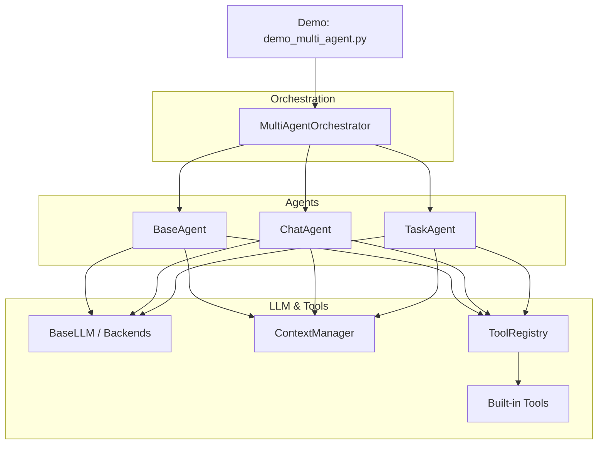
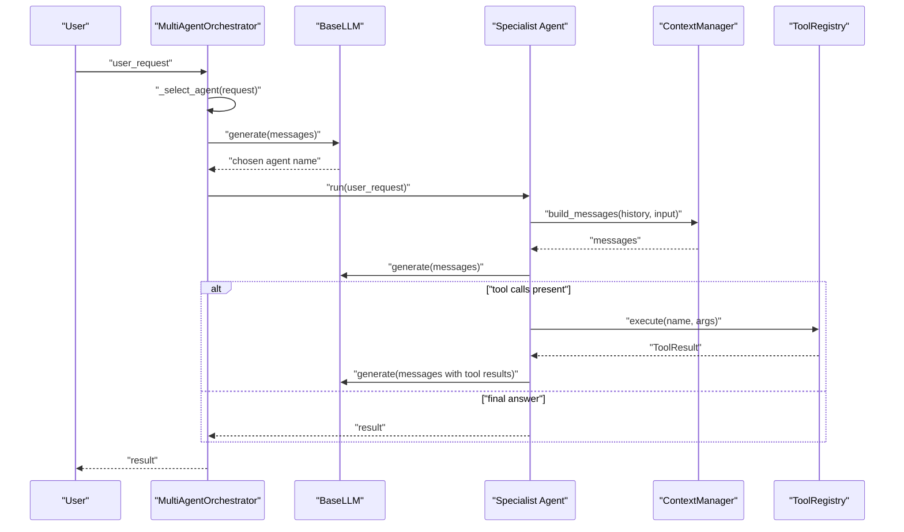
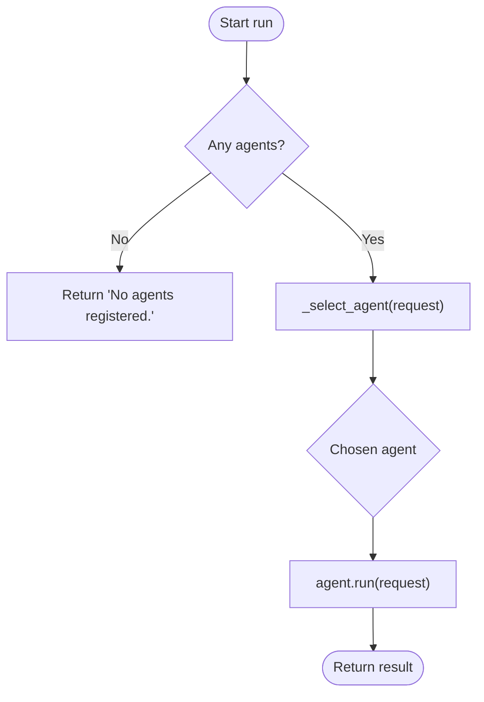
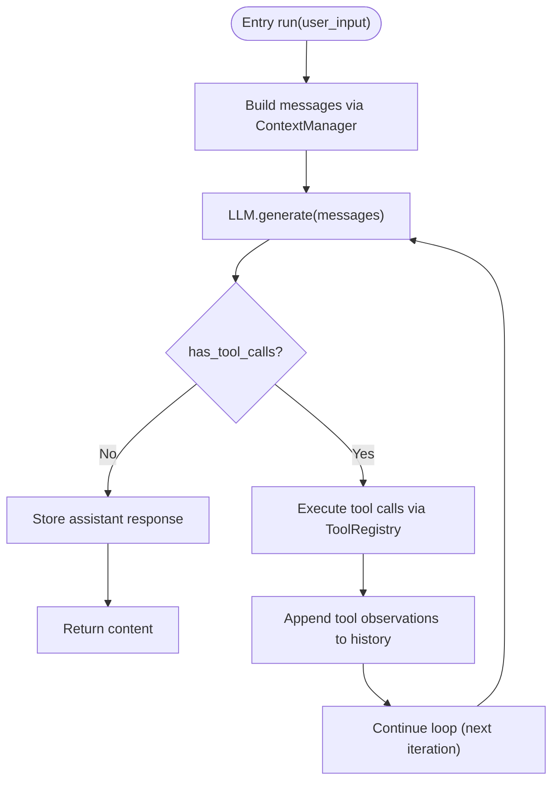
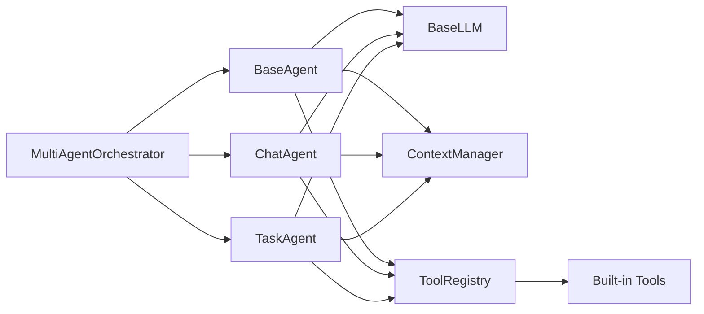

# Multi-Agent Orchestrator

<cite>
**Referenced Files in This Document**
- [orchestrator.py](file://harness/agent/orchestrator.py)
- [base.py](file://harness/agent/base.py)
- [chat.py](file://harness/agent/chat.py)
- [task.py](file://harness/agent/task.py)
- [engine.py](file://harness/llm/engine.py)
- [manager.py](file://harness/context/manager.py)
- [hybrid.py](file://harness/memory/hybrid.py)
- [registry.py](file://harness/tools/registry.py)
- [builtin.py](file://harness/tools/builtin.py)
- [demo_multi_agent.py](file://demos/demo_multi_agent.py)
- [README.md](file://README.md)
</cite>

## Table of Contents
1. [Introduction](#introduction)
2. [Project Structure](#project-structure)
3. [Core Components](#core-components)
4. [Architecture Overview](#architecture-overview)
5. [Detailed Component Analysis](#detailed-component-analysis)
6. [Dependency Analysis](#dependency-analysis)
7. [Performance Considerations](#performance-considerations)
8. [Troubleshooting Guide](#troubleshooting-guide)
9. [Conclusion](#conclusion)
10. [Appendices](#appendices)

## Introduction
This document explains the MultiAgentOrchestrator class that coordinates multiple specialized agents to complete complex tasks. It covers orchestration patterns, agent specialization strategies, task delegation mechanisms, and how to define agent roles, assign tasks based on capabilities, and coordinate inter-agent communication. Practical examples illustrate supervisor-subagent relationships, task decomposition, and result consolidation. It also addresses configuration options for agent discovery, load balancing, failure recovery, conflict resolution, resource sharing, and maintaining consistent state across multiple agents. Finally, it provides guidance on designing effective agent hierarchies and optimizing multi-agent workflows for performance and reliability.

## Project Structure
The multi-agent system is built around a small set of well-defined modules:
- Agent core loop and specialized agents (BaseAgent, ChatAgent, TaskAgent)
- Orchestrator that routes requests to appropriate agents
- LLM engine abstraction with backends
- Context manager assembling prompts from memory and tools
- Tool registry and built-in tools
- Demo wiring showing how to compose agents and tools

**Diagram sources**
- [orchestrator.py:31-152](file://harness/agent/orchestrator.py#L31-L152)
- [base.py:63-165](file://harness/agent/base.py#L63-L165)
- [chat.py:25-60](file://harness/agent/chat.py#L25-L60)
- [task.py:32-73](file://harness/agent/task.py#L32-L73)
- [engine.py:127-421](file://harness/llm/engine.py#L127-L421)
- [manager.py:41-118](file://harness/context/manager.py#L41-L118)
- [registry.py:17-74](file://harness/tools/registry.py#L17-L74)
- [builtin.py:13-83](file://harness/tools/builtin.py#L13-L83)
- [demo_multi_agent.py:17-47](file://demos/demo_multi_agent.py#L17-L47)

**Section sources**
- [README.md:73-131](file://README.md#L73-L131)

## Core Components
- MultiAgentOrchestrator: Supervisor that selects and delegates tasks to registered specialist agents, optionally running all agents and consolidating results.
- BaseAgent: Implements the agent loop (build context, call LLM, execute tool calls, repeat until final answer).
- ChatAgent: Conversational agent optimized for multi-turn dialogue.
- TaskAgent: Task-oriented agent with higher iteration budget and structured output handling.
- LLM Engine: Abstract interface and backends (TransformersBackend, MockBackend) providing generate() and tool-call parsing.
- ContextManager: Assembles messages from system prompt, tool descriptions, memory, history, and current input.
- ToolRegistry and Built-in Tools: Central catalog and execution of tools like CalculatorTool and DateTimeTool.

Key responsibilities:
- Orchestration: route user requests to the best agent(s), aggregate outputs.
- Specialization: each agent has its own tools, memory, and system prompt.
- Execution: agent loop drives iterative reasoning and tool usage.

**Section sources**
- [orchestrator.py:31-152](file://harness/agent/orchestrator.py#L31-L152)
- [base.py:63-165](file://harness/agent/base.py#L63-L165)
- [chat.py:25-60](file://harness/agent/chat.py#L25-L60)
- [task.py:32-73](file://harness/agent/task.py#L32-L73)
- [engine.py:127-421](file://harness/llm/engine.py#L127-L421)
- [manager.py:41-118](file://harness/context/manager.py#L41-L118)
- [registry.py:17-74](file://harness/tools/registry.py#L17-L74)
- [builtin.py:13-83](file://harness/tools/builtin.py#L13-L83)

## Architecture Overview
The orchestrator implements a supervisor pattern:
- The orchestrator receives a user request and decides which specialist agent should handle it.
- Specialist agents use their own tools and memory to complete sub-tasks.
- The orchestrator returns the selected agent’s result or aggregates results when using run_with_all.

**Diagram sources**
- [orchestrator.py:61-152](file://harness/agent/orchestrator.py#L61-L152)
- [base.py:97-160](file://harness/agent/base.py#L97-L160)
- [manager.py:61-104](file://harness/context/manager.py#L61-L104)
- [registry.py:43-67](file://harness/tools/registry.py#L43-L67)
- [engine.py:127-241](file://harness/llm/engine.py#L127-L241)

## Detailed Component Analysis

### MultiAgentOrchestrator
Responsibilities:
- Maintain a pool of registered agents with descriptions.
- Select the best agent via LLM-based routing with keyword fallback.
- Delegate tasks and return single or aggregated results.

Key methods:
- register_agent: associate an agent with a name and description used by the router.
- run: select one agent and delegate; returns its result.
- run_with_all: run through all agents and collect results per agent.
- _select_agent: prompt LLM with agent list and request; parse response; fallback to keyword matching; default to first agent if needed.

Routing strategy:
- LLM-based selection using a supervisor prompt listing available agents and their descriptions.
- Keyword-based fallback for math/calculator, time/date, and general chat categories.
- Default to first registered agent if no match.

Result handling:
- Single-agent path returns the chosen agent’s output directly.
- All-agents path returns a mapping of agent name to result for multi-perspective answers.

**Diagram sources**
- [orchestrator.py:61-91](file://harness/agent/orchestrator.py#L61-L91)
- [orchestrator.py:105-145](file://harness/agent/orchestrator.py#L105-L145)

**Section sources**
- [orchestrator.py:31-152](file://harness/agent/orchestrator.py#L31-L152)

### BaseAgent and Agent Loop
Responsibilities:
- Build context via ContextManager.
- Call LLM and interpret responses.
- Execute tool calls and feed results back into the loop.
- Stop when a final answer is produced or max iterations reached.

Loop steps:
- Build messages from system prompt, tool descriptions, memory, history, and current input.
- Generate response; if no tool calls, store assistant response and return content.
- If tool calls exist, execute them via ToolRegistry, append observations, and continue loop.

Error handling:
- Tool execution errors are captured and returned as observations to guide the LLM.
- Max iterations enforced to prevent infinite loops; fallback message returned if exceeded.

**Diagram sources**
- [base.py:97-160](file://harness/agent/base.py#L97-L160)
- [manager.py:61-104](file://harness/context/manager.py#L61-L104)
- [registry.py:43-67](file://harness/tools/registry.py#L43-L67)

**Section sources**
- [base.py:63-165](file://harness/agent/base.py#L63-L165)

### ChatAgent and TaskAgent
- ChatAgent: Optimized for conversational interactions with shorter iteration budgets and minimal verbosity. Provides convenience methods for chat and conversation management.
- TaskAgent: Task-oriented with a longer iteration budget and structured output handling via execute_task. Uses a task-focused system prompt encouraging step-by-step tool usage.

These agents inherit the agent loop from BaseAgent and customize behavior via system prompts, tool registries, and iteration limits.

**Section sources**
- [chat.py:25-60](file://harness/agent/chat.py#L25-L60)
- [task.py:32-73](file://harness/agent/task.py#L32-L73)

### LLM Engine and Tool Parsing
- BaseLLM defines the generate interface and model info retrieval.
- TransformersBackend loads models, applies chat templates, generates tokens, parses tool calls, and returns structured responses.
- MockBackend simulates tool calling behavior for demos without GPU.
- ToolCallParser extracts tool calls from free-form text using multiple patterns.

This abstraction allows the orchestrator and agents to remain backend-agnostic while supporting real models and deterministic mocks.

**Section sources**
- [engine.py:127-421](file://harness/llm/engine.py#L127-L421)

### Context Manager and Memory
- ContextManager builds messages by combining system prompt, tool descriptions, relevant long-term memory, recent short-term memory, and current input.
- HybridMemory merges short-term buffer and long-term storage, retrieving relevant past memories to augment context.

This ensures agents operate with concise yet informative prompts tailored to the current task.

**Section sources**
- [manager.py:41-118](file://harness/context/manager.py#L41-L118)
- [hybrid.py:22-84](file://harness/memory/hybrid.py#L22-L84)

### Tools and Registry
- ToolRegistry centralizes tool registration, listing, and execution with error handling.
- Built-in tools include CalculatorTool and DateTimeTool, demonstrating safe and constrained tool implementations.

Agents attach specific tool registries to specialize capabilities (e.g., MathAgent with calculator, TimeAgent with datetime).

**Section sources**
- [registry.py:17-74](file://harness/tools/registry.py#L17-L74)
- [builtin.py:13-83](file://harness/tools/builtin.py#L13-L83)

### Demo: Wiring Agents and Orchestrator
The demo shows how to:
- Create an LLM instance.
- Instantiate the orchestrator.
- Register specialized agents with tool registries and descriptions.
- Route different types of requests to appropriate agents.

This demonstrates supervisor-subagent relationships and practical task delegation.

**Section sources**
- [demo_multi_agent.py:17-47](file://demos/demo_multi_agent.py#L17-L47)

## Dependency Analysis
High-level dependencies:
- Orchestrator depends on BaseAgent subclasses and LLM engine for routing and delegation.
- Agents depend on LLM engine, ContextManager, and ToolRegistry.
- ContextManager depends on Memory and ToolRegistry.
- ToolRegistry depends on BaseTool implementations.

**Diagram sources**
- [orchestrator.py:31-152](file://harness/agent/orchestrator.py#L31-L152)
- [base.py:63-165](file://harness/agent/base.py#L63-L165)
- [chat.py:25-60](file://harness/agent/chat.py#L25-L60)
- [task.py:32-73](file://harness/agent/task.py#L32-L73)
- [engine.py:127-421](file://harness/llm/engine.py#L127-L421)
- [manager.py:41-118](file://harness/context/manager.py#L41-L118)
- [registry.py:17-74](file://harness/tools/registry.py#L17-L74)
- [builtin.py:13-83](file://harness/tools/builtin.py#L13-L83)

**Section sources**
- [README.md:73-131](file://README.md#L73-L131)

## Performance Considerations
- Iteration limits: BaseAgent enforces max_iterations to bound tool-call loops; adjust per agent type (e.g., TaskAgent uses more iterations than ChatAgent).
- Context size: ContextManager estimates token usage; keep prompts concise and rely on HybridMemory to retrieve only relevant past context.
- Tool efficiency: Use focused ToolRegistry per agent to minimize tool description overhead in prompts.
- Routing cost: LLM-based routing incurs an extra generate call; consider caching agent selections for similar requests or using keyword fallback aggressively.
- Parallelism: run_with_all executes agents sequentially; for true parallel execution, wrap agent.run calls in concurrent execution primitives outside the orchestrator.

[No sources needed since this section provides general guidance]

## Troubleshooting Guide
Common issues and remedies:
- No agents registered: Ensure register_agent is called before run; orchestrator returns a clear message if none are found.
- Incorrect agent selection: Verify agent descriptions accurately reflect capabilities; improve keyword fallback rules if necessary.
- Tool execution failures: Inspect ToolRegistry.execute logs and ToolResult.error; ensure tool parameters are valid and tool implementations handle edge cases.
- Infinite loops: Increase max_iterations cautiously; monitor AgentTrace summaries to identify stuck cycles.
- Context overflow: Reduce system prompt length or memory inclusion; rely on HybridMemory.get_relevant_context to limit injected context.

Operational tips:
- Use verbose logging to trace LLM calls, tool executions, and final answers.
- For debugging routing, print the supervisor prompt and agent descriptions to validate selection logic.
- Validate tool schemas and inputs to avoid malformed arguments causing exceptions.

**Section sources**
- [orchestrator.py:61-91](file://harness/agent/orchestrator.py#L61-L91)
- [base.py:116-160](file://harness/agent/base.py#L116-L160)
- [registry.py:43-67](file://harness/tools/registry.py#L43-L67)

## Conclusion
The MultiAgentOrchestrator provides a flexible supervisor pattern for coordinating specialized agents. By defining clear agent roles, attaching appropriate tools, and leveraging LLM-based routing with robust fallbacks, complex tasks can be decomposed and executed efficiently. The base agent loop ensures reliable tool usage and iterative reasoning, while context and memory systems maintain coherent prompts. With careful configuration of iteration limits, tool sets, and routing strategies, multi-agent workflows can achieve strong performance and reliability.

[No sources needed since this section summarizes without analyzing specific files]

## Appendices

### Defining Agent Roles and Assigning Tasks
- Define agent names and concise descriptions to aid routing.
- Attach tool registries that expose only the capabilities relevant to the agent’s role.
- Use TaskAgent for goal-oriented tasks requiring multiple tool calls; use ChatAgent for conversational flows.

**Section sources**
- [orchestrator.py:54-60](file://harness/agent/orchestrator.py#L54-L60)
- [task.py:32-73](file://harness/agent/task.py#L32-L73)
- [chat.py:25-60](file://harness/agent/chat.py#L25-L60)

### Coordinating Inter-Agent Communication
- Current implementation delegates to a single agent per request; for multi-agent collaboration, extend orchestrator to chain agents or fan-out to multiple agents and consolidate outputs.
- Use shared memory or external state stores for cross-agent data sharing if needed.

[No sources needed since this section proposes extensions beyond current code]

### Configuration Options
- LLM backend and model selection via environment variables; see README for supported settings.
- Adjust agent verbosity and iteration limits at instantiation time.
- Configure memory capacity and storage paths in HybridMemory.

**Section sources**
- [README.md:287-299](file://README.md#L287-L299)
- [hybrid.py:25-31](file://harness/memory/hybrid.py#L25-L31)

### Designing Effective Agent Hierarchies
- Keep agent scopes narrow and complementary to reduce ambiguity in routing.
- Provide rich, distinct descriptions to improve LLM-based selection accuracy.
- Prefer hierarchical delegation where a supervisor orchestrates specialists rather than monolithic agents attempting everything.

[No sources needed since this section provides general guidance]

### Optimizing Workflows for Performance and Reliability
- Tune max_iterations per agent type to balance thoroughness and latency.
- Minimize tool descriptions in prompts by registering only necessary tools per agent.
- Use HybridMemory to inject only relevant context, reducing token usage and improving relevance.
- Implement retry and fallback strategies in custom tools and orchestrator extensions for resilience.

[No sources needed since this section provides general guidance]