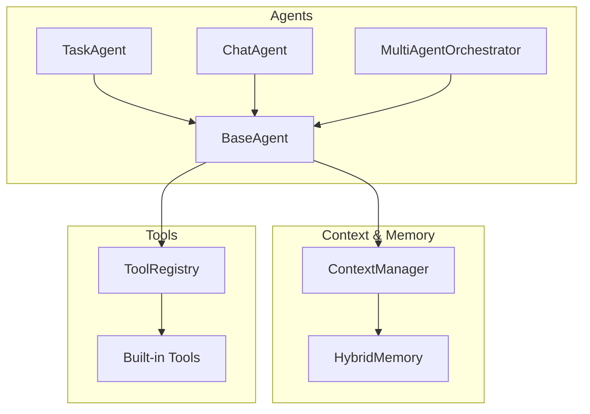
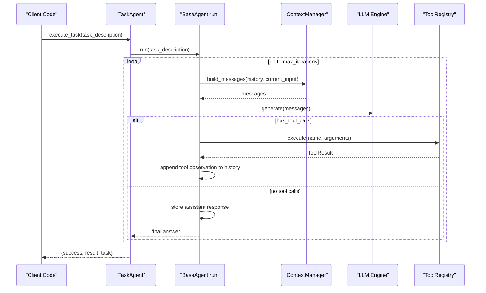
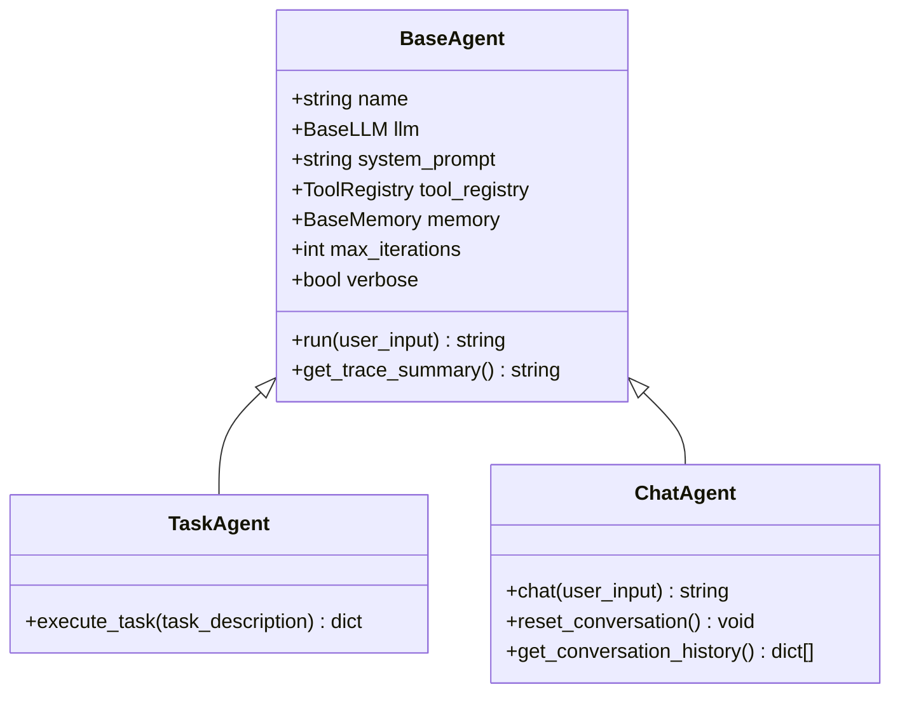
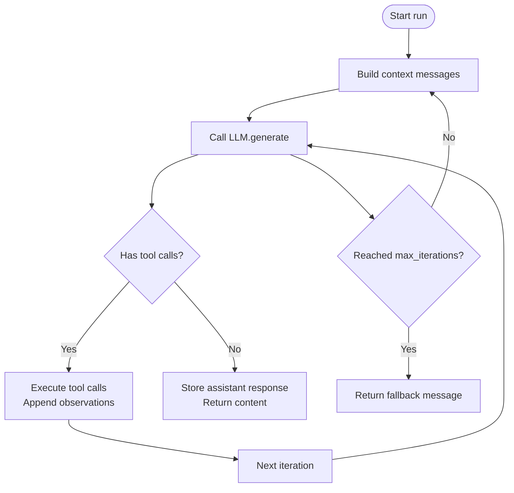
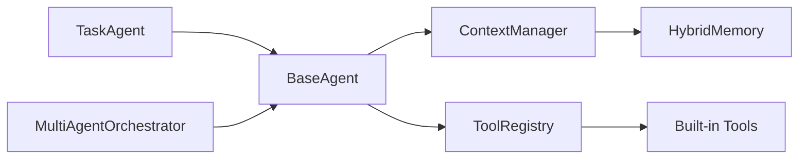

# Task Agent

<cite>
**Referenced Files in This Document**
- [task.py](file://harness/agent/task.py)
- [chat.py](file://harness/agent/chat.py)
- [base.py](file://harness/agent/base.py)
- [manager.py](file://harness/context/manager.py)
- [hybrid.py](file://harness/memory/hybrid.py)
- [registry.py](file://harness/tools/registry.py)
- [builtin.py](file://harness/tools/builtin.py)
- [orchestrator.py](file://harness/agent/orchestrator.py)
- [demo_agent.py](file://demos/demo_agent.py)
- [demo_multi_agent.py](file://demos/demo_multi_agent.py)
- [README.md](file://README.md)
</cite>

## Table of Contents
1. Introduction
2. Project Structure
3. Core Components
4. Architecture Overview
5. Detailed Component Analysis
6. Dependency Analysis
7. Performance Considerations
8. Troubleshooting Guide
9. Conclusion
10. Appendices

## Introduction
This document explains the TaskAgent class and how it is optimized for goal-oriented tasks and automated workflows. It contrasts TaskAgent with ChatAgent, focusing on task completion rather than conversation. It covers structured input processing, goal tracking, result validation, configuration options, success criteria, error handling strategies, and practical automation scenarios including multi-step execution, chaining, parallel execution patterns, and integration with external tools and APIs.

## Project Structure
The harness provides a modular agent framework:
- Agents: BaseAgent (core loop), TaskAgent (goal-oriented), ChatAgent (conversational), Orchestrator (multi-agent coordination)
- Context Manager: assembles system prompt, tool descriptions, memory context, history, and current input
- Memory: HybridMemory combining short-term buffer and long-term retrieval
- Tools: ToolRegistry and built-in tools; extensible via custom tools
- Demos: runnable examples demonstrating single-task and multi-agent orchestration

**Diagram sources**
- [base.py:63-165](file://harness/agent/base.py#L63-L165)
- [task.py:32-73](file://harness/agent/task.py#L32-L73)
- [chat.py:25-60](file://harness/agent/chat.py#L25-L60)
- [orchestrator.py:31-152](file://harness/agent/orchestrator.py#L31-L152)
- [manager.py:41-118](file://harness/context/manager.py#L41-L118)
- [hybrid.py:22-84](file://harness/memory/hybrid.py#L22-L84)
- [registry.py:17-74](file://harness/tools/registry.py#L17-L74)
- [builtin.py:13-83](file://harness/tools/builtin.py#L13-L83)

**Section sources**
- [README.md:73-131](file://README.md#L73-L131)

## Core Components
- TaskAgent: A specialized agent for completing specific objectives using tools, with higher iteration budget and structured output wrapping.
- BaseAgent: Implements the core agent loop that builds context, calls LLM, executes tool calls, and returns final answers or fallbacks when iterations are exhausted.
- ContextManager: Assembles messages from system prompt, tool descriptions, relevant memory, history, and current input.
- HybridMemory: Combines recent conversation (short-term) with relevant past memories (long-term).
- ToolRegistry and Built-in Tools: Central catalog and execution of tools; includes calculator, datetime, and file operations.
- MultiAgentOrchestrator: Routes requests to specialist agents and aggregates results.

Key differences between TaskAgent and ChatAgent:
- TaskAgent uses a task-focused system prompt and higher max_iterations to support complex multi-step workflows.
- ChatAgent is tuned for conversational turns with lower max_iterations and minimal verbosity by default.
- TaskAgent exposes execute_task which wraps run into a structured result dict for automation pipelines.

**Section sources**
- [task.py:22-73](file://harness/agent/task.py#L22-L73)
- [chat.py:19-60](file://harness/agent/chat.py#L19-L60)
- [base.py:63-165](file://harness/agent/base.py#L63-L165)

## Architecture Overview
The TaskAgent leverages the BaseAgent loop to achieve goal-oriented execution:
- Build context with system prompt, tool instructions, memory, and history
- Call LLM; if tool calls are requested, execute them and feed results back
- Repeat until final answer or max_iterations reached
- Return structured result for automation

**Diagram sources**
- [base.py:97-160](file://harness/agent/base.py#L97-L160)
- [manager.py:61-104](file://harness/context/manager.py#L61-L104)
- [registry.py:43-67](file://harness/tools/registry.py#L43-L67)
- [task.py:54-73](file://harness/agent/task.py#L54-L73)

## Detailed Component Analysis

### TaskAgent vs ChatAgent
- TaskAgent
  - Purpose: complete a specific objective using tools in a multi-step workflow
  - System prompt: task-oriented instructions emphasizing step-by-step breakdown and clear final answer
  - Configuration: higher max_iterations (default 15), verbose by default
  - API: execute_task returns a structured dict with success, result, and task fields
- ChatAgent
  - Purpose: interactive multi-turn dialogue
  - System prompt: friendly conversational assistant
  - Configuration: lower max_iterations (default 5), non-verbose by default
  - API: chat convenience method; supports conversation reset and history retrieval

**Diagram sources**
- [base.py:63-165](file://harness/agent/base.py#L63-L165)
- [task.py:32-73](file://harness/agent/task.py#L32-L73)
- [chat.py:25-60](file://harness/agent/chat.py#L25-L60)

**Section sources**
- [task.py:22-73](file://harness/agent/task.py#L22-L73)
- [chat.py:19-60](file://harness/agent/chat.py#L19-L60)

### Agent Loop and Goal Tracking
- The agent loop iterates up to max_iterations, building context each time and calling the LLM.
- If the LLM requests tool calls, they are executed and observations are appended to history, enabling iterative refinement.
- When no tool calls are present, the LLM’s content is treated as the final answer and stored in memory.
- If max_iterations is reached without a final answer, a fallback message is returned.

**Diagram sources**
- [base.py:97-160](file://harness/agent/base.py#L97-L160)

**Section sources**
- [base.py:97-160](file://harness/agent/base.py#L97-L160)

### Structured Input Processing and Result Validation
- TaskAgent.execute_task wraps run into a structured result dictionary containing success, result, and task description.
- Success is currently set to True when run completes; for robust pipelines, consider extending TaskAgent to validate outputs against success criteria (e.g., presence of expected fields or values).
- For partial completions, you can inspect the result and decide whether to retry, chain additional tasks, or escalate to an orchestrator.

**Section sources**
- [task.py:54-73](file://harness/agent/task.py#L54-L73)

### Task-Specific Configuration Options
- max_iterations: Controls how many tool-call loops are allowed before fallback. TaskAgent defaults to 15 to support complex workflows; ChatAgent defaults to 5.
- verbose: Enables logging/printing during execution. TaskAgent defaults to True; ChatAgent defaults to False.
- tool_registry: Attach only the tools needed for a given task to reduce noise and improve performance.
- memory: Provide a HybridMemory instance to enable short-term and long-term context across steps.

**Section sources**
- [task.py:35-52](file://harness/agent/task.py#L35-L52)
- [chat.py:28-44](file://harness/agent/chat.py#L28-L44)
- [base.py:73-95](file://harness/agent/base.py#L73-L95)

### Error Handling Strategies
- Tool failures: ToolRegistry.execute returns ToolResult with success=False and error details; BaseAgent appends an observation indicating the error, allowing the LLM to self-correct or try alternative approaches.
- Max iterations exceeded: BaseAgent returns a fallback message indicating inability to complete within allowed steps.
- Missing tools: Registry returns a descriptive error listing available tools.

**Section sources**
- [registry.py:43-67](file://harness/tools/registry.py#L43-L67)
- [base.py:127-160](file://harness/agent/base.py#L127-L160)

### Integration with External Tools and APIs
- Register custom tools implementing BaseTool with name, description, parameters, and execute method.
- Use ToolRegistry to make tools available to agents.
- Built-in tools demonstrate safe math evaluation, date/time queries, and read-only file operations.

**Section sources**
- [builtin.py:13-83](file://harness/tools/builtin.py#L13-L83)
- [registry.py:17-74](file://harness/tools/registry.py#L17-L74)

### Chaining Multiple Tasks
- Chain tasks by invoking TaskAgent.execute_task sequentially, passing the previous result where appropriate.
- Clear history between tasks to avoid cross-contamination unless intentional continuity is desired.

**Section sources**
- [demo_agent.py:26-37](file://demos/demo_agent.py#L26-L37)

### Parallel Execution Patterns
- While TaskAgent itself runs sequentially, you can run independent tasks in parallel at the application level (e.g., using threads or async) and aggregate results.
- For coordinated multi-agent workflows, use MultiAgentOrchestrator to route requests to specialists and optionally run all agents to collect diverse perspectives.

**Section sources**
- [orchestrator.py:93-103](file://harness/agent/orchestrator.py#L93-L103)
- [demo_multi_agent.py:41-43](file://demos/demo_multi_agent.py#L41-L43)

### Monitoring Progress
- Enable verbose mode to observe LLM calls, tool invocations, and results.
- Use the agent’s history to track intermediate steps and decisions.
- Extend AgentTrace usage to capture detailed execution traces for debugging and auditing.

**Section sources**
- [base.py:103-155](file://harness/agent/base.py#L103-L155)

## Dependency Analysis
TaskAgent depends on:
- BaseAgent for the core loop and execution flow
- ContextManager for assembling prompts and managing context
- HybridMemory for retaining recent and relevant information
- ToolRegistry and tools for executing actions
- Optional Orchestrator for routing and aggregation in multi-agent setups

**Diagram sources**
- [task.py:32-73](file://harness/agent/task.py#L32-L73)
- [base.py:63-165](file://harness/agent/base.py#L63-L165)
- [manager.py:41-118](file://harness/context/manager.py#L41-L118)
- [hybrid.py:22-84](file://harness/memory/hybrid.py#L22-L84)
- [registry.py:17-74](file://harness/tools/registry.py#L17-L74)
- [builtin.py:13-83](file://harness/tools/builtin.py#L13-L83)
- [orchestrator.py:31-152](file://harness/agent/orchestrator.py#L31-L152)

**Section sources**
- [README.md:135-285](file://README.md#L135-L285)

## Performance Considerations
- Tune max_iterations to balance thoroughness and latency; higher values allow more complex reasoning but increase cost and time.
- Limit tool sets per task to reduce prompt size and decision complexity.
- Use HybridMemory to keep context concise while preserving relevant knowledge.
- Prefer specialized agents (via Orchestrator) for domain-specific tasks to improve accuracy and efficiency.

[No sources needed since this section provides general guidance]

## Troubleshooting Guide
Common issues and resolutions:
- No tools available: Ensure ToolRegistry is initialized and tools are registered before creating TaskAgent.
- Tool execution errors: Inspect ToolResult.error; adjust inputs or implement retries/fallbacks in custom tools.
- Incomplete tasks: Increase max_iterations or refine system prompt/tool descriptions to guide better planning.
- Excessive context: Reduce memory capacity or tune HybridMemory retrieval to fit model constraints.

**Section sources**
- [registry.py:43-67](file://harness/tools/registry.py#L43-L67)
- [base.py:157-160](file://harness/agent/base.py#L157-L160)
- [manager.py:61-118](file://harness/context/manager.py#L61-L118)

## Conclusion
TaskAgent is purpose-built for goal-oriented automation. It extends the core agent loop with task-focused prompting, higher iteration budgets, and structured results. By combining precise tool selection, memory-aware context, and optional multi-agent orchestration, it supports robust, scalable workflows. For conversational applications, prefer ChatAgent; for task completion, TaskAgent provides the right balance of autonomy and control.

[No sources needed since this section summarizes without analyzing specific files]

## Appendices

### Concrete Automation Scenarios
- Single-step task: Use TaskAgent with built-in tools to compute expressions, fetch date/time, or read files.
- Multi-step task: Chain multiple execute_task calls, passing intermediate results to subsequent tasks.
- Multi-agent scenario: Register TaskAgent instances specialized for different domains under an Orchestrator to route and aggregate results.

**Section sources**
- [demo_agent.py:26-37](file://demos/demo_agent.py#L26-L37)
- [demo_multi_agent.py:25-43](file://demos/demo_multi_agent.py#L25-L43)

### Defining Success Criteria and Validating Results
- Define criteria at the application layer based on the expected structure or content of result.
- Validate fields, types, and ranges; handle partial completions by chaining follow-up tasks or escalating to human review.
- Log outcomes and metrics for continuous improvement.

[No sources needed since this section provides general guidance]