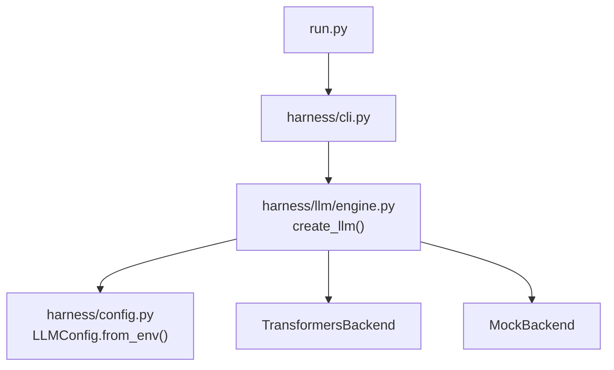
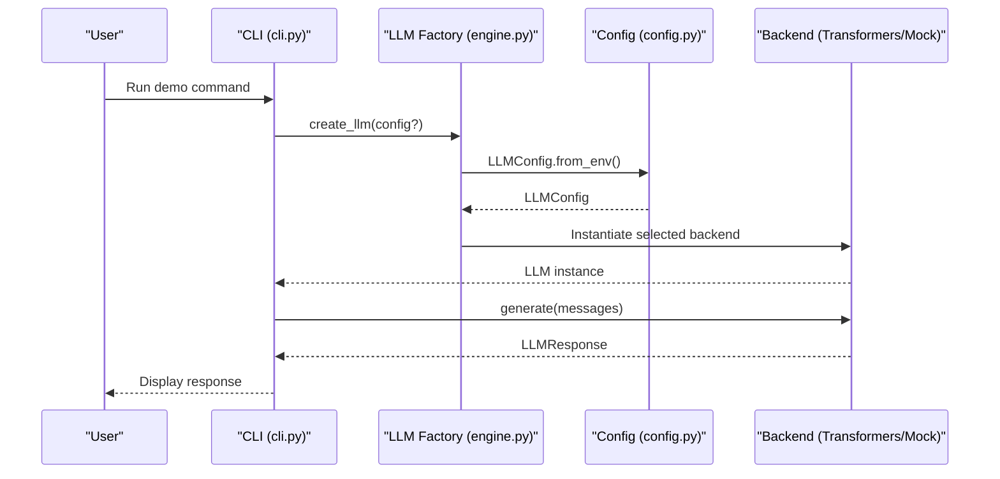
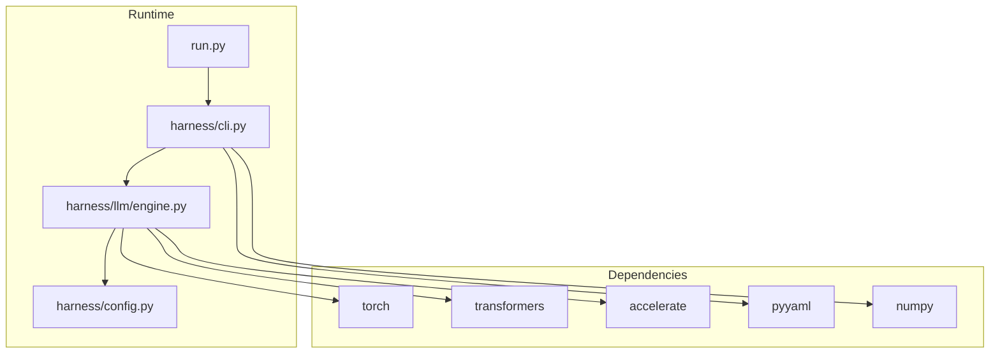

# Configuration and Deployment

<cite>
**Referenced Files in This Document**
- [config.py](file://harness/config.py)
- [engine.py](file://harness/llm/engine.py)
- [cli.py](file://harness/cli.py)
- [run.py](file://run.py)
- [setup.sh](file://setup.sh)
- [pyproject.toml](file://pyproject.toml)
- [requirements.txt](file://requirements.txt)
- [README.md](file://README.md)
</cite>

## Table of Contents
1. Introduction
2. Project Structure
3. Core Components
4. Architecture Overview
5. Detailed Component Analysis
6. Dependency Analysis
7. Performance Considerations
8. Troubleshooting Guide
9. Conclusion
10. Appendices

## Introduction
This document provides comprehensive guidance for environment setup, runtime configuration, and production deployment strategies for the HarnessAIDemo project. It covers environment variables, configuration classes, CLI interface options, LLM backend selection, model configuration, device optimization, resource management, containerization, scaling considerations, monitoring setup, and production readiness checks. It also addresses configuration validation, default values, and migration strategies across different deployment environments.

## Project Structure
The project exposes a simple CLI entry point that delegates to a command router. Configuration is centralized in dataclasses with environment-driven overrides. The LLM engine abstracts backends (Transformers or Mock) and selects devices automatically when configured.

**Diagram sources**
- [run.py:18-27](file://run.py#L18-L27)
- [cli.py:331-357](file://harness/cli.py#L331-L357)
- [engine.py:404-421](file://harness/llm/engine.py#L404-L421)
- [config.py:25-34](file://harness/config.py#L25-L34)

**Section sources**
- [run.py:1-27](file://run.py#L1-L27)
- [cli.py:1-362](file://harness/cli.py#L1-L362)
- [engine.py:1-421](file://harness/llm/engine.py#L1-L421)
- [config.py:1-70](file://harness/config.py#L1-L70)

## Core Components
- Environment-driven configuration via dataclasses with sensible defaults and environment variable overrides.
- LLM factory that instantiates either Transformers or Mock backend based on configuration.
- CLI that routes commands to demo functions, which construct agents, tools, memory, and sessions.

Key responsibilities:
- Configuration: Define and load settings from environment variables.
- LLM Engine: Abstract interface and concrete backends; device auto-detection; token generation parameters.
- CLI: Provide user-facing commands and usage hints.

**Section sources**
- [config.py:8-69](file://harness/config.py#L8-L69)
- [engine.py:127-421](file://harness/llm/engine.py#L127-L421)
- [cli.py:39-176](file://harness/cli.py#L39-L176)

## Architecture Overview
The runtime architecture centers around an LLM abstraction with pluggable backends. Configuration flows from environment variables into dataclasses, then into the LLM factory, which constructs the appropriate backend. Demos wire up agents, tools, memory, and sessions using the created LLM instance.

**Diagram sources**
- [cli.py:39-176](file://harness/cli.py#L39-L176)
- [engine.py:404-421](file://harness/llm/engine.py#L404-L421)
- [config.py:25-34](file://harness/config.py#L25-L34)

## Detailed Component Analysis

### Configuration System
- LLMConfig: Controls backend selection, model name, generation limits, sampling temperature, and device. Defaults are provided and can be overridden by environment variables.
- MemoryConfig: Controls short-term capacity, long-term persistence toggle, storage file path, and similarity threshold.
- AgentConfig: Controls agent identity, system prompt, iteration limits, and verbosity.
- HarnessConfig: Aggregates sub-configurations and provides a default builder that loads LLM config from environment.

Environment variables:
- HARNESS_LLM_BACKEND: Selects backend ("transformers" or "mock").
- HARNESS_MODEL_NAME: HuggingFace model identifier.
- HARNESS_MAX_TOKENS: Maximum tokens per generation.
- HARNESS_TEMPERATURE: Sampling temperature.
- HARNESS_DEVICE: Device selector ("cpu", "cuda", "mps", "auto").

Validation and defaults:
- Defaults ensure operation without explicit configuration.
- Type conversions occur during environment loading (int/float).
- Unknown backend raises an error at instantiation time.

Migration strategy:
- Start with mock backend for fast iteration.
- Switch to transformers backend and adjust model, device, and tokens for performance tuning.
- Persist memory store path changes carefully to avoid breaking existing sessions.

**Section sources**
- [config.py:8-69](file://harness/config.py#L8-L69)
- [engine.py:404-421](file://harness/llm/engine.py#L404-L421)

### LLM Engine and Backends
- BaseLLM: Abstract interface defining generate and get_model_info.
- TransformersBackend: Loads models via transformers, applies chat templates, generates tokens with configurable parameters, parses tool calls, and reports model info including device.
- MockBackend: Deterministic pattern-based responses for demos without GPU requirements.
- create_llm(): Factory that reads configuration and returns the appropriate backend.

Device optimization:
- Auto device detection prefers CUDA if available, then MPS, otherwise CPU.
- Dtype selection uses float16 for non-CPU to reduce memory usage.

Generation parameters:
- max_new_tokens controls output length.
- temperature controls randomness; do_sample toggles based on temperature.

Tool call parsing:
- Extracts structured tool calls from raw text using multiple patterns and removes them from content.

**Section sources**
- [engine.py:127-249](file://harness/llm/engine.py#L127-L249)
- [engine.py:254-421](file://harness/llm/engine.py#L254-L421)

### CLI Interface Options
- Entry point run.py delegates to harness.cli.main.
- Available commands: chat, agent, multi-agent, mcp, skills, session.
- Usage help includes tips for mock backend usage.
- Each demo constructs necessary components (LLM, tools, memory, sessions) and runs interactive or scripted workflows.

Environment integration:
- Demos rely on create_llm(), which respects environment variables for backend and model selection.

**Section sources**
- [run.py:1-27](file://run.py#L1-L27)
- [cli.py:1-362](file://harness/cli.py#L1-L362)

### Setup and Installation
- setup.sh automates virtual environment creation, dependency installation, and editable package install.
- Requires Python 3.11; validates version before proceeding.
- Provides instructions for activation and running demos, including mock backend usage.

**Section sources**
- [setup.sh:1-77](file://setup.sh#L1-L77)

### Dependencies and Packaging
- pyproject.toml defines project metadata, dependencies, and console script entry point.
- requirements.txt lists pinned minimum versions for core libraries.
- Console script harness-demo maps to harness.cli:main.

**Section sources**
- [pyproject.toml:1-27](file://pyproject.toml#L1-L27)
- [requirements.txt:1-14](file://requirements.txt#L1-L14)

## Dependency Analysis
High-level runtime dependencies:
- torch and transformers for model loading and inference.
- accelerate for optimized loading and device handling.
- rich for enhanced CLI output.
- pyyaml for skill frontmatter parsing.
- numpy for numerical operations.

Runtime flow dependencies:
- CLI depends on LLM engine and demo modules.
- LLM engine depends on configuration and optional third-party libraries.
- Demos depend on tools, memory, and session managers.

**Diagram sources**
- [run.py:18-27](file://run.py#L18-L27)
- [cli.py:331-357](file://harness/cli.py#L331-L357)
- [engine.py:171-204](file://harness/llm/engine.py#L171-L204)
- [requirements.txt:1-14](file://requirements.txt#L1-L14)

**Section sources**
- [requirements.txt:1-14](file://requirements.txt#L1-L14)
- [pyproject.toml:13-23](file://pyproject.toml#L13-L23)

## Performance Considerations
- Model selection: Smaller models (e.g., 0.5B) reduce memory footprint and improve latency on constrained hardware.
- Device selection: Use CUDA for best performance when available; MPS for Apple Silicon; fallback to CPU.
- Dtype optimization: float16 reduces memory usage on supported devices.
- Token limits: Adjust max_new_tokens to balance response length vs. latency and cost.
- Temperature: Lower values produce more deterministic outputs; higher values increase creativity but may reduce consistency.
- Tool call parsing overhead: Keep prompts concise to minimize parsing complexity.

[No sources needed since this section provides general guidance]

## Troubleshooting Guide
Common issues and resolutions:
- Missing dependencies: Install required packages via setup.sh or pip install -r requirements.txt.
- Unknown backend: Ensure HARNESS_LLM_BACKEND is set to "transformers" or "mock".
- Device errors: Verify CUDA/MPS availability; fall back to CPU if unavailable.
- Model download failures: Check network access and HuggingFace Hub availability; consider caching models locally.
- Excessive memory usage: Reduce model size, lower dtype precision, or decrease max_new_tokens.
- Session/memory files: Ensure write permissions for memory_store.json and session directories.

Operational checks:
- Validate environment variables before starting services.
- Confirm backend selection and device mapping via get_model_info().
- Log levels can be adjusted for verbose diagnostics.

**Section sources**
- [engine.py:171-204](file://harness/llm/engine.py#L171-L204)
- [engine.py:243-249](file://harness/llm/engine.py#L243-L249)
- [cli.py:19-25](file://harness/cli.py#L19-L25)

## Conclusion
HarnessAIDemo provides a flexible, environment-driven configuration system with pluggable LLM backends and a straightforward CLI. For production deployments, prefer the Transformers backend with appropriate device and dtype settings, tune generation parameters, and implement robust monitoring and logging. Use the Mock backend for rapid development and testing. Adopt consistent environment variable conventions and validate configurations early to ensure reliable operation across environments.

[No sources needed since this section summarizes without analyzing specific files]

## Appendices

### Environment Variables Reference
- HARNESS_LLM_BACKEND: Backend selection ("transformers" or "mock").
- HARNESS_MODEL_NAME: HuggingFace model identifier.
- HARNESS_MAX_TOKENS: Maximum tokens per generation.
- HARNESS_TEMPERATURE: Sampling temperature.
- HARNESS_DEVICE: Device selector ("cpu", "cuda", "mps", "auto").

**Section sources**
- [config.py:25-34](file://harness/config.py#L25-L34)
- [README.md:287-298](file://README.md#L287-L298)

### CLI Commands
- python run.py chat: Interactive multi-turn chat.
- python run.py agent: Single agent with tool calling.
- python run.py multi-agent: Multi-agent orchestration.
- python run.py mcp: MCP protocol demonstration.
- python run.py skills: Skill system demonstration.
- python run.py session: Multi-session management demonstration.

**Section sources**
- [run.py:1-27](file://run.py#L1-L27)
- [cli.py:331-357](file://harness/cli.py#L331-L357)

### Production Readiness Checklist
- Pin dependencies and use a reproducible environment (virtualenv or container).
- Set explicit environment variables for backend, model, device, and generation parameters.
- Validate configuration at startup; fail fast on invalid settings.
- Implement health checks for model loading and device availability.
- Configure logging and metrics collection for inference latency and error rates.
- Plan for model caching and artifact management to speed up cold starts.
- Establish rollback procedures for model and configuration changes.

[No sources needed since this section provides general guidance]

### Containerization Guidance
- Base image: Use a Python 3.11 image aligned with requirements.
- Dependencies: Install via requirements.txt; cache layers to optimize builds.
- Environment: Inject configuration through environment variables at runtime.
- Resources: Allocate sufficient CPU/GPU memory; set appropriate device flags if needed.
- Artifacts: Pre-download models or mount cached model directories to reduce startup time.
- Security: Minimize base image surface; avoid embedding secrets in images.

[No sources needed since this section provides general guidance]

### Scaling Considerations
- Horizontal scaling: Run multiple instances behind a load balancer; each instance manages its own sessions and memory stores.
- Concurrency: Tune batch sizes and token limits to match available GPU/CPU resources.
- State management: Externalize sessions and memory stores to shared storage for multi-instance scenarios.
- Monitoring: Track request throughput, latency percentiles, and error rates; alert on anomalies.

[No sources needed since this section provides general guidance]

### Migration Strategies
- Development to staging: Switch from mock to transformers backend; validate model compatibility and performance.
- Staging to production: Finalize device and dtype settings; enable persistent memory stores; enforce strict configuration validation.
- Model updates: Test new models in isolation; compare outputs and performance; roll back if regressions detected.

[No sources needed since this section provides general guidance]