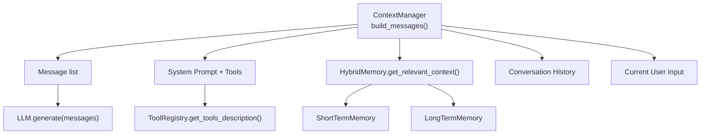
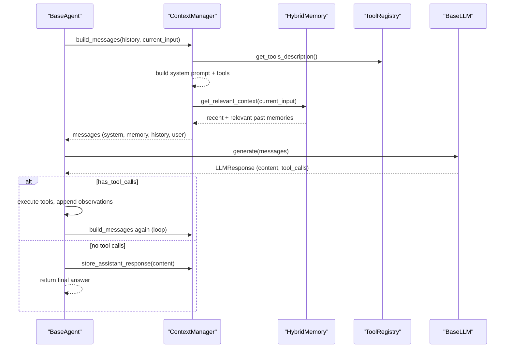
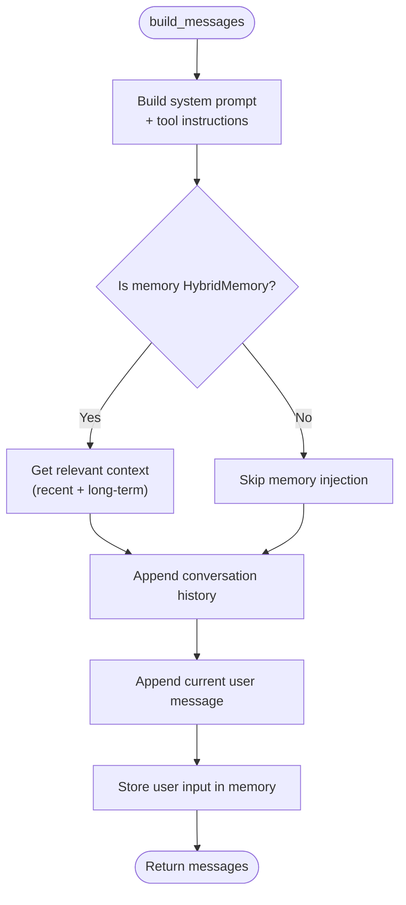
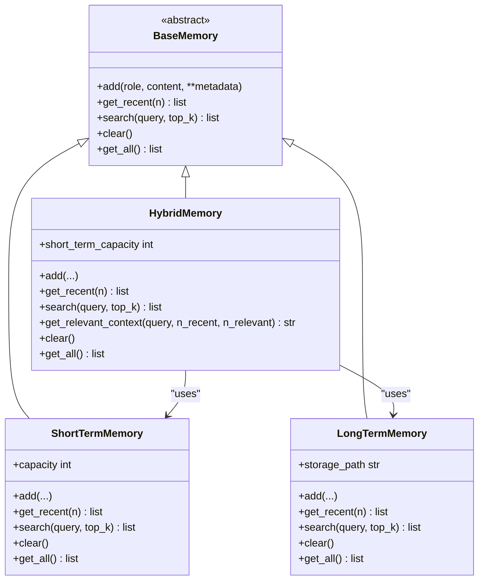
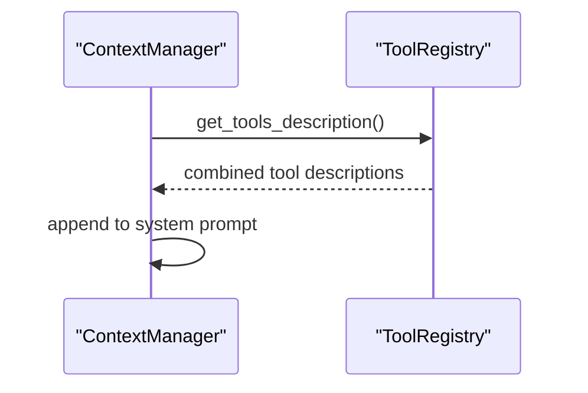
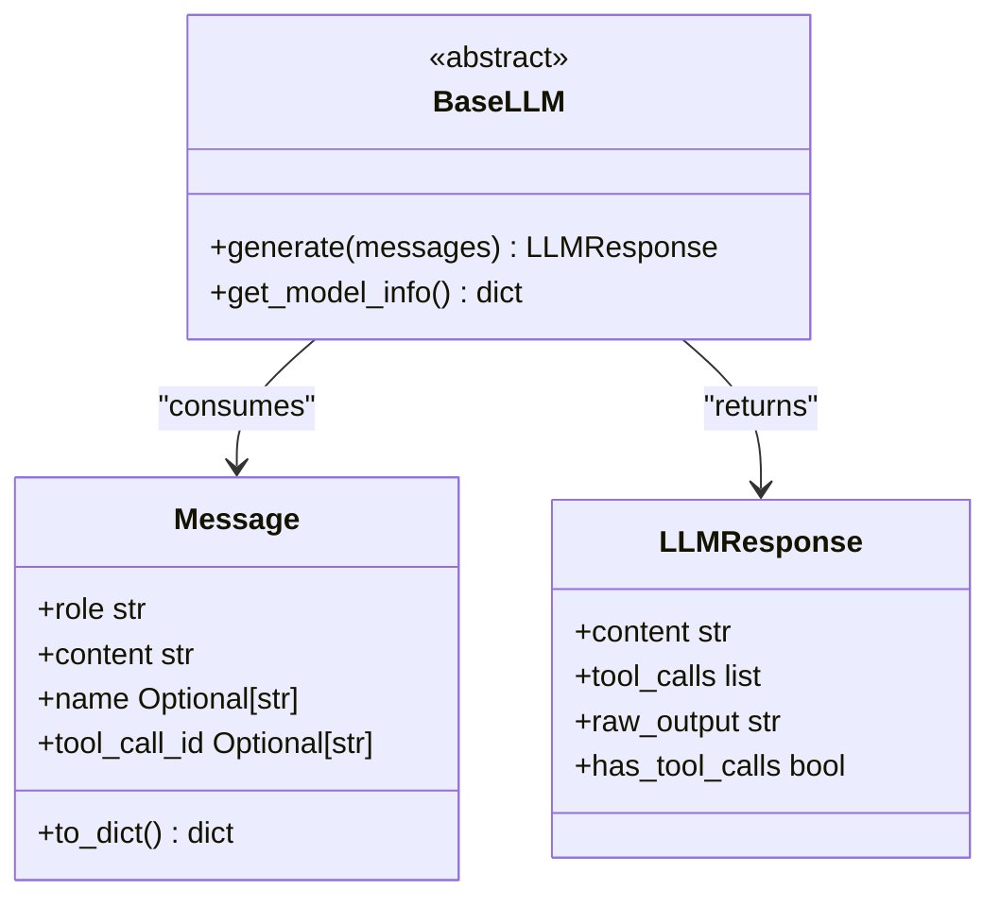
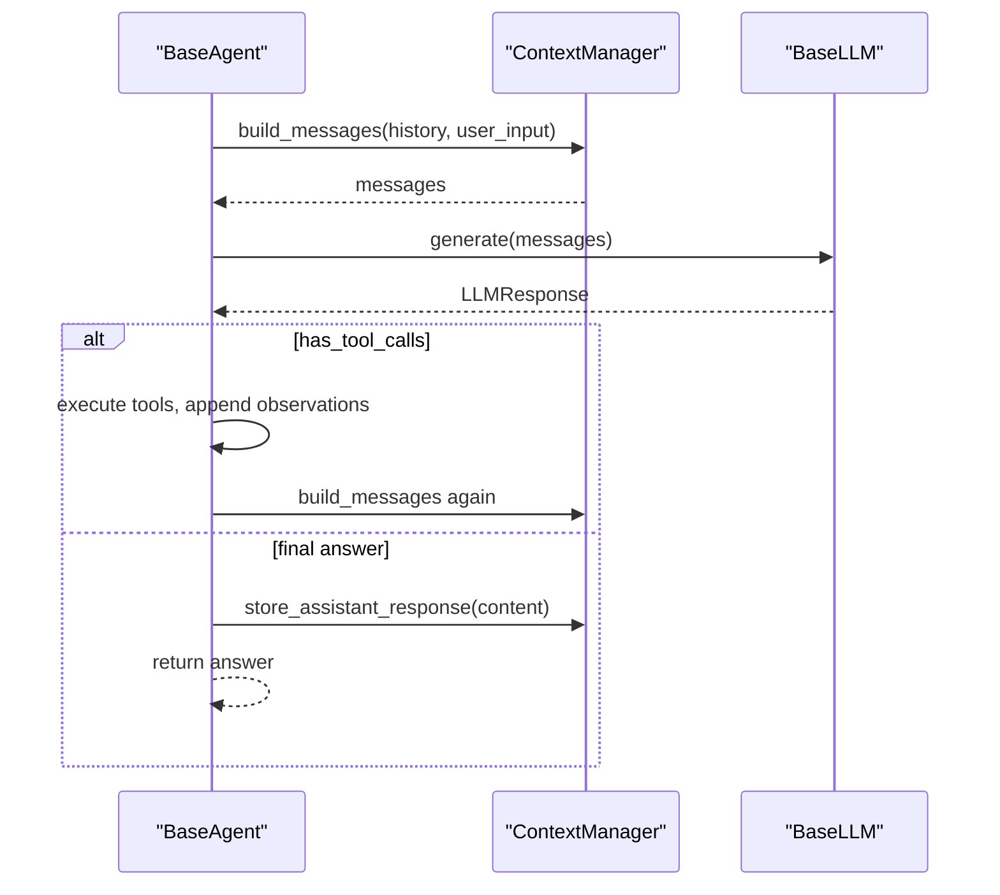
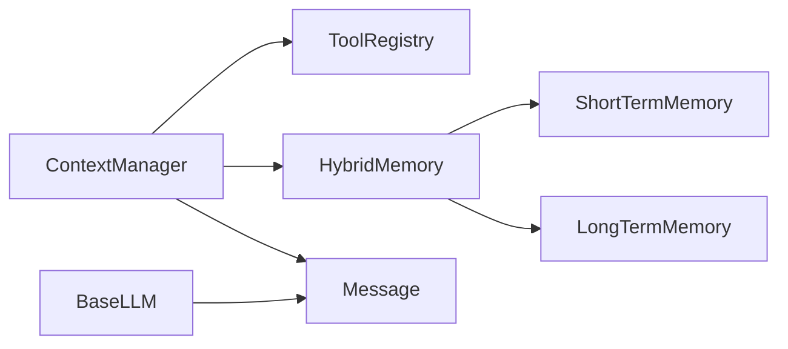

# Context Management

<cite>
**Referenced Files in This Document**
- [manager.py](file://harness/context/manager.py)
- [hybrid.py](file://harness/memory/hybrid.py)
- [base.py](file://harness/memory/base.py)
- [short_term.py](file://harness/memory/short_term.py)
- [long_term.py](file://harness/memory/long_term.py)
- [engine.py](file://harness/llm/engine.py)
- [registry.py](file://harness/tools/registry.py)
- [config.py](file://harness/config.py)
- [base.py](file://harness/agent/base.py)
</cite>

## Table of Contents
1. Introduction
2. Project Structure
3. Core Components
4. Architecture Overview
5. Detailed Component Analysis
6. Dependency Analysis
7. Performance Considerations
8. Troubleshooting Guide
9. Conclusion

## Introduction
This document explains the Context Management sub-component responsible for intelligent prompt assembly and context window optimization. It focuses on how the ContextManager composes system prompts, tool descriptions, memory retrieval, conversation history, and current user input into a single message list for each LLM call. It also covers token estimation strategies, configuration options for context size and memory relevance, relationships with memory systems, and practical guidance to avoid common issues like context overflow and irrelevant information inclusion.

## Project Structure
The context management pipeline spans several modules:
- Context assembly lives in harness/context/manager.py
- Memory abstractions and implementations live in harness/memory/*
- Tool descriptions are provided by harness/tools/registry.py
- The LLM interface and data types (Message, LLMResponse) live in harness/llm/engine.py
- Agent orchestration wires everything together in harness/agent/base.py
- Configuration for memory behavior is defined in harness/config.py

**Diagram sources**
- [manager.py:61-104](file://harness/context/manager.py#L61-L104)
- [hybrid.py:46-73](file://harness/memory/hybrid.py#L46-L73)
- [registry.py:62-67](file://harness/tools/registry.py#L62-L67)
- [engine.py:206-241](file://harness/llm/engine.py#L206-L241)

**Section sources**
- [manager.py:1-118](file://harness/context/manager.py#L1-L118)
- [hybrid.py:1-84](file://harness/memory/hybrid.py#L1-L84)
- [registry.py:1-74](file://harness/tools/registry.py#L1-L74)
- [engine.py:23-57](file://harness/llm/engine.py#L23-L57)
- [base.py:63-95](file://harness/agent/base.py#L63-L95)

## Core Components
- ContextManager: Assembles messages per LLM call, including system prompt, tool instructions, relevant memory, conversation history, and current input. Provides rough token estimation.
- HybridMemory: Combines short-term buffer (recent messages) and long-term storage (persistent knowledge). Builds a merged context string from recent and relevant memories.
- ShortTermMemory: Bounded FIFO buffer of recent messages; supports keyword-based search.
- LongTermMemory: Persistent store with TF-IDF retrieval to find relevant past memories.
- ToolRegistry: Central catalog that provides tool descriptions injected into the system prompt.
- LLM Engine: Defines Message and LLMResponse; backends consume the assembled messages and return responses with optional tool calls.

Key responsibilities:
- Compose a coherent prompt while respecting finite context windows
- Retrieve only relevant memories to reduce noise
- Estimate tokens to help manage context size
- Persist assistant responses for future turns

**Section sources**
- [manager.py:41-118](file://harness/context/manager.py#L41-L118)
- [hybrid.py:22-84](file://harness/memory/hybrid.py#L22-L84)
- [short_term.py:16-50](file://harness/memory/short_term.py#L16-L50)
- [long_term.py:24-109](file://harness/memory/long_term.py#L24-L109)
- [registry.py:17-74](file://harness/tools/registry.py#L17-L74)
- [engine.py:23-57](file://harness/llm/engine.py#L23-L57)

## Architecture Overview
The agent loop builds context via ContextManager, calls the LLM, and handles tool calls or final answers. ContextManager integrates multiple sources to produce a compact, relevant prompt.

**Diagram sources**
- [base.py:97-160](file://harness/agent/base.py#L97-L160)
- [manager.py:61-108](file://harness/context/manager.py#L61-L108)
- [hybrid.py:46-73](file://harness/memory/hybrid.py#L46-L73)
- [registry.py:62-67](file://harness/tools/registry.py#L62-L67)
- [engine.py:206-241](file://harness/llm/engine.py#L206-L241)

## Detailed Component Analysis

### ContextManager: Intelligent Prompt Assembly
- System prompt composition:
  - Starts from a base system prompt
  - Appends tool-calling instructions and a concatenated tool description if tools are registered
- Memory integration:
  - If using HybridMemory, retrieves a combined context string of recent and relevant past memories and injects it as a system message
- Conversation history:
  - Appends all prior messages (user, assistant, tool) to maintain continuity
- Current input:
  - Adds the latest user message at the end
- Persistence:
  - Stores user input and assistant responses in memory for future retrieval
- Token estimation:
  - Provides a rough estimate based on character count divided by an approximate factor

**Diagram sources**
- [manager.py:61-108](file://harness/context/manager.py#L61-L108)

**Section sources**
- [manager.py:41-118](file://harness/context/manager.py#L41-L118)

### HybridMemory: Recent and Relevant Context Merge
- Recent context:
  - Retrieves the most recent N messages from ShortTermMemory
- Relevant long-term context:
  - Searches LongTermMemory for top-K relevant items based on query
  - Filters out duplicates already present in recent context
- Output:
  - Produces a structured string combining recent conversation and relevant past memories

**Diagram sources**
- [base.py:18-64](file://harness/memory/base.py#L18-L64)
- [short_term.py:16-50](file://harness/memory/short_term.py#L16-L50)
- [long_term.py:24-109](file://harness/memory/long_term.py#L24-L109)
- [hybrid.py:22-84](file://harness/memory/hybrid.py#L22-L84)

**Section sources**
- [hybrid.py:22-84](file://harness/memory/hybrid.py#L22-L84)
- [short_term.py:16-50](file://harness/memory/short_term.py#L16-L50)
- [long_term.py:24-109](file://harness/memory/long_term.py#L24-L109)
- [base.py:18-64](file://harness/memory/base.py#L18-L64)

### Tool Descriptions in System Prompt
- ToolRegistry aggregates tool descriptions and returns them as a single string
- ContextManager appends these descriptions after standard tool-calling instructions when tools are available

**Diagram sources**
- [registry.py:62-67](file://harness/tools/registry.py#L62-L67)
- [manager.py:77-83](file://harness/context/manager.py#L77-L83)

**Section sources**
- [registry.py:17-74](file://harness/tools/registry.py#L17-L74)
- [manager.py:77-83](file://harness/context/manager.py#L77-L83)

### LLM Integration and Message Flow
- Message data type carries role, content, and optional metadata
- LLM backends accept a list of Message objects and return LLMResponse with content and optional tool_calls
- ContextManager’s output feeds directly into LLM.generate

**Diagram sources**
- [engine.py:23-57](file://harness/llm/engine.py#L23-L57)
- [engine.py:127-146](file://harness/llm/engine.py#L127-L146)

**Section sources**
- [engine.py:23-57](file://harness/llm/engine.py#L23-L57)
- [engine.py:127-146](file://harness/llm/engine.py#L127-L146)

### Agent Loop Integration
- BaseAgent constructs ContextManager with system prompt, memory, and tool registry
- Each iteration:
  - Build messages via ContextManager
  - Call LLM.generate
  - Handle tool calls or finalize response
  - Store assistant responses in memory for future context

**Diagram sources**
- [base.py:97-160](file://harness/agent/base.py#L97-L160)
- [manager.py:61-108](file://harness/context/manager.py#L61-L108)

**Section sources**
- [base.py:63-160](file://harness/agent/base.py#L63-L160)

## Dependency Analysis
- ContextManager depends on:
  - ToolRegistry for dynamic tool descriptions
  - HybridMemory (or other BaseMemory) for memory retrieval and persistence
  - Message type from LLM engine
- HybridMemory composes ShortTermMemory and LongTermMemory
- LongTermMemory uses TF-IDF retrieval over stored items
- ShortTermMemory uses a bounded deque with keyword overlap scoring
- Agent orchestrates ContextManager and LLM interaction

**Diagram sources**
- [manager.py:19-22](file://harness/context/manager.py#L19-L22)
- [hybrid.py:17-19](file://harness/memory/hybrid.py#L17-L19)
- [short_term.py:11-13](file://harness/memory/short_term.py#L11-L13)
- [long_term.py:16-19](file://harness/memory/long_term.py#L16-L19)
- [engine.py:23-57](file://harness/llm/engine.py#L23-L57)

**Section sources**
- [manager.py:19-22](file://harness/context/manager.py#L19-L22)
- [hybrid.py:17-19](file://harness/memory/hybrid.py#L17-L19)
- [short_term.py:11-13](file://harness/memory/short_term.py#L11-L13)
- [long_term.py:16-19](file://harness/memory/long_term.py#L16-L19)
- [engine.py:23-57](file://harness/llm/engine.py#L23-L57)

## Performance Considerations
- Context window constraints:
  - LLMs have finite context windows; keep prompts concise and relevant
  - Use HybridMemory to limit to recent messages and retrieve only top-K relevant long-term items
- Token estimation:
  - ContextManager provides a rough estimate based on character length; use model-specific tokenizers in production for precise counts
- Retrieval efficiency:
  - LongTermMemory uses TF-IDF; consider vector embeddings and vector databases for large-scale semantic search
- Memory capacity:
  - ShortTermMemory uses a bounded buffer; tune capacity to balance coherence vs. token usage
- Tool descriptions:
  - Only include necessary tools to reduce system prompt size
- Iteration control:
  - Agent loop limits tool-call iterations to prevent runaway loops

[No sources needed since this section provides general guidance]

## Troubleshooting Guide
Common issues and remedies:
- Context overflow:
  - Symptoms: LLM errors or truncated outputs due to exceeding context limits
  - Remedies:
    - Reduce short-term capacity and number of retrieved long-term items
    - Trim conversation history before sending to LLM
    - Use more aggressive filtering in memory retrieval
- Irrelevant information inclusion:
  - Symptoms: Noisy prompts leading to unfocused responses
  - Remedies:
    - Lower top_k for long-term retrieval
    - Increase specificity in queries passed to memory search
    - Ensure tool descriptions are minimal and targeted
- Memory not persisting:
  - Symptoms: Loss of long-term context across sessions
  - Remedies:
    - Verify storage path exists and is writable
    - Check error logs for save/load failures
- Tool call parsing failures:
  - Symptoms: Tool calls not recognized
  - Remedies:
    - Ensure tool-calling format matches expected patterns
    - Validate tool arguments structure

**Section sources**
- [long_term.py:77-105](file://harness/memory/long_term.py#L77-L105)
- [engine.py:61-123](file://harness/llm/engine.py#L61-L123)

## Conclusion
Context Management in this harness centers on assembling a focused, efficient prompt for each LLM call by combining system instructions, tool descriptions, relevant memories, conversation history, and current input. HybridMemory enables balancing recent context with long-term relevance, while ContextManager provides token estimation and message construction. Proper configuration of memory capacities, retrieval thresholds, and tool sets helps avoid context overflow and irrelevant information, improving LLM performance and reliability.

[No sources needed since this section summarizes without analyzing specific files]