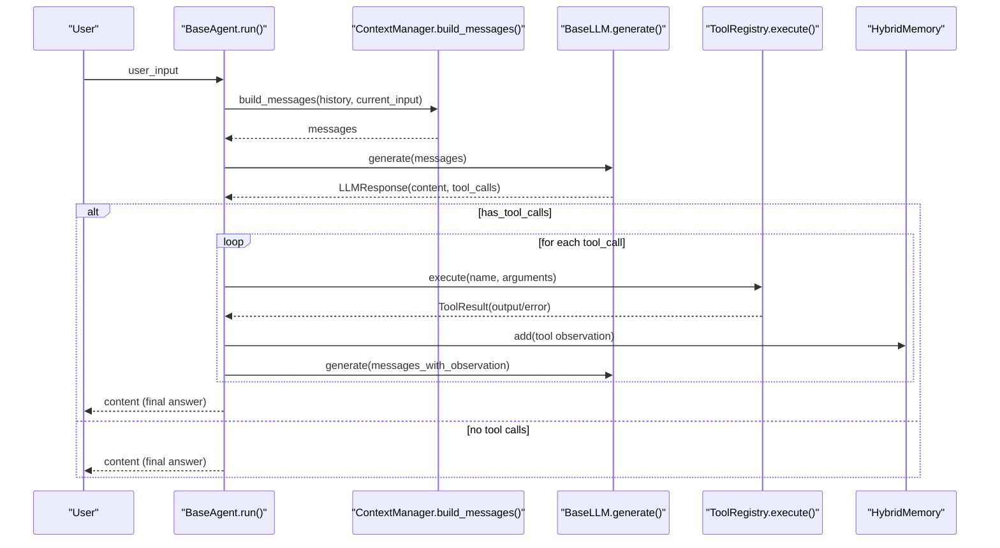
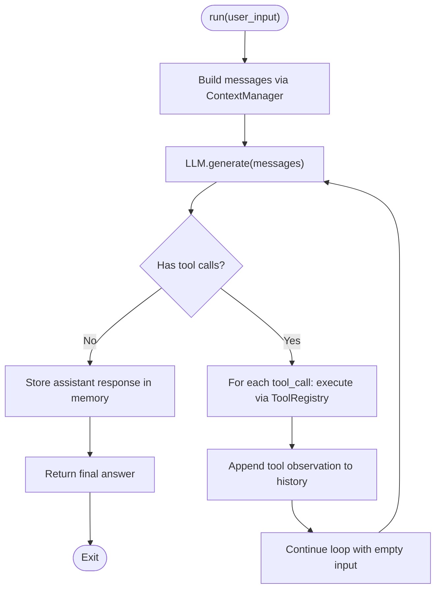
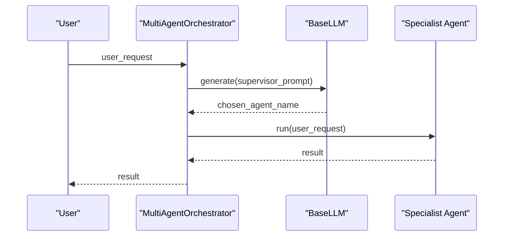
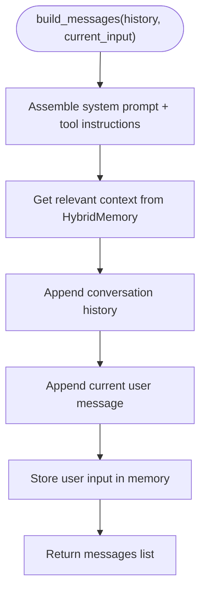
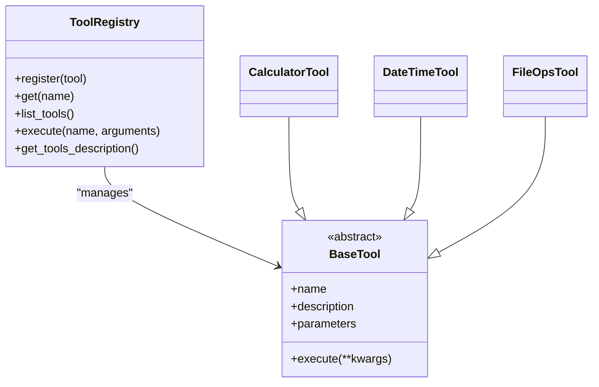
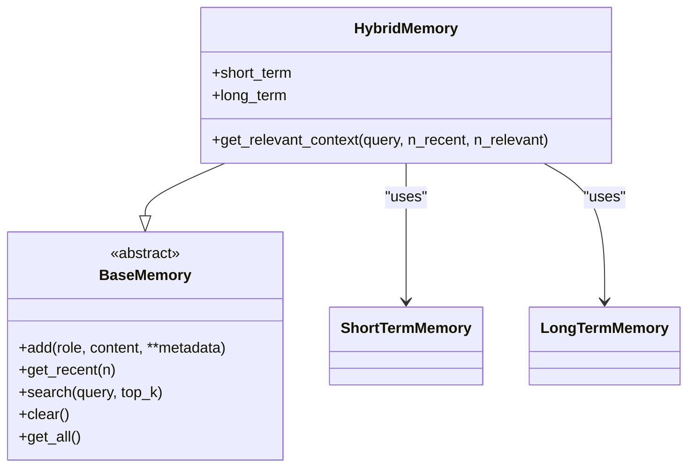
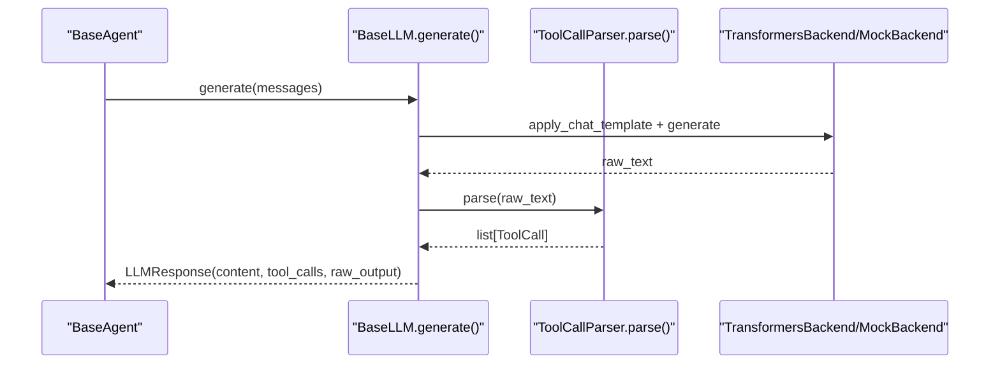
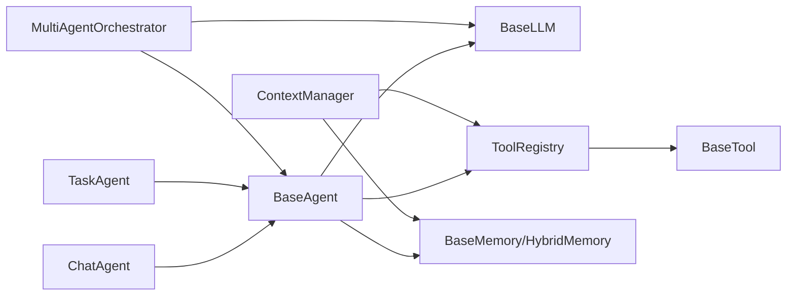

# Agent System

<cite>
**Referenced Files in This Document**
- [base.py](file://harness/agent/base.py)
- [chat.py](file://harness/agent/chat.py)
- [task.py](file://harness/agent/task.py)
- [orchestrator.py](file://harness/agent/orchestrator.py)
- [manager.py](file://harness/context/manager.py)
- [registry.py](file://harness/tools/registry.py)
- [base.py](file://harness/memory/base.py)
- [hybrid.py](file://harness/memory/hybrid.py)
- [engine.py](file://harness/llm/engine.py)
- [builtin.py](file://harness/tools/builtin.py)
- [demo_agent.py](file://demos/demo_agent.py)
- [demo_chat.py](file://demos/demo_chat.py)
- [demo_multi_agent.py](file://demos/demo_multi_agent.py)
</cite>

## Table of Contents
1. Introduction
2. Project Structure
3. Core Components
4. Architecture Overview
5. Detailed Component Analysis
6. Dependency Analysis
7. Performance Considerations
8. Troubleshooting Guide
9. Conclusion
10. Appendices

## Introduction
This document explains the Agent System’s core Agent Loop pattern and agent lifecycle management. It details how the BaseAgent class orchestrates iterative reasoning cycles that transform an LLM into an autonomous agent by repeatedly building context, invoking tools, and synthesizing final answers. It also documents specialized agents (ChatAgent, TaskAgent), multi-agent orchestration via a supervisor pattern, state management through memory and history, error handling strategies, and debugging with the AgentTrace system. Practical usage patterns are illustrated with demo scripts for single-agent tasks, interactive chat, and multi-agent coordination.

## Project Structure
The Agent System is organized around a clear separation of concerns:
- Agents define the execution loop and specialization (BaseAgent, ChatAgent, TaskAgent).
- Context assembly is handled by ContextManager to build prompts with system instructions, tool descriptions, memory, and conversation history.
- Tools are registered and executed via ToolRegistry; built-in tools demonstrate calculator, datetime, and file operations.
- Memory provides short-term and long-term storage via HybridMemory.
- The LLM engine abstracts model backends and parses tool calls from raw text.
- Demos show end-to-end usage for task completion, interactive chat, and multi-agent orchestration.

```mermaid
graph TB
subgraph "Agents"
BA["BaseAgent"]
CA["ChatAgent"]
TA["TaskAgent"]
ORCH["MultiAgentOrchestrator"]
end
subgraph "Context & Memory"
CM["ContextManager"]
HM["HybridMemory"]
end
subgraph "Tools"
TR["ToolRegistry"]
BT["Built-in Tools"]
end
subgraph "LLM"
LLM["BaseLLM / Backends"]
end
BA --> CM
BA --> TR
BA --> LLM
CA --> BA
TA --> BA
ORCH --> BA
CM --> HM
TR --> BT
LLM --> |generate()| BA
```

**Diagram sources**
- [base.py:63-165](file://harness/agent/base.py#L63-L165)
- [chat.py:25-60](file://harness/agent/chat.py#L25-L60)
- [task.py:32-73](file://harness/agent/task.py#L32-L73)
- [orchestrator.py:31-152](file://harness/agent/orchestrator.py#L31-L152)
- [manager.py:41-118](file://harness/context/manager.py#L41-L118)
- [hybrid.py:22-84](file://harness/memory/hybrid.py#L22-L84)
- [registry.py:17-74](file://harness/tools/registry.py#L17-L74)
- [builtin.py:13-83](file://harness/tools/builtin.py#L13-L83)
- [engine.py:127-421](file://harness/llm/engine.py#L127-L421)

**Section sources**
- [base.py:1-165](file://harness/agent/base.py#L1-L165)
- [manager.py:1-118](file://harness/context/manager.py#L1-L118)
- [registry.py:1-74](file://harness/tools/registry.py#L1-L74)
- [hybrid.py:1-84](file://harness/memory/hybrid.py#L1-L84)
- [engine.py:1-421](file://harness/llm/engine.py#L1-L421)

## Core Components
- BaseAgent implements the Agent Loop: iteratively builds messages, calls the LLM, executes tool calls if requested, feeds results back, and returns a final answer or fallback after max iterations.
- ChatAgent specializes BaseAgent for conversational use with shorter iteration limits and convenience methods for chat sessions.
- TaskAgent specializes BaseAgent for task-oriented workflows with higher iteration limits and structured result output.
- MultiAgentOrchestrator coordinates multiple agents using a supervisor prompt to route requests to specialist agents and aggregates results.
- ContextManager assembles the full prompt including system instructions, tool descriptions, relevant memory, and conversation history.
- ToolRegistry centralizes tool registration, description generation, and safe execution with error handling.
- HybridMemory combines short-term buffer and long-term retrieval to provide rich context for each turn.
- LLM Engine defines Message, ToolCall, LLMResponse, parsing logic for tool calls, and backends (TransformersBackend, MockBackend) plus a factory to create engines.

**Section sources**
- [base.py:38-165](file://harness/agent/base.py#L38-L165)
- [chat.py:25-60](file://harness/agent/chat.py#L25-L60)
- [task.py:32-73](file://harness/agent/task.py#L32-L73)
- [orchestrator.py:31-152](file://harness/agent/orchestrator.py#L31-L152)
- [manager.py:41-118](file://harness/context/manager.py#L41-L118)
- [registry.py:17-74](file://harness/tools/registry.py#L17-L74)
- [hybrid.py:22-84](file://harness/memory/hybrid.py#L22-L84)
- [engine.py:23-57](file://harness/llm/engine.py#L23-L57)
- [engine.py:61-123](file://harness/llm/engine.py#L61-L123)
- [engine.py:127-421](file://harness/llm/engine.py#L127-L421)

## Architecture Overview
The Agent System follows a layered architecture where agents orchestrate interactions between the LLM, tools, and memory. The core loop enables autonomous behavior by allowing the LLM to decide when to call tools and when to finalize an answer.



**Diagram sources**
- [base.py:97-160](file://harness/agent/base.py#L97-L160)
- [manager.py:61-104](file://harness/context/manager.py#L61-L104)
- [registry.py:43-67](file://harness/tools/registry.py#L43-L67)
- [hybrid.py:33-44](file://harness/memory/hybrid.py#L33-L44)
- [engine.py:127-241](file://harness/llm/engine.py#L127-L241)

## Detailed Component Analysis

### BaseAgent and the Agent Loop
BaseAgent encapsulates the iterative reasoning cycle that transforms an LLM into an autonomous agent. Each run performs:
- Build context: assemble system prompt, tool descriptions, memory, and conversation history.
- Call LLM: obtain content and optional tool calls.
- If tool calls exist: execute them via ToolRegistry, append observations to history, and continue the loop.
- If no tool calls: store assistant response in memory and return the final answer.
- Fallback: after max_iterations without a final answer, return a polite fallback message.

Key behaviors:
- History management: appends assistant and tool messages to maintain conversation continuity.
- Verbose logging: logs raw LLM output and tool calls/results when enabled.
- AgentTrace: records steps (llm_call, tool_call, tool_result, final_answer) for debugging.



**Diagram sources**
- [base.py:97-160](file://harness/agent/base.py#L97-L160)

**Section sources**
- [base.py:38-165](file://harness/agent/base.py#L38-L165)

### ChatAgent
ChatAgent extends BaseAgent for conversational scenarios:
- Shorter max_iterations to favor quick responses.
- Default friendly system prompt optimized for dialogue.
- Convenience methods: chat(), reset_conversation(), get_conversation_history().

Use cases:
- Interactive chat sessions with tool-calling support.
- Maintaining conversation history while leveraging long-term memory for contextual references.

**Section sources**
- [chat.py:19-60](file://harness/agent/chat.py#L19-L60)

### TaskAgent
TaskAgent extends BaseAgent for task completion:
- Higher max_iterations to allow complex multi-step tool usage.
- Structured output via execute_task returning success, result, and task metadata.
- Verbose mode by default to aid debugging during task execution.

Use cases:
- Multi-step workflows requiring sequential tool calls.
- Tasks needing robust iteration and progress tracking.

**Section sources**
- [task.py:22-73](file://harness/agent/task.py#L22-L73)

### Multi-Agent Orchestrator
MultiAgentOrchestrator implements a supervisor pattern:
- Registers specialist agents with descriptions.
- Routes user requests using an LLM-based selector with keyword-based fallback.
- Executes delegated tasks and aggregates results.
- Supports running all agents for comparative outputs.



**Diagram sources**
- [orchestrator.py:61-91](file://harness/agent/orchestrator.py#L61-L91)
- [orchestrator.py:105-145](file://harness/agent/orchestrator.py#L105-L145)
- [engine.py:127-241](file://harness/llm/engine.py#L127-L241)

**Section sources**
- [orchestrator.py:31-152](file://harness/agent/orchestrator.py#L31-L152)

### Context Manager
ContextManager builds the complete prompt for each LLM call:
- System prompt includes base instructions and tool usage instructions.
- Injects tool descriptions from ToolRegistry into the system message.
- Retrieves relevant long-term context via HybridMemory.
- Appends conversation history and current user input.
- Stores assistant responses in memory for future turns.



**Diagram sources**
- [manager.py:61-104](file://harness/context/manager.py#L61-L104)

**Section sources**
- [manager.py:41-118](file://harness/context/manager.py#L41-L118)

### Tool Registry and Built-in Tools
ToolRegistry manages tool registration, listing, and execution:
- Provides tool descriptions for system prompts.
- Executes tools safely with error handling and returns ToolResult.
- Built-in tools include CalculatorTool, DateTimeTool, and FileOpsTool demonstrating safe evaluation, time queries, and read-only file operations.



**Diagram sources**
- [registry.py:17-74](file://harness/tools/registry.py#L17-L74)
- [builtin.py:13-83](file://harness/tools/builtin.py#L13-L83)

**Section sources**
- [registry.py:17-74](file://harness/tools/registry.py#L17-L74)
- [builtin.py:13-83](file://harness/tools/builtin.py#L13-L83)

### Memory System
HybridMemory combines short-term and long-term memory:
- ShortTermMemory maintains recent conversation context.
- LongTermMemory persists user and assistant messages for retrieval.
- get_relevant_context merges recent and relevant memories for richer prompts.



**Diagram sources**
- [base.py:18-64](file://harness/memory/base.py#L18-L64)
- [hybrid.py:22-84](file://harness/memory/hybrid.py#L22-L84)

**Section sources**
- [base.py:18-64](file://harness/memory/base.py#L18-L64)
- [hybrid.py:22-84](file://harness/memory/hybrid.py#L22-L84)

### LLM Engine and Tool Call Parsing
The LLM Engine defines data types and backends:
- Message, ToolCall, LLMResponse represent conversation flow and tool invocation.
- ToolCallParser extracts tool calls from various formats in raw model output.
- TransformersBackend loads models via transformers and applies chat templates.
- MockBackend simulates tool calling for demos and testing.



**Diagram sources**
- [engine.py:23-57](file://harness/llm/engine.py#L23-L57)
- [engine.py:61-123](file://harness/llm/engine.py#L61-L123)
- [engine.py:151-241](file://harness/llm/engine.py#L151-L241)
- [engine.py:254-399](file://harness/llm/engine.py#L254-L399)

**Section sources**
- [engine.py:23-123](file://harness/llm/engine.py#L23-L123)
- [engine.py:151-241](file://harness/llm/engine.py#L151-L241)
- [engine.py:254-399](file://harness/llm/engine.py#L254-L399)

## Dependency Analysis
The Agent System exhibits low coupling with clear interfaces:
- Agents depend on LLM, ToolRegistry, and Memory abstractions.
- ContextManager depends on Memory and ToolRegistry to assemble prompts.
- Orchestrator depends on BaseAgent and LLM for routing and delegation.
- ToolRegistry depends on BaseTool implementations for execution.
- LLM Engine provides a stable interface for backends and parsing.



**Diagram sources**
- [base.py:63-165](file://harness/agent/base.py#L63-L165)
- [chat.py:25-60](file://harness/agent/chat.py#L25-L60)
- [task.py:32-73](file://harness/agent/task.py#L32-L73)
- [orchestrator.py:31-152](file://harness/agent/orchestrator.py#L31-L152)
- [manager.py:41-118](file://harness/context/manager.py#L41-L118)
- [registry.py:17-74](file://harness/tools/registry.py#L17-L74)
- [hybrid.py:22-84](file://harness/memory/hybrid.py#L22-L84)
- [engine.py:127-421](file://harness/llm/engine.py#L127-L421)

**Section sources**
- [base.py:63-165](file://harness/agent/base.py#L63-L165)
- [orchestrator.py:31-152](file://harness/agent/orchestrator.py#L31-L152)
- [manager.py:41-118](file://harness/context/manager.py#L41-L118)
- [registry.py:17-74](file://harness/tools/registry.py#L17-L74)
- [hybrid.py:22-84](file://harness/memory/hybrid.py#L22-L84)
- [engine.py:127-421](file://harness/llm/engine.py#L127-L421)

## Performance Considerations
- Iteration limits: BaseAgent uses max_iterations to prevent infinite loops; adjust per task complexity.
- Context size: ContextManager estimates tokens roughly; consider pruning history or limiting memory retrieval for large contexts.
- Tool execution overhead: Batch tool calls where possible; ensure tools are efficient and avoid heavy I/O in tight loops.
- LLM backend selection: Use MockBackend for fast iteration and TransformersBackend for real inference; tune temperature and max_new_tokens.
- Memory strategy: HybridMemory balances recent context and relevant past; tune short_term_capacity and long-term retrieval parameters.

[No sources needed since this section provides general guidance]

## Troubleshooting Guide
Common issues and resolutions:
- No tool calls detected: Ensure the LLM backend supports tool call parsing and that tool descriptions are included in the system prompt via ToolRegistry.
- Tool execution errors: ToolRegistry catches exceptions and returns ToolResult with success=False; inspect logs and tool implementations for validation.
- Max iterations reached: Increase max_iterations for complex tasks or refine prompts to guide the LLM toward faster resolution.
- Memory not updating: Verify that ContextManager stores assistant responses and that HybridMemory persists user/assistant messages.
- Debugging traces: Use AgentTrace to log llm_call, tool_call, tool_result, and final_answer steps; integrate with verbose logging for detailed insights.

**Section sources**
- [base.py:38-61](file://harness/agent/base.py#L38-L61)
- [base.py:97-160](file://harness/agent/base.py#L97-L160)
- [registry.py:43-67](file://harness/tools/registry.py#L43-L67)
- [manager.py:106-118](file://harness/context/manager.py#L106-L118)

## Conclusion
The Agent System provides a robust foundation for building autonomous agents through the Agent Loop pattern. BaseAgent orchestrates iterative reasoning cycles, while ChatAgent and TaskAgent offer specialized behaviors for conversation and task completion. MultiAgentOrchestrator enables scalable coordination via a supervisor pattern. ContextManager, ToolRegistry, and HybridMemory ensure effective prompt assembly, tool execution, and memory management. The LLM Engine abstracts backends and parses tool calls reliably. Together, these components deliver a flexible, debuggable, and extensible framework for transforming LLMs into capable agents.

[No sources needed since this section summarizes without analyzing specific files]

## Appendices

### Practical Examples
- Single-agent task execution: Create a TaskAgent with built-in tools and run tasks like calculations, date/time queries, and file operations.
- Interactive chat: Initialize a ChatAgent with HybridMemory and register default tools for a conversational experience.
- Multi-agent orchestration: Register specialist agents (MathAgent, TimeAgent, ChatAgent) with an orchestrator and delegate requests based on content.

**Section sources**
- [demo_agent.py:15-39](file://demos/demo_agent.py#L15-L39)
- [demo_chat.py:17-46](file://demos/demo_chat.py#L17-L46)
- [demo_multi_agent.py:17-46](file://demos/demo_multi_agent.py#L17-L46)