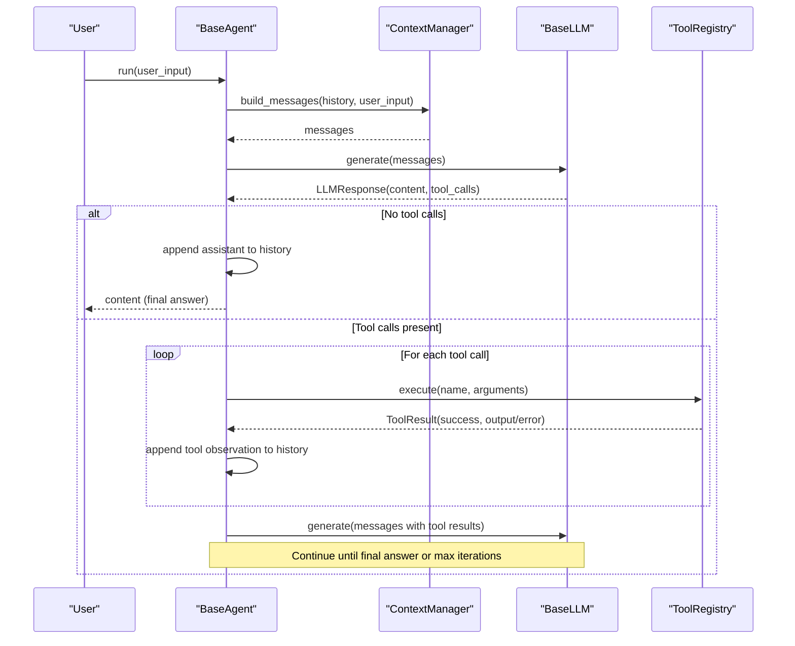
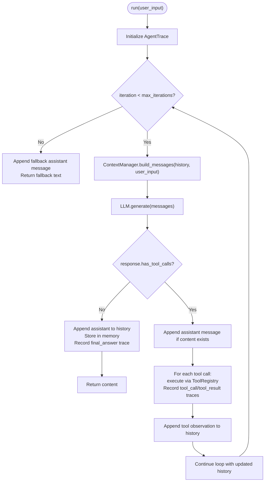
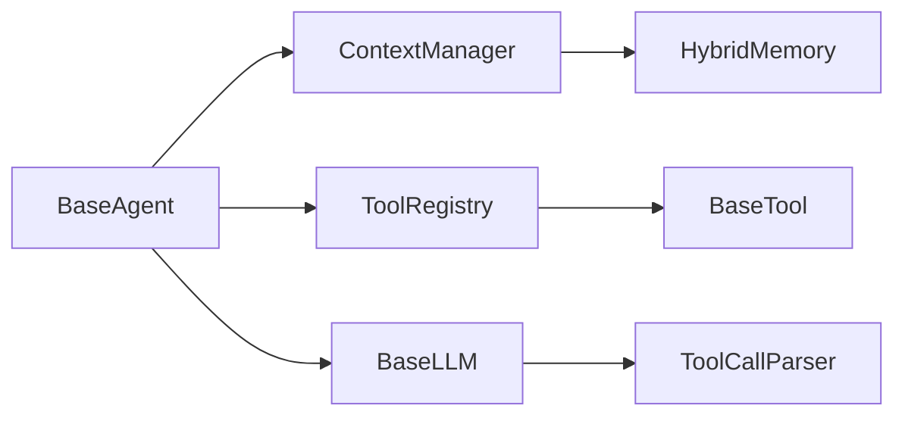

# Base Agent

<cite>
**Referenced Files in This Document**
- [base.py](file://harness/agent/base.py)
- [task.py](file://harness/agent/task.py)
- [engine.py](file://harness/llm/engine.py)
- [registry.py](file://harness/tools/registry.py)
- [base.py](file://harness/tools/base.py)
- [manager.py](file://harness/context/manager.py)
- [hybrid.py](file://harness/memory/hybrid.py)
- [builtin.py](file://harness/tools/builtin.py)
- [demo_agent.py](file://demos/demo_agent.py)
</cite>

## Table of Contents
1. [Introduction](#introduction)
2. [Project Structure](#project-structure)
3. [Core Components](#core-components)
4. [Architecture Overview](#architecture-overview)
5. [Detailed Component Analysis](#detailed-component-analysis)
6. [Dependency Analysis](#dependency-analysis)
7. [Performance Considerations](#performance-considerations)
8. [Troubleshooting Guide](#troubleshooting-guide)
9. [Conclusion](#conclusion)
10. [Appendices](#appendices)

## Introduction
This document explains the BaseAgent class and its core Agent Loop that transforms an LLM into an autonomous agent through iterative reasoning. It covers how context is built, how LLM calls are made, how tool calls are executed and fed back, and how final responses are handled. It also documents the BaseAgent constructor parameters, the run() lifecycle, fallback behavior, subclassing patterns for custom agents, and the AgentTrace debugging system.

## Project Structure
The BaseAgent lives in the harness.agent package and orchestrates interactions with:
- LLM engine (message generation and tool call parsing)
- Tool registry (tool discovery and execution)
- Context manager (system prompt assembly, memory integration, history management)
- Memory systems (short-term and long-term storage)

```mermaid
graph TB
subgraph "Agent"
BA["BaseAgent"]
TA["TaskAgent"]
end
subgraph "LLM"
LLM["BaseLLM / Backends"]
end
subgraph "Tools"
TR["ToolRegistry"]
BT["Built-in Tools"]
end
subgraph "Context & Memory"
CM["ContextManager"]
HM["HybridMemory"]
end
BA --> LLM
BA --> TR
BA --> CM
CM --> HM
TA --> BA
TR --> BT
```

**Diagram sources**
- [base.py:63-165](file://harness/agent/base.py#L63-L165)
- [task.py:32-73](file://harness/agent/task.py#L32-L73)
- [engine.py:127-141](file://harness/llm/engine.py#L127-L141)
- [registry.py:17-74](file://harness/tools/registry.py#L17-L74)
- [manager.py:41-118](file://harness/context/manager.py#L41-L118)
- [hybrid.py:22-84](file://harness/memory/hybrid.py#L22-L84)

**Section sources**
- [base.py:1-165](file://harness/agent/base.py#L1-L165)
- [task.py:1-73](file://harness/agent/task.py#L1-L73)
- [engine.py:1-421](file://harness/llm/engine.py#L1-L421)
- [registry.py:1-74](file://harness/tools/registry.py#L1-L74)
- [manager.py:1-118](file://harness/context/manager.py#L1-L118)
- [hybrid.py:1-84](file://harness/memory/hybrid.py#L1-L84)

## Core Components
- BaseAgent: Implements the core agent loop, manages iteration, context building, LLM calls, tool execution, response handling, and fallbacks.
- AgentTrace: Records step-by-step execution details for debugging and monitoring.
- TaskAgent: A specialized agent subclass that sets a task-oriented system prompt and provides a structured execute_task interface.
- ContextManager: Assembles messages including system prompt, tool descriptions, memory context, conversation history, and current input.
- ToolRegistry: Central catalog for registering, listing, and executing tools with error handling.
- HybridMemory: Combines short-term and long-term memory to provide recent and relevant context.
- LLM Engine: Abstract interface and backends for generating responses and parsing tool calls from model output.

Key responsibilities:
- BaseAgent.run(): Orchestrates the full cycle per user turn.
- ContextManager.build_messages(): Builds the complete message list for each LLM call.
- ToolRegistry.execute(): Executes tools safely and returns results or errors.
- HybridMemory.get_relevant_context(): Merges recent and relevant past memories into context.

**Section sources**
- [base.py:38-165](file://harness/agent/base.py#L38-L165)
- [task.py:32-73](file://harness/agent/task.py#L32-L73)
- [manager.py:41-118](file://harness/context/manager.py#L41-L118)
- [registry.py:17-74](file://harness/tools/registry.py#L17-L74)
- [hybrid.py:22-84](file://harness/memory/hybrid.py#L22-L84)
- [engine.py:23-57](file://harness/llm/engine.py#L23-L57)

## Architecture Overview
The Agent Loop is the heart of the system. Each user turn triggers a controlled cycle:
1. Build context using ContextManager (system prompt + tool descriptions + memory + history + current input).
2. Call LLM.generate() to get a response.
3. If no tool calls are requested, store the assistant response and return it as the final answer.
4. If tool calls are requested, execute each via ToolRegistry, append tool observations to history, and continue looping until a final answer is produced or max_iterations is reached.



**Diagram sources**
- [base.py:97-160](file://harness/agent/base.py#L97-L160)
- [manager.py:61-104](file://harness/context/manager.py#L61-L104)
- [engine.py:127-141](file://harness/llm/engine.py#L127-L141)
- [registry.py:43-60](file://harness/tools/registry.py#L43-L60)

## Detailed Component Analysis

### BaseAgent Constructor Parameters
- name: Identifier for the agent instance used in logs and traces.
- llm: An LLM backend implementing BaseLLM; responsible for generating responses and parsing tool calls.
- system_prompt: Base instructions defining agent persona and behavior; extended by ContextManager with tool instructions.
- tool_registry: A ToolRegistry instance providing available tools and their descriptions; defaults to an empty registry.
- memory: A BaseMemory implementation; defaults to HybridMemory to combine short-term and long-term context.
- max_iterations: Upper bound on tool-call loops to prevent infinite cycles.
- verbose: Enables logging/printing of intermediate steps during execution.

These parameters configure the agent’s capabilities, safety limits, and observability.

**Section sources**
- [base.py:73-95](file://harness/agent/base.py#L73-L95)

### Agent Loop: run() Implementation
The run() method implements the core lifecycle:
- Initializes AgentTrace for each turn.
- Iterates up to max_iterations times:
  - Builds messages via ContextManager.build_messages().
  - Calls LLM.generate() with the assembled messages.
  - If no tool calls: appends assistant response to history, stores in memory, records final_answer trace, and returns content.
  - If tool calls exist:
    - Appends assistant message (if any content) to history.
    - For each tool call:
      - Records tool_call trace.
      - Executes tool via ToolRegistry.execute().
      - Records tool_result trace.
      - Appends tool observation message to history with role "tool".
    - Continues loop with updated history; subsequent iterations use empty user_input so the LLM sees tool results and decides next steps.
- Fallback: If max_iterations is reached without a final answer, appends a fallback assistant message and returns a polite error string.



**Diagram sources**
- [base.py:97-160](file://harness/agent/base.py#L97-L160)

**Section sources**
- [base.py:97-160](file://harness/agent/base.py#L97-L160)

### AgentTrace System
AgentTrace records each step of the agent loop:
- Step types include llm_call, tool_call, tool_result, and final_answer.
- add_step() appends structured entries with metadata like iteration, tool name, arguments, and outputs.
- summary() produces a human-readable log suitable for debugging and monitoring.

Usage:
- Instantiated at the start of run().
- Updated throughout the loop to capture LLM calls, tool executions, results, and final answers.
- Provides a concise overview of execution flow for troubleshooting.

**Section sources**
- [base.py:38-61](file://harness/agent/base.py#L38-L61)
- [base.py:103-141](file://harness/agent/base.py#L103-L141)

### Context Building and Memory Integration
ContextManager.build_messages() constructs the full prompt:
- System message includes base system_prompt plus tool instructions and tool descriptions when tools are registered.
- HybridMemory.get_relevant_context() injects recent conversation and relevant past memories into the prompt.
- Conversation history is appended verbatim.
- Current user input is added as the last message.
- The user input is stored in memory for future retrieval.

This ensures the LLM has sufficient context while respecting token limits and prioritizing recent and relevant information.

**Section sources**
- [manager.py:61-104](file://harness/context/manager.py#L61-L104)
- [hybrid.py:46-73](file://harness/memory/hybrid.py#L46-L73)

### Tool Execution and Error Handling
ToolRegistry.execute() centralizes tool invocation:
- Looks up the tool by name; if not found, returns a ToolResult indicating failure with an error listing available tools.
- Invokes tool.execute(**arguments); catches exceptions and returns a failed ToolResult with the error message.
- Returns success/failure status along with output or error text for feedback to the agent.

Built-in tools demonstrate safe implementations:
- CalculatorTool validates expressions and evaluates safely.
- DateTimeTool returns formatted date/time based on query.
- FileOpsTool performs read-only operations with path validation.

**Section sources**
- [registry.py:43-60](file://harness/tools/registry.py#L43-L60)
- [base.py:132-152](file://harness/agent/base.py#L132-L152)
- [builtin.py:13-83](file://harness/tools/builtin.py#L13-L83)

### LLM Interface and Tool Call Parsing
BaseLLM defines the generate() contract returning LLMResponse with content and optional tool_calls.
Backends implement this contract:
- TransformersBackend loads models, applies chat templates, generates tokens, parses tool calls, and strips tool call blocks from content.
- MockBackend simulates tool calling behavior for demos and testing without GPU requirements.

ToolCallParser extracts tool calls from free-form text using multiple patterns, enabling flexible model outputs.

**Section sources**
- [engine.py:127-141](file://harness/llm/engine.py#L127-L141)
- [engine.py:206-241](file://harness/llm/engine.py#L206-L241)
- [engine.py:254-399](file://harness/llm/engine.py#L254-L399)
- [engine.py:61-123](file://harness/llm/engine.py#L61-L123)

### Creating Custom Agents by Subclassing BaseAgent
To create a specialized agent:
- Subclass BaseAgent and optionally override system_prompt to tailor behavior.
- Provide a higher max_iterations for complex tasks if needed.
- Implement a domain-specific method (e.g., execute_task) that wraps run() and returns structured results.

Example pattern:
- TaskAgent sets a task-oriented system prompt and exposes execute_task(task_description) which calls run() and returns a dict with success, result, and task fields.

Practical usage:
- Initialize an LLM backend (e.g., create_llm()).
- Create a ToolRegistry and register tools (e.g., register_default_tools).
- Instantiate TaskAgent with llm and registry.
- Call execute_task for each objective and clear history between tasks if desired.

**Section sources**
- [task.py:32-73](file://harness/agent/task.py#L32-L73)
- [demo_agent.py:15-39](file://demos/demo_agent.py#L15-L39)
- [builtin.py:77-83](file://harness/tools/builtin.py#L77-L83)

## Dependency Analysis
The following diagram shows key dependencies among components involved in the agent loop:



**Diagram sources**
- [base.py:63-95](file://harness/agent/base.py#L63-L95)
- [manager.py:41-60](file://harness/context/manager.py#L41-L60)
- [registry.py:17-27](file://harness/tools/registry.py#L17-L27)
- [engine.py:127-141](file://harness/llm/engine.py#L127-L141)
- [engine.py:61-123](file://harness/llm/engine.py#L61-L123)
- [hybrid.py:22-31](file://harness/memory/hybrid.py#L22-L31)
- [base.py:30-45](file://harness/tools/base.py#L30-L45)

**Section sources**
- [base.py:63-95](file://harness/agent/base.py#L63-L95)
- [manager.py:41-60](file://harness/context/manager.py#L41-L60)
- [registry.py:17-27](file://harness/tools/registry.py#L17-L27)
- [engine.py:127-141](file://harness/llm/engine.py#L127-L141)
- [hybrid.py:22-31](file://harness/memory/hybrid.py#L22-L31)
- [base.py:30-45](file://harness/tools/base.py#L30-L45)

## Performance Considerations
- Token budgeting: ContextManager.estimate_tokens() provides a rough estimate (~4 chars per token) to help manage context windows. In production, use actual tokenizer counts for precision.
- Memory pruning: HybridMemory.get_recent(n) limits short-term context size; adjust capacity to balance relevance and cost.
- Max iterations: Tune max_iterations to avoid excessive LLM calls and tool executions for complex tasks.
- Tool efficiency: Prefer tools that return concise outputs; large tool outputs increase context size and cost.
- Backend selection: Use MockBackend for fast iteration and testing; switch to TransformersBackend for real inference when ready.

[No sources needed since this section provides general guidance]

## Troubleshooting Guide
Common issues and resolutions:
- Infinite loops: Ensure max_iterations is set appropriately; verify tool outputs do not repeatedly trigger additional tool calls.
- Missing tools: Confirm tools are registered in ToolRegistry; check tool names match exactly what the model requests.
- Tool execution errors: Inspect ToolResult.error messages; validate input schemas and handle edge cases in tool.execute().
- Context overflow: Reduce history length or limit memory retrieval; consider truncating tool outputs before appending to history.
- Debugging: Use AgentTrace.summary() to review the sequence of LLM calls, tool executions, and final answers.

**Section sources**
- [registry.py:43-60](file://harness/tools/registry.py#L43-L60)
- [base.py:132-152](file://harness/agent/base.py#L132-L152)
- [base.py:38-61](file://harness/agent/base.py#L38-L61)

## Conclusion
BaseAgent encapsulates the essential Agent Loop that turns an LLM into an autonomous agent by iteratively building context, invoking the model, executing tools, and handling responses. Its constructor parameters allow customization of identity, capabilities, memory, and verbosity. The run() method manages the lifecycle, enforces iteration limits, and provides fallback behavior. AgentTrace offers visibility into execution steps for debugging and monitoring. Subclassing BaseAgent enables domain-specific agents like TaskAgent, while the tool and memory ecosystems provide extensibility and robustness.

[No sources needed since this section summarizes without analyzing specific files]

## Appendices

### Practical Example: Running a Task Agent
- Configure environment to use MockBackend for quick demos.
- Create an LLM via create_llm().
- Register default tools using register_default_tools(registry).
- Instantiate TaskAgent with llm and registry.
- Execute tasks via execute_task() and clear history between runs.

**Section sources**
- [demo_agent.py:15-39](file://demos/demo_agent.py#L15-L39)
- [builtin.py:77-83](file://harness/tools/builtin.py#L77-L83)