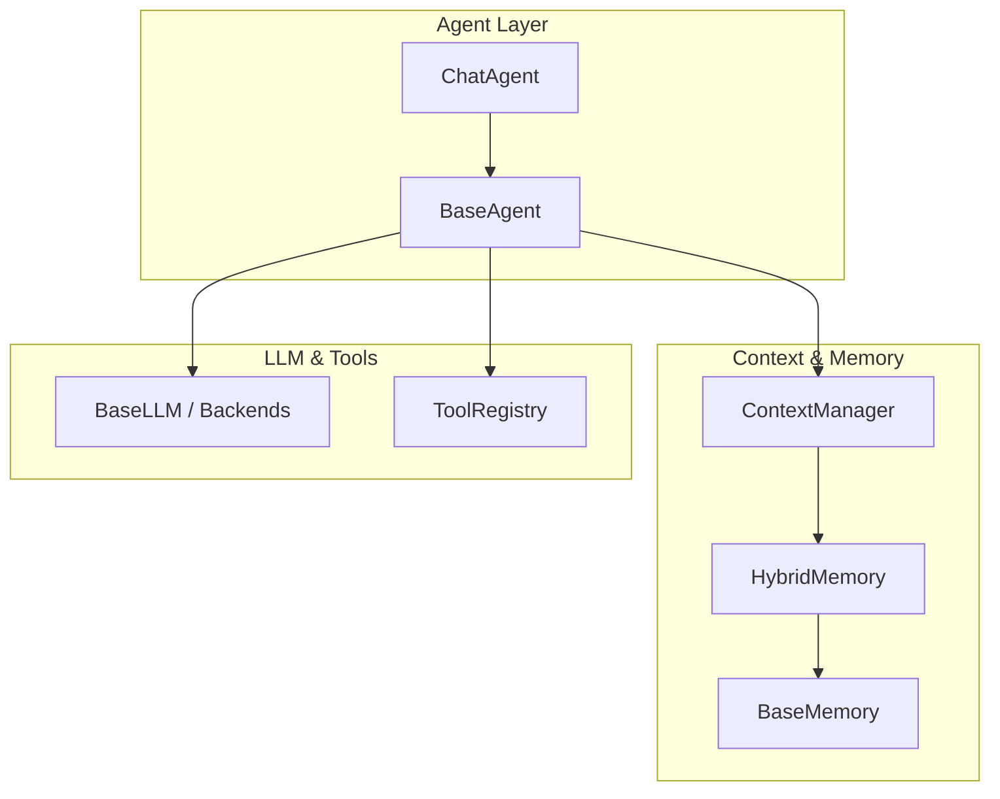
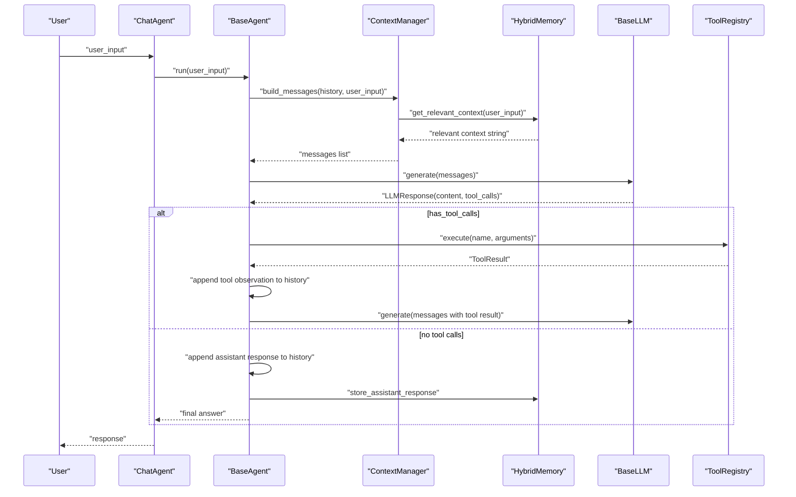
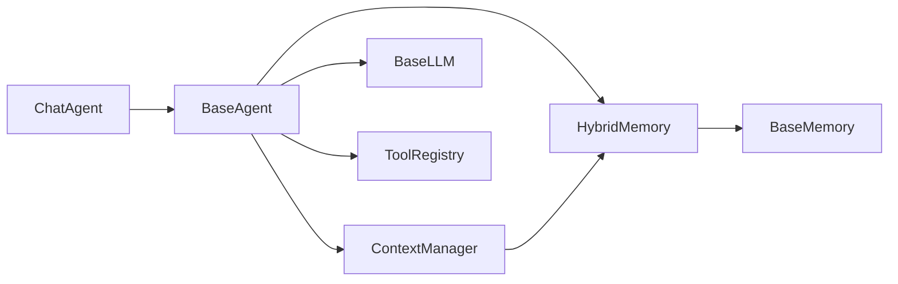

# Chat Agent

<cite>
**Referenced Files in This Document**
- [chat.py](file://harness/agent/chat.py)
- [base.py](file://harness/agent/base.py)
- [manager.py](file://harness/context/manager.py)
- [engine.py](file://harness/llm/engine.py)
- [registry.py](file://harness/tools/registry.py)
- [hybrid.py](file://harness/memory/hybrid.py)
- [base_memory.py](file://harness/memory/base.py)
- [demo_chat.py](file://demos/demo_chat.py)
- [README.md](file://README.md)
</cite>

## Table of Contents
1. Introduction
2. Project Structure
3. Core Components
4. Architecture Overview
5. Detailed Component Analysis
6. Dependency Analysis
7. Performance Considerations
8. Troubleshooting Guide
9. Conclusion
10. Appendices

## Introduction
This document explains the ChatAgent class specialized for conversational interactions within the HarnessAIDemo framework. It details how ChatAgent extends BaseAgent to provide chat-specific functionality, including conversation state management, turn-taking patterns, and contextual memory integration. It also documents chat-specific configuration options, message formatting, and conversation flow control, with examples for multi-turn conversations, follow-up handling, and context maintenance across exchanges. Finally, it provides best practices for chat agent design, error handling strategies, and performance optimization for real-time chat applications.

## Project Structure
The chat system is composed of:
- ChatAgent: a specialized agent for interactive, multi-turn dialogue
- BaseAgent: core agent loop that orchestrates LLM calls, tool usage, and history management
- ContextManager: assembles prompts from system prompt, tools, memory, and conversation history
- Memory (HybridMemory): combines short-term buffer and long-term retrieval for continuity
- LLM Engine: abstract interface and backends (Mock and Transformers) for model inference
- Tool Registry: central catalog for available tools and execution

**Diagram sources**
- [chat.py:25-59](file://harness/agent/chat.py#L25-L59)
- [base.py:63-160](file://harness/agent/base.py#L63-L160)
- [manager.py:41-108](file://harness/context/manager.py#L41-L108)
- [hybrid.py:22-84](file://harness/memory/hybrid.py#L22-L84)
- [engine.py:127-146](file://harness/llm/engine.py#L127-L146)
- [registry.py:17-74](file://harness/tools/registry.py#L17-L74)

**Section sources**
- [chat.py:1-59](file://harness/agent/chat.py#L1-L59)
- [base.py:1-165](file://harness/agent/base.py#L1-L165)
- [manager.py:1-118](file://harness/context/manager.py#L1-L118)
- [hybrid.py:1-84](file://harness/memory/hybrid.py#L1-L84)
- [engine.py:1-421](file://harness/llm/engine.py#L1-L421)
- [registry.py:1-74](file://harness/tools/registry.py#L1-L74)
- [demo_chat.py:1-47](file://demos/demo_chat.py#L1-L47)
- [README.md:1-372](file://README.md#L1-L372)

## Core Components
- ChatAgent: Provides a convenient chat method and conversation utilities while inheriting the full agent loop from BaseAgent.
- BaseAgent: Implements the agent loop that builds context, calls the LLM, executes tool calls, updates history, and returns final answers.
- ContextManager: Builds messages by combining system prompt, tool descriptions, relevant memory, conversation history, and current input.
- HybridMemory: Merges short-term recent messages with long-term relevant memories to support continuity.
- LLM Engine: Abstract interface and concrete backends for generating responses and parsing tool calls.
- Tool Registry: Centralized tool catalog used for descriptions and execution during the agent loop.

Key responsibilities:
- Conversation state: maintained via BaseAgent.history and ContextManager assembly.
- Turn-taking: BaseAgent.run iterates until a final answer or max iterations reached.
- Contextual memory: HybridMemory supplies recent and relevant past context for each turn.

**Section sources**
- [chat.py:25-59](file://harness/agent/chat.py#L25-L59)
- [base.py:63-160](file://harness/agent/base.py#L63-L160)
- [manager.py:61-108](file://harness/context/manager.py#L61-L108)
- [hybrid.py:22-84](file://harness/memory/hybrid.py#L22-L84)
- [engine.py:23-56](file://harness/llm/engine.py#L23-L56)
- [registry.py:17-74](file://harness/tools/registry.py#L17-L74)

## Architecture Overview
The ChatAgent leverages BaseAgent’s loop to manage multi-turn conversations. Each user turn triggers:
- Context assembly using ContextManager (system prompt + tools + memory + history + current input)
- LLM generation via BaseLLM backends
- Optional tool call execution through ToolRegistry
- History update and memory storage
- Final response return or continuation if more steps are needed

**Diagram sources**
- [base.py:97-160](file://harness/agent/base.py#L97-L160)
- [manager.py:61-108](file://harness/context/manager.py#L61-L108)
- [hybrid.py:46-73](file://harness/memory/hybrid.py#L46-L73)
- [engine.py:127-146](file://harness/llm/engine.py#L127-L146)
- [registry.py:43-67](file://harness/tools/registry.py#L43-L67)

## Detailed Component Analysis

### ChatAgent
- Purpose: Specialized agent for interactive, multi-turn dialogue.
- Key features:
  - Inherits full agent loop from BaseAgent
  - Provides a convenience chat method that delegates to run
  - Offers reset_conversation to clear short-term history while preserving long-term memory
  - Exposes get_conversation_history to retrieve structured history for UI or debugging

Configuration highlights:
- system_prompt: defaults to a friendly, concise assistant persona suitable for chat
- tool_registry: optional; if provided, enables tool-calling behavior
- memory: optional; if provided, integrates short-term and long-term memory for context
- name: identifies the agent in logs and traces

Conversation utilities:
- reset_conversation: clears BaseAgent.history to start fresh without losing long-term knowledge
- get_conversation_history: returns a list of dicts with role and content for each message

Best practices:
- Use reset_conversation between distinct sessions or topics to avoid context pollution
- Provide a tailored system_prompt to shape tone and capabilities
- Integrate HybridMemory to maintain continuity across turns and sessions

**Section sources**
- [chat.py:19-59](file://harness/agent/chat.py#L19-L59)

### BaseAgent (Agent Loop)
- Purpose: Core execution cycle enabling multi-step reasoning and tool use.
- Flow:
  - Build context via ContextManager
  - Call LLM.generate
  - If tool calls present, execute them via ToolRegistry and feed results back into history
  - Otherwise, store assistant response in memory and return final answer
  - Enforces max_iterations to prevent infinite loops

Error handling:
- On max iterations reached, returns a fallback message indicating inability to complete the task
- Logs raw output when verbose mode is enabled for debugging

Performance considerations:
- Limits iterations to bound latency and token usage
- Appends only necessary observations to keep history manageable

**Section sources**
- [base.py:63-160](file://harness/agent/base.py#L63-L160)

### ContextManager
- Purpose: Assembles the complete message list for each LLM call.
- Composition:
  - System message includes base system_prompt and tool instructions/descriptions
  - Relevant past context retrieved from HybridMemory based on current input
  - Conversation history appended verbatim
  - Current user message added last
  - Stores user input in memory for future retrieval

Token estimation:
- Provides a rough estimate to help manage context window constraints

Usage in chat:
- Ensures each turn benefits from both recent and relevant historical context

**Section sources**
- [manager.py:41-118](file://harness/context/manager.py#L41-L118)

### HybridMemory
- Purpose: Combines short-term buffer and long-term persistent storage for continuity.
- Behavior:
  - Adds user and assistant messages to both short-term and long-term stores
  - Retrieves recent messages for immediate context
  - Searches long-term memory for relevant past experiences based on query
  - Builds a combined context string for inclusion in prompts

Design rationale:
- Mirrors human memory: always remember recent conversation, selectively recall older relevant facts

**Section sources**
- [hybrid.py:1-84](file://harness/memory/hybrid.py#L1-L84)
- [base_memory.py:18-64](file://harness/memory/base.py#L18-L64)

### LLM Engine
- Purpose: Abstract interface and backends for language model inference.
- Data types:
  - Message: represents roles and content in conversation
  - ToolCall: captures model-requested tool invocations
  - LLMResponse: wraps content, tool calls, and raw output
- Backends:
  - MockBackend: deterministic pattern-based responses for demos/testing
  - TransformersBackend: loads HuggingFace models, applies chat templates, generates tokens, parses tool calls

Integration:
- BaseAgent uses generate to obtain responses and decide next steps based on tool calls presence

**Section sources**
- [engine.py:23-56](file://harness/llm/engine.py#L23-L56)
- [engine.py:127-146](file://harness/llm/engine.py#L127-L146)
- [engine.py:151-249](file://harness/llm/engine.py#L151-L249)
- [engine.py:254-400](file://harness/llm/engine.py#L254-L400)

### Tool Registry
- Purpose: Central catalog for available tools and execution.
- Capabilities:
  - Register tools and list them for system prompt injection
  - Execute tools by name with argument passing
  - Return ToolResult with success flag and error messages for robust error handling

Role in chat:
- Enables ChatAgent to perform actions beyond text generation, supporting richer interactions

**Section sources**
- [registry.py:17-74](file://harness/tools/registry.py#L17-L74)

## Dependency Analysis
ChatAgent depends on BaseAgent for the core loop, which in turn depends on ContextManager, HybridMemory, BaseLLM, and ToolRegistry. The dependencies form a layered architecture where higher-level components orchestrate lower-level services.

**Diagram sources**
- [chat.py:25-59](file://harness/agent/chat.py#L25-L59)
- [base.py:63-160](file://harness/agent/base.py#L63-L160)
- [manager.py:41-108](file://harness/context/manager.py#L41-L108)
- [hybrid.py:22-84](file://harness/memory/hybrid.py#L22-L84)
- [engine.py:127-146](file://harness/llm/engine.py#L127-L146)
- [registry.py:17-74](file://harness/tools/registry.py#L17-L74)

**Section sources**
- [chat.py:25-59](file://harness/agent/chat.py#L25-L59)
- [base.py:63-160](file://harness/agent/base.py#L63-L160)
- [manager.py:41-108](file://harness/context/manager.py#L41-L108)
- [hybrid.py:22-84](file://harness/memory/hybrid.py#L22-L84)
- [engine.py:127-146](file://harness/llm/engine.py#L127-L146)
- [registry.py:17-74](file://harness/tools/registry.py#L17-L74)

## Performance Considerations
- Limit iterations: BaseAgent enforces max_iterations to cap latency and token consumption per turn.
- Context size: ContextManager estimates tokens to help manage context windows; tune system_prompt length and tool descriptions to fit constraints.
- Memory pruning: HybridMemory’s short-term capacity controls recent context size; adjust capacity to balance relevance vs. cost.
- Tool efficiency: Prefer lightweight tools and batch operations to reduce round-trips and parsing overhead.
- Backend selection: Use MockBackend for rapid iteration and testing; switch to TransformersBackend for production with appropriate device settings.

[No sources needed since this section provides general guidance]

## Troubleshooting Guide
Common issues and resolutions:
- Infinite loops: Ensure max_iterations is set appropriately; verify tool outputs do not repeatedly trigger additional tool calls.
- Missing tool calls: Confirm tool registry contains expected tools and that system prompt includes tool instructions.
- Context overflow: Reduce system_prompt verbosity, limit tool descriptions, or prune history via reset_conversation.
- Memory gaps: Verify HybridMemory is configured and storing user/assistant messages; check long-term search relevance.
- Backend errors: For TransformersBackend, ensure required packages are installed and model downloads succeed; for MockBackend, validate input patterns.

Operational tips:
- Enable verbose logging in BaseAgent to inspect raw LLM output and tool execution steps.
- Use get_conversation_history to audit message flow and diagnose context issues.
- Reset conversation boundaries when switching topics to avoid cross-contamination.

**Section sources**
- [base.py:97-160](file://harness/agent/base.py#L97-L160)
- [manager.py:61-108](file://harness/context/manager.py#L61-L108)
- [hybrid.py:46-73](file://harness/memory/hybrid.py#L46-L73)
- [engine.py:151-249](file://harness/llm/engine.py#L151-L249)
- [registry.py:43-67](file://harness/tools/registry.py#L43-L67)

## Conclusion
ChatAgent provides a focused, conversational interface built atop a robust agent loop. By integrating context management, hybrid memory, and tool execution, it supports rich multi-turn dialogues with contextual awareness. Following the recommended configurations and best practices ensures reliable, efficient, and scalable chat experiences suitable for real-time applications.

[No sources needed since this section summarizes without analyzing specific files]

## Appendices

### Multi-Turn Conversation Example
- Initialize ChatAgent with an LLM backend, HybridMemory, and ToolRegistry
- Run a loop reading user input and printing agent responses
- Use reset_conversation to start a new topic while retaining long-term knowledge

Reference implementation:
- See demo script for interactive chat loop and setup

**Section sources**
- [demo_chat.py:17-46](file://demos/demo_chat.py#L17-L46)

### Handling Follow-Up Questions
- Maintain conversation history in BaseAgent.history
- Rely on ContextManager to include recent messages and relevant long-term context
- Use HybridMemory.get_relevant_context to surface related past information for nuanced follow-ups

**Section sources**
- [base.py:97-160](file://harness/agent/base.py#L97-L160)
- [manager.py:61-108](file://harness/context/manager.py#L61-L108)
- [hybrid.py:46-73](file://harness/memory/hybrid.py#L46-L73)

### Maintaining Conversation Context Across Multiple Exchanges
- Store user and assistant messages in HybridMemory for persistence
- Periodically reset short-term history to prevent context bloat
- Adjust short_term_capacity and long-term search parameters to optimize relevance and cost

**Section sources**
- [hybrid.py:22-84](file://harness/memory/hybrid.py#L22-L84)
- [manager.py:61-108](file://harness/context/manager.py#L61-L108)

### Best Practices for Chat Agent Design
- Keep system_prompt concise and focused on chat persona and capabilities
- Register only necessary tools to minimize prompt size and execution overhead
- Use HybridMemory to balance recent context with relevant long-term knowledge
- Set reasonable max_iterations to prevent runaway loops
- Leverage verbose logging during development; disable in production for performance

**Section sources**
- [chat.py:25-59](file://harness/agent/chat.py#L25-L59)
- [base.py:63-160](file://harness/agent/base.py#L63-L160)
- [manager.py:41-118](file://harness/context/manager.py#L41-L118)
- [hybrid.py:22-84](file://harness/memory/hybrid.py#L22-L84)

### Error Handling in Conversational Flows
- Handle tool execution failures gracefully via ToolRegistry error responses
- Provide fallback messages when max_iterations is reached
- Log errors and raw outputs for debugging; sanitize outputs for user-facing messages

**Section sources**
- [base.py:97-160](file://harness/agent/base.py#L97-L160)
- [registry.py:43-67](file://harness/tools/registry.py#L43-L67)

### Performance Optimization for Real-Time Chat Applications
- Tune max_iterations and temperature to balance responsiveness and quality
- Use MockBackend for rapid prototyping; switch to optimized TransformersBackend for production
- Prune history and limit tool descriptions to reduce token usage
- Cache frequent tool results where applicable to reduce latency

**Section sources**
- [engine.py:151-249](file://harness/llm/engine.py#L151-L249)
- [engine.py:254-400](file://harness/llm/engine.py#L254-L400)
- [manager.py:110-118](file://harness/context/manager.py#L110-L118)