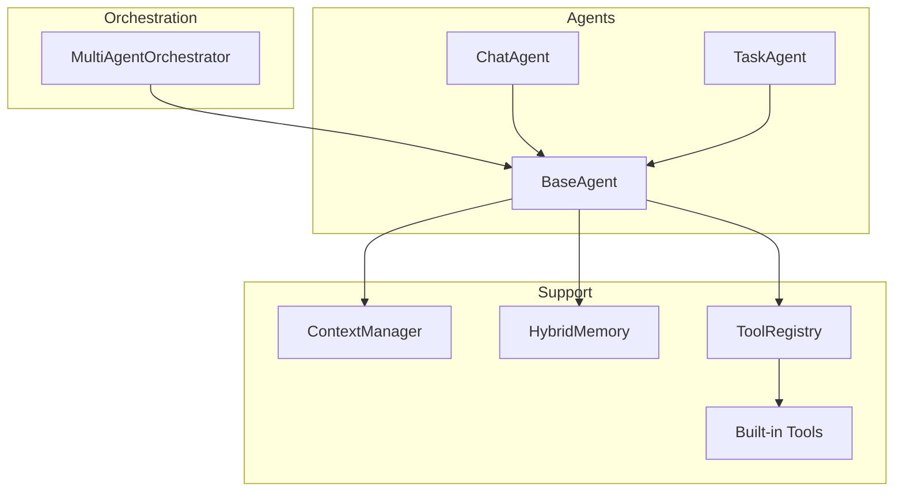
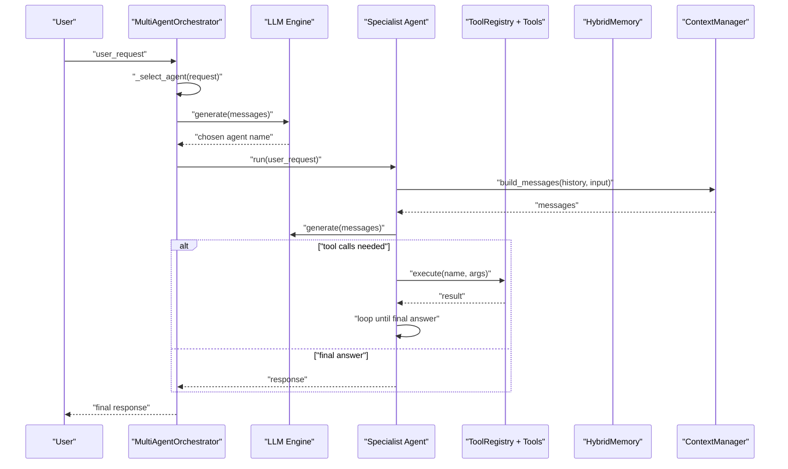
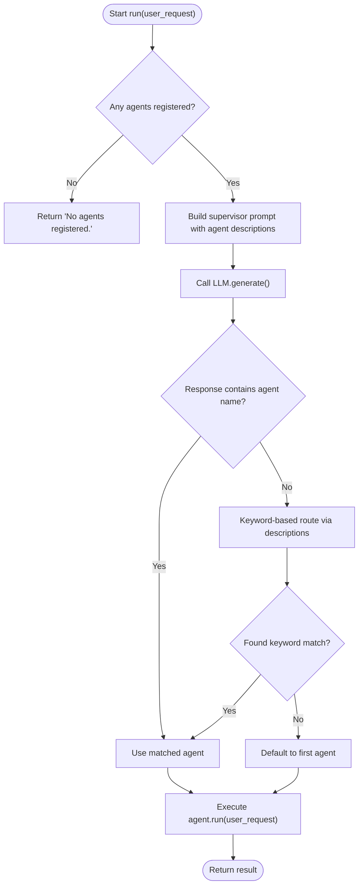
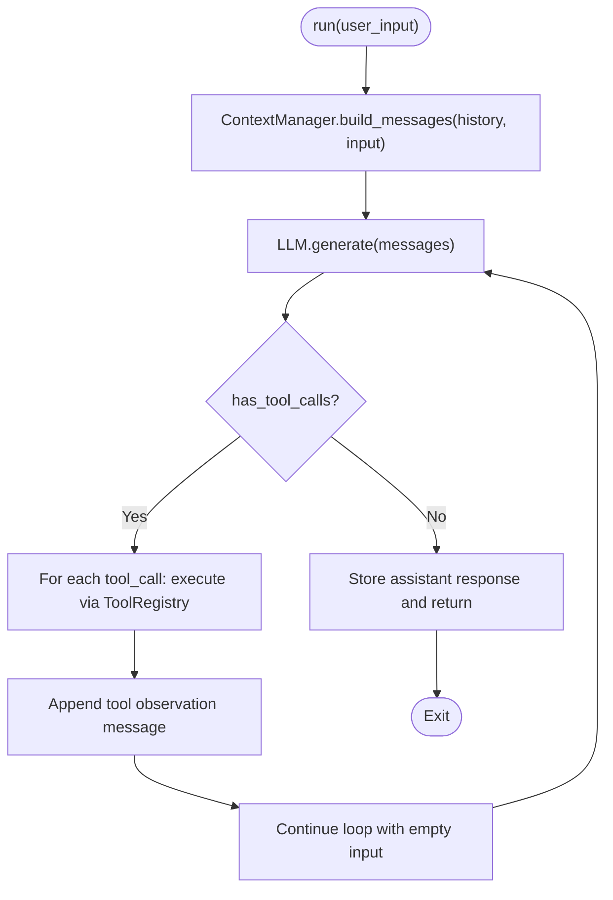
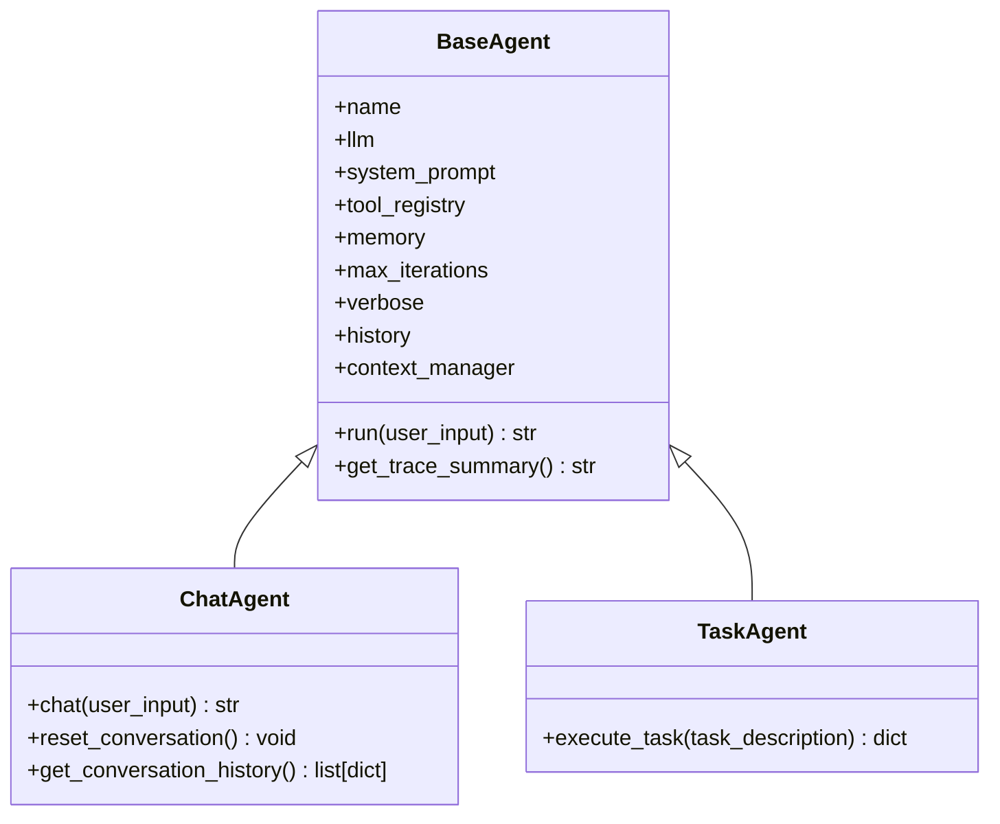
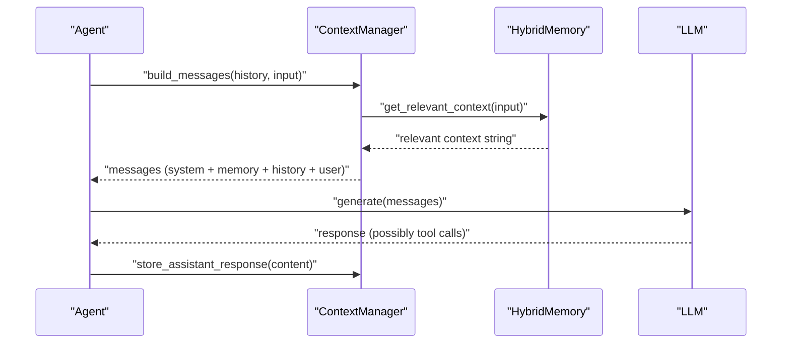
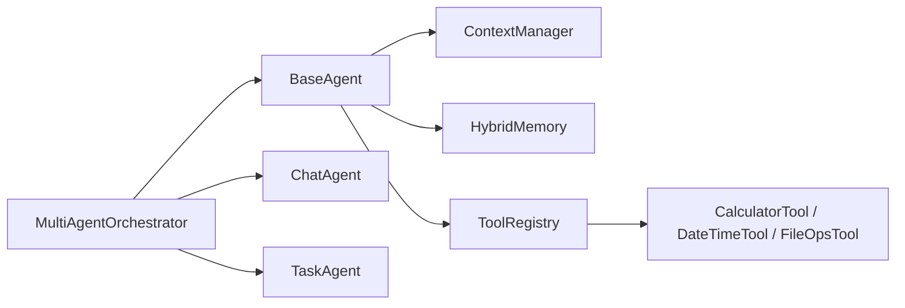

# Multi-Agent Orchestrator

<cite>
**Referenced Files in This Document**
- [orchestrator.py](file://harness/agent/orchestrator.py)
- [base.py](file://harness/agent/base.py)
- [chat.py](file://harness/agent/chat.py)
- [task.py](file://harness/agent/task.py)
- [builtin.py](file://harness/tools/builtin.py)
- [manager.py](file://harness/context/manager.py)
- [hybrid.py](file://harness/memory/hybrid.py)
- [demo_multi_agent.py](file://demos/demo_multi_agent.py)
- [README.md](file://README.md)
</cite>

## Table of Contents
1. [Introduction](#introduction)
2. [Project Structure](#project-structure)
3. [Core Components](#core-components)
4. [Architecture Overview](#architecture-overview)
5. [Detailed Component Analysis](#detailed-component-analysis)
6. [Dependency Analysis](#dependency-analysis)
7. [Performance Considerations](#performance-considerations)
8. [Troubleshooting Guide](#troubleshooting-guide)
9. [Conclusion](#conclusion)
10. [Appendices](#appendices)

## Introduction
This document explains the Multi-Agent Orchestrator pattern implemented in this repository, focusing on how a supervisor agent delegates tasks to specialized worker agents based on their expertise areas. It covers agent specialization strategies, task routing algorithms, inter-agent communication protocols, and orchestration patterns such as sequential delegation, parallel processing, and hierarchical coordination. It also provides guidance for agent discovery, load balancing, and failure recovery in multi-agent environments, with practical examples for research pipelines, code generation systems, and customer service automation.

## Project Structure
The multi-agent system is built around a central orchestrator that coordinates multiple specialized agents. The core modules include:
- Agent base loop and specialized agents (chat, task)
- Orchestrator for routing and aggregation
- Context manager for assembling prompts
- Memory system for short-term and long-term context
- Tool registry and built-in tools used by agents
- Demo script showcasing multi-agent orchestration

**Diagram sources**
- [orchestrator.py:31-152](file://harness/agent/orchestrator.py#L31-L152)
- [base.py:63-165](file://harness/agent/base.py#L63-L165)
- [chat.py:25-60](file://harness/agent/chat.py#L25-L60)
- [task.py:32-73](file://harness/agent/task.py#L32-L73)
- [manager.py:41-118](file://harness/context/manager.py#L41-L118)
- [hybrid.py:22-84](file://harness/memory/hybrid.py#L22-L84)
- [builtin.py:13-83](file://harness/tools/builtin.py#L13-L83)

**Section sources**
- [README.md:73-131](file://README.md#L73-L131)

## Core Components
- MultiAgentOrchestrator: Supervisor that registers specialist agents, selects the best one per request, executes it, and returns results. Supports running all agents for comparative outputs.
- BaseAgent: Implements the agent loop that builds context, calls LLM, executes tool calls iteratively, and stores final answers.
- ChatAgent: Conversational agent optimized for multi-turn dialogue with history pruning and persona customization.
- TaskAgent: Task-oriented agent with higher iteration limits and structured output handling.
- ContextManager: Assembles system prompt, tool descriptions, memory context, conversation history, and current input into messages for each LLM call.
- HybridMemory: Combines short-term buffer and long-term retrieval to provide relevant context.
- Built-in Tools: Calculator, DateTime, FileOps used by agents to perform concrete actions.

**Section sources**
- [orchestrator.py:31-152](file://harness/agent/orchestrator.py#L31-L152)
- [base.py:63-165](file://harness/agent/base.py#L63-L165)
- [chat.py:25-60](file://harness/agent/chat.py#L25-L60)
- [task.py:32-73](file://harness/agent/task.py#L32-L73)
- [manager.py:41-118](file://harness/context/manager.py#L41-L118)
- [hybrid.py:22-84](file://harness/memory/hybrid.py#L22-L84)
- [builtin.py:13-83](file://harness/tools/builtin.py#L13-L83)

## Architecture Overview
The orchestrator implements the supervisor pattern:
- A supervisor receives user requests and decides which specialist agent(s) to delegate to.
- Specialist agents complete sub-tasks using tools and memory.
- The supervisor combines results into a final answer or returns the chosen agent’s result.

**Diagram sources**
- [orchestrator.py:61-152](file://harness/agent/orchestrator.py#L61-L152)
- [base.py:97-165](file://harness/agent/base.py#L97-L165)
- [manager.py:61-118](file://harness/context/manager.py#L61-L118)
- [hybrid.py:46-73](file://harness/memory/hybrid.py#L46-L73)
- [builtin.py:13-83](file://harness/tools/builtin.py#L13-L83)

## Detailed Component Analysis

### MultiAgentOrchestrator: Supervisor Pattern and Routing
- Registration: Agents are registered with names and descriptions; descriptions guide routing.
- Routing algorithm:
  - Primary: LLM-based selection using a supervisor prompt listing available agents and their descriptions.
  - Fallback: Keyword-based matching against agent descriptions for common domains (math/time/general).
  - Default: First agent if no match.
- Execution modes:
  - run: Selects one agent and returns its result.
  - run_with_all: Executes through all agents and aggregates results for comparison.

**Diagram sources**
- [orchestrator.py:61-152](file://harness/agent/orchestrator.py#L61-L152)

**Section sources**
- [orchestrator.py:31-152](file://harness/agent/orchestrator.py#L31-L152)

### BaseAgent: Agent Loop and Inter-Agent Communication Protocol
- Agent loop:
  - Build context via ContextManager (system prompt, tool descriptions, memory, history, current input).
  - Call LLM; if tool calls are requested, execute them via ToolRegistry and feed results back as observations.
  - Repeat until final answer or max iterations reached.
- Inter-agent protocol:
  - Agents communicate via standardized Message objects and tool call structures.
  - Tool execution results are appended as tool messages with role "tool", enabling iterative reasoning.

**Diagram sources**
- [base.py:97-165](file://harness/agent/base.py#L97-L165)
- [manager.py:61-118](file://harness/context/manager.py#L61-L118)

**Section sources**
- [base.py:63-165](file://harness/agent/base.py#L63-L165)

### ChatAgent and TaskAgent: Specialization Strategies
- ChatAgent: Optimized for conversational flows with shorter iteration limits and minimal verbosity; supports resetting conversation history while preserving long-term memory.
- TaskAgent: Uses a task-oriented system prompt, higher max_iterations for complex workflows, and structured output handling via execute_task.

**Diagram sources**
- [base.py:63-165](file://harness/agent/base.py#L63-L165)
- [chat.py:25-60](file://harness/agent/chat.py#L25-L60)
- [task.py:32-73](file://harness/agent/task.py#L32-L73)

**Section sources**
- [chat.py:25-60](file://harness/agent/chat.py#L25-L60)
- [task.py:32-73](file://harness/agent/task.py#L32-L73)

### ContextManager and HybridMemory: Supporting Orchestration
- ContextManager:
  - Injects tool instructions and tool descriptions into system prompt.
  - Retrieves relevant long-term memories and recent short-term messages.
  - Stores assistant responses for future context.
- HybridMemory:
  - Maintains short-term buffer and long-term store.
  - Provides get_relevant_context combining recent and relevant past memories.

**Diagram sources**
- [manager.py:61-118](file://harness/context/manager.py#L61-L118)
- [hybrid.py:46-73](file://harness/memory/hybrid.py#L46-L73)

**Section sources**
- [manager.py:41-118](file://harness/context/manager.py#L41-L118)
- [hybrid.py:22-84](file://harness/memory/hybrid.py#L22-L84)

### Built-in Tools: Enabling Agent Expertise
- CalculatorTool: Safe evaluation of mathematical expressions.
- DateTimeTool: Returns current date/time information.
- FileOpsTool: Read-only file operations for listing and reading files.

These tools are registered into ToolRegistry and invoked by agents during the loop.

**Section sources**
- [builtin.py:13-83](file://harness/tools/builtin.py#L13-L83)

### Demo: Multi-Agent Orchestration Example
The demo sets up an orchestrator with three specialists:
- MathAgent with CalculatorTool
- TimeAgent with DateTimeTool
- ChatAgent for general conversation

It demonstrates routing and execution across different request types.

**Section sources**
- [demo_multi_agent.py:17-47](file://demos/demo_multi_agent.py#L17-L47)

## Dependency Analysis
The orchestrator depends on agents, which depend on context management, memory, and tools. The following diagram shows key dependencies:

**Diagram sources**
- [orchestrator.py:31-152](file://harness/agent/orchestrator.py#L31-L152)
- [base.py:63-165](file://harness/agent/base.py#L63-L165)
- [chat.py:25-60](file://harness/agent/chat.py#L25-L60)
- [task.py:32-73](file://harness/agent/task.py#L32-L73)
- [manager.py:41-118](file://harness/context/manager.py#L41-L118)
- [hybrid.py:22-84](file://harness/memory/hybrid.py#L22-L84)
- [builtin.py:13-83](file://harness/tools/builtin.py#L13-L83)

**Section sources**
- [README.md:73-131](file://README.md#L73-L131)

## Performance Considerations
- Iteration limits: BaseAgent uses max_iterations to prevent infinite loops; TaskAgent increases this limit for complex tasks.
- Context window management: ContextManager estimates tokens and includes only necessary context; HybridMemory retrieves relevant memories to reduce noise.
- Tool safety: Built-in tools restrict operations (e.g., safe math evaluation, read-only file ops) to avoid performance bottlenecks and security risks.
- Parallelism: run_with_all executes all agents sequentially in the current implementation; for parallel processing, consider concurrent execution at the orchestrator layer with proper synchronization and error handling.

[No sources needed since this section provides general guidance]

## Troubleshooting Guide
Common issues and remedies:
- No agents registered: Orchestrator returns a message indicating no agents; ensure register_agent is called before run.
- Routing failures: If LLM-based routing does not match any agent, fallback keyword matching may select an agent; verify agent descriptions contain relevant keywords.
- Tool execution errors: ToolRegistry.execute returns success/failure; inspect tool logs and inputs; ensure tool parameters are correctly formatted.
- Max iterations reached: Agent returns a fallback message; increase max_iterations or refine prompts and tool usage.

**Section sources**
- [orchestrator.py:61-92](file://harness/agent/orchestrator.py#L61-L92)
- [base.py:157-165](file://harness/agent/base.py#L157-L165)
- [builtin.py:19-30](file://harness/tools/builtin.py#L19-L30)

## Conclusion
The Multi-Agent Orchestrator pattern in this repository provides a robust supervisor framework that delegates tasks to specialized agents based on expertise. The routing algorithm combines LLM-based selection with keyword fallbacks, ensuring reliable task assignment. Agents follow a consistent loop with context assembly, tool invocation, and iterative reasoning. The system supports diverse use cases through modular tools and memory, and can be extended for advanced orchestration patterns like parallel processing and hierarchical coordination.

[No sources needed since this section summarizes without analyzing specific files]

## Appendices

### Examples of Multi-Agent Workflows
- Research pipeline:
  - Supervisor routes queries to a ResearchAgent (with web search tools), then to an AnalysisAgent (data synthesis), and finally to a WriterAgent (report generation).
  - Implement via registering specialized TaskAgents with appropriate tools and using orchestrator.run or orchestrator.run_with_all for comparative outputs.
- Code generation system:
  - Supervisor routes coding tasks to a CodingAgent (with code analysis tools), then to a TestingAgent (unit test generation), and finally to a DocumentationAgent (docstrings and README).
  - Use run_with_all to compare generated solutions and select the best.
- Customer service automation:
  - Supervisor routes inquiries to BillingAgent, SupportAgent, or GeneralAgent based on keywords and descriptions.
  - Integrate with session management for multi-turn conversations and long-term memory for personalized responses.

[No sources needed since this section provides conceptual guidance]

### Orchestration Patterns
- Sequential delegation: Chain multiple agents where each passes results to the next; implement by orchestrating runs in sequence within a custom orchestrator method.
- Parallel processing: Run multiple agents concurrently for independent tasks; aggregate results and handle partial failures gracefully.
- Hierarchical coordination: Use nested orchestrators where a top-level supervisor delegates to domain supervisors, which further delegate to specialized agents.

[No sources needed since this section provides conceptual guidance]

### Agent Discovery, Load Balancing, Failure Recovery
- Agent discovery: Maintain a registry of agents with metadata (name, description, capabilities); expose list_agents for dynamic discovery.
- Load balancing: Distribute requests across similar agents based on capacity or latency metrics; extend orchestrator to track agent utilization.
- Failure recovery: Implement retries with backoff, fallback agents, and circuit breakers; log failures and adapt routing decisions based on historical performance.

[No sources needed since this section provides conceptual guidance]