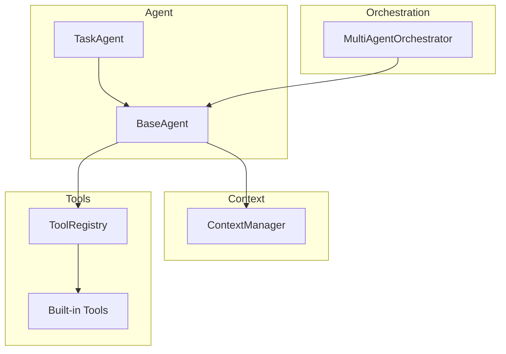
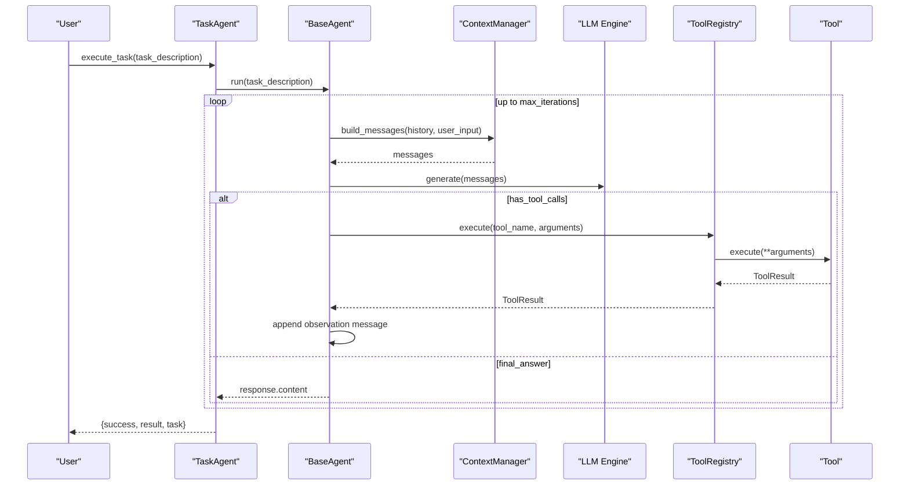
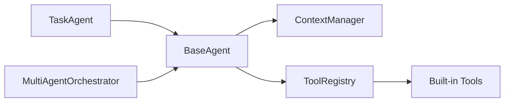

# Task Agent

<cite>
**Referenced Files in This Document**
- [task.py](file://harness/agent/task.py)
- [base.py](file://harness/agent/base.py)
- [orchestrator.py](file://harness/agent/orchestrator.py)
- [manager.py](file://harness/context/manager.py)
- [registry.py](file://harness/tools/registry.py)
- [base.py](file://harness/tools/base.py)
- [builtin.py](file://harness/tools/builtin.py)
- [demo_agent.py](file://demos/demo_agent.py)
- [SKILL.md](file://demos/skills/summarizer/SKILL.md)
- [README.md](file://README.md)
</cite>

## Table of Contents
1. Introduction
2. Project Structure
3. Core Components
4. Architecture Overview
5. Detailed Component Analysis
6. Dependency Analysis
7. Performance Considerations
8. Troubleshooting Guide
9. Conclusion
10. Appendices

## Introduction
This document explains the TaskAgent class designed for goal-oriented task completion. It specializes in executing complex tasks through structured planning, tool coordination, and result verification. You will learn how to define tasks, specify goals, evaluate success criteria, decompose tasks, track progress, handle partial failures, and optimize performance across different workloads such as data processing workflows, research tasks, and automated decision-making processes.

## Project Structure
The TaskAgent is part of a modular agent harness that includes:
- Agent loop and base agent behavior
- Context management for assembling prompts
- Tool system with registry and built-in tools
- Multi-agent orchestration
- Skills for reusable capabilities
- Demos demonstrating usage patterns

**Diagram sources**
- [task.py:32-73](file://harness/agent/task.py#L32-L73)
- [base.py:63-165](file://harness/agent/base.py#L63-L165)
- [manager.py:41-118](file://harness/context/manager.py#L41-L118)
- [registry.py:17-74](file://harness/tools/registry.py#L17-L74)
- [builtin.py:13-83](file://harness/tools/builtin.py#L13-L83)
- [orchestrator.py:31-152](file://harness/agent/orchestrator.py#L31-L152)

**Section sources**
- [README.md:73-131](file://README.md#L73-L131)

## Core Components
- TaskAgent: A specialized agent for completing specific tasks using tools, with higher iteration limits and structured output handling.
- BaseAgent: Implements the core agent loop (build context, call LLM, execute tools, repeat until final answer).
- ContextManager: Assembles system prompt, tool descriptions, memory, history, and current input into messages for each LLM call.
- ToolRegistry: Central catalog for registering, listing, and executing tools with error handling.
- Built-in Tools: Calculator, DateTime, and FileOps demonstrate safe tool implementations.
- MultiAgentOrchestrator: Routes requests to specialist agents or runs them in parallel for multi-perspective results.

Key behaviors:
- TaskAgent sets a task-oriented system prompt and defaults to more iterations for complex tasks.
- BaseAgent enforces max_iterations to prevent infinite loops and records execution traces.
- ContextManager injects tool instructions and available tools into the system prompt.
- ToolRegistry safely executes tools and returns standardized results.

**Section sources**
- [task.py:22-73](file://harness/agent/task.py#L22-L73)
- [base.py:63-165](file://harness/agent/base.py#L63-L165)
- [manager.py:41-118](file://harness/context/manager.py#L41-L118)
- [registry.py:17-74](file://harness/tools/registry.py#L17-L74)
- [builtin.py:13-83](file://harness/tools/builtin.py#L13-L83)
- [orchestrator.py:31-152](file://harness/agent/orchestrator.py#L31-L152)

## Architecture Overview
TaskAgent extends BaseAgent to provide a task-focused experience while leveraging the shared agent loop, context assembly, and tool execution infrastructure. The orchestrator can delegate tasks to TaskAgent or other specialists based on request content.

**Diagram sources**
- [task.py:54-73](file://harness/agent/task.py#L54-L73)
- [base.py:97-160](file://harness/agent/base.py#L97-L160)
- [manager.py:61-104](file://harness/context/manager.py#L61-L104)
- [registry.py:43-67](file://harness/tools/registry.py#L43-L67)
- [builtin.py:13-83](file://harness/tools/builtin.py#L13-L83)

## Detailed Component Analysis

### TaskAgent
- Purpose: Specialized agent for goal-oriented tasks with structured outputs and progress tracking via the underlying agent loop.
- Key features:
  - Uses a task-oriented system prompt instructing step-by-step planning and tool usage.
  - Defaults to higher max_iterations to support complex multi-step workflows.
  - Wraps BaseAgent.run to return a structured dict with success, result, and task fields.

Usage example path:
- See demo script invoking TaskAgent.execute_task with multiple tasks.

**Section sources**
- [task.py:22-73](file://harness/agent/task.py#L22-L73)
- [demo_agent.py:15-39](file://demos/demo_agent.py#L15-L39)

### BaseAgent and Agent Loop
- Purpose: Core execution cycle enabling tool use, multi-step reasoning, and self-correction.
- Behavior:
  - Builds context via ContextManager.
  - Calls LLM; if tool calls are requested, executes them and feeds observations back.
  - Repeats until final answer or max_iterations reached.
  - Records trace steps for debugging.

Progress tracking:
- AgentTrace captures LLM calls, tool calls, tool results, and final answers.

Failure handling:
- If max_iterations exceeded, returns a fallback message indicating inability to complete within allowed steps.

**Section sources**
- [base.py:38-61](file://harness/agent/base.py#L38-L61)
- [base.py:97-165](file://harness/agent/base.py#L97-L165)

### ContextManager
- Purpose: Assembles the full prompt for each LLM call by combining system prompt, tool descriptions, relevant memory, conversation history, and current input.
- Key aspects:
  - Injects tool instructions and lists available tools into the system prompt.
  - Retrieves relevant long-term memory context when using HybridMemory.
  - Stores assistant responses for future context.

Token estimation:
- Provides rough token counting to help manage context window constraints.

**Section sources**
- [manager.py:27-38](file://harness/context/manager.py#L27-L38)
- [manager.py:61-118](file://harness/context/manager.py#L61-L118)

### Tool System
- BaseTool: Abstract interface defining name, description, parameters, and execute method.
- ToolRegistry: Central registry for tool registration, lookup, listing, and execution with robust error handling.
- Built-in Tools:
  - CalculatorTool: Safe evaluation of mathematical expressions.
  - DateTimeTool: Returns current date/time information.
  - FileOpsTool: Read-only file operations (list directory contents, read file content).

Error handling:
- Registry catches exceptions and returns ToolResult with success=False and error details.

**Section sources**
- [base.py:16-67](file://harness/tools/base.py#L16-L67)
- [registry.py:17-74](file://harness/tools/registry.py#L17-L74)
- [builtin.py:13-83](file://harness/tools/builtin.py#L13-L83)

### Multi-Agent Orchestration
- Purpose: Coordinates multiple agents to complete complex tasks by selecting the best specialist or running all agents for diverse perspectives.
- Routing:
  - Uses LLM-based selection with a supervisor prompt describing available agents.
  - Falls back to keyword matching against agent descriptions.
- Execution modes:
  - run: delegates to the selected agent.
  - run_with_all: collects results from all agents.

**Section sources**
- [orchestrator.py:31-152](file://harness/agent/orchestrator.py#L31-L152)

### Skills
- Purpose: Reusable, markdown-defined capabilities that guide agent behavior for specific tasks.
- Example: Text Summarizer skill defines metadata and detailed instructions to produce concise summaries.

Integration:
- Skills can be loaded and applied to prompts to specialize agent behavior without code changes.

**Section sources**
- [SKILL.md:1-29](file://demos/skills/summarizer/SKILL.md#L1-L29)

## Dependency Analysis
TaskAgent depends on BaseAgent for the agent loop, which in turn depends on ContextManager and ToolRegistry. Built-in tools are registered via ToolRegistry and executed during the loop. Orchestrator can route tasks to TaskAgent or other agents.

**Diagram sources**
- [task.py:32-73](file://harness/agent/task.py#L32-L73)
- [base.py:63-165](file://harness/agent/base.py#L63-L165)
- [manager.py:41-118](file://harness/context/manager.py#L41-L118)
- [registry.py:17-74](file://harness/tools/registry.py#L17-L74)
- [builtin.py:13-83](file://harness/tools/builtin.py#L13-L83)
- [orchestrator.py:31-152](file://harness/agent/orchestrator.py#L31-L152)

**Section sources**
- [README.md:135-207](file://README.md#L135-L207)

## Performance Considerations
- Iteration budget: Adjust max_iterations to balance thoroughness vs. latency. Higher values allow deeper planning but increase cost and time.
- Context size: ContextManager estimates tokens; keep prompts concise and rely on memory retrieval to avoid exceeding model limits.
- Tool efficiency: Prefer targeted tools and minimal I/O. For file operations, limit reads and list sizes to reduce overhead.
- Parallelism: Use MultiAgentOrchestrator.run_with_all when multiple perspectives improve outcomes; otherwise, delegate to a single specialist to minimize cost.
- Prompt design: Clear, structured task descriptions improve tool selection and reduce retries. Include explicit success criteria to guide termination.

[No sources needed since this section provides general guidance]

## Troubleshooting Guide
Common issues and resolutions:
- Infinite loops: Ensure max_iterations is set appropriately; BaseAgent enforces a fallback after reaching the limit.
- Tool not found: Verify tool registration and correct names; ToolRegistry returns an error listing available tools.
- Tool execution errors: Inspect ToolResult.error; built-in tools validate inputs and return descriptive errors.
- Excessive context: Reduce history length or rely on memory retrieval; ContextManager stores assistant responses to maintain continuity.

Debugging aids:
- Use verbose logging to observe LLM raw outputs and tool calls/results.
- Review AgentTrace summary for step-by-step execution insights.

**Section sources**
- [base.py:116-160](file://harness/agent/base.py#L116-L160)
- [registry.py:43-67](file://harness/tools/registry.py#L43-L67)
- [builtin.py:19-74](file://harness/tools/builtin.py#L19-L74)

## Conclusion
TaskAgent provides a focused, goal-oriented approach to task completion by combining a structured system prompt, robust agent loop, and flexible tool integration. By designing clear task definitions, specifying goals and success criteria, and leveraging decomposition strategies, progress tracking, and failure handling, you can build reliable workflows for data processing, research, and automated decision-making. Optimize performance through careful iteration budgets, context management, and efficient tool usage.

[No sources needed since this section summarizes without analyzing specific files]

## Appendices

### Task Definition Formats and Success Criteria
- Task definition format: Provide a concise, unambiguous task_description that outlines the objective, required steps, and expected outcome.
- Goal specification: Include explicit goals and constraints (e.g., “Summarize the provided text into key points under 30% length”).
- Success criteria: Define measurable outcomes (e.g., “Return a JSON with fields X, Y, Z” or “Provide a final answer only when all sub-steps are verified”).

Guidance:
- Break complex tasks into sub-tasks and specify dependencies.
- Use skills to encapsulate domain-specific instructions and ensure consistent behavior.

**Section sources**
- [task.py:22-29](file://harness/agent/task.py#L22-L29)
- [SKILL.md:8-29](file://demos/skills/summarizer/SKILL.md#L8-L29)

### Common Task Patterns
- Data processing workflows: Chain tools to extract, transform, and validate data; verify intermediate results before proceeding.
- Research tasks: Use search-like tools (if available) and synthesize findings; summarize with skills for clarity.
- Automated decision-making: Define decision rules and thresholds; use tools to gather evidence and compute outcomes.

Implementation tips:
- Decompose tasks into sequential steps with clear handoffs.
- Track progress via AgentTrace and log tool results for auditability.
- Handle partial failures by retrying with adjusted inputs or falling back to alternative tools.

**Section sources**
- [base.py:97-160](file://harness/agent/base.py#L97-L160)
- [builtin.py:13-83](file://harness/tools/builtin.py#L13-L83)

### Designing Effective Task Prompts
- Be explicit about steps and expected outputs.
- Specify when to stop and what constitutes success.
- Include constraints (format, length, accuracy requirements).
- Leverage skills for domain-specific guidance.

**Section sources**
- [task.py:22-29](file://harness/agent/task.py#L22-L29)
- [SKILL.md:8-29](file://demos/skills/summarizer/SKILL.md#L8-L29)

### Optimizing Task Agent Performance
- Tune max_iterations per workload complexity.
- Minimize tool calls by pre-filtering inputs and caching results where possible.
- Use MultiAgentOrchestrator.run_with_all selectively for tasks benefiting from diverse perspectives.
- Keep prompts concise; rely on memory retrieval for historical context.

**Section sources**
- [base.py:73-90](file://harness/agent/base.py#L73-L90)
- [orchestrator.py:93-103](file://harness/agent/orchestrator.py#L93-L103)
- [manager.py:110-118](file://harness/context/manager.py#L110-L118)