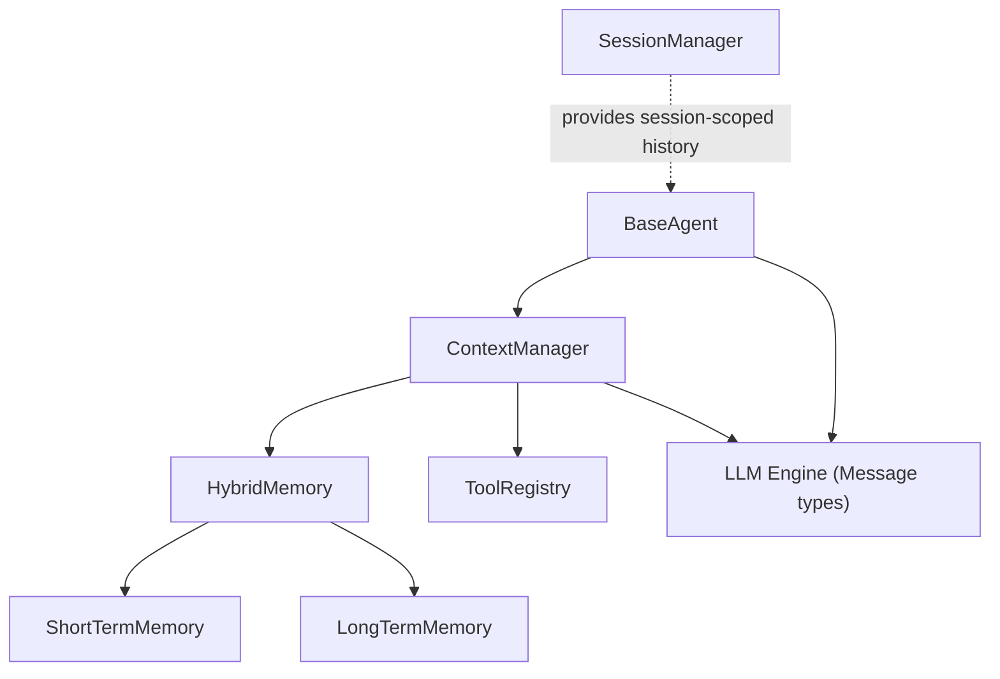
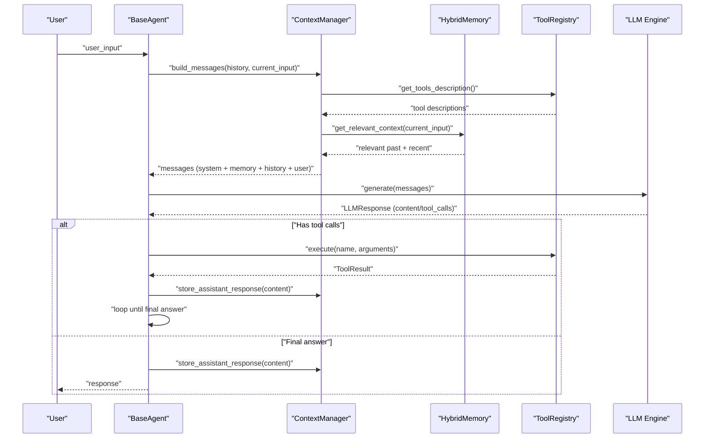
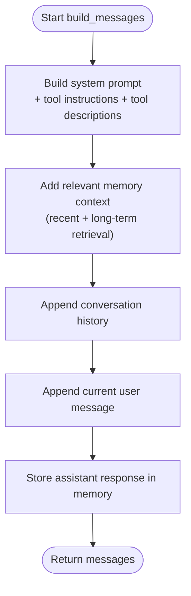
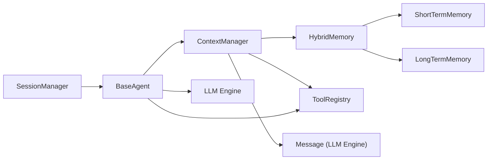

# Context Management

<cite>
**Referenced Files in This Document**
- [manager.py](file://harness/context/manager.py)
- [base.py](file://harness/memory/base.py)
- [hybrid.py](file://harness/memory/hybrid.py)
- [short_term.py](file://harness/memory/short_term.py)
- [long_term.py](file://harness/memory/long_term.py)
- [registry.py](file://harness/tools/registry.py)
- [base.py](file://harness/tools/base.py)
- [engine.py](file://harness/llm/engine.py)
- [base.py](file://harness/agent/base.py)
- [manager.py](file://harness/session/manager.py)
</cite>

## Table of Contents
1. [Introduction](#introduction)
2. [Project Structure](#project-structure)
3. [Core Components](#core-components)
4. [Architecture Overview](#architecture-overview)
5. [Detailed Component Analysis](#detailed-component-analysis)
6. [Dependency Analysis](#dependency-analysis)
7. [Performance Considerations](#performance-considerations)
8. [Troubleshooting Guide](#troubleshooting-guide)
9. [Conclusion](#conclusion)
10. [Appendices](#appendices)

## Introduction
This document explains the Context Management system that assembles optimal prompts for LLM consumption. It focuses on how the ContextManager coordinates system prompts, memory systems, tool descriptions, and conversation history to build efficient prompts while respecting context window limits. It also covers token estimation strategies, memory integration patterns, examples of custom context builders, prompt engineering best practices, and performance tuning for different context sizes. Common issues such as context overflow and relevance filtering are addressed with practical solutions grounded in the codebase.

## Project Structure
The Context Management system spans several modules:
- Context assembly and orchestration: harness/context/manager.py
- Memory abstractions and implementations: harness/memory/{base, short_term, long_term, hybrid}.py
- Tool description generation and execution: harness/tools/{base, registry}.py
- LLM message types and backends: harness/llm/engine.py
- Agent loop integration: harness/agent/base.py
- Session isolation: harness/session/manager.py

**Diagram sources**
- [manager.py:41-118](file://harness/context/manager.py#L41-L118)
- [hybrid.py:22-84](file://harness/memory/hybrid.py#L22-L84)
- [short_term.py:16-50](file://harness/memory/short_term.py#L16-L50)
- [long_term.py:24-109](file://harness/memory/long_term.py#L24-L109)
- [registry.py:17-74](file://harness/tools/registry.py#L17-L74)
- [engine.py:23-57](file://harness/llm/engine.py#L23-L57)
- [base.py:63-165](file://harness/agent/base.py#L63-L165)
- [manager.py:71-146](file://harness/session/manager.py#L71-L146)

**Section sources**
- [manager.py:1-118](file://harness/context/manager.py#L1-L118)
- [hybrid.py:1-84](file://harness/memory/hybrid.py#L1-L84)
- [registry.py:1-74](file://harness/tools/registry.py#L1-L74)
- [engine.py:1-421](file://harness/llm/engine.py#L1-L421)
- [base.py:1-165](file://harness/agent/base.py#L1-L165)
- [manager.py:1-146](file://harness/session/manager.py#L1-L146)

## Core Components
- ContextManager: Builds the final message list per LLM call by combining system prompt, tool instructions/descriptions, relevant memory context, conversation history, and current user input. It also stores assistant responses into memory and provides a rough token estimator.
- HybridMemory: Combines ShortTermMemory (recent messages) and LongTermMemory (persistent, TF-IDF retrieval). Provides get_relevant_context to merge recent and relevant memories into a single string for inclusion in prompts.
- ShortTermMemory: Bounded FIFO buffer of recent messages with keyword-based search.
- LongTermMemory: Persistent storage with TF-IDF retrieval and JSON persistence across sessions.
- ToolRegistry: Central catalog of tools; generates tool descriptions for system prompts and executes tools safely.
- BaseTool: Abstract definition for tools with name, description, parameters, and execute method; supports generating human-readable descriptions and schemas.
- LLM Engine Message types: Standardized Message, ToolCall, LLMResponse used throughout the pipeline.
- BaseAgent: Orchestrates the agent loop, using ContextManager to build messages, calling LLM, handling tool calls, and storing results.
- SessionManager: Manages isolated conversations with their own histories and metadata.

**Section sources**
- [manager.py:41-118](file://harness/context/manager.py#L41-L118)
- [hybrid.py:22-84](file://harness/memory/hybrid.py#L22-L84)
- [short_term.py:16-50](file://harness/memory/short_term.py#L16-L50)
- [long_term.py:24-109](file://harness/memory/long_term.py#L24-L109)
- [registry.py:17-74](file://harness/tools/registry.py#L17-L74)
- [base.py:30-67](file://harness/tools/base.py#L30-L67)
- [engine.py:23-57](file://harness/llm/engine.py#L23-L57)
- [base.py:63-165](file://harness/agent/base.py#L63-L165)
- [manager.py:71-146](file://harness/session/manager.py#L71-L146)

## Architecture Overview
The Context Management architecture integrates multiple subsystems to assemble an optimal prompt for each LLM call:

**Diagram sources**
- [base.py:97-160](file://harness/agent/base.py#L97-L160)
- [manager.py:61-108](file://harness/context/manager.py#L61-L108)
- [hybrid.py:46-73](file://harness/memory/hybrid.py#L46-L73)
- [registry.py:43-67](file://harness/tools/registry.py#L43-L67)
- [engine.py:138-141](file://harness/llm/engine.py#L138-L141)

## Detailed Component Analysis

### ContextManager: Prompt Assembly and Token Optimization
Responsibilities:
- Compose system prompt with base instructions and dynamic tool instructions/descriptions when tools are registered.
- Retrieve relevant memory context via HybridMemory.get_relevant_context(current_input), which merges recent conversation and relevant past memories.
- Append conversation history and current user input to form the complete message list.
- Persist assistant responses into memory for future retrieval.
- Provide estimate_tokens for rough token counting to manage context size.

Key behaviors:
- System prompt augmentation: If tools exist, inject tool usage instructions and concatenated tool descriptions.
- Memory integration: Uses HybridMemory to fetch both recent and relevant past content, formatted as a system message block labeled as relevant context.
- History management: Appends all prior messages from the active session’s history.
- Token estimation: Approximates tokens by dividing total characters by four; suitable for quick checks but not precise.

Optimization opportunities:
- Replace rough token estimation with actual tokenizer counts for precision.
- Implement truncation or summarization strategies when estimated tokens exceed max_context_tokens.
- Prioritize memory items by relevance score before inclusion.

**Section sources**
- [manager.py:41-118](file://harness/context/manager.py#L41-L118)

#### Context Building Flow

**Diagram sources**
- [manager.py:61-108](file://harness/context/manager.py#L61-L108)

### Memory Systems: Short-term, Long-term, and Hybrid Integration
- ShortTermMemory: Maintains a bounded deque of recent messages with FIFO eviction. Supports simple keyword matching for search within recent context.
- LongTermMemory: Persists messages to JSON and uses TF-IDF scoring to retrieve top-K relevant memories based on query terms.
- HybridMemory: Coordinates both short-term and long-term layers. get_relevant_context combines recent messages and relevant past memories, deduplicating by content to avoid redundancy.

Integration patterns:
- ContextManager queries HybridMemory.get_relevant_context(current_input) to obtain a merged context string.
- HybridMemory filters out duplicates between recent and relevant sets to keep context concise.
- LongTermMemory persists only user and assistant messages, ensuring knowledge continuity across sessions.

Relevance filtering:
- Short-term uses keyword overlap scoring.
- Long-term uses TF-IDF term frequency and inverse document frequency to rank relevance.

**Section sources**
- [short_term.py:16-50](file://harness/memory/short_term.py#L16-L50)
- [long_term.py:24-109](file://harness/memory/long_term.py#L24-L109)
- [hybrid.py:22-84](file://harness/memory/hybrid.py#L22-L84)

### Tool Descriptions and Registry: Dynamic Prompt Augmentation
- BaseTool defines name, description, parameters, and execute method; provides to_description() for human-readable prompt text and to_schema() for structured schema.
- ToolRegistry maintains a central map of tools, supports registration, listing, safe execution with error handling, and generates combined tool descriptions for system prompts.

Prompt engineering impact:
- Tool instructions guide the model to output structured tool_call blocks and wait for observations before answering.
- Tool descriptions inform the model about available capabilities and parameter expectations, improving tool selection accuracy.

**Section sources**
- [base.py:30-67](file://harness/tools/base.py#L30-L67)
- [registry.py:17-74](file://harness/tools/registry.py#L17-L74)

### LLM Engine Messages and Backends: Standardized Data Flow
- Message: Represents role-based messages (system/user/assistant/tool) with optional name and tool_call_id.
- ToolCall: Captures model-requested tool invocations with name, arguments, and raw_text.
- LLMResponse: Encapsulates generated content, tool_calls, and raw_output; includes has_tool_calls property.

Backends:
- TransformersBackend: Loads models via HuggingFace, applies chat templates, generates tokens, parses tool calls, and strips tool call blocks from content.
- MockBackend: Pattern-matching backend for demos/testing without GPU; simulates tool calls and responses.

Integration with Context Management:
- ContextManager builds Message lists consumed by LLM.generate().
- ToolCallParser extracts tool calls from model outputs; ContextManager relies on this flow indirectly through the agent loop.

**Section sources**
- [engine.py:23-57](file://harness/llm/engine.py#L23-L57)
- [engine.py:151-249](file://harness/llm/engine.py#L151-L249)
- [engine.py:254-399](file://harness/llm/engine.py#L254-L399)

### Agent Loop Integration: Coordination Between Context, Tools, and Memory
- BaseAgent constructs messages via ContextManager.build_messages(), calls LLM.generate(), handles tool calls by executing them through ToolRegistry, and feeds tool results back into the conversation.
- Assistant responses are stored in memory for future retrieval, enabling continuity across turns.
- Max iterations prevent infinite loops; fallback message is returned if exceeded.

**Section sources**
- [base.py:63-165](file://harness/agent/base.py#L63-L165)

### Session Management: Isolation and Persistence
- SessionManager manages multiple independent sessions with unique IDs, titles, and persisted JSON files.
- Each session holds its own messages and metadata; switching sessions isolates context and prevents cross-talk pollution.
- Useful for multi-topic workflows where separate contexts improve relevance and reduce token waste.

**Section sources**
- [manager.py:71-146](file://harness/session/manager.py#L71-L146)

## Dependency Analysis
The Context Management system exhibits clear separation of concerns:
- ContextManager depends on Memory (HybridMemory), ToolRegistry, and LLM Message types.
- HybridMemory composes ShortTermMemory and LongTermMemory.
- ToolRegistry encapsulates tool definitions and execution logic.
- BaseAgent orchestrates the loop and delegates to ContextManager and ToolRegistry.
- SessionManager provides isolated histories for agents.

Potential coupling points:
- ContextManager assumes HybridMemory interface; swapping memory implementations requires consistent methods.
- ToolRegistry must be populated before building prompts to ensure accurate tool descriptions.
- LLM backends must consume standardized Message lists.

Circular dependencies:
- None observed; dependencies are layered and unidirectional.

External integrations:
- TransformersBackend integrates with HuggingFace models and tokenizers.
- LongTermMemory persists to JSON files for cross-session continuity.

**Diagram sources**
- [manager.py:41-118](file://harness/context/manager.py#L41-L118)
- [hybrid.py:22-84](file://harness/memory/hybrid.py#L22-L84)
- [short_term.py:16-50](file://harness/memory/short_term.py#L16-L50)
- [long_term.py:24-109](file://harness/memory/long_term.py#L24-L109)
- [registry.py:17-74](file://harness/tools/registry.py#L17-L74)
- [engine.py:23-57](file://harness/llm/engine.py#L23-L57)
- [base.py:63-165](file://harness/agent/base.py#L63-L165)
- [manager.py:71-146](file://harness/session/manager.py#L71-L146)

**Section sources**
- [manager.py:41-118](file://harness/context/manager.py#L41-L118)
- [hybrid.py:22-84](file://harness/memory/hybrid.py#L22-L84)
- [registry.py:17-74](file://harness/tools/registry.py#L17-L74)
- [engine.py:23-57](file://harness/llm/engine.py#L23-L57)
- [base.py:63-165](file://harness/agent/base.py#L63-L165)
- [manager.py:71-146](file://harness/session/manager.py#L71-L146)

## Performance Considerations
- Token estimation: Current estimate_tokens divides character count by four; replace with actual tokenizer counts for precise control over context windows.
- Context trimming: When estimated tokens exceed max_context_tokens, implement prioritized truncation:
  - Keep system prompt and current user input intact.
  - Trim older conversation history first.
  - Limit number of relevant past memories included.
- Memory retrieval tuning: Adjust n_recent and n_relevant in HybridMemory.get_relevant_context to balance recency and relevance.
- Tool description size: Minimize tool descriptions to essential fields; consider dynamic inclusion based on user intent.
- Backend optimization: Use appropriate device settings and quantization in TransformersBackend to reduce latency and memory usage.
- Session isolation: Use SessionManager to avoid cross-context contamination, reducing noise and token waste.

[No sources needed since this section provides general guidance]

## Troubleshooting Guide
Common issues and resolutions:
- Context overflow:
  - Symptom: Exceeding model’s context window.
  - Resolution: Reduce n_recent/n_relevant; trim history; use shorter tool descriptions; implement token-aware truncation.
- Irrelevant memory inclusion:
  - Symptom: Poor response quality due to noisy context.
  - Resolution: Improve query phrasing; tune TF-IDF thresholds; filter duplicates more aggressively; prioritize high-relevance items.
- Tool call parsing failures:
  - Symptom: Model fails to produce valid tool_call blocks.
  - Resolution: Ensure tool instructions are present; validate tool names and parameters; add robust parsing fallbacks; log raw outputs for debugging.
- Memory persistence errors:
  - Symptom: Long-term memory not saved or loaded correctly.
  - Resolution: Check file permissions; handle JSON parse errors; verify storage path; log exceptions during save/load.
- Infinite agent loops:
  - Symptom: Agent does not terminate.
  - Resolution: Enforce max_iterations; provide fallback responses; ensure tool results are fed back properly.

**Section sources**
- [manager.py:110-118](file://harness/context/manager.py#L110-L118)
- [hybrid.py:46-73](file://harness/memory/hybrid.py#L46-L73)
- [long_term.py:77-105](file://harness/memory/long_term.py#L77-L105)
- [base.py:157-160](file://harness/agent/base.py#L157-L160)

## Conclusion
The Context Management system provides a robust foundation for assembling optimal prompts by integrating system prompts, tool descriptions, memory retrieval, and conversation history. The design emphasizes token efficiency, relevance filtering, and modular extensibility. By leveraging HybridMemory’s combination of recent and relevant context, and ToolRegistry’s dynamic prompt augmentation, the system balances coherence and conciseness. For production deployments, adopt precise token counting, implement adaptive truncation, and tune memory retrieval parameters to meet performance requirements.

[No sources needed since this section summarizes without analyzing specific files]

## Appendices

### Custom Context Builders: Examples and Best Practices
- Extend ContextManager to include domain-specific instructions or skill-based prompts.
- Integrate additional memory sources (e.g., vector embeddings) by implementing new memory classes and plugging them into HybridMemory.
- Use SessionManager to scope context per topic, improving relevance and reducing token usage.

Prompt engineering best practices:
- Keep system prompts concise and focused on role and constraints.
- Include only necessary tool descriptions; group related tools logically.
- Use clear separators and labels for memory sections to aid model comprehension.
- Avoid redundant information; deduplicate recent and relevant memories.

Performance tuning tips:
- Set appropriate max_context_tokens based on model limits.
- Monitor token usage and adjust memory retrieval parameters.
- Profile LLM backend performance and choose optimal device/settings.

[No sources needed since this section provides general guidance]