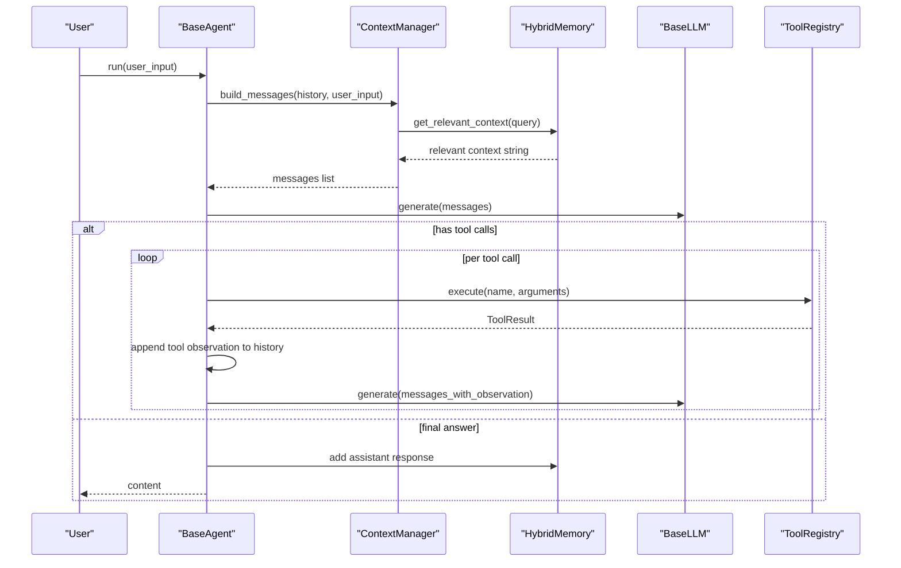
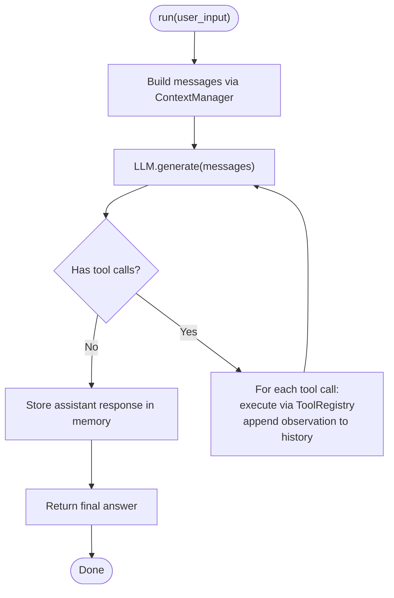
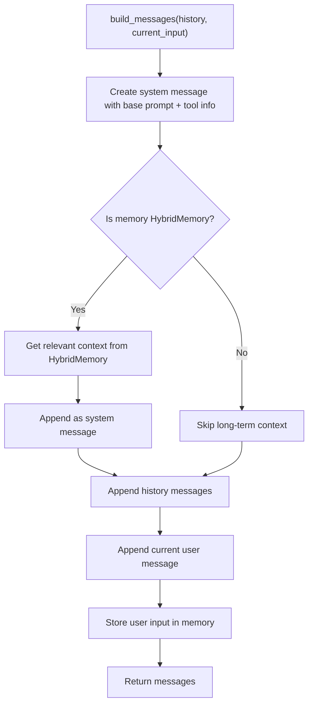
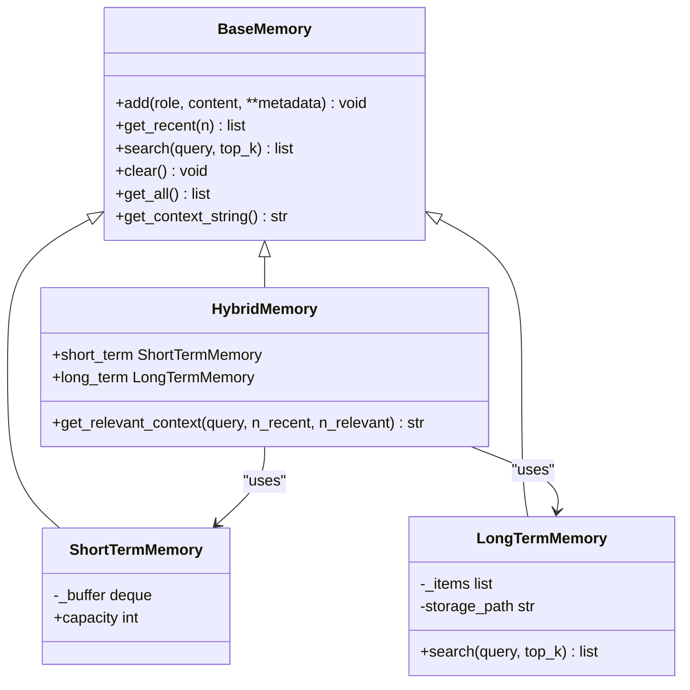
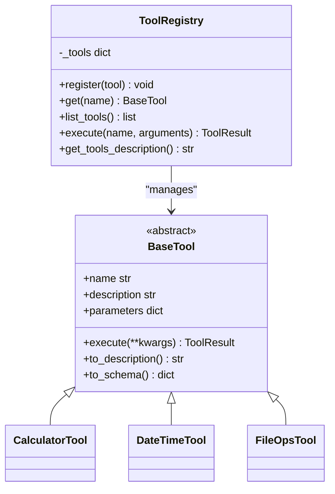
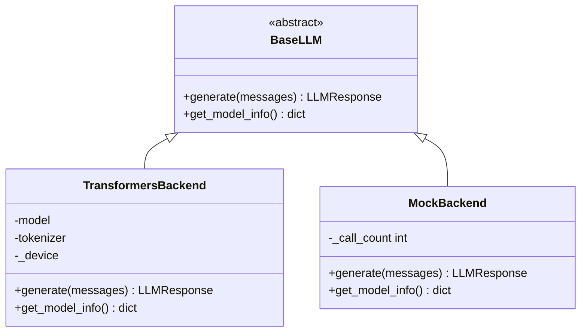
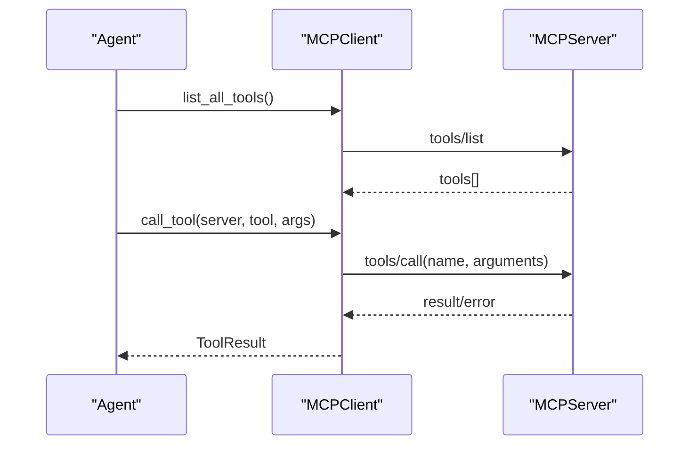
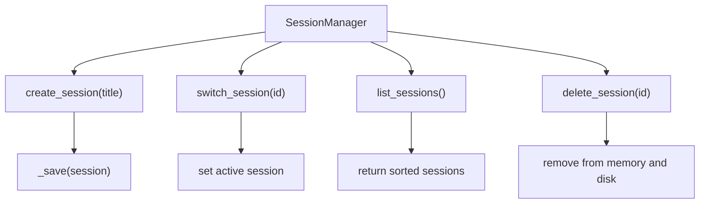
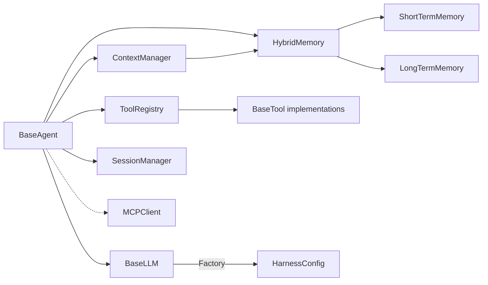

# Core Architecture

<cite>
**Referenced Files in This Document**
- [README.md](file://README.md)
- [harness/__init__.py](file://harness/__init__.py)
- [harness/config.py](file://harness/config.py)
- [harness/agent/base.py](file://harness/agent/base.py)
- [harness/context/manager.py](file://harness/context/manager.py)
- [harness/memory/base.py](file://harness/memory/base.py)
- [harness/memory/short_term.py](file://harness/memory/short_term.py)
- [harness/memory/long_term.py](file://harness/memory/long_term.py)
- [harness/memory/hybrid.py](file://harness/memory/hybrid.py)
- [harness/tools/base.py](file://harness/tools/base.py)
- [harness/tools/registry.py](file://harness/tools/registry.py)
- [harness/tools/builtin.py](file://harness/tools/builtin.py)
- [harness/llm/engine.py](file://harness/llm/engine.py)
- [harness/mcp/protocol.py](file://harness/mcp/protocol.py)
- [harness/session/manager.py](file://harness/session/manager.py)
- [harness/skill/base.py](file://harness/skill/base.py)
</cite>

## Table of Contents
1. Introduction
2. Project Structure
3. Core Components
4. Architecture Overview
5. Detailed Component Analysis
6. Dependency Analysis
7. Performance Considerations
8. Troubleshooting Guide
9. Conclusion
10. Appendices

## Introduction
This document explains the core architecture of HarnessAIDemo, focusing on design patterns and component interactions that enable autonomous AI agents. It covers the Agent Loop pattern, context management strategy, memory system hierarchy, tool integration framework, and LLM engine abstraction. It also documents how agents coordinate with tools, memory systems, and context managers; outlines technical decisions and trade-offs; and addresses infrastructure requirements, scalability considerations, deployment topology, configuration management, error handling, and extensibility patterns.

## Project Structure
HarnessAIDemo is organized into a modular harness package with clear separation of concerns:
- LLM engine abstraction with pluggable backends (Transformers and Mock)
- Tool system with registry and built-in tools
- Memory system with short-term, long-term, and hybrid strategies
- Context manager for assembling prompts
- Session manager for multi-session isolation
- MCP protocol implementation for standardized tool/resource access
- Skill system for declarative capabilities via Markdown

```mermaid
graph TB
subgraph "Agent Layer"
A["BaseAgent<br/>Agent Loop"]
end
subgraph "Context & Memory"
Ctx["ContextManager"]
MemH["HybridMemory"]
MemS["ShortTermMemory"]
MemL["LongTermMemory"]
end
subgraph "Tools"
Reg["ToolRegistry"]
Tools["Built-in Tools"]
end
subgraph "LLM Engine"
LLM["BaseLLM<br/>Transformers/Mock"]
end
subgraph "Cross-cutting"
Sess["SessionManager"]
MCP["MCPServer / MCPClient"]
Skill["Skill"]
Cfg["HarnessConfig"]
end
A --> Ctx
A --> Reg
A --> LLM
Ctx --> MemH
MemH --> MemS
MemH --> MemL
A --> Sess
A -.-> MCP
A -.-> Skill
A -.-> Cfg
```

**Diagram sources**
- [harness/agent/base.py:63-165](file://harness/agent/base.py#L63-L165)
- [harness/context/manager.py:41-118](file://harness/context/manager.py#L41-L118)
- [harness/memory/hybrid.py:22-84](file://harness/memory/hybrid.py#L22-L84)
- [harness/memory/short_term.py:16-50](file://harness/memory/short_term.py#L16-L50)
- [harness/memory/long_term.py:24-109](file://harness/memory/long_term.py#L24-L109)
- [harness/tools/registry.py:17-74](file://harness/tools/registry.py#L17-L74)
- [harness/tools/builtin.py:13-83](file://harness/tools/builtin.py#L13-L83)
- [harness/llm/engine.py:127-421](file://harness/llm/engine.py#L127-L421)
- [harness/session/manager.py:71-146](file://harness/session/manager.py#L71-L146)
- [harness/mcp/protocol.py:68-251](file://harness/mcp/protocol.py#L68-L251)
- [harness/skill/base.py:34-70](file://harness/skill/base.py#L34-L70)
- [harness/config.py:8-70](file://harness/config.py#L8-L70)

**Section sources**
- [README.md:73-131](file://README.md#L73-L131)
- [harness/__init__.py:1-16](file://harness/__init__.py#L1-L16)

## Core Components
- Agent Loop: The central execution cycle orchestrating context building, LLM calls, tool invocation, and response storage.
- Context Management: Assembles system prompt, tool descriptions, relevant memories, conversation history, and current input into messages for each LLM call.
- Memory System: Three-tiered design—short-term buffer, long-term persistent store with TF-IDF retrieval, and a hybrid combiner.
- Tool Integration Framework: Abstract BaseTool, ToolRegistry for discovery and execution, and built-in tools demonstrating safe operations.
- LLM Engine Abstraction: Pluggable backends (Transformers and Mock) with a unified interface and structured responses including tool calls.
- Session Management: Isolated conversations with persistence and switching.
- MCP Protocol: In-process server/client enabling standardized tool/resource/prompt exposure and invocation.
- Skill System: Declarative capabilities defined via Markdown to augment agent behavior.

**Section sources**
- [harness/agent/base.py:1-165](file://harness/agent/base.py#L1-L165)
- [harness/context/manager.py:1-118](file://harness/context/manager.py#L1-L118)
- [harness/memory/base.py:1-64](file://harness/memory/base.py#L1-L64)
- [harness/memory/short_term.py:1-50](file://harness/memory/short_term.py#L1-L50)
- [harness/memory/long_term.py:1-109](file://harness/memory/long_term.py#L1-L109)
- [harness/memory/hybrid.py:1-84](file://harness/memory/hybrid.py#L1-L84)
- [harness/tools/base.py:1-67](file://harness/tools/base.py#L1-L67)
- [harness/tools/registry.py:1-74](file://harness/tools/registry.py#L1-L74)
- [harness/tools/builtin.py:1-83](file://harness/tools/builtin.py#L1-L83)
- [harness/llm/engine.py:1-421](file://harness/llm/engine.py#L1-L421)
- [harness/session/manager.py:1-146](file://harness/session/manager.py#L1-L146)
- [harness/mcp/protocol.py:1-251](file://harness/mcp/protocol.py#L1-L251)
- [harness/skill/base.py:1-70](file://harness/skill/base.py#L1-L70)

## Architecture Overview
The system follows a layered, modular architecture centered around the Agent Loop. Each turn composes a rich context from multiple sources, invokes an LLM backend, executes tool calls as needed, and persists outcomes across sessions and memory stores. Cross-cutting concerns like configuration, sessions, skills, and MCP are integrated at boundaries to keep core logic focused.



**Diagram sources**
- [harness/agent/base.py:97-160](file://harness/agent/base.py#L97-L160)
- [harness/context/manager.py:61-104](file://harness/context/manager.py#L61-L104)
- [harness/memory/hybrid.py:46-73](file://harness/memory/hybrid.py#L46-L73)
- [harness/llm/engine.py:127-241](file://harness/llm/engine.py#L127-L241)
- [harness/tools/registry.py:43-67](file://harness/tools/registry.py#L43-L67)

## Detailed Component Analysis

### Agent Loop Pattern
- Purpose: Transform single-turn LLM usage into autonomous task completion by iterating until a final answer or max iterations.
- Key behaviors:
  - Build context using ContextManager
  - Call LLM.generate
  - If tool calls exist, execute via ToolRegistry and feed observations back
  - Persist assistant responses to memory
  - Enforce max_iterations to prevent infinite loops
- Extensibility: Subclass BaseAgent to customize system_prompt, tool_registry, memory, and iteration limits.



**Diagram sources**
- [harness/agent/base.py:97-160](file://harness/agent/base.py#L97-L160)

**Section sources**
- [harness/agent/base.py:1-165](file://harness/agent/base.py#L1-L165)

### Context Management Strategy
- Responsibilities:
  - Compose system prompt with tool instructions and descriptions
  - Retrieve relevant long-term context via HybridMemory
  - Include recent conversation history and current user input
  - Estimate tokens to manage context window constraints
- Design choices:
  - Tool descriptions injected dynamically based on registered tools
  - HybridMemory provides both recent and relevant past context
  - Token estimation uses a simple heuristic; production should use tokenizer-based counting



**Diagram sources**
- [harness/context/manager.py:61-104](file://harness/context/manager.py#L61-L104)

**Section sources**
- [harness/context/manager.py:1-118](file://harness/context/manager.py#L1-L118)

### Memory System Hierarchy
- Short-term memory: Bounded FIFO buffer for recent messages; supports keyword search.
- Long-term memory: Persistent JSON-backed store with TF-IDF retrieval; suitable for cross-session knowledge.
- Hybrid memory: Combines short-term recency with long-term relevance; used by default in agents.
- Trade-offs:
  - Short-term ensures low-latency access to recent context but limited capacity
  - Long-term enables persistence and retrieval but requires indexing/search overhead
  - Hybrid balances recency and relevance for robust prompting



**Diagram sources**
- [harness/memory/base.py:18-64](file://harness/memory/base.py#L18-L64)
- [harness/memory/short_term.py:16-50](file://harness/memory/short_term.py#L16-L50)
- [harness/memory/long_term.py:24-109](file://harness/memory/long_term.py#L24-L109)
- [harness/memory/hybrid.py:22-84](file://harness/memory/hybrid.py#L22-L84)

**Section sources**
- [harness/memory/base.py:1-64](file://harness/memory/base.py#L1-L64)
- [harness/memory/short_term.py:1-50](file://harness/memory/short_term.py#L1-L50)
- [harness/memory/long_term.py:1-109](file://harness/memory/long_term.py#L1-L109)
- [harness/memory/hybrid.py:1-84](file://harness/memory/hybrid.py#L1-L84)

### Tool Integration Framework
- BaseTool: Abstract contract defining name, description, parameters schema, and execute method; includes helpers to produce descriptions and schemas.
- ToolRegistry: Central catalog for tool registration, listing, and execution with error handling; generates combined tool descriptions for prompts.
- Built-in tools: Calculator, DateTime, FileOps demonstrate safe, constrained operations.
- Extensibility: Add custom tools by subclassing BaseTool and registering them; integrate MCP tools via MCPClient adapter.



**Diagram sources**
- [harness/tools/base.py:16-67](file://harness/tools/base.py#L16-L67)
- [harness/tools/registry.py:17-74](file://harness/tools/registry.py#L17-L74)
- [harness/tools/builtin.py:13-83](file://harness/tools/builtin.py#L13-L83)

**Section sources**
- [harness/tools/base.py:1-67](file://harness/tools/base.py#L1-L67)
- [harness/tools/registry.py:1-74](file://harness/tools/registry.py#L1-L74)
- [harness/tools/builtin.py:1-83](file://harness/tools/builtin.py#L1-L83)

### LLM Engine Abstraction
- BaseLLM: Defines generate and model_info interfaces for all backends.
- TransformersBackend: Loads models via transformers, applies chat templates, generates tokens, parses tool calls, and returns structured responses.
- MockBackend: Deterministic pattern-matching backend for demos without GPU; simulates tool calling flows.
- Factory: create_llm selects backend based on config.



**Diagram sources**
- [harness/llm/engine.py:127-241](file://harness/llm/engine.py#L127-L241)
- [harness/llm/engine.py:254-421](file://harness/llm/engine.py#L254-L421)

**Section sources**
- [harness/llm/engine.py:1-421](file://harness/llm/engine.py#L1-L421)

### MCP Protocol Integration
- MCPServer: Exposes tools, resources, and prompts via JSON-RPC style methods.
- MCPClient: Connects to servers, discovers tools, calls tools, and adapts MCP tools into harness BaseTool instances for seamless integration.
- Use cases: Standardized tool sharing across applications; decoupled tool providers; secure access control via protocol layer.



**Diagram sources**
- [harness/mcp/protocol.py:68-251](file://harness/mcp/protocol.py#L68-L251)

**Section sources**
- [harness/mcp/protocol.py:1-251](file://harness/mcp/protocol.py#L1-L251)

### Session Management
- Session: Encapsulates conversation history, metadata, and persistence.
- SessionManager: Creates, switches, lists, deletes, and persists sessions; maintains active session state.
- Benefits: Multi-topic isolation, independent contexts, and durable state across runs.



**Diagram sources**
- [harness/session/manager.py:71-146](file://harness/session/manager.py#L71-L146)

**Section sources**
- [harness/session/manager.py:1-146](file://harness/session/manager.py#L1-L146)

### Skill System
- Skill: Loaded from Markdown with metadata and instructions; can be applied to prompts to specialize agent behavior.
- Use cases: Reusable capabilities, sharable modules, and declarative augmentation of agent prompts.

**Section sources**
- [harness/skill/base.py:1-70](file://harness/skill/base.py#L1-L70)

## Dependency Analysis
Key dependencies and coupling:
- BaseAgent depends on ContextManager, ToolRegistry, BaseMemory, and BaseLLM.
- ContextManager depends on BaseMemory and ToolRegistry to assemble prompts.
- HybridMemory composes ShortTermMemory and LongTermMemory.
- ToolRegistry manages BaseTool implementations and provides execution.
- LLM engine backends implement BaseLLM; factory selects backend via HarnessConfig.
- MCPClient bridges external tool providers into the ToolRegistry.
- SessionManager persists and isolates conversation state.



**Diagram sources**
- [harness/agent/base.py:63-165](file://harness/agent/base.py#L63-L165)
- [harness/context/manager.py:41-118](file://harness/context/manager.py#L41-L118)
- [harness/memory/hybrid.py:22-84](file://harness/memory/hybrid.py#L22-L84)
- [harness/tools/registry.py:17-74](file://harness/tools/registry.py#L17-L74)
- [harness/llm/engine.py:404-421](file://harness/llm/engine.py#L404-L421)
- [harness/mcp/protocol.py:141-210](file://harness/mcp/protocol.py#L141-L210)
- [harness/session/manager.py:71-146](file://harness/session/manager.py#L71-L146)

**Section sources**
- [harness/config.py:8-70](file://harness/config.py#L8-L70)
- [harness/llm/engine.py:404-421](file://harness/llm/engine.py#L404-L421)

## Performance Considerations
- Context window management:
  - Use HybridMemory to balance recent and relevant context
  - Apply token estimation to avoid exceeding model limits
- Memory retrieval:
  - TF-IDF is lightweight but may not capture semantic similarity; consider vector embeddings for large corpora
- Tool execution:
  - Keep tools idempotent and fast; validate inputs early
  - Use read-only file operations where possible to reduce risk
- LLM backend selection:
  - TransformersBackend performance depends on device (CPU/CUDA/MPS) and model size
  - MockBackend is deterministic and fast for testing
- Session persistence:
  - Batch writes and avoid excessive IO; consider background flushes

[No sources needed since this section provides general guidance]

## Troubleshooting Guide
Common issues and resolutions:
- Unknown LLM backend: Ensure HARNESS_LLM_BACKEND is set to "transformers" or "mock"; verify dependencies for TransformersBackend.
- Tool not found: Check ToolRegistry registration and tool names; inspect available tools via registry listing.
- Infinite loops: Adjust max_iterations in AgentConfig; ensure tool results are properly appended as observations.
- Memory load/save errors: Validate storage paths and permissions; check JSON integrity for memory_store.json and session files.
- MCP tool errors: Verify server registration and method routing; handle error responses from MCPClient.

**Section sources**
- [harness/llm/engine.py:404-421](file://harness/llm/engine.py#L404-L421)
- [harness/tools/registry.py:43-67](file://harness/tools/registry.py#L43-L67)
- [harness/memory/long_term.py:77-105](file://harness/memory/long_term.py#L77-L105)
- [harness/session/manager.py:124-143](file://harness/session/manager.py#L124-L143)
- [harness/mcp/protocol.py:100-138](file://harness/mcp/protocol.py#L100-L138)

## Conclusion
HarnessAIDemo demonstrates a robust, modular architecture for building autonomous AI agents. The Agent Loop pattern drives iterative reasoning and tool use; ContextManager curates effective prompts; the memory hierarchy balances recency and relevance; the tool framework enables safe, extensible integrations; and the LLM abstraction supports flexible backends. Cross-cutting features like sessions, skills, and MCP provide isolation, reusability, and standardization. With careful configuration and attention to performance and error handling, this design scales to more complex multi-agent workflows and production deployments.

[No sources needed since this section summarizes without analyzing specific files]

## Appendices

### Infrastructure Requirements
- Python runtime and dependencies for chosen LLM backend
- Optional GPU acceleration for TransformersBackend
- Disk space for model downloads and persistent memory/session storage
- Environment variables for configuration

**Section sources**
- [README.md:284-298](file://README.md#L284-L298)
- [harness/config.py:8-70](file://harness/config.py#L8-L70)

### Scalability Considerations
- Replace TF-IDF with vector search for large-scale long-term memory
- Shard sessions and memory stores across directories or databases
- Offload MCP servers to separate processes for concurrency and isolation
- Cache frequent tool results and model outputs where appropriate

[No sources needed since this section provides general guidance]

### Deployment Topology
- Single-process demo: All components in one process (current implementation)
- Distributed mode: MCP servers as separate services; agents communicate via JSON-RPC over stdio or HTTP
- Containerized deployment: Package harness with required backends and configurations

[No sources needed since this section provides general guidance]

### Configuration Management
- HarnessConfig consolidates LLM, memory, and agent settings
- Environment-driven configuration via HARNESS_* variables
- Defaults provided for quick start; override per environment

**Section sources**
- [harness/config.py:8-70](file://harness/config.py#L8-L70)

### Error Handling Patterns
- ToolRegistry wraps tool execution in try/except and returns ToolResult with success flags
- LLM backends raise informative errors for missing dependencies or invalid configs
- MCP handles unknown methods and missing tools/resources gracefully
- Memory and session modules log and recover from IO errors

**Section sources**
- [harness/tools/registry.py:43-67](file://harness/tools/registry.py#L43-L67)
- [harness/llm/engine.py:171-204](file://harness/llm/engine.py#L171-L204)
- [harness/mcp/protocol.py:100-138](file://harness/mcp/protocol.py#L100-L138)
- [harness/memory/long_term.py:77-105](file://harness/memory/long_term.py#L77-L105)
- [harness/session/manager.py:124-143](file://harness/session/manager.py#L124-L143)

### Extensibility Patterns
- Add tools by subclassing BaseTool and registering them
- Implement new memory strategies by extending BaseMemory
- Introduce new LLM backends by implementing BaseLLM
- Extend skills by adding Markdown-defined SKILL.md modules
- Plug MCP servers to expose additional tools and resources

**Section sources**
- [harness/tools/base.py:30-67](file://harness/tools/base.py#L30-L67)
- [harness/memory/base.py:27-64](file://harness/memory/base.py#L27-L64)
- [harness/llm/engine.py:127-147](file://harness/llm/engine.py#L127-L147)
- [harness/skill/base.py:34-70](file://harness/skill/base.py#L34-L70)
- [harness/mcp/protocol.py:68-210](file://harness/mcp/protocol.py#L68-L210)