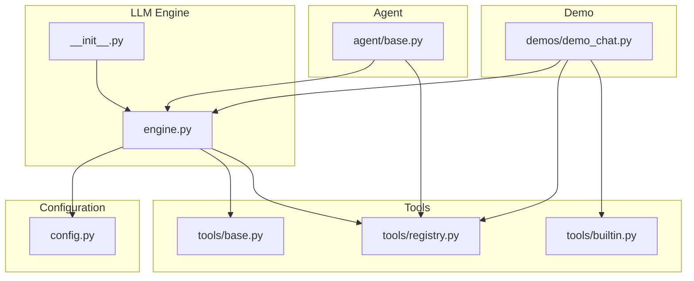
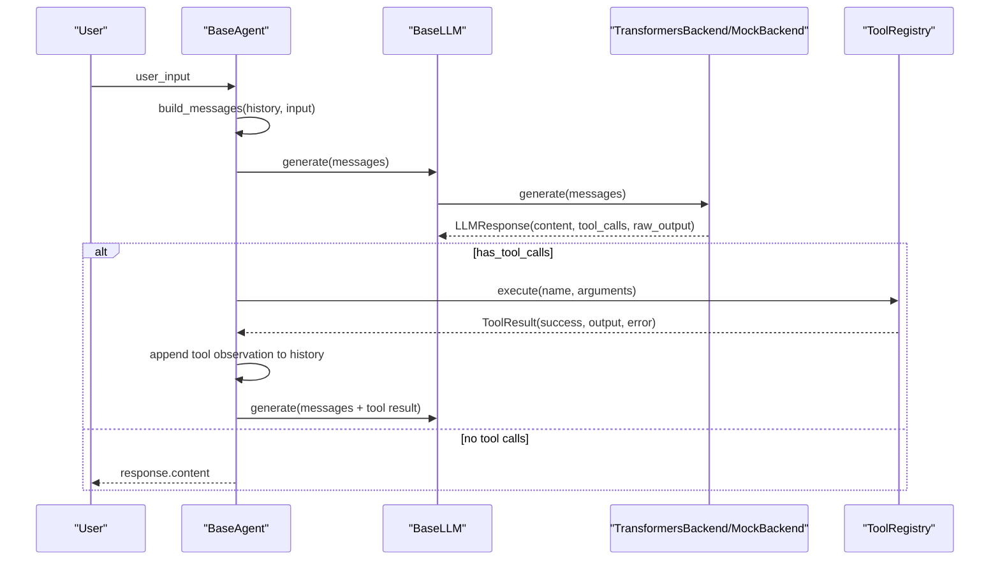
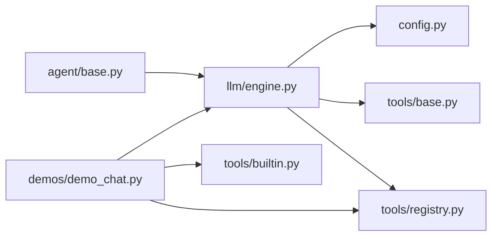
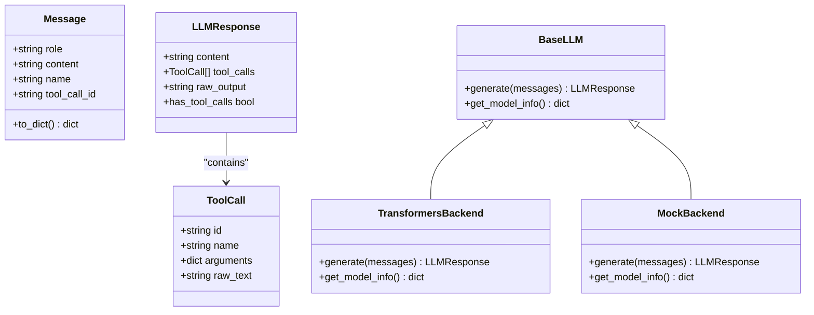

# LLM Engine

<cite>
**Referenced Files in This Document**
- [engine.py](file://harness/llm/engine.py)
- [__init__.py](file://harness/llm/__init__.py)
- [config.py](file://harness/config.py)
- [base.py](file://harness/tools/base.py)
- [registry.py](file://harness/tools/registry.py)
- [builtin.py](file://harness/tools/builtin.py)
- [base.py](file://harness/agent/base.py)
- [demo_chat.py](file://demos/demo_chat.py)
</cite>

## Table of Contents
1. [Introduction](#introduction)
2. [Project Structure](#project-structure)
3. [Core Components](#core-components)
4. [Architecture Overview](#architecture-overview)
5. [Detailed Component Analysis](#detailed-component-analysis)
6. [Dependency Analysis](#dependency-analysis)
7. [Performance Considerations](#performance-considerations)
8. [Troubleshooting Guide](#troubleshooting-guide)
9. [Conclusion](#conclusion)
10. [Appendices](#appendices)

## Introduction
This document explains the LLM Engine component that provides a pluggable abstraction for language model backends and demonstrates how to integrate real models (Transformers) with a deterministic mock backend for testing. It covers:
- The BaseLLM interface and its role as a stable contract between agents and backends
- TransformersBackend for real inference via HuggingFace transformers
- MockBackend for fast, GPU-free demos and tests
- Standardized message format and tool call parsing
- Configuration options for different providers and devices
- Error handling strategies and performance considerations
- Examples and patterns for implementing custom backends and integrating them into the agent loop

## Project Structure
The LLM Engine lives under harness/llm and integrates with configuration, tools, and the agent loop.

**Diagram sources**
- [engine.py:1-421](file://harness/llm/engine.py#L1-L421)
- [__init__.py:1-6](file://harness/llm/__init__.py#L1-L6)
- [config.py:1-70](file://harness/config.py#L1-L70)
- [base.py:1-67](file://harness/tools/base.py#L1-L67)
- [registry.py:1-74](file://harness/tools/registry.py#L1-L74)
- [builtin.py:1-83](file://harness/tools/builtin.py#L1-L83)
- [base.py:1-165](file://harness/agent/base.py#L1-L165)
- [demo_chat.py:1-47](file://demos/demo_chat.py#L1-L47)

**Section sources**
- [engine.py:1-421](file://harness/llm/engine.py#L1-L421)
- [config.py:1-70](file://harness/config.py#L1-L70)
- [base.py:1-165](file://harness/agent/base.py#L1-L165)
- [registry.py:1-74](file://harness/tools/registry.py#L1-L74)
- [builtin.py:1-83](file://harness/tools/builtin.py#L1-L83)
- [demo_chat.py:1-47](file://demos/demo_chat.py#L1-L47)

## Core Components
- Message, ToolCall, LLMResponse: standardized data types flowing through the system
- ToolCallParser: extracts structured tool calls from free-form text outputs
- BaseLLM: abstract interface every backend must implement
- TransformersBackend: loads a real model from HuggingFace, applies chat templates, generates tokens, parses tool calls
- MockBackend: deterministic pattern-based responses for testing and demos
- create_llm(): factory that selects the backend based on configuration

Key responsibilities:
- Abstracting model-specific details behind a uniform generate(messages) -> LLMResponse interface
- Parsing tool calls robustly from varied output formats
- Providing configuration-driven device selection and generation parameters
- Enabling seamless integration with the agent loop and tool registry

**Section sources**
- [engine.py:21-147](file://harness/llm/engine.py#L21-L147)
- [engine.py:149-250](file://harness/llm/engine.py#L149-L250)
- [engine.py:252-400](file://harness/llm/engine.py#L252-L400)
- [engine.py:402-421](file://harness/llm/engine.py#L402-L421)

## Architecture Overview
The LLM Engine sits between the Agent and the Model. Agents build messages and call llm.generate(). Backends return structured responses with optional tool calls. The agent executes tools and feeds results back to the LLM until a final answer is produced.

**Diagram sources**
- [base.py:97-160](file://harness/agent/base.py#L97-L160)
- [engine.py:206-241](file://harness/llm/engine.py#L206-L241)
- [engine.py:268-359](file://harness/llm/engine.py#L268-L359)
- [registry.py:43-60](file://harness/tools/registry.py#L43-L60)

## Detailed Component Analysis

### Data Models and Message Format Standardization
- Message: represents a single turn with role, content, optional name, and tool_call_id; includes serialization to dict for tokenizers
- ToolCall: captures id, name, arguments, and raw_text for traceability
- LLMResponse: aggregates content, tool_calls, and raw_output; exposes has_tool_calls for control flow

These types standardize conversation state and tool invocation across all backends and agents.

**Section sources**
- [engine.py:21-57](file://harness/llm/engine.py#L21-L57)

### Tool Call Parser
- Parses multiple formats:
  - Triple-backtick blocks labeled tool_call
  - Action/Action Input pairs
  - Bare JSON objects containing name and arguments
- Normalizes field names (name/tool, arguments/args/parameters)
- Deduplicates identical calls by keying on name+arguments
- Returns ToolCall instances with generated ids and original raw_text

Robustness features:
- Graceful handling of malformed JSON or missing fields
- Safe fallbacks when parsing fails

**Section sources**
- [engine.py:59-123](file://harness/llm/engine.py#L59-L123)

### BaseLLM Abstraction
- Defines generate(messages) -> LLMResponse and get_model_info() -> dict
- Accepts LLMConfig for provider/device settings
- Ensures consistent interface for any future backends

Design benefits:
- Decouples agents from model implementation details
- Enables swapping backends without changing agent code

**Section sources**
- [engine.py:125-147](file://harness/llm/engine.py#L125-L147)

### TransformersBackend
Responsibilities:
- Lazy imports of transformers and torch to avoid heavy dependencies unless used
- Device auto-detection (cuda, mps, cpu)
- Loads tokenizer and model with appropriate dtype and device mapping
- Applies model-specific chat template via tokenizer.apply_chat_template
- Generates tokens with configurable max_new_tokens and temperature
- Parses tool calls from raw output and strips tool call blocks from content
- Exposes model info for diagnostics

Error handling:
- Raises ImportError if required packages are missing
- Uses torch.no_grad() for inference efficiency

Performance notes:
- Uses float16 on non-CPU devices to reduce memory usage
- Only decodes newly generated tokens to minimize overhead

**Section sources**
- [engine.py:149-250](file://harness/llm/engine.py#L149-L250)

### MockBackend
Responsibilities:
- Deterministic responses for demos and tests without GPU
- Pattern matching to simulate tool calls for datetime, calculator, and file operations
- Handles tool observations by synthesizing answers
- Provides simple expression and path extraction helpers

Use cases:
- Rapid iteration on agent logic
- CI-friendly tests
- Demonstrations where model download is not desired

**Section sources**
- [engine.py:252-400](file://harness/llm/engine.py#L252-L400)

### Factory Function
- create_llm(config) selects backend based on config.backend
- Falls back to environment-derived LLMConfig if none provided
- Logs selected backend and model name

Integration:
- Used by demos and higher-level components to obtain an LLM instance

**Section sources**
- [engine.py:402-421](file://harness/llm/engine.py#L402-L421)

### Agent Loop Integration
- Builds context messages using ContextManager
- Calls llm.generate(messages)
- If tool calls present, executes them via ToolRegistry and appends tool observations
- Repeats until final answer or max iterations reached
- Records execution trace for debugging

This loop relies on the standardized LLMResponse structure and tool call parsing to orchestrate multi-step reasoning.

**Section sources**
- [base.py:97-160](file://harness/agent/base.py#L97-L160)

### Tools System Integration
- Built-in tools demonstrate parameter schemas and safe execution
- Registry centralizes tool discovery and execution with error handling
- Tool descriptions are included in prompts so models know when to call tools

Examples:
- CalculatorTool evaluates safe math expressions
- DateTimeTool returns current date/time
- FileOpsTool lists directories or reads files safely

**Section sources**
- [base.py:1-67](file://harness/tools/base.py#L1-L67)
- [registry.py:1-74](file://harness/tools/registry.py#L1-L74)
- [builtin.py:1-83](file://harness/tools/builtin.py#L1-L83)

### Demo Usage
- demo_chat.py sets environment to use MockBackend by default
- Creates LLM via create_llm(), registers built-in tools, and runs interactive chat
- Shows model info and available tools at startup

**Section sources**
- [demo_chat.py:1-47](file://demos/demo_chat.py#L1-L47)

## Dependency Analysis
High-level dependencies among core modules:

**Diagram sources**
- [base.py:1-165](file://harness/agent/base.py#L1-L165)
- [engine.py:1-421](file://harness/llm/engine.py#L1-L421)
- [config.py:1-70](file://harness/config.py#L1-L70)
- [base.py:1-67](file://harness/tools/base.py#L1-L67)
- [registry.py:1-74](file://harness/tools/registry.py#L1-L74)
- [builtin.py:1-83](file://harness/tools/builtin.py#L1-L83)
- [demo_chat.py:1-47](file://demos/demo_chat.py#L1-L47)

**Section sources**
- [engine.py:1-421](file://harness/llm/engine.py#L1-L421)
- [base.py:1-165](file://harness/agent/base.py#L1-L165)
- [registry.py:1-74](file://harness/tools/registry.py#L1-L74)
- [builtin.py:1-83](file://harness/tools/builtin.py#L1-L83)
- [demo_chat.py:1-47](file://demos/demo_chat.py#L1-L47)

## Performance Considerations
- Device selection: TransformersBackend auto-selects cuda/mps/cpu; prefer GPU acceleration for faster inference
- Dtype optimization: float16 on non-CPU devices reduces memory footprint
- Generation limits: tune max_new_tokens to balance quality and latency
- Temperature: set to 0 for deterministic outputs in tests; increase for creativity
- Tokenizer chat templates: leverage model-specific formatting to improve instruction following
- Tool call parsing overhead: minimal regex and JSON parsing; ensure model outputs follow expected patterns for best performance
- Memory management: reuse model instances per process; avoid reloading models frequently

[No sources needed since this section provides general guidance]

## Troubleshooting Guide
Common issues and resolutions:
- Missing dependencies for TransformersBackend:
  - Symptom: ImportError mentioning transformers/torch
  - Resolution: Install required packages before using TransformersBackend
- Unknown backend:
  - Symptom: ValueError indicating unknown backend
  - Resolution: Set HARNESS_LLM_BACKEND to "transformers" or "mock"
- Tool not found:
  - Symptom: ToolResult with success=False and error listing available tools
  - Resolution: Register the tool in ToolRegistry before execution
- Tool execution errors:
  - Symptom: ToolResult.error populated after execution
  - Resolution: Inspect tool.execute implementation and inputs; check permissions for file operations
- Infinite loops:
  - Symptom: Agent reaches max_iterations without final answer
  - Resolution: Increase max_iterations or refine prompts/tool definitions; verify tool call parsing works as expected

Operational tips:
- Use MockBackend during development to avoid long model downloads
- Log raw_output to inspect model output and debug parsing issues
- Validate tool schemas and parameter names to match model expectations

**Section sources**
- [engine.py:171-179](file://harness/llm/engine.py#L171-L179)
- [engine.py:413-421](file://harness/llm/engine.py#L413-L421)
- [registry.py:43-60](file://harness/tools/registry.py#L43-L60)
- [base.py:157-160](file://harness/agent/base.py#L157-L160)

## Conclusion
The LLM Engine provides a clean abstraction over diverse model backends, enabling agents to focus on orchestration rather than model specifics. The standardized message and tool call formats, combined with robust parsing and flexible configuration, support both real-time inference and deterministic testing. By following the patterns outlined here, you can integrate new backends, extend tool capabilities, and optimize performance for your use case.

[No sources needed since this section summarizes without analyzing specific files]

## Appendices

### Configuration Options
- LLMConfig fields:
  - backend: "transformers" or "mock"
  - model_name: HuggingFace model identifier
  - max_new_tokens: maximum tokens per response
  - temperature: sampling temperature
  - device: "cpu", "cuda", "mps", or "auto"
- Environment variables:
  - HARNESS_LLM_BACKEND
  - HARNESS_MODEL_NAME
  - HARNESS_MAX_TOKENS
  - HARNESS_TEMPERATURE
  - HARNESS_DEVICE

**Section sources**
- [config.py:8-34](file://harness/config.py#L8-L34)

### Example: Custom Backend Implementation
To implement a custom backend:
- Subclass BaseLLM
- Implement generate(messages) -> LLMResponse
- Implement get_model_info() -> dict
- Optionally parse tool calls using ToolCallParser or your own logic
- Register via create_llm or directly instantiate and pass to agents

Integration pattern:
- Create LLM instance via create_llm with a custom backend string or direct instantiation
- Pass the LLM instance to BaseAgent or ChatAgent
- Ensure tool registry is configured with available tools

**Section sources**
- [engine.py:125-147](file://harness/llm/engine.py#L125-L147)
- [engine.py:402-421](file://harness/llm/engine.py#L402-L421)
- [base.py:73-95](file://harness/agent/base.py#L73-L95)

### Example: Using the Engine in a Demo
- Set environment to use MockBackend for quick start
- Create LLM via create_llm()
- Register built-in tools
- Instantiate agent and run interactive chat

**Section sources**
- [demo_chat.py:1-47](file://demos/demo_chat.py#L1-L47)

### Class Diagram: LLM Engine Types

**Diagram sources**
- [engine.py:21-57](file://harness/llm/engine.py#L21-L57)
- [engine.py:125-147](file://harness/llm/engine.py#L125-L147)
- [engine.py:149-250](file://harness/llm/engine.py#L149-L250)
- [engine.py:252-400](file://harness/llm/engine.py#L252-L400)