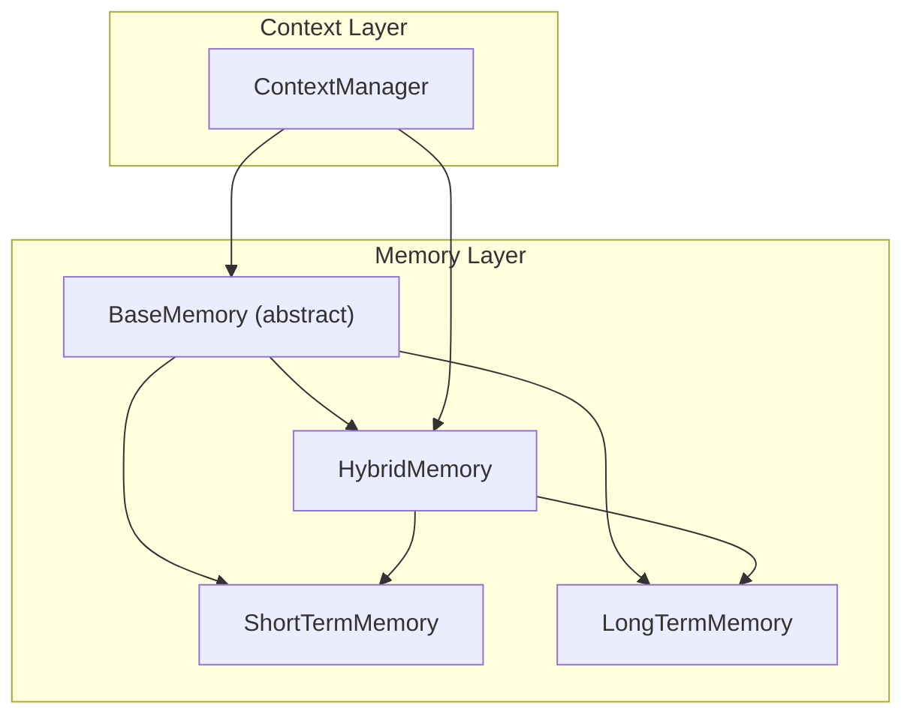
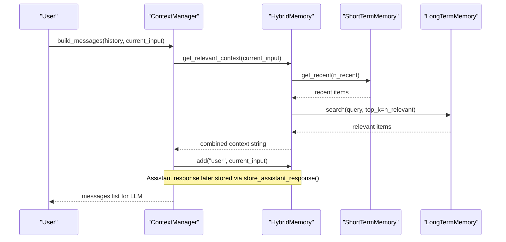
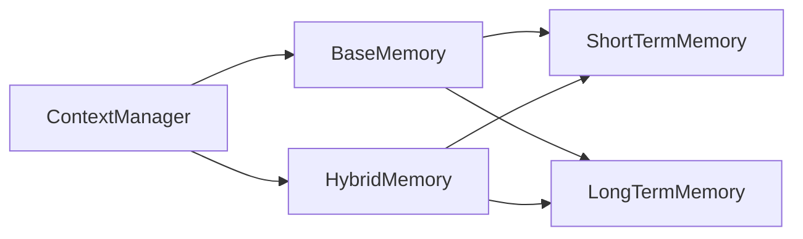
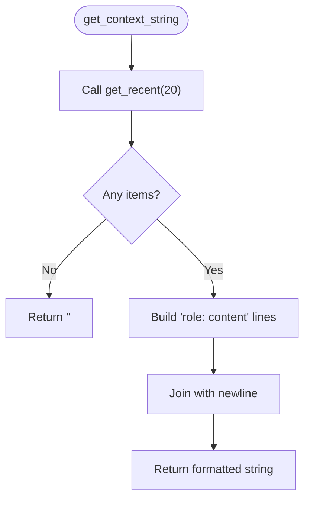

# Base Memory Interface

<cite>
**Referenced Files in This Document**
- [base.py](file://harness/memory/base.py)
- [short_term.py](file://harness/memory/short_term.py)
- [long_term.py](file://harness/memory/long_term.py)
- [hybrid.py](file://harness/memory/hybrid.py)
- [manager.py](file://harness/context/manager.py)
</cite>

## Table of Contents
1. [Introduction](#introduction)
2. [Project Structure](#project-structure)
3. [Core Components](#core-components)
4. [Architecture Overview](#architecture-overview)
5. [Detailed Component Analysis](#detailed-component-analysis)
6. [Dependency Analysis](#dependency-analysis)
7. [Performance Considerations](#performance-considerations)
8. [Troubleshooting Guide](#troubleshooting-guide)
9. [Conclusion](#conclusion)
10. [Appendices](#appendices)

## Introduction
This document explains the BaseMemory interface and the MemoryItem data structure that define a unified contract for all memory implementations in the system. It details how agents store, retrieve, search, and manage conversation context across short-term and long-term stores, and shows how to implement custom memory strategies by extending BaseMemory. It also explains how get_context_string() formats recent memory for prompt integration.

## Project Structure
The memory subsystem is organized around an abstract base class and multiple concrete strategies:
- BaseMemory defines the contract (add, get_recent, search, clear, get_all, get_context_string).
- ShortTermMemory provides a bounded FIFO buffer for recent messages.
- LongTermMemory persists items with TF-IDF retrieval.
- HybridMemory composes both to provide production-ready behavior.
- ContextManager integrates memory into the LLM prompt pipeline.

**Diagram sources**
- [base.py:27-63](file://harness/memory/base.py#L27-L63)
- [short_term.py:16-49](file://harness/memory/short_term.py#L16-L49)
- [long_term.py:24-108](file://harness/memory/long_term.py#L24-L108)
- [hybrid.py:22-83](file://harness/memory/hybrid.py#L22-L83)
- [manager.py:41-108](file://harness/context/manager.py#L41-L108)

**Section sources**
- [base.py:1-63](file://harness/memory/base.py#L1-L63)
- [short_term.py:1-50](file://harness/memory/short_term.py#L1-L50)
- [long_term.py:1-109](file://harness/memory/long_term.py#L1-L109)
- [hybrid.py:1-84](file://harness/memory/hybrid.py#L1-L84)
- [manager.py:1-118](file://harness/context/manager.py#L1-L118)

## Core Components
- MemoryItem: A dataclass representing a single stored item with role, content, timestamp, and metadata fields.
- BaseMemory: An abstract base class defining the standard memory API:
  - add(role, content, **metadata): Store a new item.
  - get_recent(n): Retrieve the n most recent items.
  - search(query, top_k=5): Semantic or keyword-based retrieval.
  - clear(): Clear all memory.
  - get_all(): Return all items.
  - get_context_string(): Format recent memory as a string for prompts.

These components provide a consistent interface so higher-level code (like ContextManager) can work with any memory strategy without knowing implementation details.

**Section sources**
- [base.py:18-63](file://harness/memory/base.py#L18-L63)

## Architecture Overview
The memory architecture separates concerns:
- Short-term memory keeps a rolling window of recent messages to fit within the LLM’s context window.
- Long-term memory persists knowledge and supports retrieval via TF-IDF scoring.
- Hybrid memory combines both: it always includes recent context and augments it with relevant past memories based on the current query.
- ContextManager orchestrates message assembly, injecting system instructions, tool descriptions, memory context, history, and the current user input.

**Diagram sources**
- [manager.py:61-108](file://harness/context/manager.py#L61-L108)
- [hybrid.py:22-83](file://harness/memory/hybrid.py#L22-L83)
- [short_term.py:16-49](file://harness/memory/short_term.py#L16-L49)
- [long_term.py:24-108](file://harness/memory/long_term.py#L24-L108)

## Detailed Component Analysis

### MemoryItem Data Structure
MemoryItem encapsulates a single memory entry:
- role: The speaker role (e.g., "user", "assistant").
- content: The textual content of the message.
- timestamp: Creation time (defaulted to current time).
- metadata: Optional key-value store for additional signals (e.g., importance, embeddings, source).

This simple, serializable structure enables persistence and flexible extension.

**Section sources**
- [base.py:18-24](file://harness/memory/base.py#L18-L24)

### BaseMemory Abstract Contract
BaseMemory defines the core methods every memory implementation must support:
- add(role, content, **metadata): Persist a new item.
- get_recent(n): Return the n most recent items.
- search(query, top_k=5): Retrieve relevant items for a query.
- clear(): Remove all stored items.
- get_all(): Return all items.
- get_context_string(): Build a prompt-friendly string from recent memory.

Implementers focus on storage and retrieval specifics; callers rely on this stable contract.

**Section sources**
- [base.py:27-63](file://harness/memory/base.py#L27-L63)

### ShortTermMemory
- Uses a bounded deque to maintain recent messages with FIFO eviction when capacity is exceeded.
- get_recent returns the tail of the buffer up to n items.
- search performs simple keyword overlap scoring against recent content.
- clear empties the buffer; get_all returns a snapshot.

Use cases:
- Keeping only the most relevant recent turns within token limits.
- Fast, lightweight retrieval for immediate context.

**Section sources**
- [short_term.py:16-49](file://harness/memory/short_term.py#L16-L49)

### LongTermMemory
- Persists items to a JSON file and loads them at startup.
- search implements TF-IDF scoring:
  - Tokenizes query and item content.
  - Computes term frequency and inverse document frequency.
  - Ranks items by score and returns top_k with positive scores.
- get_recent returns the last n items; get_all returns all; clear removes all and persists.

Use cases:
- Persistent knowledge across sessions.
- Keyword-based semantic retrieval without heavy dependencies.

**Section sources**
- [long_term.py:24-108](file://harness/memory/long_term.py#L24-L108)

### HybridMemory
- Composes ShortTermMemory and LongTermMemory.
- add writes to short-term and, for user/assistant roles, also persists to long-term.
- get_recent delegates to short-term.
- search delegates to long-term.
- get_relevant_context builds a combined context:
  - Recent conversation section from short-term.
  - Relevant past memories section from long-term, deduplicated against recent content.
- clear clears both stores; get_all returns long-term contents; __len__ sums both sizes.

Use cases:
- Production-ready memory that balances recency and relevance.

**Section sources**
- [hybrid.py:22-83](file://harness/memory/hybrid.py#L22-L83)

### ContextManager Integration
- Injects system prompt and optional tool instructions.
- For HybridMemory, calls get_relevant_context to assemble prior context.
- Appends conversation history and current user input.
- Stores user input and assistant responses in memory for future turns.
- Provides rough token estimation for context window management.

**Section sources**
- [manager.py:41-108](file://harness/context/manager.py#L41-L108)

## Dependency Analysis
- BaseMemory is the central abstraction; all concrete classes depend on it.
- ShortTermMemory depends only on base types and collections.
- LongTermMemory depends on base types and standard libraries for persistence and TF-IDF.
- HybridMemory depends on both ShortTermMemory and LongTermMemory.
- ContextManager depends on BaseMemory (and uses HybridMemory by default), integrating memory into the prompt pipeline.

**Diagram sources**
- [base.py:27-63](file://harness/memory/base.py#L27-L63)
- [short_term.py:16-49](file://harness/memory/short_term.py#L16-L49)
- [long_term.py:24-108](file://harness/memory/long_term.py#L24-L108)
- [hybrid.py:22-83](file://harness/memory/hybrid.py#L22-L83)
- [manager.py:41-108](file://harness/context/manager.py#L41-L108)

**Section sources**
- [base.py:27-63](file://harness/memory/base.py#L27-L63)
- [hybrid.py:22-83](file://harness/memory/hybrid.py#L22-L83)
- [manager.py:41-108](file://harness/context/manager.py#L41-L108)

## Performance Considerations
- ShortTermMemory: O(1) append and bounded memory usage; get_recent is O(n); search is O(m) where m is buffer size.
- LongTermMemory: search is O(d * t) where d is number of documents and t is query terms; persistence adds I/O overhead on add/clear.
- HybridMemory: Combines fast short-term access with potentially expensive long-term search; consider tuning n_recent and top_k to balance latency and quality.
- ContextManager: Builds larger prompts by merging recent and relevant contexts; monitor token estimates to avoid exceeding model limits.

[No sources needed since this section provides general guidance]

## Troubleshooting Guide
- Empty or missing long-term store:
  - Ensure storage_path exists and is writable; check logs for load/save errors.
- Search returning no results:
  - Verify content has meaningful tokens; adjust query wording or increase top_k.
- Excessive context length:
  - Reduce n_recent or top_k; use shorter content or prune metadata.
- Memory not persisting:
  - Confirm add is called for user/assistant roles in HybridMemory; verify write permissions.

**Section sources**
- [long_term.py:77-105](file://harness/memory/long_term.py#L77-L105)
- [hybrid.py:33-37](file://harness/memory/hybrid.py#L33-L37)
- [manager.py:110-118](file://harness/context/manager.py#L110-L118)

## Conclusion
BaseMemory and MemoryItem provide a clean, extensible foundation for memory in conversational AI systems. By implementing the contract, you can plug in specialized strategies tailored to your needs—whether focused on speed, persistence, or hybrid retrieval. ContextManager demonstrates how to integrate memory into real-time prompting while respecting token constraints.

[No sources needed since this section summarizes without analyzing specific files]

## Appendices

### Implementing a Custom Memory Strategy
To create a custom memory type:
- Subclass BaseMemory and implement add, get_recent, search, clear, and get_all.
- Optionally override get_context_string if you need custom formatting.
- Integrate with ContextManager by passing your instance instead of HybridMemory.

Example pattern:
- Define a class that inherits from BaseMemory.
- Implement each method according to your storage mechanism (e.g., in-memory cache, database, vector store).
- Use get_context_string to produce prompt-friendly text, or customize it for domain-specific formatting.

**Section sources**
- [base.py:27-63](file://harness/memory/base.py#L27-L63)

### How get_context_string Formats Memory for Prompts
- Retrieves recent items via get_recent(20).
- If none exist, returns an empty string.
- Otherwise, joins lines of "role: content" with newline separators.
- This compact format is suitable for direct injection into prompts.

**Diagram sources**
- [base.py:55-63](file://harness/memory/base.py#L55-L63)

**Section sources**
- [base.py:55-63](file://harness/memory/base.py#L55-L63)