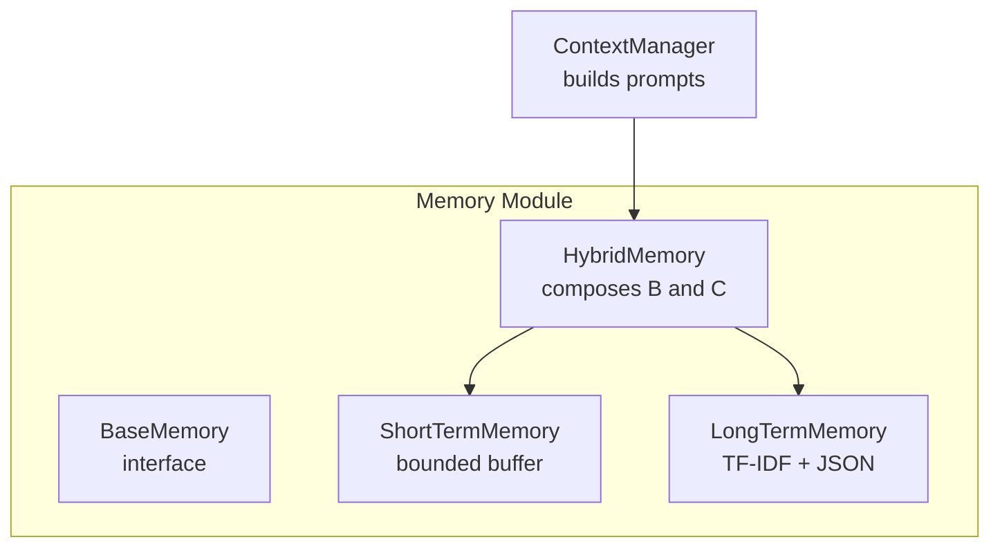
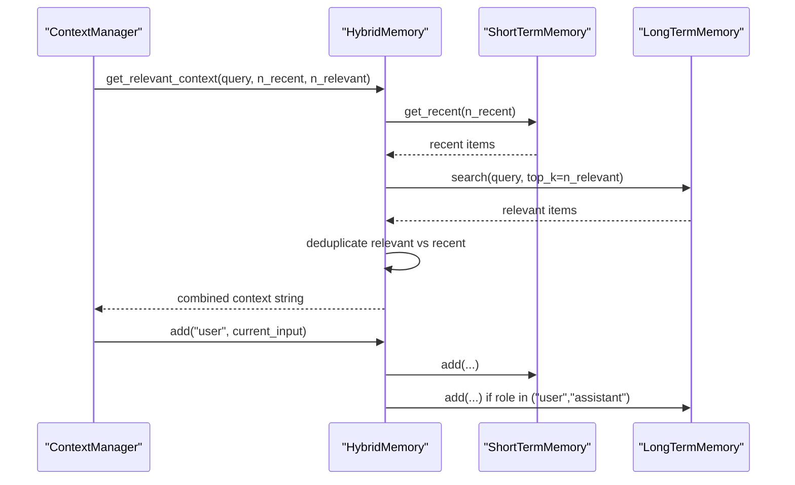
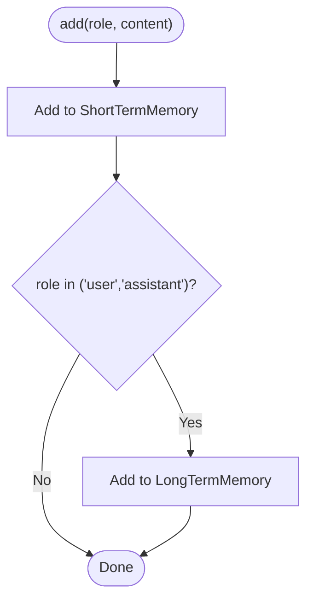
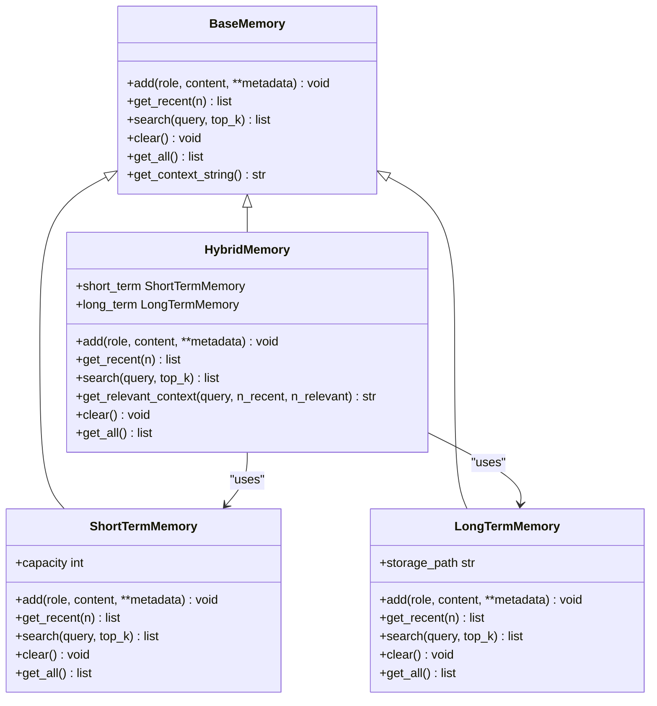

# Hybrid Memory

<cite>
**Referenced Files in This Document**
- [hybrid.py](file://harness/memory/hybrid.py)
- [short_term.py](file://harness/memory/short_term.py)
- [long_term.py](file://harness/memory/long_term.py)
- [base.py](file://harness/memory/base.py)
- [manager.py](file://harness/context/manager.py)
- [config.py](file://harness/config.py)
- [__init__.py](file://harness/memory/__init__.py)
</cite>

## Table of Contents
1. [Introduction](#introduction)
2. [Project Structure](#project-structure)
3. [Core Components](#core-components)
4. [Architecture Overview](#architecture-overview)
5. [Detailed Component Analysis](#detailed-component-analysis)
6. [Dependency Analysis](#dependency-analysis)
7. [Performance Considerations](#performance-considerations)
8. [Troubleshooting Guide](#troubleshooting-guide)
9. [Conclusion](#conclusion)
10. [Appendices](#appendices)

## Introduction
This document explains the HybridMemory implementation that combines short-term and long-term memory strategies to provide both immediate context and persistent knowledge for AI agents. It details how queries are routed between bounded buffers and persistent storage, describes the retrieval logic used to select relevant past memories, and provides guidance on configuration, performance tuning, monitoring, and production best practices.

HybridMemory is designed as the recommended production memory strategy: it keeps recent conversation turns in a bounded buffer (short-term) while persisting user and assistant messages to a long-term store with TF-IDF-based retrieval. The ContextManager integrates HybridMemory into prompts by combining recent history with retrieved relevant memories, ensuring efficient use of the LLM’s context window.

## Project Structure
The memory subsystem is organized around a base interface and three concrete implementations:
- BaseMemory defines the contract for all memory stores.
- ShortTermMemory implements a bounded FIFO buffer for recent messages.
- LongTermMemory persists messages to JSON and retrieves relevant items via TF-IDF scoring.
- HybridMemory composes both to coordinate add/search operations and build combined context strings.

**Diagram sources**
- [base.py:27-64](file://harness/memory/base.py#L27-L64)
- [short_term.py:16-50](file://harness/memory/short_term.py#L16-L50)
- [long_term.py:24-109](file://harness/memory/long_term.py#L24-L109)
- [hybrid.py:22-84](file://harness/memory/hybrid.py#L22-L84)
- [manager.py:41-118](file://harness/context/manager.py#L41-L118)

**Section sources**
- [base.py:1-64](file://harness/memory/base.py#L1-L64)
- [short_term.py:1-50](file://harness/memory/short_term.py#L1-L50)
- [long_term.py:1-109](file://harness/memory/long_term.py#L1-L109)
- [hybrid.py:1-84](file://harness/memory/hybrid.py#L1-L84)
- [manager.py:1-118](file://harness/context/manager.py#L1-L118)

## Core Components
- BaseMemory: Abstract interface defining add, get_recent, search, clear, get_all, and a default context formatter.
- ShortTermMemory: In-memory deque with fixed capacity; supports keyword overlap search over recent items.
- LongTermMemory: Persistent JSON-backed store; uses TF-IDF scoring to retrieve top-k relevant items for a query.
- HybridMemory: Orchestrates short-term and long-term stores; routes writes to both (with role filtering), builds combined context from recent and relevant memories, and exposes unified APIs.

Key responsibilities:
- Routing writes: All messages go to short-term; only user and assistant messages are persisted to long-term.
- Routing reads: Recent messages come from short-term; relevant past memories come from long-term based on query semantics.
- Context assembly: get_relevant_context merges recent and relevant memories, deduplicating content already present in recent.

**Section sources**
- [base.py:18-64](file://harness/memory/base.py#L18-L64)
- [short_term.py:16-50](file://harness/memory/short_term.py#L16-L50)
- [long_term.py:24-109](file://harness/memory/long_term.py#L24-L109)
- [hybrid.py:22-84](file://harness/memory/hybrid.py#L22-L84)

## Architecture Overview
HybridMemory coordinates two complementary stores:
- Short-term: fast, bounded, always includes the most recent conversation turns.
- Long-term: persistent across sessions, retrieves semantically relevant memories using TF-IDF.

The ContextManager uses HybridMemory to assemble prompts:
- System prompt plus tool instructions
- Relevant past context from HybridMemory.get_relevant_context(current_input)
- Conversation history (recent messages)
- Current user input

**Diagram sources**
- [manager.py:61-108](file://harness/context/manager.py#L61-L108)
- [hybrid.py:33-73](file://harness/memory/hybrid.py#L33-L73)
- [short_term.py:23-40](file://harness/memory/short_term.py#L23-L40)
- [long_term.py:32-68](file://harness/memory/long_term.py#L32-L68)

## Detailed Component Analysis

### HybridMemory
Responsibilities:
- Compose ShortTermMemory and LongTermMemory instances.
- Route writes: add to short-term; persist user/assistant messages to long-term.
- Provide unified read interfaces: get_recent delegates to short-term; search delegates to long-term.
- Build combined context: merge recent and relevant memories, removing duplicates.

Routing logic:
- Writes: Always to short-term; conditional persistence to long-term based on role.
- Reads: Recent messages from short-term; relevant past memories from long-term via TF-IDF search.

Context building:
- Includes recent messages first.
- Retrieves relevant past memories based on the current query.
- Filters out any relevant items whose content already appears in recent to avoid duplication.

**Diagram sources**
- [hybrid.py:33-37](file://harness/memory/hybrid.py#L33-L37)

**Section sources**
- [hybrid.py:22-84](file://harness/memory/hybrid.py#L22-L84)

### ShortTermMemory
Implementation:
- Uses a bounded deque to maintain a fixed number of recent messages (FIFO eviction).
- Provides get_recent to return the last N items.
- Implements a simple keyword overlap search for quick relevance within recent context.

Complexity:
- add: O(1) amortized due to deque append.
- get_recent: O(n) to slice the last n items.
- search: O(m * k) where m is buffer size and k is average word count per item; uses set intersection for overlap scoring.

Use cases:
- Ensuring the model sees the most recent conversation without exceeding token limits.
- Fast, lightweight relevance checks within recent context.

**Section sources**
- [short_term.py:16-50](file://harness/memory/short_term.py#L16-L50)

### LongTermMemory
Implementation:
- Persists all items to a JSON file and loads them at startup.
- Implements TF-IDF retrieval:
  - Computes term frequency (tf) per item.
  - Computes inverse document frequency (idf) across all items.
  - Scores each item by summing tf*idf for query terms present in the item.
  - Returns top-k items with positive scores.

Complexity:
- add: O(1) plus I/O to save JSON.
- search: O(d * w) where d is number of stored items and w is average words per item; dominated by scanning all items to compute scores.
- _save/_load: O(d) I/O operations.

Production note:
- The comment indicates vector embeddings and a vector database would be used in production for better semantic retrieval.

**Section sources**
- [long_term.py:24-109](file://harness/memory/long_term.py#L24-L109)

### ContextManager Integration
Responsibilities:
- Builds the full message list for each LLM call.
- Injects system prompt and tool instructions.
- Calls HybridMemory.get_relevant_context(current_input) to include relevant past context.
- Appends conversation history and current user input.
- Stores user input and assistant responses in memory for future turns.

Integration points:
- Defaults to HybridMemory when no memory is provided.
- Estimates tokens to help manage context window constraints.

**Section sources**
- [manager.py:41-118](file://harness/context/manager.py#L41-L118)

## Dependency Analysis
- HybridMemory depends on ShortTermMemory and LongTermMemory.
- Both ShortTermMemory and LongTermMemory implement BaseMemory.
- ContextManager depends on BaseMemory but typically uses HybridMemory in practice.
- Configuration provides defaults for memory behavior (capacity, persistence path, thresholds).

**Diagram sources**
- [base.py:18-64](file://harness/memory/base.py#L18-L64)
- [short_term.py:16-50](file://harness/memory/short_term.py#L16-L50)
- [long_term.py:24-109](file://harness/memory/long_term.py#L24-L109)
- [hybrid.py:22-84](file://harness/memory/hybrid.py#L22-L84)

**Section sources**
- [__init__.py:1-6](file://harness/memory/__init__.py#L1-L6)
- [config.py:37-44](file://harness/config.py#L37-L44)

## Performance Considerations
- Short-term memory:
  - Capacity tuning: Increase short_term_capacity to retain more recent context; decrease to reduce token usage.
  - Search cost: Keyword overlap is cheap but limited in semantic coverage; suitable for recent context only.

- Long-term memory:
  - Retrieval cost: TF-IDF scans all stored items; consider limiting top_k and pruning old or low-value items.
  - Persistence overhead: Each add triggers a JSON write; batched writes or background flushes can reduce I/O pressure in high-throughput scenarios.
  - Semantic quality: TF-IDF is keyword-based; for richer semantics, replace with vector embeddings and a vector database as noted in comments.

- Context assembly:
  - Deduplication: HybridMemory filters relevant items already present in recent to avoid redundant context.
  - Token budget: Use ContextManager.estimate_tokens to approximate token counts and enforce max_context_tokens.

- Monitoring:
  - Track sizes: len(short_term) and len(long_term) to monitor growth and eviction behavior.
  - Log retrieval results: Inspect top_k items returned by LongTermMemory.search to validate relevance.
  - File I/O: Monitor memory_store.json size and write latency.

[No sources needed since this section provides general guidance]

## Troubleshooting Guide
Common issues and remedies:
- No relevant memories returned:
  - Ensure sufficient items exist in LongTermMemory; empty store returns no results.
  - Verify query terms appear in stored content; TF-IDF requires matching keywords.
  - Adjust top_k or refine queries to improve recall.

- Excessive context size:
  - Reduce n_recent or n_relevant in get_relevant_context.
  - Lower short_term_capacity to limit recent history.
  - Use ContextManager.max_context_tokens to cap prompt size.

- Persistence failures:
  - Check file permissions for storage_path; errors are logged during save/load.
  - Validate JSON integrity if manual edits occur.

- Duplicate context:
  - HybridMemory deduplicates relevant items against recent content; ensure content uniqueness or adjust thresholds.

**Section sources**
- [long_term.py:77-105](file://harness/memory/long_term.py#L77-L105)
- [manager.py:110-118](file://harness/context/manager.py#L110-L118)

## Conclusion
HybridMemory provides a practical, production-ready approach to balancing immediate context with persistent knowledge. By routing writes to both short-term and long-term stores and assembling prompts from recent and relevant memories, it enables agents to maintain conversational coherence while leveraging historical knowledge. For advanced semantic retrieval, consider upgrading LongTermMemory to vector embeddings and a vector database. Careful configuration of capacities, retrieval parameters, and token budgets ensures efficient operation under real-world constraints.

[No sources needed since this section summarizes without analyzing specific files]

## Appendices

### Configuration Examples
- Default HybridMemory:
  - short_term_capacity: 20
  - storage_path: "memory_store.json"
- Customized HybridMemory:
  - Increase short_term_capacity for longer recent context windows.
  - Change storage_path to isolate sessions or environments.
- MemoryConfig fields:
  - short_term_capacity: controls buffer size.
  - long_term_enabled: toggle persistence.
  - memory_file: path to JSON store.
  - similarity_threshold: placeholder for future thresholding.

**Section sources**
- [hybrid.py:25-31](file://harness/memory/hybrid.py#L25-L31)
- [config.py:37-44](file://harness/config.py#L37-L44)

### Best Practices for Production
- Start with HybridMemory as the default memory strategy.
- Tune short_term_capacity based on typical conversation length and token budgets.
- Limit top_k in LongTermMemory.search to control retrieval cost and context size.
- Monitor memory_store.json growth and prune or archive old entries periodically.
- Replace TF-IDF with vector embeddings and a vector database for improved semantic retrieval.
- Enforce max_context_tokens in ContextManager to prevent oversized prompts.
- Log retrieval results and token estimates to diagnose performance and relevance issues.

[No sources needed since this section provides general guidance]