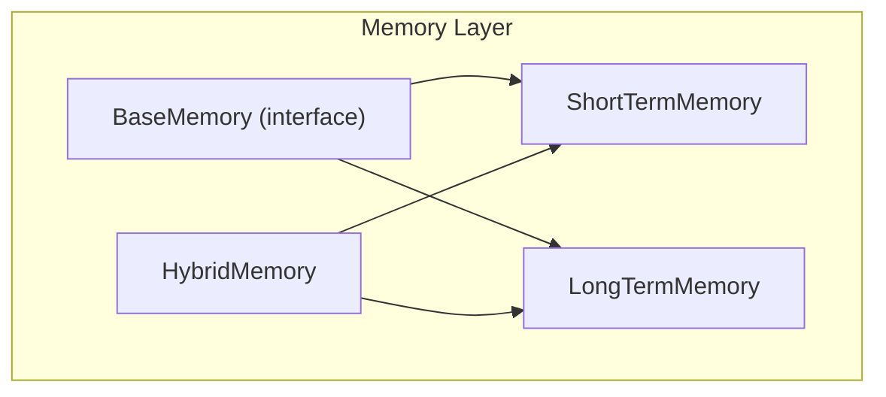
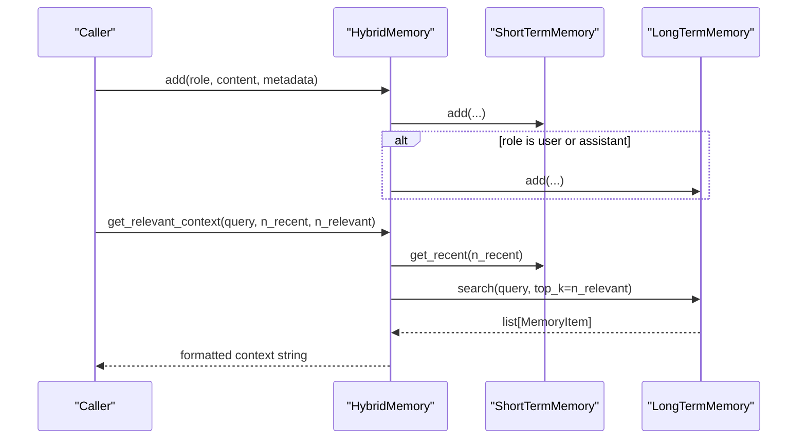
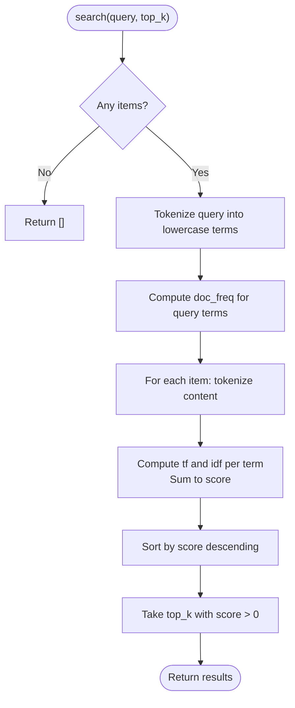
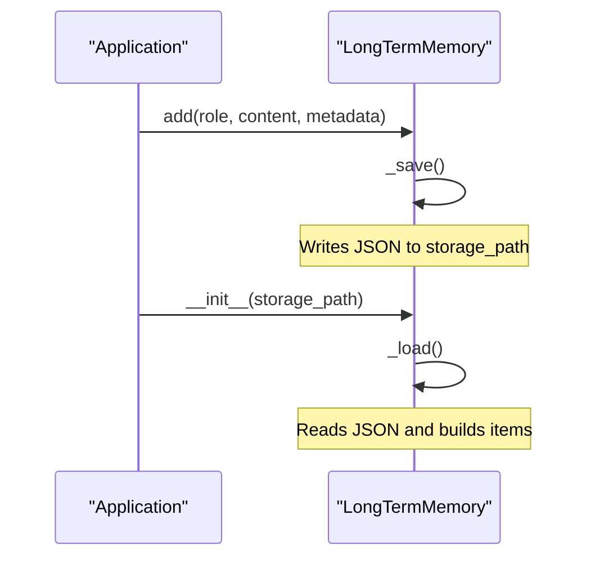
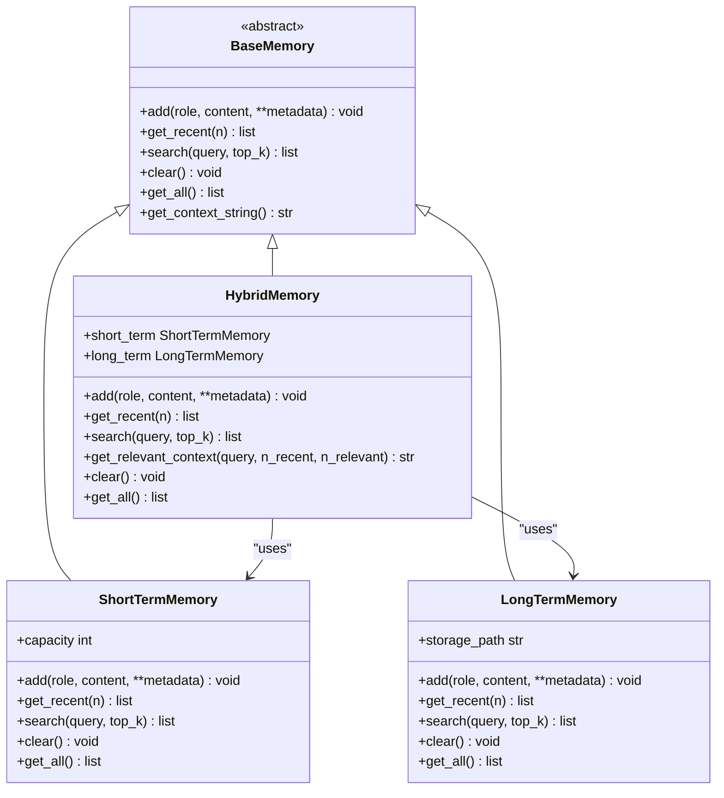
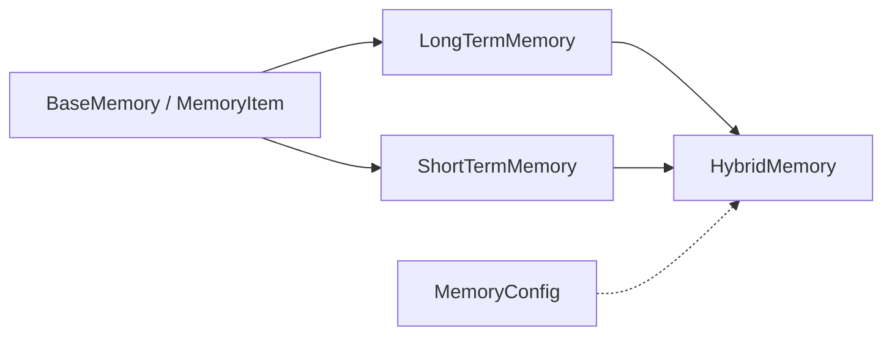

# Long-Term Memory

<cite>
**Referenced Files in This Document**
- [long_term.py](file://harness/memory/long_term.py)
- [base.py](file://harness/memory/base.py)
- [hybrid.py](file://harness/memory/hybrid.py)
- [short_term.py](file://harness/memory/short_term.py)
- [config.py](file://harness/config.py)
- [README.md](file://README.md)
</cite>

## Table of Contents
1. [Introduction](#introduction)
2. [Project Structure](#project-structure)
3. [Core Components](#core-components)
4. [Architecture Overview](#architecture-overview)
5. [Detailed Component Analysis](#detailed-component-analysis)
6. [Dependency Analysis](#dependency-analysis)
7. [Performance Considerations](#performance-considerations)
8. [Troubleshooting Guide](#troubleshooting-guide)
9. [Conclusion](#conclusion)
10. [Appendices](#appendices)

## Introduction
This document explains the LongTermMemory implementation that provides persistent knowledge storage with TF-IDF retrieval. It covers how facts are stored, how they are indexed and scored using TF-IDF, and how similarity search retrieves relevant memories for a given query. It also documents the storage format, configuration options, scalability considerations, and optimization techniques for efficient retrieval from large datasets.

## Project Structure
The memory system is organized into layered components:
- Base abstractions define the memory interface and data model.
- Short-term memory buffers recent messages with simple keyword overlap scoring.
- Long-term memory persists items to JSON and supports TF-IDF-based retrieval.
- Hybrid memory combines short-term and long-term stores to build rich context.

**Diagram sources**
- [base.py:27-64](file://harness/memory/base.py#L27-L64)
- [short_term.py:16-50](file://harness/memory/short_term.py#L16-L50)
- [long_term.py:24-109](file://harness/memory/long_term.py#L24-L109)
- [hybrid.py:22-84](file://harness/memory/hybrid.py#L22-L84)

**Section sources**
- [base.py:1-64](file://harness/memory/base.py#L1-L64)
- [short_term.py:1-50](file://harness/memory/short_term.py#L1-L50)
- [long_term.py:1-109](file://harness/memory/long_term.py#L1-L109)
- [hybrid.py:1-84](file://harness/memory/hybrid.py#L1-L84)

## Core Components
- MemoryItem: Dataclass representing a single memory entry with role, content, timestamp, and metadata.
- BaseMemory: Abstract base defining add, get_recent, search, clear, get_all, and helper methods.
- ShortTermMemory: FIFO buffer for recent conversation context; simple keyword overlap search.
- LongTermMemory: Persistent store backed by JSON; TF-IDF scoring for semantic-like retrieval.
- HybridMemory: Orchestrates short-term and long-term memory to assemble prompts with recent and relevant past memories.

Key responsibilities:
- Add factual knowledge via add(role, content, **metadata).
- Retrieve recent context via get_recent(n).
- Perform semantic-like searches via search(query, top_k).
- Persist and load state across sessions via JSON storage.

**Section sources**
- [base.py:18-64](file://harness/memory/base.py#L18-L64)
- [short_term.py:16-50](file://harness/memory/short_term.py#L16-L50)
- [long_term.py:24-109](file://harness/memory/long_term.py#L24-L109)
- [hybrid.py:22-84](file://harness/memory/hybrid.py#L22-L84)

## Architecture Overview
LongTermMemory implements TF-IDF retrieval over persisted JSON records. HybridMemory composes it with ShortTermMemory to provide both immediate context and relevant historical knowledge.

**Diagram sources**
- [hybrid.py:33-73](file://harness/memory/hybrid.py#L33-L73)
- [long_term.py:40-68](file://harness/memory/long_term.py#L40-L68)
- [short_term.py:23-40](file://harness/memory/short_term.py#L23-L40)

## Detailed Component Analysis

### LongTermMemory: TF-IDF Retrieval and Persistence
- Storage format: JSON array of objects with fields role, content, timestamp, metadata.
- Indexing strategy: In-memory list of MemoryItem; no separate index file. IDF is computed per query based on current items.
- Vectorization process: Tokenization splits content into lowercase words; term frequency computed per item; inverse document frequency computed globally per query term.
- Scoring algorithm: For each item, sum over query terms present in the item:
  - Term frequency: count(term)/len(words)
  - IDF: log((N + 1)/(df(term) + 1)) + 1
  - Score = sum(term_tf * idf)
- Similarity search: Returns top-K items with positive scores sorted descending.

**Diagram sources**
- [long_term.py:40-68](file://harness/memory/long_term.py#L40-L68)

Storage persistence:
- Save: Serializes all items to JSON at storage_path on every add/clear.
- Load: Reads JSON on initialization; reconstructs MemoryItem instances.

**Diagram sources**
- [long_term.py:32-35](file://harness/memory/long_term.py#L32-L35)
- [long_term.py:77-105](file://harness/memory/long_term.py#L77-L105)

**Section sources**
- [long_term.py:24-109](file://harness/memory/long_term.py#L24-L109)

### HybridMemory: Combining Recent and Relevant Context
- Maintains a bounded short-term buffer and a persistent long-term store.
- Adds user/assistant messages to both short-term and long-term.
- Builds context strings by merging recent conversation and relevant past memories retrieved via LongTermMemory.search.

**Diagram sources**
- [base.py:27-64](file://harness/memory/base.py#L27-L64)
- [short_term.py:16-50](file://harness/memory/short_term.py#L16-L50)
- [long_term.py:24-109](file://harness/memory/long_term.py#L24-L109)
- [hybrid.py:22-84](file://harness/memory/hybrid.py#L22-L84)

**Section sources**
- [hybrid.py:22-84](file://harness/memory/hybrid.py#L22-L84)

### ShortTermMemory: Keyword Overlap Search
- Uses a deque with fixed capacity for FIFO eviction.
- Search computes set overlap between query tokens and item tokens; returns top matches.

**Section sources**
- [short_term.py:16-50](file://harness/memory/short_term.py#L16-L50)

## Dependency Analysis
- LongTermMemory depends on BaseMemory and MemoryItem for interface and data model.
- HybridMemory composes ShortTermMemory and LongTermMemory to provide combined behavior.
- Configuration module defines MemoryConfig with parameters like short_term_capacity, long_term_enabled, memory_file, and similarity_threshold.

**Diagram sources**
- [base.py:18-64](file://harness/memory/base.py#L18-L64)
- [long_term.py:24-109](file://harness/memory/long_term.py#L24-L109)
- [short_term.py:16-50](file://harness/memory/short_term.py#L16-L50)
- [hybrid.py:22-84](file://harness/memory/hybrid.py#L22-L84)
- [config.py:37-44](file://harness/config.py#L37-L44)

**Section sources**
- [config.py:37-44](file://harness/config.py#L37-L44)

## Performance Considerations
- Time complexity:
  - search(query): O(N * W), where N is number of items and W is average token count per item. IDF computation adds overhead proportional to unique query terms.
  - add(): O(1) append plus I/O cost to write JSON.
  - get_recent(): O(1) slice on list.
- Space complexity:
  - In-memory list of MemoryItem; JSON file grows linearly with number of items.
- I/O characteristics:
  - Every add triggers a full JSON write; frequent writes can be costly for large datasets.
- Scalability notes:
  - Current design is suitable for moderate-sized knowledge bases.
  - For very large corpora, consider:
    - Precomputing and caching term frequencies and document frequencies.
    - Using an inverted index to avoid scanning all items per query.
    - Switching to vector embeddings and a vector database for approximate nearest neighbor search.
    - Batched writes or periodic flushes to reduce disk I/O.

[No sources needed since this section provides general guidance]

## Troubleshooting Guide
Common issues and mitigations:
- Empty results: If no items exist or none match query terms, search returns empty. Ensure items have been added and queries contain terms present in stored content.
- Slow retrieval: Large numbers of items increase search time. Reduce top_k or optimize by precomputing indices.
- Disk errors: JSON save/load failures are logged; verify storage_path permissions and disk space.
- Stale context: HybridMemory filters duplicates between recent and relevant sections; ensure get_relevant_context parameters are tuned for your use case.

Operational tips:
- Use clear() to reset memory when needed.
- Monitor logs for load/save errors.
- Adjust short_term_capacity and hybrid context sizes to fit prompt constraints.

**Section sources**
- [long_term.py:77-105](file://harness/memory/long_term.py#L77-L105)
- [hybrid.py:46-73](file://harness/memory/hybrid.py#L46-L73)

## Conclusion
LongTermMemory provides a lightweight, dependency-minimal approach to persistent knowledge storage with TF-IDF retrieval. It demonstrates core concepts such as tokenization, term frequency, inverse document frequency, and similarity ranking. For production-scale systems, consider augmenting with vector embeddings and specialized databases to improve performance and recall. HybridMemory offers a practical composition pattern that balances immediate context with relevant historical knowledge.

[No sources needed since this section summarizes without analyzing specific files]

## Appendices

### Configuration Options
- MemoryConfig fields:
  - short_term_capacity: Maximum messages in short-term buffer.
  - long_term_enabled: Whether to persist long-term memory.
  - memory_file: Path to the JSON persistence file.
  - similarity_threshold: Minimum similarity threshold for memory retrieval (conceptual parameter; not enforced in current LongTermMemory.search).

Usage note:
- The current LongTermMemory.search does not apply similarity_threshold filtering; results are filtered only by positive scores. You can extend search to enforce a threshold if desired.

**Section sources**
- [config.py:37-44](file://harness/config.py#L37-L44)
- [long_term.py:40-68](file://harness/memory/long_term.py#L40-L68)

### Examples of Usage Patterns
- Adding factual knowledge:
  - Call add(role="user", content="...") to persist facts.
  - HybridMemory automatically routes user/assistant messages to LongTermMemory.
- Performing semantic searches:
  - Call search(query="...") to retrieve top-K relevant memories based on TF-IDF scoring.
  - Use HybridMemory.get_relevant_context(query, n_recent, n_relevant) to build a prompt-ready context combining recent and relevant memories.
- Managing large knowledge bases:
  - Periodically clear or archive old entries to control growth.
  - Tune top_k and context sizes to balance relevance and prompt length.

These patterns align with the documented interfaces and behaviors.

**Section sources**
- [hybrid.py:33-73](file://harness/memory/hybrid.py#L33-L73)
- [long_term.py:32-68](file://harness/memory/long_term.py#L32-L68)

### Indexing Strategy and Storage Format
- Indexing:
  - No explicit index file; indexing is computed per query from in-memory items.
  - IDF uses smoothed denominator to avoid division by zero.
- Storage format:
  - JSON array of objects with role, content, timestamp, metadata.
  - Loaded on startup; saved on mutations.

**Section sources**
- [long_term.py:77-105](file://harness/memory/long_term.py#L77-L105)

### Retrieval Performance Characteristics
- Complexity:
  - search: O(N * W) per query due to tokenization and scoring across all items.
- I/O:
  - Each add performs a full JSON write; consider batching or background flushes for high-throughput scenarios.
- Recommendations:
  - For large datasets, implement an inverted index and cache IDF values.
  - Consider approximate nearest neighbor search with embeddings for faster retrieval at scale.

[No sources needed since this section provides general guidance]