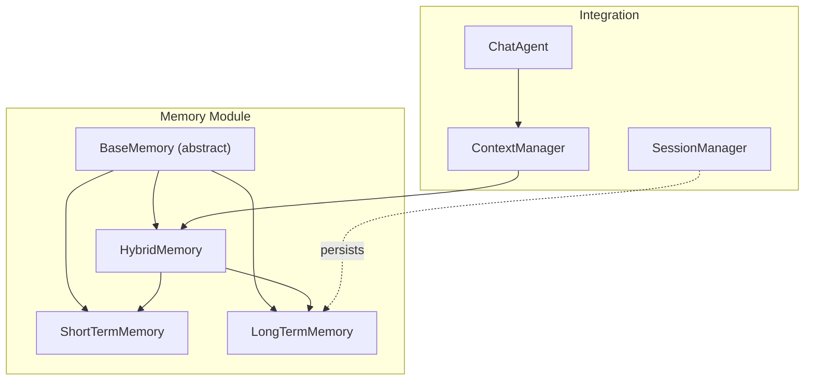
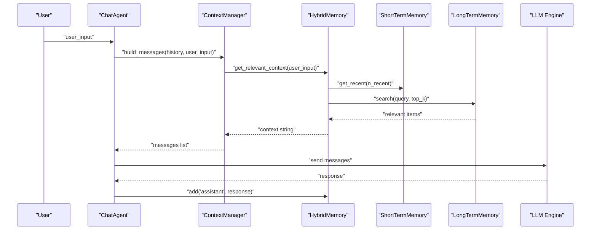
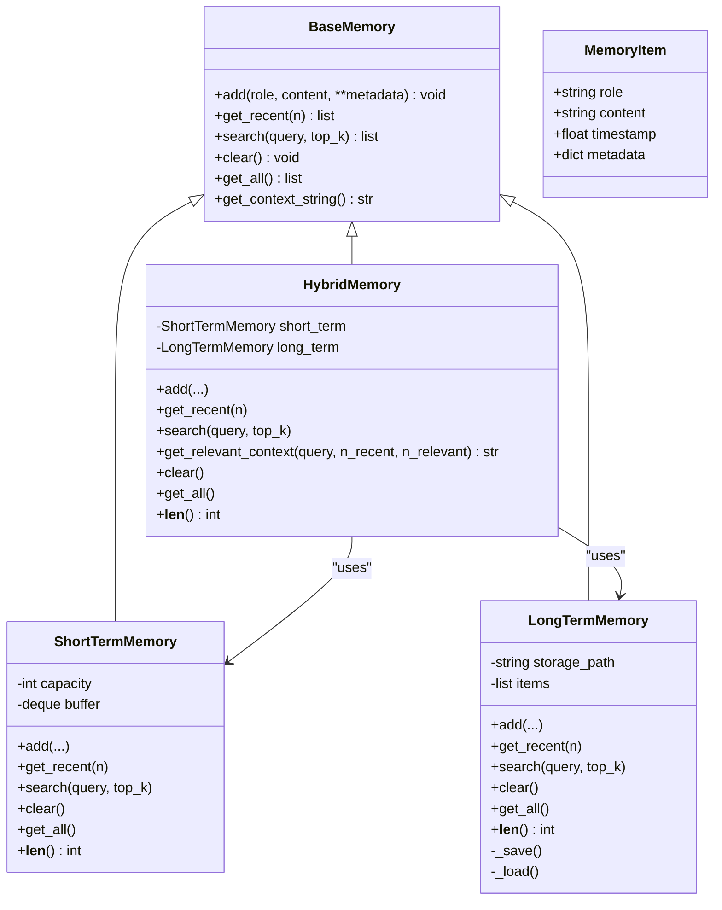
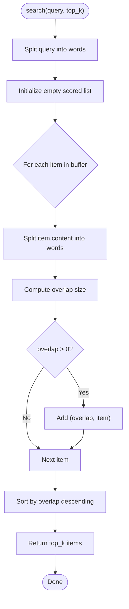
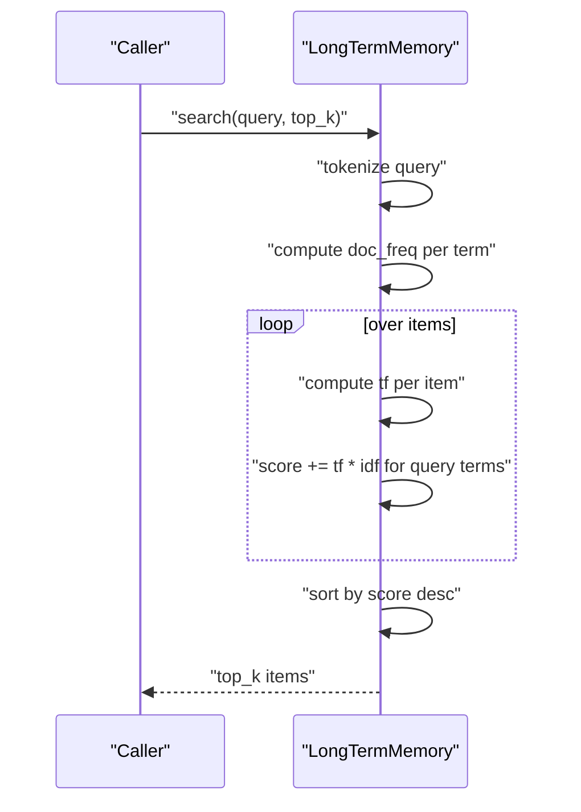
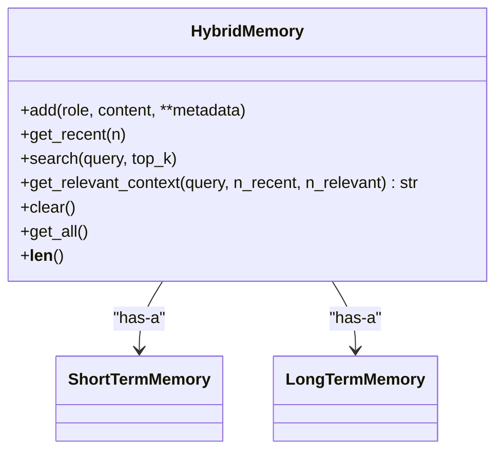
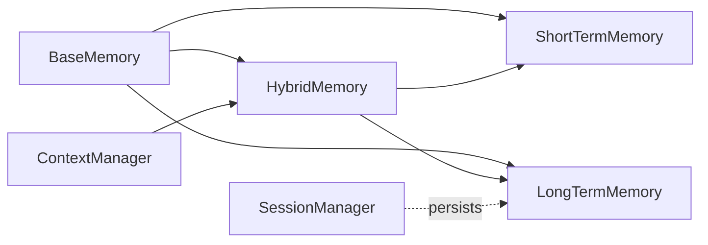

# Memory Architecture

<cite>
**Referenced Files in This Document**
- [base.py](file://harness/memory/base.py)
- [short_term.py](file://harness/memory/short_term.py)
- [long_term.py](file://harness/memory/long_term.py)
- [hybrid.py](file://harness/memory/hybrid.py)
- [__init__.py](file://harness/memory/__init__.py)
- [manager.py](file://harness/context/manager.py)
- [manager.py](file://harness/session/manager.py)
- [chat.py](file://harness/agent/chat.py)
- [README.md](file://README.md)
</cite>

## Table of Contents
1. [Introduction](#introduction)
2. [Project Structure](#project-structure)
3. [Core Components](#core-components)
4. [Architecture Overview](#architecture-overview)
5. [Detailed Component Analysis](#detailed-component-analysis)
6. [Dependency Analysis](#dependency-analysis)
7. [Performance Considerations](#performance-considerations)
8. [Troubleshooting Guide](#troubleshooting-guide)
9. [Conclusion](#conclusion)
10. [Appendices](#appendices)

## Introduction
This document explains the three-tiered memory architecture that provides continuity across conversation turns and sessions. It focuses on:
- BaseMemory as a unified abstraction over different memory strategies
- ShortTermMemory using bounded buffers for recent context
- LongTermMemory with TF-IDF retrieval for persistent knowledge
- HybridMemory combining both approaches for production use

It also covers storage patterns, retrieval algorithms, performance characteristics, configuration options, customization paths, and best practices for production environments.

## Project Structure
The memory system is implemented under harness/memory and integrates with context and session management to assemble prompts and maintain isolated conversations.

**Diagram sources**
- [base.py:27-64](file://harness/memory/base.py#L27-L64)
- [short_term.py:16-50](file://harness/memory/short_term.py#L16-L50)
- [long_term.py:24-109](file://harness/memory/long_term.py#L24-L109)
- [hybrid.py:22-84](file://harness/memory/hybrid.py#L22-L84)
- [manager.py:41-118](file://harness/context/manager.py#L41-L118)
- [manager.py:71-146](file://harness/session/manager.py#L71-L146)
- [chat.py:25-60](file://harness/agent/chat.py#L25-L60)

**Section sources**
- [README.md:94-99](file://README.md#L94-L99)
- [README.md:178-192](file://README.md#L178-L192)

## Core Components
- BaseMemory defines the interface for all memory implementations: add, get_recent, search, clear, get_all, plus a helper to format recent items into a string.
- ShortTermMemory implements a bounded FIFO buffer for recent messages with simple keyword overlap search.
- LongTermMemory persists items to JSON and retrieves relevant memories via TF-IDF scoring.
- HybridMemory composes short-term and long-term stores, orchestrating how recent and relevant contexts are combined when building prompts.

Key responsibilities:
- Unified API via BaseMemory enables swapping strategies without changing callers.
- Short-term ensures token budget compliance by limiting recent context.
- Long-term provides cross-session recall through retrieval.
- HybridMemory coordinates both to produce rich, relevant context for each turn.

**Section sources**
- [base.py:18-64](file://harness/memory/base.py#L18-L64)
- [short_term.py:16-50](file://harness/memory/short_term.py#L16-L50)
- [long_term.py:24-109](file://harness/memory/long_term.py#L24-L109)
- [hybrid.py:22-84](file://harness/memory/hybrid.py#L22-L84)

## Architecture Overview
The memory layer sits between agents/sessions and the prompt assembly pipeline. ContextManager uses HybridMemory to inject both recent conversation history and relevant past memories into the prompt. SessionManager persists per-session histories separately from long-term memory.

**Diagram sources**
- [manager.py:61-108](file://harness/context/manager.py#L61-L108)
- [hybrid.py:46-73](file://harness/memory/hybrid.py#L46-L73)
- [short_term.py:23-46](file://harness/memory/short_term.py#L23-L46)
- [long_term.py:32-68](file://harness/memory/long_term.py#L32-L68)
- [chat.py:46-52](file://harness/agent/chat.py#L46-L52)

## Detailed Component Analysis

### BaseMemory Interface
BaseMemory establishes a consistent contract for all memory backends:
- add(role, content, **metadata): store an item
- get_recent(n): retrieve most recent n items
- search(query, top_k=5): retrieve relevant items for a query
- clear(): reset memory
- get_all(): return all stored items
- get_context_string(): format recent items for prompts

Design notes:
- Abstract base class enforces uniform behavior across strategies.
- MemoryItem dataclass encapsulates role, content, timestamp, and metadata.

**Section sources**
- [base.py:18-64](file://harness/memory/base.py#L18-L64)

#### Class Diagram

**Diagram sources**
- [base.py:18-64](file://harness/memory/base.py#L18-L64)
- [short_term.py:16-50](file://harness/memory/short_term.py#L16-L50)
- [long_term.py:24-109](file://harness/memory/long_term.py#L24-L109)
- [hybrid.py:22-84](file://harness/memory/hybrid.py#L22-L84)

### ShortTermMemory
- Storage pattern: deque with maxlen for FIFO eviction; oldest items drop automatically when capacity is exceeded.
- Retrieval:
  - get_recent(n): returns last n items efficiently.
  - search(query, top_k): simple keyword overlap scoring against content tokens.
- Performance:
  - add: O(1) amortized due to deque append.
  - get_recent: O(n) to slice.
  - search: O(N * W) where N is number of items and W is average word count per item; suitable for small-to-medium buffers.

Configuration and usage:
- Capacity controls how many recent messages are retained.
- Ideal for keeping within LLM context windows while preserving conversational coherence.

**Section sources**
- [short_term.py:1-50](file://harness/memory/short_term.py#L1-L50)

#### Flowchart: Keyword Overlap Search

**Diagram sources**
- [short_term.py:30-40](file://harness/memory/short_term.py#L30-L40)

### LongTermMemory
- Storage pattern: in-memory list persisted to JSON file; supports load/save across sessions.
- Retrieval algorithm: TF-IDF based scoring
  - Compute term frequency (TF) per item
  - Compute inverse document frequency (IDF) per query term across corpus
  - Sum TF*IDF contributions for query terms to score each item
  - Return top-K items with positive scores
- Persistence:
  - _save writes all items to storage_path as JSON
  - _load reconstructs MemoryItem objects from JSON on init
- Error handling:
  - Logging on save/load failures; does not crash on I/O errors

Performance considerations:
- add: O(1) append + O(P) JSON write (P = number of items)
- search: O(N * W) to compute scores; efficient for moderate corpus sizes
- get_recent: O(n) slice
- get_all: O(N) copy

Production note:
- The comment indicates vector embeddings + vector DB would be used in production; this implementation demonstrates the concept with minimal dependencies.

**Section sources**
- [long_term.py:1-109](file://harness/memory/long_term.py#L1-L109)

#### Sequence Diagram: TF-IDF Retrieval

**Diagram sources**
- [long_term.py:40-68](file://harness/memory/long_term.py#L40-L68)

### HybridMemory
- Composition: maintains both ShortTermMemory and LongTermMemory instances.
- Write path:
  - add always goes to short-term; only user and assistant messages are persisted to long-term.
- Read path:
  - get_recent delegates to short-term
  - search delegates to long-term
  - get_relevant_context builds a combined context string:
    - Recent conversation section from short-term
    - Relevant past memories section from long-term, filtered to avoid duplicates with recent content
- Integration:
  - ContextManager uses get_relevant_context to inject prior knowledge into prompts.

Best practices:
- Use HybridMemory in production to balance recency and relevance.
- Tune n_recent and n_relevant to fit token budgets and improve answer quality.

**Section sources**
- [hybrid.py:1-84](file://harness/memory/hybrid.py#L1-L84)
- [manager.py:85-92](file://harness/context/manager.py#L85-L92)

#### Class Diagram: Hybrid Composition

**Diagram sources**
- [hybrid.py:22-84](file://harness/memory/hybrid.py#L22-L84)
- [short_term.py:16-50](file://harness/memory/short_term.py#L16-L50)
- [long_term.py:24-109](file://harness/memory/long_term.py#L24-L109)

### Integration Points

#### ContextManager
- Builds messages for each LLM call:
  - System prompt with optional tool instructions
  - Relevant past context from HybridMemory.get_relevant_context
  - Conversation history (short-term)
  - Current user input
- Stores user input and assistant responses via memory.add

**Section sources**
- [manager.py:41-118](file://harness/context/manager.py#L41-L118)

#### SessionManager
- Manages multiple independent sessions with isolated histories and metadata.
- Persists sessions to JSON files; can coexist with long-term memory which is shared or scoped depending on application design.

**Section sources**
- [manager.py:71-146](file://harness/session/manager.py#L71-L146)

#### ChatAgent
- Provides convenience methods for chat and conversation history access.
- Uses BaseMemory via agent base to persist interactions.

**Section sources**
- [chat.py:25-60](file://harness/agent/chat.py#L25-L60)

## Dependency Analysis
- BaseMemory is the core abstraction; all concrete implementations depend on it.
- HybridMemory depends on both ShortTermMemory and LongTermMemory.
- ContextManager depends on BaseMemory and typically uses HybridMemory to assemble prompts.
- SessionManager is orthogonal but often paired with memory systems to isolate conversation state.

**Diagram sources**
- [base.py:27-64](file://harness/memory/base.py#L27-L64)
- [hybrid.py:22-84](file://harness/memory/hybrid.py#L22-L84)
- [manager.py:41-118](file://harness/context/manager.py#L41-L118)
- [manager.py:71-146](file://harness/session/manager.py#L71-L146)

**Section sources**
- [__init__.py:1-6](file://harness/memory/__init__.py#L1-L6)

## Performance Considerations
- ShortTermMemory
  - Bounded buffer prevents unbounded growth; ideal for strict token limits.
  - Keyword search is fast for small buffers; consider more advanced retrieval if buffer grows large.
- LongTermMemory
  - TF-IDF retrieval scales linearly with corpus size; acceptable for moderate datasets.
  - JSON persistence introduces I/O overhead on every add/clear; batch operations or background flushes may be needed at scale.
  - In production, replace with vector embeddings and a vector database for better scalability and semantic recall.
- HybridMemory
  - Balances recency and relevance; tune n_recent and n_relevant to control prompt size and quality.
  - Avoid duplicate content in combined context to save tokens.

[No sources needed since this section provides general guidance]

## Troubleshooting Guide
Common issues and mitigations:
- Long-term memory load/save failures
  - Symptoms: missing persisted data or exceptions during startup.
  - Mitigation: check storage path permissions; ensure JSON integrity; review logs for error messages.
- Excessive context size
  - Symptoms: token limit exceeded or degraded performance.
  - Mitigation: reduce short-term capacity; lower n_recent/n_relevant; prune long-term entries periodically.
- Poor retrieval quality
  - Symptoms: irrelevant past memories included.
  - Mitigation: refine queries; consider adding metadata filters; eventually migrate to embedding-based retrieval.

Operational tips:
- Monitor memory sizes and adjust capacities based on observed usage.
- Log retrieval counts and scores to diagnose relevance issues.
- Periodically archive or compact long-term storage to manage growth.

**Section sources**
- [long_term.py:77-105](file://harness/memory/long_term.py#L77-L105)

## Conclusion
The three-tiered memory architecture provides a robust foundation for maintaining conversational continuity and persistent knowledge:
- BaseMemory standardizes the interface for pluggable strategies.
- ShortTermMemory ensures efficient, bounded recent context.
- LongTermMemory enables cross-session recall via TF-IDF retrieval and JSON persistence.
- HybridMemory combines both to deliver high-quality, relevant context for each interaction.

For production, consider:
- Tuning capacities and retrieval parameters to fit token budgets.
- Replacing TF-IDF with vector embeddings and a vector database for scalable semantic search.
- Implementing periodic cleanup and archival policies for long-term storage.

[No sources needed since this section summarizes without analyzing specific files]

## Appendices

### Configuration Examples
- Create a HybridMemory instance with custom storage path and short-term capacity:
  - See usage in demos and CLI for examples of passing storage_path and capacity.
- Integrate with ContextManager:
  - Pass a BaseMemory implementation (typically HybridMemory) to ContextManager to enable memory-aware prompting.

References:
- Demo usage of HybridMemory with storage_path
- ContextManager defaulting to HybridMemory when none provided

**Section sources**
- [README.md:60-69](file://README.md#L60-L69)
- [manager.py:49-59](file://harness/context/manager.py#L49-L59)

### Customization Options
- Implement a custom memory strategy by subclassing BaseMemory:
  - Override add, get_recent, search, clear, get_all to implement your storage and retrieval logic.
- Extend HybridMemory:
  - Compose additional memory backends or customize get_relevant_context to prioritize certain types of memories.

**Section sources**
- [base.py:27-64](file://harness/memory/base.py#L27-L64)
- [hybrid.py:22-84](file://harness/memory/hybrid.py#L22-L84)

### Best Practices for Production
- Set appropriate short-term capacity to match model context windows.
- Use HybridMemory to combine recency and relevance effectively.
- Plan for long-term storage growth: archive old entries, compress, or move to a dedicated vector store.
- Instrument retrieval metrics and log errors for observability.
- Validate storage paths and permissions to prevent silent data loss.

[No sources needed since this section provides general guidance]