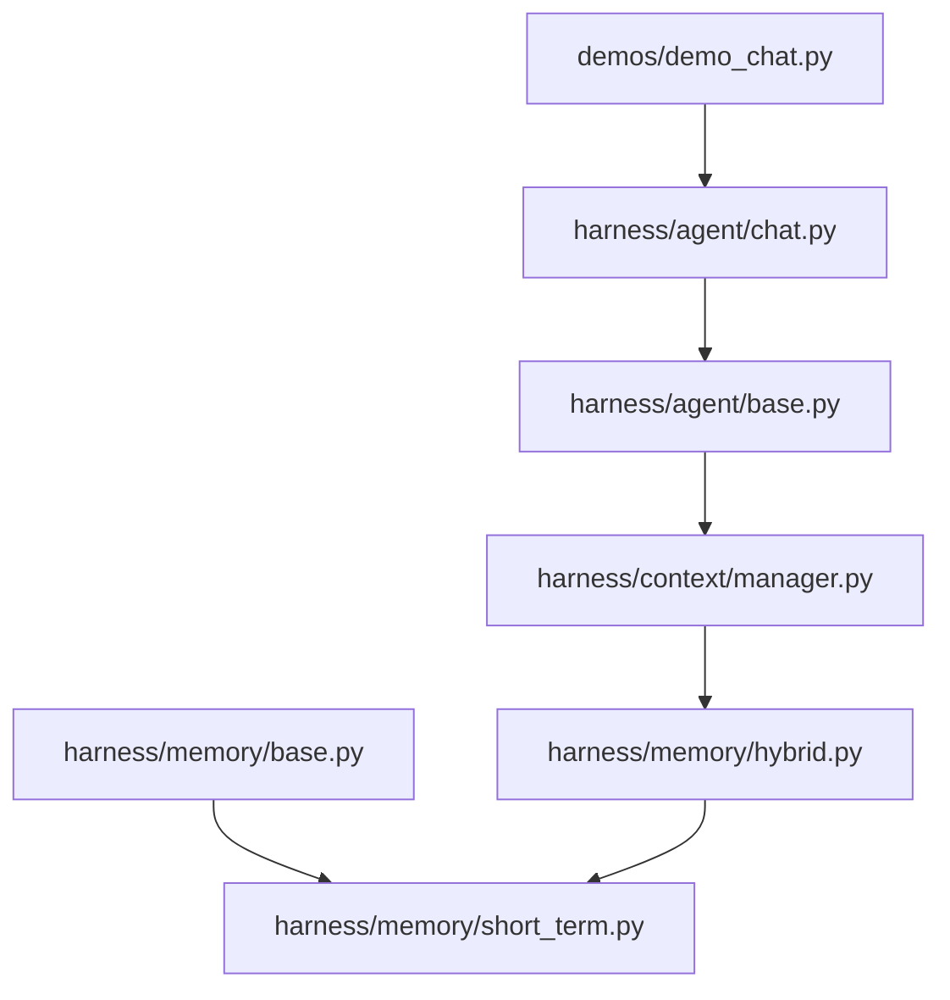
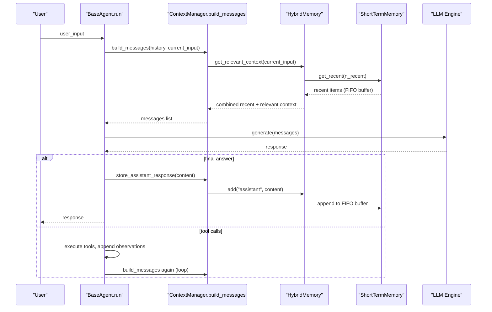
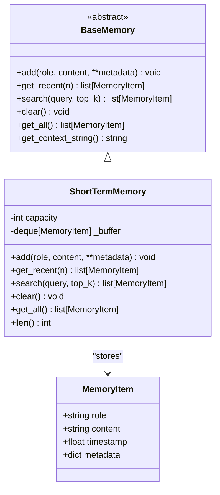
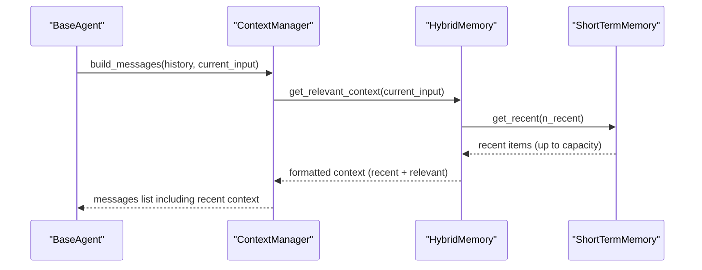

# Short-Term Memory

<cite>
**Referenced Files in This Document**
- [short_term.py](file://harness/memory/short_term.py)
- [base.py](file://harness/memory/base.py)
- [hybrid.py](file://harness/memory/hybrid.py)
- [manager.py (Context)](file://harness/context/manager.py)
- [base.py (Agent)](file://harness/agent/base.py)
- [chat.py (Agent)](file://harness/agent/chat.py)
- [demo_chat.py](file://demos/demo_chat.py)
</cite>

## Table of Contents
1. Introduction
2. Project Structure
3. Core Components
4. Architecture Overview
5. Detailed Component Analysis
6. Dependency Analysis
7. Performance Considerations
8. Troubleshooting Guide
9. Conclusion
10. Appendices

## Introduction
Short-term memory provides a bounded buffer of recent conversation messages using FIFO eviction to prevent unbounded growth and keep the agent’s context within practical limits. It is designed for conversational continuity: by retaining only the most recent messages, it ensures the LLM can reference immediate history without exceeding token budgets or degrading performance.

This document explains how short-term memory works, its configuration options, integration with the agent loop, and best practices for managing conversation context windows under high-frequency usage.

## Project Structure
The short-term memory implementation lives under the memory subsystem and integrates with the broader harness via the base memory interface and hybrid memory composition.

**Diagram sources**
- [short_term.py:16-49](file://harness/memory/short_term.py#L16-L49)
- [base.py:18-63](file://harness/memory/base.py#L18-L63)
- [hybrid.py:22-83](file://harness/memory/hybrid.py#L22-L83)
- [manager.py (Context):41-117](file://harness/context/manager.py#L41-L117)
- [base.py (Agent):63-165](file://harness/agent/base.py#L63-L165)
- [chat.py (Agent):25-60](file://harness/agent/chat.py#L25-L60)
- [demo_chat.py:17-46](file://demos/demo_chat.py#L17-L46)

**Section sources**
- [short_term.py:1-50](file://harness/memory/short_term.py#L1-L50)
- [base.py:1-64](file://harness/memory/base.py#L1-L64)
- [hybrid.py:1-84](file://harness/memory/hybrid.py#L1-L84)
- [manager.py (Context):1-118](file://harness/context/manager.py#L1-L118)
- [base.py (Agent):1-165](file://harness/agent/base.py#L1-L165)
- [chat.py (Agent):1-60](file://harness/agent/chat.py#L1-L60)
- [demo_chat.py:1-47](file://demos/demo_chat.py#L1-L47)

## Core Components
- MemoryItem: Dataclass representing a single stored message with role, content, timestamp, and metadata.
- BaseMemory: Abstract interface defining add, get_recent, search, clear, get_all, and a helper to format recent memory as a string.
- ShortTermMemory: Bounded FIFO buffer over MemoryItem using a deque with maxlen; supports retrieval, simple keyword search, and clearing.
- HybridMemory: Composes ShortTermMemory and LongTermMemory to provide both recent context and relevant past memories.

Key responsibilities:
- Maintain a fixed-size window of recent messages.
- Provide efficient access to recent items.
- Support lightweight search for short-term relevance.
- Integrate seamlessly with context assembly and agent loops.

**Section sources**
- [base.py:18-63](file://harness/memory/base.py#L18-L63)
- [short_term.py:16-49](file://harness/memory/short_term.py#L16-L49)
- [hybrid.py:22-83](file://harness/memory/hybrid.py#L22-L83)

## Architecture Overview
Short-term memory sits at the core of the agent’s working context. The agent loop builds prompts by combining system instructions, tool descriptions, long-term relevant context, and recent conversation history. Short-term memory ensures that only the most recent messages are included, preventing unbounded growth and keeping prompts within token limits.

**Diagram sources**
- [base.py (Agent):97-160](file://harness/agent/base.py#L97-L160)
- [manager.py (Context):61-108](file://harness/context/manager.py#L61-L108)
- [hybrid.py:33-73](file://harness/memory/hybrid.py#L33-L73)
- [short_term.py:23-46](file://harness/memory/short_term.py#L23-L46)

## Detailed Component Analysis

### ShortTermMemory: Bounded FIFO Buffer
Short-term memory uses a deque with a fixed maxlen to enforce capacity. When the buffer reaches capacity, appending a new item automatically evicts the oldest item, implementing FIFO eviction.

- Capacity configuration: set via constructor parameter; controls maximum number of messages retained.
- Add operation: appends a MemoryItem; if full, oldest item is dropped.
- Recent retrieval: returns up to n most recent items; if n exceeds buffer size, returns all.
- Search: simple keyword overlap scoring across recent items; suitable for fast, local matching.
- Clear and get_all: reset buffer or retrieve all items.

Eviction policy:
- Strict FIFO: oldest items are removed first when capacity is exceeded.

Complexity:
- add: O(1) amortized due to deque operations.
- get_recent: O(n) to slice last n items from a list conversion.
- search: O(m * w) where m is buffer size and w is average word count per item; constant overhead per item.

Integration points:
- Used directly by HybridMemory for recent context.
- Consumed by ContextManager indirectly through HybridMemory.get_relevant_context.

Best practices:
- Choose capacity based on expected conversation length and token budget.
- Use get_recent(n) to limit prompt size during context assembly.
- Avoid heavy search workloads on very large buffers; prefer delegating semantic search to long-term memory.

**Section sources**
- [short_term.py:16-49](file://harness/memory/short_term.py#L16-L49)
- [base.py:18-63](file://harness/memory/base.py#L18-L63)

#### Class Diagram

**Diagram sources**
- [base.py:18-63](file://harness/memory/base.py#L18-L63)
- [short_term.py:16-49](file://harness/memory/short_term.py#L16-L49)

### HybridMemory Composition
HybridMemory composes ShortTermMemory and LongTermMemory to provide both recent and relevant context. It delegates recent retrieval to ShortTermMemory and relevant retrieval to LongTermMemory, merging them into a single context string used by the ContextManager.

Key behaviors:
- add: always stores in short-term; persists user/assistant messages to long-term.
- get_relevant_context: combines recent conversation and relevant past memories, deduplicating overlapping content.

Configuration:
- short_term_capacity: controls the size of the short-term buffer.
- storage_path: path for long-term persistence.

**Section sources**
- [hybrid.py:22-83](file://harness/memory/hybrid.py#L22-L83)

#### Sequence Diagram: Context Assembly with Short-Term Memory

**Diagram sources**
- [manager.py (Context):61-108](file://harness/context/manager.py#L61-L108)
- [hybrid.py:46-73](file://harness/memory/hybrid.py#L46-L73)
- [short_term.py:26-28](file://harness/memory/short_term.py#L26-L28)

### Integration with the Agent Loop
The agent loop orchestrates context building, LLM calls, tool execution, and memory updates. Short-term memory participates by storing recent messages and providing them during context assembly.

Flow highlights:
- Each turn, the agent builds messages via ContextManager.
- HybridMemory includes recent short-term context in the assembled prompt.
- Assistant responses are stored back into memory for future turns.

**Section sources**
- [base.py (Agent):97-160](file://harness/agent/base.py#L97-L160)
- [manager.py (Context):61-108](file://harness/context/manager.py#L61-L108)

### Usage Examples
- Interactive chat demo initializes HybridMemory and passes it to ChatAgent, enabling short-term memory for conversational continuity.
- Multi-session management isolates conversations but can share memory strategies across sessions.

**Section sources**
- [demo_chat.py:17-46](file://demos/demo_chat.py#L17-L46)
- [chat.py (Agent):25-60](file://harness/agent/chat.py#L25-L60)

## Dependency Analysis
Short-term memory depends on the base memory interface and data structures. It is consumed by hybrid memory and indirectly by the context manager and agent loop.

**Diagram sources**
- [base.py:27-63](file://harness/memory/base.py#L27-L63)
- [short_term.py:16-49](file://harness/memory/short_term.py#L16-L49)
- [hybrid.py:22-83](file://harness/memory/hybrid.py#L22-L83)
- [manager.py (Context):41-117](file://harness/context/manager.py#L41-L117)
- [base.py (Agent):63-165](file://harness/agent/base.py#L63-L165)

**Section sources**
- [short_term.py:16-49](file://harness/memory/short_term.py#L16-L49)
- [hybrid.py:22-83](file://harness/memory/hybrid.py#L22-L83)
- [manager.py (Context):41-117](file://harness/context/manager.py#L41-L117)
- [base.py (Agent):63-165](file://harness/agent/base.py#L63-L165)

## Performance Considerations
- Eviction policy: FIFO ensures predictable memory bounds and avoids unbounded growth.
- Time complexity:
  - add: O(1) amortized.
  - get_recent: O(n) to convert and slice.
  - search: O(m * w) for keyword overlap; consider limiting top_k and buffer size for high-frequency scenarios.
- Space complexity: O(capacity) due to fixed-size deque.
- Token budgeting:
  - Use get_recent(n) to cap the number of messages included in prompts.
  - Combine with ContextManager’s token estimation to avoid exceeding model limits.
- High-frequency conversations:
  - Tune capacity to balance coherence and cost.
  - Prefer long-term memory for semantic search; use short-term for immediate context.
  - Periodically clear or reset conversation history when appropriate to reduce overhead.

[No sources needed since this section provides general guidance]

## Troubleshooting Guide
Common issues and resolutions:
- Context overflow: If prompts exceed token limits, reduce capacity or adjust n_recent in HybridMemory.get_relevant_context.
- Stale context: If older messages linger too long, lower capacity to enforce stricter FIFO eviction.
- Slow search: Keyword search scales with buffer size; reduce top_k or offload semantic search to long-term memory.
- Memory leaks: Ensure clear is called when resetting sessions or starting new topics to free resources.

Operational tips:
- Monitor buffer length via len(memory).
- Log context sizes before LLM calls to detect growth patterns.
- Use session isolation to prevent cross-conversation contamination.

**Section sources**
- [short_term.py:23-46](file://harness/memory/short_term.py#L23-L46)
- [hybrid.py:46-73](file://harness/memory/hybrid.py#L46-L73)
- [manager.py (Context):110-117](file://harness/context/manager.py#L110-L117)

## Conclusion
Short-term memory provides a robust, bounded buffer for recent conversation context using FIFO eviction. It integrates cleanly with the agent loop and hybrid memory to maintain conversational continuity while respecting token limits and performance constraints. By tuning capacity, leveraging recent retrieval, and delegating semantic search to long-term memory, you can optimize for high-frequency conversations and ensure stable, scalable agent behavior.

[No sources needed since this section summarizes without analyzing specific files]

## Appendices

### Configuration Options
- Capacity: Controls the maximum number of recent messages retained; set via ShortTermMemory constructor.
- Retrieval limits: Adjust n_recent in HybridMemory.get_relevant_context to control how many recent items are included in prompts.
- Storage path: For HybridMemory, configure long-term persistence separately; short-term remains in-memory.

**Section sources**
- [short_term.py:19-21](file://harness/memory/short_term.py#L19-L21)
- [hybrid.py:25-31](file://harness/memory/hybrid.py#L25-L31)
- [hybrid.py:46-73](file://harness/memory/hybrid.py#L46-L73)

### Best Practices for Managing Conversation Context Windows
- Keep capacity aligned with model context window and token budget.
- Use get_recent(n) to explicitly bound prompt size.
- Offload semantic search to long-term memory; reserve short-term for immediate context.
- Reset conversation history when switching topics to avoid stale context.
- Monitor and log context sizes to detect growth and adjust parameters proactively.

[No sources needed since this section provides general guidance]