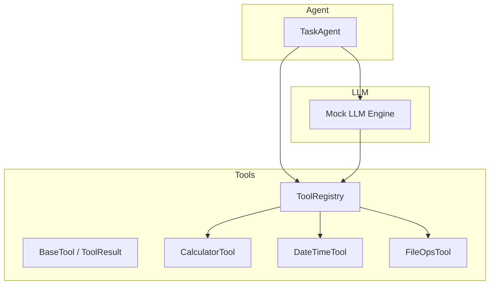
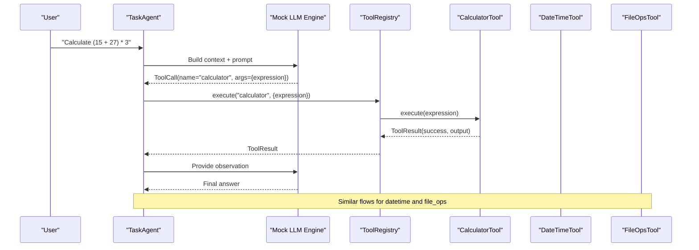
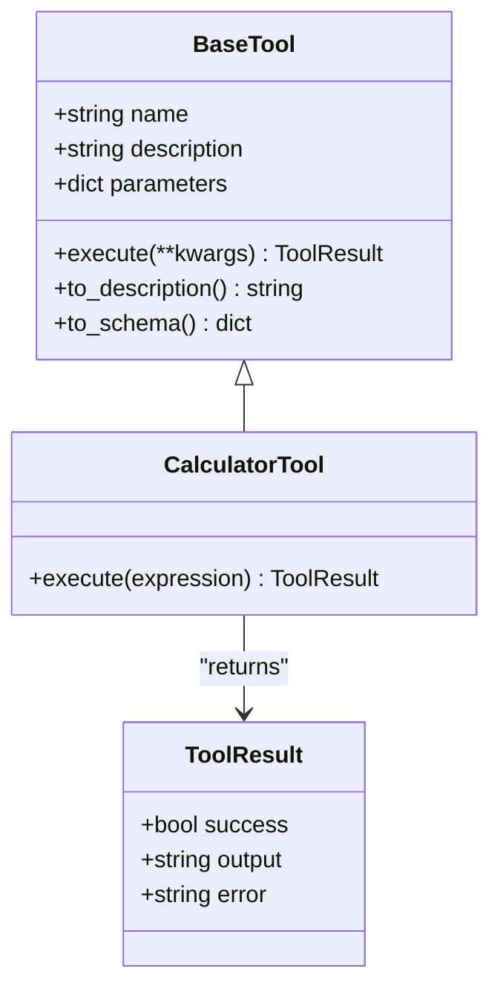
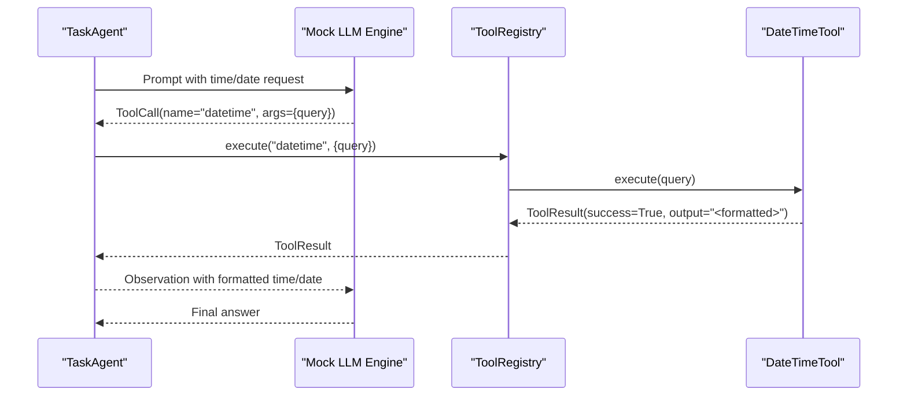
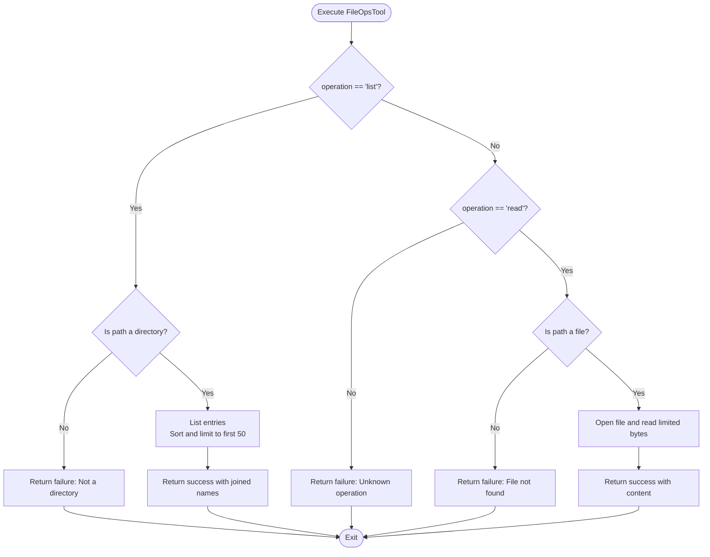
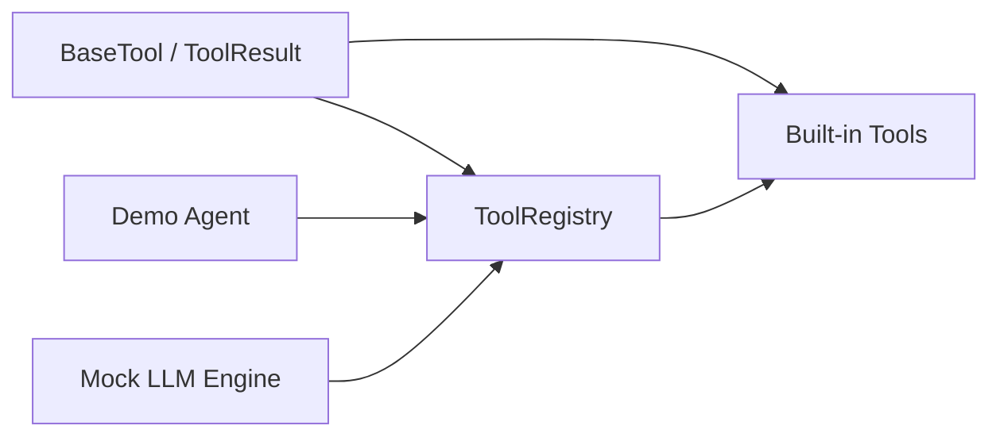

# Built-in Tools

<cite>
**Referenced Files in This Document**
- [builtin.py](file://harness/tools/builtin.py)
- [base.py](file://harness/tools/base.py)
- [registry.py](file://harness/tools/registry.py)
- [__init__.py](file://harness/tools/__init__.py)
- [demo_agent.py](file://demos/demo_agent.py)
- [engine.py](file://harness/llm/engine.py)
- [README.md](file://README.md)
</cite>

## Table of Contents
1. [Introduction](#introduction)
2. [Project Structure](#project-structure)
3. [Core Components](#core-components)
4. [Architecture Overview](#architecture-overview)
5. [Detailed Component Analysis](#detailed-component-analysis)
6. [Dependency Analysis](#dependency-analysis)
7. [Performance Considerations](#performance-considerations)
8. [Troubleshooting Guide](#troubleshooting-guide)
9. [Conclusion](#conclusion)
10. [Appendices](#appendices)

## Introduction
This document provides detailed documentation for the built-in tools implementation focusing on Calculator, DateTime, and FileOps tools. It explains each tool’s functionality, parameter schemas, usage examples, return value formats, and common patterns such as mathematical operations, time formatting, and file system interactions. It also covers security considerations for file operations and input validation patterns used across these tools.

## Project Structure
The tool system is organized into a small set of focused modules:
- Base abstractions define how tools are described and executed.
- A registry manages tool registration, discovery, and execution.
- Built-in tools implement concrete behaviors for math, time, and file operations.
- Demos show how to wire tools into an agent loop.

**Diagram sources**
- [base.py:16-67](file://harness/tools/base.py#L16-L67)
- [registry.py:17-74](file://harness/tools/registry.py#L17-L74)
- [builtin.py:13-82](file://harness/tools/builtin.py#L13-L82)
- [demo_agent.py:21-24](file://demos/demo_agent.py#L21-L24)
- [engine.py:300-359](file://harness/llm/engine.py#L300-L359)

**Section sources**
- [README.md:89-131](file://README.md#L89-L131)
- [__init__.py:1-8](file://harness/tools/__init__.py#L1-L8)

## Core Components
- BaseTool and ToolResult define the contract for all tools and their results.
- ToolRegistry centralizes tool registration, listing, description generation, and safe execution with error handling.
- Built-in tools demonstrate safe evaluation, time formatting, and read-only file operations.

Key responsibilities:
- BaseTool: name, description, parameters schema, execute method, and helpers to generate descriptions and schemas.
- ToolRegistry: register tools, get by name, list tools, execute with try/catch, and produce combined tool descriptions for prompts.
- Built-ins: CalculatorTool (safe eval), DateTimeTool (date/time formatting), FileOpsTool (list/read with size limits).

**Section sources**
- [base.py:16-67](file://harness/tools/base.py#L16-L67)
- [registry.py:17-74](file://harness/tools/registry.py#L17-L74)
- [builtin.py:13-82](file://harness/tools/builtin.py#L13-L82)

## Architecture Overview
The agent loop integrates with the LLM engine and tool registry to perform tool calls. The mock LLM detects intent (math, date/time, files) and emits tool calls that the registry executes. Results are fed back to the LLM to continue or finalize the response.

**Diagram sources**
- [demo_agent.py:21-35](file://demos/demo_agent.py#L21-L35)
- [engine.py:300-359](file://harness/llm/engine.py#L300-L359)
- [registry.py:43-61](file://harness/tools/registry.py#L43-L61)
- [builtin.py:13-82](file://harness/tools/builtin.py#L13-L82)

## Detailed Component Analysis

### CalculatorTool
- Purpose: Safely evaluate mathematical expressions.
- Parameters:
  - expression: string representing a math expression using digits, spaces, and operators +, -, *, /, **, %, ().
- Behavior:
  - Input validation via regex to allow only safe characters.
  - Normalizes caret (^) to power operator (**).
  - Evaluates using a restricted environment without builtins.
  - Returns success with numeric result as string on success; otherwise returns failure with error message.
- Return format:
  - ToolResult(success=True, output="<numeric result>") on success.
  - ToolResult(success=False, output="", error="...") on invalid input or calculation errors.

Common patterns demonstrated:
- Strict input validation before execution.
- Safe evaluation sandboxing by disabling builtins.
- Clear error reporting through ToolResult.

Usage example (conceptual):
- Invoke with expression like "(15 + 27) * 3".
- Handle ToolResult.success to decide whether to present output or error.

Security considerations:
- Regex whitelist prevents injection of arbitrary code.
- Restricted eval environment eliminates access to builtins.
- Errors are caught and surfaced safely.

**Section sources**
- [builtin.py:13-30](file://harness/tools/builtin.py#L13-L30)
- [base.py:16-27](file://harness/tools/base.py#L16-L27)

#### Class Diagram

**Diagram sources**
- [base.py:16-67](file://harness/tools/base.py#L16-L67)
- [builtin.py:13-30](file://harness/tools/builtin.py#L13-L30)

### DateTimeTool
- Purpose: Retrieve current date and/or time information.
- Parameters:
  - query: string, one of "date", "time", or "datetime".
- Behavior:
  - Gets current datetime.
  - Formats based on query:
    - "date": formatted date with weekday.
    - "time": formatted time.
    - other: combined date and time with weekday.
- Return format:
  - ToolResult(success=True, output="<formatted string>").

Common patterns demonstrated:
- Simple branching logic based on user intent.
- Time formatting using standard library.

Usage example (conceptual):
- Invoke with query "date" to get today's date.
- Use the returned string directly in responses.

Error scenarios:
- No explicit error paths; default branch returns combined date/time.

**Section sources**
- [builtin.py:33-46](file://harness/tools/builtin.py#L33-L46)
- [base.py:16-27](file://harness/tools/base.py#L16-L27)

#### Sequence Diagram

**Diagram sources**
- [engine.py:300-324](file://harness/llm/engine.py#L300-L324)
- [registry.py:43-61](file://harness/tools/registry.py#L43-L61)
- [builtin.py:33-46](file://harness/tools/builtin.py#L33-L46)

### FileOpsTool
- Purpose: Perform basic file system operations in a read-only manner.
- Parameters:
  - operation: string, either "list" or "read".
  - path: string, directory path for "list", file path for "read".
- Behavior:
  - "list": checks if path is a directory; lists entries up to a limit; returns sorted newline-separated names.
  - "read": checks if path is a file; reads limited content (size cap); returns content.
  - Unknown operation or invalid path returns failure with descriptive error.
- Return format:
  - ToolResult(success=True, output="<list or content>") on success.
  - ToolResult(success=False, output="", error="...") on failure.

Common patterns demonstrated:
- Defensive checks for file/directory existence.
- Size limiting to prevent large outputs.
- Centralized error handling returning structured failures.

Security considerations:
- Read-only operations; no write/delete capabilities.
- Path validation ensures target exists and is appropriate type.
- Output capped to avoid excessive data transfer.

Usage example (conceptual):
- List directory contents: operation="list", path="."
- Read a file: operation="read", path="example.txt"
- Handle ToolResult.success to display content or error messages.

**Section sources**
- [builtin.py:49-74](file://harness/tools/builtin.py#L49-L74)
- [base.py:16-27](file://harness/tools/base.py#L16-L27)

#### Flowchart

**Diagram sources**
- [builtin.py:58-74](file://harness/tools/builtin.py#L58-L74)

## Dependency Analysis
- BaseTool and ToolResult provide the foundation for all tools.
- ToolRegistry depends on BaseTool and ToolResult to manage and execute tools.
- Built-in tools depend on BaseTool and ToolResult for consistent behavior.
- Demo agent wires registry and built-in tools into the agent loop.
- Mock LLM engine maps natural language intents to tool calls, demonstrating integration points.

**Diagram sources**
- [base.py:16-67](file://harness/tools/base.py#L16-L67)
- [registry.py:17-74](file://harness/tools/registry.py#L17-L74)
- [builtin.py:13-82](file://harness/tools/builtin.py#L13-L82)
- [demo_agent.py:21-35](file://demos/demo_agent.py#L21-L35)
- [engine.py:300-359](file://harness/llm/engine.py#L300-L359)

**Section sources**
- [__init__.py:1-8](file://harness/tools/__init__.py#L1-L8)
- [README.md:194-213](file://README.md#L194-L213)

## Performance Considerations
- CalculatorTool uses regex validation and restricted eval; keep expressions short to minimize parsing overhead.
- DateTimeTool performs minimal work; formatting is O(1).
- FileOpsTool limits list output to a fixed number of entries and caps read size to prevent large payloads; this improves responsiveness and reduces memory usage.
- ToolRegistry executes tools within try/catch to avoid crashing the agent loop; consider logging and metrics for production use.

[No sources needed since this section provides general guidance]

## Troubleshooting Guide
Common issues and resolutions:
- Invalid calculator expression: Ensure only allowed characters are used; remove unsupported symbols.
- Calculation errors: Check for syntax issues or unsupported operations; inspect ToolResult.error.
- File not found: Verify path exists and is correct; ensure you have read permissions.
- Not a directory: For "list", pass a valid directory path.
- Unknown operation: Use "list" or "read" for FileOpsTool.

Integration tips:
- Always check ToolResult.success before displaying output.
- Log ToolResult.error for debugging in production environments.
- Use the registry’s get_tools_description to verify available tools in system prompts.

**Section sources**
- [builtin.py:19-74](file://harness/tools/builtin.py#L19-L74)
- [registry.py:43-61](file://harness/tools/registry.py#L43-L61)

## Conclusion
The built-in tools demonstrate robust patterns for safe computation, time formatting, and controlled file system access. They adhere to a consistent interface defined by BaseTool and ToolResult, enabling seamless integration via ToolRegistry. Security is emphasized through strict input validation, restricted evaluation contexts, and read-only file operations with size limits. These patterns provide a solid foundation for extending the toolset with custom capabilities while maintaining safety and reliability.

[No sources needed since this section summarizes without analyzing specific files]

## Appendices

### Parameter Schemas Summary
- CalculatorTool:
  - expression: string - math expression using digits and allowed operators.
- DateTimeTool:
  - query: string - "date", "time", or "datetime".
- FileOpsTool:
  - operation: string - "list" or "read".
  - path: string - directory for "list", file for "read".

**Section sources**
- [builtin.py:13-56](file://harness/tools/builtin.py#L13-L56)

### Usage Examples (Conceptual)
- Calculator:
  - Invoke with expression "(15 + 27) * 3".
  - Handle ToolResult.success to present numeric result.
- DateTime:
  - Invoke with query "date" to get formatted date.
  - Use returned string in responses.
- FileOps:
  - List directory: operation="list", path=".".
  - Read file: operation="read", path="example.txt".
  - Handle ToolResult.success/error appropriately.

**Section sources**
- [demo_agent.py:26-35](file://demos/demo_agent.py#L26-L35)
- [engine.py:300-359](file://harness/llm/engine.py#L300-L359)

### Error Scenarios
- Calculator:
  - Invalid characters: returns failure with descriptive error.
  - Calculation exception: returns failure with exception details.
- DateTime:
  - Default behavior returns combined date/time when query is not recognized.
- FileOps:
  - Not a directory: returns failure.
  - File not found: returns failure.
  - Unknown operation: returns failure.

**Section sources**
- [builtin.py:19-74](file://harness/tools/builtin.py#L19-L74)

### Security Considerations
- Input validation:
  - Calculator enforces a whitelist of allowed characters before evaluation.
- Safe evaluation:
  - Calculator disables builtins during eval to prevent arbitrary code execution.
- File system safety:
  - FileOpsTool is read-only and caps output size to mitigate abuse and resource exhaustion.
  - Validates path types (directory vs file) before operations.

**Section sources**
- [builtin.py:19-74](file://harness/tools/builtin.py#L19-L74)