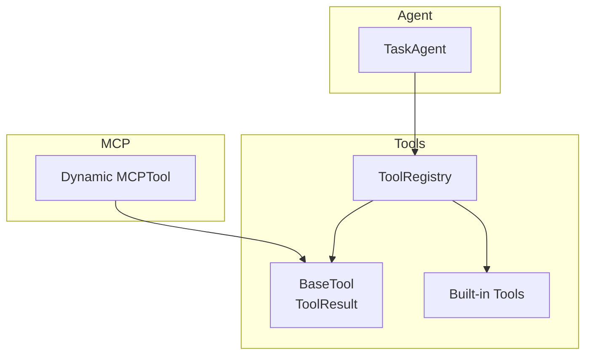
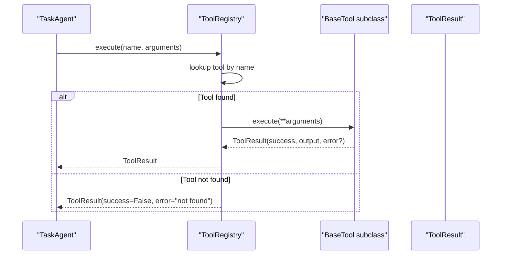
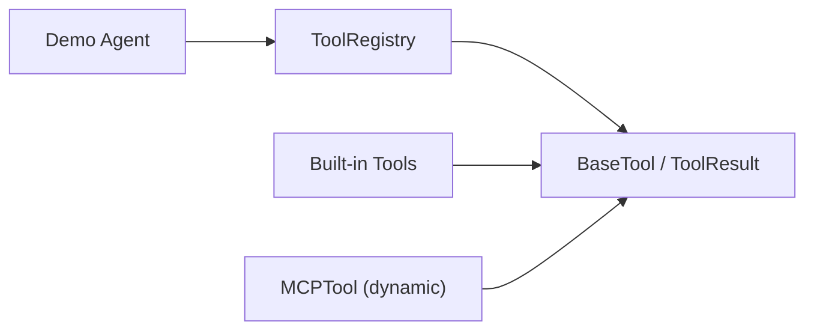
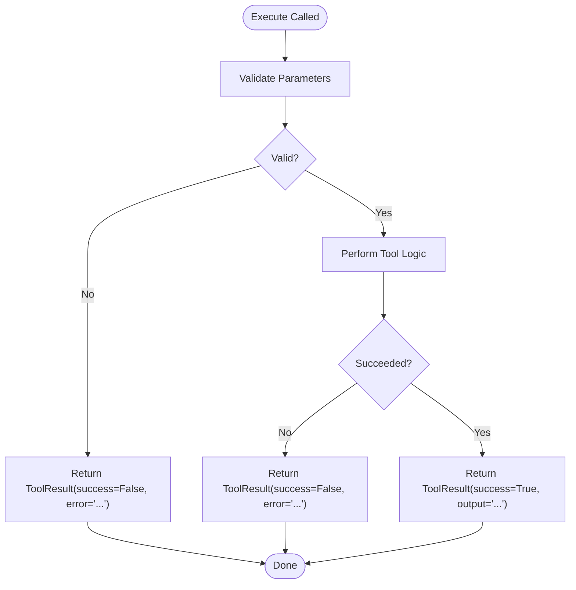

# Tool Base Interface

<cite>
**Referenced Files in This Document**
- [base.py](file://harness/tools/base.py)
- [builtin.py](file://harness/tools/builtin.py)
- [registry.py](file://harness/tools/registry.py)
- [__init__.py](file://harness/tools/__init__.py)
- [protocol.py](file://harness/mcp/protocol.py)
- [demo_agent.py](file://demos/demo_agent.py)
</cite>

## Table of Contents
1. [Introduction](#introduction)
2. [Project Structure](#project-structure)
3. [Core Components](#core-components)
4. [Architecture Overview](#architecture-overview)
5. [Detailed Component Analysis](#detailed-component-analysis)
6. [Dependency Analysis](#dependency-analysis)
7. [Performance Considerations](#performance-considerations)
8. [Troubleshooting Guide](#troubleshooting-guide)
9. [Conclusion](#conclusion)
10. [Appendices](#appendices)

## Introduction
This document explains the Tool Base Interface that powers tool execution in the system. It focuses on:
- The BaseTool abstract class and its metadata attributes (name, description, parameters)
- The ToolResult dataclass used to return execution outcomes
- The execute method contract and how it returns ToolResult objects with success status, output content, and error handling
- The to_description and to_schema methods for generating LLM-readable tool specifications
- Practical examples of implementing custom tools by subclassing BaseTool
- Parameter validation patterns, error handling strategies, and best practices for tool design

## Project Structure
The tool subsystem is organized into focused modules:
- Base definitions and result types live in the base module
- Built-in tools demonstrate concrete implementations
- A registry centralizes tool discovery and execution
- An MCP integration shows dynamic tool creation from remote schemas
- Demos show how agents use the registry and tools

**Diagram sources**
- [base.py:16-66](file://harness/tools/base.py#L16-L66)
- [registry.py:17-67](file://harness/tools/registry.py#L17-L67)
- [builtin.py:13-74](file://harness/tools/builtin.py#L13-L74)
- [protocol.py:193-209](file://harness/mcp/protocol.py#L193-L209)
- [demo_agent.py:21-24](file://demos/demo_agent.py#L21-L24)

**Section sources**
- [__init__.py:1-8](file://harness/tools/__init__.py#L1-L8)
- [base.py:1-66](file://harness/tools/base.py#L1-L66)
- [registry.py:1-74](file://harness/tools/registry.py#L1-L74)
- [builtin.py:1-83](file://harness/tools/builtin.py#L1-L83)
- [protocol.py:190-209](file://harness/mcp/protocol.py#L190-L209)
- [demo_agent.py:1-40](file://demos/demo_agent.py#L1-L40)

## Core Components
- BaseTool: Abstract base defining tool metadata and execution contract
  - name: Identifier used by the model to reference the tool
  - description: Human-readable explanation of what the tool does and when to use it
  - parameters: Schema describing accepted arguments (LLM-facing)
  - execute(**kwargs): Executes the tool logic and returns a ToolResult
  - to_description(): Produces a prompt-friendly string summarizing the tool
  - to_schema(): Produces a JSON-like dict with name, description, parameters
- ToolResult: Dataclass representing execution outcome
  - success: Boolean indicating whether execution succeeded
  - output: String content shown to the model on success
  - error: Optional error message when success is False

These components define a consistent interface for all tools, enabling uniform registration, discovery, and execution by the agent.

**Section sources**
- [base.py:16-66](file://harness/tools/base.py#L16-L66)

## Architecture Overview
The tool architecture centers around BaseTool as the contract, ToolResult as the standardized return type, and ToolRegistry as the orchestrator that registers, lists, and executes tools. Built-in tools and dynamically created MCP tools both conform to this contract.

**Diagram sources**
- [registry.py:43-60](file://harness/tools/registry.py#L43-L60)
- [base.py:30-45](file://harness/tools/base.py#L30-L45)

## Detailed Component Analysis

### BaseTool and ToolResult
BaseTool defines the core contract:
- Metadata attributes: name, description, parameters
- Execution contract: execute(**kwargs) -> ToolResult
- LLM-facing helpers: to_description(), to_schema()

ToolResult encapsulates execution results:
- success: bool
- output: str
- error: Optional[str]

Best practices derived from the base:
- Keep parameters descriptive so the LLM can choose the right tool and pass correct arguments
- Return ToolResult consistently; never raise unhandled exceptions from execute
- Use to_schema() for programmatic tool specs and to_description() for human-readable prompts

**Section sources**
- [base.py:16-66](file://harness/tools/base.py#L16-L66)

### ToolRegistry
ToolRegistry provides:
- Registration: register(tool)
- Lookup: get(name), list_tools()
- Execution: execute(name, arguments) with centralized error handling
- Prompt generation: get_tools_description() aggregates tool descriptions

Execution flow ensures:
- Missing tools return a ToolResult with success=False and an informative error
- Exceptions during tool execution are caught and returned as ToolResult(success=False, error=...)

**Section sources**
- [registry.py:17-67](file://harness/tools/registry.py#L17-L67)

### Built-in Tools Examples
Three built-in tools illustrate common patterns:
- CalculatorTool: Validates input characters, performs safe evaluation, returns ToolResult
- DateTimeTool: Returns formatted date/time based on query parameter
- FileOpsTool: Supports list/read operations with path checks and read limits

Key implementation patterns:
- Input validation before processing
- Clear separation of success and failure paths via ToolResult
- Defensive programming (e.g., limiting file reads, checking paths)

**Section sources**
- [builtin.py:13-74](file://harness/tools/builtin.py#L13-L74)

### Dynamic MCPTool Creation
The MCP integration demonstrates creating a BaseTool subclass at runtime from remote tool info:
- Dynamically sets name, description, parameters from server schema
- Wraps remote calls and maps errors/results to ToolResult

This pattern enables integrating external tool servers while keeping the same BaseTool contract.

**Section sources**
- [protocol.py:193-209](file://harness/mcp/protocol.py#L193-L209)

### Agent Usage
The demo shows how an agent uses the registry:
- Create LLM backend
- Instantiate ToolRegistry
- Register default tools
- Pass registry to TaskAgent for tool-calling loops

This confirms the intended workflow: agent delegates tool selection and invocation to the registry.

**Section sources**
- [demo_agent.py:21-24](file://demos/demo_agent.py#L21-L24)

## Dependency Analysis
High-level dependencies among tool components:
- ToolRegistry depends on BaseTool and ToolResult
- Built-in tools depend on BaseTool and ToolResult
- MCP integration creates subclasses of BaseTool and returns ToolResult
- Demo agent depends on ToolRegistry and built-in tools

**Diagram sources**
- [base.py:16-66](file://harness/tools/base.py#L16-L66)
- [registry.py:17-67](file://harness/tools/registry.py#L17-L67)
- [builtin.py:13-74](file://harness/tools/builtin.py#L13-L74)
- [protocol.py:193-209](file://harness/mcp/protocol.py#L193-L209)
- [demo_agent.py:21-24](file://demos/demo_agent.py#L21-L24)

**Section sources**
- [__init__.py:1-8](file://harness/tools/__init__.py#L1-L8)
- [registry.py:1-74](file://harness/tools/registry.py#L1-L74)
- [builtin.py:1-83](file://harness/tools/builtin.py#L1-L83)
- [protocol.py:190-209](file://harness/mcp/protocol.py#L190-L209)
- [demo_agent.py:1-40](file://demos/demo_agent.py#L1-L40)

## Performance Considerations
- Keep execute lightweight and deterministic where possible
- Avoid blocking I/O inside execute unless necessary; consider asynchronous wrappers if needed
- Limit large outputs (e.g., file reads capped to a reasonable size) to prevent bloating prompts
- Validate inputs early to fail fast and avoid expensive computations on invalid data
- Prefer returning concise, structured strings in ToolResult.output for efficient LLM consumption

[No sources needed since this section provides general guidance]

## Troubleshooting Guide
Common issues and resolutions:
- Tool not found: Ensure the tool is registered in ToolRegistry before execution
- Unexpected exceptions in execute: Wrap logic in try/except and return ToolResult(success=False, error=str(e))
- Invalid parameters: Validate inputs and return ToolResult(success=False, error="...") with clear messages
- Overwritten tools: If registering duplicate names, later registrations overwrite earlier ones; check logs for warnings

Relevant behaviors:
- Registry.execute catches exceptions and returns ToolResult(success=False, error=...)
- Registry.get_tools_description aggregates tool descriptions for prompts

**Section sources**
- [registry.py:43-67](file://harness/tools/registry.py#L43-L67)
- [builtin.py:19-30](file://harness/tools/builtin.py#L19-L30)
- [builtin.py:58-74](file://harness/tools/builtin.py#L58-L74)

## Conclusion
The Tool Base Interface provides a clean, extensible foundation for building tools that integrate seamlessly with the agent. By adhering to the BaseTool contract and using ToolResult consistently, you ensure reliable execution, clear error reporting, and LLM-friendly tool specifications. Built-in tools and dynamic MCP tool creation demonstrate practical patterns for validation, safety, and interoperability.

[No sources needed since this section summarizes without analyzing specific files]

## Appendices

### Implementing a Custom Tool: Step-by-Step
- Subclass BaseTool and set name, description, parameters
- Implement execute(**kwargs) to validate inputs, perform work, and return ToolResult
- Use to_description() and to_schema() for prompt and schema generation
- Register your tool with ToolRegistry and use it through the agent

Example references:
- See built-in tools for concrete patterns of validation and error handling
- See MCP dynamic tool creation for adapting external schemas to BaseTool

**Section sources**
- [base.py:30-66](file://harness/tools/base.py#L30-L66)
- [builtin.py:13-74](file://harness/tools/builtin.py#L13-L74)
- [protocol.py:193-209](file://harness/mcp/protocol.py#L193-L209)

### Tool Execution Flowchart

[No sources needed since this diagram shows conceptual workflow, not actual code structure]