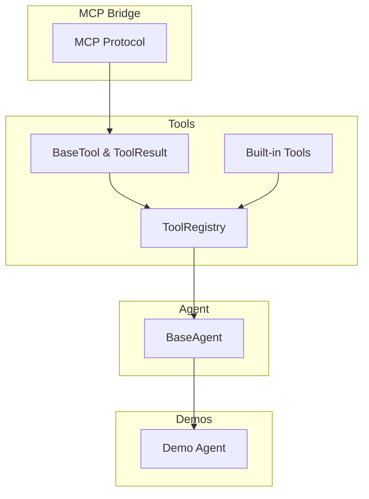
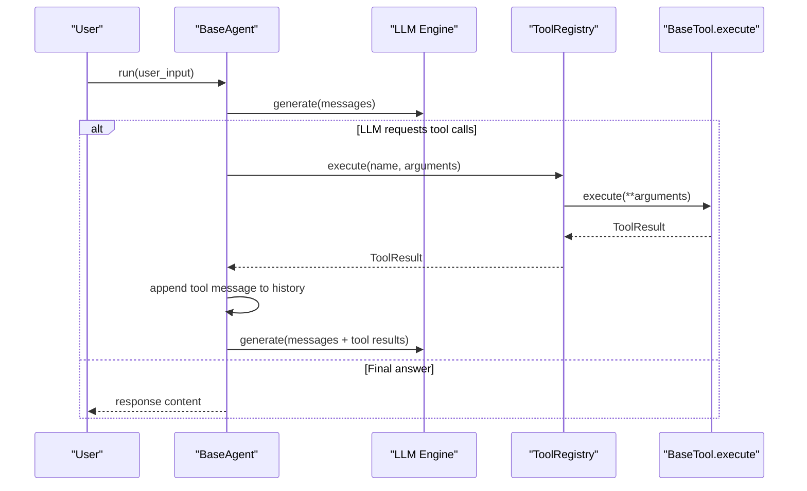
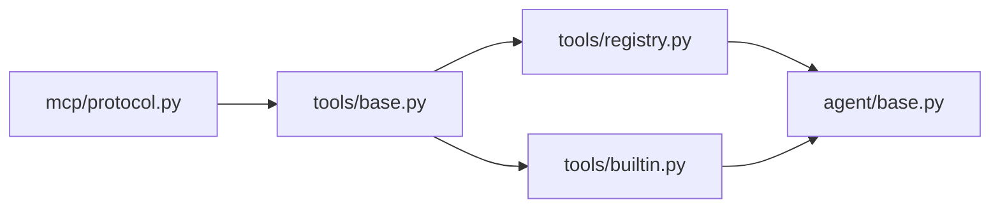

# Tool Integration

<cite>
**Referenced Files in This Document**
- [base.py](file://harness/tools/base.py)
- [registry.py](file://harness/tools/registry.py)
- [builtin.py](file://harness/tools/builtin.py)
- [__init__.py](file://harness/tools/__init__.py)
- [base.py](file://harness/agent/base.py)
- [demo_agent.py](file://demos/demo_agent.py)
- [protocol.py](file://harness/mcp/protocol.py)
</cite>

## Table of Contents
1. Introduction
2. Project Structure
3. Core Components
4. Architecture Overview
5. Detailed Component Analysis
6. Dependency Analysis
7. Performance Considerations
8. Troubleshooting Guide
9. Conclusion
10. Appendices

## Introduction
This document explains the Tool Integration system, an extensible function-calling framework that enables agents to call tools with standardized interfaces. It covers:
- The BaseTool interface for consistent tool development and execution
- The ToolRegistry for discovery, registration, and execution management
- Built-in tools (Calculator, DateTime, FileOps) and usage patterns
- How to create custom tools, handle parameters and results, and implement robust error handling
- Security considerations, performance optimization, and debugging techniques

The system is designed so that any tool can be registered and executed by name, with a uniform result contract and safe execution boundaries.

## Project Structure
The tooling subsystem lives under harness/tools and integrates with the agent loop in harness/agent. A demo shows how to wire everything together.

**Diagram sources**
- [base.py:1-67](file://harness/tools/base.py#L1-L67)
- [registry.py:1-74](file://harness/tools/registry.py#L1-L74)
- [builtin.py:1-83](file://harness/tools/builtin.py#L1-L83)
- [base.py:63-165](file://harness/agent/base.py#L63-L165)
- [demo_agent.py:1-40](file://demos/demo_agent.py#L1-L40)
- [protocol.py:1-224](file://harness/mcp/protocol.py#L1-L224)

**Section sources**
- [base.py:1-67](file://harness/tools/base.py#L1-L67)
- [registry.py:1-74](file://harness/tools/registry.py#L1-L74)
- [builtin.py:1-83](file://harness/tools/builtin.py#L1-L83)
- [base.py:63-165](file://harness/agent/base.py#L63-L165)
- [demo_agent.py:1-40](file://demos/demo_agent.py#L1-L40)
- [protocol.py:1-224](file://harness/mcp/protocol.py#L1-L224)

## Core Components
- BaseTool and ToolResult define the standard contract for all tools and their outcomes.
- ToolRegistry centralizes tool discovery, registration, listing, and execution with error handling.
- Built-in tools demonstrate practical implementations and safety measures.
- The agent loop uses the registry to execute tools returned by the LLM and feed results back into the conversation.

Key responsibilities:
- Standardization: All tools expose name, description, parameters, and execute method.
- Safety: Registry wraps execution in try/except and returns structured ToolResult.
- Extensibility: New tools are added by subclassing BaseTool and registering with ToolRegistry.

**Section sources**
- [base.py:16-67](file://harness/tools/base.py#L16-L67)
- [registry.py:17-74](file://harness/tools/registry.py#L17-L74)
- [builtin.py:13-83](file://harness/tools/builtin.py#L13-L83)
- [base.py:97-160](file://harness/agent/base.py#L97-L160)

## Architecture Overview
The agent orchestrates tool calls through the registry. The LLM decides when to call tools; the agent executes them via the registry and feeds results back to continue reasoning.

**Diagram sources**
- [base.py:97-160](file://harness/agent/base.py#L97-L160)
- [registry.py:43-67](file://harness/tools/registry.py#L43-L67)
- [base.py:30-67](file://harness/tools/base.py#L30-L67)

## Detailed Component Analysis

### BaseTool and ToolResult
BaseTool defines the interface every tool must implement:
- Attributes: name, description, parameters
- Methods: execute(**kwargs) -> ToolResult, to_description(), to_schema()

ToolResult provides a uniform outcome structure:
- success: bool
- output: str
- error: Optional[str]

Benefits:
- Consistent tool signatures enable generic execution and error handling
- Descriptions and schemas support prompt generation and model understanding

**Section sources**
- [base.py:16-67](file://harness/tools/base.py#L16-L67)

### ToolRegistry
ToolRegistry manages the lifecycle of tools:
- register(tool): adds or overwrites a tool by name
- get(name): retrieves a tool instance
- list_tools(): enumerates available tools
- execute(name, arguments): safely invokes a tool and returns ToolResult
- get_tools_description(): builds a combined description string for prompts

Error handling:
- Unknown tool names return a ToolResult with success=False and an informative error
- Exceptions during execution are caught and reported via ToolResult

**Section sources**
- [registry.py:17-74](file://harness/tools/registry.py#L17-L74)

### Built-in Tools

#### CalculatorTool
Purpose: Safely evaluate mathematical expressions provided as strings.
Safety:
- Validates input characters against a strict whitelist
- Replaces caret with power operator
- Uses eval with restricted builtins to prevent arbitrary code execution

Usage pattern:
- Provide expression parameter containing only allowed math operators and numbers

**Section sources**
- [builtin.py:13-31](file://harness/tools/builtin.py#L13-L31)

#### DateTimeTool
Purpose: Return current date/time information based on a query.
Parameters:
- query: "date", "time", or "datetime"

Behavior:
- Returns formatted date, time, or full datetime depending on query

**Section sources**
- [builtin.py:33-47](file://harness/tools/builtin.py#L33-L47)

#### FileOpsTool
Purpose: Read-only file operations for safety.
Operations:
- list: lists directory contents up to a limit
- read: reads a file up to a size limit

Safety:
- Only supports reading files and listing directories
- Limits content length to avoid large outputs

**Section sources**
- [builtin.py:49-75](file://harness/tools/builtin.py#L49-L75)

#### Default Registration
A helper registers all built-in tools into a ToolRegistry for convenience.

**Section sources**
- [builtin.py:77-83](file://harness/tools/builtin.py#L77-L83)

### Agent Integration
The agent loop:
- Builds context messages including tool descriptions from the registry
- Calls the LLM and checks for tool calls
- Executes each tool via the registry and appends tool results to history
- Continues until the LLM returns a final answer or max iterations reached

Tracing:
- AgentTrace records steps like LLM calls, tool calls, and results for debugging

**Section sources**
- [base.py:63-165](file://harness/agent/base.py#L63-L165)

### MCP Bridge (Optional Extension)
The MCP protocol layer demonstrates how external tools can be wrapped as BaseTool instances and integrated into the same execution flow.

Highlights:
- MCPServer exposes tools/resources/prompts
- MCPClient can discover tools and call them remotely
- Wraps remote tool responses into ToolResult for consistency

**Section sources**
- [protocol.py:68-224](file://harness/mcp/protocol.py#L68-L224)

## Dependency Analysis
The tooling components have clear, minimal dependencies:
- ToolRegistry depends on BaseTool and ToolResult
- Built-in tools depend on BaseTool and standard library modules
- Agent depends on ToolRegistry and LLM engine
- MCP bridge adapts remote tools to BaseTool

**Diagram sources**
- [base.py:1-67](file://harness/tools/base.py#L1-L67)
- [registry.py:1-74](file://harness/tools/registry.py#L1-L74)
- [builtin.py:1-83](file://harness/tools/builtin.py#L1-L83)
- [base.py:63-165](file://harness/agent/base.py#L63-L165)
- [protocol.py:1-224](file://harness/mcp/protocol.py#L1-L224)

**Section sources**
- [base.py:1-67](file://harness/tools/base.py#L1-L67)
- [registry.py:1-74](file://harness/tools/registry.py#L1-L74)
- [builtin.py:1-83](file://harness/tools/builtin.py#L1-L83)
- [base.py:63-165](file://harness/agent/base.py#L63-L165)
- [protocol.py:1-224](file://harness/mcp/protocol.py#L1-L224)

## Performance Considerations
- Input validation and whitelisting reduce overhead and risk (e.g., CalculatorTool’s regex guard).
- Limiting output sizes prevents bloated messages (e.g., FileOpsTool caps read length and list size).
- Avoid heavy work inside tools; prefer lightweight operations and delegate to services if needed.
- Use ToolRegistry.execute to centralize error handling and logging, avoiding repeated try/except in tools.
- Keep tool schemas concise to minimize prompt size and improve model comprehension.

[No sources needed since this section provides general guidance]

## Troubleshooting Guide
Common issues and remedies:
- Unknown tool name: The registry returns a ToolResult with success=False and lists available tools. Verify registration and spelling.
- Tool execution errors: Exceptions are caught and surfaced in ToolResult.error. Inspect logs and adjust tool logic or inputs.
- Infinite loops: The agent enforces max_iterations to prevent runaway cycles. Tune limits and ensure tools provide deterministic progress.
- Debugging: Enable verbose mode in the agent to print tool calls and results. Use AgentTrace to review step-by-step execution.

Practical references:
- Registry error paths and logging
- Agent loop tracing and verbose output
- Demo wiring showing how to set up tools and run tasks

**Section sources**
- [registry.py:43-67](file://harness/tools/registry.py#L43-L67)
- [base.py:38-60](file://harness/agent/base.py#L38-L60)
- [base.py:97-160](file://harness/agent/base.py#L97-L160)
- [demo_agent.py:15-39](file://demos/demo_agent.py#L15-L39)

## Conclusion
The Tool Integration system provides a clean, extensible framework for function calling:
- BaseTool standardizes tool contracts and results
- ToolRegistry centralizes discovery and safe execution
- Built-in tools illustrate best practices for safety and usability
- The agent loop seamlessly integrates tools into conversational reasoning
- MCP bridging enables remote tool integration while preserving the local interface

Adopt these patterns to build secure, performant, and debuggable tools that integrate smoothly with the agent ecosystem.

[No sources needed since this section summarizes without analyzing specific files]

## Appendices

### Creating Custom Tools
Steps:
1. Subclass BaseTool and define name, description, parameters
2. Implement execute(**kwargs) returning ToolResult
3. Register your tool with ToolRegistry.register
4. Optionally use register_default_tools to bundle built-ins

References:
- BaseTool interface and ToolResult
- Built-in tool examples
- Registry registration API

**Section sources**
- [base.py:30-67](file://harness/tools/base.py#L30-L67)
- [builtin.py:13-83](file://harness/tools/builtin.py#L13-L83)
- [registry.py:28-41](file://harness/tools/registry.py#L28-L41)

### Handling Parameters and Results
- Define parameters as a dict describing expected inputs
- Validate inputs early in execute and return ToolResult(success=False, error=...) for invalid cases
- Always return ToolResult with success=True and meaningful output on success

References:
- Parameter schema usage in built-in tools
- Error reporting via ToolResult

**Section sources**
- [builtin.py:13-75](file://harness/tools/builtin.py#L13-L75)
- [base.py:16-28](file://harness/tools/base.py#L16-L28)

### Security Considerations
- Never pass untrusted user input directly to exec or unrestricted eval
- Use strict input validation (e.g., regex allowlists) before evaluation
- Restrict filesystem access to read-only operations where possible
- Limit output sizes to prevent memory pressure and prompt bloat
- Centralize error handling to avoid leaking sensitive stack traces

References:
- CalculatorTool’s safe evaluation approach
- FileOpsTool’s read-only constraints and size limits

**Section sources**
- [builtin.py:13-75](file://harness/tools/builtin.py#L13-L75)

### Debugging Techniques
- Use AgentTrace to capture LLM calls, tool calls, and results
- Enable verbose logging in the agent to see tool invocations and outputs
- Log warnings/errors in ToolRegistry for missing tools or failures
- Inspect ToolResult fields to diagnose success/failure and error messages

References:
- Agent trace recording and summary
- Registry logging and error paths

**Section sources**
- [base.py:38-60](file://harness/agent/base.py#L38-L60)
- [registry.py:28-67](file://harness/tools/registry.py#L28-L67)

### Example Usage Patterns
- Initialize a ToolRegistry and register default tools
- Create an agent with the registry and run tasks that trigger tool calls
- Observe tool usage for calculations, date/time queries, and file listings

Reference:
- Demo script wiring and task execution

**Section sources**
- [demo_agent.py:15-39](file://demos/demo_agent.py#L15-L39)